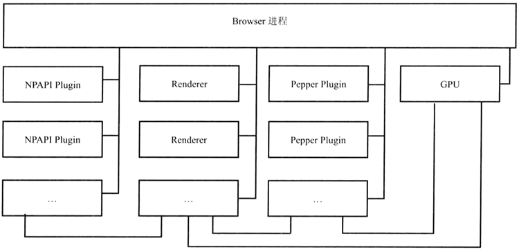
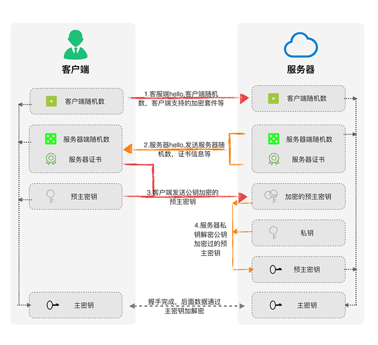
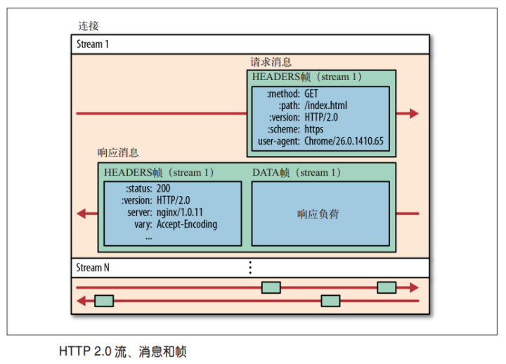

整个过程中，涉及浏览器原理的部分主要以 Chrome 浏览器为主。

## 环境准备

> 冷启动：启动应用时后台没有该应用的进程，系统需要重新创建一个新的进程分配给该应用

> 热启动：启动应用时后台已有该应用的进程，例如按 back 或 home 键时，应用虽然会退出，但其进程可能会依然保留在后台；在已有进程的情况下，应用会从已有的进程启动

浏览器可以分为 4 类：

* WebView
* 内置浏览器
* 可下载浏览器
* 代理浏览器

其中，除 WebView 外，其它三类的表现与普通浏览器无异，用户使用均需要先打开浏览器后输入 URL。涉及环境准备的场景主要有：

* WebView 启动时的初始化
* 普通浏览器之前页面的卸载

#### WebView 初始化

与浏览器不同的是，WebView 无论是冷启动还是热启动，往往都存在一个初始化的过程，即当 App 有打开网页需求时才会初始化 WebView，所以，就存在明显的环境准备时间，在环境准备的过程中，页面处于无反馈阶段。


目前主流的 WebView 主要有：

- IOS 的 UIWebView 和 WKWebView（≥ 8的 IOS 中新设计的高性能 WebView，区别见参考文章）
- Android 的 Android WebView

三种WebView环境的初始化时间（单位：ms）：

|                 | 首次/冷启动初始化时间 | 二次/热启动初始化时间 |
| --------------- | --------------------- | --------------------- |
| IOS UIWebView   | 306.56                | 76.43                 |
| IOS WKWebView   | 763.26                | 457.25                |
| Android WebView | 192.79                | 142.53                |

其中：

- 冷启动初始化时间，指客户端第一次打开 WebView，从开始创建 WebView 到开始建立网络连接之间的时间
- 热启动初始化时间，指打开过 WebView 后退出，再重新打开 WebView，从开始创建 WebView 到开始建立网络连接之间的时间

##### 优化建议

无论是冷启动还是热启动，WebView 的环境准备时间（大约70~700ms）几乎是不可避免的，尤其在 IOS 中普遍采用更高性能的 WKWebView 时，其初始化时间相较 UIWebView 更长

优化的思路及方法：

- 缩短 WebView 环境准备时间，具体的措施是提前初始化 WebView - 在 APP 启动或页面需要加载前，提前初始化全局 WebView 待用。例如，[东软专利 - 加载网页的方法及装置](https://patents.google.com/patent/CN106250434A/zh)
- 利用 WebView 环境准备时间，初始化 WebView 的同时让 Native 先行代理执行部分任务。例如，在 Hybrid 中优化 H5 的思路通常是离线缓存 + 增量更新，即将页面拆分成固定不变和动态改变的两部分，固定不变的部分离线缓存在用户本地，动态改变的部分（通过 diff 算法得到的改变部分）在 WebView 初始化的时间进行加载，然后将两部分数据进行混淆，在 WebView 完成启动后直接显示混淆结果；当然，离线缓存及增量数据更新已经脱离了 WebView，需要 Native 提供 Bridge 进行支持。例如， [手机QQ Hybrid架构演进](https://mp.weixin.qq.com/s/evzDnTsHrAr2b9jcevwBzA?)

##### 参考

- [WebView性能、体验分析与优化](https://tech.meituan.com/WebViewPerf.html)
- [WKWebView与UIWebView区别](https://www.jishux.com/p/eacbdb77aba4da89)
- [使用WKWebView替换UIWebView](https://www.cnblogs.com/496668219long/p/4987481.html)
- [手机QQ Hybrid 架构的优化演进](https://mp.weixin.qq.com/s/evzDnTsHrAr2b9jcevwBzA?)

#### 页面卸载

在浏览器中，如果用户在已有页面/标签页输入新的地址时，浏览器需要卸载之前的页面。卸载的过程会依次触发 beforeunload、pagehide 和 unload 事件，可以在这些事件的回调中保存页面数据。

```
window.addEventListener('beforeunload', function (e) {
	// ...卸载时保存页面数据...
	
	/**
	 * 也可以使用e.returnValue提示用户是否关闭，需要注意，
	 * 浏览器可能显示自己的提示，而不是开发者设置的提示信息
	 */ 
	e.returnValue = '确认关闭吗？';
}, false);
```

需要注意的是：

* 依赖这些事件可能是不牢靠的，因为在**移动设备**中，促使当前页面卸载的方式很多，比如
  * 用户切换 tab，导致之前页面已经进入后台，但设备可能为了回收内存空间主动卸载页面
  * IOS 中双击（不是点触式双击） Home 键，当进入系统的 switcher 页面后切换应用
* 当切换标签时，页面可能并不会被卸载，只是暂时进入后台，可以使用[页面可见性 API ](https://developer.mozilla.org/zh-CN/docs/Web/API/Page_Visibility_API)监控环境的这种行为并作出相应的反应，比如隐藏页面时停止播放视频或轮播图，显示时继续播放

## 接受 URL -> 开启请求

浏览器或 WebView 接受 URL 到正式发起请求页面资源的过程。

#### 多进程模型

对于 Chromium 浏览器，其主要进程：



* Browser 进程：浏览器主进程，负责浏览器界面的显示、各个页面的管理，是所有其它进程的祖先，负责其它进程的创建和销毁工作，有且仅有一个
* Renderer 进程：渲染进程，负责页面渲染工作。该进程支持 4 种模式：
  * Process-per-site-instance：一个 site instance（通过一个页面上的链接连续打开的多个页面）一个进程
  * Process-per-site：同一个域下的页面共享同一个 Renderer 进程
  * Process-per-tab：一个标签页一个进程
  * Single process：不为页面创建独立进程，渲染均在 browser 进程中进行，它们只是 browser 进程中的不同线程。主要用于移动设备
* NPAPI 插件进程：为 NPAPI 插件创建的进程，基本原则是每种类型的插件进程只会被创建一次，而且仅在使用时创建；同时，不可与 GPU 进程通信，即不享有 GPU 进程加速的能力
* Pepper 插件进程：同 NPAPI 插件进程基本类似，但是可与 GPU 进程通信
* GPU 进程：主要用于 3D 图形加速调用的实现，最多只有一个
* 图中未列出的其它类型的进程，例如：
  * Linux 下的“Zygote”进程，Renderer 进程其实就是由它创建而来的
  * Sandbox 准备进程

基于 Chromium 多进程模型，页面需要一个 Renderer 进程，但是否新建 Renderer 进程取决于当前浏览器的状态。《WebKit 技术内幕》及各网络文章中均认为 Process-per-site-instance 是 Renderer 进程创建的默认模式，但个人测试发现：在 Mac Chrome 70 中 Process-per-site 才是 Renderer 进程创建的默认模式，如下图。

所以，如果浏览器已经存在同域页面，将复用 Renderer 进程；否则，Browser 进程创建新的 Renderer 进程。


##### 优化建议

* 有限度地开启 GPU 进程加速，GPU 加速是在满足特定条件下才会触发的
  * 使用 CSS translate3d 触发 GPU 加速
  * 避免使用 NPAPI 插件，比如，Flash

#### 多线程模型

> GUI，Graphical User Interface，图形用户界面

为了保证 UI 的高响应度，每个 Chromium 进程都有多个线程，使得各个进程中的主要线程，尤其是渲染线程不被高耗时的操作阻碍，例如，本地文件读写、socket 读写、数据库操作等。

渲染相关的线程主要有：

- 网络请求线程
- GUI 线程
- JS 引擎线程
- 事件触发线程
- 定时器线程

每次网络请求都需要开辟单独的线程进行。如果 URL 解析到 HTTP 协议，就会新建网络线程去处理资源下载。

#### 缓存直取

并非每个资源都必须发起网络请求，比如

* 强缓存，指由 Expires 和 Cache-Control 控制的本地缓存
* 离线缓存，Service Worker 通过 Cache Storage 缓存的资源

##### 200 与 304

资源请求获得 200 状态码的场景：

* 从网络正确下载的资源时
* 强缓存获取本地资源时，包括 200（from disk cache）、200（from memory cache）

资源请求获得 304 状态码的场景：

* 协商缓存，浏览器向服务端发起 HTTP 请求，通过缓存协商获知本地文件未改变时

需要注意的是：

* 对于强缓存，在未过期时，必须更新资源路径（此时相当于一个新的资源）才能发起新的请求
* 对于协商缓存，使用 `Ctrl+F5` 强制刷新可以使缓存无效

##### 优化建议

利用本地缓存，避免再次网络获取：

* 开启强缓存：配置 Expires 和 Cache-Control 响应头
* 开启协商缓存：配置 Last-Modified 和 Etag 响应头（协商缓存依旧需要用于协商的 HTTP 请求）
* 开启离线缓存：基于 Service Worker 问题和实测性能，**是否开始离线缓存有待商酌**
* 消灭 304

#### URL 解析

浏览器调用 URL 函数解析库，对输入的 URL 进行解析，URL 一般包括几大部分：

- protocol，协议头，比如有 http，ftp 等
- host，主机域名或 IP 地址
- port，端口号
- path，目录路径
- query，查询参数
- fragment，即 # 后的 hash 值，一般用来定位到页面某个位置

#### DNS 解析

DNS 解析是通过 URL host 得到资源 IP 地址的过程。大致流程：

* 查询浏览器 DNS 解析缓存，有则使用浏览器缓存
* 查询本机 DNS 解析缓存，有则使用本机缓存
* 查询 DNS 域名服务器（当然，中间可能还会经过路由，也有缓存等）

在查询 DNS 域名服务器时，查询细节会因为具体的情况而不同：

* 未使用 CDN 时，DNS 解析获取域名 A 记录，直接得到 IP 地址
* 使用 CDN 时，DNS 首次解析可能获得资源域名的 CNAME 记录，浏览器需要对得到的 CNAME 记录再次解析；再次解析时，CDN 系统会根据用户的地理位置和网络状态动态返回资源对应的 IP 地址

##### 优化建议

DNS 解析是很耗时的，尤其是解析域名过多时，会让首屏加载变得过慢。优化的思路及方法：

* 减少 DNS 查询次数，在不影响多域名并行下载数量的前提下，合理减少域名数量

* 减少 DNS 查询耗时，使用 DNS-prefetch 提前进行 DNS 查询。需要注意的是，在 HTTPS 协议下，出于安全考虑，**a 标签链接**的 DNS 预解析默认被关闭，需要使用 meta 标签强制开启 a 链接域名预解析：

  ```
  <meta http-equiv="x-dns-prefetch-control" content="on">
  ```

## 前后端交互

#### 五层模型

计算机网络有 OSI 七层模型和 TCP/IP 五层模型两种。通常，五层模型更容易理解：

1. 应用层(DNS, HTTP) ：DNS 解析成 IP 并发送 HTTP 请求
2. 传输层(TCP, UDP) ：通过三次握手建立 TCP 连接
3. 网络层(IP, ARP) ：IP寻址
4. 数据链路层(PPP) ：封装成帧
5. 物理层 ：物理传输，利用物理介质（双绞线，电磁波等各种介质）传输比特流

数据在五层模型中的流动：

* 客户端：应用层 -> 传输层 -> 网络层 -> 数据链路层 -> 物理层
* 服务端：物理层 -> 数据链路层 -> 网络层 -> 传输层 -> 应用层

七层模型是在应用层和传输层之间多了表示层和会话层：

* 表示层：数据格式的转换，如加密解密、转换翻译、压缩解压缩等

- 会话层：负责建立、管理和维护会话，如控制登陆和注销过程

**数据在每一层中的具体处理过程参见《95-深入理解之TCPIP》**

#### HTTP请求

前后端交互时，HTTP 报文作为信息的载体。

##### 报文结构

报文的主要部分包括起始行、请求/响应头部、 请求/响应体，辅助部分包括空行和 CRLF。其基本格式：

* 请求报文：

  ```
  <method> <request-url> <version>					# 起始行
  <headers>							# 首部
  
  <entity-body>					# 实体
  ```

* 响应报文：

  ```
  <version> <status-code> <reason-phrase>		# 起始行
  <headers>							# 首部
  
  <entity-body>					# 实体
  ```

下图是一个常见请求的报文信息 (注意：这些信息是解析后的，点击 Request Headers/Response Headers 右侧的 “view source” 可以查看原始报文首部结构)


###### 起始行

上图 General 中的信息就是解析自起始行：

```
- Request Url：来自请求起始行，请求的web服务器地址
- Request Method：来自请求起始行，请求方式
- Status Code：来自响应起始行，状态码，如200代表成功
- Remote Address：请求目标服务器地址（会转为IP）
```

其中，Method的规范定义分为两批次：

```
- HTTP 1.0 定义了三种请求方法：GET, POST 和 HEAD 方法。
- HTTP 1.1 新增了五种请求方法：OPTIONS, PUT, DELETE, TRACE 和 CONNECT 方法。
```

最常用到的就是状态码，当请求出错时，状态码能帮助快速定位问题：

```
- 200——表明该请求被成功地完成，所请求的资源发送回客户端
- 304——自从上次请求后，请求的网页未修改过，请客户端使用本地缓存
- 400——客户端请求有错（比如可以是安全模块拦截）
- 401——请求未经授权
- 403——禁止访问（比如可以是未登录时禁止）
- 404——资源未找到
- 500——服务器内部错误
- 503——服务不可用
- ...
```

不同范围状态码的大致意义：

```
- 1xx——指示信息，表示请求已接收，继续处理
- 2xx——成功，表示请求已被成功接收、理解、接受
- 3xx——重定向，要完成请求必须进行更进一步的操作
- 4xx——客户端错误，请求有语法错误或请求无法实现
- 5xx——服务器端错误，服务器未能实现合法的请求
```


###### 头部

ASCII 文本格式，包含请求或响应的附加信息。

常用的请求头部：

```
- Accept: 接收类型，表示浏览器支持的 MIME 类型（对标服务端返回的 Content-Type）
- Accept-Encoding：浏览器支持的压缩类型，如Gzip等，超出类型不能接收
- Accept-Language：浏览器支持的语言类型，如zh-CN，优先支持排在前面的语言
- Content-Type：客户端发送出去实体内容的类型
- Expires：缓存控制，在这个时间内不会请求，直接使用缓存，HTTP1.0，而且是服务端时间
- Max-age：代表资源在本地缓存多少秒，有效时间内不会请求，而是使用缓存，HTTP1.1中
- Cache-Control: 指定请求和响应遵循的缓存机制，如no-cache
- If-Modified-Since：对应服务端的Last-Modified，用来匹配看文件是否变动，只能精确到1s之内，HTTP1.0中
- If-None-Match：对应服务端的ETag，用来匹配文件内容是否改变（非常精确），HTTP1.1中
- Cookie：有Cookie并且同域访问时会自动带上
- Connection：当浏览器与服务器通信时对于长连接如何进行处理,如keep-alive
- Host：请求的服务器URL
- Origin：最初的请求是从哪里发起的（只会精确到端口）,Origin比Referer更尊重隐私
- Referer：该页面的来源URL(适用于所有类型的请求，会精确到详细页面地址，csrf拦截常用到这个字段)
- User-Agent：用户客户端的一些必要信息，如UA头部等
```

常用的响应头部：

```
- Access-Control-Allow-Headers: 服务器端允许的请求Headers
- Access-Control-Allow-Methods: 服务器端允许的请求方法
- Access-Control-Allow-Origin: 服务器端允许的请求Origin头部（比如为*）
- Content-Type：服务端返回的实体内容的类型
- Content-Length：服务端返回的实体内容的长度
- Date：数据从服务器发送的时间
- Expires：应该在什么时候认为文档已经过期,从而不再缓存它
- Max-age：客户端的本地资源应该缓存多少秒，开启了Cache-Control后有效
- Cache-Control：告诉浏览器或其他客户，什么环境可以安全的缓存文档
- Last-Modified：请求资源的最后修改时间
- ETag：请求变量的实体标签的当前值
- Set-Cookie：设置和页面关联的Cookie，服务器通过这个头部把Cookie传给客户端
- Keep-Alive：如果客户端有keep-alive，服务端也会有响应（如timeout=38）
- Server：服务器的一些相关信息
```

一般来说，请求头部和响应头部是匹配分析的。例如：

* 请求头部的 Accept 要和响应头部的 Content-Type 匹配，否则会报错
* 跨域请求时，请求头部的 Origin 要匹配响应头部的 Access-Control-Allow-Origin，否则会报跨域错误
* 使用强缓存时，请求头部的 Expires、Cache-Control、Max-age 与响应头部的 Expires、Cache-Control
* 使用协商缓存时，请求头部的 If-Modified-Since、If-None-Match 与响应头部的 Last-Modified、 ETag
* 使用长连接时，请求头部的 Connection 和响应头部的 Keep-Alive
* 使用 Cookie 时，请求头部的 Cookie 和响应头部的 Set-Cookie

###### 实体

消息实体是可选的，包含 HTTP 要传输的内容，格式可以是文本、二进制数据或者空，一般来说：

* 请求实体，放置用于 post 请求的参数。比如：
  * 参数序列化形式（ `a=1&b=2`这种）
  * 表单对象（ `FormData` 对象，上传时可以夹杂参数以及文件）
* 响应实体，放置服务端需要传给客户端的内容。比如：
  * 接口请求时，通常是 json 数据
  * 页面请求时，直接放 html 字符串，然后浏览器自己解析并渲染

###### 空行

首部与实体之间必须有一个空行

###### CRLF

CRLF，Carriage-Return Line-Feed，回车换行，由一个回车符（ASCII 13）和一个换行符组成（ASCII 10），作为报文中每行的结束标志

##### HTTPS

HTTPS，或称 HTTP over TLS/SSL，Hypertext Transfer Protocol Secure，超文本安全传输协议，是 HTTP 协议的安全版本，是一种透过计算机网络进行安全通信的传输协议。严格地讲，HTTPS 并不是一个单独的协议，而是对工作在一加密连接（TLS或SSL）上的常规 HTTP 协议的称呼。

HTTPS 开发的主要目的是提供对网站服务器的身份认证，保护交换数据的隐私与完整性。

HTTPS 协议的基本特点：

- HTTP 的 URL 由 “http://” 起始且默认使用端口 80，HTTPS 的 URL 由 “https://” 起始且默认使用端口 443
- 在进行 HTTPS 通信前，会建立 SSL 连接，以确保接下来的通信都是加密的
- 要使一网络服务器接受 HTTPS 连接，管理员必须创建一数字证书，并交由证书颁发机构签名以使浏览器接受。HTTPS 请求只能被添加了对应数字证书的应用层代理拦截，第三方攻击者就无计可施了

###### SSL/TLS

SSL，Secure Sockets Layer，安全套接层，Netscape 1994 年提出用于加密 HTTP 协议的一种安全协议。

TLS，Transport Layer Security，传输层安全协议，标准化组织 IETF 对 SSL 进行标准化后的协议名称，可以说是 SSL 协议的后续版本或者国际标准化版本，所以，通常用 SSL 统一指代 SSL 和 TLS。

SSL/TLS 协议可分为两层：

- 记录协议（Record Protocol）：为应用层协议提供数据封装、压缩、加密等基本功能，相当于表示层功能
- 握手协议（Handshake Protocol）：在数据传输开始前，进行认证通讯双方身份、协商加密算法、交换加密密钥等创建会话的操作，相当于会话层功能

从 SSL/TLS 协议的两层划分看，其属于应用层协议，在[维基百科的协议分层](https://zh.wikipedia.org/wiki/%E5%82%B3%E8%BC%B8%E5%B1%A4%E5%AE%89%E5%85%A8%E6%80%A7%E5%8D%94%E5%AE%9A)中，也确实将其划分为应用层协议。

但是，对应用程序而言，SSL/TLS 是透明的，传送的是应用程序数据，使用 SSL/TLS 的应用程序确实将其用作传输协议，所以，从这个角度看，其属于传输层协议。

总之，无法用 OSI 参考模型或者由此演变的 TCP/IP 五层模型来严格界定 SSL/TLS 协议到底属于哪一层，较为准确的表达方法是：**SSL/TLS 协议作用于应用层和传输层之间**。

SSL/TLS 协议有两种主要的握手类型：一种基于 RSA，一种基于 DH（Diffie-Hellman），这两种握手类型的主要区别在于**主秘钥交换和认证**上。

| 握手 | 秘钥交换 | 身份验证 |
| ---- | -------- | -------- |
| RSA  | RSA      | RSA      |
| DH   | DH       | RSA/DSA  |

1. RSA 握手工作机制

   

   ```
   1. 客户端，请求创建安全连接，请求报文包含客户端随机数、支持的密码套件(包括加密密码算法和加密哈希函数)
   2. 服务端，基于客户端信息决定加密和散列函数，响应报文包含服务端随机数、数字证书(包括服务器名称、受信任的证书颁发机构（CA）和服务器公钥)
   3. 客户端，确认服务端证书有效性，验证通过后，报文中包含服务端公钥加密的客户端随机生成的预主密钥
   4. 服务端，使用自己的私钥解密客户端报文得到预主密钥
   5. 客户端与服务器使用相同的算法根据{客户端随机数 + 服务器随机数 + 预主秘钥}生成主密钥，之后的通信均使用主密钥加密和解密
   ```

2. DH 握手工作机制

   DH 握手是一种更加安全的握手机制，有时间可查看参考文章。

参考：

- http://www.nsoad.com/Article/Network-security/20161015/570.html
- https://razeen.me/post/ssl-handshake-detail.html
- http://www.ruanyifeng.com/blog/2014/09/illustration-ssl.html

###### 工作机制


HTTPS 经由 HTTP 进行通信，但是在 HTTP（应用层）与 TCP（传输层）之间增加了一个用于加密数据的 SSL/TLS 安全层，其向运行 HTTP 的进程提供一个类似于 TCP 的套接字：

- 从应用层获得未加密的请求报文，将报文加密（首部和主体均会加密）并注入传输层套接字
- 从传输层获得加密的响应报文，解密后交给对应的进程

具体工作机制同 SSL/TLS 握手机制。

**需要注意的是：**HTTPS 开销要比 HTTP 要大，因为需要额外建立安全链接以及加密等，所以，HTTPS 与 HTTP/2 配合的性能更好。

##### HTTP/2

HTTP/2 是 2015 年发布的 HTTP 协议的第二个版本。在与 HTTP/1.1 完全语义兼容的基础上，进一步减少了网络延迟，大幅度的提升了 web 性能。在 HTTP/2 中，HTTP1.1 中的优化方案，比如：减少请求数量的雪碧图、静态资源多域名等将不再需要。

相比于 HTTP 1.x，HTTP/2的主要新特性：

- 多路复用
- 二进制分帧
- 首部压缩
- 服务端推送
- 请求优先级

###### 多路复用

一个 TCP/IP 连接可以请求多个资源，而 HTTP 1.1 中一个资源对应一个 TCP/IP 请求，同一域名下的请求有一定数量限制，超过限制数目的请求会被阻塞。所以，在 HTTP 1.1 中，常采用多域名的方式提高并行下载数量。


因此，HTTP/2 可以很容易的实现多流并行而不用依赖建立多个 TCP/IP 连接，HTTP/2 把 HTTP 协议通信的基本单位缩小为一个一个的帧，这些帧对应着逻辑流中的消息，它们并行在同一个 TCP/IP 连接上。

###### 二进制分帧

在不改变 HTTP/1.x 的语义、方法、状态码、URI 、首部字段等规范的前提下，HTTP/2 主要通过在应用层和传输层 (TCP or UDP) 之间增加一个二进制分帧层，从而突破 HTTP 1.x 的性能限制，改进传输性能，实现低延迟和高吞吐量。


在二进制分帧层中， HTTP/2 会将所有传输的信息分割为更小的消息和帧（frame），并对它们采用二进制格式的编码。其中，HTTP 1.x 首部信息被封装到 HEADER frame，实体则封装到 DATA frame 中。

在过去， HTTP 性能优化的关键并非高带宽，而是低延迟。TCP 连接会随着时间进行自我调谐，起初会限制连接的最大速度，如果数据成功传输，会随着时间的推移提高传输的速度，这种调谐称为 TCP 慢启动。因此，原本就具有突发性和短时性的 HTTP 连接变的十分低效。

HTTP/2 通信都在一个连接上完成，这个连接可以承载任意数量的双向数据流。HTTP/2 通过让所有数据流共用同一个连接，可以更有效地使用 TCP 连接，让高带宽也能真正的服务于 HTTP 的性能提升。

HTTP/2 采用单 TCP/IP 连接方式，带来的性能提升主要体现在：

* 服务器端，单连接多资源的方式减少服务器连接压力，内存占用更少，连接吞吐量更大
* 网络传输，TCP/IP 连接的减少改善了网络拥塞状况，同时慢启动时间的减少，使拥塞和丢包恢复速度更快



###### 首部压缩

HTTP/1.1 并不支持 HTTP 首部压缩，HTTP/2 使用了专门为首部压缩设计的 HPACK 算法压缩首部。


###### 服务端推送

服务端推送，Server Push，是一种在客户端请求之前发送数据的机制。

在 HTTP/2 中，服务器可以对客户端的一个请求发送多个响应。Server Push 让 HTTP 1.x 时代使用内嵌资源的优化手段变得没有意义；如果一个请求是由你的主页发起的，服务器很可能会提前响应主页内容、logo 图片以及样式表等，因为它知道客户端会用到这些东西。这相当于在一个 HTML 文档内集合了所有的资源。

此外，服务器推送还有一个很大的优势：可以缓存！即一个页面请求的资源，比如 js、css 文件等，可以缓存然后提供给其他也使用这些资源的页面。


###### 请求优先级

多路复用带来一个新的问题是，在连接共享的基础之上有可能会导致关键请求被阻塞。HTTP/2 允许给每个请求设置优先级，这样重要的请求就会优先得到响应。比如，首页的html内容应该优先展示，之后才是静态资源，这样可以保证用户第一时间看到网页内容。

###### 参考

- https://www.zhihu.com/question/34074946
- https://zh.wikipedia.org/wiki/HTTP/2

##### SPDY

> SPDY = speedy /'spiːdɪ/ adj. 快的；迅速的；敏捷的

SPDY 并非首字母缩略字，而是 "speedy" 的缩写，一种 Google 开发的基于 TCP 的应用层协议。它是 HTTP/2 的前身，HTTP/2 的关键功能主要来自 SPDY。

SPDY 与 HTTP/2 的不同主要在首部压缩算法：

* SPDY 使用通用的 DEFLATE 算法 (请求报文首部 Accept-Encoding 中也有这种算法)
* HTTP/2 使用专门为首部压缩设计且更加安全的 HPACK 算法

2015年，HTTP/2 发布之后，Google 宣布停止支持 SPDY 协议。

##### 优化建议

###### get & post

get 和 post 本质都是 TCP/IP 连接，但除了 HTTP 层面外，两者在 TCP/IP 层面也有区别：get 产生一个 TCP 数据包，post 两个。具体就是：

- get 请求时，浏览器会把 headers 和 data一起发送出去，服务器响应 200（返回数据）
- post 请求时，浏览器先发送 headers，服务器响应 100continue，浏览器再发送 data，服务器响应 200（返回数据）。

再说一点，这里的区别是 specification（规范）层面，而不是 implementation（对规范的实现）。基于两者的区别，尽量使用get请求。

###### Cookie 优化

Cookie 是一种浏览器本地存储方式，为无状态的 HTTP 而生，主要用来进行身份校验，结合服务端 Session 使用


- 用户登陆后，服务端会生成一个 session，session 中有用户信息（如用户名、密码等）；然后会有一个sessionid（相当于服务端 session 对应的key）
- 服务端通过 set-cookie 响应头在登录页面写入 Cookie，值就是 jsessionid=xxx
- 浏览器根据响应头种下 Cookie，以后访问同域名下的页面时，自动带上 Cookie，自动检验，在有效时间内无需二次登陆。

**需要注意的是**，Cookie 不应该存放敏感信息，尤其是明文存储用户名与密码，因为非常不安全；如果一定要强行存储，首先设置 HTTPonly，另外考虑 RSA 等非对称加密（因为浏览器本地也是容易被攻克的，并不安全）。

Cookie 的优化策略：

* 减少 Cookie 数量
* 静态资源域名，页面请求同域名资源时，浏览器会默认带上本地 Cookie。针对这种不必要 Cookie 携带，同时为了避免过多的 DNS 解析时间，可以将静态资源放到有限数量的不同域名下。

###### Gzip 压缩

Gzip 是一种压缩格式，压缩效率可达 70% 左右，现在浏览器一般都支持。通常情况下，需要 Apache、 Tomcat 等 Web 服务器开启 Gzip 压缩。

除 Gzip 外，服务器还有其它压缩格式，如 deflate，但没 Gzip 高效。

###### 长连接与短连接

主要用于 HTTP 1.x，HTTP/2 中本身就是长连接了。

TCP/IP 层面：

- 长连接：一个 TCP/IP 连接上可以连续发送多个数据包，在 TCP 连接保持期间，如果没有数据包发送，需要双方发检测包以维持此连接，一般需要自己做在线维持（类似于心跳包）
- 短连接：通信双方有数据交互时，就建立一个 TCP 连接，数据发送完成后，则断开此 TCP 连接

HTTP 层面：

- HTTP 1.0 中，默认使用短连接，即每一个静态资源请求都是一个单独的连接，任务结束就中断连接
- HTTP 1.1 起，默认使用长连接，请求首部 `Connection: keep-alive` ，响应首部 `keep-alive:(timeout)` 。此时，客户端与服务端之间传输 HTTP 的 TCP 连接不会关闭，会继续复用

需要注意的是：

* 长连接需要客户端和服务器都支持时才有效
* keep-alive 不会永远保持，它有一个一般在服务器中配置（如 Apache）的持续时间

#### TCP/IP 请求

TCP/IP 协议建立连接时需要三次握手，断开连接时需要四次挥手。


其中：

- ACK，Acknowledgement，确认应答
- SYN，Synchronize Sequence Number，同步序列号，用来建立连接
- FIN，Finish，用于断开连接

##### 三次握手

建立一个 TCP 连接需要发送 3 个包，这个过程称为“三次握手”。

三次握手的目的是同步连接双方的序列号 SYN 和确认号 ACK，并交换 TCP 窗口大小信息。

###### 过程

三次握手的过程：

1. 第一次握手，客户端发送请求连接报文
   - SYN = x，客户端请求连接 SYN
2. 第二次握手，服务端收到请求连接报文后发送 ACK + SYN 报文
   - ACK = x + 1，作为对客户端请求报文的确认应答
   - SYN = y，服务端自己的请求连接 SYN
3. 第三次握手，客户端收到服务端 ACK + SYN 报文后发送 ACK 报文
   - ACK = y + 1，作为对服务端请求报文的确认应答
   - 客户端认为连接建立成功
   - 服务端收到 ACK 后也认为连接建立成功

###### 原因

防止已失效的连接请求报文超时到达目标主机，因而产生错误。

例如，连接已断开时，客户端的连接请求报文超时到达，收到该请求的服务端，会误以为客户端再次发出了新的连接请求：

- 采用两次握手时，服务端发出 ACK 时，就会认为新的连接建立了。此时，客户端却不会理睬服务端的确认，也不会向服务端发送数据，导致服务端空等而浪费资源
- 采用三次握手时，服务端误以为客户端再次发出新的连接请求时，会向客户端发送 ACK + SYN 报文，客户端收到报文但不发出确认 ACK，服务端就不会建立连接

##### 四次挥手

断开一个 TCP 连接需要发送 4 个包，这个过程称为“四次挥手”。

###### 过程

四次挥手的过程：

1. 第一次挥手，客户端发送断开连接报文
   - FIN = x，客户端请求断开连接 FIN
2. 第二次挥手，服务端收到断开连接报文后发送 ACK 报文
   - ACK = x + 1，作为对客户端断开连接请求的确认应答
3. 第三次挥手，服务端发送断开连接报文
   - FIN = y，服务端请求断开连接 FIN
4. 第四次挥手，客户端收到断开连接报文后发送 ACK 报文
   - ACK = y + 1，作为对服务端断开连接请求的确认应答

###### 原因

TCP协议是一种面向连接的、可靠的、基于字节流的传输层通信协议，采用全双工模式，这就意味着：

- 主机 A 发出 FIN 报文时，只表示主机 A 没有数据发送了；但此时，主机 A 还是可以接受来自主机 B 的数据
- 主机 B 也发出FIN 报文时，表示主机 B 也没有数据要发送了，唯有此时，双方才能中断此次 TCP 连接

##### 优化建议

* 浏览器对同一域名下并发的TCP/IP连接是有限制的（2-10个不等）。而且，在HTTP 1.0中往往一个资源请求就需要一个TCP/IP连接。相应增加资源域名，增加资源并发下载数量。

#### 服务端处理

服务端在接收到请求时，内部会进行很多的处理。

##### 统一验证

服务端入口处的服务器通常会进行统一的平台验证，如

* 安全拦截
* 跨域验证

如果验证失败，则直接返回相应的 HTTP 报文（如拒绝请求等）

##### 负载均衡

对于并发量大的项目，往往需要一个服务器集群；此时，服务端入口处的服务器往往充当调度服务器，统一调度实现集群的负载均衡。

反向代理是实现负载均衡的常用方式，此时调度服务器也是代理服务器：

* 用户发起的请求到达反向代理服务器，比如安装了 nginx
* 代理服务器根据实际的调度算法，分配不同请求给对应集群中的服务器执行
* 代理服务器得到实际服务器的 HTTP 响应，并将结果反馈给用户

##### 后台处理

后台处理的流程：

- 容器收到请求，因为一般后台服务程序都部署在容器中，例如
  - ASP/ASP.NET，需要 IIS 作为服务器
  - PHP，需要搭载 Apache （Web服务器，静态解析，如 PHP 和 HTML）或 Nginx 环境等
  - JSP，需要 Tomcat （Java 应用服务器，动态解析，如 JSP）服务器等
  - JS，需要 Node.js
- 容器中的后台程序接收到请求（如 Java 程序）
- 后台处理完后返回响应结果

##### 优化建议

* 避免 301/302 重定向
* 避免 404 错误

## 页面解析

> 更加详细的流程参见《01-浏览器原理》的 WebKit - 渲染 一节

经过前后端交互，浏览器获得页面文件，然后就是解析并渲染页面。


1. 通过网络和存储模块，获取网页内容 HTML 文本
2. HTML 解释器解析 HTML 文本得到 DOM 树，解析过程中如遇 CSS/JS 外链则调用网络模块获取
   - CSS 交给 CSS 解释器去解析
   -  JS 交给 JS 引擎处理，JS 引擎可以随时通过 DOM API 修改 DOM 树
3. DOM 树建立后，渲染引擎接受 CSS 解释器的样式信息，构建一个新的内部表示模型
4. 内部表示模型由布局模块计算模型内部各个元素的位置和大小信息
5. 绘图模块完成从模型到图像的绘制，过程中可能需要使用2D/3D 图形，音频、视频和图片解码器

#### 资源下载

解析 HTML 时，会遇到资源链接，此时需要进行单独处理。静态资源通常有：

- CSS 样式资源
- JS 脚本资源
- 图片类资源

当遇到外链时，会单独开启一个下载线程去下载资源。

##### CSS 下载

CSS 资源的处理特点：

- 异步下载，不会阻塞浏览器构建 DOM 树
- 阻塞渲染，构建 render 时，会等待 CSS 下载解析完毕后才进行（浏览器优化策略，防止 CSS 不断改变，避免了重复构建）
-  `media query` 声明的 CSS 不会阻塞渲染

##### JS 下载

JS 资源的处理特点：

- 阻塞解析，需等待 JS 脚本下载完成并执行后才会继续解析 HTML；不过，出于优化目的，现代浏览器在 JS 脚本下载和执行的阻塞阶段，会继续下载其它资源，只是并行下载的资源解析依旧在  JS 执行之后
- defer 与 async，普通 JS 脚本会阻塞浏览器解析，但加上 defer 或 async 属性，这样脚本就变成异步了
  - async 是异步执行
    - 异步下载
    - 下载完毕就会立即执行，所以多个 async 脚本不确保按其先后位置执行，谁先下载完谁先执行
    - 在 onload 事件前执行，但不确定在 DOMContentLoaded 事件的前后
  - defer 是延迟执行
    - 异步下载
    - 下载完毕后不会立即执行，其效果类似将脚本放在 body 标签后，多个 defer 脚本会按位置顺序执行
    - 规范要求在 DOMContentLoaded 事件前执行，但实际上不同浏览器的执行效果并不一致

#### HTML 解析

> character /'kærəktə/ n. 字符
>

> token /'təʊk(ə)n/ n. 标记

HTML 解析得到 DOM 树的过程：

```
Bytes → characters → tokens → nodes → DOM
```

比如，有 HTML 页面：

```
<html>
<head>
    <meta name="viewport" content="width=device-width,initial-scale=1">
    <link href="style.css" rel="stylesheet">
    <title>Critical Path</title>
</head>
<body>
    <p>Hello <span>web performance</span> students!</p>
    <div></div>
</body>
</html>
```

浏览器的处理如下：


1. Conversion 转换：将 HTML 内容字节（Bytes）基于编码规范转换为字符 character
2. Tokenizing 分词：将字符按 HTML 规范转换为标记 token，每个 token 都有自己独特的含义以及规则集
3. Lexing 词法分析：将 token 转换为节点对象，这些对象分别定义它们的属性和规则
4. DOM 构建：将节点对象转换为 DOM 树


#### CSS 解析

CSS解析生成CSS规则树的过程：

```
Bytes → characters → tokens → nodes → CSSOM
```

比如，有 CSS：

```
body { font-size: 16px }
p { font-weight: bold }
span { color: red }
p span { display: none }
img { float: right }
```

最终的 CSSOM 树：


#### JS解析

JS 是解释型语言，无需提前编译，由解释器实时运行。JS 引擎的主要处理过程：


其主要部分包括：

- 编译器：将源码通过词法和语法分析编译成 AST，在一些引擎中，编译器还负责将 AST 转换成字节码
  - 词法分析 ：JS 编译器先把 JS 代码（字符串）的字符流按照 ECMAScript 标准转换为记号流
  - 语法分析 ：JS 语法分析器在经过词法分析后，通过记号流按照 ECMAScript 标准生成 AST
- 解释器：主要解释执行字节码，同时依赖垃圾回收机制
- JIT 工具：即时编译工具，将 AST 或字节码转换成本地代码，同时依赖解释器告知哪些代码执行频次高
- 垃圾回收器和分析工具：负责垃圾回收和收集引擎中的信息，帮助改善引擎性能

##### 预处理阶段

正式执行 JS 前，通常会有一个预处理阶段，比如变量提升、分号补全等，以确保 JS 后续的正确执行

**分号补全**

JS执行是需要分号的，但为什么以下语句却可以正常运行呢？

```
console.log('a')
console.log('b')
```

原因就是 JS 解释器有一个分号补全（Semicolon Insertion）规则，它会按照一定规则，在适当的位置补充分号。

比如列举几条自动加分号的规则：

- 当有换行符（包括含有换行符的多行注释），并且下一个 `token` 没法跟前面的语法匹配时，会自动补分号
- 当有 `}` 时，如果缺少分号，会补分号。
- 程序源代码结束时，如果缺少分号，会补分号。

于是，上述的代码就变成了：

```
console.log('a');
console.log('b');
```

这里有一个经典的例子：

```
function b() {
	return
	{
    	a: 'a' 
    };
}
```

由于分号补全机制，所以它变成了：

```
function b() {
	return;
	{
    	a: 'a' 
    };
}
```

所以运行后是 `undefined`

**变量提升**

一般包括函数提升和变量提升。比如：

```
a = 1;
b();
function b() {
	console.log('b');
}
var a;
```

经过变量提升后，就变成：

```
function b() {
	console.log('b');
}
var a;
a = 1;
b();
```

这里没有展开，其实展开也可以牵涉到很多内容的。比如，可以提下变量声明、函数声明、形参、实参的优先级顺序，以及 es6 中 let 有关的临时死区等。

##### 执行阶段

此阶段的内容中的图片来源：[深入理解JavaScript系列（10）：JavaScript核心（晋级高手必读篇）](HTTP://www.cnblogs.com/TomXu/archive/2012/01/12/2308594.html)。

解释器解释完语法规则后，就开始执行，然后整个执行流程中大致包含以下概念：

- 执行上下文，执行堆栈概念（如全局上下文，当前活动上下文）
- VO（变量对象）和AO（活动对象）
- 作用域链
- this 机制等

**执行上下文简单解释**

- JS有 `执行上下文` 或者说 `执行环境`
- 浏览器首次载入脚本，它将创建 `全局执行上下文`，并压入执行栈栈顶（不可被弹出）
- 然后每进入其它作用域就创建对应的执行上下文并把它压入执行栈的顶部
- 一旦对应的上下文执行完毕，就从栈顶弹出，并将上下文控制权交给当前的栈
- 这样依次执行，最终回到全局执行上下文

如果程序执行完毕，被弹出执行栈，然后又没有被引用（没有形成闭包），那么这个函数中用到的内存就会被垃圾处理器自动回收。


然后执行上下文与 VO。作用域链，this的关系是，每一个执行上下文，都有三个重要属性：

- 变量对象( Variable object，VO )
- 作用域链( Scope chain )
- this


**VO 与 AO**

VO 是执行上下文的属性（抽象概念），但是**只有全局上下文的变量对象允许通过 VO 的属性名称来间接访问，因为在全局上下文里，全局对象自身就是变量对象。**

AO（ activation object)，当函数被调用者激活，AO 就被创建了。

可以理解为：

- 在函数上下文中： `VO === AO`
- 在全局上下文中： `VO === this === global`

总的来说，VO中会存放一些变量信息，如声明的变量、函数、arguments参数等。

**作用域链**

它是执行上下文中的一个属性，原理和原型链很相似，作用很重要。流程简述：

* 在函数上下文中，查找一个变量 foo
* 函数的 VO 中查找
* 父级作用域链中查找
* 直到全局上下文中，如果未找到，则报错


**this指针**

this 是执行上下文环境的一个属性，而不是某个变量对象的属性。因此：

- this 是没有一个类似搜寻变量的过程
- 当代码中使用了 this，这个  this 的值就直接从执行的上下文中获取了，而不会从作用域链中搜寻
- this 的值只取决中进入上下文时的情况

所以经典的例子：

```
var baz = 200;
var bar = {
	baz: 100,
	foo: function() {
		console.log(this.baz);
	}
};

var foo = bar.foo;

// 进入环境：global
foo(); 		// 200，严格模式中会报错，Cannot read property 'baz' of undefined

// 进入环境：global bar
bar.foo();  // 100
```

更多参考：[深入理解JavaScrIPt系列（13）：This? Yes,this!](HTTP://www.cnblogs.com/TomXu/archive/2012/01/17/2310479.html)

##### 垃圾回收

当 JS 引擎进行进行垃圾回收时，为了避免出现 JS 应用逻辑与垃圾回收器看到的不一致的情况，垃圾回收需要将应用逻辑暂停下来，待执行后再恢复执行，这种行为称为全停顿 (stop-the-world)。

对于 JS 游戏等对动画连贯性要求较高的应用，全停顿导致的动画暂停可能很容易被用户感知到。合理使用闭包，及时释放不再使用的闭包对象，可以一定程度上降低 JS 引擎垃圾回收的频率。

 JS 引擎内存管理相关内容可查看《96-深入理解之NODE》

#### 构建渲染树

当得到 DOM 树和 CSSOM 后，就会构建渲染树。一般来说，渲染树和 DOM 树是相对应的，但不是严格意义上的一一对应。因为有一些不可见的 DOM 元素不会插入到渲染树中，如 head 这种不可见的标签或者 `display:none` 的元素等。


#### 渲染

有了 render 树，接下来就是开始渲染，基本流程如下：


1. 计算 CSS 样式
2. 构建渲染树
3. 布局，主要定位坐标和大小，是否换行，各种 position、overflow、z-index 属性
4. 绘制，将图像绘制出来

其中，图中的线与箭头代表通过 js 动态修改 DOM 或 CSS，会导致重新布局（Layout）或渲染（Repaint）。

###### 回流与重绘

Reflow，回流，意味着元素的内容、结构、位置或尺寸发生了变化，需要重新计算样式和渲染树。

Repaint，重绘，意味着元素发生的改变只影响元素自身外观的时候，例如背景色、边框颜色、文字颜色等，此时只需重新绘制这个元素即可。

Reflow 和 Repaint 的区别：

* 回流一定伴随着重绘，重绘却可以单独出现
* 回流的成本开销要高于重绘，而且一个节点的回流往往会导致子节点以及同级节点的回流

Reflow 的原因一般有：

* DOM 结构改变，比如窗口 resize、增加或删除节点

* DOM 尺寸改变，比如改变字体大小、减少了 padding

* 获取尺寸类属性，比如 offsetWidth 和 offsetHeight

  Reflow 在很多浏览器会进行优化，会一次批处理多次回流，但这种优化只针对直接改变 DOM 引起的 Reflow。当获取一些属性时，浏览器为了获得正确的值也会触发回流，这样使得浏览器优化无效，包括：

  * offset (Top/Left/Width/Height)
  * scroll (Top/Left/Width/Height)
  * cilent (Top/Left/Width/Height)
  * width、height
  * 调用 window.getComputedStyle() 或者 IE 的 currentStyle

Reflow 的优化方案：

- DOM 结构改变优化
  - 避免遍历操作 DOM，创建一个 documentFragment 或 div，在它上面应用所有 DOM 操作，最后再把它添加到 document
  - 避免使用 table 布局，修改 table 内容会导致更大范围的回流
  - 将复杂的元素绝对定位或固定定位，使得它脱离文档流，避免大范围扰动 DOM 结构
- DOM 尺寸改变
  - 避免逐项更改样式，最好一次性更改，比如将样式定义为 class 并一次性更新
- 获取尺寸类属性
  - 避免多次读取 offset 等属性，无法避免则将它们缓存到变量

示例：

```
var s = document.body.style;

s.padding = "2px"; 					// 回流+重绘
s.border = "1px solid red"; // 再一次 回流+重绘
s.color = "blue"; 					// 再一次 重绘
s.backgroundColor = "#ccc"; // 再一次 重绘
s.fontSize = "14px"; 				// 再一次 回流+重绘

// 添加node，再一次 回流+重绘
document.body.appendChild(document.createTextNode('abc!'));
```

###### 简单层与复合层

上述中的渲染止步于绘制，但绘制这一步也不简单，它可以结合复合层和简单层的概念来讲。简介如下：

- 可以认为默认只有一个复合图层，所有的 DOM 节点都在这个复合图层下
- 如果开启了硬件加速功能，可以将某个节点变成复合图层
- 复合图层之间的绘制互不干扰，由 GPU 直接控制
- 简单图层中，就算是 absolute 等布局，变化时不影响整体的回流，但是由于在同一个图层中，仍然是会影响绘制的，因此做动画时性能仍然很低。而复合层是独立的，所以一般做动画推荐使用硬件加速

###### Chrome中的调试

Chrome的开发者工具中，Performance 中可以看到详细的渲染过程：


同时，Performance 调用栈记录每一个操作的耗时，基于耗时可以进行的优化：

- 消除阻塞红色提示
- 查看调用事件较长的操作，尽可能压缩

#### 优化建议

> AMP，Accelerated Mobile Pages，使用严格受限的高效 html 标签（比如，table 就存在性能问题，因为需要全部渲染完才能显示）以及静态网页缓存技术，不使用 JS，从而提高静态资源的性能和用户体验的技术。

页面代码是前端可以优化的主战场，但是，随着 HTTP/2 的应用，很多优化可能会逐渐失去意义，比如雅虎军规14/35条，所以仅作了解。

##### HTML 优化

* 降低标签嵌套层级及复杂度
* 避免图片空 src，因为浏览器依然会发送请求
* 加速移动页面：谷歌 AMP、百度 MIP

##### CSS 优化

* 低容量 CSS \<style> 标签内嵌，大容量 CSS \<link> 外联
* 不使用 IE 独有而非标准的 CSS 表达式和滤镜技术
* 使用 translate3D 触发 GPU 加速

##### JS 优化

* 低容量 JS 内嵌，大容量 JS 外联
* 位置放在底部，使用 defer 和 async
* 减少 DOM 操作
* 预加载、延迟加载
* **基于ES6规范的性能优化**
  * 集合优化：不定数组、Weak Set、Weak Map
  * 函数优化：箭头函数，尾调用优化、[函数参数对象解构的性能问题](https://segmentfault.com/a/1190000015421599)
  * 多线程编程
* WebAssembly

##### 图片

* webp
* iconfont
* 雪碧图
* 设置 favicon.ico
* 图片懒加载
* 根据设备屏幕 dpr，动态设置图片大小

##### 自动化构建

一些可以在自动化构建阶段进行的优化，以 Webpack 为例：

* http://webpack.wuhaolin.cn
* 构建速度优化
  - 减少构建过程操作的文件范围
    - include、exclude、noParser
    - 动态链接库 DllPlugin
  - 增加多线程甚至多进程的构建
    - HappyPack
    - ParallelUglifyPlugin
* JS代码优化
  - 提取公共代码 CommonsChunkPlugin，与 DllPlugin 异同
  - 压缩代码
  - 按需加载
  - CDN 加速
  - Tree Shaking（Lodash）
  - Prepack （比较激进，试验阶段）
  - Scope Hoisting

##### SSR & Prerendering

参见 《03-WEB架构》MV*框架 - Vue - SSR & Prerendering
## 参考

- [从输入URL到页面加载的过程](https://mp.weixin.qq.com/s?__biz=MzAxODE2MjM1MA==&mid=2651553818&idx=1&sn=3ce840113d28ee2b2cafe4c7fc48ef91&chksm=802557dbb752decd2118e3ad7a3ea803a0c41c6594f539fc54830dae9bbc2242b2fc03e7fb1c&mpshare=1&scene=23&srcid=0315ZLbC7Dq7uulid4JRMeXO%23rd)
- http://www.dailichun.com/2018/03/12/whenyouenteraurl.html
- HTTPS://segmentfault.com/a/1190000012925872
- HTTPS://www.html5rocks.com/zh/tutorials/internals/howbrowserswork/
- HTTPS://coolshell.cn/articles/9666.html
- HTTP://igoro.com/archive/what-really-happens-when-you-navigate-to-a-url/
- HTTP://blog.csdn.net/dojiangv/article/details/51794535
- HTTP://bbs.csdn.net/topics/340204423
- HTTPS://segmentfault.com/a/1190000004246731
- HTTP://www.bubuko.com/infodetail-1379568.html
- HTTP://fex.baidu.com/blog/2014/05/what-happen/
- HTTP://www.cnblogs.com/winter-cn/archive/2013/05/21/3091127.html
- HTTPS://fanerge.github.io/%E6%B5%8F%E8%A7%88%E5%99%A8%E5%B7%A5%E4%BD%9C%E5%8E%9F%E7%90%86-webkit%E5%86%85%E6%A0%B8%E7%A0%94%E7%A9%B6.html
- HTTP://www.cnblogs.com/TomXu/archive/2012/01/12/2308594.html
- HTTPS://segmentfault.com/q/1010000000489803


