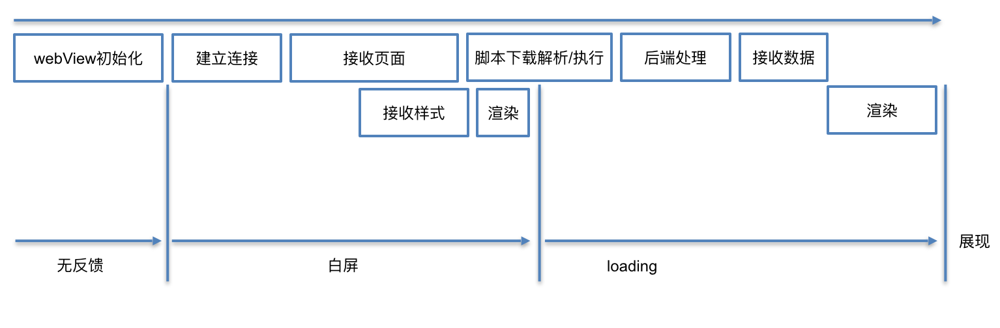

整个过程中，涉及浏览器原理的部分主要以 Chrome 浏览器为主。

## 环境准备

> 冷启动：启动应用时后台没有该应用的进程，系统需要重新创建一个新的进程分配给该应用

> 热启动：启动应用时后台已有该应用的进程，例如按 back 或 home 键时，应用虽然会退出，但其进程可能会依然保留在后台；在已有进程的情况下，应用会从已有的进程启动

浏览器可以分为 4 类：

* WebView
* 内置浏览器
* 可下载浏览器
* 代理浏览器

其中，除 WebView 外，其它三类的表现与普通浏览器无异，用户使用均需要先打开浏览器后输入 URL。涉及环境准备的场景主要有：

* WebView 启动时的初始化
* 普通浏览器之前页面的卸载

#### WebView 初始化

与浏览器不同的是，WebView 无论是冷启动还是热启动，往往都存在一个初始化的过程，即当 App 有打开网页需求时才会初始化 WebView，所以，就存在明显的环境准备时间，在环境准备的过程中，页面处于无反馈阶段。



目前主流的 WebView 主要有：

- IOS 的 UIWebView 和 WKWebView（≥ 8的 IOS 中新设计的高性能 WebView，区别见参考文章）
- Android 的 Android WebView

三种WebView环境的初始化时间（单位：ms）：

|                 | 首次/冷启动初始化时间 | 二次/热启动初始化时间 |
| --------------- | --------------------- | --------------------- |
| IOS UIWebView   | 306.56                | 76.43                 |
| IOS WKWebView   | 763.26                | 457.25                |
| Android WebView | 192.79                | 142.53                |

其中：

- 冷启动初始化时间，指客户端第一次打开 WebView，从开始创建 WebView 到开始建立网络连接之间的时间
- 热启动初始化时间，指打开过 WebView 后退出，再重新打开 WebView，从开始创建 WebView 到开始建立网络连接之间的时间

##### 优化建议

无论是冷启动还是热启动，WebView 的环境准备时间（大约70~700ms）几乎是不可避免的，尤其在 IOS 中普遍采用更高性能的 WKWebView 时，其初始化时间相较 UIWebView 更长

优化的思路及方法：

- 缩短 WebView 环境准备时间，具体的措施是提前初始化 WebView - 在 APP 启动或页面需要加载前，提前初始化全局 WebView 待用。例如，[东软专利 - 加载网页的方法及装置](https://patents.google.com/patent/CN106250434A/zh)
- 利用 WebView 环境准备时间，初始化 WebView 的同时让 Native 先行代理执行部分任务。例如，在 Hybrid 中优化 H5 的思路通常是离线缓存 + 增量更新，即将页面拆分成固定不变和动态改变的两部分，固定不变的部分离线缓存在用户本地，动态改变的部分（通过 diff 算法得到的改变部分）在 WebView 初始化的时间进行加载，然后将两部分数据进行混淆，在 WebView 完成启动后直接显示混淆结果；当然，离线缓存及增量数据更新已经脱离了 WebView，需要 Native 提供 Bridge 进行支持。例如， [手机QQ Hybrid架构演进](https://mp.weixin.qq.com/s/evzDnTsHrAr2b9jcevwBzA?)

##### 参考

- [WebView性能、体验分析与优化](https://tech.meituan.com/WebViewPerf.html)
- [WKWebView与UIWebView区别](https://www.jishux.com/p/eacbdb77aba4da89)
- [使用WKWebView替换UIWebView](https://www.cnblogs.com/496668219long/p/4987481.html)
- [手机QQ Hybrid 架构的优化演进](https://mp.weixin.qq.com/s/evzDnTsHrAr2b9jcevwBzA?)

#### 页面卸载

在浏览器中，如果用户在已有页面/标签页输入新的地址时，浏览器需要卸载之前的页面。卸载的过程会依次触发 beforeunload、pagehide 和 unload 事件，可以在这些事件的回调中保存页面数据。

```
window.addEventListener('beforeunload', function (e) {
	// ...卸载时保存页面数据...
	
	/**
	 * 也可以使用e.returnValue提示用户是否关闭，需要注意，
	 * 浏览器可能显示自己的提示，而不是开发者设置的提示信息
	 */ 
	e.returnValue = '确认关闭吗？';
}, false);
```

需要注意的是：

* 依赖这些事件可能是不牢靠的，因为在**移动设备**中，促使当前页面卸载的方式很多，比如
  * 用户切换 tab，导致之前页面已经进入后台，但设备可能为了回收内存空间主动卸载页面
  * IOS 中双击（不是点触式双击） Home 键，当进入系统的 switcher 页面后切换应用
* 当切换标签时，页面可能并不会被卸载，只是暂时进入后台，可以使用[页面可见性 API ](https://developer.mozilla.org/zh-CN/docs/Web/API/Page_Visibility_API)监控环境的这种行为并作出相应的反应，比如隐藏页面时停止播放视频或轮播图，显示时继续播放


