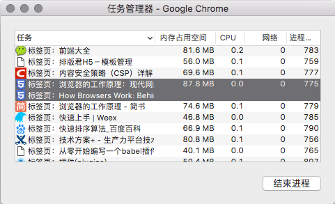

## 接受 URL -> 开启请求

浏览器或 WebView 接受 URL 到正式发起请求页面资源的过程。

#### 多进程模型

对于 Chromium 浏览器，其主要进程：


* Browser 进程：浏览器主进程，负责浏览器界面的显示、各个页面的管理，是所有其它进程的祖先，负责其它进程的创建和销毁工作，有且仅有一个
* Renderer 进程：渲染进程，负责页面渲染工作。该进程支持 4 种模式：
  * Process-per-site-instance：一个 site instance（通过一个页面上的链接连续打开的多个页面）一个进程
  * Process-per-site：同一个域下的页面共享同一个 Renderer 进程
  * Process-per-tab：一个标签页一个进程
  * Single process：不为页面创建独立进程，渲染均在 browser 进程中进行，它们只是 browser 进程中的不同线程。主要用于移动设备
* NPAPI 插件进程：为 NPAPI 插件创建的进程，基本原则是每种类型的插件进程只会被创建一次，而且仅在使用时创建；同时，不可与 GPU 进程通信，即不享有 GPU 进程加速的能力
* Pepper 插件进程：同 NPAPI 插件进程基本类似，但是可与 GPU 进程通信
* GPU 进程：主要用于 3D 图形加速调用的实现，最多只有一个
* 图中未列出的其它类型的进程，例如：
  * Linux 下的“Zygote”进程，Renderer 进程其实就是由它创建而来的
  * Sandbox 准备进程

基于 Chromium 多进程模型，页面需要一个 Renderer 进程，但是否新建 Renderer 进程取决于当前浏览器的状态。《WebKit 技术内幕》及各网络文章中均认为 Process-per-site-instance 是 Renderer 进程创建的默认模式，但个人测试发现：在 Mac Chrome 70 中 Process-per-site 才是 Renderer 进程创建的默认模式，如下图。

所以，如果浏览器已经存在同域页面，将复用 Renderer 进程；否则，Browser 进程创建新的 Renderer 进程。



##### 优化建议

* 有限度地开启 GPU 进程加速，GPU 加速是在满足特定条件下才会触发的
  * 使用 CSS translate3d 触发 GPU 加速
  * 避免使用 NPAPI 插件，比如，Flash

#### 多线程模型

> GUI，Graphical User Interface，图形用户界面

为了保证 UI 的高响应度，每个 Chromium 进程都有多个线程，使得各个进程中的主要线程，尤其是渲染线程不被高耗时的操作阻碍，例如，本地文件读写、socket 读写、数据库操作等。

渲染相关的线程主要有：

- 网络请求线程
- GUI 线程
- JS 引擎线程
- 事件触发线程
- 定时器线程

每次网络请求都需要开辟单独的线程进行。如果 URL 解析到 HTTP 协议，就会新建网络线程去处理资源下载。

#### 缓存直取

并非每个资源都必须发起网络请求，比如

* 强缓存，指由 Expires 和 Cache-Control 控制的本地缓存
* 离线缓存，Service Worker 通过 Cache Storage 缓存的资源

##### 200 与 304

资源请求获得 200 状态码的场景：

* 从网络正确下载的资源时
* 强缓存获取本地资源时，包括 200（from disk cache）、200（from memory cache）

资源请求获得 304 状态码的场景：

* 协商缓存，浏览器向服务端发起 HTTP 请求，通过缓存协商获知本地文件未改变时

需要注意的是：

* 对于强缓存，在未过期时，必须更新资源路径（此时相当于一个新的资源）才能发起新的请求
* 对于协商缓存，使用 `Ctrl+F5` 强制刷新可以使缓存无效

##### 优化建议

利用本地缓存，避免再次网络获取：

* 开启强缓存：配置 Expires 和 Cache-Control 响应头
* 开启协商缓存：配置 Last-Modified 和 Etag 响应头（协商缓存依旧需要用于协商的 HTTP 请求）
* 开启离线缓存：基于 Service Worker 问题和实测性能，**是否开始离线缓存有待商酌**
* 消灭 304

#### URL 解析

浏览器调用 URL 函数解析库，对输入的 URL 进行解析，URL 一般包括几大部分：

- protocol，协议头，比如有 http，ftp 等
- host，主机域名或 IP 地址
- port，端口号
- path，目录路径
- query，查询参数
- fragment，即 # 后的 hash 值，一般用来定位到页面某个位置

#### DNS 解析

DNS 解析是通过 URL host 得到资源 IP 地址的过程。大致流程：

* 查询浏览器 DNS 解析缓存，有则使用浏览器缓存
* 查询本机 DNS 解析缓存，有则使用本机缓存
* 查询 DNS 域名服务器（当然，中间可能还会经过路由，也有缓存等）

在查询 DNS 域名服务器时，查询细节会因为具体的情况而不同：

* 未使用 CDN 时，DNS 解析获取域名 A 记录，直接得到 IP 地址
* 使用 CDN 时，DNS 首次解析可能获得资源域名的 CNAME 记录，浏览器需要对得到的 CNAME 记录再次解析；再次解析时，CDN 系统会根据用户的地理位置和网络状态动态返回资源对应的 IP 地址

##### 优化建议

DNS 解析是很耗时的，尤其是解析域名过多时，会让首屏加载变得过慢。优化的思路及方法：

* 减少 DNS 查询次数，在不影响多域名并行下载数量的前提下，合理减少域名数量

* 减少 DNS 查询耗时，使用 DNS-prefetch 提前进行 DNS 查询。需要注意的是，在 HTTPS 协议下，出于安全考虑，**a 标签链接**的 DNS 预解析默认被关闭，需要使用 meta 标签强制开启 a 链接域名预解析：

  ```
  <meta http-equiv="x-dns-prefetch-control" content="on">
  ```


