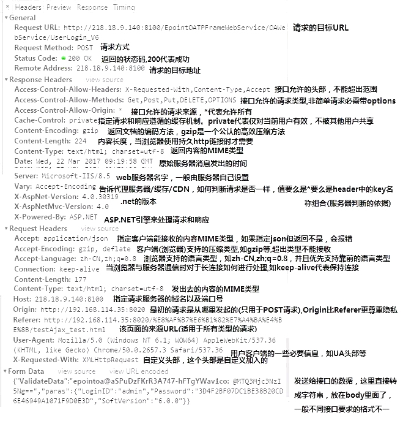
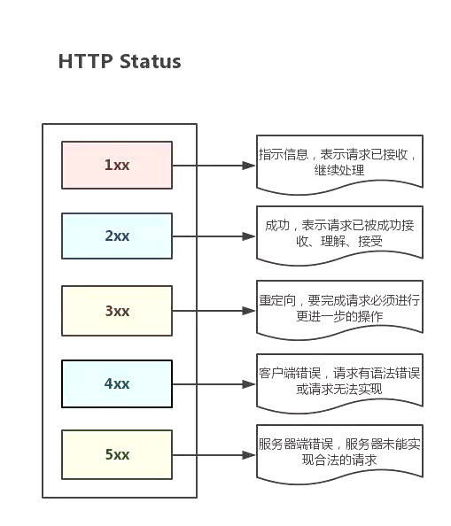
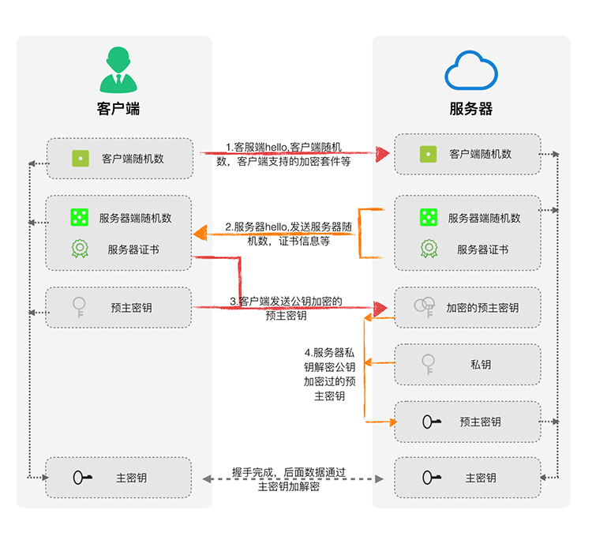
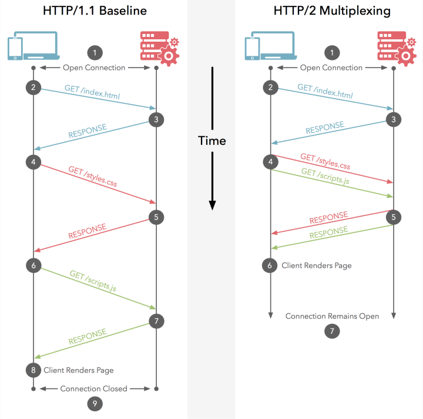
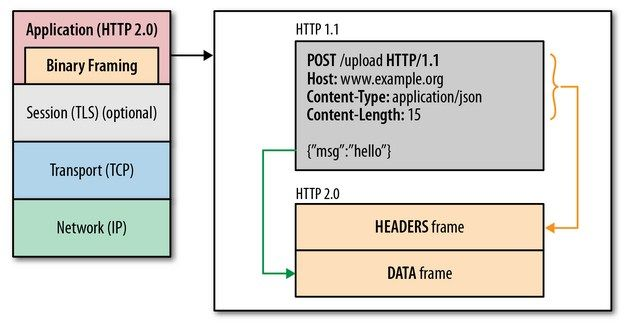
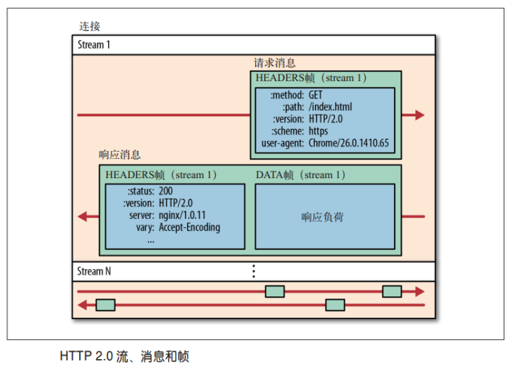
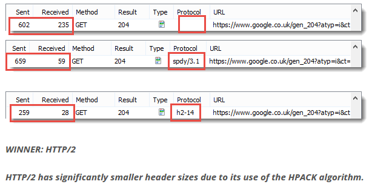
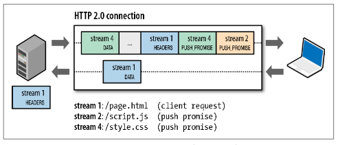
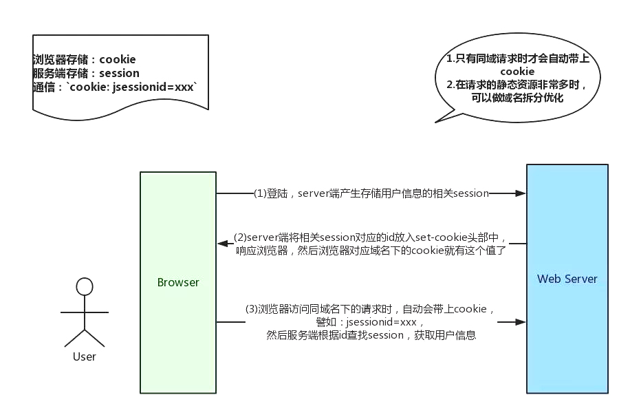

## 前后端交互

#### 五层模型

计算机网络有 OSI 七层模型和 TCP/IP 五层模型两种。通常，五层模型更容易理解：

1. 应用层(DNS, HTTP) ：DNS 解析成 IP 并发送 HTTP 请求
2. 传输层(TCP, UDP) ：通过三次握手建立 TCP 连接
3. 网络层(IP, ARP) ：IP寻址
4. 数据链路层(PPP) ：封装成帧
5. 物理层 ：物理传输，利用物理介质（双绞线，电磁波等各种介质）传输比特流

数据在五层模型中的流动：

* 客户端：应用层 -> 传输层 -> 网络层 -> 数据链路层 -> 物理层
* 服务端：物理层 -> 数据链路层 -> 网络层 -> 传输层 -> 应用层

七层模型是在应用层和传输层之间多了表示层和会话层：

* 表示层：数据格式的转换，如加密解密、转换翻译、压缩解压缩等

- 会话层：负责建立、管理和维护会话，如控制登陆和注销过程

**数据在每一层中的具体处理过程参见《95-深入理解之TCPIP》**

#### HTTP请求

前后端交互时，HTTP 报文作为信息的载体。

##### 报文结构

报文的主要部分包括起始行、请求/响应头部、 请求/响应体，辅助部分包括空行和 CRLF。其基本格式：

* 请求报文：

  ```
  <method> <request-url> <version>					# 起始行
  <headers>							# 首部
  
  <entity-body>					# 实体
  ```

* 响应报文：

  ```
  <version> <status-code> <reason-phrase>		# 起始行
  <headers>							# 首部
  
  <entity-body>					# 实体
  ```

下图是一个常见请求的报文信息 (注意：这些信息是解析后的，点击 Request Headers/Response Headers 右侧的 “view source” 可以查看原始报文首部结构)



###### 起始行

上图 General 中的信息就是解析自起始行：

```
- Request Url：来自请求起始行，请求的web服务器地址
- Request Method：来自请求起始行，请求方式
- Status Code：来自响应起始行，状态码，如200代表成功
- Remote Address：请求目标服务器地址（会转为IP）
```

其中，Method的规范定义分为两批次：

```
- HTTP 1.0 定义了三种请求方法：GET, POST 和 HEAD 方法。
- HTTP 1.1 新增了五种请求方法：OPTIONS, PUT, DELETE, TRACE 和 CONNECT 方法。
```

最常用到的就是状态码，当请求出错时，状态码能帮助快速定位问题：

```
- 200——表明该请求被成功地完成，所请求的资源发送回客户端
- 304——自从上次请求后，请求的网页未修改过，请客户端使用本地缓存
- 400——客户端请求有错（比如可以是安全模块拦截）
- 401——请求未经授权
- 403——禁止访问（比如可以是未登录时禁止）
- 404——资源未找到
- 500——服务器内部错误
- 503——服务不可用
- ...
```

不同范围状态码的大致意义：

```
- 1xx——指示信息，表示请求已接收，继续处理
- 2xx——成功，表示请求已被成功接收、理解、接受
- 3xx——重定向，要完成请求必须进行更进一步的操作
- 4xx——客户端错误，请求有语法错误或请求无法实现
- 5xx——服务器端错误，服务器未能实现合法的请求
```



###### 头部

ASCII 文本格式，包含请求或响应的附加信息。

常用的请求头部：

```
- Accept: 接收类型，表示浏览器支持的 MIME 类型（对标服务端返回的 Content-Type）
- Accept-Encoding：浏览器支持的压缩类型，如Gzip等，超出类型不能接收
- Accept-Language：浏览器支持的语言类型，如zh-CN，优先支持排在前面的语言
- Content-Type：客户端发送出去实体内容的类型
- Expires：缓存控制，在这个时间内不会请求，直接使用缓存，HTTP1.0，而且是服务端时间
- Max-age：代表资源在本地缓存多少秒，有效时间内不会请求，而是使用缓存，HTTP1.1中
- Cache-Control: 指定请求和响应遵循的缓存机制，如no-cache
- If-Modified-Since：对应服务端的Last-Modified，用来匹配看文件是否变动，只能精确到1s之内，HTTP1.0中
- If-None-Match：对应服务端的ETag，用来匹配文件内容是否改变（非常精确），HTTP1.1中
- Cookie：有Cookie并且同域访问时会自动带上
- Connection：当浏览器与服务器通信时对于长连接如何进行处理,如keep-alive
- Host：请求的服务器URL
- Origin：最初的请求是从哪里发起的（只会精确到端口）,Origin比Referer更尊重隐私
- Referer：该页面的来源URL(适用于所有类型的请求，会精确到详细页面地址，csrf拦截常用到这个字段)
- User-Agent：用户客户端的一些必要信息，如UA头部等
```

常用的响应头部：

```
- Access-Control-Allow-Headers: 服务器端允许的请求Headers
- Access-Control-Allow-Methods: 服务器端允许的请求方法
- Access-Control-Allow-Origin: 服务器端允许的请求Origin头部（比如为*）
- Content-Type：服务端返回的实体内容的类型
- Content-Length：服务端返回的实体内容的长度
- Date：数据从服务器发送的时间
- Expires：应该在什么时候认为文档已经过期,从而不再缓存它
- Max-age：客户端的本地资源应该缓存多少秒，开启了Cache-Control后有效
- Cache-Control：告诉浏览器或其他客户，什么环境可以安全的缓存文档
- Last-Modified：请求资源的最后修改时间
- ETag：请求变量的实体标签的当前值
- Set-Cookie：设置和页面关联的Cookie，服务器通过这个头部把Cookie传给客户端
- Keep-Alive：如果客户端有keep-alive，服务端也会有响应（如timeout=38）
- Server：服务器的一些相关信息
```

一般来说，请求头部和响应头部是匹配分析的。例如：

* 请求头部的 Accept 要和响应头部的 Content-Type 匹配，否则会报错
* 跨域请求时，请求头部的 Origin 要匹配响应头部的 Access-Control-Allow-Origin，否则会报跨域错误
* 使用强缓存时，请求头部的 Expires、Cache-Control、Max-age 与响应头部的 Expires、Cache-Control
* 使用协商缓存时，请求头部的 If-Modified-Since、If-None-Match 与响应头部的 Last-Modified、 ETag
* 使用长连接时，请求头部的 Connection 和响应头部的 Keep-Alive
* 使用 Cookie 时，请求头部的 Cookie 和响应头部的 Set-Cookie

###### 实体

消息实体是可选的，包含 HTTP 要传输的内容，格式可以是文本、二进制数据或者空，一般来说：

* 请求实体，放置用于 post 请求的参数。比如：
  * 参数序列化形式（ `a=1&b=2`这种）
  * 表单对象（ `FormData` 对象，上传时可以夹杂参数以及文件）
* 响应实体，放置服务端需要传给客户端的内容。比如：
  * 接口请求时，通常是 json 数据
  * 页面请求时，直接放 html 字符串，然后浏览器自己解析并渲染

###### 空行

首部与实体之间必须有一个空行

###### CRLF

CRLF，Carriage-Return Line-Feed，回车换行，由一个回车符（ASCII 13）和一个换行符组成（ASCII 10），作为报文中每行的结束标志

##### HTTPS

HTTPS，或称 HTTP over TLS/SSL，Hypertext Transfer Protocol Secure，超文本安全传输协议，是 HTTP 协议的安全版本，是一种透过计算机网络进行安全通信的传输协议。严格地讲，HTTPS 并不是一个单独的协议，而是对工作在一加密连接（TLS或SSL）上的常规 HTTP 协议的称呼。

HTTPS 开发的主要目的是提供对网站服务器的身份认证，保护交换数据的隐私与完整性。

HTTPS 协议的基本特点：

- HTTP 的 URL 由 “http://” 起始且默认使用端口 80，HTTPS 的 URL 由 “https://” 起始且默认使用端口 443
- 在进行 HTTPS 通信前，会建立 SSL 连接，以确保接下来的通信都是加密的
- 要使一网络服务器接受 HTTPS 连接，管理员必须创建一数字证书，并交由证书颁发机构签名以使浏览器接受。HTTPS 请求只能被添加了对应数字证书的应用层代理拦截，第三方攻击者就无计可施了

###### SSL/TLS

SSL，Secure Sockets Layer，安全套接层，Netscape 1994 年提出用于加密 HTTP 协议的一种安全协议。

TLS，Transport Layer Security，传输层安全协议，标准化组织 IETF 对 SSL 进行标准化后的协议名称，可以说是 SSL 协议的后续版本或者国际标准化版本，所以，通常用 SSL 统一指代 SSL 和 TLS。

SSL/TLS 协议可分为两层：

- 记录协议（Record Protocol）：为应用层协议提供数据封装、压缩、加密等基本功能，相当于表示层功能
- 握手协议（Handshake Protocol）：在数据传输开始前，进行认证通讯双方身份、协商加密算法、交换加密密钥等创建会话的操作，相当于会话层功能

从 SSL/TLS 协议的两层划分看，其属于应用层协议，在[维基百科的协议分层](https://zh.wikipedia.org/wiki/%E5%82%B3%E8%BC%B8%E5%B1%A4%E5%AE%89%E5%85%A8%E6%80%A7%E5%8D%94%E5%AE%9A)中，也确实将其划分为应用层协议。

但是，对应用程序而言，SSL/TLS 是透明的，传送的是应用程序数据，使用 SSL/TLS 的应用程序确实将其用作传输协议，所以，从这个角度看，其属于传输层协议。

总之，无法用 OSI 参考模型或者由此演变的 TCP/IP 五层模型来严格界定 SSL/TLS 协议到底属于哪一层，较为准确的表达方法是：**SSL/TLS 协议作用于应用层和传输层之间**。

SSL/TLS 协议有两种主要的握手类型：一种基于 RSA，一种基于 DH（Diffie-Hellman），这两种握手类型的主要区别在于**主秘钥交换和认证**上。

| 握手 | 秘钥交换 | 身份验证 |
| ---- | -------- | -------- |
| RSA  | RSA      | RSA      |
| DH   | DH       | RSA/DSA  |

1. RSA 握手工作机制

   

   ```
   1. 客户端，请求创建安全连接，请求报文包含客户端随机数、支持的密码套件(包括加密密码算法和加密哈希函数)
   2. 服务端，基于客户端信息决定加密和散列函数，响应报文包含服务端随机数、数字证书(包括服务器名称、受信任的证书颁发机构（CA）和服务器公钥)
   3. 客户端，确认服务端证书有效性，验证通过后，报文中包含服务端公钥加密的客户端随机生成的预主密钥
   4. 服务端，使用自己的私钥解密客户端报文得到预主密钥
   5. 客户端与服务器使用相同的算法根据{客户端随机数 + 服务器随机数 + 预主秘钥}生成主密钥，之后的通信均使用主密钥加密和解密
   ```

2. DH 握手工作机制

   DH 握手是一种更加安全的握手机制，有时间可查看参考文章。

参考：

- http://www.nsoad.com/Article/Network-security/20161015/570.html
- https://razeen.me/post/ssl-handshake-detail.html
- http://www.ruanyifeng.com/blog/2014/09/illustration-ssl.html

###### 工作机制


HTTPS 经由 HTTP 进行通信，但是在 HTTP（应用层）与 TCP（传输层）之间增加了一个用于加密数据的 SSL/TLS 安全层，其向运行 HTTP 的进程提供一个类似于 TCP 的套接字：

- 从应用层获得未加密的请求报文，将报文加密（首部和主体均会加密）并注入传输层套接字
- 从传输层获得加密的响应报文，解密后交给对应的进程

具体工作机制同 SSL/TLS 握手机制。

**需要注意的是：**HTTPS 开销要比 HTTP 要大，因为需要额外建立安全链接以及加密等，所以，HTTPS 与 HTTP/2 配合的性能更好。

##### HTTP/2

HTTP/2 是 2015 年发布的 HTTP 协议的第二个版本。在与 HTTP/1.1 完全语义兼容的基础上，进一步减少了网络延迟，大幅度的提升了 web 性能。在 HTTP/2 中，HTTP1.1 中的优化方案，比如：减少请求数量的雪碧图、静态资源多域名等将不再需要。

相比于 HTTP 1.x，HTTP/2的主要新特性：

- 多路复用
- 二进制分帧
- 首部压缩
- 服务端推送
- 请求优先级

###### 多路复用

一个 TCP/IP 连接可以请求多个资源，而 HTTP 1.1 中一个资源对应一个 TCP/IP 请求，同一域名下的请求有一定数量限制，超过限制数目的请求会被阻塞。所以，在 HTTP 1.1 中，常采用多域名的方式提高并行下载数量。



因此，HTTP/2 可以很容易的实现多流并行而不用依赖建立多个 TCP/IP 连接，HTTP/2 把 HTTP 协议通信的基本单位缩小为一个一个的帧，这些帧对应着逻辑流中的消息，它们并行在同一个 TCP/IP 连接上。

###### 二进制分帧

在不改变 HTTP/1.x 的语义、方法、状态码、URI 、首部字段等规范的前提下，HTTP/2 主要通过在应用层和传输层 (TCP or UDP) 之间增加一个二进制分帧层，从而突破 HTTP 1.x 的性能限制，改进传输性能，实现低延迟和高吞吐量。



在二进制分帧层中， HTTP/2 会将所有传输的信息分割为更小的消息和帧（frame），并对它们采用二进制格式的编码。其中，HTTP 1.x 首部信息被封装到 HEADER frame，实体则封装到 DATA frame 中。

在过去， HTTP 性能优化的关键并非高带宽，而是低延迟。TCP 连接会随着时间进行自我调谐，起初会限制连接的最大速度，如果数据成功传输，会随着时间的推移提高传输的速度，这种调谐称为 TCP 慢启动。因此，原本就具有突发性和短时性的 HTTP 连接变的十分低效。

HTTP/2 通信都在一个连接上完成，这个连接可以承载任意数量的双向数据流。HTTP/2 通过让所有数据流共用同一个连接，可以更有效地使用 TCP 连接，让高带宽也能真正的服务于 HTTP 的性能提升。

HTTP/2 采用单 TCP/IP 连接方式，带来的性能提升主要体现在：

* 服务器端，单连接多资源的方式减少服务器连接压力，内存占用更少，连接吞吐量更大
* 网络传输，TCP/IP 连接的减少改善了网络拥塞状况，同时慢启动时间的减少，使拥塞和丢包恢复速度更快



###### 首部压缩

HTTP/1.1 并不支持 HTTP 首部压缩，HTTP/2 使用了专门为首部压缩设计的 HPACK 算法压缩首部。



###### 服务端推送

服务端推送，Server Push，是一种在客户端请求之前发送数据的机制。

在 HTTP/2 中，服务器可以对客户端的一个请求发送多个响应。Server Push 让 HTTP 1.x 时代使用内嵌资源的优化手段变得没有意义；如果一个请求是由你的主页发起的，服务器很可能会提前响应主页内容、logo 图片以及样式表等，因为它知道客户端会用到这些东西。这相当于在一个 HTML 文档内集合了所有的资源。

此外，服务器推送还有一个很大的优势：可以缓存！即一个页面请求的资源，比如 js、css 文件等，可以缓存然后提供给其他也使用这些资源的页面。



###### 请求优先级

多路复用带来一个新的问题是，在连接共享的基础之上有可能会导致关键请求被阻塞。HTTP/2 允许给每个请求设置优先级，这样重要的请求就会优先得到响应。比如，首页的html内容应该优先展示，之后才是静态资源，这样可以保证用户第一时间看到网页内容。

###### 参考

- https://www.zhihu.com/question/34074946
- https://zh.wikipedia.org/wiki/HTTP/2

##### SPDY

> SPDY = speedy /'spiːdɪ/ adj. 快的；迅速的；敏捷的

SPDY 并非首字母缩略字，而是 "speedy" 的缩写，一种 Google 开发的基于 TCP 的应用层协议。它是 HTTP/2 的前身，HTTP/2 的关键功能主要来自 SPDY。

SPDY 与 HTTP/2 的不同主要在首部压缩算法：

* SPDY 使用通用的 DEFLATE 算法 (请求报文首部 Accept-Encoding 中也有这种算法)
* HTTP/2 使用专门为首部压缩设计且更加安全的 HPACK 算法

2015年，HTTP/2 发布之后，Google 宣布停止支持 SPDY 协议。

##### 优化建议

###### get & post

get 和 post 本质都是 TCP/IP 连接，但除了 HTTP 层面外，两者在 TCP/IP 层面也有区别：get 产生一个 TCP 数据包，post 两个。具体就是：

- get 请求时，浏览器会把 headers 和 data一起发送出去，服务器响应 200（返回数据）
- post 请求时，浏览器先发送 headers，服务器响应 100continue，浏览器再发送 data，服务器响应 200（返回数据）。

再说一点，这里的区别是 specification（规范）层面，而不是 implementation（对规范的实现）。基于两者的区别，尽量使用get请求。

###### Cookie 优化

Cookie 是一种浏览器本地存储方式，为无状态的 HTTP 而生，主要用来进行身份校验，结合服务端 Session 使用



- 用户登陆后，服务端会生成一个 session，session 中有用户信息（如用户名、密码等）；然后会有一个sessionid（相当于服务端 session 对应的key）
- 服务端通过 set-cookie 响应头在登录页面写入 Cookie，值就是 jsessionid=xxx
- 浏览器根据响应头种下 Cookie，以后访问同域名下的页面时，自动带上 Cookie，自动检验，在有效时间内无需二次登陆。

**需要注意的是**，Cookie 不应该存放敏感信息，尤其是明文存储用户名与密码，因为非常不安全；如果一定要强行存储，首先设置 HTTPonly，另外考虑 RSA 等非对称加密（因为浏览器本地也是容易被攻克的，并不安全）。

Cookie 的优化策略：

* 减少 Cookie 数量
* 静态资源域名，页面请求同域名资源时，浏览器会默认带上本地 Cookie。针对这种不必要 Cookie 携带，同时为了避免过多的 DNS 解析时间，可以将静态资源放到有限数量的不同域名下。

###### Gzip 压缩

Gzip 是一种压缩格式，压缩效率可达 70% 左右，现在浏览器一般都支持。通常情况下，需要 Apache、 Tomcat 等 Web 服务器开启 Gzip 压缩。

除 Gzip 外，服务器还有其它压缩格式，如 deflate，但没 Gzip 高效。

###### 长连接与短连接

主要用于 HTTP 1.x，HTTP/2 中本身就是长连接了。

TCP/IP 层面：

- 长连接：一个 TCP/IP 连接上可以连续发送多个数据包，在 TCP 连接保持期间，如果没有数据包发送，需要双方发检测包以维持此连接，一般需要自己做在线维持（类似于心跳包）
- 短连接：通信双方有数据交互时，就建立一个 TCP 连接，数据发送完成后，则断开此 TCP 连接

HTTP 层面：

- HTTP 1.0 中，默认使用短连接，即每一个静态资源请求都是一个单独的连接，任务结束就中断连接
- HTTP 1.1 起，默认使用长连接，请求首部 `Connection: keep-alive` ，响应首部 `keep-alive:(timeout)` 。此时，客户端与服务端之间传输 HTTP 的 TCP 连接不会关闭，会继续复用

需要注意的是：

* 长连接需要客户端和服务器都支持时才有效
* keep-alive 不会永远保持，它有一个一般在服务器中配置（如 Apache）的持续时间

#### TCP/IP 请求

TCP/IP 协议建立连接时需要三次握手，断开连接时需要四次挥手。


其中：

- ACK，Acknowledgement，确认应答
- SYN，Synchronize Sequence Number，同步序列号，用来建立连接
- FIN，Finish，用于断开连接

##### 三次握手

建立一个 TCP 连接需要发送 3 个包，这个过程称为“三次握手”。

三次握手的目的是同步连接双方的序列号 SYN 和确认号 ACK，并交换 TCP 窗口大小信息。

###### 过程

三次握手的过程：

1. 第一次握手，客户端发送请求连接报文
   - SYN = x，客户端请求连接 SYN
2. 第二次握手，服务端收到请求连接报文后发送 ACK + SYN 报文
   - ACK = x + 1，作为对客户端请求报文的确认应答
   - SYN = y，服务端自己的请求连接 SYN
3. 第三次握手，客户端收到服务端 ACK + SYN 报文后发送 ACK 报文
   - ACK = y + 1，作为对服务端请求报文的确认应答
   - 客户端认为连接建立成功
   - 服务端收到 ACK 后也认为连接建立成功

###### 原因

防止已失效的连接请求报文超时到达目标主机，因而产生错误。

例如，连接已断开时，客户端的连接请求报文超时到达，收到该请求的服务端，会误以为客户端再次发出了新的连接请求：

- 采用两次握手时，服务端发出 ACK 时，就会认为新的连接建立了。此时，客户端却不会理睬服务端的确认，也不会向服务端发送数据，导致服务端空等而浪费资源
- 采用三次握手时，服务端误以为客户端再次发出新的连接请求时，会向客户端发送 ACK + SYN 报文，客户端收到报文但不发出确认 ACK，服务端就不会建立连接

##### 四次挥手

断开一个 TCP 连接需要发送 4 个包，这个过程称为“四次挥手”。

###### 过程

四次挥手的过程：

1. 第一次挥手，客户端发送断开连接报文
   - FIN = x，客户端请求断开连接 FIN
2. 第二次挥手，服务端收到断开连接报文后发送 ACK 报文
   - ACK = x + 1，作为对客户端断开连接请求的确认应答
3. 第三次挥手，服务端发送断开连接报文
   - FIN = y，服务端请求断开连接 FIN
4. 第四次挥手，客户端收到断开连接报文后发送 ACK 报文
   - ACK = y + 1，作为对服务端断开连接请求的确认应答

###### 原因

TCP协议是一种面向连接的、可靠的、基于字节流的传输层通信协议，采用全双工模式，这就意味着：

- 主机 A 发出 FIN 报文时，只表示主机 A 没有数据发送了；但此时，主机 A 还是可以接受来自主机 B 的数据
- 主机 B 也发出FIN 报文时，表示主机 B 也没有数据要发送了，唯有此时，双方才能中断此次 TCP 连接

##### 优化建议

* 浏览器对同一域名下并发的TCP/IP连接是有限制的（2-10个不等）。而且，在HTTP 1.0中往往一个资源请求就需要一个TCP/IP连接。相应增加资源域名，增加资源并发下载数量。

#### 服务端处理

服务端在接收到请求时，内部会进行很多的处理。

##### 统一验证

服务端入口处的服务器通常会进行统一的平台验证，如

* 安全拦截
* 跨域验证

如果验证失败，则直接返回相应的 HTTP 报文（如拒绝请求等）

##### 负载均衡

对于并发量大的项目，往往需要一个服务器集群；此时，服务端入口处的服务器往往充当调度服务器，统一调度实现集群的负载均衡。

反向代理是实现负载均衡的常用方式，此时调度服务器也是代理服务器：

* 用户发起的请求到达反向代理服务器，比如安装了 nginx
* 代理服务器根据实际的调度算法，分配不同请求给对应集群中的服务器执行
* 代理服务器得到实际服务器的 HTTP 响应，并将结果反馈给用户

##### 后台处理

后台处理的流程：

- 容器收到请求，因为一般后台服务程序都部署在容器中，例如
  - ASP/ASP.NET，需要 IIS 作为服务器
  - PHP，需要搭载 Apache （Web服务器，静态解析，如 PHP 和 HTML）或 Nginx 环境等
  - JSP，需要 Tomcat （Java 应用服务器，动态解析，如 JSP）服务器等
  - JS，需要 Node.js
- 容器中的后台程序接收到请求（如 Java 程序）
- 后台处理完后返回响应结果

##### 优化建议

* 避免 301/302 重定向
* 避免 404 错误

