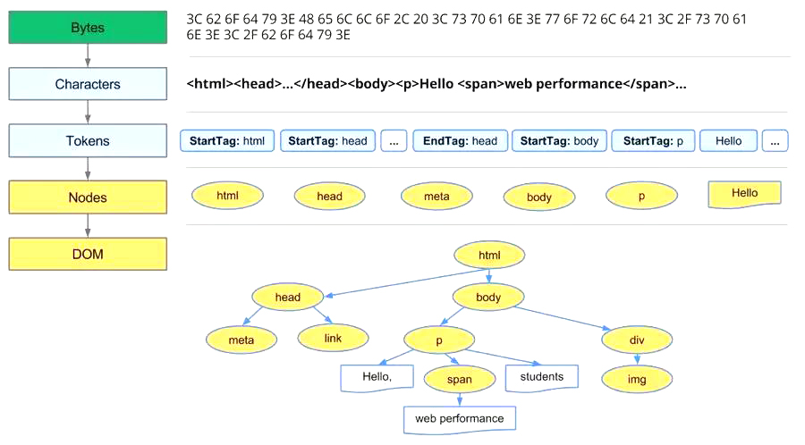

## 页面解析

> 更加详细的流程参见《01-浏览器原理》的 WebKit - 渲染 一节

经过前后端交互，浏览器获得页面文件，然后就是解析并渲染页面。


1. 通过网络和存储模块，获取网页内容 HTML 文本
2. HTML 解释器解析 HTML 文本得到 DOM 树，解析过程中如遇 CSS/JS 外链则调用网络模块获取
   - CSS 交给 CSS 解释器去解析
   -  JS 交给 JS 引擎处理，JS 引擎可以随时通过 DOM API 修改 DOM 树
3. DOM 树建立后，渲染引擎接受 CSS 解释器的样式信息，构建一个新的内部表示模型
4. 内部表示模型由布局模块计算模型内部各个元素的位置和大小信息
5. 绘图模块完成从模型到图像的绘制，过程中可能需要使用2D/3D 图形，音频、视频和图片解码器

#### 资源下载

解析 HTML 时，会遇到资源链接，此时需要进行单独处理。静态资源通常有：

- CSS 样式资源
- JS 脚本资源
- 图片类资源

当遇到外链时，会单独开启一个下载线程去下载资源。

##### CSS 下载

CSS 资源的处理特点：

- 异步下载，不会阻塞浏览器构建 DOM 树
- 阻塞渲染，构建 render 时，会等待 CSS 下载解析完毕后才进行（浏览器优化策略，防止 CSS 不断改变，避免了重复构建）
-  `media query` 声明的 CSS 不会阻塞渲染

##### JS 下载

JS 资源的处理特点：

- 阻塞解析，需等待 JS 脚本下载完成并执行后才会继续解析 HTML；不过，出于优化目的，现代浏览器在 JS 脚本下载和执行的阻塞阶段，会继续下载其它资源，只是并行下载的资源解析依旧在  JS 执行之后
- defer 与 async，普通 JS 脚本会阻塞浏览器解析，但加上 defer 或 async 属性，这样脚本就变成异步了
  - async 是异步执行
    - 异步下载
    - 下载完毕就会立即执行，所以多个 async 脚本不确保按其先后位置执行，谁先下载完谁先执行
    - 在 onload 事件前执行，但不确定在 DOMContentLoaded 事件的前后
  - defer 是延迟执行
    - 异步下载
    - 下载完毕后不会立即执行，其效果类似将脚本放在 body 标签后，多个 defer 脚本会按位置顺序执行
    - 规范要求在 DOMContentLoaded 事件前执行，但实际上不同浏览器的执行效果并不一致

#### HTML 解析

> character /'kærəktə/ n. 字符
>

> token /'təʊk(ə)n/ n. 标记

HTML 解析得到 DOM 树的过程：

```
Bytes → characters → tokens → nodes → DOM
```

比如，有 HTML 页面：

```
<html>
<head>
    <meta name="viewport" content="width=device-width,initial-scale=1">
    <link href="style.css" rel="stylesheet">
    <title>Critical Path</title>
</head>
<body>
    <p>Hello <span>web performance</span> students!</p>
    <div></div>
</body>
</html>
```

浏览器的处理如下：



1. Conversion 转换：将 HTML 内容字节（Bytes）基于编码规范转换为字符 character
2. Tokenizing 分词：将字符按 HTML 规范转换为标记 token，每个 token 都有自己独特的含义以及规则集
3. Lexing 词法分析：将 token 转换为节点对象，这些对象分别定义它们的属性和规则
4. DOM 构建：将节点对象转换为 DOM 树


#### CSS 解析

CSS解析生成CSS规则树的过程：

```
Bytes → characters → tokens → nodes → CSSOM
```

比如，有 CSS：

```
body { font-size: 16px }
p { font-weight: bold }
span { color: red }
p span { display: none }
img { float: right }
```

最终的 CSSOM 树：


#### JS解析

JS 是解释型语言，无需提前编译，由解释器实时运行。JS 引擎的主要处理过程：


其主要部分包括：

- 编译器：将源码通过词法和语法分析编译成 AST，在一些引擎中，编译器还负责将 AST 转换成字节码
  - 词法分析 ：JS 编译器先把 JS 代码（字符串）的字符流按照 ECMAScript 标准转换为记号流
  - 语法分析 ：JS 语法分析器在经过词法分析后，通过记号流按照 ECMAScript 标准生成 AST
- 解释器：主要解释执行字节码，同时依赖垃圾回收机制
- JIT 工具：即时编译工具，将 AST 或字节码转换成本地代码，同时依赖解释器告知哪些代码执行频次高
- 垃圾回收器和分析工具：负责垃圾回收和收集引擎中的信息，帮助改善引擎性能

##### 预处理阶段

正式执行 JS 前，通常会有一个预处理阶段，比如变量提升、分号补全等，以确保 JS 后续的正确执行

**分号补全**

JS执行是需要分号的，但为什么以下语句却可以正常运行呢？

```
console.log('a')
console.log('b')
```

原因就是 JS 解释器有一个分号补全（Semicolon Insertion）规则，它会按照一定规则，在适当的位置补充分号。

比如列举几条自动加分号的规则：

- 当有换行符（包括含有换行符的多行注释），并且下一个 `token` 没法跟前面的语法匹配时，会自动补分号
- 当有 `}` 时，如果缺少分号，会补分号。
- 程序源代码结束时，如果缺少分号，会补分号。

于是，上述的代码就变成了：

```
console.log('a');
console.log('b');
```

这里有一个经典的例子：

```
function b() {
	return
	{
    	a: 'a' 
    };
}
```

由于分号补全机制，所以它变成了：

```
function b() {
	return;
	{
    	a: 'a' 
    };
}
```

所以运行后是 `undefined`

**变量提升**

一般包括函数提升和变量提升。比如：

```
a = 1;
b();
function b() {
	console.log('b');
}
var a;
```

经过变量提升后，就变成：

```
function b() {
	console.log('b');
}
var a;
a = 1;
b();
```

这里没有展开，其实展开也可以牵涉到很多内容的。比如，可以提下变量声明、函数声明、形参、实参的优先级顺序，以及 es6 中 let 有关的临时死区等。

##### 执行阶段

此阶段的内容中的图片来源：[深入理解JavaScript系列（10）：JavaScript核心（晋级高手必读篇）](HTTP://www.cnblogs.com/TomXu/archive/2012/01/12/2308594.html)。

解释器解释完语法规则后，就开始执行，然后整个执行流程中大致包含以下概念：

- 执行上下文，执行堆栈概念（如全局上下文，当前活动上下文）
- VO（变量对象）和AO（活动对象）
- 作用域链
- this 机制等

**执行上下文简单解释**

- JS有 `执行上下文` 或者说 `执行环境`
- 浏览器首次载入脚本，它将创建 `全局执行上下文`，并压入执行栈栈顶（不可被弹出）
- 然后每进入其它作用域就创建对应的执行上下文并把它压入执行栈的顶部
- 一旦对应的上下文执行完毕，就从栈顶弹出，并将上下文控制权交给当前的栈
- 这样依次执行，最终回到全局执行上下文

如果程序执行完毕，被弹出执行栈，然后又没有被引用（没有形成闭包），那么这个函数中用到的内存就会被垃圾处理器自动回收。


然后执行上下文与 VO。作用域链，this的关系是，每一个执行上下文，都有三个重要属性：

- 变量对象( Variable object，VO )
- 作用域链( Scope chain )
- this


**VO 与 AO**

VO 是执行上下文的属性（抽象概念），但是**只有全局上下文的变量对象允许通过 VO 的属性名称来间接访问，因为在全局上下文里，全局对象自身就是变量对象。**

AO（ activation object)，当函数被调用者激活，AO 就被创建了。

可以理解为：

- 在函数上下文中： `VO === AO`
- 在全局上下文中： `VO === this === global`

总的来说，VO中会存放一些变量信息，如声明的变量、函数、arguments参数等。

**作用域链**

它是执行上下文中的一个属性，原理和原型链很相似，作用很重要。流程简述：

* 在函数上下文中，查找一个变量 foo
* 函数的 VO 中查找
* 父级作用域链中查找
* 直到全局上下文中，如果未找到，则报错


**this指针**

this 是执行上下文环境的一个属性，而不是某个变量对象的属性。因此：

- this 是没有一个类似搜寻变量的过程
- 当代码中使用了 this，这个  this 的值就直接从执行的上下文中获取了，而不会从作用域链中搜寻
- this 的值只取决中进入上下文时的情况

所以经典的例子：

```
var baz = 200;
var bar = {
	baz: 100,
	foo: function() {
		console.log(this.baz);
	}
};

var foo = bar.foo;

// 进入环境：global
foo(); 		// 200，严格模式中会报错，Cannot read property 'baz' of undefined

// 进入环境：global bar
bar.foo();  // 100
```

更多参考：[深入理解JavaScrIPt系列（13）：This? Yes,this!](HTTP://www.cnblogs.com/TomXu/archive/2012/01/17/2310479.html)

##### 垃圾回收

当 JS 引擎进行进行垃圾回收时，为了避免出现 JS 应用逻辑与垃圾回收器看到的不一致的情况，垃圾回收需要将应用逻辑暂停下来，待执行后再恢复执行，这种行为称为全停顿 (stop-the-world)。

对于 JS 游戏等对动画连贯性要求较高的应用，全停顿导致的动画暂停可能很容易被用户感知到。合理使用闭包，及时释放不再使用的闭包对象，可以一定程度上降低 JS 引擎垃圾回收的频率。

 JS 引擎内存管理相关内容可查看《96-深入理解之NODE》

#### 构建渲染树

当得到 DOM 树和 CSSOM 后，就会构建渲染树。一般来说，渲染树和 DOM 树是相对应的，但不是严格意义上的一一对应。因为有一些不可见的 DOM 元素不会插入到渲染树中，如 head 这种不可见的标签或者 `display:none` 的元素等。


#### 渲染

有了 render 树，接下来就是开始渲染，基本流程如下：


1. 计算 CSS 样式
2. 构建渲染树
3. 布局，主要定位坐标和大小，是否换行，各种 position、overflow、z-index 属性
4. 绘制，将图像绘制出来

其中，图中的线与箭头代表通过 js 动态修改 DOM 或 CSS，会导致重新布局（Layout）或渲染（Repaint）。

###### 回流与重绘

Reflow，回流，意味着元素的内容、结构、位置或尺寸发生了变化，需要重新计算样式和渲染树。

Repaint，重绘，意味着元素发生的改变只影响元素自身外观的时候，例如背景色、边框颜色、文字颜色等，此时只需重新绘制这个元素即可。

Reflow 和 Repaint 的区别：

* 回流一定伴随着重绘，重绘却可以单独出现
* 回流的成本开销要高于重绘，而且一个节点的回流往往会导致子节点以及同级节点的回流

Reflow 的原因一般有：

* DOM 结构改变，比如窗口 resize、增加或删除节点

* DOM 尺寸改变，比如改变字体大小、减少了 padding

* 获取尺寸类属性，比如 offsetWidth 和 offsetHeight

  Reflow 在很多浏览器会进行优化，会一次批处理多次回流，但这种优化只针对直接改变 DOM 引起的 Reflow。当获取一些属性时，浏览器为了获得正确的值也会触发回流，这样使得浏览器优化无效，包括：

  * offset (Top/Left/Width/Height)
  * scroll (Top/Left/Width/Height)
  * cilent (Top/Left/Width/Height)
  * width、height
  * 调用 window.getComputedStyle() 或者 IE 的 currentStyle

Reflow 的优化方案：

- DOM 结构改变优化
  - 避免遍历操作 DOM，创建一个 documentFragment 或 div，在它上面应用所有 DOM 操作，最后再把它添加到 document
  - 避免使用 table 布局，修改 table 内容会导致更大范围的回流
  - 将复杂的元素绝对定位或固定定位，使得它脱离文档流，避免大范围扰动 DOM 结构
- DOM 尺寸改变
  - 避免逐项更改样式，最好一次性更改，比如将样式定义为 class 并一次性更新
- 获取尺寸类属性
  - 避免多次读取 offset 等属性，无法避免则将它们缓存到变量

示例：

```
var s = document.body.style;

s.padding = "2px"; 					// 回流+重绘
s.border = "1px solid red"; // 再一次 回流+重绘
s.color = "blue"; 					// 再一次 重绘
s.backgroundColor = "#ccc"; // 再一次 重绘
s.fontSize = "14px"; 				// 再一次 回流+重绘

// 添加node，再一次 回流+重绘
document.body.appendChild(document.createTextNode('abc!'));
```

###### 简单层与复合层

上述中的渲染止步于绘制，但绘制这一步也不简单，它可以结合复合层和简单层的概念来讲。简介如下：

- 可以认为默认只有一个复合图层，所有的 DOM 节点都在这个复合图层下
- 如果开启了硬件加速功能，可以将某个节点变成复合图层
- 复合图层之间的绘制互不干扰，由 GPU 直接控制
- 简单图层中，就算是 absolute 等布局，变化时不影响整体的回流，但是由于在同一个图层中，仍然是会影响绘制的，因此做动画时性能仍然很低。而复合层是独立的，所以一般做动画推荐使用硬件加速

###### Chrome中的调试

Chrome的开发者工具中，Performance 中可以看到详细的渲染过程：


同时，Performance 调用栈记录每一个操作的耗时，基于耗时可以进行的优化：

- 消除阻塞红色提示
- 查看调用事件较长的操作，尽可能压缩

#### 优化建议

> AMP，Accelerated Mobile Pages，使用严格受限的高效 html 标签（比如，table 就存在性能问题，因为需要全部渲染完才能显示）以及静态网页缓存技术，不使用 JS，从而提高静态资源的性能和用户体验的技术。

页面代码是前端可以优化的主战场，但是，随着 HTTP/2 的应用，很多优化可能会逐渐失去意义，比如雅虎军规14/35条，所以仅作了解。

##### HTML 优化

* 降低标签嵌套层级及复杂度
* 避免图片空 src，因为浏览器依然会发送请求
* 加速移动页面：谷歌 AMP、百度 MIP

##### CSS 优化

* 低容量 CSS \<style> 标签内嵌，大容量 CSS \<link> 外联
* 不使用 IE 独有而非标准的 CSS 表达式和滤镜技术
* 使用 translate3D 触发 GPU 加速

##### JS 优化

* 低容量 JS 内嵌，大容量 JS 外联
* 位置放在底部，使用 defer 和 async
* 减少 DOM 操作
* 预加载、延迟加载
* **基于ES6规范的性能优化**
  * 集合优化：不定数组、Weak Set、Weak Map
  * 函数优化：箭头函数，尾调用优化、[函数参数对象解构的性能问题](https://segmentfault.com/a/1190000015421599)
  * 多线程编程
* WebAssembly

##### 图片

* webp
* iconfont
* 雪碧图
* 设置 favicon.ico
* 图片懒加载
* 根据设备屏幕 dpr，动态设置图片大小

##### 自动化构建

一些可以在自动化构建阶段进行的优化，以 Webpack 为例：

* http://webpack.wuhaolin.cn
* 构建速度优化
  - 减少构建过程操作的文件范围
    - include、exclude、noParser
    - 动态链接库 DllPlugin
  - 增加多线程甚至多进程的构建
    - HappyPack
    - ParallelUglifyPlugin
* JS代码优化
  - 提取公共代码 CommonsChunkPlugin，与 DllPlugin 异同
  - 压缩代码
  - 按需加载
  - CDN 加速
  - Tree Shaking（Lodash）
  - Prepack （比较激进，试验阶段）
  - Scope Hoisting

##### SSR & Prerendering

参见 《03-WEB架构》MV*框架 - Vue - SSR & Prerendering


