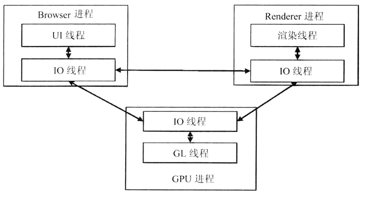

## Chromium

> codec（/kəʊdek/ n. 编码解码器，简称编解码器）是能够对信号或数据流进行编解码操作的设备或者程序。这里的操作包括：
>
> * 编码，将信号/数据流进行编码（通常为了传输、存储或加密）或者提取到一个编码流中
> * 解码，为了观察或者处理，从编码流恢复成适合观察或操作的形式

Chromium 是基于 WebKit(Blink) 构建的开源浏览器，其稳定版本会作为 Chrome 构建的基础。该项目特点：

* 采用很多先进的技术，如跨进程模型、沙箱模型等
* 支持很多新的规范，例如 Canvas2D、WebGL、CSS3 以及很多 HTML5 特性
* 性能高效，包括快速启动，网页加载迅速等

Chromium 和 Chrome 的不同点：

- Chromium 是开源试验场，会尝试很多新特性，当新特性稳定之后，Chrome 才会集成。所以，chrome 的版本会落后于 chromium
- Chrome 会加入一些私有特性，比如支持音视频的 codec（Google 未开源的音视频编解码技术）等
- Chrome 会整合 Google 的很多服务，比如 Google+、Google Mail 等
- Chrome 有自动更新功能，Chromium 没有

本节学习 Chromium 浏览器框架，由外而内逐渐深入学习 Chromium 框架细节，直至 WebKit 内核。

### 基本架构

> embedded /ɪm'bedɪd/ adj. 嵌入的,植入的

Chromium 架构和主要模块如下图。

WebKit(Blink) 只是其中的一部分，与之并列的模块还有：

- [GPU/Command Buffer](http://www.chromium.org/developers/design-documents/gpu-command-buffer)：Chromium 通过
  
  - OpenGL：Open Graphics Library，开放图形库，用于渲染 2D、3D 矢量图形的跨语言、跨平台的 API
  - OpenGL ES：OpenGL for Embedded  Systems，OpenGL 3D 图形 API 的子集，针对手机、PDA 和游戏主机等嵌入式设备而设计
  
  或通过 ANGLE 模拟的 OpenGL ES 与 GPU 通信的方式，它旨在拥有一个模拟 OpenGL ES 2.0 的 API，以实现 3 个目标：
  
  - 安全性，操作系统的图形系统存在巨大的安全漏洞
  - 兼容性，可以很好的跨系统
  - 速度，客户端可以快速地编写命令，只需很少或不与服务进行通信
  
- V8：Google 自己的 JS 引擎

- 沙箱模型：安全机制之一，允许代码执行，但不允许对计算机的更改或者是对机密数据的读取

- [Chromium 合成器](https://www.zybuluo.com/rogeryi/note/67177)：基于图层的合成器，包含以下特性：
  
  - 支持图层动画，比如 Transform 和 Opacity
  - 支持输入事件的处理，比如图层的滚动
  - 支持选择同步或者异步的合成模式
  - 同时支持硬件和软件的输出模式
  - 支持多个合成器构成级联的关系，子合成器的输出是父合成器的输入
  
- 其它模块：
  - UI，User Interface，用户界面
  - IPC，Inter-Process Communication，进程间通信
  - PPAPI：Pepper Plugin Api，Chromium 插件 API

单独使用 Blink(WebKit) 模块也可以渲染网页内容，但无法获得沙箱模型、跨进程的 GPU 硬件加速机制以及众多的 HTML5 功能，所有这些功能由 Content 模块实现。

- Content 模块：使浏览器渲染页面时获得沙箱模型、跨进程的 GPU 硬件加速、众多的 HTML5 功能
- Content 接口：将下面的渲染机制、安全机制和插件机制隐藏起来，抽象出一个接口层供上层模块或其它项目使用
  - 内部调用者包括 Chromium 浏览器、Content Shell 等
  - 外部调用者包括 CEF（Chromium Embeded Framework），Opera浏览器等
    - CEF 也是一个开源项目，致力于基于 Google Chromium 项目开发一个 Web 控件，其基本框架通过原生库提供 C/C++ 的编程接口，这些接口将宿主程序与 Chromium 和 WebKit 的实现细节隔离，能让浏览器与应用程序无缝集成，并支持自定义插件、协议、JS 对象与扩展；宿主程序还能根据需要控制资源加载、页面跳转、上下文菜单、打印等等。

最上层便是浏览器层了，通过 Content 接口使用完整的浏览器功能：

- Content Shell：用于包装 Content API 的一个简单的壳，也是一个简单的“浏览器”。主要作用：
  - 测试 Content 模块很多功能的正确性，例如渲染、硬件加速等
  - 一个参考，可以被很多外部的项目参考来开发基于 “ContentAPI” 的浏览器或各种类型的项目
  - 在 Android 系统中，开发者只能依赖 Content Shell，因为 Chromium 浏览器部分代码未开源
- Android WebView：为满足 Android 系统的 WebView 而设计

### 多进程

单进程浏览器，所有的功能共用一个进程，任何一个功能出现问题都可能导致整个浏览器崩溃。所以，浏览器早期采用单进程时，经常出现一个标签停止响应，整个浏览器都需要重启。

Chromium 率先在 WebKit 之上引入多进程机制，尽管多进程机制存在设计复杂和内存占用高的问题，但也带来了明显的好处：

- 避免因单个页面不响应或崩溃而影响整个浏览器的稳定性
- 第三方插件崩溃时不影响页面或浏览器的稳定性，因为第三方插件也使用单独的进程运行
- 方便了安全模型的实施，因为沙箱模式是基于多进程架构的

桌面系统（Windows、Linux、Mac OS）中 Chromium 最常用的多进程模型如图，其中方框代表进程，连接线代表 IPC 进程间通信。如果两个进程之间没有连接线，则代表两个进程间没有通信。

- Browser 进程：浏览器主进程，负责浏览器界面的显示、各个页面的管理，是所有其它进程的祖先，负责其它进程的创建和销毁工作，有且仅有一个

- Renderer 进程：渲染进程，负责页面渲染工作，可以有多个。其创建模型有以下几种：
  - Process-per-site-instance：通过一个页面上的链接或者触发该页面 JS 事件等打开一系列新的页面，所有这些页面属于一个 site instance，同属一个 Renderer 进程，这是 Chromium 的默认模式。**（注意：这和《WebKit技术内幕》上的描述有区别）**
  
  - Process-per-site：同一个域下的页面共享同一个 Renderer 进程，不论它们是否有相互打开的关系。
  
    - 优点是相同的域共享进程，内存消耗相对较小
    - 缺点是可能会有特别大的 Renderer 进程
  
    可以在命令行加入 --process-per-site 参数来尝试它**（测试发现 Mac Chrome 70 中该模式为默认模式）**
  
  - Process-per-tab：每个标签页都创建一个独立的 Renderer 进程，不管是否是不同域下的不同实例。
  
    - 优点是每个页面互不影响
    - 缺点是资源浪费巨大
  
    可以在命令行加入 --process-per-tab 参数来尝试它
  
  - Single process：不为页面创建任何独立的 Renderer 进程，所有渲染都在 browser 进程中进行，它们只是 browser 进程中的不同线程。该模型主要在内存受限的环境下使用，比如 Android WebView。
  
    可以在命令行加入 --single-process 参数来尝试它
  
- NPAPI 插件进程：为 NPAPI 插件创建的进程，基本原则是每种类型的插件进程只会被创建一次，而且仅在使用时创建，不同网页使用的同一类型插件共用一个进程，例如 Flash 插件。**注意：**NPAPI 插件和 GPU 之间没有进程通信，这意味着采用 NPAPI 标准的插件无法获得 GPU 加速。

- Pepper 插件进程：同 NPAPI 插件进程基本类似，所不同的是为 Pepper 插件创建的进程可以与 GPU 通信。

- GPU 进程：主要用于对 3D 图形加速调用的实现，最多只有一个，当且仅当 GPU 硬件加速打开的时候才会被创建。

- 其它类型进程：还有一些图中为列出的其它进程，例如：

  - Linux 下的“Zygote”进程，Renderer 进程其实就是由它创建而来的
  - Sandbox 准备进程

对于桌面系统 Chromium 多进程模型，可以总结出以下特征：

- Browser 进程与页面的渲染会分开的，这保证了页面渲染导致的崩溃不会导致浏览器主界面的崩溃
- 每个页面的渲染时独立的进程，页面之间相互不受影响
- 插件进程也是独立的，插件本身的问题不会影响浏览器主界面和网页
- GPU 硬件加速进程也是独立的

对于 Android 系统的 Chromium，主体进程模型同桌面系统相同，但为了节省资源，也有一些不同：

- 插件进程：Android 没有插件，所以没有插件进程
- Renderer 进程：Renderer 进程也是独立的进程，只是会演变成 Android 上的 Service 进程，且进程数量严格限制。这里涉及到一个“影子”标签的议题，“影子”标签就是，浏览器会将后台缓存但未显示网页的所有的渲染设施都清除掉，只留下一个“影子”，当用户切回到“影子”标签时，网页会被重新渲染
- GPU 进程：GPU 进程演变成 Browser 进程中的一个线程，即 GPU 线程

### 多线程

为了保证 UI 的高响应度，每个 Chromium 进程都有多个线程，使得各个进程中的主要线程，尤其是渲染线程不被高耗时的操作阻碍，例如，本地文件读写、socket 读写、数据库操作等。

同时，为了利用多核 CPU 的优势，Chromium 将渲染过程管线化，让渲染的不同阶段在不同的线程中执行。

如上图，网页加载和渲染过程的多线程机制：

1. Browser 进程
   * 接收用户请求，UI 线程处理并将相应任务通过 IO 线程转给 Renderer 进程
2. Renderer 进程
   * IO 线程经过简单解析后交给渲染线程
   * 渲染线程接收请求，加载并渲染网页；过程中可能需要 Browser 进程获取资源和 GPU 进程帮助渲染
   * Renderer 进程将渲染结果由 IO 线程传递给 Browser 进程
3. Browser 进程
   * 接收到结果，并将结果绘制出来

### 参考

* 《WebKit技术揭秘》
* https://hk.saowen.com/a/aef5aea1652daf3348e0f3edb36f61c1a53645a910ac165389014f609c8199f0

