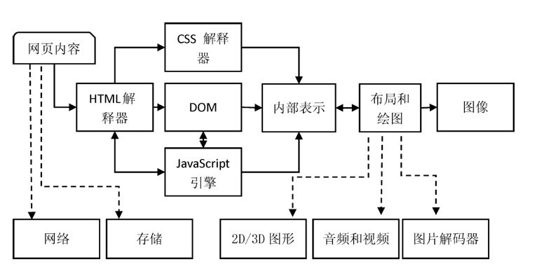
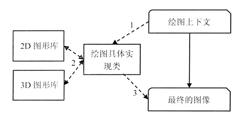

## WebKit

WebKit 有两种含义：广义的 WebKit 和狭义的 WebKit。

广义的 WebKit 指 WebKit 项目，其总体结构的大模块图如下：

狭义的 WebKit 指广义 WebKit 的一个子部分，即 WebKit 嵌入式接口部分，它是 WebCore 和 JavaScript 引擎之上绑定的嵌入式接口层，可以被各种浏览器调用。也即是下文基础架构中的 WebKit 绑定 + WebKit 嵌入式接口两部分。

### 相关项目

#### WebKit2

WebKit2 是相对于狭义的 WebKit 而言，它不是 WebKit 简单的第二个版本，它是一个新的 API 层，最主要的变化就是采用了多进程：

* 一个 UI 进程，处理 Web 平台与浏览器接口的进程
* 一个 Web 进程，Web 页面渲染的进程

这样做的好处是：当网页渲染出现问题时，不会阻碍 Web 接口的调用者进程，这会在很大程度上解决浏览器或者这些调用者的稳定性和安全性等问题。

#### Blink

> Apple 希望可以随便加入和删除代码而无需担心它会破坏其它 Ports 的代码，这遭到很多人的反对和不满。同时，Google 有很多新的功能希望加入 WebKit 中，但是 WebKit 可能并不认可他们。双方分歧越来越多，最终，Google 退出 WebKit 项目，二者从此分道扬镳。

Blink 并非一个全新的渲染引擎，而是与 Apple 分道扬镳以后，Google 从 WebKit 直接复制一个版本并删除了所有与 chromium 无关的 Ports 后的作品。

Blink 的出现代表 Google 和 Apple 将从同一个起源 WebKit 开始，各自将沿着自己独立的方向发展，之后的差距或许会越来越大。根据 chromium 官方的说法，大概会有两个比较大的改变：

* 跨进程的 iframe (out-of-process iframes)：为 iframes 内容创建单独的沙箱进程来渲染它们
* 将 DOM 移入 JavaScript 中，这样 JavaScript 可以更快的访问 DOM

### 架构

WebKit 的架构如下图，其中：

* 实线框，表示该部分在不同浏览器的 WebKit 内核中基本上是共享的，但也不是绝对的，因为它们中可能有一些特性并不是共享的，而且也可以通过不同的编译配置改变它们的行为
* 虚线框，表示该部分在不同浏览器的 WebKit 内核中的实现是不同的，即它们不是普遍共享的

**WebKit 架构只是将上文广义的 WebKit 大模块图的四个部分进行了详细化。**

下面对架构中的主要部分从下向上进行分析：

* 操作系统：基于 WebKit 的浏览器可以在不同的操作系统上工作，比如，Chromium 浏览器支持 Windows、Mac OS、Linux、Android 等。
* 第三方库：WebKit 运行的基础，加载和渲染页面需要它们，包括：2D/3D 图形库、网络库、存储库、音视频库等。WebKit 是这些库的使用者，如何高效地使用它们是 WebKit 和各个浏览器厂商的重大课题，主要是如何设计良好的架构来利用它们以获得高性能。

操作系统和第三方库之上就是 WebKit 项目：

* WebCore 部分：包括目前被各个浏览器所使用的 WebKit 共享部分，是加载和渲染网页的基础部分，具体包括 HTML 解释器、CSS 解释器、SVG、DOM、渲染树（RenderObject 树、RenderLayer 树等），以及调试网页的 Inspector。
* JavaScriptCore 引擎：是 WebKit 默认的 JS 引擎，WebKit 中对 JS 引擎的调用是独立于 WebCore 的。Google 的 Chromium 项目中，它被替换为 V8 引擎。
* WebKit Ports：WebKit 移植，是 WebKit 中的非共享部分。由于 WebKit 内核最终会被封装到各个不同的浏览器中，例如 Safari 和早期 Chromium；不同浏览器存在平台差异，依赖的第三方库和需求不同，需要完成基于自身操作系统和依赖模块的实现，这就是所谓的 **WebKit 移植**。WebKit 移植也是导致众多 WebKit 版本行为不一致的重要原因。
* WebKit 嵌入式接口：提供给各种浏览器调用。 图中左右两个部分分别是狭义的 WebKit 接口和 WebKit2 的接口。因为接口与具体的移植有关，所以需要一个与浏览器相关的绑定层。

### 渲染

浏览器的渲染，就是将 HTML/CSS/JS 文本及其相应的资源文件转换成图像结果的过程。

#### 模型

浏览器渲染引擎及依赖模块的模型如下：

浏览器渲染引擎及依赖模块模型，只是将上文 WebKit 架构中与渲染相关的核心部分抽离出来，从下到上依次是：

* 操作系统
  
  * 提供系统级支持，例如线程支持、文件支持等
* 第三方库/依赖库
  
- 渲染引擎模块依赖很多其它的基础模块，其中包括网络，存储，2D/3D 图形，音频视频和图片解码器等
  
* 渲染引擎

  主要包括 HTML 解释器、CSS 解释器、布局和 JavaScript 引擎

  * HTML 解释器：将 HTML 文本解释成 DOM 树，DOM 是一种文档的表示方法
  * CSS 解释器：计算 DOM 中各个元素对象的样式信息，为最后的网页布局提供基础设施
  * 布局：将 DOM 元素对象同样式信息结合起来，计算其大小、位置等布局信息，形成一个能够表示所有信息的内部表示模型
  * JavaScript 引擎：解释 JS 代码并通过 DOM 和 CSSOM 接口来修改网页内容和样式信息，从而改变渲染的结果
  * 绘图：使用图形库，将布局计算后的内部表示模型绘制成图形

#### 机制

模型中的模块，相互协作完成渲染过程的机制如下：

1. 通过网络和存储模块，获取网页内容 HTML 文本
2. HTML 解释器解析 HTML 文本得到 DOM 树，解析过程中如遇 CSS/JS 外链则调用网络模块获取
   * CSS 交给 CSS 解释器去解析
   *  JS 交给 JS 引擎处理，JS 引擎可以随时通过 DOM API 修改 DOM 树
3. DOM 树建立后，渲染引擎接受 CSS 解释器的样式信息，构建一个新的内部表示模型
4. 内部表示模型由布局模块计算模型内部各个元素的位置和大小信息
5. 绘图模块完成从模型到图像的绘制，过程中可能需要使用2D/3D 图形，音频、视频和图片解码器

###### URL -> DOM树

从网页 URL 到构建完 DOM 的详细过程如图，数字表示基本顺序，当然，也不是严格一致。

1. 用户输入 URL，WebKit 调用其资源加载器加载 URL 对应的网页
2. 加载器依赖网络模块建立连接，发送请求并接受答复
3. WebKit 接收到网页和资源数据，资源可以是同步的也可以是异步的
4. 网页被交给 HTML 解释器转变成一系列的词语（Token）
5. HTML 解释器根据词法构建节点（Node），形成 DOM 树
6. 如果节点是 JavaScript 代码的话，调用 JS 引擎解释并执行
7. JS 引擎可能会修改 DOM 树的结构

在上述过程中，有 2 个经常用到的事件需要注意：

* DOMContentLoaded：DOM 树构建完成后发出
* load：DOM 树构建完成且所依赖的资源都加载完成后发出

###### DOM树- > 绘制上下文

从 DOM 树到构建完 WebKit 绘制上下文过程图示如下。

1. CSS 解释器解释完成后，在 DOM 树上附加解释后的样式信息，得到 RenderObject 树
3. WebKit 根据网页的层次结构创建 RenderLayer 树
3. 基于  RenderLayer 树构建一个虚拟的绘图上下文

需要注意的是：

* DOM树、RenderObject 树、RenderLayer 树和绘制上下文会一直存在，直到网页被销毁

###### 绘制上下文 -> 图片

从绘制上下文到最终的图片，这一过程主要依赖 2D 和 3D 图形库。

1. 绘图上下文是一个与平台无关的抽象类，它将每个绘图操作桥接到不同的绘图具体实现类
2. 绘图实现类需要调用 2D 和 3D 图形库来完成相应的绘制。这个过程可以有简单的实现，也可以有复杂的实现。Chromium 中就实现的相当复杂，需要 Chromium 合成器来完成复杂的多进程和 GPU 加速机制
3. 绘制实现类将 2D 和 3D 图形库绘制的结果保存下来，交给浏览器来显示

### 参考

* 《WebKit技术揭秘》
* https://hk.saowen.com/a/aef5aea1652daf3348e0f3edb36f61c1a53645a910ac165389014f609c8199f0

