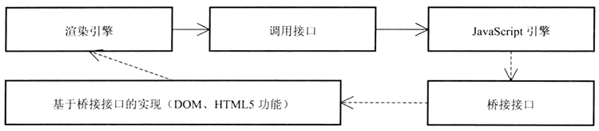
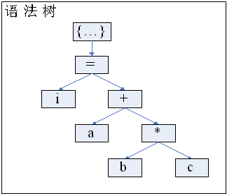
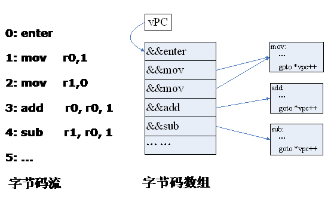
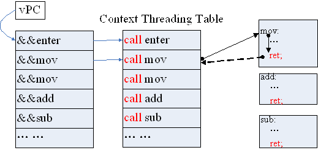
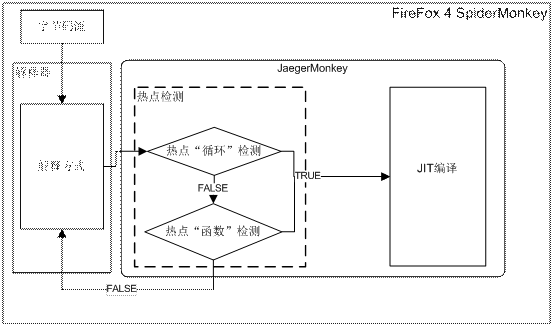
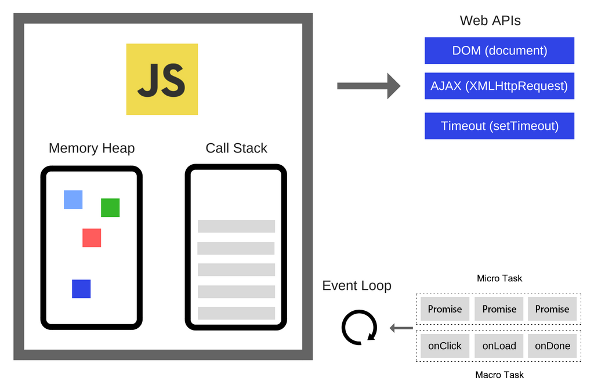
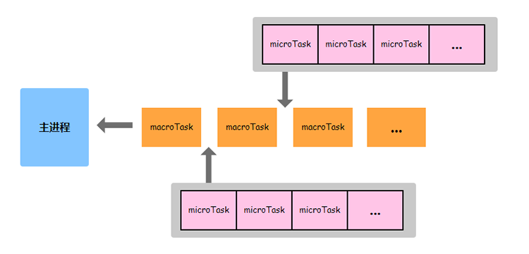
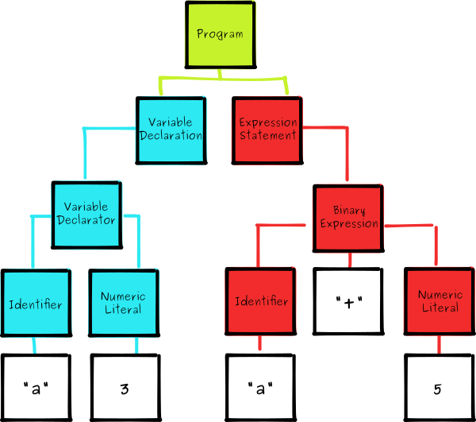

## JS 引擎

> 虚拟机：一种特殊的软件，可以在计算机平台和终端用户之间创建一种环境，使得终端用户可以基于该软件所创建的环境来操作软件。有系统虚拟机和程序虚拟机之分：
>
> * 系统虚拟机 - 可以运行完整的操作系统，如 VMware
> * 程序虚拟机 - 也叫进程虚拟机，支持单个进程，可以运行单个计算机程序，例如 Java 虚拟机

JS 引擎是一种虚拟机，是 JS 代码的运行环境，其作用就是将 JS 代码编译成机器可理解执行的机器代码。

渲染引擎渲染页面，JS 引擎执行 JS 代码。两者的交互逻辑：

* 渲染引擎通过 JS 引擎提供的调用接口，使用 JS 引擎处理 JS 代码并获得结果
* JS 引擎通过桥接接口访问或修改渲染引擎生成的 DOM 树



代码执行通常有两种方式：

* 编译执行，由编译器执行，原理是运行前先将源代码，如 C、C++ 等，针对特定平台（如x86、arm、mips）编译成机器代码，在运行时就可以直接在相应的平台上执行
  * 优点是一次性编译，运行效率高
  * 缺点是平台移植性很差
* 解释执行，由解释器执行，原理是在代码运行/runtime 的时候，如 Python、JS 等，再逐条翻译成机器代码并执行，边翻译边执行，周而复始
  * 优点是平台移植性好，开发成本低
  * 缺点是重复性编译，运行效率低

作为动态/解释执行的 JS，与静态/编译执行语言相比，低性能特性几乎是与生俱来的，制约其性能的因素主要有：

1. 类型，JS 是无类型的语言，对象标识和属性访问比静态语言存在更大的性能损失
2. 解释执行，JS 无法像静态语言那样通过预编译转变成速度更快的本地代码

提高 JS 执行性能是从语言诞生就存在的课题。除了优化语言本身的编程规范之外，作为执行环境的 JS 引擎设计的优劣是关乎其执行性能的重要因素。

如果不考虑 WebAssembly，目前 JS 引擎的主要执行原理如下。


其主要部分包括：

* 编译器：将源代码编译成抽象语法树（AST），在一些引擎中，编译器还负责将 AST 转换成字节码
* 解释器：主要解释执行字节码，同时依赖垃圾回收机制
* JIT 工具：即时编译工具，将 AST 或字节码转换成本地代码，同时依赖解释器告知哪些代码执行频次高
* 垃圾回收器和分析工具：负责垃圾回收和收集引擎中的信息，帮助改善引擎性能

过去的十年里，JS 引擎性能提升了数十倍，其核心原理也几经变迁。

### 实现原理

在提升 JS 性能的过程中，JS 引擎的核心实现原理历经以下几种方式：

* 遍历语法树
* 字节码方式
* JIT 编译方式
* WebAssembly

#### 遍历语法树


源码加载后，通过编译器的词法和语法分析转变成 AST；执行时，解释器通过遍历语法树的方式解释执行相应代码

* 词法分析 ：JS 编译器先把 JS 代码（字符串）的字符流按照 ECMAScript 标准转换为记号流
* 语法分析 ：JS 语法分析器在经过词法分析后，通过记号流按照 ECMAScript 标准生成抽象语法树

遍历语法树（syntax tree walker）是 JS 引擎解释执行代码最原始的实现方式，执行语句的过程就是遍历对应语法树的过程。

例如，一条赋值语句：

```
i = a + b * c;
```

经过词法分析后，生成一堆单词流：

```
"i", "=", "a", "+", "b", "*", "c";
```

经过语法分析后，生成如下的语法树：



执行这条语句，就会遍历这棵语法树。遍历语法树的过程在程序设计上一般采用访问者模式（vistor pattern）来实现。要遍历这颗语法树，只要将根节点传给 visit 函数， 然后该函数递归调用相应子节点的 visit 函数，如此反复直到叶子节点。

在这个例子中，根节点是个赋值语句，它知道应该计算出右边表达式的值，然后赋给左边的地址；而在计算右边表达式的时候，发现是一个加法表达式，于是接着递归计算加法表达式的值，如此递归进行直到这颗树的叶子节点，然后一步步回溯，将值传到根节点，就完成了一次遍历，也即完成了一次执行。

遍历语法树的优点是：

* 实现简单
* 性能要求不高

遍历语法树的缺点是：

* 语法树只是描述语法结构，并不是执行这条语句要进行的操作。例如对于语句：`｛x = 1; y = x;｝`，根节点是个复合语句 `｛...｝`，他的子节点是两个赋值语句，解释器首先访问这个复合语句节点，但实际上没有做任何事情，然后访问第一个赋值语句，接着访问第二个赋值语句。在一个复杂的程序中，这种不是执行单元，但却是语法树不可或缺的节点很多。因此就会导致做很多无用功。
* 访问每个节点的代价太大。遍历语法树一般采用访问者模式，访问每个节点至少需要一次函数调用和返回，也即有两个间接跳转，而对于现代 CPU 而言，这种间接跳转意味着大大增加了分支预测失败的可能行（尤其对于第一次运行的语句，没有记录可以参考，分支预测必须等待前一句运行结束，如函数返回后，才能确定下一步的运算方向，无法提前准备 CPU 流水线）。

#### 字节码方式


字节码，Bytecode，通常指的是经过编译且与特定机器代码无关，需要解释器转译后才能成为机器代码的**中间代码**。字节码通常不像源代码一样可以让人阅读，而是编码后的**数值常量 (基本数据类型)、引用 (复合数据类型)、指令等构成的序列**。字节码的实现方式是通过编译器将源码编译成字节码，特定平台上的虚拟机将字节码转译为可以直接运行的指令。字节码的典型应用为 Java bytecode。

JS 字节码在设计上大体上都可归类为以下两类：基于栈 (stack-based) 和基于寄存器（register-based）。

1. 基于栈

   传统的字节码设计大多是基于栈的，这种方式将所有的操作数和中间表示都保存在一个数据栈中。如语句：c = a + b，转换后的字节码如下：

   ```
   LOAD a   # 将a推入栈顶
   LOAD b   # 将b推入栈顶
   ADD      # 从栈顶弹出两个操作数，相加后，将结果推入栈顶
   STORE c  # 将栈顶数据保存到C中
   ```

2. 基于寄存器

   基于寄存器的字节码通过一些槽（slot）或称为寄存器（register）的方式保存操作数。这里的寄存器与汇编代码中的寄存器是两个概念。存在寄存器（或槽）中可以想象成就是存入一个固定数组中了。上面例子要是转换成基于寄存器的代码如下：

   ```
   ADD c, a, b   # 两个操作数分别存在a和b中，将结果放在c中。
   ```

这两种字节码设计各有优劣：

* 栈式字节码每条的指令更短，因为操作树是隐式的存在栈中，但是总的指令条数更多
* 栈式虚拟机实现起来比寄存器式来得简单

目前这两种方式都有各自的实现：如 Flash Player 的 ActionScript 虚拟机 Tamarin，Firefox 的 JagerMonkey，采用的是栈式字节码设计；而 WebKit，Carakan 采用基于寄存器方式。采用哪种设计取决于设计者关注的侧重点不同。想详细了解这两种设计的优劣，可参考一些论文：

* [The case for virtual register machines](http://portal.acm.org/citation.cfm?id=858575)
* [Virtual machine showdown: Stack versus registers](http://portal.acm.org/citation.cfm?id=1328195.1328197)

字节码是需要在虚拟机中执行的，而虚拟机的执行过程与 CPU 过程类似，也是取指、解码、执行的过程。通常情况下，每个操作码对应一段处理函数，然后通过 switch loop 的方式进行分派。如:

```
while (1) {
    opcode = *vpc++;
    
    switch (opcode){
        case move:
            no_move();
            break;
        case add:
            no_add();
            break;
        // 其它情况
    } 
} 
```

其中，vpc 是一个指向字节码数组的指针，在虚拟机中作用与 PC 寄存器在实际机器中的作用类似，所以称作虚拟PC（virtual program counter）。

与遍历语法树方式相比，字节码方式就消除了遍历语法树所引起的大部分性能负担。首先字节码序列直接描述了需要执行的动作，去除了多余的语法信息；其次，执行一条字节码语句，只是一次的内存访问（取指令）再加上一次间接跳转（分派到对应的处理函数），这也比访问语法树中一个节点开销来的要小。

因此，字节码方式与遍历语法树相比在性能上有很大的提升。**虽然从语法树生成字节码也是需要时间的，但是这一小段时间可以从直接执行字节码所获得的性能提升上得到补偿。**毕竟在实际的代码中，不会所有的代码都只被执行一次。而且生成了字节码之后，就可以对于这种中间代码进行各种优化，比如常量传播、常量折叠、公共子表达式删除等等。当然这些优化都是有针对性和选择性的，毕竟优化的过程也是需要消耗时间的。而这些优化要想直接在语法树上进行几乎是不可能的。

字节码方式相对于遍历语法树已经前进了一大步，但是，Switch Loop 分派方式每次处理完一条指令后，都要回到循环的开始，处理下一条，并且每次 switch 操作，可能都是一次线性搜索，这对于一般的函数，只有有限的几个 switch case，尚可接受，但是对于虚拟机来说，有上百个 switch case 并且是频繁地执行，执行一条指令就需要一次线性搜索，那还是太慢了。如果能用查表的方式直接跳转，就可以省去线性搜索的过程了。于是在字节码的分派方式上，有的新的改进，称作 Direct Threading。

##### Direct Threading

> threading /'θrediŋ/ n. 穿线 v. 穿过 

Direct Threading，threading 与线程无关，可以理解为“线”。以这种方式执行时，每执行完一条指令后不是回到循环的开始，而是**直接跳到下一条要执行的指令地址**。这种方式就比原来的 Switch Loop 方式有效许多。但是要想有效的实现 Direct Threading，需要用到一个 gcc 的扩展 “[Labels As Values](http://gcc.gnu.org/onlinedocs/gcc/Labels-as-Values.html)”，普通的 goto 语句的标号是在编译时指定的，但是利用“Labels As Values”扩展，goto 语句的标号是可以在运行时计算（这种 goto 语句也叫[Computed Goto](http://dev.djt.qq.com/~czbobchen/djtv2/admin/article/edit/474#Computed_GOTO)），利用这个特性就可以很容易地实现 Direct Threading（想在windows平台用这个特性，也有几个 GCC 的 windows 移植版本，如 MinGW, Cygwin 等）。

字节码方式中的代码可以改进为：

```
opcode = *vpc;

{
    move:
        no_move();
        goto *vpc++;
    add:
        on_add();
        goto *vpc++;
    // 其它情况
}
```

Direct Threading 方式已经没有了循环和 switch 分支，字节码分派通过 `goto *vpc++` 进行。vpc 在这里是指向字节码数组的指针，字节码数组里的元素就是各个标号的地址。例如，如果有个指令序列是：

```
mov, add, ret
```

那么对应的字节码数组就是：

```
[&&mov, &&add, &&ret]
```

一开始，vpc 指向数组的第一条指令，即 vpc = &&mov，那么 `goto *vpc` 就会跳到标号为“mov”的地方开始执行，普通的 goto 语句无法完成，这是利用 gcc 的“labels as values”特性；在执行“mov”处理函数末尾的 `goto *vpc++` 之后，就直接跳转到标号“add”的地方开始执行；直到最后。 

Direct Threading 的执行过程如下图所示：



最左边是生成的字节码序列，中间就是字节码序列对应的数组，右边是对应的虚拟机实现代码。开始执行时，vpc 指向字节码数组的开始，即“enter”指令，虚拟机开始执行“enter”指令对应的操作，在“enter”对应的操作的末尾有个“goto *vpc++”，这时的 vpc 就指向字节码数组的下一条字节码，然后进入 mov 指令对应的操作。如此反复直到执行完这个字节码数组中的指令。每执行完一条指令，就直接跳转到下一条指令的地址处，这就跟一根“线”穿过一条弯曲的隧道。

在引入即时编译（JIT）之前，Direct Threading 方式基本上就是采用字节码方式的解释器最快的分派方式了。对于一般的 JS 运算，这种方式也足够用了，但这种方式也有很大的局限性，可参考：

- [The structure and perfromance of efficient interpreters](http://www.jilp.org/vol5/v5paper12.pdf)

毕竟解释执行方式肯定比不上直接执行二进制代码。于是接下来即时编译（JIT）技术被引入了 JS 引擎。

#### JIT 编译方式

JIT(Just-In-Time) 编译，即时编译，是将静态编译和解释执行相结合的优化方法，原理是在“解释”运行（这一点与解释执行类似）的同时进行跟踪，如果某一段代码执行了多次，就会对这一段代码进行编译优化（这又与静态编译类似），这样，如果后续再运行到这一段代码，就可以直接执行。同时，即时编译可以为 CPU 的分支预测器提供足够的上下文信息，从而有效提高分支预测器的准确度。JIT 编译目前已经是主流浏览器 JS 引擎的标配。

现在的微处理器大量应用流水线构架来达到提高性能的目的。要让流水线总是保持满负荷运转，微处理器有一个专门的硬件设备“分支预测器”来预判分支的目标地址。其原理是：在执行一条指令时，提前将下一条执行的指令放入流水线，上一条指令执行一结束，接下来的指令已完成取值和解码阶段，可直接执行。分支预测可能大大提高处理器的性能。但是，分支预测如果失败，则需清空整个流水线，重新加载新的指令，这又会导致严重的性能损耗。所以，分支预测的准确度十分重要。

[分支预测](http://en.wikipedia.org/wiki/Branch_predictor)是通过利用 PC 寄存器和分支目标的相关性来进行预测。从 Direct Threading 执行过程可以看到分支跳转的目标，如 `goto *vpc++`，是与 vpc 相关，而与实际的 PC 寄存器硬件无关。所以分支预测器没有足够的信息来进行有效的预测，这就容易导致预测失败。在 Direct Threading 中，当运行到 add 处理函数尾部，执行 `goto *vpc++` 之前，“分支预测器”无法判断跳转目标在哪里，只有等语句执行完才能准确判断跳转，这就导致分支预测时不能把正确的后续指令推入流水线。数据表明：30% ~ 40% 的执行时间会消耗在这种由于分支预测失败引起的额外处理上。所以要提高分支预测的成功率，就要给 “分支预测器” 提供足够的上下文信息，Context threading 技术就是以此得名。

**要提高分支预测的准确度，对于动态语言，必须提前执行才能准确预测；通过提前编译，知道我从何处来，要到何处去，并将编译得到的本地调令存储到 Context Threading Table，依此提高分支预测器的预测成功率。**



如图，左边是字节码数组，增加 Context Threading Table（从表中看到已经有即时编译了），将字节码数组中的每条指令编译成一条条的本地调用（call指令）。与 Direct Threading 相比，除了 Context Threading Table外，每个处理函数的结尾（右图红色标示）还有一个与call 指令对应的 ret 指令。现代 CPU 对本地调用的返回地址提供一个非常有效的预测机制，从而避免大量的分支预测失败。如上图，CPU 执行到 `call add` 时，在进入 add 的处理函数之前，会将返回地址（在这里就是下一条指令 `call sub` 指令的地址）保存在栈中，然后进入 add 的处理函数，当执行到 add 处理函数末尾 ret 时，“分支预测器” 这时就可以预测要跳到哪了，就是刚才进入 add 处理函数之前保存的返回地址。所以在实际执行 ret 之前就可以准确的判断到将要执行的指令。之前的Direct Threading 方式无法做到这一点。

不过，没有必要将字节码数组中的每条指令都编译成本地调用，因为很多语句可能也就只执行一次。在实际的 JS 引擎中，对于简单指令，如 mov，就直接即时编译并 inline 到机器码中；复杂指令，如 add 指令（JS 是动态语言，是无类型的，在运行 add 指令时需要类型判断，如操作数都是数值类型，那么就进行数值加运算；如果操作数都是字符串类型，就进行字符串加运算，还有其他各种类型，所以 add 指令也算是比较复杂的指令），也会对它的常用方式（如操作数都是数值，或都是字符串）直接生成对应的机器码，对于 add 的其他不常用情况（如一个操作数是数值，另一个是字符串，或者发生溢出了等等情况）则是生成一条 call 本地调用。

从 AST 生成字节码会消耗执行时间，将字节码编译成本地机器码（JIT 的过程）也需要消耗执行时间。在生成机器码过程中，实施越多的优化，生成的机器码质量越高，同时延迟时间也越长，所以需要权衡延迟的时间与生成的代码质量。

一般情况下，JS 引擎并不对所有代码都生成机器码，只对热点（hot spot）片段进行即时编译，同时在运行中会随时跟踪热点的状态，如果热点被执行得越频繁，实施的优化也越激进。

以 FireFox 3.5 JS 引擎 SpiderMonkey 为例（FireFox 3.5 的 JIT 编译器叫 TraceMonkey），在开始执行时，将源代码生成字节码，然后解释执行字节码，在执行过程中，如果发现一条路径多次执行（比如一个循环体），那么就标记为“HOT”，同时将这条路径上的代码即时编译成机器码，当下次再运行到这条路径时，就直接运行机器码。

在FireFox4.0中，将 JIT 编译器 TraceMonkey 升级为加强版的 JaegerMonkey，它除了跟踪热点路径外，同时又加入的热点函数的跟踪。如下图：



在上图判断热点的虚框中，如果一个路径被执行了超过 16 次（比如“循环”迭代了超过 16 次），或一个函数被调用超过 16 次，那么就进行即时编译，否则解释执行。以这种方式，在 JS 代码运算强度越大时 JS 引擎性能提高得越明显，因为对于越频繁执行的代码，不仅是已经被编译成机器码了，同时执行的编译时优化和运行时优化也越充分。

#### WebAssembly

即便使用 JIT 即时编译技术，获得的性能提升也不足以使 JS 应用到诸如 3D 游戏、虚拟现实、增强现实、计算机视觉、图像/视频编辑以及大量的要求原生性能的领域。要使 JS 拥有接近原生的性能，就必须使 JS 拥有类似 C/C++ 的 AOT（ahead-of-time，提前编译）能力。但是，作为动态语言的 JS 很难拥有这种能力，Firefox 的 Asm.js 已经算是这方面最前卫的尝试了，但是依旧不够彻底且限制较多。

与其尝试让似乎永远不可能拥有原生性能的 JS 尽可能接近预编译语言的性能，不如让本身就拥有高性能的预编译语言直接在浏览器中运行，而 WebAssembly 就是为此而生。

WebAssembly，简称称 WASM，它是一种低级的类汇编语言，具有紧凑的二进制格式，可以以接近原生的性能运行。同时，也为诸如 C / C ++ 等语言提供一个编译目标，以便这些语言可以通过编译成 WebAssembly 格式后在Web 上运行。之所以被设计成低级的类汇编语言，是处于以下 2 点考虑：

* 更好的接近原生的性能和可移植性，机器语言性能最好，但是人难以阅读和编程，且移植性差，因为不同系统的机器语言不同。所以，要保证足够的性能，越接近机器语言越好，同时考虑可移植性，类汇编语言就成了最好的选择，在不同的设备中，汇编语言对应着不同的机器语言指令集，通过简单的汇编过程，可以轻易转变成机器代码。性能高且可移植性好。
* 方便其它高级语言编译成 WebAssembly，其它静态语言，如 C/C ++、Java 等，需要编译成 WebAssembly 后，才能通过 JS 提供的 API (window.WebAssembly) 在 Web 中运行。对于高级语言的编译过程，大多会有一个翻译成汇编语言，然后再由汇编语言编译成机器代码的过程。所以，将 WebAssembly 设计成类汇编的低级语言，也方便了其它语言的转译。

总之，WebAssembly 是一门不同于 JavaScript 的语言，但是，它不是用来取代 JavaScript的。相反，它被设计为和 JavaScript 一起协同工作，从而使得网络开发者能够利用两种语言的优势：

* JavaScript 是一门高级语言。对于写网络应用程序而言，它足够灵活且富有表达力，作为动态类型语言，不需要编译环节以及一个巨大的能够提供强大框架、库和其他工具的生态系统。
* WebAssembly 是一门低级的类汇编语言。它有一种紧凑的二进制格式，容量更小，网络加载速度更快，而且能够以接近原生性能的速度运行。（注意，WebAssembly 有一个在将来支持使用了垃圾回收内存模型的语言的高级目标）

所以，未来，只要能编译成 WebAssembly 的语言都将可以在浏览器中运行，这也意味着，开发 Web 应用的语言可以是 JavaScript，可以是 WebAssembly，还可以是 C/C++、Java、Rust 等...

当前，主流浏览器的新版本的 JS 引擎中都已经集成了执行 WebAssembly的 能力，WebAssembly 使用参考：

* https://zhuanlan.zhihu.com/p/42274816

#### 参考

* http://djt.qq.com/article/view/489
* https://blog.csdn.net/IamChuancey/article/details/78453269
* https://zh.wikipedia.org/wiki/%E5%AD%97%E8%8A%82%E7%A0%81
* https://zhuanlan.zhihu.com/p/25669120
* https://zhuanlan.zhihu.com/p/25718411
* https://developer.mozilla.org/zh-CN/docs/WebAssembly
* https://developer.mozilla.org/zh-CN/docs/WebAssembly

### 执行机制

JS 引擎的执行机制是事件循环 (Event Loop)，但是在学习事件循环之前，有必要学习单线程和任务队列。

#### 单线程

JS 是一门单线程语言，尽管 HTML5 提出了 Web Worker，但 JS 是单线程这一核心仍未改变。

作为浏览器脚本语言，JS 的主要用途是与用户交互，并操作 DOM。如果 JS 同时存在多个线程，其中，有的线程向 DOM 节点添加内容，有的却又删除这个节点，这种矛盾如何解决？所以，为了避免复杂性，JS 从一诞生就是单线程的。

#### 任务队列

JS 程序执行方式有两种：

* 同步执行

  代码在主线程上顺次先后执行

* 异步执行

  为了防止主线程被阻塞，程序并不会等待高耗时 I/O 任务执行完成，就立即返回执行后续代码。当 I/O 执行结束时，这种异步任务进入任务队列，主线程按照特定的执行机制可以执行异步任务时，相应异步任务才会进入主线程执行

最初，任务队列中的任务并没有明显的区别，它们按照先进先出的规则先后被推入主线程执行。但是，随着 ES 的发展，单一的 tash（任务）类型已经无法囊括所有应用场景，所以逐渐分化出 2 个子任务类型：

* 宏任务，Macro Task

  浏览器为了使 JS 内部任务与 DOM 任务能够有序的执行，会在一个宏任务执行结束，下一个宏任务执行开始前，对页面进行重新渲染 ，即宏任务和页面渲染的顺序是：

  ```
  宏任务-> 渲染 -> 宏任务 -> 渲染 -> ...
  ```

  可以产生 Macro Task 的操作：

  * setTimeout
  * setInterval
  * setImmediate
  * requestAnimationFrame
  * UI rendering
  * I/O

* 微任务，Micro Task

  只要执行栈中没有其他的 JS 代码正在执行，或者每一个宏任务执行结束，所有的微任务就会立即全部执行。如果在微任务执行期间又产生了新的微任务，那么新的微任务会在旧的微任务执行结束后立即执行，不会等待下一个宏任务先执行。所以，微任务的执行更加及时，执行开销更小。

  需要注意的是，在 Node.js 中，process.nextTick 的执行在当前执行栈的尾部，但是，为了更好的理解运用，有人从微任务中分化出 Tick Task 用来存放 process.nextTick 产生的任务，执行时，所有的 Tick Task 总是在其它微任务前执行，即实际执行效果同放在当前执行栈尾部相同。

  可以产生 Micro Task 的操作：

  * Promise.callback()
  
  * MutationObserver
    
  * await，async/await 是 promise + generator 的语法糖
  
  ```
  async function async1() {
      console.log('async1 start');
      await async2();
      console.log('async1 end');
  }
  
  // 等价于
  async function async1() {
      console.log('async1 start');
  
      Promise.resolve(async2()).then(() => {
      		console.log('async1 end');
      })
  }
  ```
  
  可以产生 Tick Task 的操作：
  
  * process.nextTick

当任务分化成宏任务和微任务以后，原本的 Event Loop 事件队列也分化成了 2 个队列：

* Macro Task 队列
* Micro Task 队列

#### 事件循环





JS 执行的事件轮询机制：

```
主线程 > 渲染 > Micro Task 队列任务 > Macro Task 队列任务 > 渲染 > Micro Task 队列任务 > ...
```

1. 所有同步程序都在主线程上顺次执行，形成一个执行栈
2. 主线程启动时，会创建一个"任务队列"。只要异步任务有了运行结果，就在"任务队列"之中放置一个事件
3. 当"执行栈"中的任务执行完毕后

   (1) 主线程读取 Micro Task 队列中所有任务并执行，执行完毕后再次检测 Micro Task 任务队列是否有新的任务，如果有，全部推入主线程执行栈执行，如此循环，直至 Micro Task 任务队列没有任务为止。即微任务执行采用”贪婪“模式

   (2) 主线程读取 Macro Task 任务队列中的第一个任务并执行，执行完毕后浏览器进行一次渲染；然后再从第 (1) 步开始，如此循环。即任务执行采用”懒惰“模式

需要注意的是：

- 任务队列分化后的执行，目前各种浏览器的实现还不统一，所以，依赖任务执行顺序的代码可能并不可靠，比如，Vue 的 nextTick 就使用 MutationObserver 实现
- 将浏览器 JS 引擎的任务队列机制应用于 Node.js，结果与实际执行结果通常（注意：并非百分之百）是一致的，不过，Node.js 的事件循环机制要更加复杂一些，具体可参考《96-深入理解之NODE》

#### 应用实践

##### 示例1

```
setTimeout(() => {
    console.log('timeout_1');
    Promise.resolve().then(() => console.log('timeout_promise'));
}, 0);

setTimeout(() => console.log('timeout_2'), 0);

new Promise(resolve => {
    resolve();
    console.log('promise_1');
}).then(() => {
    console.log('then_1');
    Promise.resolve().then(() => console.log('then_1_1'));
});

new Promise(resolve => {
    resolve();
    console.log('promise_2');
}).then(() => {
    console.log('then_2');
    Promise.resolve().then(() => console.log('then_2_1'));
});

console.log('global_1');

// promise_1
// promise_2
// global_1
// then_1
// then_2
// then_1_1
// then_2_1
// timeout_1
// timeout_promise
// timeout_2
```

##### 示例2

比较 async 函数有无 return 时的区别

无 return：

```
async function async1() {
    console.log('async1 start');

    await async2();
    console.log('async1 end');
}

async function async2() {
    console.log('async2 start');

    // 这里没有 return
    new Promise((resolve, reject) => {
        resolve();
        console.log('async2 promise');
    })
}

console.log('script start');

setTimeout(function () {
    console.log('setTimeout');
}, 0);

async1();

new Promise(function (resolve) {
    console.log('promise1');
    resolve();
}).then(function () {
    console.log('promise2');
});

console.log('script end');

// script start
// async1 start
// async2 start
// async2 promise
// promise1
// script end

// async1 end
// promise2

// setTimeout
```

有 return：

```
async function async1() {
    console.log('async1 start');

    await async2();
    console.log('async1 end');
}

async function async2() {
    console.log('async2 start');

    // 这里有 return
    return new Promise((resolve, reject) => {
        resolve();
        console.log('async2 promise');
    })
}

console.log('script start');

setTimeout(function () {
    console.log('setTimeout');
}, 0);

async1();

new Promise(function (resolve) {
    console.log('promise1');
    resolve();
}).then(function () {
    console.log('promise2');
});

console.log('script end');

// script start
// async1 start
// async2 start
// async2 promise
// promise1
// script end

// promise2
// async1 end

// setTimeout
```

async 函数执行默认返回一个 Promise，无论是否有返回值，亦或返回值是什么类型。如果 async 函数中再返回一个 Promise，结果就是返回的是一个嵌套的 Promise，比如这里的 `async2()` 就是一个嵌套的 Promise

`await async2()` 在微任务队列中放置一个 Microtask，并立即让 async1 函数返回，执行后续的同步任务。等到微任务队列第一次被执行时，外层的 Promise 被消耗掉；同时，内层的 Promise 再次在微任务队列尾部放置一个 Microtask，这个 Microtask 就会在 "promise2" 所在的微任务之后。

所以，"async1 end" 在第二轮微任务队列执行时输出，自然在位于第一轮的微任务  "promise2" 输出之后；同时也就是说，await 会等到嵌套的异步任务都执行完成以后，才会执行后续任务。

#### 参考

- https://segmentfault.com/a/1190000014940904
- https://www.zhihu.com/question/55364497/answer/144215284

### 内存管理

 JS 引擎内存管理相关内容可查看《96-深入理解之NODE》


### 相关概念

#### 抽象语法树

AST，Abstract Syntax Tree，抽象语法树。

Webpack、Rollup、UglifyJS、Lint 等工具和库的核心都是通过 AST 实现对代码的检查、分析等操作的。这些工具的原理都是通过 JS Parser 把代码转化为一颗 AST，这颗树定义了代码的结构，通过操纵这颗树，可以精准的定位到声明语句、赋值语句、运算语句等等，实现对代码的分析、优化、变更等操作。


##### 定义

wikipedia定义：

> In computer science, an abstract syntax tree (AST), or just syntax tree, is a tree representation of the abstract syntactic structure of source code written in a programming language.

翻译为：

> 在计算机科学中，抽象语法树（abstract syntax tree 或者缩写为 AST），或者语法树（syntax tree），是源代码的抽象语法结构的树状表现形式，这里特指编程语言的源代码。

JS 的语法是为了给开发者更好的编程而设计的，但是不适合程序的理解。所以需要转化为 AST 来更适合程序分析，浏览器编译器一般会把源码转化为 AST 来进行进一步的分析等其他操作。

以下只介绍 JS 相关的抽象语法树

比如说有一段代码：

```
var a = 3;
a + 5;
```

那么它的抽象语法树就类似：



生成抽象语法树需要经过两个阶段：

- 分词 (tokenize)：将源码分割成语法单元
- 语义分析 (parse)：在分词结果之上分析这些语法单元之间的关系

##### JS Parser

JS Parser，把 JS 源码转化为 AST 的解析器；浏览器会把 JS 源码通过解析器转为 AST，再进一步转化为**字节码**或直接生成**机器码**。

一般来说每个 JS 引擎都会有自己的抽象语法树格式，Chrome 的 v8 引擎，Firefox 的 SpiderMonkey 引擎等等，MDN 提供了详细 SpiderMonkey AST format 的详细说明，算是业界的标准。

不同的 JS Parser 的 AST 格式可能会不同，或基于 SpiderMonkey AST format，或重新设计自己的 AST format，或基于 SpiderMonkey AST format 优化改进。通过优化 AST，来使程序运行的更快，也是一种提高效率的方法。

常用的 JS Parser 有：

- 早期有 uglifyjs 和 esprima
- espree，基于esprima，用于eslint，[Introducing Espree, an Esprima alternative](https://link.zhihu.com/?target=https%3A//eslint.org/blog/2014/12/espree-esprima)
- acorn，号称是相对于esprima性能更优，[Acorn: yet another JavaScript parser](https://link.zhihu.com/?target=http%3A//marijnhaverbeke.nl/blog/acorn.html)
- babylon，出自acorn，用于babel
- babel-eslint，babel团队维护的，用于配合使用ESLint, [GitHub - babel/babel-eslint: ESLint using Babel as the parser.](https://link.zhihu.com/?target=https%3A//www.google.com/url%3Fsa%3Dt%26rct%3Dj%26q%3D%26esrc%3Ds%26source%3Dweb%26cd%3D1%26cad%3Drja%26uact%3D8%26ved%3D0ahUKEwj69NX_lpbYAhXsyVQKHfczBPUQFggoMAA%26url%3Dhttps%253A%252F%252Fgithub.com%252Fbabel%252Fbabel-eslint%26usg%3DAOvVaw0x-Lq143pwLICbowM-n1HZ)

在 Esprima 的官网有一个比较各个 Parser 解析速度的列表[Speed Comparison](http://esprima.org/test/compare.html)。 看下来 Acorn 是公认的最快的。

UglifyJS2 的作者自己实现了一套 JS 的抽象语法树，用到了继承，和现有的扁平的抽象语法树都有所不同，但作者也提供使用不同的抽象语法树来解析代码。

[AST explorer](https://astexplorer.net/)可以在线看到不同的parser解析js代码后得到的AST。

[JavaScript AST visualizer](http://resources.jointjs.com/demos/javascript-ast)可以在线可视化的看到AST。

##### 使用AST

通过 esprima , 把一个名字为ast的空函数的源码生成一颗AST树：

```
var esprima = require('esprima');
var code = 'function ast(){}';
var ast = esprima.parse(code);
```

生成的抽象语法树长这样：

```
{
    "type": "Program",
    "body": [
        {
            "type": "FunctionDeclaration",
            "id": {
                "type": "Identifier",
                "name": "ast",
                "range": [9, 12]
            },
            "params": [],
            "body": {
                "type": "BlockStatement",
                "body": [],
                "range": [14, 16]
            },
            "generator": false,
            "expression": false,
            "range": [0, 16]
        }
    ],
    "sourceType": "module",
    "range": [0, 16]
}
```

通过 estraverse 遍历并且更新抽象语法树，把函数名称改为ast_awsome：

```
...
var estraverse = require('estraverse');
estraverse.traverse(ast, {
    enter: function (node) {
        node.name += "_awsome";
    }
});
```

通过 escodegen 将AST重新生成为源码：

```
...
var escodegen = require("escodegen");
var regenerated_code = escodegen.parse(ast)
```

AST三板斧：

1. 通过 esprima 把源码转化为AST
2. 通过 estraverse 遍历并更新AST
3. 通过 escodegen 将AST重新生成源码

##### AST 的用途

对浏览器而言，AST 的作用非常重要，浏览器最先就会把源码解析为 AST。

对开发者而言，AST 的作用就是可以精准的定位到代码的任何地方，它就像是是你的手术刀，对代码进行一系列的操作。

常见的几种用途：

- 编码
  - IDE 的错误提示、格式化、高亮、自动补全等等
- 检查
  - JSLint、JSHint 对代码错误或风格的检查，发现一些潜在的错误
- 转译
  - babel 转译 ES6->ES5；
  - CoffeeScript、TypeScript、JSX 等转化为原生 Javascript；
  - CommonJS、AMD、CMD、UMD 等代码规范之间的转化
- 打包
  - webpack、rollup 等代码打包工具
- 压缩
  - UglifyJS2 等

##### 参考

- [Abstract syntax tree](https://en.wikipedia.org/wiki/Abstract)
- [AST in Modern JavaScript](https://zhuanlan.zhihu.com/p/32189701)
- [Understanding ASTs by Building Your Own Babel Plugin](https://www.sitepoint.com/understanding-asts-building-babel-plugin/)
- [UglifyJS — why not switching to SpiderMonkey AST](http://lisperator.net/blog/uglifyjs-why-not-switching-to-spidermonkey-ast/)
- [A Technical Comparison of the Shift and SpiderMonkey AST Formats](https://blog.shapesecurity.com/2015/01/06/a-technical-comparison-of-the-shift-and-spidermonkey-ast-formats/)
- [SpiderMonkey Parser API](https://developer.mozilla.org/en-US/docs/Mozilla/Projects/SpiderMonkey/Parser_API)


