## 浏览器缓存

#### 1.HTTP 文件缓存

HTTP 文件缓存是基于 HTTP 协议的浏览器端文件级缓存机制。资源是否缓存，缓存多久，缓存到期后如何处理，HTTP 协议定义了这一切，浏览器则为我们实现了它。

**HTTP 缓存的特点**

* **通常只能缓存 GET 响应，对其他类型响应则无能为力**
* **缓存的关键主要包括 request method 和目标 URI**

**HTTP 缓存的案例:**

- **响应状态码 200 的 GET 请求，比如，一个包含 HTML 文档、图片的响应**
- **301 永久重定向的响应**
- **404 错误响应的一个页面**
- **不完全的响应：响应状态码 206，只返回局部的信息**
- **除了 GET 请求外，如果匹配到作为一个已被定义的 cache 键名的响应**

##### 首部字段

[RFC2616](https://www.w3.org/Protocols/rfc2616/rfc2616-sec14.html) 规定的 47 种 http 报文首部字段中与缓存相关的字段有以下 9 种：

1. 通用首部字段（即请求报文和响应报文通用）

   | 字段名称      | HTTP协议版本 | 说明                       |
   | ------------- | ------------ | -------------------------- |
   | Pragma        | 1.0          | 值为 “no-cache” 时禁用缓存 |
   | Cache-control | 1.1          | 控制缓存的行为             |

2. 请求首部字段

   | 字段名称            | HTTP协议版本 | 说明                           |
   | ------------------- | ------------ | ------------------------------ |
   | If-Match            | 1.1          | 比较 Etag 是否一致             |
   | If-None-Match       | 1.1          | 比较 Etag 是否不一致           |
   | If-Modified-Since   | 1.1          | 比较资源最后更新时间是否一致   |
   | If-Unmodified-Since | 1.1          | 比较资源最后更新时间是否不一致 |

3. 响应首部字段

   | 字段名称 | HTTP协议版本 | 说明           |
   | -------- | ------------ | -------------- |
   | Etag     | 1.1          | 资源的匹配信息 |

4. 实体首部字段

   | 字段名称      | HTTP协议版本 | 说明                 |
   | ------------- | ------------ | -------------------- |
   | Expires       | 1.0          | 实体主体过期时间     |
   | Last-Modified | 1.1          | 资源最后一次修改时间 |

这些头部相互配合，共同完成 HTTP 文件缓存。通常可分组为：

* HTTP 1.0
  * Pragma
  * Expires
* HTTP 1.1
  * Cache-Control
  * Last-Modified、If-Modified-Since、If-Unmodified-Since
  * Etag、If-Match、If-None-Match

需要注意的是：

* **可以使用 HTML 文件的 meta 标签来设置 Pragma、Expires 或 Cache-Control，但这种做法往往不靠谱**

  * **Pragma、Expires 的 meta 标签仅有 IE 能识别**
  * **很可能被服务器设置覆盖**

  **最佳实践是：在服务端的 HTTP 响应头中设置这些首部**

##### HTTP 1.0

###### Pragma

仅有一个可选值：“no-cache” - 禁用缓存行为，每次刷新页面均重新发出请求

###### Expires

Pragma 用于禁用缓存，与之相对，Expires 用于启用缓存和定义缓存时间。

Expires 的值是格林尼治时间（GMT），比如“Fri,05 Jul 2015, 05:00:00 GMT”，告诉浏览器缓存资源的过期时间，如果早于该时间且有缓存，则不需重新请求，直接读取缓存。

**如果服务器响应头中同时设置 Pragma 和 Expires ，执行 Pragma，忽略 Expires，即 Pragma 优先级更高**

Expires 存在的问题：

* 响应头中的 Expires 使用服务端时间，而浏览器比对的是客户端时间，两个时间很容易带来不一致问题

此外，HTTP 1.0 协议对缓存机制的定义也不完善，因此，HTTP 1.1 重新定义了缓存机制。

##### HTTP 1.1

###### Cache-Control

HTTP 1.1 新增采用相对时间且可选值更加丰富的 Cache-Control 来定义缓存过期时间；若报文中同时出现了 Pragma、Expires 和 Cache-Control，会以 Cache-Control 为准。

Cache-Control 是一个通用首部字段，能分别在请求报文和响应报文中，使用格式为：

```
"Cache-Control" ":" cache-directive
```

作为请求首部时，可选值有：

| 字段名称                   | 说明                                                         |
| -------------------------- | ------------------------------------------------------------ |
| no-cache                   | 告知(代理)服务器不直接使用缓存，要求向原服务器发起请求       |
| no-store                   | 所有内容不会被保存到缓存或Internet临时文件中                 |
| max-age=delta-secondes     | 告知服务器，客户端希望接收一个存在时间不大于delta-secondes秒的资源 |
| max-stale [=delta-seconds] | 告知(代理)服务器，客户端愿意接收一个超过缓存时间的资源；若定义delta-secondes则为delta-secondes秒；若没有，则为任意超出的时间 |
| min-fresh=delta-secondes   | 告知(代理)服务器，客户端希望接收一个在小于delta-secondes秒内被更新过的资源 |
| no-transform               | 告知(代理)服务器，客户端希望获取实体数据没有被转换(比如压缩)过的资源 |
| only-if-cached             | 告知(代理)服务器，客户端希望获取缓存的内容(若有)，而不用向原服务器发去请求 |
| cache-extension            | 自定义扩展值，若服务器不识别该值将被忽略掉                   |

作为响应首部时，可选值有：

| 字段名称                | 说明                                                         |
| ----------------------- | ------------------------------------------------------------ |
| public                  | 任何情况下都得缓存该资源(即使是需要HTTP认证的资源)           |
| private[="field-name"]  | 相应报文中全部或部分(若指定field-name则为field-name字段数据)仅开放给某些用户(服务器指定的share-user，如代理服务器)做缓存使用，其他用户则不能缓存这些数据 |
| no-cache                | 不直接使用缓存，要求向服务器发起(新鲜度校验)请求             |
| no-store                | 所有内容不会被保存到缓存或Internet临时文件中                 |
| no-transform            | 告诉客户端缓存文件时不得对实体数据做任何改变                 |
| only-if-cached          | 告知(代理)客户端希望获取缓存的内容(若有)，而不用向原服务器发去请求 |
| must-revalidate         | 当前资源一定是向原服务器发去验证请求的，若请求失败会返回504(而非代理服务器上的缓存) |
| proxy-revalidate        | 与must-revalidate类似，但仅能应用于共享缓存(如代理)          |
| max-age=delta-secondes  | 告知客户端该资源在delta-secondes内是新鲜的，无需向服务器发请求 |
| s-maxage=delta-secondes | 同max-age，但仅应用于共享缓存(如代理)                        |
| cache-extension         | 自定义扩展值，若服务器不识别该值将被忽略掉                   |

Cache-Control 允许自由组合可选值，例如：

```
Cache-Control: max-age=3600, must-revalidate
```

组合的方式也会有些限制，比如 no-cache 就不能和 max-age、min-fresh、max-stale 一起搭配使用。

组合的方式还能做一些浏览器行为不一致的兼容处理。例如，IE 中可以使用 no-cache 来防止点击“后退”按钮时页面资源从缓存加载，但在 Firefox 中，需要使用 no-store 才能防止历史回退时浏览器不从缓存中去读取数据，故在响应报头加上如下组合值即可做兼容处理：

```
Cache-Control: no-cache, no-store
```

不过，如果客户端向服务器发送请求，但资源并未修改，HTTP 1.1 新增了以下几个首部字段来告诉浏览器可直接使用缓存。

###### Last-Modified

服务器将资源传递给客户端时，会将资源最后更改的时间以 “Last-Modified: GMT” 的形式加在实体首部上一起返回给客户端。

客户端会为资源标记上该信息，再次请求时，会把该信息附带在请求报文中一并带给服务器，若传递的时间值与服务器上该资源最终修改时间是一致的，则说明该资源没有被修改过，直接返回 304 状态码即可。

请求报文通过两个首部字段携带 Last-Modified 值：

* If-Modified-Since: Last-Modified-value

  ```
  If-Modified-Since: Thu, 31 Mar 2016 07:07:52 GMT
  ```

  告诉服务器，如果客户端传来的最后修改时间与服务器上的一致，则直接回送 304 和响应报头即可。

  当前各浏览器均是使用的该请求首部来向服务器传递保存的 Last-Modified 值。

* If-Unmodified-Since: Last-Modified-value

  告诉服务器，若 Last-Modified 没有匹配上，即资源已更新，则返回 412 （Precondition Failed）状态码给客户端

  当遇到下面情况时，If-Unmodified-Since 字段会被忽略：

  * Last-Modified 值已经匹配上了
  * 服务端需返回 2XX 和 412 之外的状态码
  * 传来的指定日期不合法

Last-Modified 存在的问题：

* 内容未变，时间改变，因为 Last-Modified 时间匹配不上而重新返回整个实体
* 内容改变，时间未变，因为 Last-Modified 只精确到秒，如果内容在 1S 内改变，会因为时间未变而无法更新

###### Etag

为了解决上述 Last-Modified 可能存在的不准确的问题，HTTP 1.1 推出了 ETag 实体首部。

服务器通过某种算法，给资源计算得出一个唯一标志符，然后通过实体首部 “ETag: 唯一标识符” 返回给客户端。**Apache 中，ETag 的值默认是对文件的索引节（INode）、大小（Size）和最后修改时间（MTime）进行 Hash 后得到的。当然，也可以使用其它算法，例如 MD5**。

客户端会在下一次请求时将 Etag 值带给服务器，服务器通过比对资源的 ETag 是否一致，判断资源是否已更新：

* 如果 ETag 不一致，那么直接以常规 GET 200 回包形式将新的资源*（当然也包括了新的 ETag）*发给客户端
* 如果 ETag 一致，则直接返回 304 告诉客户端直接使用本地缓存

请求报文通过两个首部字段携带 ETag 值：

* If-None-Match: ETag-value

  当前各浏览器均是使用的该请求首部来向服务器传递保存的 ETag 值

* If-Match: ETag-value

  告诉服务器如果没有匹配到 ETag，或者收到了“*”值而当前并没有该资源实体，则应当返回 412(Precondition Failed) 状态码给客户端。否则服务器直接忽略该字段

  If-Match 的一个应用场景是，客户端走 PUT 方法向服务端请求上传/更替资源，这时候可以通过 If-Match 传递资源的 ETag

需要注意的是：

* 如果资源走分布式服务器（比如 CDN）存储的情况，需要这些服务器上计算 ETag 唯一值的算法保持一致，以保证不同服务器生成同一文件的 ETag 是一样的
* 如果 Last-Modified 和 ETag 同时被使用，则要求它们的验证都必须通过才会返回 304，若其中某个验证没通过，则服务器会按常规返回资源实体及 200 状态码
* 相较于 Last-Modified，计算 ETag 值会有性能损耗

##### 相关首部

###### Vary

“vary” 表示服务端会以什么基准字段来区分、筛选缓存版本。

需要考虑这么一个问题：在服务端有着这么一个地址，IE 用户则返回针对 IE 开发的内容，否则返回另一个主流浏览器版本的内容。这很简单，服务端获取到请求的 User-Agent 字段做处理即可。但是用户请求的是代理服务器而非原服务器，且代理服务器如果直接把缓存的 IE 版本资源发给了非 IE 的客户端，这就出问题了。

Vary 便是处理该问题的首部字段，在响应报文加上：

```
Vary: User-Agent
```

便能知会代理服务器需要以 User-Agent 这个请求首部字段来区别缓存版本，防止传递给客户端的缓存不正确。

Vary 也接受条件组合形式：

```
Vary: User-Agent, Accept-Encoding
```

这意味着服务器应以 User-Agent 和 Accept-Encoding 两个请求首部字段来区分缓存版本。

 ###### Date

Date，原服务器发送该资源响应报文的时间（GMT格式），如果你发现 Date 的时间与“当前时间”差别较大，或者连续 F5 刷新发现 Date 的值都没变化，则说明请求命中了代理服务器的缓存。

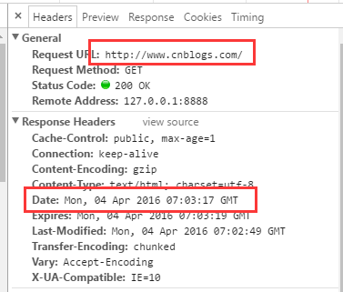

###### Age

Age，该**文件在代理服务器中存活的时间**（单位：秒），如果文件被修改或替换，Age 会重新由 0 开始累计

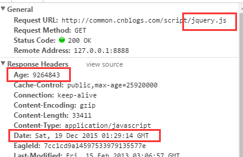

##### 缓存实践

做 HTTP 缓存时，通常会把上述的大多数首部字段均用上，例如：

* 使用 Expires 来兼容旧的浏览器，使用 Cache-Control 来更精准地利用缓存
* 使用 ETag 跟 Last-Modified 功能进一步复用缓存减少流量

###### 刷新与缓存

手动刷新页面（F5 刷新），即使缓存并没有过期，浏览器也会认为缓存已过期；然后，在请求首部中添加字段：Cache-Control: max-age=0，向服务器查询文件是否有更新。

强制刷新页面（ctrl + F5 刷新），即使本地缓存可用，浏览器也会直接忽略本地缓存；然后，在请求首部中添加字段：Cache-Control: no-cache（或 Pragma: no-cache），向服务重新拉取文件。

如下图，除刷新以外的其它方式，缓存都是直接有效的。

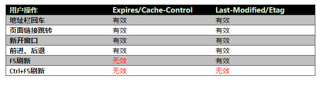

###### 消灭 304

协商缓存依然需要发送一个请求确认缓存是否过期，需要一种方式消灭 304，以消除不必要的协商缓存请求。

通常采取的方式是：对静态文件，如 js、css 采用加入版本号或 MD5 值的文件名，如 a.d5d02a02.js、a.v1.js，并且设置较大的 Cache-Control 值，例如 Cache-Control: max-age = 31536000，即 1 年的使用时间，这样 1 年内我们都不会发起新的请求。如果资源被修改，则使用新的版本号或 MD5 值进行命名。

##### 总结

初次请求：

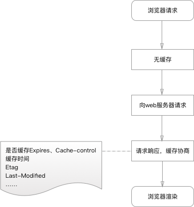

再次请求：


通过查看请求头和响应头的内容的方式来看看具体请求和响应的东西。

首次请求：

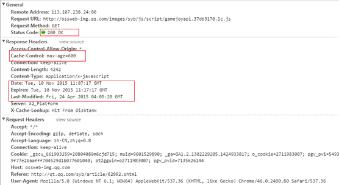

缓存有效期内请求：200(from cache)

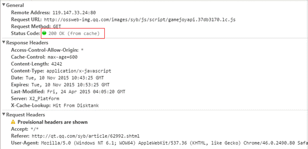

缓存过期后请求：304（Not Modified)

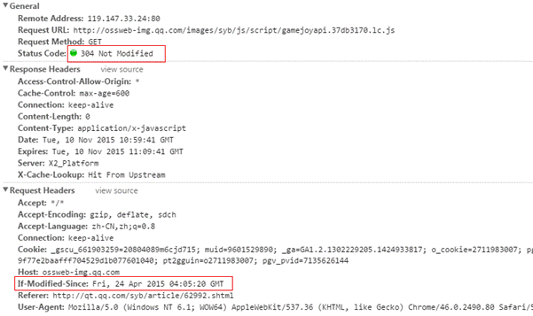

##### 参考

* [浏览器缓存浅析](https://github.com/zhengweikeng/blog/issues/5)
* [HTTP缓存](https://developer.mozilla.org/zh-CN/docs/Web/HTTP/Caching_FAQ)
* [浅谈浏览器http的缓存机制](https://www.cnblogs.com/vajoy/p/5341664.html)
* [http协商缓存VS强缓存](https://www.cnblogs.com/wonyun/p/5524617.html)

#### 2.Cookie

Cookie 是为无状态的 HTTP 协议提供的用于识别用户的机制，会随请求发送到服务器，故用 Cookie 存储并非用于识别用户的信息是不可取的。

Cookie 包含的信息：

* name，Cookie 名
* value，Cookie 值
* domain，所属域名，默认是当前域名
* path，生效路径，默认是当前路径
* expires，到期时间
* http，仅用于 http 请求，不能 JS 操作
* secure，仅在 https 请求中传递

##### 特点

Cookie 的基本特点：

* HTTP 协议的一部分，随 HTTP 请求发送到服务端
* cookie 是字符串，每个键值之间使用 “;” + “空格” 分开的；设置 cookie 时以字符串拼接的方式就可以
* 有数量和大小限制
  * 数量，FF 最多50个，safari 和 chrome 没有限制
  * 大小，一般不操过 4KB
* 没有封装好的方法来直接操作 cookie，需要自己封装：设置，删除，获取的方法

##### 操作

###### 写

设置 Cookie 可以有两种方式：

* JS 写入，使用 document.cookie，注意重复写入并不是覆盖，而是添加

  ```
  // 写入一个 cookie
  document.cookie = 'name=tom';
  ```
  
* 服务端写入，使用 Set-Cookie，通过 HTTP 首部来设置的，服务器发送一个 Set-Cookie 的 HTTP 响应首部来创建一个 cookie，其格式如下（中括号中的部分是可选的）：

  ```
  Set-Cookie: key=value[; expires=date][; domain=domain][; path=path][; secure]
  ```

  需要注意的是：浏览器向服务器发送 cookie 是一行全部发送；服务器使用 Set-Cookie 头设置浏览器 cookie 时，则是分行指定

###### 读

使用 document.cookie 来读取

假如设置了 cookie 值为：

```
document.cookie = ‘a=1’; 
document.cookie = ‘b=2’;
```

document.cookie 读取结果：

```
'a=1; b=2;'
```

 document.cookie 读写 cookie 的区别：

- 一次可以读出全部 cookie，但是只能写入一个 cookie

###### 修改

如果原始的 cookie 是用 Set-Cookie 设置的，就必须使用同样的 Set-Cookie 修改；只要有一个属性不同，就会生成一个全新的 cookie，而不是替换掉原来那个 cookie

###### 删除

- 设置 cookie 值为 null，就可以删除相应的 cookie
- 设置 expires 属性等于 0，或者等于一个过去的日期

##### 参考

* [关于Cookie的那些事](https://blog.csdn.net/miss_dai/article/details/52605353)
* [Cookie](http://javascript.ruanyifeng.com/bom/cookie.html)

#### 3.Web Storage

Web Storage 只能存储字符串，如果需要存储结构化的数据，则需要客户端数据块解决方案，比如 Web SQL 和 IndexedDB。

##### LocalStorage

LocalStorage 是 HTML5 的一种本地缓存方案，主要用于浏览器端保存体积较大的数据（如 AJAX 返回结果等）。

###### API

* localStorage.getItem(key)
* localStorage.setItem(key, value)
* localStorage.removeItem(key)
* localStorage.clear()

###### 空间大小

浏览器中的 LocalStorage 数据存储都有空间限制，超过最大限制就会读取报错。常用浏览器容量限制：

| 浏览器         | 最大容量 |
| -------------- | -------- |
| IE（>=8）      | 5M       |
| FF（>=8）      | 5.24M    |
| Opera          | 2M       |
| Chrome、Safari | 2.6M     |

##### SessionStorage

使用方法与 LocalStorage 相同，只是 SessionStorage 为会话级别存储，页面或浏览器关闭后存储数据会自动清空。

#### 4.Web SQL

为了处理大量结构化的数据，html5 引入 Web SQL Database 概念，它使用 SQL 来操纵客户端数据库的 API，这些 API 是异步的，规范中使用的是 SQLlite（SQL后端）。

Web SQL Database 数据可以在 Chrome 控制台的 Application -> Web SQL 中查看，如图：

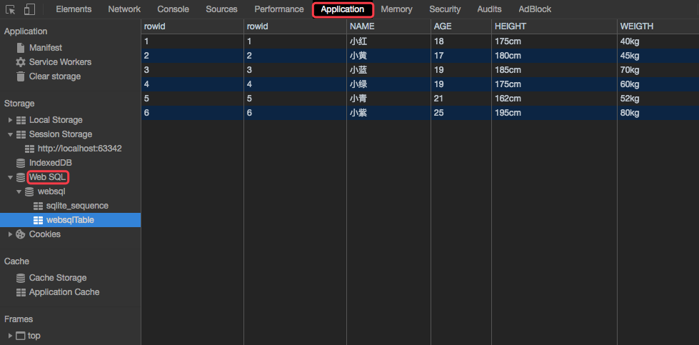

##### 兼容性

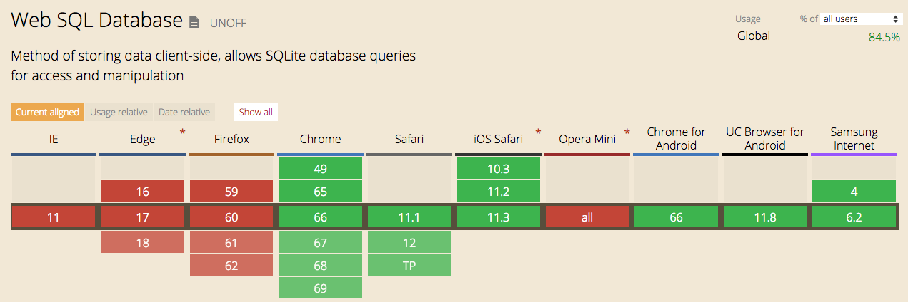

Chrome 和 Safari 支持，IE、FF 和 Opera 均不支持且已放弃在未来支持。

需要注意的是，2010 年 11 月 18 日，W3C 宣布舍弃 Web SQL database 草案。

> This document was on the W3C Recommendation track but specification work has stopped. The specification reached an impasse: all interested implementors have used the same SQL backend (Sqlite), but we need multiple independent implementations to proceed along a standardisation path.  
>
> 该文件是W3C推荐标准，但规范的制定工作已经停止。该规范陷入僵局：所有感兴趣的实现者都使用了相同的SQL后端（SQLite的），但我们需要多个独立的实现沿着规范化的路径进行。  
>
> 标准参考：https://www.w3.org/TR/webdatabase/

##### 使用

1. 测试浏览器支持
2. 创建数据库
3. 创建表
4. 数据操作

###### 1.测试浏览器支持

```
if(!window.openDatabase){ 
	return console.log(“浏览器不支持DataBase”);
}
```

###### 2.创建数据库

```
// 创建数据库
var dataBase = openDatabase('websql', '1.0', 'Datura练习', 4 * 1024 * 1024, function(){});
```

查看创建的dataBase对象：

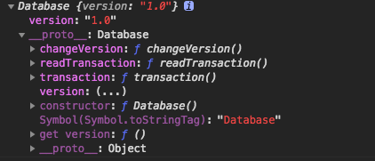

拥有属性：

- version：获取版本

拥有方法：

- changeVersion：改变版本号
- readTransaction：发起只读事务
- transaction：发起事务

其实标准里面还有个 openDatabaseSync 方法，但是测试发现并没有实现【测试chrome，safari】

测试发现如果加入了 callback 参数，创建的 database 的版本号就总是为空。

###### 3.创建表

```
// 创建表
var tableName = 'websqlTable';
var creatTableSQL = 'CREATE TABLE IF NOT EXISTS ' + tableName + ' (rowid INTEGER PRIMARY KEY AUTOINCREMENT, NAME text, AGE text, HEIGHT text, WEIGTH text)';

dataBase.transaction(function (ctx) {
    ctx.executeSql(creatTableSQL, [], function () {
        console.log("表创建成功 " + tableName);    //建表成功
    }, function (tx, error) {
        console.log('创建表失败:' + tableName + error.message);    //建表失败
    });
});
```

###### 4.数据操作

1）插入数据

```
// 插入数据
function websqlInsterDataToTable(tableName, NAME, AGE, HEIGHT, WEIGTH) {
    var sqlStr = 'INSERT INTO '+tableName+' (NAME,AGE,HEIGHT,WEIGTH) VALUES (?,?,?,?)';

    dataBase.transaction(function (ctx) {
        ctx.executeSql(sqlStr, [NAME, AGE, HEIGHT, WEIGTH], function () {
            console.log("插入" + tableName + NAME + "成功");
        }, function (tx, error) {
            console.log('插入失败: ' + error.message);
        });
    });
}

websqlInsterDataToTable(tableName, "小红", "18", "175cm", "40kg");
websqlInsterDataToTable(tableName, "小黄", "17", "180cm", "45kg");
```

2）查询数据

```
// 查询所有数据
function websqlGetAllData(tableName) {
    var selectALLSQL = 'SELECT * FROM ' + tableName;
    
    dataBase.transaction(function (ctx) {
        ctx.executeSql(selectALLSQL, [], function (ctx, result) {
            var len = result.rows.length;

            for (var i = 0; i < len; i++) {
                console.log("NAME = " + result.rows.item(i).NAME);
            }
        }, function (tx, error) {
            console.log('查询失败: ' + error.message);
        });
    });
}
websqlGetAllData(tableName);

// 查询特定数据
function websqlGetAData(tableName, name) {
    var selectSQL = 'SELECT * FROM ' + tableName + ' WHERE NAME = ?'
    
    dataBase.transaction(function (ctx) {
        ctx.executeSql(selectSQL, [name], function (ctx, result) {
            var len = result.rows.length;

            for (var i = 0; i < len; i++) {
                console.log("NAME = " + result.rows.item(i).NAME);
            }
        }, function (tx, error) {
            console.log('查询失败: ' + error.message);
        });
    });
}
websqlGetAData(tableName, "小紫");
```

3）删除数据

```
// 删除所有数据
function websqlDeleteAllDataFromTable(tableName){
    var deleteTableSQL = 'DELETE FROM ' + tableName;

    dataBase.transaction(function (ctx,result) {
        ctx.executeSql(deleteTableSQL,[],function(ctx,result){
            console.log("删除表成功 " + tableName);
        }, function(tx, error){
            console.log('删除表失败:' + tableName + error.message);
        });
    });
}
websqlDeleteAllDataFromTable(websqlTable);

// 删除特定数据
function websqlDeleteADataFromTable(tableName,name){
    var deleteDataSQL = 'DELETE FROM ' + tableName + ' WHERE NAME = ?';

    dataBase.transaction(function (ctx,result) {
        ctx.executeSql(deleteDataSQL,[name],function(ctx,result){
            alert("删除成功 " + tableName + name);
        }, function(tx, error){
            alert('删除失败:' + tableName  + name + error.message);
        });
    });
}
websqlDeleteADataFromTable(websqlTable,"小蓝");
```

4）更新数据

```
function websqlUpdateAData(tableName,name,age){
    var updateDataSQL = 'UPDATE ' + tableName + ' SET AGE = ? WHERE NAME = ?';
    
    dataBase.transaction(function (ctx,result) {
        ctx.executeSql(updateDataSQL,[age,name],function(ctx,result){
            alert("更新成功 " + tableName + name);
        },function(tx, error){
            alert('更新失败:' + tableName  + name + error.message);
        });
    });
}

websqlUpdateAData(websqlTable,"小红","1000");
```

##### API

###### openDatabase()

打开已有(已存在时)或新建并打开(未存在时)数据库对象

```
var dataBase = window.openDatabase(dbname, version, dbdesc, dbsize, callback);
```

支持5个参数：

- dbname - 必须，数据库名
- version - 必须，版本号
- dbdesc - 必须，数据库描述
- dbsize - 必须，数据库大小
- callback - 可选，创建回调

###### dataBase.transaction()

根据情况控制事务提交或回滚。当一条语句执行失败的时候，整个事务回滚。transaction和readTransaction均是异步的。

```
dataBase.transaction(function callback(ctx){
    ctx.executeSql(...);
});
```

支持1个参数：

- callback - 回调函数，该回调有一个SQLTransaction对象参数ctx，该参数原型上只有一个方法executeSql

######  ctx.executeSql()

执行SQL查询

```
ctx.executeSql(sqlStr, sqlParam, success, fail);
```

支持4个参数：

- sqlStr - String，sql语句
- sqlParam - Array，sqlStr语句需要的sql参数，没有是传[]
- success - Function，执行成功时的回调
- fail - Function，执行失败时的回调

##### 参考

- [W3C](https://www.w3.org/TR/webdatabase/)
- [[webSQL 增删改查](https://www.cnblogs.com/liuhao-web/p/7866032.html)]
- [前端存储之websql](https://blog.csdn.net/netcy/article/details/52188531)
- [HTML5前端数据库——Web SQL Database](https://www.jianshu.com/p/64ded82068b0)

#### 5.IndexedDB

由于缺乏 IE、FF 等浏览器支持（二者已明确表示不会在未来实现 Web SQL），以及在 JS 中使用 SQL 语句导致代码难以维护的原因，HTML5 官方已经放弃 Web SQL 标准，转而支持 IndexedDB 本地数据库解决方案。

|          | Web SQL                                                      | IndexedDB                                                    |
| -------- | ------------------------------------------------------------ | ------------------------------------------------------------ |
| 优点     | 真正意义上的关系型数据库，类似 SQLite（SQLite是遵守 ACID 的轻型的关系型数据库管理系统） | 1）允许对象的快速索引和搜索，因此在Web应用程序场景中，您可以非常快速地管理数据以及读取/写入数据； 2） 由于是 NoSQL 数据库，因此我们可以根据实际需求设定我们的 JavaScript 对象和索引；3）在异步模式下工作，每个事务具有适度的粒状锁。这允许您在 JavaScript的事件驱动模块内工作。 |
| 缺点     | 1）规范已不再支持；2）由于使用 SQL 语言，因此我们需要掌握和转换我们的JavaScript 对象为对应的查询语句；3）非对象驱动。 | 如果你的世界观里面只有关系型数据库，恐怕不太容易理解         |
| 位置     | 包含行和列的表                                               | 包含 JavaScript 对象和键的存储对象                           |
| 查询机制 | SQL                                                          | Cursor APIs，Key Range APIs，应用程序代码                    |
| 事务     | 锁可以发生在数据库，表，行的“读写”时候                       | 锁可以发生在数据库版本变更事务，或是存储对象“只读”和“读写”事务时候 |
| 事务调教 | 事务创建是显式的。默认是回滚，除非我们调用提交               | 事务创建是显式的。默认是提交，除非我们调用中止或有一个错误没有被捕获 |

因此，HTML5 支持的本地存储实际上变成了 Web Storage（Local Storage和Session Storage）与 IndexedDB：

* Web Storage 使用简单字符串键值对在本地存储数据，方便灵活，但是无法直接处理结构化数据
* IndexedDB 是为了能够在客户端存储大量的结构化数据，并且使用索引高效检索的 API

##### 兼容性

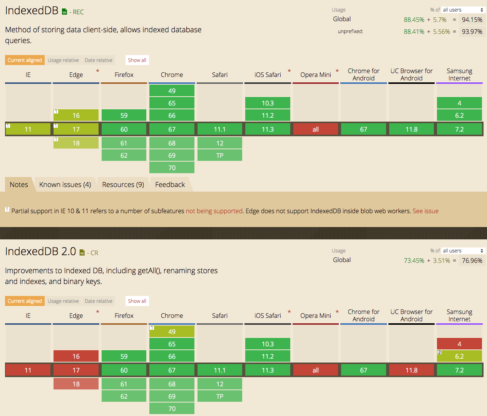

相较于仅仅只有 Chrome 和 Safari 支持的 Web SQL，支持 IndexedDB 的客户端多了 Firefox。

##### 结构体系

Web SQL 是关系型数据库，通过 SQL 进行操作，有表和记录的概念；IndexedDB 是非关系型数据库，NOSQL，没有表和记录，不过有和表、记录相对应的概念 objectStore 和 object。

> 数据库可以分为关系型数据库和非关系型数据库，关系型数据库如 Mysql、Oracle 等将数据存储在表中，而非关系型数据库如 Redis、MongoDB、IndexedDB 等将数据集作为个体对象存储。

| Web SQL      | indexedDB      |
| ------------ | -------------- |
| 关系型数据库 | 非关系型数据库 |
| SQL          | NOSQL          |
| Database     | Database       |
| 表           | ObjectStore    |
| 记录         | Object         |

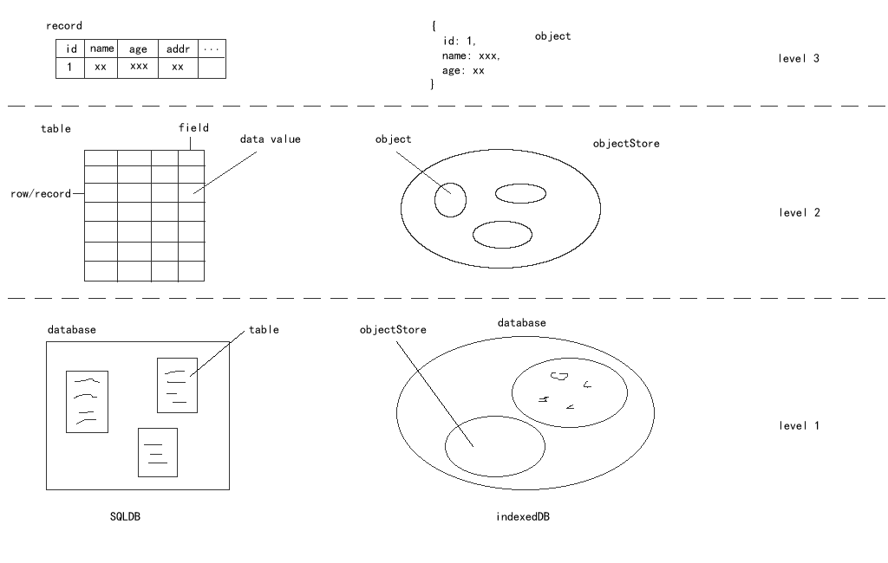

* Level 1：都有数据库 Database，以及相应的数据库创建、关闭和删除操作
* Level 2：SQLDB 有表的概念，IndexedDB 对应的是 ObjectStore，即在 Database 中开辟多个 objectStore  来存储 object
* Level 3：SQLDB 有记录的概念，IndexedDB 直接存放 js 的 object 数据对象

需要注意的：

* IndexedDB 存储的数据是结构化数据，必须是以键值对组成的对象，不能存储 function 等非结构化数据
* IndexedDB 存储的数据对象支持嵌套，和 js 实现无缝对接；而同样是本地化存储的 Web Storage 需要对数据字符串化后才能进行保存

###### ObjectStore

objectStore 是 IndexedDB 的核心概念，它是一个数据存储仓库，类似于 SQL 数据库中的表，存放着相关的所有数据。所谓“相关”，是指这些 object 必须具备相同的一个属性名，也就是“主键”，IndexedDB 中称为 keyPath，类似 SQL 数据库中的 primaryKey，不过 SQL 数据库中不必一定有 primaryKey，而 objectStore 中的 keyPath 必须有。如果存入的某个 object 不存在该属性，而该属性在 IndexedDB 中又不是 autoIncrement，那么就会报错；如果 autoIncrement 被设置为 true，在没有该 key 的情况下，存入数据库的时候，会被自动添加上，这个效果跟 SQL 数据的自增字段是一样的。

###### 索引

SQL 的索引是对指定字段进行特殊记录，以便在检索时提高性能。

IndexedDB 中，也有索引，不过它没法提高检索性能，只是除 keyPath 之外，提供其他的检索方式。objectStore 有 get 方法，它的参数是 keyPath 对应的值。如果要用其他的字段来检索某个object，就需要通过索引的方式，通过一个 index 方法来实现索引检索。所以，实际上，objectStore 的索引，等同于 SQL 表的字段。

###### 事务

事务，是用户定义的一个数据库操作序列，这些操作要么全做要么全不做，是一个不可分割的工作单位。所有的数据库都有这个概念，它是为了安全且一致地操作数据库。

举个例子：当你向好友转账时，发起一个请求，程序建立你转账的事务。但是，突然机房停电，银行系统发生故障，你账户的钱已扣除，但是你朋友的账户并没有收到你的转账？数据库系统为了避免这种情况，采用事务机制，如果出错，那就回滚，把打出去但对方没收到的钱返还到你的账户，然后重新执行一次转账操作，以此保证数据库的增删改查有序不混乱。

事务具有 4 个基本特征：

* 原子性(Atomicity)：事务中的所有操作作为一个整体提交或回滚
* 一致性(Consistemcy)：事务执行的结果必须是使数据库从一个一致性状态变成另一个一致性状态
* 隔离性(Isolation)：多个事务是彼此隔离的
* 持久性(Durability)：一个事务一旦提交，它对数据库中的数据的改变就应该是永久性的

在 IndexedDB 中，事务支持 3 种模式：

| 模式          | 描述                                                         |
| ------------- | ------------------------------------------------------------ |
| readonly      | 提供只读访问，默认模式，在查询对象存储（无需写入）时使用     |
| readwrite     | 提供读取和写入访问                                           |
| versionchange | 提供读取和写入访问权来修改对象存储定义，或者创建一个新的对象存储 |

可在任何给定时刻打开多个并发的 readonly 事务，但只能打开一个 readwrite 事务。出于此原因，只有在数据更新时才考虑使用 readwrite 事务。

单独的（表示不能打开任何其他并发事务）versionchange 事务操作一个数据库或 ObjectStroe。可以在onupgradeneeded 事件处理函数中使用 versionchange 事务创建、修改或删除一个 ObjectStroe，或者将一个索引添加到 ObjectStroe。

在代码层面，必须通过 transaction 方法，向数据库容器提出事务要求，才能对 objectStore 进行数据处理：

```
let transaction = db.transaction(['myObjectStore'], 'readonly')
let objectStore = transaction.objectStore('myObjectStore')
```

上面这段代码的操作，我们得到了具体要进行操作的 objectStore，IndexedDB 中不能直接获取 objectStore，必须通过 transaction。通过 IDBDatabase 对象最多只能得到 objectStore 的名字列表，要获得 objectStore 的实例，必须通过 transaction。

###### 游标

游标，就是“一个用来记录数组正在被操作的某个下标位置的变量”。使用方式同关系型数据库中的游标类似。类比于现实中的游标卡尺，游标在卡尺上滑动，以指示不同的位置。

IndexedDB 中，由于没有提供获取 objectStore 中所有对象的标准方法，要遍历 objectStore 中的数据，就需要通过游标。

游标是一个机制，你无法把游标打印出来看，而是通过它得到当前操作的元素。同时，游标也就意味着有类似于 next 的方法，可以用来移动到下一个位置。

###### 锁

数据库中的“锁”是保证数据库数据高并发时候数据一致性的一种机制。

举个例子：现有两处火车票售票点，同时读取上海到北京车票剩余数量为 5。此时，两处售票点同时卖出一张车票，同时修改余额为 5-1=4 写回数据库，这样就造成了实际卖出两张火车票，而数据库中的记录却只少了 1。为了避免发生这种状况，就有了锁机制，也就是执行多线程时用于强行限制资源访问。

##### 使用

与 Web SQL 的使用类似，IndexedDB 的使用也基本分为4个步骤：

1. 测试浏览器支持
2. Level 1 数据库操作
3. Level 2 ObjectStore及索引操作
4. Level 3 数据及游标操作

> IndexedDB 中绝大多数的操作均为异步的，相应的 API 调用返回一个异步对象，自定义操作需要在异步对象的 onerror、onsuccess 等回调函数中进行。

###### 1. 测试浏览器支持

```
var idxedDB = window.indexedDB || window.webkitIndexedDB || window.mozIndexedDB ||
			  window.msIndexedDB;

if (!idxedDB) {
    return;
}
```

###### 2. 数据库操作

1）创建/打开数据库

调用 idxedDB 对象的 open 方法，创建/打开数据库。

```
var request = idxedDB.open('mydb', 1);

request.onerror = function (e) {
    console.log(e.currentTarget.error.message);
};

request.onsuccess = function (e) {
    var db = e.target.result;
    // todo callback
};

request.onupgradeneeded = function (e) {
    var db = e.target.result,
    	name = 'objectStoreName';

    if (!db.objectStoreNames.contains(name)) {
        var store = db.createObjectStore(name, {keyPath: 'id'});

        // 创建索引
        store.createIndex('indexName', 'name', {
            unique: true
        });
    }
}
```

open(name, version) 函数在相应版本数据库不存在时，创建该版本数据库并打开；存在时，直接打开。其接受 2 个参数：

* name - 数据库名
* version - 数据库版本

返回的异步对象 request 常用的回调函数：

* onerror - 失败时调用
* onsuccess - 成功时调用
* onupgradeneeded - 创建数据库时调用；名称为 name 的数据库不存在，或者存在 name 名称的数据库，但是 version 不匹配时，会创建相应版本的数据库，并触发该回调。

需要注意的是：

* open() 函数仅在请求的特定版本数据库不存在时，才会创建该数据库，并随后调用 onupgradeneeded；但 onsuccess 回调每次都会被调用（当然，失败时会调用 onerror），调用顺序在 onupgradeneeded 之后

  所以，**onupgradeneeded 回调主要用于进行 Level 2 ObjectStore 及索引操作，onsuccess 回调主要用于进行 Level 3 数据及游标操作。**

* 当特定 name 和版本的数据库已经存在，且需要进行 Level 2 ObjectStore 及索引操作时，需要使用回调函数 onupgradeneeded，有 2 种方式：

  * 升级 version
  * 删除该数据库，然后重新创建

* 尽管 onupgradeneeded 和 onsuccess 回调都可以通过 e.target.result 获取当前的 IDBDatabase 对象，但是，因为 onupgradeneeded 不像 onsuccess 每次 open() 时都会调用；所以，缓存当前的 IDBDatabase 对象一般在 onsuccess 回调中进行

* 当升级 version 时，创建的数据库会自动获取上一个版本的“镜像”，即直接拥有最新版本的数据库数据，所以 `if (!db.objectStoreNames.contains(name)){}` 判断可能不会通过，也就不会执行大括号中的 Level 2 ObjectStore 及索引操作

* 当特定 name 的数据库有多个版本时，在整个数据库开启的过程中，不能在随后的代码中切换到其它的版本，这是不允许的

2）关闭数据库

IDBDatabase 对象的 close 方法用于关闭当前数据库：

```
var request = idxedDB.open('mydb', 1);

request.onsuccess = function (e) {
	var db = e.target.result;
	...todo something...
	db.close();
}
```

3）删除数据库

调用 idxedDB 对象的 deleteDatabase 方法，删除相应数据库。

```
var request = idxedDB.deleteDatabase('mydb');

request.onerror = function (e) {
    console.error(e.currentTarget.error.message)
}

request.onsuccess = function (e) {
    console.log('deleteDB success');
}
```

###### 3. ObjectStore 及索引操作 

IndexedDB 没有提供修改 ObjectStore 和索引的方式，换而言之，ObjectStore 本身信息是不可修改的。不过，可以通过先删除后创建的方式达到修改的目的。

1）创建 ObjectStore

调用 IDBDatabase 对象的 createObjectStore 方法，创建 ObjectStore。

```
var request = idxedDB.open('mydb', 1);

request.onupgradeneeded = function (e) {
    var db = e.target.result,
    	name = 'objectStoreName';

    if (!db.objectStoreNames.contains(name)) {
        var store = db.createObjectStore(name, {keyPath: 'id'});
        ...
    }
}
```

**注意：**重复创建同名 ObjectStore 是不允许的，所有需要判断该 ObjectStore 是否已存在。

2）删除 ObjectStore

调用 IDBDatabase 对象的 deleteObjectStore 方法，删除 ObjectStore。

```
var request = idxedDB.open('mydb', 1);

request.onupgradeneeded = function (e) {
    var db = e.target.result,
    	name = 'objectStoreName';

    if (db.objectStoreNames.contains(name)) {
        var store = db.deleteObjectStore(name);
        ...
    }
}
```

3）创建索引

调用 IDBObjectStore 对象的 createIndex 方法，创建索引。

```
var request = idxedDB.open('mydb', 1);

request.onupgradeneeded = function (e) {
    var db = e.target.result,
    	name = 'objectStoreName';

    if (!db.objectStoreNames.contains(name)) {
        var store = db.createObjectStore(name, {keyPath: 'id'});

        // 创建索引
        store.createIndex('indexName', 'name', {
            unique: true
        });
    }
}
```

4）删除索引

调用 IDBObjectStore 对象的 deleteIndex 方法，删除索引。

```
var request = idxedDB.open('mydb', 1);

request.onupgradeneeded = function (e) {
    var name = 'objectStoreName',
    	indexName = 'indexName',
    	objectStore = e.target.transaction.objectStore(name),
    	indexNames = objectStore.indexNames;
    	
    if (indexNames.contains(indexName)) {
        objectStore.deleteIndex(indexName);
    }
}
```

**注意：**这里用通过事务 transaction 获取相应的 ObjectStore。

###### 4. 数据操作

当开启一个事务后，在其生命周期内，可以对 objectStore 进行增删改查的数据操作。

1）获取数据

通过 IDBObjectStore 对象的 get 方法，获取数据。

```
var store = db.transaction(['store'], 'readonly').objectStore('store');
var request = store.get('100001');

request.onerror = function (e) {
    console.error('operate error');
}

request.onsuccess = function (e) {
    var result = e.target.result;
    console.log('值为：' + JSON.stringify(result));
}
```

2）添加数据

通过 IDBObjectStore 对象的 add 方法，添加数据。

```
var store = db.transaction(['store'], 'readonly').objectStore('store');
var request = store.add({
    id: '100002',
    name: 'Zhang Fei',
});

request.onerror = function (e) {
    console.error('operate error');
}

request.onsuccess = function (e) {
    console.log('operate success');
}
```

添加数据时，传入一个 object，这个 object 的主键值，也就是 id 值，不能是已存在的。即 add 方法不能重复添加相同主键的对象，否则会报错。因此，为了避免这种情况的发生，更多时候使用 put 方法。

3）更新数据

通过 IDBObjectStore 对象的 put 方法，添加或更新数据。

```
var store = db.transaction(['store'], 'readonly').objectStore('store');
var request = store.put({
    id: '100002',
    name: 'Zhang Fei',
});

request.onerror = function (e) {
    console.error('operate error');
}

request.onsuccess = function (e) {
    console.log('operate success');
}
```

put 方法和 add 方法有两大区别：

* 如果 objectStore 中已经有了该 id，则表示更新这个 object，如果没有，则添加这个 object。
* 在设置 autoIncrement 为 true（即主键自增）时，put 方法必须传第二个参数主键的值，以此来确定更新的是哪个主键对应的 object，如果不传的话，可能会直接增加一个 object 到数据库中。从这一点上讲，自增字段确实比较难把握，因此，建议开发者要严格保证更新数据时传递的 object 中存在主键值。

4）删除数据

通过 IDBObjectStore 对象的 delete 方法，删除数据。

```
var store = db.transaction(['store'], 'readonly').objectStore('store');
var request = store.delete('100001');

request.onerror = function (e) {
    console.error('operate error');
}

request.onsuccess = function (e) {
    console.log('operate success');
}
```

5）遍历操作

获取一个 objectStore 的全部 object 可不是件容易的事，因为 IndexedDB 没有直接提供类似的方法。那应该怎么办呢？利用游标。

通过 IDBObjectStore 对象的 openCursor 方法，打开游标功能。

```
var store = db.transaction(['store'], 'readonly').objectStore('store');
var request = store.openCursor();
var results = [];

request.onerror = function (e) {
    console.error('operate error');
}

request.onsuccess = function (e) {
    var cursor = e.target.result

    if (cursor) {
        results.push(cursor.value)
        cursor.continue()
    } else {
        // 所有的object都在results里面
    }
}
```

onsuccess 事件中，通过 cursor.continue() 来让游标移动到下一个 object，同时，onsucess 会被再次触发。如果所有的 object 都遍历完了，cursor 变量会是 undefined。 

在 Firefox 中，浏览器自主实现了一个 getAll 方法，但是它不是标准的 IndexedDB 接口，因此不推荐使用。本例的操作方法，是获取全部 object 的标准做法。

此外，在创建 objectStore 的时候，可以为其创建索引，在查询时，可以利用索引来进行 object 的获取。通过IDBObjectStore 对象的 index 方法，获取某个已有索引。

```
var store = db.transaction(['store'], 'readonly').objectStore('store');
var index = store.index('name');
var request = index.get('Li Hua');
var results = [];

request.onerror = function (e) {
    console.error('operate error');
}

request.onsuccess = function (e) {
    var item = e.target.result;
}
```

但是，你可以发现，这里的 get 方法只能获取一个object，假如同 name 的 object 有多个，应该怎么办呢？这时可以利用游标的特性。

通过 IDBIndex 对象的 openCursor 方法，也可以打开游标功能。

```
var store = db.transaction(['store'], 'readonly').objectStore('store');
var index = store.index('name');
var request = index.openCursor();

request.onerror = function (e) {
    console.error('operate error');
}

request.onsuccess = function (e) {
    var cursor = e.target.result;
    
    if (cursor) {
        results.push(cursor.value)
        cursor.continue()
    } else {
        // 所有的object都在results里面
    }
}
```

###### 5. 完整示例

```
var opts = {
    db: null,               // 数据库对象
    name: 'Test',           // 数据库名称
    index: 'nameIndex',     // 数据库索引
    version: 3,             // 数据库版本
    obejectStore: {         // 数据库表
        name: 'students',   // 表名称
        data: [{            // 表数据
            id: 1001,
            name: "Byron",
            age: 24
        }, {
            id: 1002,
            name: "Frank",
            age: 30
        }, {
            id: 1003,
            name: "Aaron",
            age: 26
        }],
        keypath: 'id'       // 主键
    }
};

var myDB = {
    indexedDB: window.indexedDB || window.webkitIndexedDB || window.mozIndexedDB || window.msIndexedDB,

    // 键范围
    IDBKeyRange: window.IDBKeyRange || window.webkitIDBKeyRange,

    // 创建或打开数据库，建立对象存储空间(ObjectStore)
    openDB: function (callback) {
        var indexedDB = this.indexedDB;

        if (!indexedDB) {
            return;
        }

        var request = indexedDB.open(opts.name, opts.version || 1);

        request.onerror = function (e) {
            console.log(e.currentTarget.error.message);
        };

        request.onsuccess = function (e) {
            opts.db = e.target.result;
            callback && callback();
        };

        request.onupgradeneeded = function (e) {
            var db = e.target.result,
                name = opts.obejectStore.name,
                keypath = opts.obejectStore.keypath;

            if (!db.objectStoreNames.contains(name)) {
                var store = db.createObjectStore(name, {keyPath: keypath});

                // 创建索引
                store.createIndex(opts.index, 'name', {
                    unique: true
                });
            }
        }
    },

    // 关闭数据库
    closeDB: function () {
        opts.db.close();
    },

    // 删除数据库
    deleteDB: function () {
        var request = this.indexedDB.deleteDatabase(opts.name);

        request.onerror = function (e) {
            console.error(e.currentTarget.error.message)
        }

        request.onsuccess = function (e) {
            console.log('deleteDB success');
        }
    },

    // 添加数据，重复添加会报错
    addData: function () {
        var name = opts.obejectStore.name,
            data = opts.obejectStore.data,
            store = opts.db.transaction(name, 'readwrite').objectStore(name),
            request = null;

        for (var i = 0; i < data.length; i++) {
            request = store.add(data[i]);

            request.onerror = function () {
                console.error('add添加数据库中已有该数据')
            };

            request.onsuccess = function () {
                console.log('add添加数据已存入数据库')
            };
        }

    },

    // 更新数据，重复添加会更新原有数据
    putData: function () {
        var name = opts.obejectStore.name,
            data = opts.obejectStore.data,
            store = opts.db.transaction(name, 'readwrite').objectStore(name),
            request = null;

        for (var i = 0; i < data.length; i++) {
            request = store.put(data[i]);

            request.onerror = function () {
                console.error('put添加数据库中已有该数据')
            };

            request.onsuccess = function () {
                console.log('put添加数据已存入数据库')
            };
        }
    },

    // 获取数据，使用存储空间的键
    getData: function (key) {
        var name = opts.obejectStore.name,
            store = opts.db.transaction(name, 'readwrite').objectStore(name),
            request = store.get(key);

        request.onerror = function () {
            console.error('getData error');
        };

        request.onsuccess = function (e) {
            var result = e.target.result;
            console.log(key + '的值为：' + JSON.stringify(result));
        };
    },

    // 删除数据
    deleteData: function (key) {
        var name = opts.obejectStore.name,
            store = opts.db.transaction(name, 'readwrite').objectStore(name),
            request = store.delete(key);

        request.onerror = function () {
            console.error('deleteData error');
        }

        request.onsuccess = function () {
            console.log('deleteData success');
        }
    },

    // 删除所有数据
    clearData: function () {
        var name = opts.obejectStore.name,
            store = opts.db.transaction(name, 'readwrite').objectStore(name),
            request = store.clear();

        request.onerror = function () {
            console.error('clearData error');
        }

        request.onsuccess = function () {
            console.log('clearData success');
        }
    },

    // 获取数据，使用索引
    getDataByIndex: function (key) {
        var name = opts.obejectStore.name,
            store = opts.db.transaction(name, 'readwrite').objectStore(name),
            request = store.index(opts.index).get(key);

        request.onerror = function () {
            console.error('getDataByIndex error');
        }

        request.onsuccess = function (e) {
            var result = e.target.result;

            console.log(name + '的值为：' + JSON.stringify(result));
        }
    }
};

myDB.openDB(function () {
    console.log('****************添加数据****************');
    myDB.addData();

    console.log('**************add重复添加***************');
    myDB.addData();

    console.log('**************put重复添加***************');
    myDB.putData();

    console.log('**************获取数据1001**************');
    myDB.getData(1001);

    console.log('************通过索引获取数据*************');
    myDB.getDataByIndex('Byron');

    console.log('**************删除数据1001**************');
    myDB.deleteData(1001);

    console.log('**************删除全部数据**************');
    myDB.clearData();

    console.log('***************关闭数据库***************');
    myDB.closeDB();

    console.log('***************删除数据库***************');
    myDB.deleteDB();
});
```

##### API

API 包含异步 (asynchronous) API 和同步 (synchronous) API 两种。  异步 API 适合大多数情况，同步API必须同 WebWorkers 一同使用。

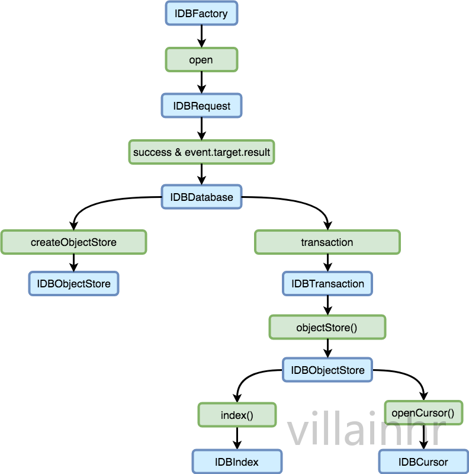

###### IDBDatabase

使用 window.indexedBD.open() 函数创建/打开数据库，并同时获取 IDBDatabase 对象。

属性

| 属性             | 描述                                        |
| ---------------- | ------------------------------------------- |
| name             | 当前数据库名称                              |
| version          | 当前数据库版本                              |
| objectStoreNames | 当前数据库所有objectStore对象名称组成的数组 |

方法

1）**createObjectStore(name, options)：**创建一个 objectStore

* name：要创建的 objectStore 的 name
* options：选项
  * keyPath：主键，要存储 object 的一个 property name。比如每一个 object 都有一个 id 属性，那么可以使用 id 作为 keyPath。在查询的时候，get 方法的参数是主键
  * autoIncrement：keyPath 是否自增。默认为 false。如果为 true，在添加一个 object 的时候，可以不用传 id，id 会自动加 1。但是这样的话，你就不知道你的这个 object 的 id 值到底是多少，所以不建议使用

2）**deleteObjectStore(name)：**删除一个 objectStore

* name：要删除的 objectStore 的 name

3）**close()：**关闭当前数据库

4）**transaction(objectStoreNames, mode)：**开启一个事务

* objectStoreNames：数组，开启的当前事务要操作的 objectStore。随后使用 IDBTransaction.objectStore()获取的 objectStore 必须是数组中的某个元素，否则会报错
* mode：读写权限，可选值：readonly、readwrite、versionchange

###### IDBObjectStore

使用 IDBDatabase 对象的 createObjectStore 方法创建一个 objectStore，并同时获得 IDBObjectStore 对象。

属性

| 属性          | 描述                                     |
| ------------- | ---------------------------------------- |
| name          | 当前 objectStore 的 name 值              |
| keyPath       | 当前 objectStore 的 keyPath 值           |
| autoIncrement | 当前 objectStore 的 autoIncrement 值     |
| indexNames    | 当前 objectStore 所有索引名称组成的数组  |
| transaction   | 当前 objectStore 所属的 transaction 容器 |

方法

1）**get(key)：**获取一个 object

* key：主键值

2）**add(object)：**添加一个 object

* object：要添加的 object，应该包含主键，这取决于 autoIncrement 是否为 true

3）**put(object, key)：**添加/更新一个 object

* object： 要更新的 object

* key：要更新的 object 的主键值。在创建 objectStore 的时候，可能会传入 autoIncrement 为 true，这时，这个 objectStore 和我们经常使用的有点不同。比如你的主键是 id，那么如果你在 add 或 put 的时候，不传这个 id，id 值会自动加 1，你 get 到的 object 也会包含 id 属性。

  当使用 put 方法更新时：如果 objectStore 的 autoIncrement 是 true，就必须传入第二个参数 key。put 方法会先通过 key 找到该 object，然后用 object 的内容去更新。而如果不传 key，那么你传入的第一个参数object 中必须包含id，否则会报错；如果 objectStore 的 autoIncrement 是 false，那就可以考虑忽略 key。但是效果还是不一样，当你传入 key 值的时候，会更新传入的 key 对应的那个 object。不传的时候，根据你object 里面的主键来更新，没有的话会被认为是 add 操作，不会报错。

  最佳实践：不要设置 autoIncrement 为 true！无论是添加还是更新 object，都使用 put，只要开发者自己注意，传入的 object 一定要有一个主键即可。这样当存在该主键值时，就更新，不存在时就插入。这比使用add 好很多，因为 add 的时候，如果存在会报错。

4）**delete(key)：**删除一个 object

* key：主键值

5）**count()：**查询当前 objectStore 的所有 object 的数量

6）**clear()：**删除当前 objectStore 的所有 object

7）**openCursor()：**打开游标

8）**index(name)：**获取一个索引

* name：索引名

9）**createIndex(name, prop, params)：**创建一个索引

* name：索引名
* prop：object 中的属性名，即以 object 中的哪个属性建立索引
* params：其它参数对戏
  * unique：true/false，这个索引是否唯一，即在所有 object 中，该属性值不能重复

10）**deleteIndex(name)：**删除一个索引

* name：索引名

###### IDBTransaction

使用 IDBDatabase 对象的 transaction 方法开启一个事务，并同时获得 IDBTransaction 对象。

属性

| 属性             | 描述                                  |
| ---------------- | ------------------------------------- |
| db               | 当前事务所属 IDBDatabase 对象         |
| objectStoreNames | 当前事务可操作的 objectStore 名称数组 |
| mode             | 事务操作模式                          |

方法

1）**abort()：**终止该事务，一旦人为终止，你程序中的某些操作可能就不会再执行了

2）**objectStore(name)：**获取事务中的某个 objectStore 的容器，然后就可以对相应的 objectStore 进行数据的增删改查。

* name：objectStore 的 name

```
let trans = idb.transaction(['students'], 'readonly');
let objStore = trans.objectStore('students');
let request = objStore.get('100001');		// 利用objStore进行查询
```

###### IDBIndex

使用 IDBObjectStore 对象的 createIndex、index 方法，创建或获取索引，并同时获取 IDBIndex 对象。

属性

| 属性         | 描述                                                         |
| ------------ | ------------------------------------------------------------ |
| name         | 当前索引的 name                                              |
| keyPath      | 当前索引的 keyPath                                           |
| unique       | 当前索引是否唯一，createIndex 时传入的选项                   |
| isAutoLocale | 当前索引是否是自增的， 和前面的 autoIncrement 有关           |
| locale       | 当前索引如果是自增的，那么自增基础值是多少？ 比如 id 是自增的，现在 objectStore 里面有 10 个object，这时 objIndex.locale 应该是10 |
| objectStore  | 当前索引所属于的 objectStore                                 |

方法

1）**count()：**发起得到当前 index 视图总共有多少个 object 的 Request

2）**get(key)：**发起从当前 index 获取一个值为传入参数的 object 的 Request

* key: 这个 key 其实是指 index 的 keyPath 的值

3）**openCursor()：**发起一个打开游标的 Request

###### IDBCursor

使用 IDBObjectStore 或者 IDBIndex 对象的 openCursor 方法，打开游标，并同时获取 IDBCursor 对象。

属性

| 属性       | 描述                                                  |
| ---------- | ----------------------------------------------------- |
| direction  | 当前 游标遍历方向，openCursor 时候传入的值            |
| key        | 当前游标所在 object 的值                              |
| primaryKey | 当前游标遍历所在位置 object 的主键                    |
| source     | 当前游标容器的引用，也就是 IDBObjectStore 或 IDBIndex |
| value      | 当前游标遍历到的 object                               |

方法

1）**continue(key)：**游标往下移动一格或移动到你规定的位置。注意，它是根据你规定的方向进行移动的

* key：移动游标到指定位置的值。比如，想让游标移动到 id=4 的那个 object，那么这里传入 4

2）**advance(count)：**continue() 是只移动一格，advance() 可以自己规定移动的格数

* count：移动的格数

3）**continuePrimaryKey()：**前面讲了 primaryKey 这个属性，也讲了 continue(key) 这个方法的参数 key。但是，当你在 openCursor 的时候，索引的值可重复时，那就会出现尴尬的情况。在 objectStore 里存储数据时，primaryKey 和其他索引的 key，它们的值可能是重复的，但是如果通过两个 key 的值来确定呢？那么就能更准确的定位某一个 object。因此，当你使用 continuPrimaryKey 的时候，是为了解决这个问题，即 continue() 只会根据参数，往下移动到下一个给定参数值的 object，而如果使用 continuePrimaryKey()，那么在往下一个给定值移动时，还会再考虑 primaryKey 的值。

一般来说 primaryKey 的值都是唯一的，但也不排除有些情况不唯一的时候，这个时候，使用游标结合continuePrimaryKey 才能正确获得你想要的那个 object，通过普通的 get 只能得到第一个 object。

4）**delete()：**删除当前游标所在的 object，删除之后，就要考虑用 continuePrimaryKey()，而不是 continue()

5）**update(**value**)：**更新当前游标所在 object 的值，不是替换掉整个 object，而只是更新你选中的那个 key 的值

* value：替换值

###### IDBRequest

Request 是在事务过程中，发起某项操作的请求。一个事务过程中，可以有多个 Request，Request 一定存在于事务中，因此它肯定会有一个 transaction 属性来获取它所属于的哪个事务的容器。

为什么要有 Request 呢？你可以把 transaction 当做一个队列，在这个队列中，Request 在进行排队，每一个Request 都只包含一个操作，比如添加，修改，删除之类的。这些操作不能马上进行，比如修改操作，如果你马上进行，就会导致大家同时修改怎么办的问题，把多个修改操作放在 Request 中，这些 Request 在 transaction 中排队，一个一个处理，这样就会有执行的顺序，修改就有前后之分。同时，transaction 都可以被 abort，这样当一系列的操作被放弃之后，后续的操作也不会进行。

需要注意的是，Request 是异步的，它有状态，可以通过 readyStates 属性查到 Request 当前状态。

在 IndexedDB 中，有四种方式产生 Request：open database、objectStore request、cursor request、index request。

属性

| 属性        | 描述                                                         |
| ----------- | ------------------------------------------------------------ |
| readyState  | Request 的状态，只有两种：pending / done                     |
| transaction | Request 所属的 transaction                                   |
| source      | Request 是由谁发起的，有四种情况：objStore、cursor、index、null。当 Request 是 open database 时发起，source 值为 null。通过该 source 值，其可以获取更多信息，比如objectStore 的其他信息。 |
| result      | Request 的输出结果。该值最开始是 undefined，只有当 Request 成功之后，该值才会出现。因此，要获取一个 get 的最终结果，必须在 Request 的 onsuccess 事件中调用 |

示例

```
let request = objectStore.get(10001);

request.onsuccess = e => {
  let item = request.result
  // 等价于
  let item = e.tareget.result
}
```

##### 参考

* [IndexedDB中文入门教程详解 - 这个很全面](https://www.tangshuang.net/3735.html#title-4)
* [前端存储之IndexedDB](https://www.cnblogs.com/dengyulinBlog/p/6141636.html)
* [IndexedDB 打造靠谱 Web 离线数据库](https://www.villainhr.com/page/2018/05/11/IndexedDB%20%E6%89%93%E9%80%A0%E9%9D%A0%E8%B0%B1%20Web%20%E7%A6%BB%E7%BA%BF%E6%95%B0%E6%8D%AE%E5%BA%93)
* [Mozilla developer](https://developer.mozilla.org/zh-CN/docs/Web/API/IndexedDB_API/Using_IndexedDB)
* [张鑫旭](https://www.zhangxinxu.com/wordpress/2017/07/html5-indexeddb-js-example/)
* [W3C](https://www.w3.org/TR/IndexedDB/#introduction)

#### 6.Application Cache

> 由于存在明显缺点，Application Cache 已经被标准弃用，逐渐由 Service Worker 替代。

Application Cache 是一种允许浏览器通过 manifest 配置文件在本地有选择性地存储 JS、CSS、图片等静态资源的文件级缓存机制，主要用于静态资源的离线访问。

**与 HTTP 文件缓存的区别：**

* **Application Cache 针对整个应用，HTTP 文件缓存是单个文件**
* **Application Cache 可以离线使用，HTTP 文件缓存不行**
* **Application Cache 可以主动通知浏览器更新资源**

##### 兼容性

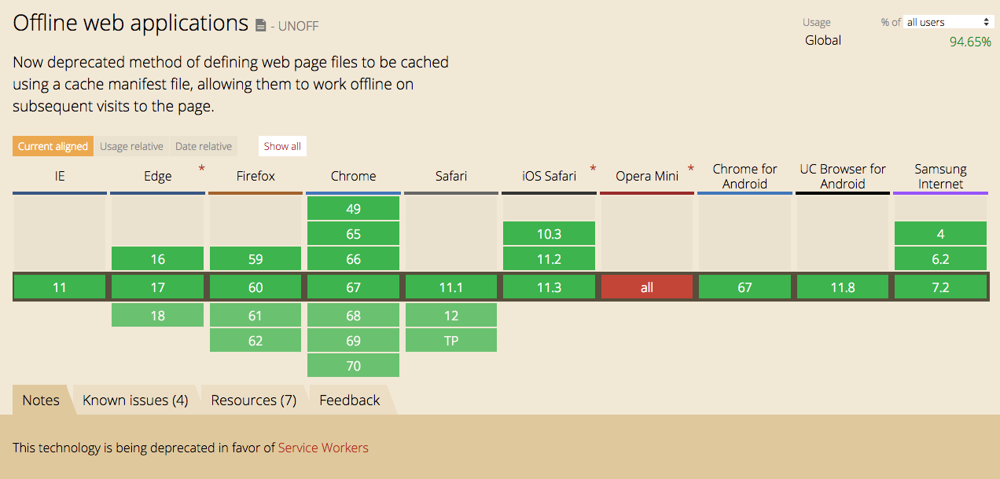

##### 机制

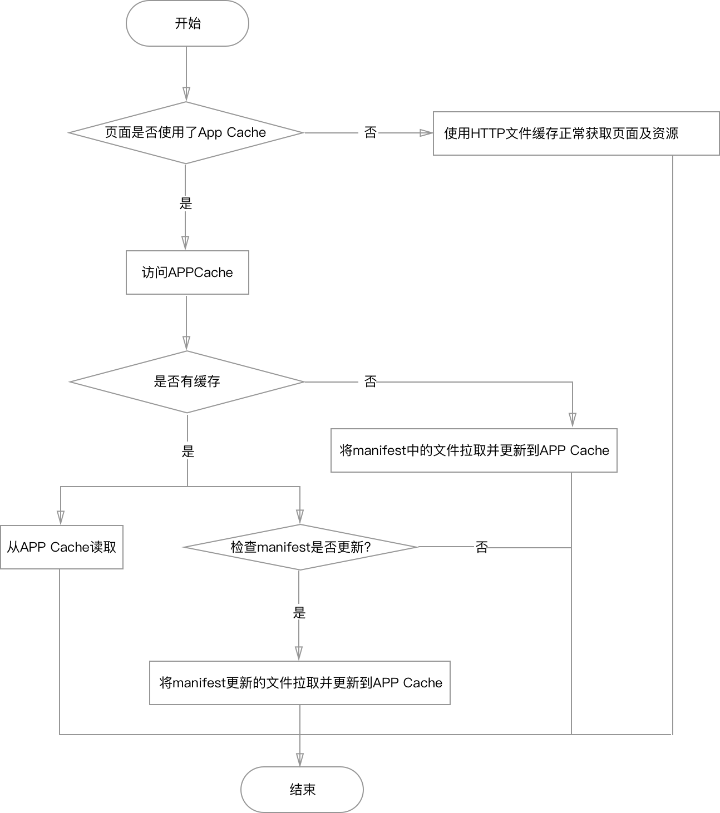

第一次访问时：

* 如果 html 没有 manifest 属性，使用 HTTP 文件缓存走正常的页面及资源获取
* 如果 html 有 manifest 属性，加载页面并同时将 manifest 中指定的文件缓存到 Application Cache

第二次访问时，访问 Application Cache 检查是否有缓存：

* 如果没有缓存（例如，用户手动删除），类似第一次访问页面
* 如果有缓存，直接从 Application Cache 中读取页面及资源，并同时检查 manifest 指定的文件是否有更新
  * 如果有更新，重新拉取更新的文件缓存到 Application Cache，新拉取的文件在下一次（即第三次）访问页面时生效
  * 如果无更新，结束

##### 优点

* 离线浏览 - 用户可在离线时浏览网站
* 快速加载 - 缓存资源为本地资源，加载速度较快
* 服务器负载小 - 浏览器只会从发生了更改的服务器下载资源

##### 缺点

* 存储空间普遍限制为 5M，空间可能不足
* 需要服务端配合完成 Manifest 文件的 MIME-type 设置
* 必须修改 Manifest 文件才会触发浏览器检验是否有更新
* 任何一个指定缓存的文件缓存失败，将回退到上一个版本，即使用旧的缓存
* 不同 url 参数的同一个页面会被当成不同的页面处理
* 引用 Manifest 的HTML、指定缓存的资源必须与 Manifest 文件同源，即在同一个域下
* 引用 Manifest 属性的 HTML 文件默认也被缓存，如果想只缓存 JS、CSS 等资源将比较困难；同时，如果修改了相应 HTML，也必须修改 Manifest 文件才能触发更新
* 二次更新的问题，即：在更新新版本过程中，用户第一次访问的还是旧资源，需要二次进入才是新资源。如果此时后台接口发生变化，访问第一次时的旧数据很可能出现兼容问题
* 一旦采用了 manifest 之后，将不能清空这些缓存，只能更新缓存，或者得用户自己去清空这些缓存。如果，更新到错误的页面，错误页面也将被缓存，可能造成无法访问到正确的页面，所以保证更新的页面资源的正确性显得尤为重要；另外，电信之类的运营商很喜欢在一些流量大的网站进行劫持广告，这样的话，很可能在更新过程将这些广告给缓存起来了，那就杯具了

##### 使用

页面要启动 Application Cache，需要在 html 标签上使用 manifest 属性：

```
<html manifest="example.appcache">
  ...
</html>
```

manifest 属性值为建议以“.appcache”为后缀名的配置文件，该文件需要配置正确的 MIME-type，即 "text/cache-manifest"。必须在 web 服务器上进行配置。

manifest 文件是简单的文本文件，它告诉浏览器要/不要缓存的内容，其分为三个部分：

- CACHE MANIFEST - 在此标题下列出的文件将在首次下载后进行缓存
- NETWORK - 在此标题下列出的文件需要与服务器的连接，且不会被缓存
- FALLBACK - 在此标题下列出的文件规定当页面无法访问时的回退页面（比如 404 页面）

###### CACHE MANIFEST

第一行，CACHE MANIFEST标识是必需的：

```
CACHE MANIFEST
/theme.css
/logo.gif
/main.js
```

上面的 manifest 文件列出了三个资源：一个 CSS 文件，一个 GIF 图像，以及一个 JavaScript 文件。当 manifest 文件加载后，浏览器会从网站的根目录下载这三个文件。然后，无论用户何时与因特网断开连接，这些资源依然是可用的。

###### NETWORK

下面的 NETWORK 小节规定文件 "login.asp" 永远不会被缓存，且离线时是不可用的：

```
NETWORK:
login.asp
```

可以使用星号来指示所有其他资源/文件都需要因特网连接：

```
NETWORK:
*
```

###### FALLBACK

下面的 FALLBACK 小节规定如果无法建立因特网连接，则用 "offline.html" 替代 /html5/ 目录中的所有文件：

```
FALLBACK:
/html5/ /404.html
```

注释：第一个 URI 是资源，第二个是替补。

###### 注意事项

* 每个需要缓存的页面的 html 都需要加入 manifest 属性
* 不要将 manifest 文件本身加入缓存，否则，浏览器将不会检测 manifest 是否更新，页面版本将永远不变

###### 更新缓存

一旦应用被缓存，它就会保持缓存直到发生下列情况：

- 用户清空浏览器缓存
- manifest 文件被修改（参阅下面的提示）
- 由程序来更新应用缓存

###### 完整示例

```
CACHE MANIFEST
# 2012-02-21 v1.0.0
/theme.css
/logo.gif
/main.js

NETWORK:
login.asp

FALLBACK:
/html5/ /404.html
```

**注意：**以 "#" 开头的是注释行，但改变注释同样会造成 manifest 文件改变，浏览器会重新拉取新的 manifest 并重新执行缓存策略。所以，更新注释行中的日期和版本号是一种使浏览器重新缓存文件的办法。

##### API

**window.applicationCache** 对象是对浏览器的应用缓存的编程访问方式。其 status 属性可用于查看缓存的当前状态：

```
var appCache = window.applicationCache;

switch (appCache.status) {
  case appCache.UNCACHED: 		// UNCACHED == 0
    return 'UNCACHED';
    break;
  case appCache.IDLE:					// IDLE == 1
    return 'IDLE';
    break;
  case appCache.CHECKING: 		// CHECKING == 2
    return 'CHECKING';
    break;
  case appCache.DOWNLOADING: 	// DOWNLOADING == 3
    return 'DOWNLOADING';
    break;
  case appCache.UPDATEREADY:  // UPDATEREADY == 4
    return 'UPDATEREADY';
    break;
  case appCache.OBSOLETE: 		// OBSOLETE == 5
    return 'OBSOLETE';
    break;
  default:
    return 'UKNOWN CACHE STATUS';
    break;
};
```

调用 applicationCache.update() 可以以编程的方式更新缓存。此操作将尝试更新用户的缓存（前提是已更改清单文件）。最后，当 applicationCache.status 处于 UPDATEREADY 状态时，调用 applicationCache.swapCache()  即可将原缓存换成新缓存。

```
var appCache = window.applicationCache;
appCache.update(); 			// 尝试更新用户的Application Cache

...

if (appCache.status == window.applicationCache.UPDATEREADY) {
	appCache.swapCache();  // 更新Application Cache内容
}
```

**注意：**以这种方式使用 update() 和 swapCache() 不会向用户提供更新的资源。此流程只是让浏览器检查是否有新的清单、下载指定的更新内容以及重新填充应用缓存。因此，还需要对网页进行两次重新加载才能向用户提供新的内容，其中第一次是获得新的应用缓存，第二次是刷新网页内容。

好消息是，您可以避免重新加载两次的麻烦。要使用户更新到最新版网站，可设置监听器，以监听网页加载时的 updateready 事件：

```
// 页面打开时检查是否有新的缓存，若有，则下载新的应用缓存，更新Application Cache，并重新加载页面
window.addEventListener('load', function (e) {
    var appCache = window.applicationCache;

    appCache.addEventListener('updateready', function (e) {
        if (appCache.status == appCache.UPDATEREADY) {
            appCache.swapCache();
            if (confirm('A new version of this site is available. Load it?')) {
                window.location.reload();
            }
        }
    }, false);
}, false);
```

###### AppCache 事件

附加事件可用于监听缓存的状态。浏览器会对下载进度、应用缓存更新和错误状态等情况触发相应事件。以下代码段为每种缓存事件类型设置了事件监听器：

```
function handleCacheEvent(e) {
    //...
}

function handleCacheError(e) {
    alert('Error: Cache failed to update!');
};

var appCache = window.applicationCache;

// Fired after the first cache of the manifest.
appCache.addEventListener('cached', handleCacheEvent, false);

// Checking for an update. Always the first event fired in the sequence.
appCache.addEventListener('checking', handleCacheEvent, false);

// An update was found. The browser is fetching resources.
appCache.addEventListener('downloading', handleCacheEvent, false);

// The manifest returns 404 or 410, the download failed,
// or the manifest changed while the download was in progress.
appCache.addEventListener('error', handleCacheError, false);

// Fired after the first download of the manifest.
appCache.addEventListener('noupdate', handleCacheEvent, false);

// Fired if the manifest file returns a 404 or 410.
// This results in the application cache being deleted.
appCache.addEventListener('obsolete', handleCacheEvent, false);

// Fired for each resource listed in the manifest as it is being fetched.
appCache.addEventListener('progress', handleCacheEvent, false);

// Fired when the manifest resources have been newly redownloaded.
appCache.addEventListener('updateready', handleCacheEvent, false);
```

如果清单文件或其中指定的资源无法下载，整个更新都将失败。在这种情况下，浏览器将继续使用原应用缓存。

##### 参考

* [w3school](http://www.w3school.com.cn/html5/html_5_app_cache.asp)
* https://www.html5rocks.com/zh/tutorials/appcache/beginner/
* https://segmentfault.com/a/1190000000490331
* https://www.zhihu.com/question/29876535

##### 不一样的Manifest

在前端，出现 Manifest 的地方主要有两处：

* Application Cache 中 html 标签的manifest属性
* PWA（Progressive Web APP）中的 Web 应用程序清单 manifest.json 文件

其中，前者用于启动 Application Cache，并设置 Application Cache 的缓存规则。后者，出现在 Google 提倡的PWA 中，用于将 Web 应用程序安装到设备的主屏幕，为用户提供更快的访问和更丰富的体验。

有关 PWA 中的 manifest.json 文件，请学习[Mozilla developer](https://developer.mozilla.org/zh-CN/docs/Web/Manifest)

#### 7.CacheStorage

CacheStorage，通常有2种语义：

* 一是缓存存储，H5 规范中用于充当 Web 应用程序与浏览器之间代理服务器的 Service worker 的别称
* 二是 CacheStorage 对象，尽管是在 Service worker 规范中定义的API，但是它却是全局对象的属性，完全可以脱离 Service worker 独立使用。

通常用在浏览器缓存方式的语境中，CacheStorage 指代Service worker。什么是 Service worker 呢？

Service worker 本质上是充当 Web 应用程序与浏览器之间的代理服务器，可以作为浏览器和网络间的代理，旨在创建有效的离线体验，拦截网络请求并基于网络是否可用以及更新的资源是否驻留在服务器上来采取适当的动作。它还允许访问推送通知和后台同步 API。

不过，严格意义上讲，Service worker 仅仅是提供一个worker，一个常驻于浏览器并被相同域下多个页面共用的的 JS 线程。要完成特定的功能，必须和其它 API 配合：

* 跟 Fetch 搭配，可以从浏览器层面拦截请求，做数据 mock
* 跟 Fetch 和 CacheStorage 搭配，可以做离线应用
* 跟 Push 和 Notification 搭配，可以做像 Native APP 那样的消息推送

##### 兼容性

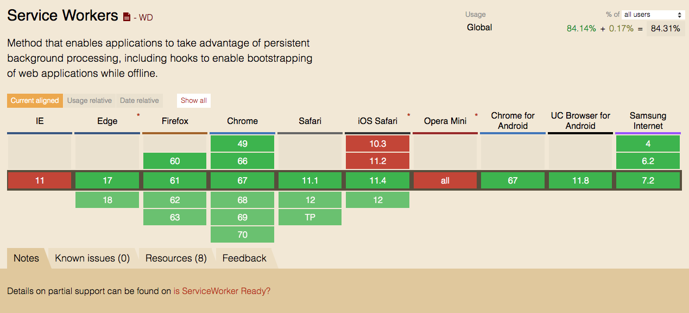

兼容性比 Application Cache 略差

##### 机制

Service worker 是一个注册在指定源和路径下的事件驱动 worker。它采用 JS 控制关联的页面或者网站，**拦截**并修改访问和资源请求，细粒度地缓存资源。可以完全控制应用在特定情形（最常见的情形是网络不可用）下的表现。

Service worker 运行在 worker 上下文，因此它不能访问 DOM。相对于驱动应用的主 JS 线程，它运行在其他线程中，所以不会造成阻塞。它设计为完全异步，同步 API（如XHR和localStorage）不能在 service worker 中使用。

出于安全考量，Service workers 只能由 HTTPS 承载，毕竟修改网络请求的能力暴露给中间人攻击会非常危险。在 Firefox 浏览器的用户隐私模式下，Service Worker 不可用。

需要特别注意的是：

1. JS 是单线程的，这个线程可以理解为“窗体”线程，即每个窗口(例如 Frame/Iframe)都有一个自己的全局window。但是，Workers(Service Worker、Web Worker、Shared Worker 等)开辟的线程是独立于“窗体”的，是在浏览器背后悄悄运行的非窗体线程，没有窗体的概念也就意味着没有 window 对象。在 non-window 上下文环境中，可以使用 self 来表示全局作用域。注意，只能是 self，window.self 这样的写法都是不行的。具体参见 [window.self和self的区别](https://www.zhangxinxu.com/wordpress/2017/07/js-window-self/)
2. Service Worker 和 Cookie一样，都具有 Path 路径（程序自动获取脚本所在路径作为 path）的概念，它只能控制本身所在目录及子目录中的**页面**（只是页面，不是页面资源）。因此，通常选择将其放置在应用根目录下。
3. 由于用户可能从不同页面进入 Service Worker 所管辖的范围，所以，通常我们会在多个页面注册相同的Service Worker。不过，当 Service Worker 域下的某个页面被打开时，它会自动检测当前版本的 Worker 是否已经被注册过，如果是，就不会再重复注册、安装或激活。

##### 优点

作为离线缓存的主要方式，与 Application Cache 相比，CacheStorage(Service worker) 的功能更加全面，具有支持操作出错时终止操作，可以更细致控制每一件事情等优点。所以，CacheStorage 成为 Application Cache 被放弃后的离线缓存的主要标准。

Service worker的主要特点：

* 后台进程：作为一个 worker，独立于当前网页进程
* 网络代理：可以用来代理请求，缓存文件
* 灵活触发：需要的时候吊起，不需要的时候睡眠
* 异步控制：内部使用 promise 来进行控制。

##### 缺点

个人实践发现：Service worker 苛刻的 HTTPS 安全要求、跨域等问题对企业级大型 WEB 应用带来了诸多限制：

1. 所有请求都必须是 HTTPS 协议。对于最近几年才从 HTTP 迁移到 HTTPS 的企业，残存 HTTP 协议的资源在所难免。而对于 HTTPS 中混合的HTTP请求，Service worker 的态度是让其直接挂掉。
2. 大型 WEB 应用通常会使用多个域名，甚至第三方域名。如果说企业自己的域名配置 CORS 还可以做到，第三方域名配置 CORS 几乎是不可能的。尽管通过 fetch(input, {mode: 'no-cors'}) 可以正常请求资源，但是获得一个几乎没有作用的 opaque 响应。而且，一端启用 Service worker，所有页面请求都将被代理，存在无法解决跨域问题的资源想绕都绕不开。
3. 对于强交互性网站，接口请求很难甚至于就不能用 CacheStorage 来离线缓存。缺少了接口数据，想实现一个离线应用也要大打折扣。
4. Service worker 是否一定比直接网络请求要快呢？Service worker 是将文件存储于本地 Disk，重新获取时需要从 Disk 中读取。而直接网络请求可能命中的是 CDN 缓存中的资源(RAM)，而数据下载到本机时也是优先使用本地的 memory cache(RAM)。所以，Service worker 从性能的角度考虑是否有优势呢？需要进一步探究！

总的来说：Service worker 可能更适合所有域名权限可控的信息类网站，比如新闻网站、博客等

##### 使用

###### 注册

```
if ('serviceWorker' in navigator) {
    window.addEventListener('load', function () {
        navigator.serviceWorker.register('./serviceWorker.js').then(function () {
            console.log('Service Worker 启动成功');
        }).catch(function () {
            console.log('Service Worker 启动失败');
        });
    }, false);
}
```

当浏览器支持时，在页面中注册一个Worker，从而在后台启动新的线程。同时，选择在页面load后注册，保证主线程的文件加载和渲染不受影响。

**注意：**如果本地缓存 Service Worker 脚本，且上次脚本更新写入 Service Worker 数据库的时间超过 24 小时，程序会强制更新 Service Worker 脚本，若网络拉取的 serviceWorker.js 与本地有一个字节的差异就会触发 Service Worker 的更新。

###### 安装

注册完成之后，Service Worker 就会进行安装，此时会触发 install 事件，在 install 事件中可以缓存一些资源，即使这些资源是页面在 Service Worker 注册之前就已经下载并解析完成的。

```
var CACHE_NAME = 'test_v1';

self.addEventListener('install', function (event) {
	// self.skipWaiting();			// 跳过等待，直接激活

    event.waitUntil(
        caches.open(CACHE_NAME).then(function (cache) {
            return cache.addAll([
                './test.js',
                './test.css'
            ]);
        })
    );
});
```

Service Worker 安装完成之后，会根据情况选择是否激活：

- 当前页面没有 Service Worker 在运行，直接激活

- 当前页面已有 Service Worker 在运行，则安装后的 Service Worker 进入 waiting 状态，直至前一个 Service Worker 关闭（注意，即便 Service Worker 控制的页面全部关闭，其也依然存在，除非浏览器关闭或者开发者在控制台关闭）。如果希望强制激活，可以在 install 事件回调中使用：

  ```
  self.skipWaiting();
  ```

###### 激活

激活时，发出 activate 事件，此时可对旧版本的 cache 进行清理；激活后，Service Worker 就可以监听 fetch 事件了。

```
var CACHE_NAME = 'test_v1';

self.addEventListener('activate', function (event) {
    console.log('Service Worker ' + CACHE_NAME + '激活成功');

    event.waitUntil(
        caches.keys().then(function (names) {
            return Promise.all(
                names.map(function (name) {
                    if (CACHE_NAME !== name) {
                        return caches.delete(name);
                    }
                })
            );
        })
    );
});
```

###### 代理

Service worker 激活以后，就可以代理请求了。在每个请求发生时会触发 fetch 事件，此时，可以根据本地是否已有缓存来选择性进行操作。比如，如果觉得在安装 Service worker 时设置缓存文件数组太过麻烦，可以放弃安装时缓存，直接在 fetch 时缓存所有资源。

```
self.addEventListener('fetch', function (event) {
    var request = event.request;

    event.respondWith(caches.match(request).then(function (response) {
        return response || fetch(request).then(function (res) {
            if (!res || res.status !== 200) {
                return res;
            }

            caches.open(CACHE_NAME).then(function (cache) {
                cache.put(request, res).catch(function () {
                    console.log('缓存失败' + reqUrl);
                });
            });

            return res.clone();
        });
    }));
});
```

需要注意的是：

1. caches.match() 匹配的标准是：request 对象的 url 和 headers 同时相同。如果希望忽略 headers 一致性检测，可以在 match 时传入选项对象：

   ```
   caches.match(event.request, {ignoreVary: true}).then)(...)
   ```

2. 跨域的资源不能缓存，fetch 时 response.status 会返回 0。除非跨域资源支持 CORS，此时，可以把 request 的 mode 改为 cors：

   ```
   fetch(request.url, {mode: 'cors'}).then(...);
   ```

3. Service worker 文件名应该始终保持不变！因为，如果页面 html/php 文件被 Service worker 缓存时，每次打开页面获取的都是缓存的 html/php 文件，浏览器无法获知 Service worker 文件已经变更。如果 Service worker 文件名称会经常性变更，可以在请求时检查是 html/php 文件时，先提供缓存的文件，然后强制请求新文件内容并重新缓存。

###### 注销

Service worker 可以注销，通过 getRegistration 获取已经注册的 Service Worker，并通过 unregister 取消已经注册的 Service Worker 脚本。

```
navigator.serviceWorker.getRegistration('serviceWorker.js').then(function (registration) {
    if (registration && registration.unregister) {
        registration.unregister().then(function (isUnRegistered) {
            if (isUnRegistered) {
                console.log('[SW]: UnRegistration  succeeded.');
            } else {
                console.log('[SW]: UnRegistration failed.');
            }
        });
    }
}).catch(function (error) {
    console.log('[SW]: UnRegistration failed with. ' + error);
});
```

##### 协同API

###### Fetch

位于 WindowOrWorkerGlobalScope 这一个 mixin 中的 fetch() 方法用于发起获取资源的请求。它返回一个 promise，这个 promise 会在请求响应后被 resolve，并传回 Response 对象。

当遇到网络错误时，fetch() 返回的 promise 会被 reject，并传回 TypeError，虽然这也可能因为权限或其它问题导致。成功的 fetch() 检查不仅要包括 promise 被 resolve，还要包括 Response.ok 属性为 true。HTTP 404 状态并不被认为是网络错误。

fetch() 方法由 Content Security Policy 的 connect-src指令控制，而不是它请求的资源。

**注意：**fetch() 方法的参数与 Request() 构造器是一样的。

```
var myImage = document.querySelector('img');

var myRequest = new Request('flowers.jpg');

fetch(myRequest).then(function (response) {
    return response.blob();
}).then(function (response) {
    var objectURL = URL.createObjectURL(response);
    myImage.src = objectURL;
});
```

使用对应的构造器创建了一个新的 Request 对象，然后调用 fetch() 方法获取资源。因为我们是在请求一个图片，为了解析正常，我们对响应执行 Body.blob 来设置相应的 MIME 类型。然后创建一个 Object URL，并在\ 元素中把它显示出来。

参考：

* [Mozilla fetch](https://developer.mozilla.org/zh-CN/docs/Web/API/WindowOrWorkerGlobalScope/fetch)
* http://louiszhai.github.io/2016/11/02/fetch/#progress
* https://eyesofkids.gitbooks.io/javascript-start-from-es6/content/part4/ajax_fetch.html

###### Cache

Cache 接口为缓存的 Request / Response  对象对提供存储机制。

一个域可以有多个命名 Cache 对象。需要在脚本中处理缓存更新的方式。除非明确地更新缓存，否则缓存将不会被更新；除非删除，否则缓存数据不会过期。使用 CacheStorage.open(cacheName) 打开一个Cache 对象，再使用 Cache 对象的方法去处理缓存。

你需要定期地清理缓存条目，因为每个浏览器都硬性限制了一个域下缓存数据的大小。缓存配额使用估算值，可以使用 StorageEstimate API 获得。浏览器尽其所能去管理磁盘空间，但它有可能删除一个域下的缓存数据。浏览器要么自动删除特定域的全部缓存，要么全部保留。确保按名称安装版本缓存，并仅从可以安全操作的脚本版本中使用缓存。

Cache 提供了七个核心方法来对操作 Request / Response  对象对作：

* Cache.add(request)：抓取这个 URL，检索并把返回的 response 对象添加到给定的 Cache 对象。这在功能上等同于调用 fetch()，然后使用 Cache.put() 将 response 添加到 cache 中
* Cache.put(request, response)：同时抓取一个请求及其响应，并将其添加到给定的 cache
* Cache.addAll(requests)：抓取一个 URL 数组，检索并把返回的 response 对象添加到给定的 Cache 对象
* Cache.keys(request, options)：返回一个 Promise 对象，resolve 的结果是 Cache 对象 key 值组成的数组
* Cache.match(request, options)：返回一个 Promise 对象，resolve 的结果是跟 Cache 对象匹配的第一个已经缓存的请求
* Cache.matchAll(requests, options)：返回一个 Promise 对象，resolve 的结果是跟 Cache 对象匹配的所有请求组成的数组
* Cache.delete(request, options)：搜索 key 值为 request 的 Cache 条目。如果找到，则删除该条目，并且返回一个 resolve 为 true 的 Promise 对象；如果未找到，则返回一个 resolve 为 false 的 Promise对象。

参考：[Mozilla Cache](https://developer.mozilla.org/zh-CN/docs/Web/API/Cache)

###### Caches

CacheStorage 接口表示 Cache 对象的存储。可以通过 WindowOrWorkerGlobalScope mixin 中定义的 caches 属性访问 CacheStorage 。它提供了一个 ServiceWorker 、其它类型 worker 或者 window 范围内可以访问到的所有命名 cache 的主目录，并维护一份字符串名称到相应 Cache 对象的映射。

它并不是一定要和 service workers 一起使用，即使它是在 service workers 规范中定义的。

CacheStorage 提供了五个核心方法来操作 CacheStorage 对象：

* CacheStorage.has()：如果存在匹配的 Cache 对象，则返回一个 resolve 为 true 的 Promise
* CacheStorage.keys()：返回一个 resolve 为包含所有命名 Cache 对象名称字符串数组的 Promise
* CacheStorage.open()：返回一个 resolve 为匹配 Cache 对象的Promise （如果不存在则创建一个新 cache）
* CacheStorage.match()：检查给定的 Request 是否有匹配的 Cache，并返回 resolve 为该匹配的 Promise
* CacheStorage.delete()：查找匹配 cacheName 的 Cache 对象，如果找到，则删除 Cache 对象并返回一个 resolve 为 true 的 Promise 。如果没有找到 Cache 对象，则返回 false

示例：

```
self.addEventListener('fetch', function (event) {
    event.respondWith(caches.match(event.request).catch(function () {
        return fetch(event.request);
    }).then(function (res) {
        var response = res;
        
        caches.open('v1').then(function (cache) {
            cache.put(event.request, response);
        });
        
        return response.clone();
    }).catch(function () {
        return caches.match('/sw-test/gallery/myLittleVader.jpg');
    }));
});
```

等待 FetchEvent 触发，然后：

* 检查 CacheStorage 中是否找到了匹配请求的内容。如果是，使用匹配内容。如果没有，从网络获取请求
* 然后，使用请求的 clone 副本添加到 CacheStorage，如果此操作失败（例如，网络关闭）则返回备用响应

参考：[Mozilla CacheStorage](https://developer.mozilla.org/zh-CN/docs/Web/API/CacheStorage)、[Mozilla WindowOrWorkerGlobalScope](https://developer.mozilla.org/zh-CN/docs/Web/API/WindowOrWorkerGlobalScope)

###### Client

Client 接口表示一个可执行的上下文，如 Worker 或 SharedWorker。Window 客户端由更具体的 WindowClient 表示。 你可以从 Clients.matchAll() 和 Clients.get() 等方法获取 Client/WindowClient 对象。

Client 有三个只读属性：

* Client.id：客户端的唯一通用标识符，字符串形式
* Client.url：客户端的 URL，字符串形式
* Client.type：客户端的类型，字符串形式。可能是"window", "worker", 或 "sharedworker"

Client 提供四个核心方法：

* Client.postMessage()：向 client 发送一条消息

参考：[Mozilla Client](https://developer.mozilla.org/zh-CN/docs/Web/API/Client)

###### Clients

Clients 接口提供对 Client 对象的访问，通过在  service worker 中使用 self.clients 访问它。

Clients 提供四个核心方法来操作Clients对象：

* Clients.get()：返回一个匹配给定 id 的 Client 的 Promise
* Clients.claim()：允许一个激活的 service worker 将自己设置为其 scope 内所有 clients 的 controller
* Clients.matchAll()：返回一个 Client 对象数组的 Promise.options 参数允许您控制返回的 clients 类型
* Clients.openWindow()：打开给定 URL 的新浏览器窗口，并返回新 WindowClient 的 Promise

```
addEventListener('notificationclick', event => {
    event.waitUntil(async function () {
        const allClients = await clients.matchAll({
            includeUncontrolled: true
        });

        let chatClient;

        // 是否已经打开了一个聊天窗口，有则使用它
        for (const client of allClients) {
            const url = new URL(client.url);

            if (url.pathname == '/chat/') {
                client.focus();
                chatClient = client;
                break;
            }
        }

        // 如果没有，则新打开一个
        if (!chatClient) {
            chatClient = await clients.openWindow('/chat/');
        }

        // 向client发送信息
        chatClient.postMessage("New chat messages!");
    }());
});
```

显示一个已有的聊天窗口，或者当用户点击通知时创建新的窗口

参考：[Mozilla Clients](https://developer.mozilla.org/zh-CN/docs/Web/API/Clients)

###### Push

Push API 允许Web应用程序接收从服务器推送给它们消息的能力，无论Web应用程序是否在用户代理的前台，或者甚至当前加载。这样，开发人员就可以向选择启用的用户投放异步通知和更新，从而更及时地吸引新内容。

参考：[Mozilla Push](https://developer.mozilla.org/zh-CN/docs/Web/API/Push_API)

###### Notification

> 此特性在 [Web Worker](https://developer.mozilla.org/zh-CN/docs/Web/API/Web_Workers_API) 中可用。

Notifications API 的通知接口用于向用户配置和显示桌面通知。

参考：[Mozilla Notification](https://developer.mozilla.org/zh-CN/docs/Web/API/notification)

##### 参考

* [Mozilla Developer](https://developer.mozilla.org/zh-CN/docs/Web/API/Service_Worker_API)
* [Google Developer](https://developers.google.com/web/fundamentals/primers/service-workers/)
* https://github.com/youngwind/blog/issues/113
* https://fed.renren.com/2017/10/04/service-worker/
* https://x5.tencent.com/tbs/guide/serviceworker.html
* https://zhuanlan.zhihu.com/p/27264234
* https://foio.github.io/service-worker-cache/
* https://www.villainhr.com/page/2017/01/08/Service%20Worker%20%E5%85%A8%E9%9D%A2%E8%BF%9B%E9%98%B6#Cache%20Object
* https://www.zhangxinxu.com/wordpress/2017/07/service-worker-cachestorage-offline-develop/
* https://lavas.baidu.com/mip/guide/vue/doc/vue/advanced/service-worker-postMessage

#### 8.Flash缓存

Flash 缓存主要基于网页端 Flash，具有读写浏览器端本地目录的功能，同时也可以向 JS 提供调用的API，这样页面就可以通过 JS调用 Flash 读写指定的磁盘目录，达到本地数据缓存的目的。

但是随着移动终端设备尤其是 IOS 的兴起，原本为 PC 端而生的 Flash 开始显现诸多似乎莫须有的不适：

* 性能较差，耗电严重（IOS 未对 Flash 开放 GPU 加速，Flash 只能使用 CPU 计算和渲染所致）
* 固定尺寸的播放器框架使网页难以对不同的浏览分辨率进行自适应

由于这些问题，HTML5 制定了自己的视频 API，Flash 已经逐渐被抛弃。所以，对于 Flash 缓存，知道这个历史即可，以后碰到的几率将会越来越低。

##### 参考

* [iOS 不支持 Flash 的真实原因是什么？](https://www.zhihu.com/question/19609079/answer/60053891)
* https://www.zhihu.com/question/19851268
* https://www.zhihu.com/question/19728465/answer/63865048
* https://www.leiphone.com/news/201502/F7fu7xWkNNQRbRt2.html

#### 9.File System API

标准已废弃，仅了解。

