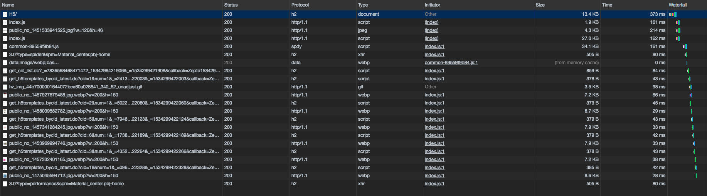
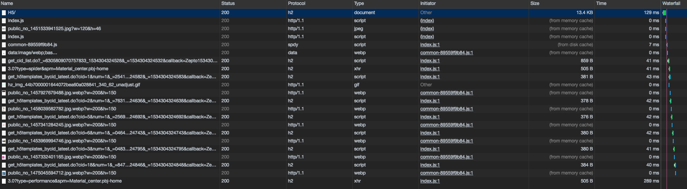
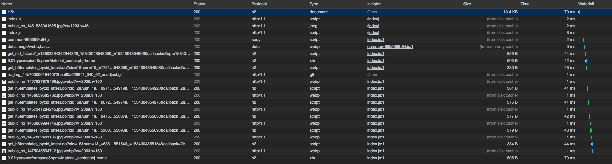

## 其它

### 防抖与节流

#### 防抖

> debounce /di'bauns/ n. 防抖、防反跳

触发高频事件后 n 秒内函数只会执行一次，如果 n 秒内高频事件再次被触发，则重新计算时间

```
function debounce(fn, ms) {
    let timer = null

    return function () {
        timer && clearTimeout(timer);

        timer = setTimeout(() => {
            fn.apply(this, arguments);
        }, ms);
    }
}
```

#### 节流

> throttle /'θrɑtl/ n. 节流阀 v. 节流

高频事件触发，但 n 秒内只会执行一次，所以节流会稀释函数的执行频率

```
function throttle(fn, ms) {
    let canRun = true;

    return function () {
        if (!canRun) return;

        canRun = false;

        setTimeout(() => {
            fn.apply(this, arguments);
            canRun = true;
        }, ms);
    };
}
```

### from memory cache和from disk cache

#### MemoryCache

资源缓存在内存中，等待下次请求时无需重新下载资源，直接从内存中获取。退出当前页面进程，例如关闭当前页面(Tab 标签)或关闭浏览器，抑或者页面长时间没有用户操作，出于内存优化和性能考虑，MemoryCache 数据也会被清空。

#### DiskCache

资源缓存在磁盘中，等待下次请求时无需重新下载资源，直接从磁盘中获取。退出当前页面进程，diskCache 数据依旧存在，必须手动删除或者基于 HTTP 缓存策略，数据过了“有效期”被浏览器自动删除。

#### 相同

diskCache 与 memoryCache 都是用来存储一些派生类资源文件，比如 CSS/JS 以及解码过的图片数据的，而不是用来存储主资源的。

> 目前Webkit资源分成两类：
>
> - 一类是主资源，比如 HTML 页面，或者下载项；
> - 一类是派生资源，比如 HTML 页面中内嵌的图片或者脚本链接。
>
> 分别对应代码中两个类：MainResourceLoader 和 SubresourceLoader。

#### 不同

两者最大的区别在于：memoryCache 与页面进程相关，而 diskCache 是进程无关的！

当退出进程时，DiskCache 数据不会清空，所以，当下次再进入该进程时，该进程仍可以从 diskCache 中获得数据，而 memoryCache 则不行。

#### 什么时候使用？

memoryCache 的加载速度比 diskCache 快 ，webkit 优先 from memory cache。既然 memoryCache 是与页面进程相关，那么是否 from memory cache 就要看当前页面进程中是否有相应资源了。

以 Chrome 为例：

1. Chrome 中一个 Tab 页一个页面进程，当前进程加载资源后，资源会同时存储到 memoryCache 中，在当前 Tab 页刷新，Chrome 会直接从 memoryCache 中读取资源
2. 但是，如果新开 Tab 页，或者重新打开 Chrome 再次加载相同页面，因为 Chrome 会重新创建页面进程，而新进程中没有相应 memoryCache 资源，这时 Chrome 就会检查 diskCache
3. 如果 diskCache 存在相应资源，则 from disk cache；否则，发起请求从网络获取

测试Chrome 68：

1. 用户第一次访问页面，Chrome 下载所有资源，并根据 HTTP 缓存策略对文件进行缓存

   

2. 用户在当前页面刷新，Chrome 从 memoryCache 中重新读取资源

   

3. 用户在非当前 Tab 页面再次加载页面，比如新开 Tab 页或重新打开浏览器再次打开之前页面，Chrome 从 diskCache 中加载资源；如果此时刷新当前页，又会按照 2. 中方式从 memoryCache 中加载资源

   

需要注意的是：

1. base64 格式的图片，需要一个 base64 编码解析的过程，解析后的资源就在 memory 中，所以无论是否第一加载页面，base64 图片总是 from memory cache
2. 如果页面长时间没有用户操作，出于内存优化和性能考虑，MemoryCache 数据也会被 Chrome 主动清除。此时，即便再次刷新当前页面，很可能是 from disk cache，而非 from memory cache

#### 参考

* https://www.jianshu.com/p/74c3e333c104
* https://blog.csdn.net/baidu_38742725/article/details/77181078
* https://excaliburhan.com/post/things-you-should-know-about-browser-cache.html


