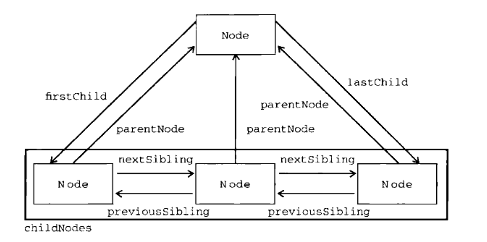

## DOM操作

HTML 是数据的主要载体，对数据的操纵通过 JS 操作 DOM 进行。前端框架要解决的核心问题之一就是如何高效地进行 DOM 操作。

### 定义

DOM，Document Object Model，文档对象模型，**是 XML 和 HTML 文档的 API/应用程序编程接口**。该标准由W3C 制定，主要由 3 个部分组成：

* 核心 DOM - 针对任何结构化文档的标准模型
* XML DOM - 针对 XML 文档的标准模型
* HTML DOM - 针对 HTML 文档的标准模型

DOM 是平台和语言无关的接口，任何语言只要实现 DOM，就可以对文档进行访问和操作，比如 Python：

```
# Python DOM example
import xml.dom.minidom as m
doc = m.parse("C:\\Projects\\Py\\chap1.xml");
doc.nodeName # DOM property of document object;
p_list = doc.getElementsByTagName("para");
```

DOM 提供了文档结构化的描述，并定义了对该结构进行访问和操作的方法，以动态地访问和更新文档的内容、结构和样式。所以，从功能上来讲，DOM 的主要功能有 2 种：

* 对文档进行结构的描述/抽象
* 对结构进行访问和操作

### 结构描述

DOM 将 XML 和 HTML 文档描述成一个由多层节点构成的倒树形结构。


学习这个结构，主要是学习 2 个方面的知识：

* 节点类型
* 节点关系

#### 节点类型

节点类型主要有 12 种：

| 描述             | nodeType                           | nodeName            | nodeValue  |
| ---------------- | ---------------------------------- | ------------------- | ---------- |
| **Element**      | 1/Node.ELEMENT_NODE                | <元素标签名>        | null       |
| **Attribute**    | 2/Node.ATTRIBUTE_NODE              | <特性名称>          | <特性的值> |
| **Text**         | 3/Node.TEXT_NODE                   | \#text              | <包含文本> |
| cdata            | 4/Node.CDATA_SECTION_NODE          | \#cdata-section     | <包含内容> |
| Entity Reference | 5/Node.ENTITY_REFERENCE_NODE       |                     |            |
| Entity           | 6/Node.ENTITY_NODE                 |                     |            |
|                  | 7/Node.PROCESSING_INSTRUCTION_NODE |                     |            |
| Comment          | 8/Node.COMMENT_NODE                | \#comment           | <注释内容> |
| **Document**     | 9/Node.DOCUMENT_NODE               | \#document          | null       |
| 文档类型         | 10/Node.DOCUMENT_TYPE_NODE         | doctype 名称        | null       |
| 文档片段         | 11/Node.DOCUMENT_FRAGMENT_NODE     | \#document-fragment | null       |
|                  | 12/Node.NOTATION_NODE              |                     |            |

需要注意的是：

* 每个节点都拥有 nodeType、nodeName 和 nodeValue 属性值
* nodeType 除了直接的数值，在 window.Node 对象上还拥有一个等于此数值的常量属性，但早期 IE 并不支持这个常量属性
* 虽然节点类型多达 12 种，但并非每个浏览器都支持所有类型，浏览器通常只是对几个通用的支持的比较好

##### Document

支持的属性：

| 属性                     | 描述                                                |
| ------------------------ | --------------------------------------------------- |
| document.doctype         | \<!DOCTYPE> 元素                                    |
| document.documentElement | 获取 html 根元素                                    |
| document.head            | 获取文档 head 元素                                  |
| document.body            | 获取文档 body 元素                                  |
| document.title           | title 元素的文本，可配置                            |
| document.anchors         | 获取所有带 name 特性的 a 元素                       |
| document.links           | 获取所有带 href 特性的 a 元素                       |
| document.applets         | 获取所有 applet 元素                                |
| document.forms           | 获取所有 form 元素                                  |
| document.images          | 获取所有 img 元素                                   |
| document.activeElement   | 获取当前获得焦点的元素                              |
|                          |                                                     |
| document.readyStatus     | 文档准备状态，可取值：'loading'/'complete'          |
| document.compatMode      | 文档渲染模式，'CSS1Compat'(标准)/'BackCompat'(混杂) |
| document.charset         | 文档使用的字符集                                    |
| document.defaultCharset  | 文档默认使用字符集，可能与 document.charset 不同    |
|                          |                                                     |
| document.defaultView     | 当前文档的窗口                                      |
| document.domain          | 当前页面的域名                                      |
| document.URL             | 当前页面完整 URL                                    |
| document.referrer        | 跳转至当前页面的那个页面的 URL                      |

支持的方法：

| 方法                              | 描述                                                       |
| --------------------------------- | ---------------------------------------------------------- |
| document.createElement()          | 创建新元素                                                 |
| document.createTextNode()         | 创建新文本节点                                             |
| document.createComment()          | 创建注释节点                                               |
| document.createDocumentFragment() | 创建文档片段                                               |
|                                   |                                                            |
| document.getElementById()         | 获取特定 id 的元素                                         |
| document.getElementsByTagName()   | 获取特定 tag 的元素                                        |
| document.getElementsByName()      | 获取特定 name 值的元素                                     |
| document.getElementsByClassName() | 获取特定 className 的元素                                  |
| document.querySelector()          | 获取模式匹配的第一个元素                                   |
| document.querySelectorAll()       | 获取模式匹配的所有元素组成的 NodeList 实例                 |
|                                   |                                                            |
| document.hasFocus()               | 当前文档是否获得焦点                                       |
| document.open()                   | 打开文档写入流，文档已有内容会被清空，区别 window.open()   |
| document.close()                  | 关闭文档写入流，区别 window.close()                        |
| document.write()                  | 写入字符串到 document.open() 打开文档流，原样写入          |
| document.writeln()                | 写入字符串到 document.open() 打开文档流，原样写入 + 换行符 |

需要注意的是：

* document.write() 和 document.writeln() 方法
  * 需要调用 document.open() 打开一个文档写入流，写入完成后，调用 document.close() 关闭文档流
  * 如果未显示调用 document.open() 方法，浏览器一般会隐式先行调用 document.open() 方法

##### Element

支持的属性：

| 属性               | 描述                                                         |
| ------------------ | ------------------------------------------------------------ |
| element.tagName    | 获取元素 tagName，与 element.nodeName 值相同                 |
| element.id         | 获取元素 id                                                  |
| element.title      | 获取元素 title 属性                                          |
| element.lang       | 获取元素 lang/语言属性                                       |
| element.dir        | 获取元素 dir/语言方向属性                                    |
| element.className  | 获取元素 className 字符串                                    |
| element.classList  | 获取元素 className 集合                                      |
| element.attributes | 获取元素属性集合                                             |
| element.dataset    | 获取元素所有 data- 开头属性映射                              |
| element.style      | 获取元素 style 属性对象，注意区别 window.getComputedStyle() 方法 |
|                    |                                                              |
| element.innerText  | 获取/设置元素内部文本                                        |
| element.outerText  | 获取时与 innerText 完全一致；或以特定 text 创建节点并替换当前元素 |
| element.innerHtml  | 获取/设置元素内部 html                                       |
| element.outerHtml  | 获取节点及其子节点 html，或以特定 html 创建节点并替换当前元素 |

需要注意的是：

1. element.attributes 属性包含一个与 NodeList 类似的 NamedNodeMap，NamedNodeMap 对象拥有以下 3 个方法：

   | 方法                  | 描述                           |
   | --------------------- | ------------------------------ |
   | getNamedItem(name)    | 返回 nodeName 等于 name 的节点 |
   | setNamedItem(name)    | 添加 nodeName 等于 name 的节点 |
   | removeNamedItem(name) | 删除 nodeName 等于 name 的节点 |
   | item(pos)             | 返回 pos 位置的节点            |

2. element.classList 属性是新集合类型 DOMTokenList 的示例，与其他 DOM 集合相似，其具有一个 length 属性，标识包含多少个元素，可以通过 [] 或 item() 方法获得具体元素。其支持以下 5 个方法：

   | 方法            | 描述                                        |
   | --------------- | ------------------------------------------- |
   | add(value)      | 添加 value 到 classList，若已存在，则不添加 |
   | contains(value) | classList 是否包含 value                    |
   | remove(value)   | 从 classList 中删除 value                   |
   | toggle(value)   | classList 中，若已有 value 则删除，否则添加 |
   | item(pos)       | 返回 pos 位置的节点                         |

支持的方法：

| 方法                            | 描述                                               |
| ------------------------------- | -------------------------------------------------- |
| element.getAttribute()          | 获取元素特定属性                                   |
| element.setAttribute()          | 设置元素特定属性                                   |
| element.removeAttribute()       | 删除元素特定属性                                   |
| element.normalize()             | 在包含不定个文本节点的父元素上调用，以合并文本节点 |
| element.matchesSelector()       | 检查元素是否与某个选择符相符                       |
| element.insetAdjacentHTML()     | 元素的指定位置插入 html                            |
| element.scrollIntoView()        | 滚动元素到视口中                                   |
| element.contains()              | 元素是否包含某个元素                               |
| element.getBoundingClientRect() | 获取元素相对视口的位置                             |

需要注意的是：

* 为优化内存占用及提升性能，在使用 innerHtml、outerHtml 属性，以及 insetAdjacentHTML() 方法时，要注意尽量减少调用；并在删除元素前，手动删除元素上的所有事件和 JS 对象属性

##### Text

支持的属性：

| 属性        | 描述                 |
| ----------- | -------------------- |
| text.length | 获取文本节点字符数目 |

支持的方法：

| 方法                                  | 描述                                         |
| ------------------------------------- | -------------------------------------------- |
| text.appendData(text)                 | 将 text 添加到节点末尾                       |
| text.deleteData(offset, count)        | 从 offset 位置删除 count 个字符              |
| text.insertData(offset, text)         | 从 offset 位置插入 text                      |
| text.replaceData(offset, count, text) | 用 text 替换从 offset 到 offset+count 的文本 |
| text.substringData(offset, count)     | 提取从 offset 到 offset+count 的文本         |
|                                       |                                              |
| text.splitText(offset)                | 从 offset 位置将一个 text 节点切分成两个     |

##### Comment

支持的方法：

| 方法                                     | 描述                                            |
| ---------------------------------------- | ----------------------------------------------- |
| comment.appendData(text)                 | 将 comment 添加到节点末尾                       |
| comment.deleteData(offset, count)        | 从 offset 位置删除 count 个字符                 |
| comment.insertData(offset, text)         | 从 offset 位置插入 comment                      |
| comment.replaceData(offset, count, text) | 用 comment 替换从 offset 到 offset+count 的文本 |
| comment.substringData(offset, count)     | 提取从 offset 到 offset+count 的 comment        |

需要注意的是：

* Text 类型和 Comment 类型继承自相同的父类，所以除了 splitText(offset) 方法，Comment 类型具有剩余所有的 Text 类型方法

##### DocumentType

支持的属性：

| 属性      | 描述                                 |
| --------- | ------------------------------------ |
| name      | 文档类型名称                         |
| entities  | 文档类型描述实体的 NamedNodeMap 对象 |
| notations | 文档类型描述符号的 NamedNodeMap 对象 |

##### DocumentFragment

支持的方法：继承了 Node 的所有方法。

##### Attr

支持的属性：

| 属性      | 描述                                    |
| --------- | --------------------------------------- |
| name      | 属性 name                               |
| value     | 属性 value                              |
| specified | Boolean，属性是代码中指定，否则为默认的 |

#### 节点关系



* childNodes，元素所有的直接子元素，其值为 NodeList 对象 (NodeList 是一种类数组对象，获取其中的节点可以通过 [] 或者 item() 两种方法)
* children，元素所有的**非空**直接子元素，用来代替 childNodes。因为 IE 会把空白也算作一个 child，这和其它浏览器对 childNodes 的实现不一致
* parentNode， childNodes 中每个节点都有一个 parentNode 属性指向父元素
* firstChild，childNodes 中的第一个元素，元素的第一个子节点
* lastChild，childNodes 中的最后一个元素，元素的最后一个子节点
* previousSibling，元素的前一个节点
* nextSibling，元素的后一个节点

### 结构访问和操作

完成 XML 和 HTML 文档结构化描述之后，即可对整个 DOM 结构进行访问和操作，访问和操作需要的属性和方法就定义在各个节点上。

| 操作类型 | 属性/方法                                                    |
| -------- | ------------------------------------------------------------ |
| 节点创建 | createElement、createDocumentFragment、createTextNode、cloneNode ... |
| 节点属性 | attributes、getAttribute、setAttribute、removeAttribute、style、getComputedStyle ... |
| 节点关系 | parentNode、childNodes、children、firstChild、lastChild、previousSibling、nextSibling ... |
| 节点查询 | getElementById、getElementsByClassName、querySelector、querySelectorAll ... |
| 节点修改 | appendChild、replaceChild、removeChild、insertBefore、innerHtml ... |
| 内容加载 | XMLHttpRequest、ActiveX                                      |

### jQuery/Zepto

jQuery/Zepto 是 PC 和移动端直接 DOM 操作框架的典型代表，它们简化了 DOM 结构的访问和操作：

| 操作类型 | 属性/方法                                                    |
| -------- | ------------------------------------------------------------ |
| 节点创建 | $(selector)、clone() ...                                     |
| 节点属性 | attr()、data()、css()、hide()、show()、slideDown()、slideUp()、animate() ... |
| 节点关系 | parent()、siblings()、closest()、next()、children() ...      |
| 节点查询 | $(selector)、find()、eq()、filter()  ...                     |
| 节点修改 | html()、replace()、remove()、append()、before()、after() ... |
| 内容加载 | ajax()、get()、post() ...                                    |


