## MV*框架

> SPA，Single Page Application，单页面应用

尽管直接 DOM 操作框架（jQuery/Zepto）实现了 DOM 结构的高效访问及操作，但是随着 Web 应用的越加复杂化，尤其是 SPA 的出现，JS 代码变得越加复杂臃肿。MV* 框架开始从后端走向前端，与 DOM 访问及操作相关的内容被抽象成三个部分：

* Model - 数据模型，数据结构及其相关的处理方法
* View - 视图/用户界面，数据的具体展示
* Controller/Presenter/ViewModel - Model 和 View 的交互方式

无论 MVC、MVP，还是 MVVM，都是将数据模型和视图通过不同的方式进行解耦，说到底就是如何协调 View 与 Model 的关系。MVC/MVP/MVVM 在接受用户交互，进而改变 Model 的逻辑上基本上是一致的，只是在 Model 发生改变时如何更新 View 的逻辑上进行了进化：

* MVC 由 Model 直接触发 View 改变
* MVP 中 Model 只是将改变通知给 Presenter，再由 Presenter 操纵 View 改变
* MVVM 直接在 HTML 上通过标签完成与数据的自动绑定，当数据改变时，View 自动更新

### 框架模型

#### MVC

MVC，Model-View-Controller

MVC 模式的基本模型：

* 由 View 接受用户交互并传递给 Controller，或者由 Controller 直接接受用户交互
* Controller 完成业务逻辑后，改变 Model 数据
* Model 数据改变时，通过观察者模式去通知对应的 View，然后 View 重新请求 Model 数据做相应的界面改变

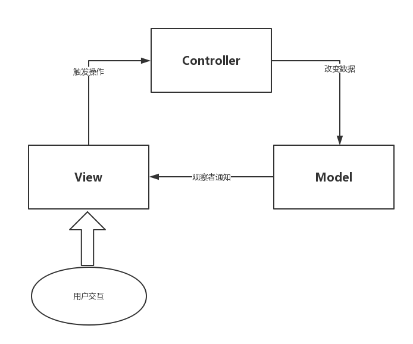

特点：

- 所有通信都是单向的

##### 实现

以一个简单实例来学习 MV\*。如图，一个可以对数值进行加减操作的组件，上面显示数值，两个按钮可以对数值进行加减操作，操作后的数值会更新显示。

需要说明的是：针对相对简单的应用，使用 MV\* 框架并不能体现其优越性，反而会显得比较复杂，需要更多的代码。所以，尽管有各种先进的架构，但是古老的框架依旧存在其适用的场景。对于简单的 Web 应用，jQuery 或Zepto，甚至完全不需要任何框架的几句简单的 JS 代码都可能更加高效；只有相对复杂，数据处理比较繁琐的应用，MV\* 框架才能体现其价值。

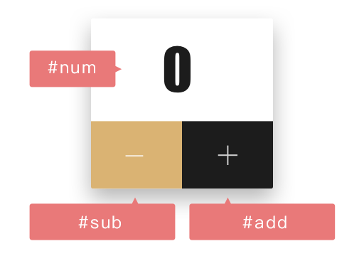

HTML:

```
<div id="main">
    <p id="num">0</p>
    <div>
        <a id="sub" href="javascript:;"> - </a>
        <a id="add" href="javascript:;"> + </a>
    </div>
</div>
```

采用 View 接受用户交互的方式实现

* Model

  数据发生变化时，模型将通知有关的视图。Model 和 View 之间使用了观察者模式，View 事先在 Model 上注册，以便在 Model 发生改变时更新视图。

  ```
  // Model
  class Model {
      constructor() {
          this.count = 10;
          this.views = [];
      }
  
      add() {
          this.count++;
          this.broadcast();
      }
  
      sub() {
          this.count--;
          this.broadcast();
      }
  
      getVal() {
          return this.count;
      }
  
      register(view) {
          this.views.push(view);
          this.broadcast();
      }
  
      broadcast() {
          this.views.forEach((view) => {
              view.render(this);
          })
      }
  }
  ```

* View

  View 和 Controller 之间使用了策略模式，这里 View 传递 Controller 的实例来实现特定的响应策略，比如这个栗子中按钮的 click 事件；如果要实现不同的响应策略只要用不同的 Controller 实例替换即可。

  ```
  // View
  class View {
      constructor(controller) {
          this.$num = document.getElementById('num');
          this.$add = document.getElementById('add');
          this.$sub = document.getElementById('sub');
          this.controller = controller;
  
          this.bindEvents();
      }
  
      render(model) {
          this.$num.innerText = model.getVal();
      }
  
      bindEvents() {
          this.$add.addEventListener('click', () => {
              this.controller.increase();
          }, false);
  
          this.$sub.addEventListener('click', () => {
              this.controller.decrease();
          }, false);
      }
  }
  ```

* Controller

  Controller 是 Model 和 View 的纽带，MVC 将响应机制封装在 Controller 对象中，当用户和应用交互时，控制器中的事件触发器就开始工作了。这里实例化 View 并向对应的 Model 实例注册，当 Model 发生变化时以通知 View 做更新，这里用到了观察者模式。

  ```
  // Controller
  class Controller {
      constructor() {
          const view = new View(this);
  
          this.model = new Model();
  
          this.model.register(view);
      }
  
      increase() {
          this.model.add();
      }
  
      decrease() {
          this.model.sub();
      }
  }
  ```

* 启动

  执行应用时，使用 Controller 做初始化：

  ```
  new Controller();
  ```

##### 实例

###### Backbone


```
1. 用户可以向 View 发送指令（DOM 事件），再由 View 直接要求 Model 改变状态。
2. 用户也可以直接向 Controller 发送指令（改变 URL 触发 hashChange 事件），再由 Controller 发送给 View
3. Controller 非常薄，只起到路由的作用，而 View 非常厚，业务逻辑都部署在 View。所以，Backbone 索性取消了 Controller，只保留一个 Router（路由器）
```

##### 问题

MVC 模式存在的问题：

* View 直接依赖于 Model
  * 实现 View 的组件化比较难
  * Model 与 View 的关系是 n:n 的，可能 1 个 Model 对应 n 个 View 或者 n 个 Model 对应 1 个 View，甚至更复杂的场景；随着应用规模的增加，Model 与 View 之间错综复杂的关系使开发的难度增加

#### MVP

MVP，Model-View-Presenter，是对 MVC 模式的改良。

与 MVC 模式相比，MVP 模式通过解耦完全分离 Model 和 View，使职责划分更加清晰。同时，由于 View 不再依赖 Model，可以将 View 抽离出来做成组件，它只需要提供一系列接口供上层调用。

MVP 模式的基本模型：

* View 接收用户交换，并传送指令到 Presenter
* Presenter 操作 Model 进行数据更新
* Model 发生改变时，通知 Presenter 数据发生变化
* Presenter 收到通知后调用 View 的接口改变用户界面

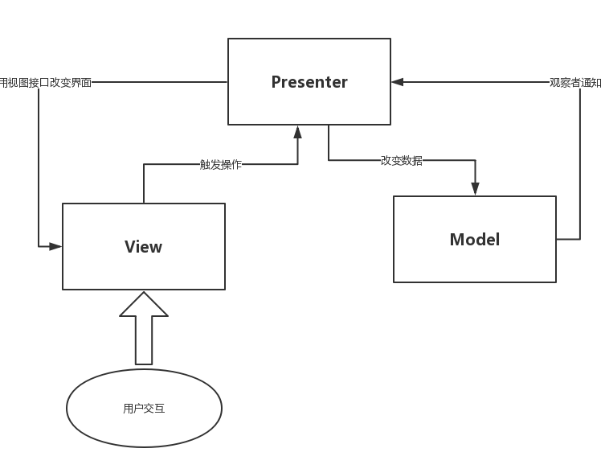


特点：

- 通信都是双向的
- View 与 Model 不发生联系，都通过 Presenter 传递
- View 非常薄，不部署任何业务逻辑，称为"被动视图"（Passive View），即没有任何主动性，而 Presenter 非常厚，所有逻辑都部署在那里

##### 实现

使用 MVC 中的示例

* Model

  Model 层依然主要是与业务相关的数据以及对应处理数据的方法

  ```
  // Model
  class Model {
      constructor() {
          this.count = 10;
      }
  
      add() {
          this.count++;
      }
  
      sub() {
          this.count--;
      }
  
      getVal() {
          return this.count;
      }
  }
  ```

* View

  View 暴露 setter 接口让 Presenter 调用，待 Presenter 通知 Model 更新后，Presenter 调用 View 提供的接口更新视图

  ```
  // View
  class View {
      constructor(presenter) {
          this.$num = document.getElementById('num');
          this.$add = document.getElementById('add');
          this.$sub = document.getElementById('sub');
          this.presenter = presenter;
  
          this.bindEvents();
      }
  
      render(model) {
          this.$num.innerText = model.getVal();
      }
  
      bindEvents() {
          this.$add.addEventListener('click', () => {
              this.presenter.increase();
          }, false);
  
          this.$sub.addEventListener('click', () => {
              this.presenter.decrease();
          }, false);
      }
  }
  ```

* Presenter

  ```
  // Presenter
  class Presenter {
      constructor() {
          this.model = new Model();
          this.view = new View(this);
  
          this.view.render(this.model);
      }
  
      increase() {
          this.model.add();
          this.view.render(this.model);
      }
  
      decrease() {
          this.model.sub();
          this.view.render(this.model);
      }
  }
  ```

* 启动

  ```
  new Presenter();
  ```

##### 问题

MVP 模式存在的问题：

* Presenter 作为“中间人”，除基本业务逻辑外，还需大量的代码双向的“手动同步” Model 和 View 之间的数据，这使得 Presenter 显得很重，维护起来比较困难
* 如果 Presenter 对视图渲染的需求增多，它不得不过多关注特定的视图，一旦视图需求发生改变，Presenter 也需要改动

#### MVVM

MVVM 通过双向数据绑定，使 Model 和 View 之间的同步逻辑自动化，开发者只需要使用声明式的指令将 View 和相应的 Model 绑定起来。ViewModel 在 Model 改变时可以自动更新对应 View；同时，当 View 发生改变时，ViewModel 也会自动修改对应 Model 的数据。

MVVM 模式的基本模型：

* 通过 Binder，ViewModel 在 Model 改变时自动更新对应 View
* 当 View 发生改变时，ViewModel 也会自动修改对应的 Model

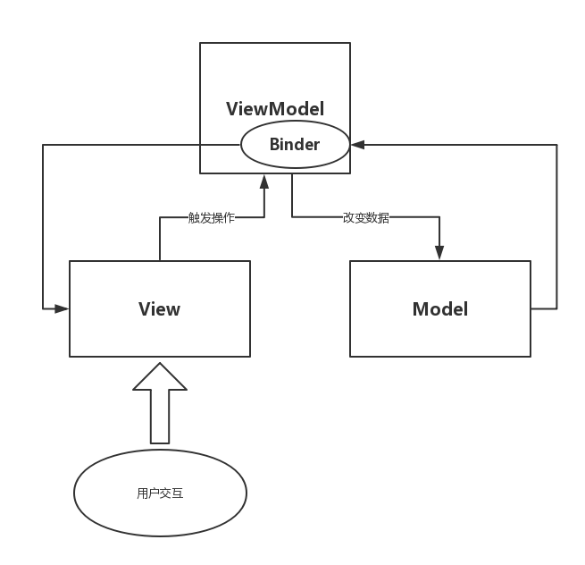

特点：

* 双向绑定，View/Model 的变动，自动反映在 ViewModel，反之亦然

- 低耦合，View 可以独立于 Model 变化，一个 ViewModel 可以绑定到不同的 View 上，当 View 变化的时候 Model 可以不变，当 Model 变化的时候 View 也可以不变
- 可重用性，Model 和 View 的解耦易于组件化
- 聚焦业务，开发人员可以专注于业务逻辑的开发
- 可测试，界面素来是比较难于测试的，而现在测试可以针对 ViewModel 来写

##### 响应式数据

MVVM 框架中，最重要的实现就是 ViewModel 中数据的双向绑定。其中，View -> ViewModel -> Model 方向基本使用事件机制实现，而 Model -> ViewModel -> View 方向，即响应式数据的实现方式主要有 4 种：

- 手动触发绑定
- 脏数据检查
- 数据对象劫持
- ES 6 Proxy

使用示例：当 \<input> 输入框数据发生改变时，自动更新 \<p> 标签内容

```
# HTML
<p v-bind="value" id="el"></p>
<input v-model="value" type="text" id="input">
```

###### 手动触发绑定

定义一个 set 方法，其作用是

* 改变数据，所有对数据对象的修改都使用这个 set 方法进行
* 在数据改变时，主动触发 View 的重新渲染。

```
// 数据对象
let data = {
    value: 'Hello'
};

// 元素
const elems = {
    bindElems: document.querySelectorAll('[v-bind]'),
    modelElems: document.querySelectorAll('[v-model]')
};

// 指令
const directive = {
    bind(txt) {
        this.innerText = txt;
    },
    model(val) {
        this.setAttribute('value', val);
    }
};

// 事件绑定
elems.modelElems.forEach(elem => {
    elem.addEventListener('keyup', function (e) {
        ViewModelSet('value', e.target.value);
    }, false);
});

// set方法
function ViewModelSet(key, val) {
    data[key] = val;
    scan();
}

// view扫描渲染
function scan() {
    for (let elem of elems.bindElems) {
        const key = elem.getAttribute('v-bind');

        directive.bind.call(elem, data[key]);
    }

    for (let elem of elems.modelElems) {
        const key = elem.getAttribute('v-model');

        directive.model.call(elem, data[key]);
    }
}

// 初始化渲染
scan();

// 模拟异步渲染
setTimeout(function () {
    ViewModelSet('value', 'Hello Value!');
}, 1000);
```

###### 脏数据检查 

找到与变化属性相关的所有元素，在数据真的变化时，才进行指令调用。

脏数据检测是手动触发绑定方式的改进，它提高了 ViewModel 内容变化后扫描视图渲染的效率。

```
// 数据对象
let data = {
    value: 'Hello'
};

// 元素
const elems = {
    bindElems: document.querySelectorAll('[v-bind]'),
    modelElems: document.querySelectorAll('[v-model]')
};

// 指令
const directive = {
    bind(txt) {
        this.innerText = txt;
    },
    model(val) {
        this.setAttribute('value', val);
    }
};

// 事件绑定
elems.modelElems.forEach(elem => {
    elem.addEventListener('keyup', function (e) {
        const key = e.target.getAttribute('v-model');

        ViewModelSet(key, e.target.value);
    }, false);
});

// set方法
function ViewModelSet(key, val) {
    data[key] = val;
    $digest(key);
}

// 脏数据检测
function $digest(key) {
	// 只针对改变属性相关的元素
    const bindElems = document.querySelectorAll('[v-bind=' + key + ']');
    const modelElems = document.querySelectorAll('[v-model=' + key + ']');

    for (let elem of bindElems) {
        const key = elem.getAttribute('v-bind');
        const val = data[key];
        
        // 比对数据是否改变
        if (elem.val !== val) {
            elem.val = val;
            directive.bind.call(elem, val);
        }
    }

    for (let elem of modelElems) {
        const key = elem.getAttribute('v-model');
        const val = data[key];
        
        // 比对数据是否改变
        if (elem.val !== val) {
            elem.val = val;
            directive.model.call(elem, val);
        }
    }
}

// 初始化渲染
$digest('value');

// 模拟异步渲染
setTimeout(function () {
    ViewModelSet('value', 'Hello Value!');
}, 1000);
```

###### 数据对象劫持

使用 Object.defineProperty 方法，将对象的属性由数据属性转换成访问器属性，通过属性的 getter 函数收集依赖，并在属性的 setter 函数中调用相应的渲染逻辑；

当再次设置对象属性时，就会自动重新渲染页面。这也是 Vue 2.x 版本采用的方式。

```
// 数据对象
let data = {
    value: 'Hello'
};

// 元素
const elems = {
    bindElems: document.querySelectorAll('[v-bind]'),
    modelElems: document.querySelectorAll('[v-model]')
};

// 指令
const directive = {
    bind(txt) {
        this.innerText = txt;
    },
    model(val) {
        this.setAttribute('value', val);
    }
};

// 事件绑定
elems.modelElems.forEach(elem => {
    elem.addEventListener('keyup', function (e) {
        const key = e.target.getAttribute('v-model');

        data[key] = e.target.value;
    }, false);
});

// 对象劫持
function hijack(obj) {
    for (let prop in obj) {
        let oldVal = obj[prop];

        if (typeof oldVal === 'object') {
            hijack(oldVal);
            continue;
        }

        // 初始化渲染
        render(prop, oldVal);

        Object.defineProperty(obj, prop, {
            get() {
                return oldVal;
            },
            set(newObj) {
                if (newObj !== oldVal) {
                    oldVal = newObj;
                    render(prop, newObj);
                }
            },
            enumerable: true,
            configurable: true
        })
    }
}

// View渲染
function render(prop, newObj) {
    const bindElems = document.querySelectorAll('[v-bind=' + prop + ']');
    const modelElems = document.querySelectorAll('[v-model=' + prop + ']');

    for (let elem of bindElems) {
        directive.bind.call(elem, newObj);
    }

    for (let elem of modelElems) {
        directive.model.call(elem, newObj);
    }
}

// 开始劫持
hijack(data);

// 模拟异步渲染
setTimeout(function () {
    data.value = 'Hello World!'
}, 1000);
```

数据对象劫持存在的问题：

* 如果对象属性是不可配置的，即 configurable 为 false，则无法劫持；所以，采用该种方式的 Vue 2.x 在判断对象属性不可配置时就直接 return (参见 Vue 源码 core/observer/index.js)

* Object.defineProperty 方法只能劫持通过其定义的已有对象**属性**，需要繁琐地遍历整个对象完成数据属性到访问器属性的转换（Proxy 可以直接代理整个对象），且无法劫持对象增加或删除属性的行为，所以 Vue 才需要额外提供 $set() 和 Vue.set() 等方法，在对象添加/删除属性时触发依赖。在其源码实现中 (参见 Vue 源码 core/observer/index.js) 也创建了两类依赖收集器，一类用于已有属性修改时触发，一类用于添加/删除属性时触发

* Object.defineProperty 方法无法劫持数组元素的设置，所以在 Vue 中以下方式不是响应式的

  ```
  var vm = new Vue({
    data: {
      items: ['a', 'b', 'c']
    }
  })
  vm.items[1] = 'x' 		// 不是响应性的
  vm.items.length = 2 	// 不是响应性的
  ```

  要在更改数组元素的同时触发依赖，需要使用变通的方法

  ```
  Vue.set(vm.items, indexOfItem, newValue)
  vm.$set(vm.items, indexOfItem, newValue)
  vm.items.splice(indexOfItem, 1, newValue)
  ```

  但 ES 6 Proxy 却可以劫持数组元素设置

  ```
  let obj = [1, 2]
  let pxy = new Proxy(obj, {
      set(target, p, value, receiver) {
          target[p] = value + 1;
      }
  })
  
  pxy[0] = 100;
  
  console.log(obj[0])		// 101
  ```

所以，由于数据对象劫持存在以上问题，Vue 3.x 将会实现基于 ES 6 Proxy 技术的数据变更监测。

###### ES 6 Proxy

利用 ES 6 Proxy 对象代理数据对象，以劫持数据对象的 set 行为。在数据对象属相值改变时，重新渲染数据关联的视图。

Proxy 对象的优点：

* 可以劫持对象的添加和删除行为，而且是直接劫持对象，而无需遍历劫持每个属性
* 可以劫持数组元素的直接设置行为

Proxy 对象的缺点：

* 浏览器的兼容性

```
// 数据对象
let data = {
    value: 'Hello'
};

// 数据代理
let proxy = new Proxy(data, {
    set(target, prop, value) {
        render(prop, value);

        Reflect.set(target, prop, value);
    }
});

// 元素
const elems = {
    bindElems: document.querySelectorAll('[v-bind]'),
    modelElems: document.querySelectorAll('[v-model]')
};

// 指令
const directive = {
    bind(txt) {
        this.innerText = txt;
    },
    model(val) {
        this.setAttribute('value', val);
    }
};

// 事件绑定
elems.modelElems.forEach(elem => {
    elem.addEventListener('keyup', function (e) {
        const key = e.target.getAttribute('v-model');

        proxy[key] = e.target.value;
    }, false);
});

// View渲染
function render(prop, newObj) {
    const bindElems = document.querySelectorAll('[v-bind=' + prop + ']');
    const modelElems = document.querySelectorAll('[v-model=' + prop + ']');

    for (let elem of bindElems) {
        directive.bind.call(elem, newObj);
    }

    for (let elem of modelElems) {
        directive.model.call(elem, newObj);
    }
}

// 初次渲染
render('value', data.value);

// 模拟异步渲染
setTimeout(function () {
    proxy.value = 'Hello World!'
}, 1000);
```

###### 参考

- https://github.com/MrErHu/blog/issues/28

##### Virtual DOM

> virtual：/ˈvɜ:tʃuəl/

无论是直接操作 DOM 的 jQuery/Zepto，还是 MVC、MVP，以及让开发者意识不到 DOM 存在的 MVVM，归根结底，最后对 View 的渲染或重绘，都要通过 DOM 操作来完成，但是 DOM 操作与 JS 运算相比，还是显得太慢，尤其是 Model 变更较大的时候。如何尽量减少 DOM 操作，提高页面渲染的效率？方式之一便是虚拟 DOM。

**虚拟 DOM 是一种特殊的 JS 对象，是对 DOM 结构的数据描述，通过它可以渲染出唯一结构的 DOM；当 Model 改变后，生成一个新的虚拟 DOM 对象与旧的虚拟 DOM 进行比对，找出两者之间的最小修改结构；最后，将找到的差异重新绘制到 View，以避免不必要的多余绘制。**

虚拟 DOM 的核心操作主要有三个步骤：

1. Create - 创建虚拟 DOM 对象，并通过该对象初始化页面
2. Diff - 当数据改变时，重新生成新的虚拟 DOM 对象与旧的虚拟 DOM 对象进行比对
3. Patch - 基于得到的新旧虚拟 DOM 的不同，渲染差异化虚拟 DOM

###### 创建虚拟 DOM

虚拟 DOM 并不是通过扫描 HTML DOM 结构获取的，因为 DOM 的操作很慢，这样做恰恰会失去虚拟 DOM 的优势。MVVM 中，**虚拟 DOM 的创建通常是通过解析绑定 JS 数据的 HTML 模板来获取的**。

创建虚拟 DOM 通常通过一个类，该类记录 DOM 节点的基本特征值，并实现可以将该对象绘制到页面的 render 函数。

```
class Node {
    constructor(jsDom) {
        this.tag = jsDom.tag;
        this.props = jsDom.props || {};
        this.children = jsDom.children || [];
    }

    render() {
        const elem = document.createElement(this.tag);
        const props = this.props;
        const children = this.children;

        for (let prop in props) {
            elem.setAttribute(prop, props[prop]);
        }

        children.forEach(function (child) {
            const childEl = typeof child === 'object' ? new Node(child).render() : document.createTextNode(child);

            elem.appendChild(childEl);
        });

        return elem;
    }
}
```

###### 比对虚拟 DOM

当 Model 发生改变，为了减少不必要的重复渲染，需要找到新旧虚拟 DOM 之间的差异。

比较两棵 DOM 树的差异是虚拟 DOM 算法最核心的部分，即虚拟 DOM 的 diff 算法。两个树的完全 diff 算法是一个时间复杂度为 O(n^3^) 的问题。而对于 SPA，DOM 结构往往比较复杂，进行高时间复杂度的比对会严重的降低性能。所以，在 React 中，结合 Web 界面的特点做出了两个简单的假设，使得 diff 算法复杂度直接降低到 O(n)：

* 相同组件产生类似的 DOM 结构，不同的组件产生不同的 DOM 结构
* 对于同一层次的一组子节点，可以通过唯一的 id 进行区分

换句话说，就是两棵树的 diff 算法只会比对相同层级的节点。


```
function diff(oldTree, newTree) {
    let index = 0;                              // 节点的遍历顺序
    let patches = {};                           // 在遍历过程中记录节点的差异

    dfsWalk(oldTree, newTree, index, patches);  // 深度优先遍历两棵树

    return patches;
}

function dfsWalk(oldNode, newNode, index, patches) {
    let patch = [];

    if (newNode === null) {                     // 节点删除

    } else if (isString(oldNode) && isString(newNode)) {
        oldNode !== newNode && patch.push({     // 修改节点文本内容
            type: 'text',
            content: newNode
        });
    } else if (oldNode.tag === newNode.tag && oldNode.key === newNode.key) {
        let props = diffProps(oldNode, newNode);

        props && patch.push({                 // 修改节点属性
            type: 'props',
            props: props
        });

        // 比较子节点
        diffChildren(oldNode.children, newNode.children, index, patches, patch);
    } else {
        patch.push({                            // 替换原有节点
            type: 'replace',
            node: newNode
        });
    }

    if (patch.length) {
        patches[index] = patch;
    }
}

function diffProps(oldNode, newNode) {
    let change = false;
    let patches = {};
    let oldProps = oldNode.props;
    let newProps = newNode.props;

    // 寻找不同属性
    for (let key in oldProps) {
        if (oldProps[key] !== newProps[key]) {
            change = true;
            patches[key] = newProps[key];
        }
    }

    // 寻找新加属性
    for (let key in newProps) {
        if (!oldProps.hasOwnProperty(key)) {
            change = true;
            patches[key] = newProps[key];
        }
    }

    return change ? patches : null;
}

function diffChildren(oldChildren, newChildren, index, patches, patch) {
    let diffs = diffList(oldChildren, newChildren, 'key');

    newChildren = diffs.children;

    if (diffs.moves.length) {
        patch.push({
            type: 'reorder',
            moves: diffs.moves
        });
    }

    let leftNode = null;
    let currIndex = index;

    oldChildren.forEach(function (child, i) {
        let newChild = newChildren[i];

        currIndex = (leftNode && leftNode.count)
            ? currIndex + leftNode.count + 1
            : currIndex + 1;

        dfsWalk(child, newChild, currIndex, patches);

        leftNode = child;
    });
}

/**
 * 以O(N)算法复杂度对比两个虚拟DOM树
 * @param {Array} oldList - Original List
 * @param {Array} newList - List After certain insertions, removes, or moves
 * @return {Object} - {moves: <Array>}
 *                  - moves is a list of actions that telling how to remove and insert
 */
function diffList(oldList, newList, key) {
    let moves = [];
    let oldMap = makeKeyIndexAndFree(oldList, key);
    let newMap = makeKeyIndexAndFree(newList, key);
    let method = {
        remove(index) {
            moves.push({
                type: 0,
                index: index
            });
        },
        insert(index, item) {
            moves.push({
                type: 1,
                item: item,
                index: index
            });
        },
        removeSimulate(index) {
            simulateList.splice(index, 1)
        }
    };

    let newFree = newMap.free;
    let oldKeyIndex = oldMap.keyIndex;
    let newKeyIndex = newMap.keyIndex;

    // 用以操作的模拟List
    let i = 0;
    let item;
    let itemKey;
    let children = [];
    let freeIndex = 0;

    // 首先检查List中的项目是否已删除
    while (i < oldList.length) {
        item = oldList[i];
        itemKey = getItemKey(item, key);

        if (itemKey) {
            if (!newKeyIndex.hasOwnProperty(itemKey)) {
                children.push(null);
            } else {
                let newItemIndex = newKeyIndex[itemKey];

                children.push(newList[newItemIndex]);
            }
        } else {
            let freeItem = newFree[freeIndex++];

            children.push(freeItem || null);
        }

        i++;
    }

    let simulateList = children.slice(0);

    // 删除不再存在的元素
    i = 0;
    while (i < simulateList.length) {
        if (simulateList[i] === null) {
            method.remove(i);
            method.removeSimulate(i);
        } else {
            i++;
        }
    }

    let j = i = 0;
    while (i < newList.length) {
        item = newList[i];
        itemKey = getItemKey(item, key);

        let simulateItem = simulateList[j];
        let simulateItemKey = getItemKey(simulateItem, key);

        if (simulateItem) {
            if (itemKey === simulateItemKey) {
                j++;
            } else {
                if (!oldKeyIndex.hasOwnProperty(itemKey)) {
                    method.insert(i, item);
                } else {
                    let nextItemKey = getItemKey(simulateList[j + 1], key);

                    if (nextItemKey === itemKey) {
                        method.remove(i);
                        method.removeSimulate(j);
                        j++;
                    } else {
                        method.insert(i, item);
                    }
                }
            }
        } else {
            method.insert(i, item);
        }

        i++;
    }

    // 如果j没有移到最后，请删除所有剩余元素
    let k = simulateList.length - j;
    while (j++ < simulateList.length) {
        k--;
        method.remove(k + i);
    }

    return {
        moves: moves,
        children: children
    };
}

/**
 * Convert list to key-item keyIndex object.
 * @param {Array} list
 * @param {String|Function} key
 */
function makeKeyIndexAndFree(list, key) {
    let free = [];
    let keyIndex = {};

    for (let i = 0, len = list.length; i < len; i++) {
        let item = list[i];
        let itemKey = getItemKey(item, key);

        if (itemKey) {
            keyIndex[itemKey] = i;
        } else {
            free.push(item)
        }
    }

    return {
        free: free,
        keyIndex: keyIndex
    }
}

function getItemKey(item, key) {
    if (!item || !key) {
        return void 666;
    }

    return typeof key === 'string' ? item[key] : key(item);
}

function isString(str) {
    return Object.prototype.toString.call(str) === '[object String]';
}
```

**需要指出的是：**通过对比，找出从一种 DOM 结构转变成另外一种类似 DOM 结构的最少编辑步骤，是一个牵涉到动态规划的莱温斯坦距离问题，需要学习莱温斯坦距离算法。

###### 渲染差异化虚拟 DOM

经过虚拟 DOM 差异化对比，获得需要操作的差异化的节点和位置，剩下的就是将差异化内容渲染到页面。同时，在 patch 中还可以设置相应的钩子函数，例如在 Vue 中，在 patch 中提供了5个生命周期钩子：

- create: 创建 patch 时
- activate: 激活组件时
- update: 更新节点时
- remove: 移除节点时
- destroy: 销毁节点时

```
function patch(node, patches) {
    let walker = {
        index: 0
    };

    dfsWalk(node, walker, patches);
}

function dfsWalk(node, walker, patches) {
    let len = (node.childNodes || []).length;
    let currentPatches = patches[walker.index];     // 从patches拿出当前节点的差异

    for (let i = 0; i < len; i++) {                 // 深度遍历子节点
        let child = node.childNodes[i];

        walker.index++;
        dfsWalk(child, walker, patches);
    }

    if (currentPatches) {
        applyPatches(node, currentPatches);         // 对当前节点进行DOM操作
    }
}

function applyPatches(node, patches) {
    patches.forEach((patch) => {
        switch (patch.type) {
            case 'replace':         // 节点替换
                let newNode = (typeof patch.node === 'string')
                    ? document.createTextNode(patch.node)
                    : patch.node.render();

                node.parentNode.replaceChild(newNode, node);
                break;
            case 'reorder':         // 重新排序
                reorderChildren(node, patch.moves);
                break;
            case 'props':           // 属性修改
                setProps(node, patch.props);
                break;
            case 'text':            // 文本修改
                if (node.textContent) {
                    node.textContent = patch.content;
                } else {
                    node.nodeValue = patch.content;
                }
                break;
            default:
                throw new Error('Unknow patch type ' + patch.type);
        }
    });
}

function setProps(node, props) {
    for (let key in props) {
        if (props[key] === void 666) {
            node.removeAttribute(key)
        } else {
            let value = props[key]
            setAttr(node, key, value)
        }
    }
}

function setAttr(node, key, value) {
    switch (key) {
        case 'style':
            node.style.cssText = value;
            break;
        case 'value':
            let tagName = (node.tagName || '').toLowerCase();

            if (tagName === 'input' || tagName === 'textarea') {
                node.value = value;
            } else {
                node.setAttribute(key, value);
            }

            break;
        default:
            node.setAttribute(key, value);
            break;
    }
}

function reorderChildren(node, moves) {
    let staticNodeList = Array.prototype.slice.call(node.childNodes);
    let maps = {}

    staticNodeList.forEach((node) => {
        if (node.nodeType === 1) {
            let key = node.getAttribute('key')
            if (key) {
                maps[key] = node
            }
        }
    })

    moves.forEach((move) => {
        let index = move.index;

        if (move.type === 0) {          // 删除元素
            if (staticNodeList[index] === node.childNodes[index]) { // maybe have been removed for inserting
                node.removeChild(node.childNodes[index])
            }

            staticNodeList.splice(index, 1);
        } else if (move.type === 1) {   // 插入元素
            let insertNode = maps[move.item.key]
                ? maps[move.item.key].cloneNode(true) // reuse old item
                : (typeof move.item === 'object')
                    ? move.item.render()
                    : document.createTextNode(move.item);

            staticNodeList.splice(index, 0, insertNode);
            node.insertBefore(insertNode, node.childNodes[index] || null);
        }
    })
}
```

###### 使用虚拟 DOM

Virtual DOM算法主要是实现上面步骤的三个函数：Node，diff，patch。然后就可以实际的进行使用：

```
// 步骤一：用JS对象模拟DOM树
const initDom = new Node({
    tag: 'ul',
    props: {
        id: 'list'
    },
    children: [
        new Node({
            tag: 'li',
            props: {
                class: 'item'
            },
            children: ['Item 0']
        }),
        new Node({
            tag: 'li',
            props: {
                class: 'item'
            },
            children: ['Item 1']
        })
    ]
});

// 通过虚拟DOM构建真正的DOM 
const domTree = initDom.render();
document.body.appendChild(domTree);

// 模拟虚拟DOM变动
setTimeout(function () {
    const currDom = new Node({
        tag: 'ul',
        props: {
            id: 'list',
            class: 'list'
        },
        children: [
            new Node({
                tag: 'li',
                props: {
                    class: 'item'
                },
                children: ['Item 1']
            }),
            new Node({
                tag: 'li',
                props: {
                    class: 'item'
                },
                children: ['Item 2']
            })
        ]
    });

    // 步骤二：比较两棵虚拟DOM的差异
    const patches = diff(initDom, currDom);

    // 步骤三：应用差异到DOM树
    patch(domTree, patches);
}, 1000);
```

###### 参考

- https://github.com/livoras/blog/issues/13
- https://segmentfault.com/a/1190000008291645
- http://www.infoq.com/cn/articles/react-dom-diff

##### 实现

使用 MVC 中的示例，这里使用 Vue 来完成这个栗子。

* Model

MVVM 中，可以把 Model 称为数据层，它仅仅关注数据本身，不关心任何行为（格式化数据由 View 负责），这里可以把它理解为一个类似 json 的数据对象。

```
var data = {
    val: 0
};
```

* View

和 MVC/MVP 不同的是，MVVM 中的 View 通过使用模板语法来声明式的将数据渲染进 DOM，当 ViewModel 对 Model 进行更新的时候，会通过数据绑定更新到 View。写法如下：

```
<div id="myapp">
    <div>
        <span>{{ val }}rmb</span>
    </div>
    <div>
        <button v-on:click="sub(1)">-</button>
        <button v-on:click="add(1)">+</button>
    </div>
</div>
```

* ViewModel

ViewModel 大致上就是 MVC 的 Controller 和 MVP 的 Presenter 了，也是整个模式的重点，业务逻辑也主要集中在这里，其中的一大核心就是数据绑定。

与 MVP 不同的是，没有了 View 为 Presente 提供的接口，之前由 Presenter 负责的 View 和 Model 之间的数据同步交给了 ViewModel 中的数据绑定进行处理，当 Model 发生变化，ViewModel 就会自动更新；ViewModel 变化，Model 也会更新。

```
new Vue({
    el: '#myapp',
    data: data,
    methods: {
        add(v) {
            if(this.val < 100) {
                this.val += v;
            }
        },
        sub(v) {
            if(this.val > 0) {
                this.val -= v;
            }
        }
    }
});
```

整体来看，比 MVC/MVP 精简了很多，不仅仅简化了业务与界面的依赖，还解决了数据频繁更新（以前用 jQuery 操作 DOM 很繁琐）的问题。因为在 MVVM 中，View 不知道 Model 的存在，ViewModel 和 Model 也察觉不到 View，这种低耦合模式可以使开发过程更加容易，提高应用的可重用性。

#### MNV*

尽管通过 Virtual DOM 可以尽可能减少 DOM 操作，但是依然无法摆脱 DOM 交互的模式。在 Hybird 应用中，基于 JS 可以调用原生控件进行数据渲染的现实，可以在 Hybird 应用中直接使用原生控件渲染数据，从而从根本上摆脱 DOM。

使用 JS 调用原生控件或事件绑定来生成应用程序的交互模式称为前端 MNV\*（Model-NativeView-\*）开发模式，其中，\*表示虚拟 DOM 或者 MVVM 中的 ViewModel，我们也可以使用 Controller 来实现调用的方式。换句话讲，就是将 MV* 中的 V 换成了 NativeView，即原生应用视图。

#### 参考

- https://github.com/MrErHu/blog/issues/26
- https://segmentfault.com/a/1190000002794454
- https://www.cnblogs.com/zhouyangla/p/6936455.html

### Vue

#### 生命周期

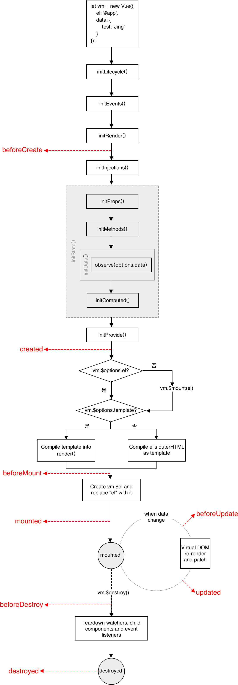

整个 Vue 实例/组件的生命周期基本在 Vue.prototype._init() 中完成，在开始执行整个生命周期前，会对实例/组件的选项对象进行预处理，比如：

* props，统一将数组和对象写法格式化为固定的对象结构

最终的结果挂载在 vm.$options 上，紧接着的整个流程均会基于该选项对象处理。

##### Events

Vue 事件是通过模板中 v-on 指令绑定的，这似乎违背了 JS 事件同 HTML 分离的原则，这样做的原因：

* 模板并非 HTML，必需通过编译，事实上编译后的事件还在在 JS 通过 addEventListener() 或 Vue 自己的自定义事件系统 Vue.prototype.\$on 进行绑定的
* 统一写在模板中，便于通过模板轻松定位页面元素和事件方法的对应关系
* ViewModel 代码可以是非常纯粹的逻辑，和 DOM 完全解耦，更易于测试
* ViewModel 被销毁时，其所有事件处理器也会自动被删除，你无须担心如何清理它们

###### 绑定机制

1. 元素事件

   测试用例：

   ```
   <template>
       <div id="app">
           <div id="test1" @click="click1">click1</div>
           <div id="test2" @click.stop="click2">click2</div>
       </div>
   </template>
   
   <script type="text/ecmascript-6">
       export default {
           data: () => {
               return {}
   
           },
           methods: {
               click1() {
                   alert('click1')
               },
               click2() {
                   alert('click2')
               }
           }
       }
   </script>
   ```

   在 compile 环节遍历 AST 时，会通过 genHandler() 函数收集元素事件及回调函数，如果事件有过滤器，回调函数会做相应的处理；然后，编译得到的 render() 函数 (如下) 中，事件及回调统一存放在元素的属性对象 on 中。

   ```
   _c('div',
       {
           attrs: {"id": "test1"},
           on: {"click": click1}
       },
       [_v("click1")]
   ),
   
   _v(" "),
   
   _c('div',
       {
           attrs: {"id": "test2"},
           on: {
               "click": function ($event) {
                   $event.stopPropagation();
                   click2($event)
               }
           }
       }
   )
   ```

   最后，从虚拟 DOM 初始化真实 DOM 元素时，on 对象中的事件通过 addEventListener() 绑定。

2. 组件事件

   组件事件收集的过程同元素事件类似，只是最后组件事件绑定和触发是通过 Vue.prototype.\$on/$emit 进行的。

###### 执行机制

测试用例：

```
var vm = new Vue({
    el: '#app',
    data: {
        message: 'Vue的生命周期'
    },
    beforeCreate: function () {
        console.group('------beforeCreate创建前状态------');
        console.log("%c%s", "color:red", "el     : " + this.$el);       // undefined
        console.log("%c%s", "color:red", "data   : " + this.$data);     // undefined
        console.log("%c%s", "color:red", "message: " + this.message);   // undefined
    },
    created: function () {
        console.group('------created创建完毕状态------');
        console.log("%c%s", "color:red", "el     : " + this.$el);       // undefined
        console.log("%c%s", "color:red", "data   : " + this.$data);     // 已被初始化
        console.log("%c%s", "color:red", "message: " + this.message);   // 已被初始化
    },
    beforeMount: function () {
        console.group('------beforeMount挂载前状态------');
        console.log("%c%s", "color:red", "el     : " + (this.$el));     // 已被初始化
        console.log(this.$el);
        console.log("%c%s", "color:red", "data   : " + this.$data);     // 已被初始化
        console.log("%c%s", "color:red", "message: " + this.message);   // 已被初始化
    },
    mounted: function () {
        console.group('------mounted 挂载结束状态------');
        console.log("%c%s", "color:red", "el     : " + this.$el);       // 已被初始化
        console.log(this.$el);
        console.log("%c%s", "color:red", "data   : " + this.$data);     // 已被初始化
        console.log("%c%s", "color:red", "message: " + this.message);   // 已被初始化
    },
    beforeUpdate: function () {
        console.group('beforeUpdate 更新前状态===============》');
        console.log("%c%s", "color:red", "el     : " + this.$el);
        console.log(this.$el);
        console.log("%c%s", "color:red", "data   : " + this.$data);
        console.log("%c%s", "color:red", "message: " + this.message);
    },
    updated: function () {
        console.group('updated 更新完成状态===============》');
        console.log("%c%s", "color:red", "el     : " + this.$el);
        console.log(this.$el);
        console.log("%c%s", "color:red", "data   : " + this.$data);
        console.log("%c%s", "color:red", "message: " + this.message);
    },
    beforeDestroy: function () {
        console.group('beforeDestroy 销毁前状态===============》');
        console.log("%c%s", "color:red", "el     : " + this.$el);
        console.log(this.$el);
        console.log("%c%s", "color:red", "data   : " + this.$data);
        console.log("%c%s", "color:red", "message: " + this.message);
    },
    destroyed: function () {
        console.group('destroyed 销毁完成状态===============》');
        console.log("%c%s", "color:red", "el     : " + this.$el);
        console.log(this.$el);
        console.log("%c%s", "color:red", "data   : " + this.$data);
        console.log("%c%s", "color:red", "message: " + this.message)
    }
});
```

测试结果：

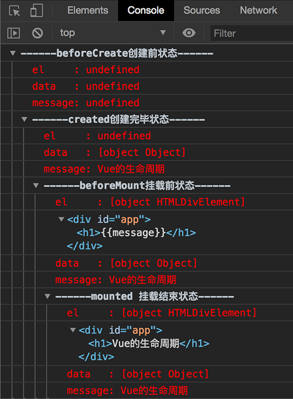

Vue 执行生命周期的函数都是调用定义在 `src/core/instance/lifecycle` 中 callHook 方法：

```
export function callHook(vm: Component, hook: string) {
    // #7573 disable dep collection when invoking lifecycle hooks
    pushTarget()

    const handlers = vm.$options[hook]
    if (handlers) {
        for (let i = 0, j = handlers.length; i < j; i++) {
            try {
                handlers[i].call(vm)
            } catch (e) {
                handleError(e, vm, `${hook} hook`)
            }
        }
    }
    
    if (vm._hasHookEvent) {
        vm.$emit('hook:' + hook)
    }
    
    popTarget()
}
```

callHook 函数逻辑很简单，根据传入的字符串 hook（即生命周期事件名称 “beforeCreate”、“created” 等），拿到 vm.$options[hook] 对应的回调函数数组，然后遍历执行，执行时把 vm 作为函数执行的上下文。

1. beforeCreate & created

   **注意**：Vue 生命周期中只有 beforeCreate 和 created 钩子函数可以在 SSR 中使用，因为服务端没有DOM。

   beforeCreate & created 都是在实例化 Vue 时的  _init 方法中执行，定义在 src/core/instance/init.js 中：

   ```
   Vue.prototype._init = function (options?: Object) {
       // ...
       initLifecycle(vm)
       initEvents(vm)
       initRender(vm)
       callHook(vm, 'beforeCreate')
       initInjections(vm) 	// resolve injections before data/props
       initState(vm)
       initProvide(vm) 	// resolve provide after data/props
       callHook(vm, 'created')
       // ...
   }
   ```

   beforeCreate 和 created 的调用是在 initState 的**前后**，initState 的作用是初始化 props、methods、data、watch、computed 等属性，所以，beforeCreate 函数中不能获取 props、data 中定义的值，也不能调用 methods 中定义的函数；同时，在这两个钩子函数执行的时候，也没有渲染 DOM，所以也不能访问 DOM。

   **一般来说，如果组件加载时需要和后端有交互，放在这两个函数中都可以；但是，如果需要访问 props、data 等数据的话，就需要使用 created 钩子函数**。之后我们会介绍 vue-router 和 vuex 的时候会发现它们都混合了 beforeCreatd 钩子函数。

   因此，测试用例中，beforeCreate 函数拿不到 DOM（this.\$el）和 data（this.​\$data），created 函数可以拿到 data，但是依旧拿不到 DOM。**不过，可以在 created 周期中使用 Vue.nextTick 来等待 DOM 挂载后执行代码**。

   在 created 之后，Vue 会判断对象是否有 el 选项。如果有的话就继续向下编译，如果没有 el 选项，则停止编译，也就意味着停止了生命周期，直到在该 vue 实例上调用 vm.$mount(el) 继续执行生命周期。

   注释掉测试代码中的下面一行：

   ```
   // el: '#app',
   ```

   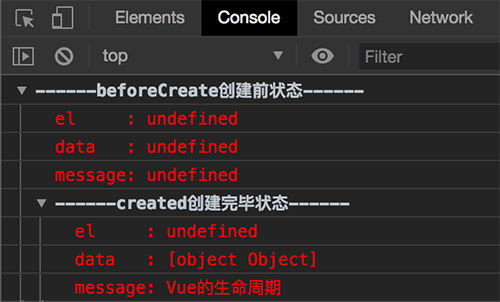

   可以看到 Vue 仅执行了 beforeCreate 和 created 两个生命周期。

   随后，Vue 会判断 template 参数的有无：

   * 有 template 参数，则将其作为模板编译成 render 函数
   * 无 template 参数，则将 el 外部 HTML 作为模板编译

2. beforeMount & mounted

   beforeMount 和 mounted 函数发生在 DOM 挂载**前后**，从最初的测试图可以看出，此时 el 和 data 都有了。

   但是，beforeMount 时只是创建了 el DOM元素，还没有 render，内部还是 {{message}} 占位符，还没有挂载。mounted 时，el 被 render 并挂载。

3. beforeUpdate & updated

   beforeUpdate 和 updated 的钩子函数执行时机是在数据更新的时候。

   在测试代码中，添加下面一行：

   ```
   vm.message = '触发组件更新';
   ```

   可以看到控制台增加了 beforeUpdate 和 updated 状态：

   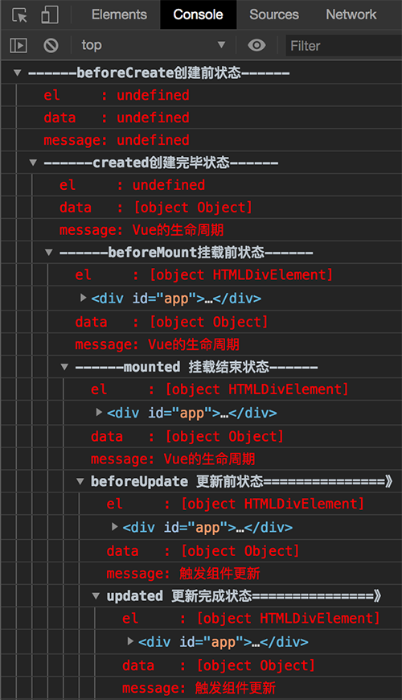

4. beforeDestroy & destroyed

   beforeDestroy 和 destroyed 钩子函数的执行时机在实例销毁前后。销毁时，Vue 实例指示的所有东西都会解绑定，所有的事件监听器会被移除，所有的子实例也会被销毁。

5. activated & deactivated

   activated 和 deactivated 钩子函数在keep-alive 组件激活和停用时调用。

参考：

- https://segmentfault.com/a/1190000011381906
- https://www.cnblogs.com/webbest/p/6722780.html
- https://ustbhuangyi.github.io/vue-analysis/components/lifecycle.html#beforecreate-created

##### initLifecycle

初始化生命周期，挂载相关实例属性

```
vm.$parent = parent          // 父元素
vm.$root = root              // 挂载根元素
vm.$children = []            // 子元素
vm.$refs = {}                // refs
vm._watcher = null
vm._inactive = null
vm._directInactive = false
vm._isMounted = false
vm._isDestroyed = false
vm._isBeingDestroyed = false
```

##### initEvents

初始化事件，挂载相关实例属性

```
vm._events = Object.create(null)
vm._hasHookEvent = false
```

#####  initRender

初始化渲染，挂载相关实例属性

```
vm._vnode = null
vm._staticTrees = null
vm.$slots =
vm.$scopedSlots =
vm._c = () => {}                 // 用于编译器根据模板字符串生成的渲染函数的
vm.$createElement = () => {}     // 编写 render 函数中使用
vm.$attrs =                      // 响应式属性
vm.$listeners =                  // 响应式属性
```

##### initInjections

在组件的选项对象中，除了 Vue 官方推荐的 props、data、methods 等常用属性外，还可以传递 provide 和inject 两个选项，官方文档已经明确告诉我们这两个选项主要是用来辅助测试，不推荐开发中使用。

inject 的执行机制：

* 在每个组件实例上，可以通过 provide 属性注入数据，这些数据被挂载到 vm._provided 上，所以，每个组件实例都存在一个 _provided 属性

  ```
  export function initProvide(vm: Component) {
  		// 组件选项对象中提供 provide，其值可以是函数也可直接是对象
      const provide = vm.$options.provide
      
      if (provide) {
          vm._provided = typeof provide === 'function'
              ? provide.call(vm)	// 是函数时直接在 vm 上执行以得到最终数据
              : provide
      }
  }
  ```

* 如果实例选项中存在 reject 属性时，则循环查询所有祖先组件实例的 _provided 数据，直至查到或者上溯到了根组件实例，最后返回所有属性的查询结果对象。

  ```
  export function initInjections(vm: Component) {
      /**
       * 从所有祖先组件实例中查询 inject 选项需要的数据，例如：
       *     {
       *         inject: ['key1', 'key2']
       *     }
       *     最后返回的 result：
       *     {
       *         key1: undefined,		// 未找到
       *         key2: {
       *             a: 1
       *         }
       *     }
       * */
      const result = resolveInject(vm.$options.inject, vm)
  
      if (result) {
          // 子属性无需监测
          toggleObserving(false)
  
          Object.keys(result).forEach(key => {
              // 将数据属性转变成组件实例 vm 上的响应式数据
              defineReactive(vm, key, result[key])
          })
  
          // 重启深度监测
          toggleObserving(true)
      }
  }
  ```

##### initState

###### initProps

initProps 的基本逻辑同 initData 基本一致，同样会转换为响应式数据被挂载到组件实例身上，主要的区别是：

* props 选项数据不会进行深度监测，只需要将属性本身转变成响应式数据即可！因为 data 数据来自于组件自身，而 props 数据却来自于组件外部，即父组件；如果属性值是对象，其子属性在父组件中就已经转变成响应式数据了，无需重复

###### initMethods

initMethods 的基本逻辑相对非常简单，仅仅是将方法挂在到组件实例上，并同时绑定方法 this 对象到当前组件实例。

```
function initMethods(vm: Component, methods: Object) {
    for (const key in methods) {
        vm[key] = typeof methods[key] !== 'function' ? noop : bind(methods[key], vm)
    }
}
```

###### initData

响应式数据，或者说数据的双向绑定是 Vue 的核心。Vue 响应式数据的基本架构如下图。

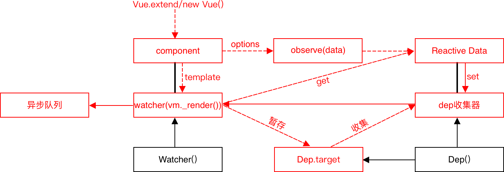

响应式数据的注释：

* 每一个组件都拥有一个自己的观察者 watcher，内部封装了 Vue.prototype._render() 函数
* 每一个响应式数据属性都拥有一个自己的依赖收集器，用以收集依赖该数据的组件的 watcher

响应式数据的三大流程：

* 组件数据的响应化流程

  ```
  component(options) -> observe(data) -> Reactive Data
  ```

  * component 的数据部分，所有的 options.data 属性通过 observe() 中的 Object.defineProperty() 函数转换成访问器属性
  * 在每一个数据属性被 Object.defineProperty()  转换时的闭包空间中，存在一个自己的 dep 收集器

* 组件模板的基本渲染流程

  ```
  component(template) -> watcher(vm._render())(get) -> Reactive Data
  ```

  * component 的模板字符串，通过 Vue compiler 后生成渲染函数 vm._render()
  * 每一个 component 拥有一个自己的观察者 watcher，watcher 中封装了 vm._render()
    * watcher 实例暂存在 Dep.target 属性上
    * watcher 执行 vm.\_render() 函数，并进一个触发 vm._render() 所依赖数据属性的 getter
  * watcher 实例被收集到其所有依赖数据属性的 dep 收集器中

* 响应式数据改变时的重新渲染流程

  ```
  Reactive Data(set) -> dep收集器 -> watcher(vm._render()) -> 异步队列
  ```

  * 当响应式数据被修改时，触发数据属性的 setter 函数

  * 数据属性的 setter 函数会促使 dep 收集器将其收集的所有 watcher 实例推入异步队列 queueWatcher

  * 异步队列会被整体放入 nextTick() 中，即在下一个 tick 时被一次性全部执行；其实在 watcher() 中，渲染函数 vm._render() 是被封装到 vm.\_update() 中的，它在执行时，会首先通过 vnode 的 diff 算法比对找到修改的最少步骤，然后将最小的差异化渲染到页面

    ```
    Vue.prototype._update = function (vnode: VNode, hydrating?: boolean) {
    ...
    		// 如果没有旧的虚拟节点 prevVnode，表示是初次渲染，直接渲染到页面
        if (!prevVnode) {
            // initial render
            vm.$el = vm.__patch__(
                vm.$el, vnode, hydrating, false /* removeOnly */,
                vm.$options._parentElm,
                vm.$options._refElm
            )
            
        // 非初次渲染，数据修改导致需要更新页面时，进行 vnode diff 后将最小的差异化渲染到页面
        } else {
            // updates
            vm.$el = vm.__patch__(prevVnode, vnode)
        }
    ...
    }
    ```

响应式数据的注意事项：

- 每一个拥有 watcher 的属性都是可缓存的，因为只有依赖数据的 setter 被调用时，watcher 才会被推入异步队列执行
- 异步队列中的 watcher 由于在 nextTick() 函数中统一执行，所以执行频率是受限的，这也是 Vue 的节流方式

###### initComputed

Reactive Data 是在 initData 阶段完成转换的，所以下图应该结合 initData 中的图来看。

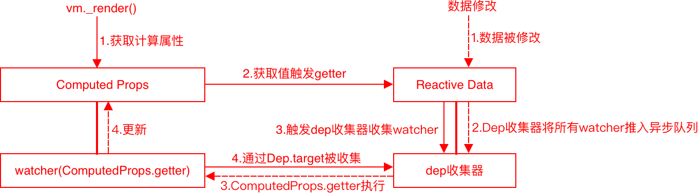

计算属性的流程注释：

* 每个计算属性都拥有一个自己的观察者 watcher，内部封装了计算属性的 getter 函数

* 每一个响应式数据属性都拥有一个自己的依赖收集器，用以收集依赖该数据的计算属性的 watcher

* 计算属性存在两种定义方式

  ```
  computed: {
      prop1() {
          return this.a + this.b
      },
      prop2: {
          get: function () {
              return this.a + 1
          },
          set: function (v) {
              this.a = v - 1
          }
      }
  }
  ```

  最终，每个计算属性都会被定义为组件实例 vm 的静态访问器属性

  ```
  Object.defineProperty(vm, 'computedProp', {
    get() {},
    set() {},
    enumerable: true,
    configurable: true
  })
  ```

  其中，访问器属性的 getter 函数即为开发者定义计算属性函数的简单封装

计算属性的主要流程：

* 初始化流程
  1. 模板编译的 render() 函数执行时，会获取相应的计算属性
  2. 计算属性获取其依赖的响应式数据，从而触发响应式数据的 getter 函数
  3. 响应式数据的 getter 函数触发 Dep 收集器收集 Dep.target 上暂存的计算属性的 watcher
  4. 计算属性 watcher 被收集到 Dep 收集器
* 响应式流程
  1. 基本响应式数据被修改，从而触发响应式数据的 setter 函数
  2. 响应式数据的 setter 函数会触发自己的 Dep 收集器将其所有的 watcher 推入异步执行队列
  3. 异步执行队列在 nextTick() 中被执行，即计算属性被封装到 watcher 的 getter 函数被执行
  4. 计算属性被更新，随后 vnode diff 后，更新后的计算属性被更新到页面

###### initWatch

initWatch 的实现也较为简单，即遍历 watch 对象中的所有属性，然后通过 vm.$watch() 方法为每一个属性添加一个 watcher (vm.\$watch() 方法实现见细节实现中的 Vue.prototype.\$watch)

```
function initWatch(vm: Component, watch: Object) {
    for (const key in watch) {
        const handler = watch[key]
        
        if (Array.isArray(handler)) {
            for (let i = 0; i < handler.length; i++) {
                createWatcher(vm, key, handler[i])
            }
        } else {
            createWatcher(vm, key, handler)
        }
    }
}

function createWatcher(
    vm: Component,
    expOrFn: string | Function,
    handler: any,
    options?: Object
) {
    if (isPlainObject(handler)) {
        options = handler
        handler = handler.handler
    }
    if (typeof handler === 'string') {
        handler = vm[handler]
    }
    return vm.$watch(expOrFn, handler, options)
}
```

##### initProvide

参见 initInjections

#### 细节实现

##### Vue.prototype.$watch

Vue.prototype.$watch 的原理：

1. 通过 Watcher() 构造函数创建一个被观察数据属性的观察者，该观察者临时暂存于 Dep.target
2. 通过 Watcher.prototype.get() 方法获取被观察数据，促使 Dep.target 暂存的观察者被收集到属性的 dep 中
3. 当数据属性发生变化时，观察者被推入观察者异步队列中；随后，通过 nextTick 一次性执行异步队列中的观察者(观察者中封装了回调函数的执行)

```
// core/instance/state.js
Vue.prototype.$watch = function (
    expOrFn: string | Function,
    cb: any,
    options?: Object
): Function {
    const vm: Component = this

    if (isPlainObject(cb)) {
        return createWatcher(vm, expOrFn, cb, options)
    }

    options = options || {}
    options.user = true
    const watcher = new Watcher(vm, expOrFn, cb, options)

    if (options.immediate) {
        try {
            cb.call(vm, watcher.value)
        } catch (error) {
            handleError(error, vm, `callback for immediate watcher "${watcher.expression}"`)
        }
    }
    return function unwatchFn() {
        watcher.teardown()
    }
}

/**
 * core/observer/scheduler.js
 * 将 watcher 推入观察者队列；除非在更新队列时推入，否则将跳过重复 ID 的 watcher
 * 将多次更改方放入异步队列，然后通过 nextTick() 一次性执行以提高性能
 */
export function queueWatcher(watcher: Watcher) {
    const id = watcher.id

    // 队列中是否已经存在当前 watcher 的 id
    if (has[id] == null) {
        has[id] = true

        // 非更新场景下，才将 watcher 推入 queue
        if (!flushing) {
            queue.push(watcher)
        } else {
            // if already flushing, splice the watcher based on its id
            // if already past its id, it will be run next immediately.
            let i = queue.length - 1
            while (i > index && queue[i].id > watcher.id) {
                i--
            }
            queue.splice(i + 1, 0, watcher)
        }


        // queue the flush
        if (!waiting) {
            waiting = true

            if (process.env.NODE_ENV !== 'production' && !config.async) {
                flushSchedulerQueue()
                return
            }

            nextTick(flushSchedulerQueue)
        }
    }
}
```

组件选项中的 watch 选项对象的原理：相对于原型方法，watch 选项由于是一个对象，也就是多了一个 for..in 循环的过程，即为每个对象属性指定的 key 创建一个观察者，紧接着的处理同原型方法就一样了。

```
function initWatch(vm: Component, watch: Object) {
    for (const key in watch) {
        const handler = watch[key]
        if (Array.isArray(handler)) {
            for (let i = 0; i < handler.length; i++) {
                createWatcher(vm, key, handler[i])
            }
        } else {
            createWatcher(vm, key, handler)
        }
    }
}
```

##### Vue.prototype.$nextTick

Vue.prototype.$nextTick 和 Vue.nextTick 的实现是一样的，皆源自于 Vue 内部的 nextTick 函数

```
// core/global-api/index.js
Vue.nextTick = nextTick

// core/instance/render.js
Vue.prototype.$nextTick = function (fn: Function) {
		return nextTick(fn, this)
}

// core/util/next-tick.js
export function nextTick(cb?: Function, ctx?: Object) {
    let _resolve
    
    // 将多个 nextTick 回调放入一个 callbacks 数组
    callbacks.push(() => {
        if (cb) {
            try {
                cb.call(ctx)
            } catch (e) {
                handleError(e, ctx, 'nextTick')
            }
        } else if (_resolve) {
            _resolve(ctx)
        }
    })

    // 调用 $nextTick 方法，pending 将会被设置为 true，表示此时回调队列不为空，正在等待刷新
    if (!pending) {
        pending = true
        
        // 将 callbacks 数组中的所有函数封装到一个函数中，以便放置到同一个微任务中执行
        timerFunc()
    }

    // $flow-disable-line
    if (!cb && typeof Promise !== 'undefined') {
        return new Promise(resolve => {
            _resolve = resolve
        })
    }
}
```

其作用是，在下次 DOM 更新结束之后立即执行延迟回调，在修改数据之后立即使用这个方法，获取更新后的 DOM。应用场景是需要在视图更新之后，基于新的视图进行操作（尽管 Vue 不提倡直接操作 DOM）。

```
// 修改数据
vm.msg = 'Hello'

// DOM 还没有更新
Vue.nextTick(function () {
    // DOM 更新了
});
```

其基本原理是：

* 在异步回调函数中修改数据后，在 JS Event Loop 任务队列中会产生一个 Macrotask，浏览器在每次执行完一个 Macrotask 后会进行一次页面渲染，随后会执行所有 Microtask 队列中的微任务
* Vue 即是尽可能将 nextTick 回调置于 Microtask 队列，以便回调能在最快的时间内获得更新后的 DOM。由于 Microtask 队列是一个很新的概念，存在兼容性问题，如果微任务相关接口在代码环境中都无法实现，Vue 会选择退化到最原始的 setTimeout ，以在下一次 Macrotask 被执行时执行 nextTick 回调

目前，在 2.6.x 版本中，nextTick 使用的方案，优先级从前到后依次是：

```
Promise > MutationObserver > setImmediate > setTimeout
```

###### MutationObserver

> [MDN](https://developer.mozilla.org/zh-CN/docs/Web/API/MutationObserver)

MutationObserver 接口是 DOM3 Events 规范的一部分，它提供了监视 DOM 树变化的能力。该接口的核心就是 MutationObserver 构造函数，它创建并返回一个新的观察者。基本语法：

```
let observer = new MutationObserver(callback);
```

* 参数
  * callback(arr, obj)，一个回调函数，每当被指定的节点或子树以及配置项有 DOM 变动时会被调用
    * arr，描述所有被触发改动的 MutationRecord 对象数组
    * obj，调用该函数的 MutationObserver 对象
* 返回值
  * 一个新的、包含监听 DOM 变化回调函数的 MutationObserver 对象

MutationObserver 对象的原型方法

* mutationObserver.observe()，语法：

  ```
  mutationObserver.observe(target[, options])
  ```

  * target，要被观察变化的 DOM 节点
  * options，可选的对象，描述 DOM节点 的哪些变化应该提供给当前观察者的 callback

需要注意的是：

* MutationObserver 在 iOS> = 9.3.3 中的 UIWebView 中存在问题

```
let targetNode = document.querySelector("#someElement");
let observer = new MutationObserver((mutationList, observer) => {
    mutationList.forEach((mutation) => {
        switch (mutation.type) {
            case 'childList':
                /**
                 * 从树上添加或移除一个或更多的子节点
                 * 参见 mutation.addedNodes 与 mutation.removedNodes
                 * */
                break;
            case 'attributes':
                /**
                 * mutation.target 中某节点的一个属性值被更改
                 * 该属性名称在 mutation.attributeName 中
                 * 该属性之前的值为 mutation.oldValue
                 * */
                break;
        }
    });
});

observer.observe(targetNode, {
    subtree: true,      // 默认为 false，设置为 true 可以观察后代节点
    childList: true,    // 观察目标子节点的变化，添加或者删除
    attributes: true    // 观察属性变动
});
```

###### setImmediate

因为 setTimeout 方法至少有 4ms 的延时，即便设置 setTimeout(fn, 0)。因此，IE 引入 window.setImmediate 用于在 microtask 队列中添加一个任务，以期在更短的时间内执行一个异步操作。

需要注意的是：

* 使用 window.clearImmediate 方法清除 window.setImmediate 回调
* 只有 IE 10+ 和 Edge 支持该方法

参考：

* https://www.zhihu.com/question/55364497/answer/144215284
* https://juejin.im/entry/5aced80b518825482e39441e
* https://segmentfault.com/a/1190000012861862
* https://juejin.im/post/5a6fdb846fb9a01cc0268618

##### computed/methods/watch

通常，基本数据需要经过一定的处理后才能用于直接显示时，这三种方式都可以做到。

- computed方式：

  ```
  <div id="example">
      <p>{{ reversedMessage }}</p>
  </div>
  
  var vm = new Vue({
      el: '#example',
      data: {
          message: 'Hello'
      },
      computed: {
          reversedMessage: function () {
              return this.message.split('').reverse().join('');
          }
      }
  });
  ```

* methods方式：

  ```
  <div id="example">
      <p>{{ reversedMessage() }}</p>
  </div>
  
  var vm = new Vue({
      el: '#example',
      data: {
          message: 'Hello'
      },
      methods: {
          reversedMessage: function () {
              return this.message.split('').reverse().join('');
          }
      }
  });
  ```

* watch方式：

  ```
  <div id="example">
      <p>{{ reversedMessage }}</p>
  </div>
  
  var vm = new Vue({
      el: '#example',
      data: {
          message: 'Hello',
          reversedMessage: ''
      },
      watch: {
          message: function () {
              this.reversedMessage = this.message.split('').reverse().join('');
          }
      }
  });
  ```

三者的区别是：

* computed

  首选方式，主要用于**对同步数据的简单处理**；同时，计算属性是基于它们的依赖进行缓存的，当且仅当相关依赖改变时才会重新求值。是性能最好的方式，尤其是性能开销比较大的计算

  具体实现在 initComputed 过程中，每个计算属性都有一个 watcher，而只有其依赖属性改变，即 setter 函数执行时，dep 收集器中的 watcher 才会被重新执行

* methods

  主要用于**事件触发时进行异步操作的**，被用于计算属性时，每次调用都会重新计算，性能较差

  具体实现在 initMethods 过程中，其实现简单，仅仅是将其方法挂载到组件实例 vm 上

* watch

  主要用于**数据变化时执行异步或开销较大的操作**，它会限制执行操作的频率；并在得到最终结果前，设置中间状态，这些都是计算属性无法做到的

  具体实现在 initWatch 过程中，会为每一个计算属性添加一个 watcher，然后收集到该数据属性的 dep 收集器中，当数据属性改变时，该 watcher 会被推入异步队列，而 watch 正是通过该异步队列达到节流的目的，即限制执行操作频率

#### 组件学习

##### 组件通信

###### 父子组件

父子组件间的通信实现：

* 父组件 -> 子组件，可以使用 props 把数据传给子组件
* 子组件 -> 父组件，可以使用 $emit 触发父组件的自定义事件

```
# 父组件
<template>
    <div>
        <div>父组件的toCity{{toCity}}</div>
        <train-city @showCityName="updateCity" :sendData="toCity"></train-city>
    </div>
<template>
<script>
		import TrainCity from "./train-city";

    export default {
        name: 'index',
        components: {TrainCity},
        data() {
            return {
            		toCity: "北京"
            }
        },
        methods: {
            updateCity(data) {									// 捕获子组件事件回调
                this.toCity = data.cityname;
                console.log('toCity:' + this.toCity)
            }
        }
    }
</script>

# 子组件
<template>
    <div class="train-city">
        <h3>父组件传给子组件的toCity:{{sendData}}</h3>
        <button @click='select("大连")'>点击此处将‘大连’发射给父组件</button>
    </div>
</template>
<script>
    export default {
        name: 'trainCity',
        props: ['sendData'],    // 接收父组件传递的数据
        methods: {
            select(val) {       // 触发 showCityName 事件
                this.$emit('showCityName', {
                    cityname: val
                });
            }
        }
    }
</script>
```

###### 非父子组件

对于非父子组件的场景，通信的方式有两种：

* 全局使用一个空的 Vue 实例作为中央事件总线

  ```
  // 全局定义
  window.BUS = new Vue();
  
  // 触发组件 A 中的事件
  BUS.$emit('eventName', 'params');
  
  // 在组件 B 的钩子中监听事件
  BUS.$on('eventName', function (params) {
      // todo
  });
  ```

* 使用状态管理插件 Vuex

#### 插件学习

##### 插件安装

Vue 中使用 Vue.use() 静态方法实现插件安装

```
/**
 * 插件安装接受两种参数类型
 * 1. 对象，需要包含 install 方法
 * 2. 函数
 * */
Vue.use = function (plugin: Function | Object) {
    // 通过数组保存已安装插件
    const installedPlugins = (this._installedPlugins || (this._installedPlugins = []))

    // 如果插件已经安装，则直接返回 Vue 实例
    if (installedPlugins.indexOf(plugin) > -1) {
        return this
    }

    // 传递给插件的参数，依次是 Vue 实例、安装插件时传递的参数
    const args = toArray(arguments, 1)
    args.unshift(this)
    
    // 插件导出的是一个包含 install 方法的对象时，则调用该 install 方法
    if (typeof plugin.install === 'function') {
        plugin.install.apply(plugin, args)

    // 插件导出的是一个函数，则直接执行该函数
    } else if (typeof plugin === 'function') {
        plugin.apply(null, args)
    }

    // 保存已安装插件
    installedPlugins.push(plugin)
    return this
}
```

##### Vuex

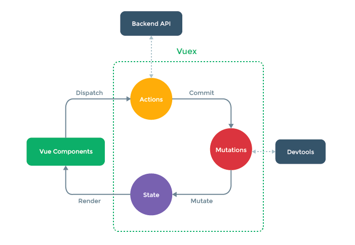

Vuex 是 Vue 进行统一状态管理的库，它借鉴了 Flux、Redux 的基本思想：将共享数据抽离到全局，以一个单例存放，同时利用 Vue 的双向绑定机制来进行高效的状态管理与更新。

Vuex 使用示例：

```
import Vue from 'vue';
import Vuex from 'vuex';
import * as getters from './getters';
import mutations from './mutations';
import actions from './actions';
import state from './state';

// 安装 Vuex
Vue.use(Vuex);

const debug = process.env.NODE_ENV !== 'production';

export default new Vuex.Store({
  actions,
  getters,
  state,
  mutations,
  strict: debug,
  plugins: debug ? [createLogger()] : [],
});

```

Store 构造函数：

```
class Store {
    constructor(state, mutations, modules, plugins, strict) {
        ...

        // 创建一个 Vue 实例，并将 state 挂载到该实例的 data 中，使之成为响应式数据
        this._vm = new Vue({
            data: {
            		$$state: state
            },
            computed
        })

        ...
    }
}
```

基本原理：

* Vuex 中会使用 new Vue() 创建一个新 Vue 实例，设置的数据 state 和计算属性 computed 最终在该实例中转变成响应式数据
* 用 Vuex 中的 vm 实例替换掉主 Vue 实例，因为该替换操作是在 beforeCreate 钩子函数中进行的，也就意味着后续的 initInjection()、initState()、initProvide() 都将在这个 Vuex 插件中创建的 Vue 实例上执行，这也就保证了 Vuex 中设置的所有状态可以响应式的驱动 Vue 中的所有组件了

###### 问题

1. 为什么不直接改变 store 中状态，而要显式地提交 (commit) mutation？

   为了跟踪每一个状态的变化，以便能够实现一些工具更好地了解和调试应用，比如能够做记录变更、保存状态快照、历史回滚/时光旅行的调试工具

   事实上，通过 Vuex 构造函数中的 new Vue() 后，store 中的状态已经是响应式的了，理论上直接通过赋值的方式改变它们依旧可以触发视图的更新，但此时，内部状态的改变只有 JS 引擎知道。要想让外界知道这些变化，就必须收集变化，收集变化的方式有：

   * 直接在 Vue 构造函数初始化时，将数据转变为响应性数据的 Object.defineProperty() 方法的 setter 函数中收集
   * 类似 Vuex 中，直接约定一个 mutation() 方法，在状态改变时手动收集，类似于响应式数据中的手动触发绑定

2. 为什么要设计一个同步的 mutation() 方法，或者说为什么 mutation() 方法必需是同步的？

   因为创造 mutation() 方法的目的是为了收集变化，既然是变化，就需要同时捕捉改变前后的状态。如果是异步函数，mutatio() 触发的时候，回调函数还没有被调用。等到回调执行的时候，执行上下文又已经跑掉了。

###### 参考

* https://zhuanlan.zhihu.com/p/53599723
* https://www.cnblogs.com/axl234/p/7753081.html
* https://tech.meituan.com/2017/04/27/vuex-code-analysis.html

##### Vue-router

###### 机制

从 Vue-router 具体使用实例开始

```
# app 模板
<div id="app">
    <h1>Hello App!</h1>
    <p>
        <!-- 使用 router-link 组件来导航. -->
        <!-- 通过传入 `to` 属性指定链接. -->
        <!-- <router-link> 默认会被渲染成一个 `<a>` 标签 -->
        <router-link to="/foo">Go to Foo</router-link>
        <router-link to="/bar">Go to Bar</router-link>
    </p>
    <!-- 路由出口 -->
    <!-- 路由匹配到的组件将渲染在这里 -->
    <router-view></router-view>
</div>

# 应用初始化
import Vue from 'vue'
import VueRouter from 'vue-router'
import App from './App'

// 安装 Vue-router 插件
Vue.use(VueRouter)

// 定义组件，可以从其他文件 import 进来
const Foo = {template: '<div>foo</div>'}
const Bar = {template: '<div>bar</div>'}

// 定义路由组件映射
const routes = [
    {path: '/foo', component: Foo},
    {path: '/bar', component: Bar}
]

// 使用路由组件映射初始化 VueRouter 实例
const router = new VueRouter({
    routes // （缩写）相当于 routes: routes
})

// 创建和挂载根 Vue 实例
const app = new Vue({
    el: '#app',
    render(h) {
        return h(App)
    },
    router
})
```

1. 安装 Vue-router 插件

   通过 src/install.js 中的 install() 函数安装插件，核心代码如下，其主要功能：

   * 将 beforeCreate 和 destroyed 钩子函数混入 Vue 实例的 vm.$options 对象中，以便在 Vue 实例初始化的相应阶段执行
   * 定义全局组件 \<router-view> 和 \<router-link>，以便可直接使用这两个组件，这两个组件会走 new Vue() 流程被渲染并挂载

   ```
   export function install(Vue) {
   		...
   
       // 将 beforeCreate 和 destroyed 钩子函数混入 Vue 实例的 vm.$options 对象
       Vue.mixin({
           beforeCreate() {
               if (isDef(this.$options.router)) {
                   // 路由组件根组件
                   this._routerRoot = this
   
                   // 路由组件实例
                   this._router = this.$options.router
   
                   // 初始化实例
                   this._router.init(this)
                   
                   /**
                    * 通过 defineReactive() 方法的 Object.defineProperty() 将 _route
                    * 转化为响应式数据，拥有自己的 dep 收集器用于收集 router-view 组件 watcher
                    */
                   Vue.util.defineReactive(this, '_route', this._router.history.current)
               } else {
                   this._routerRoot = (this.$parent && this.$parent._routerRoot) || this
               }
   
               registerInstance(this, this)
           },
           destroyed() {
               registerInstance(this)
           }
       })
   
       ...
   
       // 定义全局组件 RouterView 和 RouterLink
       Vue.component('RouterView', View)
       Vue.component('RouterLink', Link)
   
       ...
   }
   ```

2. 初始化 VueRouter 实例

   VueRouter 实例初始化在 src/index.js 中进行，核心代码如下，其主要功能：

   * 创建路由路径 path 到具体组件的映射
   * 根据选择的路由模式，例如 hash、HTML5 history API 等，初始化相应实例

   ```
   export default class VueRouter {
       constructor(options: RouterOptions = {}) {
           this.app = null		// 根 Vue 实例
           this.apps = []		// 使用该路由组件的所有 Vue 实例
   
           // 路由匹配器
           this.matcher = createMatcher(options.routes || [], this)
   
           // 根据开发者配置，使用相应的路由模式，默认为 hash 模式
           let mode = options.mode || 'hash'
           switch (mode) {
               case 'history':
                   this.history = new HTML5History(this, options.base)
                   break
               case 'hash':
                   this.history = new HashHistory(this, options.base, this.fallback)
                   break
               case 'abstract':
                   this.history = new AbstractHistory(this, options.base)
                   break
               default:
                   if (process.env.NODE_ENV !== 'production') {
                       assert(false, `invalid mode: ${mode}`)
                   }
           }
       }
   }
   ```

3. 创建和挂载根 Vue 实例

   初始化 Vue 实例时，步骤 1. 中安装时挂载的钩子函数将会在相应事件中执行。其中，beforeCreate() 钩子函数的主要功能：

   * 执行路由 init() 方法，主要监听路由变化，比如使用 hash 方式时监听 hashChange 事件；当路由发生变化时，通过设置 _route  触发 _route 属性 dep 收集器中的 watcher 执行，以重新渲染页面

     ```
     export default class VueRouter {
         init(app: any /* Vue component instance */) {
             ...
     
     				// 监听路由变化
             history.listen(route => {
                 this.apps.forEach((app) => {
                     app._route = route
                 })
             })
         }
     }
     ```

   * 将 _route 属性转变成响应性数据，拥有自己的 dep 收集器用于收集 router-view 组件 watcher

#### 其它问题

##### key 值的作用

在 Vue v-for 指令中，使用 key 值与否带来的后果：

* 不使用 key 值，和 key 值使用索引 index 结果一致
  * 就地复用，即便数据项的顺序改变，Vue 也不会移动 DOM 元素来匹配数据项的顺序
  * 性能高效，对于已渲染数据项 DOM 元素的复用，避免了这些数据项的重新创建或移动
* 使用 key 值
  * 数据一致，Vue 会重用但会重排 DOM 元素顺序，以匹配数据的属性与结构
  * 性能较差，Vue 会重排 DOM 元素顺序，带来性能损耗

#### SSR & Prerendering

SSR，Server Side Rendering，服务端渲染，应用在用户请求时，由服务端将页面内容即时编译成 HTML 字符串，直接发送给浏览器显示。

Prerendering，预渲染，应用在发布时，将页面以某种方式，比如使用无头浏览器，提前编译成静态 HTML 文件供用户请求。

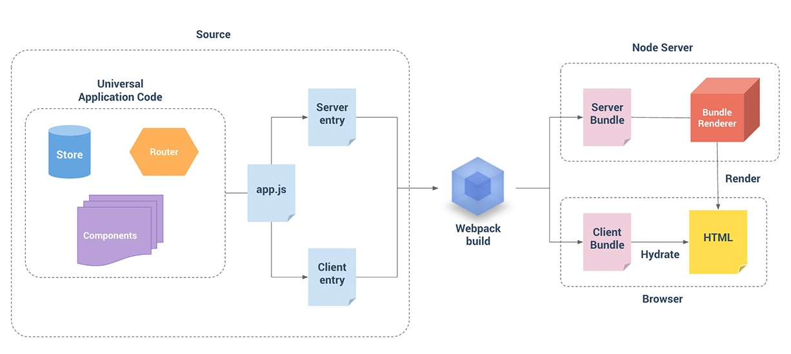

SSR & Prerendering 的相同点：

* 更好的 SEO
* 更快的首屏渲染速度

SSR & Prerendering 不同点：

* 实现原理和方案不同

  * SSR 是用户请求时即时编译，在 Vue 中是启动 Node.js 服务器，通过 vue-server-renderer 插件的 renderToString() 方法，将 Vue 实例转换为字符串插入到 html 文件。

    SSR 存在的问题：

    * 开发受限。例如，Vue 中特定代码只能在某些生命周期钩子函数 (beforeCreate) 中使用；一些外部扩展库可能需要特殊处理，才能在服务器渲染应用程序中运行
    * 构建和部署的复杂度增加。例如，与可以部署在任何静态文件服务器上的完全静态应用程序不同，服务器渲染的 Vue，需要处于 Node.js server 运行环境。
    * 服务器负载增加。服务端需要实时页面渲染，显然会比仅仅提供静态文件的 server 更加大量占用 CPU 资源

  * Prerendering 是应用发布时编译，在 Vue 中是启动无头浏览器（没有界面的浏览器），加载应用程序的路由，并将结果保存到静态 HTML 文件

* 适用场景不同

  * SSR，服务端实时编译，适合需要接口数据的动态页面
  * Prerendering，发布时针对特定路由构建静态 HTML 文件，适合不依赖动态数据的页面，比如关于我们、版权页等

##### 参考

* https://my.oschina.net/jamesview/blog/1800841


