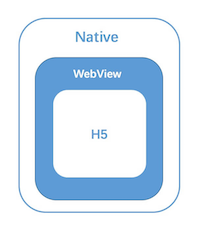
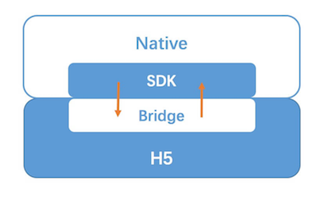
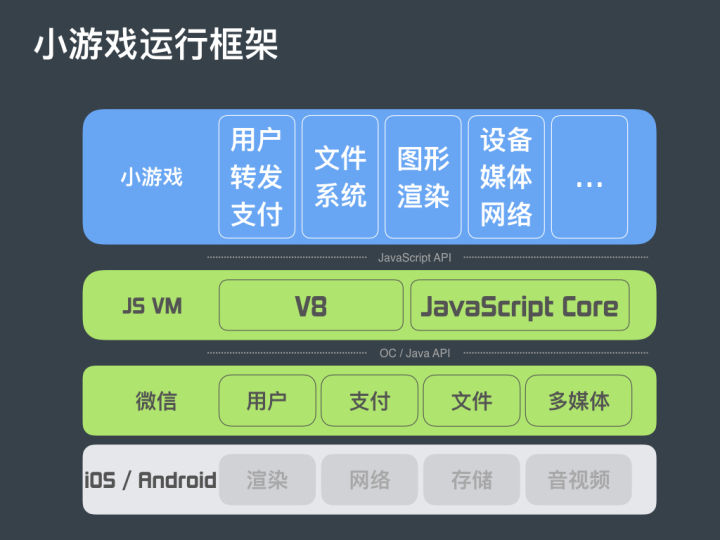
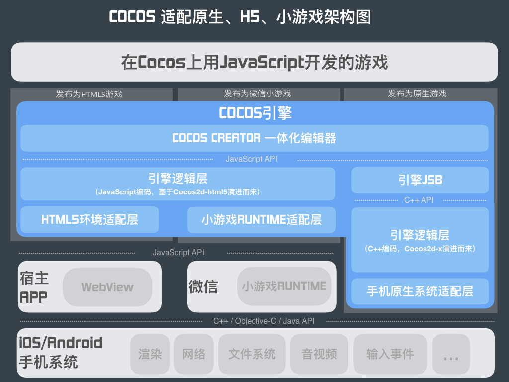

## Hybrid App

Hybrid App，混合应用，即混合 Native 与 Web 技术开发的移动应用。基于 UI 渲染机制的不同，可以分为两类：

* 基于 WebView UI 的基础方案，通过 JSBridge 完成 H5 与 Native 的双向通讯，从而赋予 H5 一定程度的原生能力，例如微信 JS-SDK、小程序等

  ```
  const {desc, link, title, imgUrl} = data;
  
  wx.config({
      appId: config.appId,
      debug: false
  });
  
  wx.ready(() => {
      wx.onMenuShareAppMessage({
          desc,
          link,
          title,
          imgUrl
      });
  });
  ```

* 基于 Native UI 的方案，在赋予 H5 原生 API 能力的同时，进一步通过 JSBridge 将 js 解析成的虚拟 DOM 树传递到 Native 并使用原生渲染，例如 React-Native、Weex

无论哪种方案，都是基于 JSBridge 完成的通讯。因此，JSBridge 也是整个混合应用最关键的部分。

### 技术原理

Hybrid App 的本质是在原生 App 中，使用 WebView 作为容器直接承载 Web 页面。因此，核心内容就是 Native 与 H5 之间的双向通讯，即需要一套跨语言的通讯方案，来完成 Native(Java/Objective-c/...)  与 JS 的通讯。这个方案就 JSBridge，而实现的关键便是作为容器的 WebView，一切的原理都是基于 WebView 的机制。



##### JavaScript 通知 Native

基于 WebView 的机制和开放的 API，常见实现方案有 3 种：

* API 注入，原理是 Native 获取 JS 环境上下文，并在上面挂载对象/方法，使 js 可以直接调用，Android 与 IOS 拥有各自的挂载方式

* WebView 中的 prompt/console/alert 拦截，通常使用 prompt，因为这个方法在前端中使用频率低，出现冲突概率低
* WebView URL Scheme 跳转拦截

第二三种机制的原理是类似的，都是通过对 WebView 信息冒泡传递的拦截，从而达到通讯的目的。

接下来从实现原理、协议定制、协议拦截、回调机制和参数传递 5 个方面阐述第三种方案。

###### 实现原理
WebView 中发出的网络请求，客户端都能进行监听和捕获

###### 协议定制

需要制定一套 URL Scheme 规则。例如：

```
command://className:callbackMethod/methodName?param=jsonObj
```

其中：

* command：Native 注册的协议头，不同协议头代表不同的含义
* className：Native 的类名称
* methodName：类下的具体方法
* callbackMethod：回调函数，Native 完成异步操作后调用
* param：传递参数

这里有几个需要注意点的是:

* `command://` 只是一种规则，可以根据业务进行制定，使其具有含义，例如：

  ```
  wdapp://a.jpg.webp
  ```

* **请求 URL 不要使用 location.href 发送，因为同时并发多次请求时 location.href 会被合并为一次，导致其它协议被忽略，而并发协议其实是非常常见的功能。通常，使用创建 iframe 发送请求**
* 考虑到安全性，通常需要在客户端中设置域名白名单或者限制，避免公司内部业务协议被第三方直接调用

###### 协议拦截

客户端可以通过 API 对 WebView 发出的请求进行拦截：

* IOS：shouldStartLoadWithRequest
* Android：shouldOverrideUrlLoading

当解析到请求 URL 头为定制协议时，不发起对应的资源请求，只是解析参数，并进行相关功能或者方法的调用，完成协议功能的映射。

###### 协议回调

协议的本质其实是发送请求，这是一个异步的过程，因此需要有对应的回调机制。通常的回调方式有：

* 回调函数
* 事件绑定

事件绑定可以使用 window.addEventListener 和 window.dispatchEvent

* 发送协议时，通过协议的唯一标识注册自定义事件，并将回调绑定到对应的事件上
* 客户端完成对应的功能后，调用 Bridge 的 dispatch API，直接携带 data 触发该协议的自定义事件

```
// 业务调用API
Bridge.getNetwork(data => {});

// Bridge层功能：生成唯一标识handler，注册自定义事件，拼接并发送协议
const handler = handler_0;
const callback = () => {};
window.addEventListener(`getNetwork_${handler}`, callback, false);
Bridge.send(`command://getNetwork?handler=${handler}`);

// Native完成异步操作后，触发事件
event.data = {};
window.dispatchEvent(event);
```


事件机制会让开发更符合前端习惯，例如，当需要监听客户端的通知时，同样只需要通过 addEventListener 进行监听即可。

**Tips**：应避免事件的重复绑定，当唯一标识重置时，需要 removeEventListener 对应的事件。

###### 参数传递

WebView 对 URL 有长度限制，因此，通过 URL search 参数进行传递有一个问题：当传递参数过长时，可能会被截断，例如，传递 base64 或者传递大量数据时。

所以，需要制定新的参数传递规则，我们使用的是函数调用的方式。这里的原理主要是基于 Native 可以直接调用 JS 方法并直接获取函数的返回值。

我们只需要对每条协议标记一个唯一标识，并把参数存入参数池中，到时客户端再通过该唯一标识从参数池中获取对应的参数即可。

##### Native 通知 Javascript

由于 Native 可以算作 H5 的宿主，因此拥有更大的权限，上面也提到了 Native 可以通过 WebView API 直接执行 JS 代码。通常，比较简单的方式是将方法注册在全局上下文 window 上，Native 直接调用 window 上的方法。

* IOS: stringByEvaluatingJavaScriptFromString

  ```
  // Swift
  webview.stringByEvaluatingJavaScriptFromString("alert('NativeCall')")
  ```

* Android: loadUrl (4.4-)

  ```
  // 调用js中的JSBridge.trigger方法
  // 该方法的弊端是无法获取函数返回值；
  webView.loadUrl("javascript:JSBridge.trigger('NativeCall')")
  ```

  **Tips**: 当系统低于 4.4 时，evaluateJavascript 是无法使用的，因此单纯的使用 loadUrl 无法获取 JS 返回值，这时我们需要使用前面提到的 prompt 的方法进行兼容，让 H5端 通过 prompt 进行数据的发送，客户端进行拦截并获取数据。

* Android: evaluateJavascript (4.4+)

  ```
  // 4.4+后使用该方法便可调用并获取函数返回值；
  mWebView.evaluateJavascript（"javascript:JSBridge.trigger('NativeCall')", 	 new ValueCallback<String>() {
      @Override
      public void onReceiveValue(String value) {
          //此处为 js 返回的结果
      }
  });
  ```

##### 参考

* https://github.com/xd-tayde/blog

### 技术实施

基于上面的原理，我们已经明白 JSBridge 最基础的原理，并且能实现 Native 与 H5 的双向通讯机制。



##### JSBridge 的接入

接下来，我们来理下代码上需要的资源。实现这套方案，从上图可以看出，其实可以分为两个部分:

* JS 部分(bridge)：JS 环境中注入 bridge 的实现代码，包含了协议的拼装/发送/参数池/回调池等一些基础功能
* Native 部分(SDK)：客户端中 bridge 功能的映射代码，实现 URL拦截解析/环境信息注入/通用功能映射等功能

我们这里的做法是，将这两部分一起封装成一个 Native SDK，由客户端统一引入。客户端在初始化一个 WebView 打开页面时，如果页面地址在白名单中，会直接在 HTML 的头部注入对应的 bridge.js。这种做法的优点：

* 双方的代码统一维护，避免出现版本分裂的情况。有更新时，只要由客户端更新 SDK 即可，不会出现版本兼容的问题
* App 的接入十分方便，只需要按文档接入最新版本的 SDK，即可直接运行整套 Hybrid 方案，便于在多个 App 中快速的落地
* H5 端无需关注，这样有利于将 bridge 开放给第三方页面使用

**Tips**：协议的调用，一定在 bridge.js 成功注入后。由于客户端的注入行为属于一个附加的异步行为，从 H5 方很难去捕捉准确的完成时机，因此，这里需要通过客户端监听页面完成后，基于上面的事件回调机制通知 H5 端，页面中即可通过 window.addEventListener('bridgeReady', e => {}) 进行初始化。

##### App中 H5 的接入方式

将 H5 接入 App 中通常有两种方式，两种方式各有优劣，应根据不同场景进行选择：

* 在线 H5，只需将 H5 代码部署到服务器，WebView 打开相应 URL，即可嵌入。该方式的好处在于：

  * 独立性强，有非常独立的开发/调试/更新/上线能力
  * 资源放在服务器上，完全不会影响客户端的包体积
  * 接入成本很低，完全的热更新机制

  这种方式的缺点在于：

  * 完全的网络依赖，在离线的情况下无法打开页面
  * 首屏加载速度依赖于网络，网络较慢时，首屏加载也较慢

  通常，这种方式更适用在一些比较轻量级的页面上，例如一些帮助页、提示页、使用攻略等页面。这些页面的特点是功能性不强，不太需要复杂的功能协议，且不需要离线使用。在一些第三方页面接入上，也会使用这种方式，例如，我们的页面调用微信 JS-SDK。

* 内置包 H5，一种本地嵌入方式，需要将代码打包下发到客户端，并由客户端直接解压到本地储存。通常我们运用在一些比较大和比较重要的模块上。其优点是：

  * 由于其本地化，首屏加载速度快，用户体验更为接近原生
  * 可以不依赖网络，离线运行

  这种方式的缺点在于：

  * 开发流程/更新机制复杂化，需要客户端，甚至服务端的共同协作
  * 会相应的增加 App 包体积

### Weex

##### 架构原理


首先，开发者首先可在本地像编写 web 页面一样编写一个 app 的界面，随后通过命令行工具将之编译成一段 JavaScript 代码，生成一个 Weex 的供三端使用的 JS bundle（上图中JavaScript Runtime）

然后，在三端环境中解析执行这个 JS bundle：

- 在浏览器中，直接使用浏览器自带的 JavaScript 引擎解析执行 JS bundle
- 在 APP 中，需要集成 Weex SDK 提前为 JS bundle 准备好执行环境；当打开一个 Weex 页面时，在这个执行环境中解析执行 JS bundle，并将执行过程中产生的各种命令通过 JSbridge 发送到 native 端，以实现界面渲染、数据存储、网络通信、调用设备以及同用户交互等功能

> WeexSDK包括：
>
> - JS Framework - JSBundle 的执行环境
> - JS-Native Bridge - 中间件或者叫通讯桥梁，也叫 Weex Runtime
> - Native Render Engine - 解析 js 端发出的指令进行原生控件布局渲染

**需要注意的是：**

- 为了保证 Weex 的稳定性和一致性，Weex SDK 在 IOS 和 Android 中使用[相同的JS引擎](https://weex.apache.org/cn/wiki/) - JavaScriptCore
- Weex SDK 对 Vue 2.x 做了预置，所以打包 JS bundle 无需包含Vue

> Weex 选择 Vue 2.x 是因为该版本的 Vue 加入了 Virtual-DOM 和预编译器的设计，使得该框架在运行时能够脱离 HTML 和 CSS 解析，只依赖 JavaScript，如此，便使 Weex 获得了使用 JS 预编译原生组件 UI 的能力。

##### 基本特性

为了保证在三端实现的一致性，Weex 不能使用所有的纯前端/Vue 技术，必须舍弃一些东西：

- HTML 相关
  - html 标签并非多端通用，所以在 Weex 中需要使用组件的方式来实现
- CSS 相关
  - 移动应用中的样式是由原生渲染器解析的，出于解析性能和功能复杂度的考虑：
    - 只支持单个类名选择器
    - 组件级别的作用域
    - 支持基本的盒模型和 flexbox 布局
  - 移动应用中不支持 display 属性，需用 v-if 代替或 `opacity:0;` 来模拟；需要注意的是，opacity ≤ 0.01 时，native 控件便会消失，占位空间还在，但用户无法进行交互操作，点击时会发生点透效果
  - 对 css3 支持不够，比如，transform只支持 2D，动画需要辅以 animation 内建模块完成
- JS相关
  - 移动应用没有 BOM，所以，H5 中调用 BOM 的 API 统一需要使用 Weex 的内置模块来实现。比如：
    - Ajax 使用 stream 模块
    - 操作 DOM 使用功能有限的 dom 模块
    - 弹窗类 API 使用 modal 模块
    - 导航类 API 使用 navigator 模块
    - 本地存储使用 storage 模块
    - 双向通信使用 webSocket 模块
    - ...
  - 移动应用没有 DOM，所以，Weex 只能通过 Vue 的虚拟 DOM 翻译得到 H5 DOM 和移动应用原生布局树
  - 支持有限的事件

##### 技术总结

并非所有的 Web 技术都是三端通用的，为了实现“一次编码，三端运行”的目的，Weex 只能尽力找出三端实现的交集，换句话说，Weex 核心实现只是 Web 技术的子集，Weex 开发即是利用这个子集完成自己的需求。同时，也正是因为 Weex 能实现的仅仅是三端的子集，所以无法媲美三端技术单独开发获得的体验上的丰富度。

总之，Weex 暂时不适合用来实现一个完整的 APP 应用，只适合用来实现 APP 内部分弱用户交互性的页面。

##### 参考

* https://weex.apache.org/cn/guide/
* https://segmentfault.com/a/1190000011027225

### 微信小程序

* https://cloud.tencent.com/developer/article/1029663
* https://www.jianshu.com/p/4e8ed26d3b7a

### 微信小游戏

微信小游戏是微信基于小程序平台，提供了一套用于小游戏开发的 API。

#### 架构

小游戏的架构大概可以分为两层：

* 小游戏 API 及以下的部分

  

  从上到下依次为：

  * 小游戏 wx API 层

    小游戏对底层功能进行封装，提供给开发者直接用于游戏开发的 API，比如：

    * wx.createCanvas()，用于创建 Canvas 画布
    * wx.createImage()，用于创建图像对象

  * JS 虚拟机层

    使用 JS 语言开发的小游戏需要运行的虚拟机环境，IOS 使用 JavaScript Core，Android 使用 V8

  * 微信 Native 层

    小游戏需要的底层能力，由微信 Native 层提供，而微信 Native 使用 Object-c(IOS)/Java(Android) 开发，JS 与 Object-c/Java 跨语言的通信可以通过 JSBridge 实现

  * 系统层

    提供基础的系统能力，比如 2D、3D 绘图，网络，存储，音视频等

* 游戏引擎相关的部分

  目前主流的游戏引擎，比如 Cocos、Egret 等，都具备跨平台的能力，一次开发可以同时运行在浏览器、微信小游戏、Native 环境。但是，由于不同环境基本的视图渲染以及获取底层能力的 API 不一致，通常针对每层环境都需要一个适配层，以 Cocos 为例，通过 Cocos 编辑器编辑的游戏通过三个适配层

  * HTML5 环境适配层
  * 小游戏 Runtime 适配层
  * 手机原生系统适配层

  生成出用于不同环境的代码包。

  

  在小游戏中，官方也提供了基于适配器模式的 Adapter 参考，通过将 wx API 包装成浏览器 BOM 环境同名 API 的形式，可以使一套代码同时运行在 HTML5 和小程序两种环境中。例如：

  ```
  const document = {
      createElement(tagName) {
          tagName = tagName.toLowerCase()
          if (tagName === 'canvas') {
              return wx.createCanvas()
          } else if (tagName === 'image') {
              return wx.createImage()
          }
      }
  }
  ```

  

#### 优化

小游戏的优化建议：

* GC 优化，在游戏开始及结束时调用 wx.triggerGC() 方法主动触发垃圾回收机制
* 使用 Worker，通过使用 Worker 降低 JS 主线程负担，保证渲染帧率
* setData 次数限制，避免频繁调用 setData 导致渲染过频，内存占用上升及性能下降
* 图片优化，小游戏基本都是图片，限制图片尺寸和压缩图片很重要
* requestAnimationFrame，使用高性能的 requestAnimationFrame 保证渲染帧率


#### 参考

* https://developers.weixin.qq.com/minigame/dev/
* https://forum.cocos.com/t/faq/54842
* https://zhuanlan.zhihu.com/p/32826363
* https://juejin.im/post/5ad4952851882555677f07a0
* https://juejin.im/post/5ba3a3c05188255c8138eea4


