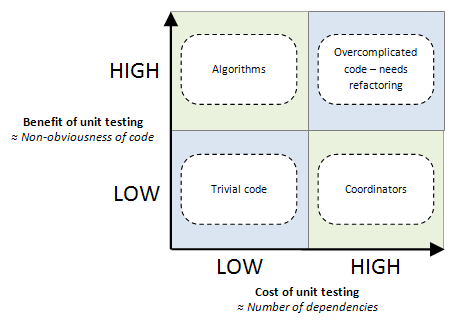

## 开发模式

常见开发模式有：TDD、BDD 和 ATDD

#### TDD

Test Drive Development，测试驱动开发，即从测试的角度来检验整个项目。

TDD 的基本流程：

* 针对每个功能点抽象出接口代码
* 编写单元测试代码
* 实现接口，运行单元测试代码，循环此过程，直到整个单元测试都通过，这一点和敏捷开发有类似之处

TDD 要求测试先于功能代码编写。测试用例不仅是对代码的验证，更是对代码的规范与约束，确保在开发以及未来进行修改时，能够很大程度上保证模块行为的正确性。

#### BDD

Behavior Drive Development，行为驱动开发。

BDD 可以看作是对 TDD 的一种补充，因为在 TDD 中，并不能保证根据设计所编写的测试就是用户所期望的功能。与 TDD 关注功能抽象不同，BDD 更关注程序行为，也就是程序应该如何运行。

#### ATDD

> acceptance n. 验收, 接受

Acceptance Test Drive Development，验收测试驱动开发，一种在编码之前将用户带入测试设计过程的技术。

ATDD 是一种协作实践，用户、测试和开发人员定义自动验收标准，如果系统未通过测试可提供快速反馈，说明未满足要求。

#### 参考

* https://www.cnblogs.com/ustbwuyi/archive/2012/10/26/2741223.html
* https://www.zhihu.com/question/20161970
* https://www.infoq.cn/article/virtual-panel-tdd-bdd

## 测试实践

开发模式偏重于理论，Unit 测试和 E2E 测试则是这些理论的具体实践方式。尽管从前端程序的角度，Unit 测试像TDD 模式的实践，E2E 测试像 BDD 模式的实践，但是需要明确的是，它们之间并没有确定的映射关系。TDD 和 BDD 都可以同时囊括 Unit 测试和 E2E 测试。

#### 单元测试

Unit Testing，单元测试，又称模块测试，是针对程序单元（软件设计的最小单位）进行正确性检验的测试工作。其中，程序单元是应用的最小可测部件。对于过程化编程，一个单元就是单个程序、函数、过程等；对于面向对象编程，最小单元就是方法，包括超类、抽象类、或子类中的方法。

```
const compare = (a,b) => a > b ? a : b

// 对这个函数进行测试
expect(compare(1,2)).to.equal(2)	// ok
expect(compare(2,1)).to.equal(1)	// ok
```

##### 理论基础

###### Why 需要单元测试

* 可以单独地测试每个单元
* 可以用于验证重构后的代码
* 可以用来确保不会破坏其他人的代码
* 可以用来提高系统设计，比如说，不能单元测试的代码将不会出现

###### When 进行单元测试

单元测试需要衡量投入和产出的比，需要控制测试的粒度以动态调整投入和产出。业界使用行覆盖率（line coverage）和分支覆盖率 (branch coverage) 来作为单元测试的测量。但是，高覆盖率不见得代码缺陷就少。



如果，以投入和产出作为是否进行单元测试标准的话，不言而喻，投入少产出高的单元测试是最理想的状况。具体实践中，往往需要基于代码的复杂度和对外依赖度两个方面决定是否进行单元测试，具体场景是：

* 代码很复杂但对外依赖少（左上）：最适合单元测试，因为耗费较少和收益较多。一般来说，某种算法（排序）、核心业务规则、数据解析类似的模块属于这样的代码
* 代码很复杂且对外依赖也多（右上）：过于复杂的代码，需要重构
* 对外依赖少的琐碎代码（左下）：可测可不测，因为重要性复杂度都不高，单元测试的意义不大

* 对外依赖多的琐碎代码（右下）：不适用于单元测试，这些代码主要用于多个代码单元的集成和交互，需测场景多，测试耗费高，收益却不大

###### 单元测试的最佳实践

1. 单元测试之间应该完全独立的

   每次只测一个代码单元，避免不必要的前提条件

2. 单元测试应该运行得很快

   单元测试需要运行得很快，这样程序员才愿意经常运行单元测试。这就意味着：

   * 单元测试不要访问数据库
   * 单元测试不要访问网络
   * 外部依赖需要被模拟（mock）

3. 给单元测试一个清晰和一致的命名

   一个单元测试的名字应该包含 3 项内容：待测对象\_待测案例\_期望结果，比如说：

   ```
   ProductPurchaseAction_IfStockIsZero_RendersOutOfStockView()
   ```
   
4. 只对核心代码进行单元测试

   比如说主要业务对象

5. 要有好的的项目及交互设计

   好的单元测试来源于好的设计，设计不好，代码不会好，单元测试也不会好

##### 测试框架

###### Karma

Karma 是一个 JS Runner，为 JS 执行提供完整的服务器 + 浏览器运行环境。其基本原理是：

* 在 Server 运行一个 Web Server 服务器，并生成供浏览器访问的包含 js 测试框架文件（比如 Mocha），以及 js 测试文件在内的基本文件；
* 通过相应的 Launcher 启动浏览器访问 Web Server 生成文件，以显示 js 在特定浏览器中的运行结果
* 同时，通过 File System Watcher 监控 js 测试文件变化，在变化发生时，通过 Socket 将变化 js 文件传递给浏览器重新执行

Karma 只提供基础运行环境，与 Js 测试框架、断言库并不耦合，而 Mocha 和 Chai 本身都可以不依赖 Karma 环境独立运行，所以要让 Mocha 和 Chai 在 Karma 环境中使用，还需要一个相应的适配器，例如：karma-mocha 和 karma-chai

###### Mocha

Mocha 是一个 JS 测试框架，在浏览器和 Node 环境都可以使用。Mocha 同时支持 TDD 和 BDD 两种测试接口模式，默认是 BDD 模式运行。其基本使用：

```
// add.js js文件
function add(x, y) {
  return x + y;
}

module.exports = add;

// add.test.js js测试文件
var add = require('./add.js');
var expect = require('chai').expect;

describe('加法函数的测试', function() {
    it('1 加 1 应该等于 2', function() {
    	expect(add(1, 1)).to.be.equal(2);
    });
});
```

其中，测试文件中的 describe 和 it 方法就是 Mocha 提供的：

* describe 块称为"测试套件"（test suite），表示一组相关的测试。它是一个函数，第一个参数是测试套件的名称（"加法函数的测试"），第二个参数是一个实际执行的函数。
* it 块称为"测试用例"（test case），表示一个单独的测试，是测试的最小单位。它也是一个函数，第一个参数是测试用例的名称（"1 加 1 应该等于 2"），第二个参数是一个实际执行的函数。

测试脚本里面应该包括一个或多个 describe 块，每个 describe 块应该包括一个或多个 it 块。

###### Chai

Chai 是用于 Node 和浏览器的 TDD/BDD 断言库，可以与任何 JS 测试框架配对，类似于 Node 的内置断言。

在代码中导入库，然后选择您要使用的样式 - assert，expect或should：

```
var chai = require('chai');  
var assert = chai.assert;    // Using Assert style
var expect = chai.expect;    // Using Expect style
var should = chai.should();  // Using Should style
```

Pre-Native Modules用法（全局注册 chai 测试样式）：

```
require('chai/register-assert');  // Using Assert style
require('chai/register-expect');  // Using Expect style
require('chai/register-should');  // Using Should style
```

Pre-Native Modules用法（作为本地变量）：

```
const { assert } = require('chai');  // Using Assert style
const { expect } = require('chai');  // Using Expect style
const { should } = require('chai');  // Using Should style
should();  							 // Modifies `Object.prototype`

// Creates local variables `expect` and `use`; useful for plugin use
const { expect, use } = require('chai');  
```

###### 参考

* https://www.jianshu.com/p/66d829aeda4c
* https://segmentfault.com/a/1190000015734861
* http://www.ruanyifeng.com/blog/2015/12/a-mocha-tutorial-of-examples.html

##### 存在问题

单元测试只能发现待测单元，通常是函数内部的缺陷，不能发现单元交互（集成）之间的缺陷以及用户实际访问页面时的行为，这些测试通常就需要集成测试和 E2E 测试来完成。

#### 集成测试

> integration n. 集成, 综合

集成测试，Integration Testing，针对产品的某个功能的测试。

集成测试和 E2E 测试都可以是功能测试，但是两者的关注度不一样：

* 集成测试可以是功能测试，也可以是白盒测试，更多的关注程序模块之间的关系和正确性，关注多个模块集成起来是不是还可以正常工作，模块间的数据会不会丢失等等。
* E2E 测试可以是功能测试，也可以是黑盒测试，更多的是从用户角度来衡量产品质量，用户不用管内部具体是怎么运行的，只需要给一个输入，得到预计的输出即可。

#### E2E测试

> Electron：基于 Chromium 和 Node.js，可以使用 HTML、CSS 和 JavaScript 构建应用的桌面应用框架。

E2E 测试，End to End 测试，端到端测试，不同于单元测试侧重于检验函数的输出结果，E2E 测试将尽可能从用户的视角，对真实系统的访问行为进行仿真。对于 Web 应用来说，这意味着需要打开浏览器、加载页面、运行 JS，以及进行与 DOM 交互等操作。

E2E 测试的粒度控制同样很重要，测试场景过细，会带来很多额外的工作，尤其当业务变化较快较大的时候；个人觉得，E2E 测试适合对较为重要且稳定的中等偏上的交互场景进行测试。比如，在重构多年的老项目时，先做 E2E 测试用例，以保证较为重要的交互和用户操作逻辑不出问题。

前端 E2E 测试的代表框架是 Nightwatch、基于 Electron 的 Nightmare 等。

##### 具体实践

```
const Nightmare = require('nightmare')
const chai = require('chai')
const expect = chai.expect

describe('test CodeLittlePrince results', () => {
    it('should find the CodeLittlePrince\'s blog github link first', function (done) {
        // 设定整个模拟的时长，超过则GG
        this.timeout('60s')

        const nightmare = Nightmare({
            show: true
        })

        nightmare
            .goto('https://github.com/login')
            .wait('input[name="login"]')
            .type('input[name="login"]', '670046852@qq.com')
            .type('input[name="password"]', 'southwind520') // 用户名和密码自行修改
            .click('input[name="commit"]')
            .wait('input[placeholder="Search or jump to…"]')
            .type('input[placeholder="Search or jump to…"]', 'CodeLittlePrince/blog')
            .wait('a[href="/CodeLittlePrince/blog"]')
            .click('a[href="/CodeLittlePrince/blog"]')
            // .evaluate(() => document.querySelector('#links .result__a').href)
            // evaluate的作用就是将值return，给expect用
            .evaluate(() => location.href)
            .end()
            .then(link => {
                expect(link).to.equal('https://github.com/CodeLittlePrince/blog')
                done()
            })
    })
});

```

##### 参考

* https://github.com/CodeLittlePrince/blog/issues/16
* http://kyonhuang.top/start-front-end-test/
* http://www.cnblogs.com/yinn/p/9729258.html

#### 参考

* https://blog.csdn.net/deyili/article/details/6149466
* https://zh.wikipedia.org/wiki/%E5%8D%95%E5%85%83%E6%B5%8B%E8%AF%95
* http://blog.stevensanderson.com/2009/11/04/selective-unit-testing-costs-and-benefits/


