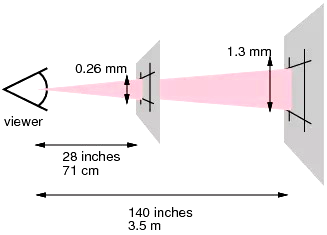
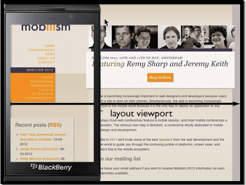
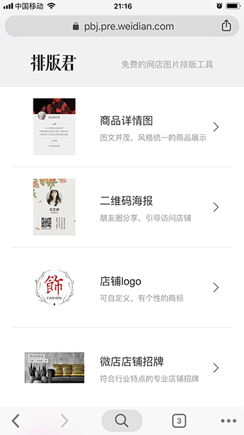
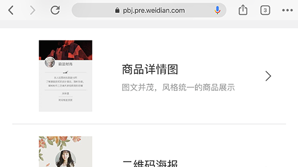
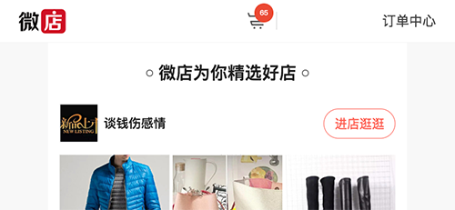

## 基础知识

#### 三个像素

像素是视觉显示的基本单位，有设备像素和 CSS 像素之分。

##### 设备像素

又称物理像素，物理设备（如显示器）的最小显示单位

##### 参考像素

由于不同的设备物理像素不同，且正常使用时距离人眼的距离也不一致，比如手机距离人眼的距离比液晶电视近。为了保证不同设备条件下人眼阅读体验的一致性，W3C 定义了具有视觉一致性（即在不同的设备中，单位像素长度大小相近）的 CSS 像素。

在定义 CSS 像素之前，需要学习用于辅助 CSS 像素定义的参考像素。



参考像素是一个约等于 0.0213 度的视角，在设备正常使用距离处与视线垂直平面上的投影宽度。例如，电脑或手持设备的正常使用距离是一臂之遥，大概 28 英寸，这个距离上 0.0213 度视角的垂直界面投影宽度是 0.26 mm；所以，电脑或手持设备的参考像素就是 0.26 mm

0.0213 度视角的由来就是一臂之遥看 1/96 英寸的视角：

```
(1/96)in / (28in * 2 * PI / 360deg) = 0.0213 度
```

##### CSS 像素

又称逻辑像素，Web 规范定义的最小显示单位，与设备无关，是一个抽象概念

CSS 像素，即 1px，并没有固定值，而是取最接近参考像素长度的设备像素的整数倍。例如：

* 某台电脑屏幕的 1 物理像素约为 0.28 mm，则其 CSS 像素等于设备像素，即 0.28 mm
* 某台电脑屏幕的 1 物理像素约为 0.15 mm，则其 CSS 像素等于 2 个设备像素，即 0.30 mm

从 CSS 像素的定义可知其值并非绝对的，而是相对的。

##### 设备像素比

**理想视口**的设备像素和 CSS 像素之比为设备像素比，JS 中通过 window.devicePixelRatio 获得。

```
设备像素比（DPR）= 设备像素 / CSS像素
```

例如，IPhone 6 理想视口的设备像素是 640，CSS 像素是 320，设备像素比为 2

##### 物理分辨率

DPI，device pixel per inch，单位英寸长度内的物理像素数量。DPI 值越高，意味着每英寸内的设备像素越多，画面更加细腻清晰。

大多数的浏览器支持 DPR，但是 IE 系列浏览器支持 DPI，不支持 DPR。所以，使用媒介查询区分不同分辨率的屏幕时，需要同时使用 DPR 和 DPI

```
@media all and (-webkit-min-device-pixel-ratio: 1.5), (min-resolution: 144dpi) {
	...
}
```

##### 参考

* https://github.com/jawil/blog/issues/21
* https://juejin.im/post/5b95a8186fb9a05cd7772455

#### 三个视口

桌面上，视口与浏览器窗口的宽度一致；但在手机上，视口与移动端浏览器屏幕宽度是不关联的。之所以在移动端引入多个视口概念，是出于 2 个目的：

* 帮助桌面网站过渡到手机上依然保持较好的用户体验，通过布局视口和视觉视口实现
* 引导开发者开发更加适合移动端的网页，通过理想视口实现

##### 布局视口

Layout Viewport，布局视口，页面在不受窗口限制的前提下，按其 CSS 像素尺寸自由排布所占用的窗体大小。

布局视口主要为 PC 端页面在移动端展示准备，通常它会超出手机屏幕。



##### 视觉视口

Visual Viewport，视觉视口，相对于布局视口，它是用户正在看到的网页的区域。

用户可以通过缩放来操作视觉视口。


##### 理想视口

Ideal Viewport，理想视口，设备最理想的布局视口。

按理想视口开发的网页，拥有最理想的阅读体验。

##### 视口设置

移动设备默认的 viewport 是布局视口，在开发移动端页面时，需要设置为理想视口。移动端通过 viewport meta标签设置，PC 端浏览器并不识别这个 meta 值。

```
<meta name="viewport" content="width=device-width, initial-scale=1.0, maximum-scale=1.0, user-scalable=no">
```

content支持五个属性：

| 属性          | 取值                 | 描述                                            |
| ------------- | -------------------- | ----------------------------------------------- |
| width         | 正整数或device-width | 视口的宽度，单位为像素                          |
| initial-scale | [0.0-10.0]           | 初始缩放值                                      |
| minimum-scale | [0.0-10.0]           | 放大最大比例，它必须小于或等于maximum-scale设置 |
| maximum-scale | [0.0-10.0]           | 缩小最小比例，它必须大于或等于minimum-scale设置 |
| user-scalable | yes / no             | 是否允许用户手动缩放页面，默认值 yes            |

## 屏幕适配

#### 适配方案

由于移动端设备的屏幕宽度和 DPR 的不一致，需要有较好的适配方案，使得页面在不同的设备中都可以有较好的体验。

目前主流的适配方案有：

* 简单媒介查询
* 固定视口宽度
* Rem方案
* Flex弹性布局
* Flexible方案

##### 简单媒介查询

简单的媒介查询的思想：

* 为每一个宽度尺寸范围的屏幕都制定一套 CSS 代码

```
@media screen and (max-width: 800px) {
	html { ... }
	body { ... }
}

@media screen and (max-width: 600px) {
	html { ... }
	body { ... }
}
```

方案的优点是：

* 方案简单
* 适合移动和 PC 端使用同一套代码的网站

方案的缺点是：

* 多套样式，工作量大，浪费流量
* 需要考虑高 DPR 屏幕的兼容情况

##### 固定视口宽度

固定视口宽度的思想：

* 固定设置布局视口的宽度，比如设置为 640，或 750，原理是浏览器自动缩放，使得不同移动设备的视口宽度始终为同一固定值
* 字体尺寸，可以配合媒介查询利用 rem 让字体大小在不同尺寸屏幕中适当伸缩

方案的优点：

* 简单粗暴，容易处理，开发效率高

方案的缺点：

* 只能在移动端使用

* Android < 4.0 系统不支持，同时，有开发者反应 Android WebView 中存在不兼容问题，不知是否和该原因有关，暂时未遇到

* 屏幕宽度无论大小，字体大小、容纳内容多少都基本一致，小屏幕手机尚可，大屏幕手机字体较大不美观。但依旧有其适用场景，比如微店素材中心编辑页基本全是图片

* 横屏时或者 Pad 上打开页面，显示宽度变宽，但布局视口依旧是原来设置的固定值，会导致内容变大难看，如下固定布局视口宽度在横屏和竖屏时的表现

  竖屏时表现：

  

  横屏时表现：

  

##### Flex 弹性布局

Flex 弹性布局的思想是：

* 使用理想视口，以及 flex 弹性布局占满整个屏幕宽度
* 字体尺寸可以直接采用 px 为单位（例如微店拼团），或者利用 rem 让字体大小在不同尺寸屏幕中适当伸缩

```
@media screen and (min-width: 320px) {
    html {
        font-size: 16px
    }
}

@media screen and (min-width: 360px) {
    html {
        font-size: 18px
    }
}

@media screen and (min-width: 375px) {
    html {
        font-size: 18.75px
    }
}

@media screen and (min-width: 400px) {
    html {
        font-size: 20px
    }
}

@media screen and (min-width: 480px) {
    html {
        font-size: 24px
    }
}

...
```

方案的优点是：

* 方案相对简单
* 适配性好，PC 和移动端，或者横竖屏均能较好的适配

方案的缺点是：

* 设计稿还原度差
* 不同的移动设备中，基本布局和设计稿会不一致，比如，两列布局，通常是左侧固定 px，右侧弹性伸缩，两侧尺寸比例和设计稿会不符

##### Flexible 方案

Flexible 方案其实是 rem 方案中比较有代表性的一种。rem 方案的主要的思想是：

* 获取屏幕宽度，通过设置 html 元素 font-size 为 `屏幕宽度/n`  ，从而将布局视口宽度固定为恒定的 n（n=10、20 ...）rem，而所有布局尺寸皆使用 rem 单位，最终保证在不同移动设备中，页面基本布局与设计一致
* 字体大小，直接使用 rem 值，或者不同 dpr 下设置不同尺寸的 font-size

Flexible 1.0 在 rem 方案的基础上为了实现 1px 效果，在 IOS 中通过缩放 viewport 将布局视口宽度重置为和屏幕物理像素宽度相等，而 Android 中由于屏幕种类繁多表现各异，所以统一不处理。

Flexible 2.0 版本中，已经取消了动态设置 viewport 的功能，基本退化成 rem 方案，只不过 rem 是动态计算的。同时，建议逐渐放弃 Flexible 方案，逐渐转移至 vw 方案。

方案的优点：

* 不同设备中页面基本布局保持一致，有其在 IOS 系统中

方案的缺点：

* 横屏效果差，甚至布局异常。原因有：

  * Flexible.js 内部通过 `屏幕宽度/n` 的方式设置 html 元素的 font-size值，横屏时宽度变大，1rem 代表的 px 值也随之变大，从而导致横屏布局尺寸拉伸；但此时页面字体由于 dpr 未改变而恒定不变，最终出现布局尺寸大字体尺寸小的现象，比例失调

  * Flexible.js 内部不会允许屏幕宽度无限拉长，会通过如下代码限制宽度过宽，在横屏宽度较长时，导致 n rem 不再等于而是小于屏幕宽度的现象，此时内容就无法占满整个屏幕了，如果有元素采用绝对或固定定位（fixed 或 absolute），此时原有布局就有可能破坏

    ```
    function refreshRem(){
        var width = docEl.getBoundingClientRect().width;
        if (width / dpr > 540) {
        	width = 540 * dpr;
        }
    
        var rem = width / 10;
        docEl.style.fontSize = rem + 'px';
        flexible.rem = win.rem = rem;
    }
    ```

  * 不按规范使用字体尺寸，比如，直接也使用 rem 作为字体单位，导致横屏时字体尺寸过大

    

##### vw 适配方案

Flexible 方案通过动态修改 viewport 以及设置 rem 实现屏幕宽度 n 等分，近似一种 hack 手段，而 vw 是规范制定标准的 viewport 等分方案。

方案的优点是：

* 标准规范

方案的缺点是：

* 需要将设计单位 px 转换成 vw
* 目前支持依旧不够完善，比如，使用 Android 7.0 的华为 mate9 内置浏览器中依旧不支持

###### 参考

* https://www.w3cplus.com/css/vw-for-layout.html

#### 1px 问题

##### 0.5px

思路：IOS 8+ 支持 0.5 px设置

方案的优点：

* 简单，不需要过多代码

方案的缺点：

* 无法兼容安卓设备、 iOS 8 以下设备

##### border-image

思路：通过 border-image 将 2px 或 3px 宽度的图片显示在 1px 宽的 border 上

```
border: 1px solid;			// 需要优先设置border属性，否则Chrome中显示不出来图片
border-image: url(./images/border.png) 0 0 2 0 repeat;
```

方案的优点：

* 可以设置单条,多条边框
* 没有性能瓶颈的问题

方案的缺点：

* 修改颜色麻烦，需要替换图片
* 圆角需要特殊处理，并且边缘会模糊

##### background-image

思路：与 border-image 类似，只不过通过 background-image 实现

##### Css 渐变方案

思路：与 background-image 类似，只不过通过渐变实现背景

```
background:
    linear-gradient(#000, #000 100%) left / 1px 100% no-repeat,
    linear-gradient(#000, #000 100%) right / 1px 100% no-repeat,
    linear-gradient(#000, #000 100%) top / 100% 1px no-repeat,
    linear-gradient(#000, #000 100%) bottom / 100% 1px no-repeat
```

方案的优点：

* 可以实现单条、多条边框
* 方案灵活，边框的颜色随意设置

方案的缺点：

* 代码量多
* 圆角没法实现
* 多背景图片有兼容性问题

##### box-shadow

思路：使用 box-shadow 来实现边框效果

```
box-shadow: inset 0px -1px 1px -1px #000;
```

方案的优点：

* 代码量少
* 可以满足所有场景

方案的缺点：

* 边框有阴影，颜色变浅

##### viewport + rem

思路：同适配方案 Flexible 中方法

方案的缺点：

* 改动较大，副作用较多

##### 伪元素 + scale

思路：利用 `:before` 或者 `:after` 模拟 border ，并利用 `transform: scale(0.5)` 缩小至原来一半。

```
.elem {
    position: relative;
    margin-bottom: 20px;
    border: none;
}

.elem :after {
    content: '';
    top: 0;
    left: 0;
    position: absolute;
    width: 200%;
    height: 200%;
    border: 1px solid #000;
    box-sizing: border-box;
    transform: scale(0.5);
    transform-origin: left top;
}
```

方案的优点：

* 所有场景都能满足
* 支持圆角 (伪类和本体类都需要加border-radius)

方案的缺点：

* 对于已经使用伪类的元素 (例如clearfix)，可能需要多层嵌套

##### 参考

* https://aotu.io/notes/2016/11/02/border-image/index.html
* https://www.jianshu.com/p/7e63f5a32636


