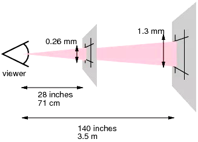
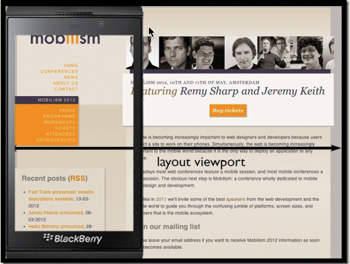

## 基础知识

#### 三个像素

像素是视觉显示的基本单位，有设备像素和 CSS 像素之分。

##### 设备像素

又称物理像素，物理设备（如显示器）的最小显示单位

##### 参考像素

由于不同的设备物理像素不同，且正常使用时距离人眼的距离也不一致，比如手机距离人眼的距离比液晶电视近。为了保证不同设备条件下人眼阅读体验的一致性，W3C 定义了具有视觉一致性（即在不同的设备中，单位像素长度大小相近）的 CSS 像素。

在定义 CSS 像素之前，需要学习用于辅助 CSS 像素定义的参考像素。



参考像素是一个约等于 0.0213 度的视角，在设备正常使用距离处与视线垂直平面上的投影宽度。例如，电脑或手持设备的正常使用距离是一臂之遥，大概 28 英寸，这个距离上 0.0213 度视角的垂直界面投影宽度是 0.26 mm；所以，电脑或手持设备的参考像素就是 0.26 mm

0.0213 度视角的由来就是一臂之遥看 1/96 英寸的视角：

```
(1/96)in / (28in * 2 * PI / 360deg) = 0.0213 度
```

##### CSS 像素

又称逻辑像素，Web 规范定义的最小显示单位，与设备无关，是一个抽象概念

CSS 像素，即 1px，并没有固定值，而是取最接近参考像素长度的设备像素的整数倍。例如：

* 某台电脑屏幕的 1 物理像素约为 0.28 mm，则其 CSS 像素等于设备像素，即 0.28 mm
* 某台电脑屏幕的 1 物理像素约为 0.15 mm，则其 CSS 像素等于 2 个设备像素，即 0.30 mm

从 CSS 像素的定义可知其值并非绝对的，而是相对的。

##### 设备像素比

**理想视口**的设备像素和 CSS 像素之比为设备像素比，JS 中通过 window.devicePixelRatio 获得。

```
设备像素比（DPR）= 设备像素 / CSS像素
```

例如，IPhone 6 理想视口的设备像素是 640，CSS 像素是 320，设备像素比为 2

##### 物理分辨率

DPI，device pixel per inch，单位英寸长度内的物理像素数量。DPI 值越高，意味着每英寸内的设备像素越多，画面更加细腻清晰。

大多数的浏览器支持 DPR，但是 IE 系列浏览器支持 DPI，不支持 DPR。所以，使用媒介查询区分不同分辨率的屏幕时，需要同时使用 DPR 和 DPI

```
@media all and (-webkit-min-device-pixel-ratio: 1.5), (min-resolution: 144dpi) {
	...
}
```

##### 参考

* https://github.com/jawil/blog/issues/21
* https://juejin.im/post/5b95a8186fb9a05cd7772455

#### 三个视口

桌面上，视口与浏览器窗口的宽度一致；但在手机上，视口与移动端浏览器屏幕宽度是不关联的。之所以在移动端引入多个视口概念，是出于 2 个目的：

* 帮助桌面网站过渡到手机上依然保持较好的用户体验，通过布局视口和视觉视口实现
* 引导开发者开发更加适合移动端的网页，通过理想视口实现

##### 布局视口

Layout Viewport，布局视口，页面在不受窗口限制的前提下，按其 CSS 像素尺寸自由排布所占用的窗体大小。

布局视口主要为 PC 端页面在移动端展示准备，通常它会超出手机屏幕。



##### 视觉视口

Visual Viewport，视觉视口，相对于布局视口，它是用户正在看到的网页的区域。

用户可以通过缩放来操作视觉视口。


##### 理想视口

Ideal Viewport，理想视口，设备最理想的布局视口。

按理想视口开发的网页，拥有最理想的阅读体验。

##### 视口设置

移动设备默认的 viewport 是布局视口，在开发移动端页面时，需要设置为理想视口。移动端通过 viewport meta标签设置，PC 端浏览器并不识别这个 meta 值。

```
<meta name="viewport" content="width=device-width, initial-scale=1.0, maximum-scale=1.0, user-scalable=no">
```

content支持五个属性：

| 属性          | 取值                 | 描述                                            |
| ------------- | -------------------- | ----------------------------------------------- |
| width         | 正整数或device-width | 视口的宽度，单位为像素                          |
| initial-scale | [0.0-10.0]           | 初始缩放值                                      |
| minimum-scale | [0.0-10.0]           | 放大最大比例，它必须小于或等于maximum-scale设置 |
| maximum-scale | [0.0-10.0]           | 缩小最小比例，它必须大于或等于minimum-scale设置 |
| user-scalable | yes / no             | 是否允许用户手动缩放页面，默认值 yes            |


