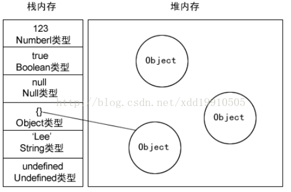
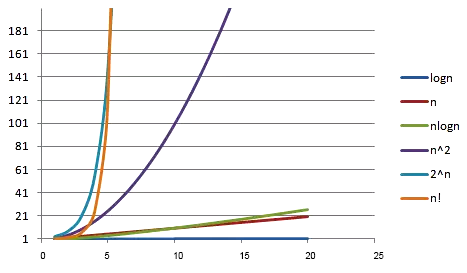
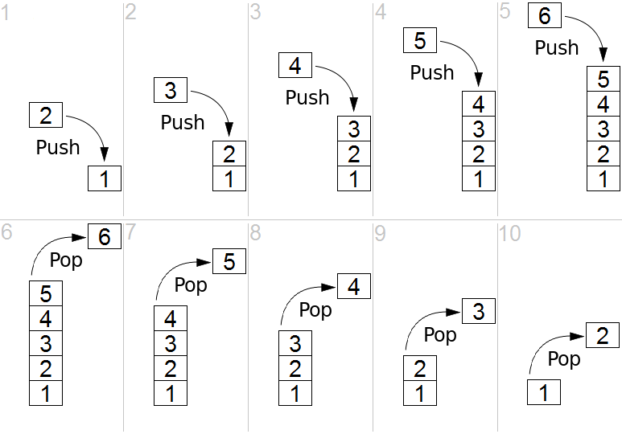

## 基础概念

### 堆栈存储

堆栈存储的基本机制：

* 基本类型 - 栈 stack

  Number、String 、Boolean、Null、Undefined 和 Symbol 基本数据类型是按值访问，由于这些类型数据在内存中占有固定大小的空间，所以值保存在栈空间。由高向低分配，栈内存最大是 8MB，超出报栈溢出。其中，String类型是特殊的栈内存：向高分配大小不定，程序员分配

* 引用类型 - 堆 heap

  Object  (Array 、Function 、Data等) 类型，由于值大小不固定，不能保存到栈内存中。栈内存中仅存放指向堆内存中对象的地址，在堆内存中为这个值分配空间，按引用访问。由于内存地址大小是固定的，因此可以将内存地址保存在栈内存中，向高分配，系统自动分配。这样，当查询引用类型的变量时， 先从栈中读取内存地址， 然后再通过地址找到堆中的值。对于这种，我们把它叫做按引用访问。

  

> 备注：栈地址的生长方式 - 由高向低分配，即从高地址向低地址分配，先分配的变量存在高地址，后分配的存在低地址。

堆栈存储的区别：

* 空间分配
  * 栈(操作系统)：由操作系统自动分配释放 ，存放函数的参数值，局部变量的值等。其操作方式类似于数据结构中的栈
  * 堆(操作系统)： 一般由程序员分配释放，若程序员不释放，程序结束时可能由 OS 回收，分配方式倒是类似于链表。

* 缓存方式
  * 栈：使用的是一级缓存， 他们通常都是被调用时处于存储空间中，调用完毕立即释放
  * 堆是存放在二级缓存中，生命周期由虚拟机的垃圾回收算法来决定（并不是一旦成为孤儿对象就能被回收）。所以调用这些对象的速度要相对来得低一些

* 数据结构
  * 栈：一种先进后出的数据结构
  * 堆：堆可以被看成是一棵树，如：堆排序

#### 参考

* https://juejin.im/entry/589c29a9b123db16a3c18adf

### 算法效率

算法效率是衡量程序消耗处理器资源的重要标准，其主要由两个复杂度来评估：

* 时间复杂度：评估执行程序所需的时间。可以估算出程序对处理器的使用程度
* 空间复杂度：评估执行程序所需的存储空间。可以估算出程序对计算机内存的使用程度。

#### 时间频度

一个算法执行所耗费的时间，理论上很难算出来，必须上机测试才能知道。由于算法花费时间与算法中语句执行的次数成正比，所以，可以使用语句执行次数衡量算法耗时。一个算法中的语句执行次数称为**语句频度**或**时间频度**，记为 T(n)，其中，n 为问题规模，当 n 不断变化时，时间频度 T(n) 也会不断变化。

#### 时间复杂度

通常，我们希望知道时间频度变化时的规律，为此我们引入时间复杂度的概念。

一般情况下，算法中基本操作重复执行的次数是问题规模 n 的某个函数，用 T(n) 表示，若有某个辅助函数 f(n) ，使得当 n 趋于无穷大时，T(n)/f(n) 的极限值为不等于零的常数，则称 f(n) 是 T(n) 的同数量级函数，记作：

```
T(n) = O(f(n))
```

f(n) 称为算法的渐进时间复杂度，简称**时间复杂度**。

#### 大O表示法

用 O( ) 来体现算法时间复杂度的记法，称之为**大O表示法**。

时间复杂度可以从最理想情况、平均情况和最坏情况三个角度来评估，由于平均情况大多和最坏情况持平，而且评估最坏情况也可以避免后顾之忧，因此一般情况下，我们设计算法时都要直接估算最坏情况的复杂度。

大O表示法 O(f(n) 中的 f(n) 的值可以为1、n、logn、n²等，因此，O(1)、O(n)、O(logn)、O(n²)分别可以称为常数阶、线性阶、对数阶和平方阶。

推导大O阶的规则是：

```
1. 用常数1来取代运行时间中所有加法常数
2. 修改后的运行次数函数中，只保留最高阶项
3. 如果最高阶项存在且不是1，则去除与这个项相乘的常数
```

##### 常数阶

```
let n = 100;                    // 执行一次
let sum = (1 + n) * n / 2;      // 执行一次
console.log(sum);               // 执行一次
```

代码运行的次数为 `f(n)=3`，根据推导大O阶的规则 1，我们需要将常数 3 改为 1，则这个算法的时间复杂度为 O(1)。

##### 线性阶

```
for (let i = 0; i < n; i++) {
    // 时间复杂度为O(1)的算法
    ...
}
```

算法循环体中的代码执行了 n 次，因此时间复杂度为 O(n)。

##### 对数阶

```
let number = 1;

while (number < n) {
    number = number * 2;
    
    //时间复杂度为O(1)的算法
    ...
}
```

随着 number 乘以 2，都会越来越接近 n，当 number 不小于 n 时就会退出循环。假设循环的次数为 x，则由 2^x^ = n 得出 x = log₂n，因此得出这个算法的时间复杂度为 O(logn)。

##### 平方阶

```
for (let i = 0; i < n; i++) {
    for (let j = 0; j < n; i++) {
        //复杂度为O(1)的算法
        ...
    }
}
```

内层循环的时间复杂度是 O(n)，现在经过外层循环 n 次，那么这段算法的时间复杂度则为 O(n²)。

将这个双层循环修改为：

```
for (let i = 0; i < n; i++) {
    for (let j = i; j < n; i++) {
        //复杂度为O(1)的算法
        ...
    }
}
```

i=0 时，内循环执行 n 次；i=1 时内循环执行了 n-1 次；i=n-1 时执行了 1 次，可以推算总的执行次数为：

```
n+(n-1)+(n-2)+(n-3)+……+1
= (n+1)+[(n-1)+2]+[(n-2)+3]+[(n-3)+4]+……
= (n+1)+(n+1)+(n+1)+(n+1)+……
= (n+1)*n/2
= n²/2+n/2
```

根据大O阶的规则2：只保留最高阶，因此保留 n²/2；根据规则 3 去掉与这个项相乘的常数，则去掉 1/2，最终代码的时间复杂度为 O(n²)。

##### 其他阶

除了常数阶、线性阶、平方阶、对数阶，还有如下时间复杂度：

* f(n)=nlogn 时，时间复杂度为O(nlogn)，称为nlogn阶
* f(n)=n³时，时间复杂度为O(n³)，称为立方阶
* f(n)=2ⁿ时，时间复杂度为O(2ⁿ)，称为指数阶
* f(n)=n!时，时间复杂度为O(n!)，称为阶乘阶
* f(n)=√n时，时间复杂度为O(√n)，称为平方根阶

#### 复杂度对比

| n    | logn | √n   | nlogn | n²      | 2ⁿ       | n!            |
| ---- | ---- | ---- | ----- | ------- | -------- | ------------- |
| 5    | 2    | 2    | 10    | 25      | 32       | 120           |
| 10   | 3    | 3    | 30    | 100     | 1024     | 3628800       |
| 50   | 5    | 7    | 250   | 2500    | 约10^15  | 约3.0*10^64   |
| 100  | 6    | 10   | 600   | 10000   | 约10^30  | 约9.3*10^157  |
| 1000 | 9    | 31   | 9000  | 1000000 | 约10^300 | 约4.0*10^2567 |



其中，x轴代表n值，y轴代表T(n)值（时间复杂度）

可以看出，O(n)、O(logn)、O(√n )、O(nlogn ) 随着n的增加，复杂度提升不大，这些复杂度属于效率高的算法；反观 O(2ⁿ) 和 O(n!)，当n增加到50时，复杂度就突破十位数了，这种效率极差的复杂度最好不要出现在程序中。

#### 参考

* https://juejin.im/post/58d15f1044d90400691834d4

### 动态规划

动态规划是通过拆分问题，定义问题状态和状态之间的关系，使得问题能够以递推（或者说分治）的方式去解决。

动态规划背后的基本思想非常简单。大致上，若要解一个给定问题，我们需要解其不同部分（即子问题），再根据子问题的解以得出原问题的解。

###### 适用情况

- 最优子结构性质。如果问题的最优解所包含的子问题的解也是最优的，我们就称该问题具有最优子结构性质（即满足最优化原理）。最优子结构性质为动态规划算法解决问题提供了重要线索。
- 无后效性。即子问题的解一旦确定，就不再改变，不受在这之后、包含它的更大的问题的求解决策影响。
- 子问题重叠性质。子问题重叠性质是指在用递归算法自顶向下对问题进行求解时，每次产生的子问题并不总是新问题，有些子问题会被重复计算多次。动态规划算法正是利用了这种子问题的重叠性质，对每一个子问题只计算一次，然后将其计算结果保存在一个表格中，当再次需要计算已经计算过的子问题时，只是在表格中简单地查看一下结果，从而获得较高的效率。

....

....

## 数据结构

常用的数据结构：

* 栈
* 队列
* 链表
* 树

### 栈

栈是一种"后进先出"（LIFO，Last In First Out）的抽象数据结构，具有两种主要操作:

* push，添加元素到栈的顶端(末尾)
* pop，移除栈最顶端(末尾)的元素

在 JS 中，通常采用数组类型及其 push、pop 方法模拟栈。



### 队列

队列是一种"先进先出"（FIFO，First In First Out）的抽象数据结构，具有两种主要操作:

- 入队，添加元素到队列的末尾
- 出队，移除队列最前端的元素

在 JS 中，通常采用数组类型及其 unshift、pop 方法模拟队列。


### 链表

链表是数据元素的线性集合，线性不是指物理存储而是逻辑关系，链表中的每个元素都有一个指向下一个元素的指针。

在 JS 中，通常使用对象模拟一个链表元素：

```
{
  	value: 'Link',		// 当前元素的值
  	next: obj					// 引用下一个对象 obj
}
```


### 树

树是一种抽象数据结构，由 n（n>0）个有限节点组成一个具有层次关系的集合，用以模拟具有树状结构的数据集合。之所以称之为树，是因为它的结构像一棵倒挂（根朝上，叶朝下）的树。它具有以下的特点：

* 没有父节点的节点称为根节点
* 每一个非根节点有且只有一个父节点
* 每个节点都只有有限个子节点或无子节点
* 除了根节点外，每个子节点可以分为多个不相交的子树
* 树里面没有环路 (cycle)


## 算法实现

### 数学

#### 斐波那契数列

在数学上，费波那契数列是以递归的方法来定义：

* F~0~ = 0
* F~1~ = 1
* F~n~ = F~n-1~ + F~n-2~（n≧2）

存在性能问题的递归实现方式：

```
function fib(n) {
    if (n == 0) return 0
    if (n == 1) return 1
    return fib(n - 1) + fib(n - 2)
}
```

性能优化的循环实现方式：

```
function fib(n) {
    let fn0 = 0
    let fn1 = 1
    let cur = fn0

    for (let i = 1; i <= n; i++) {
        fn0 = fn1
        fn1 = cur
        cur = fn0 + fn1
    }

    return current
}
```

尾递归优化的实现方式：

```
function fib(n) {
    const _fib = (n, a, b) => {
        if (n == 0) return a

        return _fib(n - 1, b, a + b)
    }

    return _fib(n, 0, 1)
}
```


### 字符串

#### 莱温斯坦距离

Levenshtein 距离，用于测量两个序列之间差异的字符串度量。 通俗地讲，两个字符串之间的 Levenshtein 距离就是将一个字符串更改为另一个字符串所需的**单字符编辑**的最小数量。单字符编辑操作只包括以下3种：

- 插入一个字符
- 删除一个字符
- 替换一个字符

##### 定义

在数学上，两个字符串 a，b 之间的莱温斯坦距离记作 lev~a,b~(|a|,|b|)，|a|和|b|分别是 a 和 b 的字符串长度，其中，


* 1(a~i~≠b~j~) 表示当 a~i~ 和 b~j~ 不相等时，值为 1，否则值为 0
* lev~a,b~(i,j)​ 表示​ a 的前 i 个字符和 b 的前 j 个字符之间的距离
* 最小值中的第一个元素对应于删除（从 a​ 到 b），第二个元素对应于插入，第三个元素对应于匹配或不匹配，这取决于各个符号是否相同

##### 实例

例如，kitten 和 sitting 之间的 Levenshtein 距离是 3，因为以下三个编辑可以将字符串 kitten 改变为 sitting，并且没有办法用少于三个编辑来做：

1. kitten → sitten（用 s 代替 k）
2. sitten → sittin（用 i 代替 e）
3. sitten → sitting（在末尾插入 g）

##### 应用

Levenshtein 距离的应用：

* 拼写检查器，用于光学字符识别的校正系统，模糊字符串搜索
* 辅助基于翻译记忆的自然语言翻译的软件。

##### 动态规划方法解释

一个简单的例子，寻找字符串 ME 和 MY 之间的最小编辑距离。直观地，最小编辑距离是 1 次操作，用 Y 代替 E。但是，我们需要用算法的形式将它形式化，以便能够做更复杂的例子，比如将 Saturday 转换成 Sunday。

为了将上述数学公式应用于 ME → MY 变换，首先，需要知道 ME → M，M → MY 和 M → M 变换的最小编辑距离。然后我们将需要挑选最小的一个并添加一个操作来变换最后的字母 E → Y。因此，基于三个先前可能的变换计算 ME→MY 变换的最小编辑距离。

为了进一步解释，让我们绘制以下矩阵（**认真理解这个矩阵**）：

> ME 是需要变化的字符串，所以考虑的角度是自己如何变化成其它字符串；
>
> MY 是需要变成的字符串，所以考虑的角度是其它字符串如何变化成自己；


- 单元格（0, 1）：红色数字 1，意味着需要 1 个删除操作将 M 转换为空字符串，操作是删除 M
- 单元格（0, 2）：红色数字 2，意味着需要 2 个删除操作将 ME 转换为空字符串，操作是删除 E 和 M
- 单元格（1, 0）：绿色数字 1，意味着需要 1 个插入操作将空字符串转换为 M，操作是插入 M
- 单元格（1, 1）：黑色数字 0，意味着将 M（ME中M）转换为 M（MY中M），无需任何操作
- 单元格（1, 2）：红色数字 1，意味着需要 1 个删除操作将 ME 转换为 M，操作是删除 E
- 单元格（2, 0）：绿色数字 2，意味着需要 2 个插入操作将空字符串转换为 MY，操作是插入 Y 和 M
- 单元格（2, 1）：绿色数字 1，意味着需要 1 个插入操作将字符串 M 转换为 MY，操作是插入 Y
- 单元格（2, 2）：蓝色数字 1，意味着需要 1 个替换操作将字符串 ME 转换为 MY，操作是替换 E 为 Y

由此，便可以推导出莱温斯坦距离的基本规律，并以此为基础理解和推到定义中的公式。

根据公式，只需要三个相邻的单元格（竖向为 i，横向为 j）：

- (i-1 : j)：（i : j）上侧的单元格，通常需要进行删除操作
- (i : j-1) ：（i : j）左侧的单元格，通常需要进行插入操作
- (i-1 : j-1) ：（i : j）左上对角的单元格，通常需要进行替换操作

来计算当前单元格  (i : j) 的数量。我们需要做的就是找到这三个单元格中的最小值，然后在 i 的行和 j 列中有不同的字母时加 1。

您可以清楚地看到问题的递归性质。


让我们为这个问题绘制一个决策图。


您可能会在图片上看到一些标有红色的重叠子问题。 此外，没有办法减少操作次数并使其低于公式中这三个相邻单元格的最小值。

您也可能会注意到矩阵中的每个单元格编号都是根据以前的单元格计算的。 因此，这里应用制表技术（以自底向上方向填充高速缓存）。

进一步应用这个原则，我们可以解决更复杂的情况，如 Saturday → Sunday 转换。


##### 实现

> matrix /'meɪtrɪks/ n. 矩阵；模型

```
/**
 * @param {string} a
 * @param {string} b
 * @return {number}
 */
function levenshteinDistance(a, b) {
    const aLength = a.length;
    const bLength = b.length;

    // 创建(bLength + 1) * (aLength + 1)矩阵
    const distanceMatrix = Array(bLength + 1).fill(0).map(() => Array(aLength + 1).fill(0));

    // 依据字符串a的长度，创建矩阵固定规律的第一行：0，1，2，3...
    for (let i = 0; i <= aLength; i++) {
        distanceMatrix[0][i] = i;
    }

    // 依据字符串b的长度，创建矩阵固定规律的第一列：0，1，2，3...
    for (let j = 0; j <= bLength; j++) {
        distanceMatrix[j][0] = j;
    }

    for (let j = 1; j <= bLength; j++) {
        for (let i = 1; i <= aLength; i++) {
            const indicator = a[i - 1] === b[j - 1] ? 0 : 1;

            distanceMatrix[j][i] = Math.min(
                distanceMatrix[j][i - 1] + 1,               // 删除
                distanceMatrix[j - 1][i] + 1,               // 插入
                distanceMatrix[j - 1][i - 1] + indicator,   // 替换
            );
        }
    }

    return distanceMatrix[bLength][aLength];
}
```

##### 参考

- https://github.com/trekhleb/javascript-algorithms/blob/master/README.zh-CN.md


### 搜索


### 排序

如果 a=b，且 a 原本在 b 前面，排序之后 a 仍然在 b 的前面，则称之为**稳定排序**；否则，为**不稳定排序**

如果所有排序操作都在内存中完成，称之为**内排序**；如果数据太大，需要把数据放在磁盘中，而排序通过磁盘和内存的数据传输才能进行，则成为**外排序**

#### 冒泡排序


重复迭代要排序的数列，一次比较两个元素，如果它们的顺序错误就进行交换，直至没有需要交换的元素为止。

```
function bubbleSort(arr) {
    let len = arr.length;

    for (let i = 0; i < len; i++) {
        for (let j = i + 1; j < len; j++) {
            if (arr[i] > arr[j]) {
                [arr[i], arr[j]] = [arr[j], arr[i]]
            }
        }
    }

    return arr;
}
```

冒泡排序的算法复杂度为 O(n²)

#### 快速排序

通过一趟排序将待排记录分隔成独立的两部分，其中一部分记录的关键字均比另一部分的关键字小，然后对分割的两部分分别进行排序，如此递归以最终达到整个序列有序。

```
function quickSort(arr) {
    let len = arr.length;
    let leftQueue = [];
    let rightQueue = [];

    if (len <= 1) {
        return arr;
    }

    for (let i = 1; i < len; i++) {
        arr[i] < arr[0] ? leftQueue.push(arr[i]) : rightQueue.push(arr[i]);
    }

    return [...quickSort(leftQueue), arr[0], ...quickSort(rightQueue)];
}
```

##### 参考

* https://juejin.im/post/57dcd394a22b9d00610c5ec8


#### 参考

* https://yq.aliyun.com/articles/613456
* https://juejin.im/post/5958bac35188250d892f5c91
* https://zhuanlan.zhihu.com/p/27659059
* https://github.com/trekhleb/javascript-algorithms/blob/master/README.zh-CN.md


### 树

树的遍历方式主要有：

* 深度优先遍历（DFC，Depth First Search）
* 广度优先遍历（BFC，Breadth First Search）

在 JS 中，常见的场景是 DOM 节点遍历。我们采用这两种方式实现遍历如下 DOM 结构。

```
<div class="parent">
    <div class="child-1">
        <div class="child-1-1">
            <div class="child-1-1-1"></div>
        </div>
        <div class="child-1-2">
            <div class="child-1-2-1"></div>
        </div>
        <div class="child-1-3"></div>
    </div>
    <div class="child-2">
        <div class="child-2-1"></div>
        <div class="child-2-2"></div>
    </div>
    <div class="child-3">
        <div class="child-3-1"></div>
    </div>
</div>
```

#### 深度优先遍历

普通递归实现方式：

```
let deepthTraversal = (node) => {
    let nodes = []

    if (node !== null) {
        nodes.push(node)

        let children = node.children
        for (let i = 0; i < children.length; i++) {
            nodes = nodes.concat(deepthTraversal(children[i]))
        }
    }
    
    return nodes
}
```

尾递归优化实现方式：

```
let deepthTraversal = (node, nodes = []) => {
    if (node !== null) {
        nodes.push(node)

        let children = node.children
        for (let i = 0; i < children.length; i++) {
            deepthTraversal(children[i], nodes)
        }
    }

    return nodes
}
```

性能优化的循环实现方式：

```
let deepthTraversal = (node) => {
    let stack = []
    let nodes = []

    if (node) {
        stack.push(node)

        while (stack.length) {
            let item = stack.pop()
            let children = item.children

            nodes.push(item)
            
            // 深度优先用倒序遍历
            // node = [] stack = [parent]
            // node = [parent] stack = [child3,child2,child1]
            // node = [parent, child1] stack = [child3,child2,child1-2,child1-1]
            // node = [parent, child1-1] stack = [child3,child2,child1-2]
            for (let i = children.length - 1; i >= 0; i--) {
                stack.push(children[i])
            }
        }
    }
    
    return nodes
}
```

#### 广度优先遍历

循环实现方式：

```
let breadthTraversal = (node) => {
    let nodes = []
    let stack = []

    if (node) {
        stack.push(node)

        while (stack.length) {
            let item = stack.shift()
            let children = item.children
            
            nodes.push(item)
            
            // 广度优先用正序遍历
            // nodes = [] stack = [parent]
            // nodes = [parent] stack = [child1,child2,child3]
            // nodes = [parent, child1] stack = [child2,child3,child1-1,child1-2]
            // nodes = [parent,child1,child2]
            for (let i = 0; i < children.length; i++) {
                stack.push(children[i])
            }
        }
    }

    return nodes
}
```


