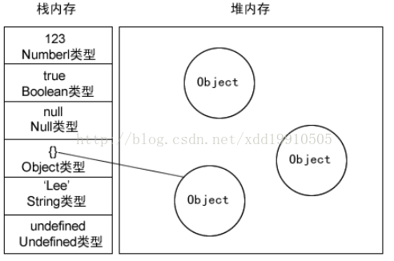
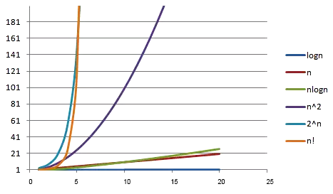

## 基础概念

### 堆栈存储

堆栈存储的基本机制：

* 基本类型 - 栈 stack

  Number、String 、Boolean、Null、Undefined 和 Symbol 基本数据类型是按值访问，由于这些类型数据在内存中占有固定大小的空间，所以值保存在栈空间。由高向低分配，栈内存最大是 8MB，超出报栈溢出。其中，String类型是特殊的栈内存：向高分配大小不定，程序员分配

* 引用类型 - 堆 heap

  Object  (Array 、Function 、Data等) 类型，由于值大小不固定，不能保存到栈内存中。栈内存中仅存放指向堆内存中对象的地址，在堆内存中为这个值分配空间，按引用访问。由于内存地址大小是固定的，因此可以将内存地址保存在栈内存中，向高分配，系统自动分配。这样，当查询引用类型的变量时， 先从栈中读取内存地址， 然后再通过地址找到堆中的值。对于这种，我们把它叫做按引用访问。

  

> 备注：栈地址的生长方式 - 由高向低分配，即从高地址向低地址分配，先分配的变量存在高地址，后分配的存在低地址。

堆栈存储的区别：

* 空间分配
  * 栈(操作系统)：由操作系统自动分配释放 ，存放函数的参数值，局部变量的值等。其操作方式类似于数据结构中的栈
  * 堆(操作系统)： 一般由程序员分配释放，若程序员不释放，程序结束时可能由 OS 回收，分配方式倒是类似于链表。

* 缓存方式
  * 栈：使用的是一级缓存， 他们通常都是被调用时处于存储空间中，调用完毕立即释放
  * 堆是存放在二级缓存中，生命周期由虚拟机的垃圾回收算法来决定（并不是一旦成为孤儿对象就能被回收）。所以调用这些对象的速度要相对来得低一些

* 数据结构
  * 栈：一种先进后出的数据结构
  * 堆：堆可以被看成是一棵树，如：堆排序

#### 参考

* https://juejin.im/entry/589c29a9b123db16a3c18adf

### 算法效率

算法效率是衡量程序消耗处理器资源的重要标准，其主要由两个复杂度来评估：

* 时间复杂度：评估执行程序所需的时间。可以估算出程序对处理器的使用程度
* 空间复杂度：评估执行程序所需的存储空间。可以估算出程序对计算机内存的使用程度。

#### 时间频度

一个算法执行所耗费的时间，理论上很难算出来，必须上机测试才能知道。由于算法花费时间与算法中语句执行的次数成正比，所以，可以使用语句执行次数衡量算法耗时。一个算法中的语句执行次数称为**语句频度**或**时间频度**，记为 T(n)，其中，n 为问题规模，当 n 不断变化时，时间频度 T(n) 也会不断变化。

#### 时间复杂度

通常，我们希望知道时间频度变化时的规律，为此我们引入时间复杂度的概念。

一般情况下，算法中基本操作重复执行的次数是问题规模 n 的某个函数，用 T(n) 表示，若有某个辅助函数 f(n) ，使得当 n 趋于无穷大时，T(n)/f(n) 的极限值为不等于零的常数，则称 f(n) 是 T(n) 的同数量级函数，记作：

```
T(n) = O(f(n))
```

f(n) 称为算法的渐进时间复杂度，简称**时间复杂度**。

#### 大O表示法

用 O( ) 来体现算法时间复杂度的记法，称之为**大O表示法**。

时间复杂度可以从最理想情况、平均情况和最坏情况三个角度来评估，由于平均情况大多和最坏情况持平，而且评估最坏情况也可以避免后顾之忧，因此一般情况下，我们设计算法时都要直接估算最坏情况的复杂度。

大O表示法 O(f(n) 中的 f(n) 的值可以为1、n、logn、n²等，因此，O(1)、O(n)、O(logn)、O(n²)分别可以称为常数阶、线性阶、对数阶和平方阶。

推导大O阶的规则是：

```
1. 用常数1来取代运行时间中所有加法常数
2. 修改后的运行次数函数中，只保留最高阶项
3. 如果最高阶项存在且不是1，则去除与这个项相乘的常数
```

##### 常数阶

```
let n = 100;                    // 执行一次
let sum = (1 + n) * n / 2;      // 执行一次
console.log(sum);               // 执行一次
```

代码运行的次数为 `f(n)=3`，根据推导大O阶的规则 1，我们需要将常数 3 改为 1，则这个算法的时间复杂度为 O(1)。

##### 线性阶

```
for (let i = 0; i < n; i++) {
    // 时间复杂度为O(1)的算法
    ...
}
```

算法循环体中的代码执行了 n 次，因此时间复杂度为 O(n)。

##### 对数阶

```
let number = 1;

while (number < n) {
    number = number * 2;
    
    //时间复杂度为O(1)的算法
    ...
}
```

随着 number 乘以 2，都会越来越接近 n，当 number 不小于 n 时就会退出循环。假设循环的次数为 x，则由 2^x^ = n 得出 x = log₂n，因此得出这个算法的时间复杂度为 O(logn)。

##### 平方阶

```
for (let i = 0; i < n; i++) {
    for (let j = 0; j < n; i++) {
        //复杂度为O(1)的算法
        ...
    }
}
```

内层循环的时间复杂度是 O(n)，现在经过外层循环 n 次，那么这段算法的时间复杂度则为 O(n²)。

将这个双层循环修改为：

```
for (let i = 0; i < n; i++) {
    for (let j = i; j < n; i++) {
        //复杂度为O(1)的算法
        ...
    }
}
```

i=0 时，内循环执行 n 次；i=1 时内循环执行了 n-1 次；i=n-1 时执行了 1 次，可以推算总的执行次数为：

```
n+(n-1)+(n-2)+(n-3)+……+1
= (n+1)+[(n-1)+2]+[(n-2)+3]+[(n-3)+4]+……
= (n+1)+(n+1)+(n+1)+(n+1)+……
= (n+1)*n/2
= n²/2+n/2
```

根据大O阶的规则2：只保留最高阶，因此保留 n²/2；根据规则 3 去掉与这个项相乘的常数，则去掉 1/2，最终代码的时间复杂度为 O(n²)。

##### 其他阶

除了常数阶、线性阶、平方阶、对数阶，还有如下时间复杂度：

* f(n)=nlogn 时，时间复杂度为O(nlogn)，称为nlogn阶
* f(n)=n³时，时间复杂度为O(n³)，称为立方阶
* f(n)=2ⁿ时，时间复杂度为O(2ⁿ)，称为指数阶
* f(n)=n!时，时间复杂度为O(n!)，称为阶乘阶
* f(n)=√n时，时间复杂度为O(√n)，称为平方根阶

#### 复杂度对比

| n    | logn | √n   | nlogn | n²      | 2ⁿ       | n!            |
| ---- | ---- | ---- | ----- | ------- | -------- | ------------- |
| 5    | 2    | 2    | 10    | 25      | 32       | 120           |
| 10   | 3    | 3    | 30    | 100     | 1024     | 3628800       |
| 50   | 5    | 7    | 250   | 2500    | 约10^15  | 约3.0*10^64   |
| 100  | 6    | 10   | 600   | 10000   | 约10^30  | 约9.3*10^157  |
| 1000 | 9    | 31   | 9000  | 1000000 | 约10^300 | 约4.0*10^2567 |



其中，x轴代表n值，y轴代表T(n)值（时间复杂度）

可以看出，O(n)、O(logn)、O(√n )、O(nlogn ) 随着n的增加，复杂度提升不大，这些复杂度属于效率高的算法；反观 O(2ⁿ) 和 O(n!)，当n增加到50时，复杂度就突破十位数了，这种效率极差的复杂度最好不要出现在程序中。

#### 参考

* https://juejin.im/post/58d15f1044d90400691834d4

### 动态规划

动态规划是通过拆分问题，定义问题状态和状态之间的关系，使得问题能够以递推（或者说分治）的方式去解决。

动态规划背后的基本思想非常简单。大致上，若要解一个给定问题，我们需要解其不同部分（即子问题），再根据子问题的解以得出原问题的解。

###### 适用情况

- 最优子结构性质。如果问题的最优解所包含的子问题的解也是最优的，我们就称该问题具有最优子结构性质（即满足最优化原理）。最优子结构性质为动态规划算法解决问题提供了重要线索。
- 无后效性。即子问题的解一旦确定，就不再改变，不受在这之后、包含它的更大的问题的求解决策影响。
- 子问题重叠性质。子问题重叠性质是指在用递归算法自顶向下对问题进行求解时，每次产生的子问题并不总是新问题，有些子问题会被重复计算多次。动态规划算法正是利用了这种子问题的重叠性质，对每一个子问题只计算一次，然后将其计算结果保存在一个表格中，当再次需要计算已经计算过的子问题时，只是在表格中简单地查看一下结果，从而获得较高的效率。

....

....


