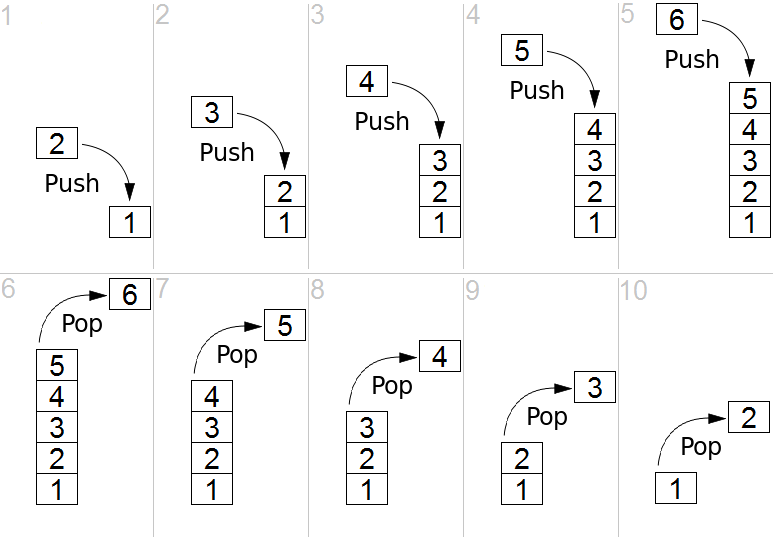
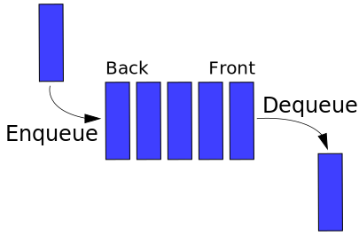

## 数据结构

常用的数据结构：

* 栈
* 队列
* 链表
* 树

### 栈

栈是一种"后进先出"（LIFO，Last In First Out）的抽象数据结构，具有两种主要操作:

* push，添加元素到栈的顶端(末尾)
* pop，移除栈最顶端(末尾)的元素

在 JS 中，通常采用数组类型及其 push、pop 方法模拟栈。



### 队列

队列是一种"先进先出"（FIFO，First In First Out）的抽象数据结构，具有两种主要操作:

- 入队，添加元素到队列的末尾
- 出队，移除队列最前端的元素

在 JS 中，通常采用数组类型及其 unshift、pop 方法模拟队列。



### 链表

链表是数据元素的线性集合，线性不是指物理存储而是逻辑关系，链表中的每个元素都有一个指向下一个元素的指针。

在 JS 中，通常使用对象模拟一个链表元素：

```
{
  	value: 'Link',		// 当前元素的值
  	next: obj					// 引用下一个对象 obj
}
```


### 树

树是一种抽象数据结构，由 n（n>0）个有限节点组成一个具有层次关系的集合，用以模拟具有树状结构的数据集合。之所以称之为树，是因为它的结构像一棵倒挂（根朝上，叶朝下）的树。它具有以下的特点：

* 没有父节点的节点称为根节点
* 每一个非根节点有且只有一个父节点
* 每个节点都只有有限个子节点或无子节点
* 除了根节点外，每个子节点可以分为多个不相交的子树
* 树里面没有环路 (cycle)


