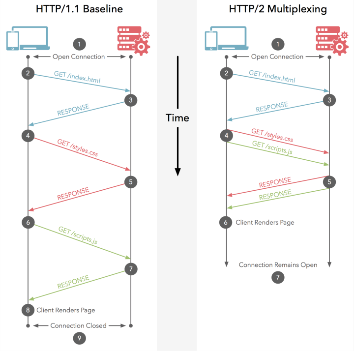
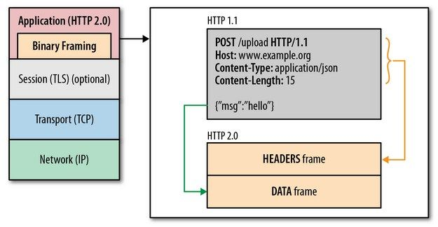

## 网络基础

在学习 TCP/IP 之前，有必要学习基础的网络知识。

### 网络发展

互联网发展大致可以分为三个阶段：

1. 单机模式
2. 多机通信
3. 物联网

#### 单机模式

计算机为密集计算而生，但早期的计算机体积庞大、价格昂贵，所以，一台计算机通常由多人共享。根据一台计算机采用何种技术处理多人任务，单机模式可以分为批处理和分时系统两个时代。

##### 批处理

时间：20世纪50年代

批处理，Batch Processing，事先将用户程序和数据装入卡带或磁带，由计算机按照先后顺序读取并处理，最后统一输出。


批处理技术的计算机特点：

* 操作复杂，通常需要专门的操作员
* 程序简单，通常一台计算机只支持特定的一种或几种程序，为了充分利用计算机，需要提前准备多个任务
* 没有交互，装入数据后只能被动等待输出结果

##### 分时系统

时间：20世纪60年代

分时系统，Time Sharing System，一台计算机与多个终端相连，采用 CPU 时间片轮转方案，轮流为每个终端用户服务。多个终端与主机形成面向终端的星形单机网状结构，这也是计算机网络结构的雏形。


分时系统技术的计算机特点：

* 多路性：多个终端可以同时操作计算机
* 独占性：不同终端相互独立，不会发生冲突、破坏、混淆等现象
* 交互性：终端用户和计算机可以随时交互
* 及时性：采用时间片轮转，用户可以很快得到计算结果

#### 多机通信

出于计算机之间共享数据的需要，而普通物理存储介质传递，如磁带、软盘等，又存在不便利的问题，计算机直接通信的探索开始发展。多机通信的整个进程可以分为计算机-计算网络、开放式标准化网络以及互联网的高速发展三个阶段。

##### 计算机-计算机网络

时间：20世纪70年代

多机通信早期，主要是一些有实力的公司独立推出自己的计算机互连系统，例如 IBM 的 SNA、DEC 的 DNA，但是这些系统只能在相应公司自己的硬件设备上实现计算机通信。


计算机-计算机网络的特点是：

* 没有统一的网络体系结构，难以实现真正意义上的互连

##### 开放式标准化网络

> ARPANET：Advanced Research Projects Agency Network，阿帕网
>
> ISO：International Organization for Standards，国际标准化组织
>
> OSI：Open System Interconnection，开放式系统互联通信
>
> OSI 参考模型，Open System Interconnection Reference Model，也称 OSI/RM、OSI 七层模型、OSI模型

时间：20世纪80年代

1983年，ARPANET 正式确定 TCP/IP 为通信协议；1984年，ISO 正式颁布 OSI 模型，并据此制定了 OSI 协议。从此，具有统一网络体系结构的计算机网络新时代开始到来。


##### 互联网的高速发展

时间：20世纪90年代以后

随着互联网的普及，其应用的领域不断扩大，适用于新场景的标准协议被不断完善，这又极大的促进了互联网的发展。


2000 年以后，我们开始进入以互联网技术为中心的时代，电话、电视、游戏机、家用电器以及其它电子设备均可以接入互联网。

与此同时，计算机病毒、信息泄露、网络欺诈等网络安全问题日益增多，人们对互联网的要求不再是单纯的建立连接，而是安全的建立连接...

#### 物联网

物联网，Internet of Things，缩写IoT，是基于互联网、传统电信网等信息承载体，让所有能行使独立功能的普通物体实现互联互通的网络。

如果说互联网的核心更多地强调人与人通过设备进行沟通，那么物联网则是人与人、人与物、物与物之间的交叉网状连接，最终实现万物互联。

### 网络分类

网络有多种分类方法：范围大小，有无连接、共享介质、数据交换、接收端数量。

#### 范围大小

基于范围大小，网络可以分为：局域网、城域网、广域网

##### 局域网

LAN，Local Area Network，局域网，某一区域内多台计算机互联形成的计算机网络

##### 城域网

> metropolitan /metrə'pɒlɪt(ə)n/ n. 大城市人、宗主国的公民 adj. 大都市的、宗主国的

MAN，Metropolitan Area Network，城域网，单个或多个城市内局域网互联形成的计算机网络，可以看作比较大的局域网

##### 广域网

WAN，Wide Area Network，广域网，又称外网、公网，不同地区局域网互联形成的计算机网络

#### 有无连接


基于数据发送前是否需要建立通信线路，传输方式可分为：面向有连接型、面向无连接型。

##### 面向有连接型

发送数据前，需要在收发主机之间建立一条连接线路，否则无法传送数据。例如，电话网。

##### 面向无连接型

发送数据时无需建立连接，发送端可以在任何时候自由发送数据，甚至不用去管接收端是否存在；而接收端，只需要随时确认是否收到数据。

#### 共享介质

基于多个设备是否共用一个通信介质，传输方式可分为：共享介质型、非共享介质型。

##### 共享介质型

共享介质型网络指多个设备共享一个通信介质的网络，例如，以太网、FDDI。


共享介质型网络由于共用同一个载波信道进行发送和接收，需要对介质进行访问控制，以使得同一时间只有一个设备使用载波信道。

##### 非共享介质型

非共享介质型网络指不共享介质，是对介质采用专用的一种传输控制方式。


这种方式中，每个节点直连交换机，由交换机转发数据帧。存在的弱点是，一旦交换机故障，与之相连的所有计算机将无法通信。

#### 数据交换

数据通过网络从源主机到达目标主机，要经过网络核心进行数据交换，网络核心解决的基本问题就是数据交换。基于数据交换传输方式，传输方式可分为：电路交换、报文交换、分组交换。


##### 电路交换

> circuit /'sɜːkɪt/ n. 电路、回路; v. 环行

电路交换，Circuit Switching，通信双方提前建立连接通道，通信过程中独占系统动态分配的资源（通道、带宽、时隙、码字等）直到通信结束的数据交换方式。所以，电路交换有三个明显的阶段：

1. 连接建立
2. 数据传输
3. 连接释放。

典型电路交换网络：电话网络。

电路交换的优点是：

* 通信时延小，通信线路专用，数据直达，传输数据的时延小
* 有序传输，通信时按发送顺序传送数据，不存在失序问题
* 没有冲突，不同的通信双方拥有不同的信道
* 适用范围广，既可用于传输模拟信号，又可用于传输数字信号
* 实时性强，连接一旦建立，双方可以随时通信
* 控制简单，电路交换的交换设备（交换机等）及控制均较简单

电路交换的缺点是：

* 建立连接时间长，平均建立连接时间相对于计算机通信来说太长
* 线路独占，使用效率低。连接建立后，物理通路被独占，即使通信线路空闲，也不能供其他用户使用
* 灵活性差，建立通路中的任何一点出了故障，就必须重新拨号建立连接
* 难以规格化，数据直达，不同类型、规格、速率终端很难互相通信，通信过程中也难以进行差错控制

##### 报文交换

报文交换，Message switching，携带有目的地址、源地址等信息的报文整个发送，一次一跳。

报文交换的优点是：

* 无需建立连接，无需预先建立专用的通信线路
* 动态分配线路，交换设备得到发送方报文时，先存储整个报文，然后选择一条合适的空闲线路，发送报文
* 提高线路可靠性，如果传输路径发生故障，可重新选择传输路径
* 提高线路利用率，通信双方不会独占通信线路，而是在不同的时间一段一段地部分占用这条物理通道
* 提高多目标服务，一个报文可以同时发送多个目的地址，这在电路交换中是很难实现的

报文交换的缺点是：

* 数据进入交换结点需经历存储再转发的过程，会引起转发时延（接受报文、检验正确性、排队、发送时间等）
* 报文交换将整个报文完整的发送出去，且对报文的大小没有限制，这就要求网络结点需要有较大的缓存空间

##### 分组交换

分组交换，也称为包交换，是指通信过程中将大数据分割成较小数据段进行传输的方法。每个数据段会附有一个包含源主机地址、目标主机地址、分组序号等控制信息的报文首部，带有首部的数据段称为分组或包 (Packet)。

当交换机收到分组之后，根据首部中的目标地址信息将分组转发到目的地。分组交换的本质就是存储转发，将接受的分组暂存下来，在目的方向路由上排队，当可以发送时，将信息发送到相应的路由上，完成转发。

报文首部应该写入哪些信息，如何处理这些信息，分组的发送方和接收方需要通过协议来保持一致的定义和解释。

分组交换的优点是：

* 无需建立连接，无需预先建立专用的通信线路
* 提高线路利用率，通信双方不会独占通信线路，而是在不同的时间一段一段地部分占用这条物理通道
* 简化了存储管理（相对于报文交换），分组的长度固定，相应的缓冲区的大小也固定，管理相对比较容易
* 加速传输，分组是逐个传输，可以使后一个分组的存储操作与前一个分组的转发操作并行，这种流水线方式减少了报文的传输时间。此外，传输一个分组所需的缓冲区比传输一次报文所需的缓冲区小得多，这样因缓冲区不足而等待发送的几率及时间也必然少得多
* 减少了出错几率和重发数据量，因为分组较短，其出错几率必然减少，所以每次重发的数据量也就大大减小，这样不仅提高了可靠性，也减少了传输时延。

分组交换的缺点是：

* 存在传输时延，尽管分组交换比报文交换的传输时延小，但相对于电路交换仍存在存储转发时延，而且其结点交换机必须具有更强的处理能力
* 需要传输额外的信息量。每个小数据块都要加上源/目的地址和分组编号等信息，从而构成分组，使传送的信息量大约增大5%~10%，一定程序上降低了通信效率，增加了处理的时间，使控制复杂，时延增加
* 当分组交换采用数据报服务时，可能出现失序，丢失或重复分组，分组到达目的结点时，要对分组按编号进行排序等工作，增加了复杂度。

#### 接收端数量

基于接收端的数量，传输方式可分为：单播、任播、多播、广播。


##### 单播

一对一通信，比如，固定电话通信。

##### 任播

一对特定范围内的一个通信，比如 DNS 根域名解析服务器。

##### 多播

一对数量**受限**的多个通信，比如电视会议。

##### 广播

一对数量**不受限**的多个通信，比如电视信号。

### 网络设备


#### 网卡

> 数据链路，Datalink，指直接连接的设备之间进行通信所涉及的协议及其网络。

网络接口控制器，Network Interface Controller，NIC，又称网络适配器（network adapter）、网卡（network interface card），或局域网接收器（LAN adapter）。

网卡工作于数据链路层，是局域网中连接计算机和传输介质的接口，不仅能实现与局域网传输介质之间的物理连接和电信号匹配，还涉及帧的发送与接收、帧的封装与拆封、介质访问控制、数据的编码与解码以及数据缓存的功能等。

#### 电缆

> fiber /'faɪbɚ/ n. 光纤、纤维
>
> integrated /'ɪntɪɡretɪd/ adj. 综合的；完整的；互相协调的

电缆有很多种，包括双绞线电缆、光纤电缆、同轴电缆、串行电缆等。电缆类型的选用取决于数据链路的不同，不同的数据链路选用的通信媒介如下。

其中，需要注意的是：以太网、无线、ATM、FDDI、帧中继、ISDN都是计算机局域网技术，对应于 OSI 模型的数据链路层；尤其是以太网，尽管也会被用于泛指以太网技术实现的局域网，但其核心依旧是一种用于数据链路层的计算机局域网技术，与通过范围划分的广域网、局域网概念有本质的不同。


#### 中继器

中继器，Repeater，是工作在物理层的连接设备，适用于完全相同的两类网络的互连，主要功能是通过对数据信号再生还原后重新发送或转发，来扩大网络传输的距离。 


#### 网桥/2层交换机

网桥，也称桥接器，是早期工作于数据链路层的两端口二层网络设备，所以也叫二层交换机，用来连接不同网段。


以太网等网络中使用的交换集线器，基本上也属于网桥的一种，其连接电缆的每个端口都提供类似网桥的功能。


网桥的作用是：

* 转发数据帧，本身并不具备修改数据帧的能力，所以，只能连接相同或相似的网络（相同或相似结构的数据帧），如以太网与以太网、以太网与令牌环（token ring）；对不同类型的网络，数据帧结构不同，如以太网与 X.25 之间，网桥就无能为力了
* 通过地址自学机制和过滤功能控制网络流量。

网桥扩大了网络规模，提高了网络性能，给网络应用带来了方便。但网桥也存在问题：

* 广播风暴，网桥不阻挡网络中广播消息，当网络的规模较大时（几个网桥，多个以太网段），有可能引起广播风暴（broadcasting storm），导致整个网络全被广播信息充满，直至完全瘫痪
* 当与外部网络互连时，网桥会把内部和外部网络合二为一，成为一个网，双方都自动向对方完全开放自己的网络资源，这种互连方式在与外部网络互连时显然是难以接受的

问题的主要根源是网桥只是最大限度地沟通网络，不管传送的信息是什么。所以，网桥在早期使用较多，现在网桥被具有更多端口、同时也可隔离冲突域的交换机（Switch）所取代。

#### 路由器/3层交换机

路由器，是工作于 OSI 模型第 3 层网络层的设备，用于连接两个网络，并对分组报文进行转发的设备。网桥根据物理地址（MAC地址）进行处理，而路由器/3层交换机则根据 IP 地址进行处理。


路由器只转发 IP 分组，把其余部分挡在网内（包括广播），以保持各个网络相对的独立性，这样可以组成具有许多子网互连的大型网络。

路由器的作用是：

* 由于工作于网络层，可以连接不同的数据链路，例如两个以太网，或者一个以太网一个 FDDI，只要网络层运行的是 IP 协议
* 分担网络负荷，甚至还具备一定的网络安全功能

#### 4~7层交换机

4~7层交换机负责处理 OSI 模型从传输层到应用层的数据。如果用 TCP/IP 分层模型来描述，4~7层交换机就是以 TCP 等协议的传输层及其以上的应用层为基础，分析收发数据，并对其进行特定的处理。


例如，在并发访问量非常大的 WEB 应用中，通常使用服务器集群的方式来分担负荷。不过，为了通过一个 URL 将访问分发到集群中不同的服务器，通常在入口处添加负载均衡器，这种负载均衡器就是 4~7 层交换机的一种。

#### 网关

网关是 OSI 模型中负责将从传输层到应用层的数据进行转发和转换的设备，与4~7层交换机一样，都是处理传输层以上的数据，但不同的是，网关不仅转发数据，还负责对数据进行转换。它通常使用一个表示层或应用层网关，在两个不能进行直接通信的协议之间进行翻译，最终实现两者之间的通信。


例如，互联网邮件和手机邮件，由于在表示层和应用层的“电子邮件协议”不同导致两者互不兼容，但是通过网关提供转换服务，使两者兼容互通。另外，防火墙也是一款通过网关通信，针对不同应用提高安全性的产品。


### 网络地址

网络通信中，每层协议使用的地址不尽相同，比如电子邮件地址、IP 地址、MAC 地址等。可以从地址的两个特性来描述它们：唯一性和层次性。

#### 唯一性

一个地址必须唯一表示一个对象，互不相同。

#### 层次性

当地址具有层次性时，可以提高地址的查询效率。其中：

- IP 地址，具有层次性，IP 地址由网路号和主机号两部分组成，网路号相同意味着处于同一网段
- MAC 地址，不具有层次性，MAC 地址由设备厂商基于国际规范赋予不同的设备唯一的 MAC 地址，但是设备可以应用在任何地方

### 网络构成

计算机网络主要由三部分构成：

* 核心网/骨干网：核心网络配置，常用设备有高速路由器、光纤等，专注于提高网络传输性能和生存性
* 边缘网络：常用设备多为 2 层交换机或 3 层交换机，专注于实际业务
* 接入层/汇聚层：连接核心网和边缘网络的部分


核心网相当于现实中的高速公路，边缘网络相当于省内、市级、乡村公路，接入层相当于高速路入口收费站。通常，接入层由 ISP（Internet Service Provider，互联网服务提供商）实现，个人用户通过 ISP 接入互联网。


## 网络协议

> engineering /endʒɪ'nɪərɪŋ/ n. 工程，工程学
>
> IETF：Internet Engineering Task Force，国际互联网工程任务组

主流的网络通信协议有 ISO 制定的 OSI 协议和 IETF 制定的实际中应用最广泛的 TCP/IP 协议。

### OSI协议

1984年，ISO 制定了通信系统标准化方案 OSI 参考模型，并以此为基础，制定了界定每层协议和各层之间接口标准的 OSI 协议。尽管 OSI 协议并未得到普及，但作为指导方针的 OSI 参考模型却常被用于其它协议的制定以及学习理解中，比如由 OSI 七层模型演化而来的 TCP/IP 五层模型。

#### 基本简介

OSI 参考模型将通信协议中必要的功能分为七层，每个分层接受其下一层提供的服务，并同时为自己的上一层提供服务。相邻两层交互时遵循的约定叫做”接口“，发送端和接收端的同层之间交互时遵循的约定叫做”协议“。

OSI 参考模型的分层过于理想化，其希望实现七层的所有模块，以组合起来实现网络通信。这种分层的优点是：

- 每个分层内聚性强，即使单个分层内部发生变化，也不会波及整个系统，可以构建一个扩展性和灵活性都非常强的系统
- 分层可以细化通信系统功能，每个分层的协议易于实现

缺点是：

- 过分模块化，使处理变得更加沉重
- 每个模块重复实现部分相似的处理逻辑

#### 七层模型


在 OSI 参考模型中，数据传输路线如上图，其中：

- 发送端从第7层到第1层，接收端从第1层到第7层
- 发送端的每个分层将接收的上一层的包作为自己的数据，并附加当前层协议所需首部信息，而接收端可以分离相应的首部信息
- 中间网络设备，如图中路由器，往往是在某一个特定的层上进行数据处理，同样需要将数据转换到特定的层格式，如图中先从物理层 → 数据链路层 → 网络层，然后从网络层 → 数据链路层 → 物理层

下面，通过一封邮件的发送学习  OSI 参考模型中每层的作用及处理细节。

##### 应用层

第7层，制定应用程序协议，即规定应用程序中通信相关的细节，包括电子邮件、文件传输、远程登录等协议。


电子邮件软件在功能上可以分成两部分：

- 通信无关的部分
  - 发送端，支持用户编辑和发送邮件
  - 接收端，支持用户接收和阅读邮件
- 通信相关的部分
  - 发送端，发送时进入应用层协议处理，在传送数据前端附加包含邮件内容、接收人等内容的首部信息
  - 接收端，接收时进入应用层协议处理，分析数据首部得到数据正文

##### 表示层

第6层，数据格式的转换，如加密解密、转换翻译、压缩解压缩等，即将上一层应用处理的信息转换为与接收端系统格式兼容并适合网络传输的格式 ↓ ，或者将下一层的数据转换为上一层能够处理的格式 ↑ 。


表示层关注数据的具体表现形式，发送端和接收端使用软件或操作系统的不同都可能导致数据在应用程序中的表现形式不同，即从应用层获取的数据编码格式不一致，例如，普通文字流就有 ISO、UTF-8、UTF-16等编码格式，需要将数据在主机特有的格式与网络标准传输格式之间进行转换。

表示层会附加数据编码格式等首部信息。

##### 会话层

第5层，负责建立、管理和维护会话（数据流动的逻辑通路）。


何时建立连接和发送数据，采用何种方式发送数据，例如多封邮件是一封邮件一个连接，还是多封邮件使用同一连接，均由会话层决定。

会话层会附加数据传送顺序等内容的首部信息。

##### 传输层

第4层，管理源节点和目标节点之间的数据传输，建立或断开连接，在必要时对数据进行分割，负责数据被可靠地（TCP）/不可靠（UDP）传输到目标地址。


会话层只对何时以何种方式发送数据进行管理，会话层的处理往往是逻辑上的，真正建立起传输数据的连接是传输层的职责。

传输层使用 TCP 时，保证传输的可靠性是传输层的重要职责之一，比如，部分数据由于某种原因未能准确地被目标主机接受，发送端传输层在得到这一消息后，会将相应部分数据再次发送给目标主机。

传输层会附加用于辨识传输层数据的首部信息。

##### 网络层

第3层，网络寻址与路由选择，建立源地址和目标地址之间的完整传输通道。


##### 数据链路层

> MAC 地址，Media Access Control Address，媒介访问控制地址，也叫物理地址或硬件地址，唯一确定网络设备位置的地址。

第2层，数据帧的生成与接收。即接受来自物理层的位流形式的数据，并封装成帧，传送到上一层；或者，将来自上一层的数据帧，拆装为位流形式的数据转发到物理层；并且还负责处理接受端发回的确认帧的信息，以便提供可靠的数据传输。

该层通常又被分为两个子层：

* 介质访问控制（Media Access Control，MAC）子层的主要任务是解决共享型网络中多用户对信道竞争的问题，完成网络介质的访问控制。
* 逻辑链路控制（Logical Link Control，LLC）子层的主要任务是建立和维护网络连接，执行差错校验、流量控制和链路控制。


一个传输路线上，会有很多个中间设备，网络层负责将整个数据发送到最终的目标地址，而数据链路层需要在通过传输介质直连的两个设备之间处理数据。即网络层负责发送端至接收端的整个线路，而数据链路层负责单个区间。

就像似一场长途旅行，网络层类如一张从杭州 -> 南京 -> 济南 -> 北京 -> 西藏整个计划的完整行程表，而数据链路层就像杭州 -> 南京、南京 -> 济南、济南 -> 北京的高铁票，北京 -> 西藏的飞机票让你按计划完成整个行程。

数据链路层会附加 MAC 地址等内容的首部信息。

##### 物理层

> 透明传输：不管传的是什么，所采用设备只起一个通道作用，把要传输的内容完好的传到对方！

第1层，通过物理设备，如双绞线、光纤等，透明传输 0、1 比特流。


数据链路层封装的数据帧最终需要在传输介质中进行传输，物理层通过将数据 0、1 转换成电压的高低、光的闪灭、电波的强弱等信号在介质中传递。

### TCP/IP协议

TCP/IP，全称 TCP/IP 协议族 (TCP/IP Protocol Suite 或 TCP/IP Protocols) 或者 TCP/IP 协议栈 (TCP/IP Protocol Stack)，是网络多层模型中所有协议的集合，也是互联网的基础通信架构。之所以用 TCP、IP 两个协议来指代整个集合，是因为：

- TCP 和 IP 协议是两个最核心的协议
- TCP 和 IP 协议是两个最早通过的标准

#### 发展历程

> department n. 部、部门、系、科、局

TCP/IP 协议是伴随着互联网的发展壮大而一起发展起来的。

20世纪60年代，美国国防部（The Department of Defense，DoD）出于通信可靠性的目的，开始研究一种即使一处或多处连接遭到破坏，依然可以经过迂回线路实现最终通信的方式，分组交换技术因此应运而生。


1969年，为验证分组交换技术，DoD 和美国西海岸的几所大学和研究所开始搭建一套相互连接的小型网络 - - ARPANET（Advanced Research Projects Agency Network，阿帕网），这也是全球互联网的鼻祖。随着整个网络的不断壮大，分组交换技术得到充分验证。与此同时，在互联计算机之间提供可靠传输的综合性通信协议的实验也获得成功。

20世纪70年代前半叶，ARPANET 中的一个研究机构发布了 TCP/IP。

1982年，TCP/IP 具体规范最终被确定下来。

1983年，ARPANET 正式确定 TCP/IP 为通信协议。

在此之后，不论是局域网还是广域网，都开始倾向于使用 TCP/IP。

所以，TCP/IP 协议能击败 OSI 协议成为主流互联网通信协议的原因在用：

- 实用性，TCP/IP 是随着互联网的发展逐渐成长的，普遍是先验证后确立，甚至一些协议已经在设备中运行了才确定具体规范，而 OSI 协议基本是先确立后实现
- 开放性，TCP/IP 由任何人都可以参与讨论的 IETF 制定，协议实施过程中出现问题可以快速反馈、讨论并修改协议，以应对技术的快速革新
- 主流操作系统的支持，尤其是早期普遍采用的 UNIX系统，以及后来的 Windows 和 MacOS

TCP/IP 协议标准化的过程，大致经历互联网草案 → 提议标准  → 草案标准  → 真正标准四个阶段。从提议标准阶段开始，协议就会被列入 RFC （Request For Comment，征求意见表）。

#### 完整图示


#### 五层模型

TCP/IP 协议本身只有协议，没有分层模型，其分层模型是从 OSI 模型借鉴而来，以方便协议本身的学习。


TCP/IP 模型与 OSI 模型的主要区别是：

* 分层级数、名称和细节上的差别
  * OSI 模型是七层，但是 TCP/IP 协议提出时网络设备之间已经实现了通信， 所以其只制定了应用层、传输层和网络层的协议规范，网络层以下的规范不在协议组中。也正是因为网络层以下分层的灵活性，TCP/IP 模型的分层有四层和五层两种说法：
    * 四层，由于数据链路的不同直接决定了物理通信介质的选用，而物理传输介质功能单一，可弱化甚至忽略，所以，将网络层以下功能视为一个层 - 网络接口层的话，是四层
    * 五层，严格按照 OSI 模型将网络层以下划分为数据链路层 + 物理层的话，是五层（个人学习按照五层结构）
  * 传输层以下的名称有差异，但是习惯上还是使用 OSI 参考模型的名称：网络层、数据链路层、物理层
* OSI 模型注重“通信协议必要的功能是什么”，TCP/IP 模型更强调“在计算机上实现协议应该开发哪种程序”
  * 应用层相当于 OSI 模型中的应用层 + 表示层 + 会话层，统一由应用程序实现
  * 传输层和网络层由操作系统实现
  * 数据链路层和物理层通过设备驱动程序和网络接口实现
* TCP/IP 模型作为舶来品，与其本来的协议体系可能并不完全契合
  * 比如，SSL/TLS 协议所属分层就比较难以界定，后文会详细学习

##### 应用层 

第5层，由应用程序集中实现 OSI 模型中的应用层 + 表示层 + 会话层的功能，这些功能可以由一个程序也可以由多个程序完成。

TCP/IP 协议中的应用程序普遍采用客户端/服务端架构。

常见应用程序：

- WWW
  - HTTP：客户端浏览器与服务器的通信协议，属于 OSI 模型中应用层协议
  - HTML：客户端浏览器与服务器数据传输的主要格式，属于 OSI 模型中表示层协议
- 电子邮件
  - SMTP：Simple Mail Transfer Protocol，简单邮件传输协议
- 文件传输
  - FTP：File Transfer Protocol，文件传输协议
- 远程登录
  - TELNET：远程终端协议
  - SSH：Secure Shell，安全外壳协议
- 网络管理
  - SNMP：Simple Network Management Protocol ，简单网络管理协议

##### 传输层

第4层，传输层最重要的功能就是让应用程序之间实现通信。计算机中，同一时间进行着多个不同程序的通信，通过端口号识别不同程序的通信。

传输层使用的协议：

- TCP，Transmission Control Protocol，传输控制协议
- UDP，User Datagram Protocol，用户数据包协议

##### 网络层

第3层，网络层使用 IP 协议，IP 协议基于 IP 地址转发分包数据，接入互联网的主机和路由器都必须实现 IP 功能。

IP 包生成后，参考路由控制表（参见《网络层 - 路由控制 - 路由表》）决定接受此 IP 包的路由或主机。随后，IP 包将被发送给连接这些路由器或主机网络接口的驱动程序，以实现真正地发送数据。不知道接收端 MAC 地址时，可使用 ARP 查找。只要知道了对端的 MAC 地址，就可以将 MAC 地址和 IP 地址交给以太网的驱动程序，实现数据传输。

网络层使用的协议：

- IP，Internet Protocol，网际协议
  - 使用 IP 地址作为主机标识，跨网传送数据包
  - 分组交换的一种协议，不具有重发机制，属于非可靠性协议
- ICMP，Internet Control Message Protocol，互联网控制消息协议
  - 当 IP 协议数据包无法正常到达目标地址时，使用 ICMP 通知发送端
- ARP，Address Resolution Protocol，地址解析协议
  - 从分组数据包的 IP 地址中解析出物理地址（MAC地址）的一种协议

##### 数据链路层

> 固件，一种嵌入在硬件设备中的软件。

第2层，数据包通过数据链路从一个设备的网络层传输到另外一个设备的网络层。这个过程能够在网卡的驱动程序中控制，也可以在固件或者专用芯片中控制。

驱动程序是软（操作系统）硬件之间的桥梁，外部硬件设备连接到计算机时，还需要相应的驱动程序才能正常的工作。

##### 物理层

第1层，负责数据传输的硬件，这种硬件相当于以太网或电话线路等物理层的设备。

#### 数据序列

在分层处理中，来自上一层的包作为本层的数据，在附加了本层的首部后传递给下一层。附加首部包含相应层的必要信息，如源地址、目标地址及协议相关信息等。


##### 数据结构

最终，经由物理层传输的数据具体结构如图（以以太网为例）。


* 分层处理中，数据前部被先后顺次添加应用自己的包首部、TCP/UDP 首部、IP 包首部、以太网包首部；数据后部被添加以太网尾
* 每个包首部中至少包含两个信息：
  * 发送端和接收端地址，因为经过每个协议分层时，都必须有识别包发送端和接受端地址的信息：
    * 数据链路层，以太网用 MAC 地址
    * 网络层，IP 模块用 IP 地址
    * 传输层，TCP/UDP 模块用端口号
    * 应用层，即便在应用程序中，像电子邮件也有独一无二的邮件地址标识
  * 上一层的协议类型，每个分层包首部中还包含一个用以标识其上一层协议种类的识别位：
    * 数据链路层，以太网包首部中的以太网类型用以标识网络层协议
    * 网络层，IP 包首部中的协议类型用以标识传输层是 TCP 还是 UDP
    * 传输层，TCP/UDP 首部中的端口号用以标识使用端口号的应用程序
    * 应用层，应用首部中有时也会包含用于识别应用数据类型的标签

##### 处理过程

具体各分层对数据的处理过程如图（以发送邮件为例）。


###### 发送端

1. 应用程序
   * 可能对数据内容（比如用户邮件内容）进行编码（如UTF-8）处理，相当于 OSI 表示层功能
   * {应用首部 + 应用数据} 被发送给 TCP 模块

2. TCP 模块
   * 将接收到来自应用程序的 {应用首部 + 应用数据} 作为自己的数据，附加一个 TCP 首部，其中包括源端口号和目标端口号（用以识别发送主机和接受主机使用相应端口的程序）、序号（识别数据包顺序）、校验和（Check Sum，判断数据是否被损坏的方法）
   * {TCP 首部 + 应用首部 + 应用数据} 发送给 IP 模块

3. IP 模块
   * 将接收到 {TCP 首部 + 应用首部 + 应用数据} 作为自己的数据，并附加 IP 首部，其中包括发送端 IP 地址、接收端 IP 地址、数据协议类型（其后部数据是 TCP 或者 UDP ）
   * 如果不知道接收端的 MAC 地址，可以利用 ARP 查找
   * {IP 首部 + TCP 首部 + 应用首部 + 应用数据} + MAC 地址发送给驱动程序

4. 网络接口（以以太网为例）

   * 将接收到 {IP 首部 + TCP 首部 + 应用首部 + 应用数据} 作为自己的数据，并附加以太网首部，其中包括发送端 MAC 地址、接收端 MAC 地址、以太网类型标识 (标识 IP 包还是 ARP 包)

   * 同时，以太网还会在包最后附加存放 FCS 的以太网 Trailer

     > FCS（Frame Check Sequence，帧检验序列。使用方法：
     >
     > 首先，发送网卡利用多项式计算，称循环冗余校验（CRC)，将计算结果写入 FCS 字段
     >
     > 然后，接收方收到这个帧，对其做相同的 CRC 计算；如果计算结果与接收的 FCS 字段值相同，则表示帧没有发生错误，如果不同，则视为帧发生错误，接收方丢弃这个帧

   * {以太网首部 + IP 首部 + TCP 首部 + 应用首部 + 应用数据 + 以太网 Trailer} 发送给物理硬件层进行传递

###### 接收端

5. 网络接口（以以太网为例）
   * 收到以太网包，比对以太网首部中的接收端 MAC 地址是否是自己的 MAC 地址，否，则丢弃
   * 是，则继续检查以太网首部中的以太网类型域，如果标识数据为 IP 包，则传递给处理 IP 的子程序；如果是 ARP 包，则传递给处理 ARP 的子程序；如果标识类型无法识别，丢弃

6. IP 模块
   * 比对 IP 首部中的接收端 IP 地址与自己的是否匹配，否，则丢弃
   * 是，则继续检查 IP 首部中的协议类型域，如果标识为 TCP 协议，传递给 TCP 模块；如果标识为 UDP 协议，传递给 UDP 模块
   * 对于中间路由器，接收端地址往往不是自己的地址，此时，需要借助路由控制表，转发数据到正确的主机或路由器

7. TCP 模块
   * 首先，获取 TCP/UDP 首部，计算校验和，判断数据是否被破坏；检查序号，判断数据次序；检查端口号，确定数据对应的正确应用程序
   * 然后，发送一个“确认回执”给发送端，如果发送端未接收到回执，则会认为接收端未接收到数据，并重复发送数据
   * 最后，数据被完整接收，传递给端口号对应的应用程序

8. 应用程序
   * 解析得到发送端发送的应用数据

## 数据链路层

数据链路，可以指 OSI 模型中的数据链路层，也可以用来指以太网、无线局域网等通信手段。

数据链路层的主要作用是在同种数据链路的端节点间进行包传递，其协议规定传输媒介连接设备之间的通信规范。

数据链路层及物理层协议是在其他规范中制定的，不包含在 TCP/IP 协议族内，但它们是 TCP/IP 协议的基础。

### 相关技术

#### MAC 地址

> Ethernet /'iθɚnɛt/ n. 以太网

MAC 地址，Media Access Control Address，媒体访问控制地址，也称局域网地址（LAN Address）、以太网地址（Ethernet Address）或物理地址（Physical Address），是用来标识一个网络设备的地址。

MAC 地址的特点是：

* 长48比特
  * 第1位：单播（0）/多播地址（1）
  * 第2位：全局（0）/本地地址（1）
  * 3~24位：厂家编码，IEEE 分配，互不相同
  * 25~48位：产品编码，厂家保证，互不相同
* 常烧置于 ROM 中，有的可通过驱动程序或其它工具修改，如网卡 MAC 地址；有的不允许更改，如手机、平板电脑
* 并不总是唯一的，例如一台主机启动的多个虚拟机中的虚拟网卡 MAC 地址是由软件设定的，难免会与其它设备的 MAC 地址相同，不过，相同 MAC 地址设备只要不在同一个数据链路就不会有问题

#### 介质访问控制

对于共享介质型网络，介质访问控制方式有两种：争用方式和令牌传递方式。

##### 争用方式

> carrier /'kærɪɚ/ n. 载体、载波
>
> sense /sens/ n. 感觉、功能、观念 v. 感觉到、检测
>
> collision /kə'lɪʒən/ n. （意见，看法）的抵触，冲突

争用方式，是指争夺数据传输的权利，也叫载波监听多路访问（Carrier Sense Multiple Access，CSMA）。基本原理是数据链路中的节点采用先到先得的方式占用信道发送数据。存在的问题，如果多个站同时发送帧，则会产生冲突，导致网络拥堵与性能下降。

改良 CSMA 的一种方式 - CSMA/CD（Carrier Sense Multiple Access with Collision Detection，载波侦听多路访问/碰撞检测），每个节点提前检查冲突，一旦发生冲突，则尽早释放信道。其基本原理：

* 检查无冲突，则发送数据
* 检查有冲突，放弃发送数据，同时立即释放载波信道；随机延时一段时间后，再次争用介质

##### 令牌传递方式

> 令牌环网络，一种环形局域网拓扑，通过使用令牌使网内设备以不冲突的方式共享介质。

令牌传递方式是沿着令牌环发送一种叫做“令牌”的特殊报文，只有获得令牌的节点才能发送数据。

不过，令牌环是 IBM 公司技术，并未普及，随着以太网的普及，令牌环网和技术已很少使用。

### 链路类型

#### 以太网

目前应用最普遍的局域网技术，取代了其他局域网标准如令牌环、FDDI 和 ARCNET；IEEE 的 IEEE 802.3 标准制定了以太网的技术标准，包括物理层的连线、电子信号和介质访问层协议的内容。

#### 无线通信

使用电磁波、红外线、激光等方式传播数据的数据链路，如蓝牙、WIFI

#### ATM

ATM，Asynchronous Transfer Mode，异步传输模式，又叫信元中继，采用电路交换的方式，以信元 (cell) 为传输单位，每个信元长53字节，其中报头占5字节。既具有电路交换的“有连接”服务和质量保证，又保持了以太网、FDDI 等传统网络中带宽可变、适于突发性传输的灵活性，从而成为适用范围最广、技术最先进、传输效果最理想的网络互联手段。

#### FDDI

FDDI，Fiber Distributed Data Interface，光纤分布式数据接口，在光缆上发送数字信号的一组协议，派生自IEEE 802.4 协议。主要缺点是价格贵，只支持光缆和部分电缆，所以使用环境受到限制。

#### 帧中继

帧中继，frame relay，以帧为单位的数据传输技术，正逐渐被ATM、IP等协议（包括IP虚拟专用网）替代。

#### ISDN

ISDN，Integrated Services Digital Network，综合业务数字网，是一个数字电话网络国际标准，典型的电路交换网络系统，以及欧洲普及的电话网络形式。

#### HDMI

> definition n. 定义；[物] 清晰度；解说

HDMI，High Definition Multimedia Interface，高清多媒体接口，是一种全数字化视频和声音发送接口，其特点是：

* 可以发送未压缩的音频及视频信号
* 可以同时发送音频和视频信号，由于音频和视频信号采用同一条线材，大大简化系统线路的安装难度

## 网络层

网络层的主要作用是实现终端节点之间的通信，即点对点（end-to-end）通信。

网络层通信是面向无连接的，由面向有连接的传输层 TCP 协议保证其可靠性，比如数据是否到达、是否正确等。

TCP/IP 的核心是网络层，该层的主要协议有：

* IP，Internet Protocol，网际协议，
* ICMP，Internet Control Message Protocol，互联网控制消息协议
* ARP，Address Resolution Protocol，地址解析协议

### 基本功能

IP 大致分为三大作用模块：IP 寻址、路由控制、分包与组包。

#### IP 寻址

在计算机点对点通信中，必须有一个地址标识符来识别通信对端，在 IP 协议中使用的标识符是 IP 地址。TCP/IP 协议中的所有主机或路由器都有自己的 IP 地址。

##### IPv4 地址

最初的 IP 地址就是 IPv4 地址。

###### 定义

IPv4 地址由 32 位二进制整数构成，每 8 位为一组，分为 4 组，以“.”分割。例如：

```
10101100.00010100.00000001.00000001   (2进制，计算机内部使用)
172     .20      .1       .1          (10进制，便于人类阅读)
```

###### 组成

IPv4 地址由网络标识和主机标识两部分唯一标识：

* 网络标识/地址

  用以标识若干主机集合所属的网段，每个网段拥有唯一的网络标识。IP 包转发途中的路由就是利用网络标识进行路由的。

  网络标识相同的主机必须位于同一个网段，相互之间不需要路由器连接就能直接通信。网络标识相同的主机组成的网络称为本地网络；网络标识不同，即不同网段主机之间通信必须通过路由器，网络标识不同的计算机称之为远程计算机。

* 主机标识/地址

  用以标识同一网段中的不同主机，所以，相同网段的不同主机拥有相同的网络标识和唯一的主机标识。


###### 分类

主要基于网络标识和主机标识两部分位数的不同，IPv4 地址被分为 5 类：


* A类：前 8 位为网络标识且以 0 开头，后 24 位为主机标识，可分配网址范围为：

  ```
  00000000.00000000.00000000.00000000 ~ 01111111.111111111.11111111.11111111
  0.0.0.0 ~ 127.255.255.255
  ```

  可以标识 128 个网段，每个网段最多拥有 256 \* 256 \* 256 - 2 = 16,777,214 个地址

* B类：前 16 位为网络标识且以 10 开头，后 16 位为主机标识，可分配网址范围为：

  ```
  # 2^7^ = 128
  10000000.00000000.00000000.00000000 ~ 10111111.111111111.11111111.11111111
  128.0.0.0 ~ 191.255.255.255
  ```

  可以标识 64 * 256 = 16,384 个网段，每个网段最多拥有 256 * 256 - 2 = 65,534 个地址

* C类：前 24 位为网络标识且以 110 开头，后 8 位为主机标识，可分配网址范围为：

  ```
  # 2^7^ + 2^6^ = 128 + 64 = 192
  11000000.00000000.00000000.00000000 ~ 11011111.111111111.11111111.11111111
  192.0.0.0 ~ 223.255.255.255
  ```

  可以标识 32 \* 256 \* 256 = 2,097,152 个网段，每个网段最多拥有 256 - 2 = 254 个地址

* D类：地址以 1110 开头，但网络标识和主机标识位数未定义，常用于多播，可分配网址范围为：

  ```
  # 2^7^ + 2^6^ + 2^5^ = 128 + 64 + 32 = 224
  11100000.00000000.00000000.00000000 ~ 11101111.111111111.11111111.11111111
  224.0.0.0 ~ 239.255.255.255
  ```

  可以标识 16 \* 256 \* 256 \* 256 = 268,435,456 个**IP 地址**

* E类：地址以 1111 开头，但网络标识和主机标识位数未定义，保留用于使用和开发，可分配网址范围为：

  ```
  # 2^7^ + 2^6^ + 2^5^ + 2^4^ = 128 + 64 + 32 + 16 = 240
  11110000.00000000.00000000.00000000 ~ 11111111.111111111.11111111.11111111
  240.0.0.0 ~ 255.255.255.255
  ```

其中，IP 地址的主机标识部分不能全部为 0 或全部为 1，这两个特殊值保留用于以下特殊用处，所以每类 IP 地址中每个网段可容纳的最多主机标识数均需减去2.

* 全部为 0：用以表示该网段的网络标识，或在 IP 地址不可获知时使用
* 全部为 1：通常用作广播地址

最后，可以发现 A类、B类、C类、D类、E类 IP 地址是五个连续且互不相交的地址区间，五个区间的并集即是 32位二进制可表示的整个范围。当遇到 IP 地址时，只要比对第一组（第一个点之前）数字便可确定其所属分类，即 IPv4 地址本身便隐含着自己所属的类别，例如：

* 172.0.0.1，128 < 172 < 192，B 类 IPv4 地址
* 220.0.0.8，192 < 220 < 224，C 类 IPv4 地址

网络标识相同的计算机必须属于同一链路，但在实际网络架构中，一个链路上连接的主机数量一般并不会达到容量上限，例如，一个 B 类网段链路可能并不会存在 65,534 台主机。所以，对网络标识（尤其是 A类和 B类）和单个分类可容纳主机数量都十分有限的 IP 地址而言，如何减少这种浪费，有效利用有限的 IP 地址数量容纳更多的主机呢？

发展思路大致经历以下四个阶段：基本子网、CIDR子网、私有地址和 IPv6 地址。

##### 基本子网

IPv4 地址起初是两层结构：网络 -> 主机。子网是将主机标识再次分割成子网标识 + 主机标识两部分，使原来的两层结构变成三层结构：网络 -> 子网 -> 主机。

原本只有两部分组成的 IPv4 地址，通过地址本身特征识别其分类后，可进而获取网络标识和主机标识。但存在三个部分时，虽然依旧可以通过地址本身特征识别其分类后得到网络标识， 但如何从剩余部分中获取子网标识和主机标识？通过子网掩码！

**子网标识相同的 IP 地址也必须位于同一链路吗？需查证。**

###### 掩码

> mask n. 面具、口罩、掩饰 v. 掩饰

掩码，Mask，是一串二进制数字，通过与目标数字的按位操作，达到屏蔽指定位的目的。

###### 子网掩码

子网掩码，是一种用来指明 IP 地址子网标识和主机标识的掩码。其规则是：

* 同 IPv4 地址相似，由 4 组 x 8 位 = 32 位的二进制数字组成
* 二进制 1 指示网络标识位和子网标识位
* 二进制 0 指示主机标识位

子网掩码的表示方法有两种：

* 地址表示法 - 与 IP 地址相似，用“.”分割的 4 组数字表示

  ```
  11111111.10000000.00000000.00000000 (2进制)
  255.126.0.0 (10进制)
  ```

* 后缀表示法 - 用“/二进制1位数”的后缀方式表示

  ```
  172.20.100.52/26 (前26位为网络标识+子网标识位)
  ```

对于 A类、B类和C类网络，因为不需子网标识位，则其默认的子网掩码为：

*  A类

  ```
  11111111.00000000.00000000.00000000
  255.0.0.0
  ```

*  B类

  ```
  11111111.11111111.00000000.00000000
  255.255.0.0
  ```

*  C类

  ```
  11111111.11111111.11111111.00000000
  255.255.255.0
  ```

例如，主机存在以下 IPv4 地址和子网掩码：

```
10011010.01000111.10010110.00101010
154.71.150.42

11111111.11111111.11111000.00000000
255.255.248.0
```

1. 网络标识

   IP 地址以 10 开始，为 B 类地址，所以前 16 位为网络标识，故其网段为：

   ```
   154.71.0.0
   ```

2. 子网标识

   子网掩码有 21 个二进制 1，网络标识占用 16 个，剩余 5 个，对应位的 IP 地址数字 10010（18） 即为子网标识 。获取子网地址的方式，将 IP 地址与子网掩码的二进制表示进行按位与（&）操作，得到的二进制表示对应的 IP 地址即为子网地址：

   ```
   10011010.01000111.10010110.00101010
   11111111.11111111.11111000.00000000
   
   10011010.01000111.10010000.00000000
   154.71.144.0  (子网地址)
   ```

   快速计算子网地址技巧：

   ```
   # 例如，存在 IP 地址
   154.71.150.42/19
   
   # 8 位二级制每位对应十进制
   10000000 - 128
   1000000 - 64
   100000 - 32
   10000 - 16
   1000 - 8
   100 - 4
   10 - 2
   1 - 1
   
   # 16 < 19 < 24，网络标识 + 子网标识截止位在第三组，故前两组不变
   154.71.0.0
   
   # 19 - 16 = 3，第三组前三位依旧是网络/子网标识
   第 17 位：150 > 128，该位为 1
   第 18 位：150 - 128 = 22 < 64，该位为 0
   第 19 位：22 < 32，该位为 0
   所以第三组网络标识为：10000000
   
   # 该 IP 地址的子网地址为：
   154.71.128.0
   ```

3. 主机标识

   IP 地址中剩余的 11 位即为主机标识

###### 子网规划

通过子网掩码来规划子网时，需要权衡两个指标：子网数量和子网内最大主机数量。

例如，一个 B 类 IP 地址，共有 16 位分配给子网和主机标识：

* 1 位子网标识，15 位主机标识 - - 可规划 2^1^ = 2 个子网，每个子网可容纳  2^15^ - 2 = 32,768 台主机
* 2 位子网标识，14 位主机标识 - - 可规划 2^2^ = 4 个子网，每个子网可容纳  2^14^ - 2 = 16,382 台主机
* ...
* 4 位子网标识，12 位主机标识 - - 可规划 2^4^ = 16 个子网，每个子网可容纳  2^12^ - 2 = 4,096 台主机
* ...

当规划一个 B 类网络时：

* 假设需要 10 个子网，每个子网最多 4000 台主机，可以使用 4 位子网标识和 12 位主机标识，子网掩码为：

  ```
  11111111.11111111.11110000.00000000
  255.255.240.0
  ```

* 假设需要 20 个子网，每个子网最多 3000 台主机，至少需要 5 位子网标识，但剩余 11 位主机标识最多容纳  2^11^ - 2 = 2048 台主机，故，此时需重新规划子网，比如设计第二个 B 类网络。

##### CIDR子网

CIDR表示法是目前广泛使用的 IP 地址分配方法，之前基本的分类和子网划分方法已经很少使用。

###### CIDR

CIDR，Classless Inter-Domain Routing，无类别域间路由，彻底抛弃基本 A~E 5种 IP 地址分类方法，使用 IP 地址前部不定位数作为网络标识的路由技术。无类别的 CIDR 网络在进行 IP 地址分配时也更加灵活。

CIDR 网络同样具有网络 -> 主机两层结构，所以，相应的 IPv4 地址同样由网络标识 + 主机标识构成。只是与基本网络不同的是，网络标识不再使用固定的 8/16/24/32 位子网掩码，而是使用可变长子网掩码 （VLSM，Variable Length Subnet Masking），此时子网掩码中为1的位次对应的 IP 地址位全部是网络标识。例如：

```
10000000.00001110.00100011.00000111/20
128.14.35.7/20
```

网段地址为：

```
10000000.00001110.00100000.0000
128.14.32.0
```

###### CIDR地址块

相同网络标识下的所有 IP 地址构成一个 CIDR 地址块。地址块内的 IP 地址可以直接分配给主机，也可以再细分为层级更多更小的子网。

CIDR 地址块构成超网，实现了路由聚合，对外屏蔽了内部结构，外部 IP 包只要路由至该地址块主路由即可，所以，外部路由并不需要记录CIDR 超网内的具体地址分配，一定程度上解决了路由表过大项目过多的问题。

所谓路由聚合，就是对 IP 地址网络标识初始部分相同的主机，将其纳入同一子网；而子网内部网络标识初始部分相同的主机同样可以纳入更小的子网，从而形成层级结构。每个子网对外呈现出同一网段，数据包只要路由到子网路由器，至于数据具体发送到哪台主机由子网内部自己搞定。这样外部主机或路由器不必保持子网内部主机或路由器的 IP 地址，从而达到缩小路由表的目的。路由表记录越少，管理它所需的内存和 CPU 也就越少，查询时间也就越少，最终达到提高路由转发 IP 数据包数量的目的。

###### CIDR子网

同基本子网的划分方式相似，CIDR 子网同样从主机标识中拿出一部分位次分配给子网标识，从而同样形成网络 -> 子网 -> 主机的三层网络结构。

需要注意的是：

* 主机标识全 0 或全 1 时的地址作为预留地址一般不直接适用的规定对 CIDR 子网依然适用

例如：ISP 机构拥有一个大的 CIDR 地址块 206.0.64.0/18，前 18 位位网络标识：

```
11001110.00000000.01 000000.00000000/18
```

该地址块拥有 IP 地址数为：

```
2^14^ = 16384
```

其分配给某高校一个子 CIDR 地址块：206.0.68.0/22：

```
11001110.00000000.010001 00.00000000/22
```

该子地址块拥有 IP 地址数为：

```
2^10^ = 1024
```

子网标识为第 19 ~ 22 位，四位子网标识最多可容纳 16 个子网（0000 ~ 1111），该高校获得第二个 0001.

该高校内部的分配方案如下：

* 一系：206.0.68.0/23

  网络标识位数增加一位，所以该高校又将其子地址块划分成了 2 个子网，一系获得第一个子网。

  一系内部又分为206.0.68.0/25、206.0.68.128/25、206.0.69.0/25和206.0.69.128/25四个子网

  ```
  11001110.00000000.0100010 0.00000000/23
  |-11001110.00000000.01000100.0 0000000/25
  |-11001110.00000000.01000100.1 0000000/25
  |-11001110.00000000.01000101.0 0000000/25
  |-11001110.00000000.01000101.1 0000000/25
  ```

  共拥有 IP 地址数为：

  ```
  4 * 2^7^ = 512
  ```

* 二系：206.0.70.0/24

  相较一系，二系网络标识位再增一位，所以第 2 个子网再次被该高校划分成了 2 个孙级子网，二系获得第一个孙级子网。

  二系内部又分为206.0.70.0/26、206.0.70.64/26、206.0.70.128/26和206.0.70.192/26四个子网

  ```
  11001110.00000000.01000110 .00000000/24
  |-11001110.00000000.01000110.00 000000/26
  |-11001110.00000000.01000110.01 000000/26
  |-11001110.00000000.01000110.10 000000/26
  |-11001110.00000000.01000110.11 000000/26
  ```

  共拥有 IP 地址数为：

  ```
  4 * 2^6^ = 256
  ```

* 三系：206.0.71.0/25

  相较二系，三系网络标识位增加一位，所以第二个孙级子网再被划分为2个子网，三系获得第一个，四系获得第二个。

  三系内部又分为206.0.71.0/26和206.0.71.64/26两个子网

  ```
  11001110.00000000.01000111.0 0000000/25
  |-11001110.00000000.01000111.00 000000/26
  |-11001110.00000000.01000111.01 000000/26
  ```

  共拥有 IP 地址数为：

  ```
  2 * 2^6^ = 128
  ```

* 四系：206.0.71.128/25，四系内部又分为206.0.71.128/26和206.0.71.192/26两个子网

  ```
  11001110.00000000.01000111.1 0000000/25
  |-11001110.00000000.01000111.10 000000/26
  |-11001110.00000000.01000111.11 000000/26
  ```

  共拥有 IP 地址数为：

  ```
  2 * 2^6^ = 128
  ```


##### 私有地址

无论是基本子网，还是 CIDR 子网，都是为了更加充分的利用 IPv4 地址，但是每个主机获得的 IPv4 地址依旧是全网唯一的，所以，拥有 IPv4 地址的主机数量依旧无法突破 32 位 IPv4 地址位可容纳数量的上限。

是否有方法突破这个上限，以容纳更多数量的联网主机呢？

为了应对日益枯竭的 IPv4 地址，以及渐进的向 IPv6 过渡，通过 NAT 技术将一部分主机独立出去组成一个私有局域网。每台主机拥有一个私有 IP 地址，用于局路网内的相互通信。当局域网内的主机需要与外部主机进行通信时，通过 NAT 路由器动态获得一个全局地址进行通信。

为了避免，诸如误将私有局域网内的主机连接到互联网，等问题，私有地址拥有指定的范围：

* A类私有地址，10.0.0.0 ~ 10.255.255.255
* B类私有地址，172.16.0.0 ~ 172.31.255.255
* C类私有地址，192.168.0.0 ~ 192.168.255.255

在上面范围内的 IP 地址为私有 IP 地址，除此之外的 IP 地址为全局 IP 地址。在不同的私有局域网内，私有 IP 地址由于可以重复使用，从而使得有限的 IPv4 地址可以容纳超出其上限的主机数量。

全局地址由 ICANN，Internet Corporation for Assigned Names and Numbers，互联网名称与数字地址分配机构统一管理和分配。

##### IPv6

将 IPv4 升级为 IPv6 需要对所有主机和路由器的 IP 地址进行重置，目前这项工作正在进行中，但最终完成尚需时日。IPv4 依然是目前主流的 IP 地址，且部分 IPv6 技术也已经在 IPv4 中实现。

IPv6 地址的特点：

* IP 地址数量的扩大和路由控制表的聚合
  * IPv6 采用 8 组 16 字节共 128 位长度地址，可以分配 2^128^ ≈ 3.40 x 10^38^ 天文数字个 IP 地址
  * IPv6 采用分层结构和路由表聚合技术，防止路由表记录膨胀，保证传输效率
* 性能提升
  * 减小首部长度，降低路由器负荷
  * 采用路径 MTU 发现技术，路由器不再承担分片工作
* 支持即插即用
  * 即便没有 DHCP 服务器，也可实现自动分配 IP 地址
* 采用认证和加密功能
  * 应对伪造 IP 地址的网络安全功能
  * 防止线路窃听的功能
* 多播、Mobile IP 成为扩展功能
  * 多播和 Mobile IP 成为 IPv6 扩展功能

##### 问题

1. 判断 IP 地址是否合法？主机位全为 0 或 1 时，IP 地址非法。

   192.168.10.14/28（√）

   192.168.10.15/28（×）

   192.168.10.16/28（×）

   192.168.10.31/28（×）

2. 判断是否相同网段？网络标识不同则为不同网段

   192.168.10.14/28（相同）

   192.168.10.15/28（相同）

   192.168.10.16/28（不同）

3. 基本子网 172.168.34.56/20 划分成了多少子网？每个子网可容纳多少台主机？

   B 类 IP 地址：

   * 子网标识位数为 20 - 8 * 2 = 4，可划分为 2^4^ = 16 个子网
   * 主机标识位数为 32 - 20 = 12，可容纳 2^12^ - 2 = 4096 - 2 = 4094 台主机

4. 是否存在 IP 相同，网段不同的情况？比如，192.72.14.23/24 和 192.72.14.23/25 利用不同位数的网络标识理论上可以实现相同的 IP 地址，不同的子网掩码来标识两台主机。

   不存在这种情况，因为不论 CIDR 子网，还是早期的基础子网，机构/组织通常获得的是一个地址块内的所有 IP 地址，相同网络标识的 IP 地址必然位于同一网段，例如：

   ```
   11001110.00000000.01000110 .00000000/24
   206.0.70.0/24
   ```

   地址块必然拥有第四组八位的分配权，如果存在：

   ```
   11001110.00000000.01000110.0 0000000/25
   206.0.70.0/25
   ```

   将必然包含在 206.0.70.0/24 内。

   即 206.0.70.0/24 的 24 位网络标识同 206.0.70.0/25 的前 24 位完全相同，所以后者必然包含在前者内，不可能出现在不同的网段内，互联网 IP 地址始终是唯一的。

   但如果由于设置错误导致不同网段出现相同的 IP 地址时，会依据最长掩码优先原则将数据发送给子网掩码，即网络标识位最长的那个主机。

#### 路由控制

路由控制是将分组数据准备地发送到最终目标地址的功能。

##### 名词解释

###### 跳

> hop /hɑp/ v. 跳跃、跳过

数据帧从主机/路由器被传输到直接相连的路由器/主机，称为一跳（Hop）。


###### 路由

路由（Routing）就是通过互联网把信息从源地址传输到目的地址的活动。

###### 路由表

路由表，Routing table，又称路由控制表、路由择域信息库（Routing Information Base，RIB），是一个存储在路由器或联网计算机中的电子表格（文件）或类数据库，其中存储着指向特定网络地址的路径（有些情况下，还记录有路径的路由度量值）；同时，路由表中还含有网络周边的拓扑信息。

路由表的形成方式有两种：

* 静态路由控制，由管理员手动设置
* 动态路由控制，路由器之间通过路由协议相互交换路由控制信息时自动刷新

路由表建立的主要目标是为了实现路由协议和静态路由选择。


###### 多跳路由

多跳路由，是指数据帧需要经过多个连续的 Hop，最终到达目标地址的传输方式。

具体的实现方式是：IP 包到达某个路由器时，路由器需要首先查找其目标地址，然后通过路由表决定该数据包应该被发往的下个路由器；下一个路由器重复该过程，直至到达目标地址。


##### 工作机制

在知道数据目标 IP 地址的前提下，主机和路由器通过查询本身拥有的路由控制表，将数据多跳路由到目标主机。


基本流程：

1. 主机 A 路由表中没有 IP 地址匹配目标地址10.1.2.10，发送数据给默认路由器1
2. 路由器1进行目标地址最接近匹配，最匹配地址是10.1.2.0/24，地址指向路由器2
3. 路由器2进行目标地址最接近匹配，发现完全匹配地址10.1.2.0/24，发送数据

#### 分包组包

> MTU，Maximum Transmission Unit，最大传输单元

采用分组交换技术的现代网络，考虑到数据的临时存储与排队，不同的数据链路存在最大传输单元，所以需要路由器在发送数据时对较大的数据进行分包。不过，为了减少路由器负担，避免降低传输效率，组包的操作只能由目标主机完成，即路由器只分包不组包。

##### 路径MTU发现

为了降低路由器负担，增加传输效率，现代网络技术将分包的功能前置到传输层 TCP/UDP 程序中处理。而为了避免传输过程中包容量超出部分数据链路 MTU 而激活路由器分包功能，TCP/UDP 程序需要将分组后的包容量控制为整个路由的 MTU。

发现路径 MTU 技术的基本原理：

1. 源主机发送特殊标志的分片
2. 若分片容量超出某个数据链路 MTU，相应的路由器直接丢弃包，并通过一个 ICMP 的不可到达信息将该数据链路上的 MTU 值发送给源主机
3. 源主机按获得最新 MTU 值重新分包，并再次重复过程 2，直到再也收不到 ICMP 为止
4. 最后的 MTU 值即为整个路径的 MTU

### 相关技术

#### NAT

NAT，Network Address Translation，网络地址转换，也称为网络掩蔽或者 IP 掩蔽，是一种在 IP 数据包通过路由器或防火墙时重写来源 IP 地址或目的 IP 地址的技术。

NAPT，Network Address and Ports Translation，网络地址和端口转换，在 NAT 技术的基础上还同时转换传输层 TCP/UDP 端口，是目前较为普遍使用的 NAT 技术。

NAT/NAPT 是为了日益枯竭的 IPv4 地址而研发的，不过，在 IPv6 中，为了提高网络安全，也会使用 NAT。通过 NAT 技术，多台主机可以在本地网络中使用私有地址，在连接互联网时使用相同的全局地址。

##### 工作机制

NAT 技术的工作机制（以主机 10.0.0.10 与主机 163.221.120.9 通信为例：）：


- NAT 路由器中维护一份私有地址 --> 全局地址的映射表，在主机 10.0.0.10  发送第一个数据包时，将其地址映射到 163.221.120.9
- 主机 10.0.0.10 发送数据经过 NAT 路由器时，NAT 路由器将数据首部中的源地址由 10.0.0.10 更改为 202.244.274.37 后再发送数据给目标地址主机
- 主机 163.221.120.9 发送数据经过 NAT 路由器时，NAT 路由器将数据首部中的目标地址由 202.244.274.37 更改为 10.0.0.10 后再发送数据给源地址主机

如果 NAT 技术的核心是实现私有 IP 地址到目标公有 IP 地址的映射，NAPT 技术的核心是实现私有 IP 地址 + 端口到目标公有 IP 地址 + 端口的映射，例如：

```
10.0.0.10:5566 -> 163.221.120.9:80
```

##### 主要分类

> cone /kon/ n.  圆锥体，圆锥形
>
> symmetric /sɪ'mɛtrɪk/ a.  对称的，匀称的

> 注：此节主要考虑比较普遍的 NAPT 技术分类。

NAPT 技术的主要分为锥型和对称型，其中，锥型又可分为全锥型、受限锥型和端口受限锥型。

这里假定：

```
公网 Server1 IP地址是1.1.1.1， 监听端口是1111
公网 Server2 IP地址是2.2.2.2， 监听端口是2222

NAT路由 IP地址是 8.8.8.8
NAT内部 Client是 192.168.0.3
```

如果 Client（192.168.0.3:100）请求 Server1（1.1.1.1:1111），请求报文到达 NAT 路由器，NAT 路由开辟新端口（假设为 800），建立起与 Client 的映射：

```
192.168.0.3:100 <-> 8.8.8.8:800 <-> 1.1.1.1:1111
```

至此，Client 和 Server1之间的报文就通过这个映射进行转发。

如果，此时，Client 又要和 Server2进行通信，基于是否复用旧的私有网络设备至 NAT 路由的映射：

* **锥型**，Cone，复用旧的私有网络设备至 NAT 路由的映射，即多个目标 Server 请求对应 NAT 路由的同一个端口，拓扑形状看起来就像锥子一样，例如这里的

  ```
  192.168.0.3:100 <-> 8.8.8.8:800 <-> 1.1.1.1:1111
  ```

* **对称型**，Symmetric，创建新的私有网络设备至 NAT 路由的映射，即一个目标 Server 请求对应一个 NAT 路由端口，例如，这里路由新开端口 801

  ```
  192.168.0.3:100 <-> 8.8.8.8:801 <-> 2.2.2.2:2222
  ```

  

  所以，每一个私有网络主机端口到目标主机端口在 NAT 路由中均存在唯一映射：

  ```
  Client(IP:PORT) <-> NAT(IP:PORT) <-> Server(IP:PORT)
  ```

  无数个请求在 NAT 路由两端形成完全平行对称的结构。

基于旧有映射的锥型 NATP 技术，当收到其它 Server(2.2.2.2:2222)  发来的数据时：

* **全锥型**，Full Cone，无条件转发给私立网络设备（例如这里的 Client）。所以，基于该技术的 C/S 架构应用可以在任何一端发起连接，且私有网络设备可以与任何目标主机端口通信。

  如图中的 Client 与主机 A 的任意端口（ P1、P2... ），以及主机 B 任意端口（ P1...）都可以双向通信。

  

  

* **受限锥型**，Restricted Cone，如果 Client 之前给该 Server(2.2.2.2) 任何端口发送过数据，则转发。

  如图中的 Client 之前请求过主机 A 的 P1 端口，那么其可以与主机 A 的任意端口（ P1、P2… ）进行双向通信，但无法与其他主机（例如这里的主机 B）通信。

  

* **端口受限锥型**，Port Restricted Cone，如果 Client 之前给相应 Server (2.2.2.2:2222) 端口发送过数据，则转发。

  如图中的 Client 之前请求过主机 A 的 P1 端口，那么其只能与主机 A 的 P1 进行双向通信，无法与主机 A 的其他端口以及其他主机（例如这里的主机 B）的任意端口进行通信。

  

从上面描述可以看出，不同类型 NATP 技术的安全性系数：

```
对称型 > 端口受限锥型 > 受限锥型 > 全锥型
```

两个基于 NATP 技术的私有网络设备通信时，不同技术类型组合的穿透性：

| Client 端 NAPT 技术 | Server 端 端 NAPT 技术 | 可穿透 |
| ------------------- | ---------------------- | ------ |
| 全锥型              | 全锥型                 | ✔️      |
| 全锥型              | 受限锥型               | ✔️      |
| 全锥型              | 端口受限锥型           | ✔️      |
| 全锥型              | 对称型                 | ✔️      |
| 受限锥型            | 受限锥型               | ✔️      |
| 受限锥型            | 端口受限锥型           | ✔️      |
| 受限锥型            | 对称型                 | ✔️      |
| 端口受限锥型        | 端口受限锥型           | ✔️      |
| 端口受限锥型        | 对称型                 | ✘      |
| 对称型              | 对称型                 | ✘      |

##### 基本特点

NAT 技术的优点：

- 充分利用有限的 IPv4 地址
- 可以屏蔽外部连接请求，一定程度上提高私密性和安全性

NAT 技术的缺点：

- 有些协议无法通过 NAT，让位于 NAT 之后的主机之间通信变得复杂
- 对数据包进行编辑修改，导致通信效率的降低

##### 主要用途

NAT 技术的用途：

- 负载均衡：目的地址转换 NAT 可以重定向一些服务器的连接到其他随机选定的服务器
- 失效终结：如果一个系统有一台通过路由器访问的关键服务器，一旦路由器检测到该服务器宕机，它可以使用目的地址转换 NAT 透明的把连接转移到一个备份服务器上。
- 透明代理：NAT 可以把连接互联网的 HTTP 连接重定向到一个指定的 HTTP 代理服务器以缓存数据和过滤请求。

#### DNS

DNS，Domain Name System，域名系统，是域名和 IP 地址相互映射的分布式数据库，能够使人们通过域名而不是 IP 地址更方便地访问互联网。

DNS 的特点：

* 不仅适用于 IPv4，也适用于 IPv6
* 使用 TCP 和 UDP 端口53
* 每级域名长度限制是 63 个字符，域名总长度不超过 253 个字符

DNS系统中常见的资源记录类型有：

* A 记录，主机记录，将主机名映射到主机对应的IP地址上
* CNAME 记录，别名记录，将某个别名指向某个A记录
* AAAA 记录，IPv6主机记录，与A记录对应，将主机名映射到一个主机对应的 IPv6 地址

##### 工作机制

> 根域名服务器，root name server，是互联网域名解析系统（DNS）中最高级别的域名服务器，负责返回顶级域的权威域名服务器地址。

DNS 查询有两种方式：递归和迭代。DNS 客户端设置使用的 DNS 服务器一般都是递归服务器，它负责全权处理客户端的 DNS 查询请求，直到返回最终结果。而 DNS 服务器之间一般采用迭代查询方式。

以查询 zh.wikipedia.org 为例：

* 客户端发送查询报文"query zh.wikipedia.org"至 DNS 服务器，DNS 服务器首先检查自身缓存，如果存在记录则直接返回结果。
* 如果记录老化或不存在，则：
  1. DNS 服务器向根域名服务器发送查询报文"query zh.wikipedia.org"，根域名服务器返回顶级域 .org 的权威域名服务器地址
  2. DNS 服务器向 .org 域的权威域名服务器发送查询报文"query zh.wikipedia.org"，得到二级域 .wikipedia.org 的权威域名服务器地址
  3. DNS 服务器向 .wikipedia.org 域的权威域名服务器发送查询报文"query zh.wikipedia.org"，得到主机 zh 的 A 记录，存入自身缓存并返回给客户端

### 相关协议

#### ARP

> resolution n. 解决；决心

ARP，Address Resolution Protocol，地址解析协议，是通过解析 IP 地址来寻找 MAC 地址的网络传输协议。 

以太网协议中规定，同一局域网内的主机之间直接通信，必需目标主机的 MAC 地址。而在 TCP/IP 协议中，网络层和传输层只关心主机的 IP 地址。这就导致在 TCP/IP 的数据链路层使用以太网时，需要一种方法根据目标主机 IP 地址，获得其 MAC 地址，这就是 ARP 协议要做的事情。

IPv6 中使用邻居发现协议（NDP）用于代替 ARP。

##### 工作机制

在每台安装有 TCP/IP 协议的计算机或路由器里都有一个 ARP 缓存表，表里的 IP 地址与 MAC 地址是一对应的：

| 主机名称 | IP地址        | MAC地址           |
| -------- | ------------- | ----------------- |
| A        | 192.168.38.10 | 00-AA-00-62-D2-02 |
| B        | 192.168.38.11 | 00-BB-00-62-C2-02 |
| C        | 192.168.38.12 | 00-CC-00-62-C2-02 |
| D        | 192.168.38.13 | 00-DD-00-62-C2-02 |
| E        | 192.168.38.14 | 00-EE-00-62-C2-02 |
| ...      | ...           | ...               |

以主机 A（192.168.38.10）向主机 B（192.168.38.11）发送数据为例：

1. 发送数据时，主机 A 会在自己的 ARP 缓存表中寻找是否有目标 IP 地址。如果找到，直接把目标 MAC 地址写入数据帧发送就可

2. 如果主机 A 的 ARP 缓存表中没有相应 IP，则其会在网络上发送一个广播，目标 MAC 地址是

   ```
   FF.FF.FF.FF.FF.FF
   ```

   这表示向同一网段内的所有主机发出这样的询问：

   ```
   192.168.38.11（主机 B）的 MAC 地址是什么？
   ```

3. 非 ARP 询问的目标主机在接收到这个帧时不响应，只有主机 B 会向主机 A 做出这样的回应：

   ```
   192.168.38.11（我）的 MAC 地址是 00-BB-00-62-C2-02
   ```

   此回应以单播方式。主机 A 知道主机 B 的 MAC 地址后，就可以发送信息了，同时，它还更新自己的 ARP 高速缓存，下次再向主机B发送信息时，直接从 ARP 缓存表里查找就可。

ARP缓存表采用老化机制，在一段时间内如果表中的某一行没有使用，就会被删除，这样可降低缓存表的长度，加快查询速度。

#### ICMP

ICMP，Internet Control Message Protocol，互联网控制消息协议，用于 TCP/IP 网络中发送控制消息，包括网络是否通畅、主机是否可达、路由是否可用等网络相关问题的反馈；通过这些信息，使管理者可以对所发生的问题作出诊断，然后采取适当的措施。

ICMP 是一个"错误侦测与回报机制"，依赖 IP 完成任务，是 IP 的辅助组成部分。在 IP 通信中，当某个 IP 包未能准确到达目标主机时，具体的原因就由 ICMP 负责通知。例如，常用的 Ping 命令， Ping 的过程实际上就是 ICMP 协议工作的过程。

ICMP 主要通过不同的 Type 与 Code 让机器识别不同的连线状况，常用类别如下﹕

| Type | Code                    | 代表意思         |
| ---- | ----------------------- | ---------------- |
| 0    | Echo Reply              | 回送应答         |
| 3    | Destination Unreachable | 目标不可达       |
| 4    | Source Quench           | 原点抑制         |
| 5    | Redirect                | 重定向或改变路由 |
| 8    | Echo Request            | 回送请求         |
| 11   | Time Exceeded           | 超时             |

IPv4 中的 ICMP 被称作 ICMPv4，IPv6 中的ICMP则被称作ICMPv6。

##### 工作机制


例如：

1. 主机 A 向主机 B 发送数据包至 路由器 2
2. 路由器 2 多次发送 ARP 包以获取主机 B 的 MAC 地址时均失败
3. 路由器 2 返回一个 ICMP Destination Unreachable 包给主机 A
4. 主机 A 收到 ICMP 包后，通过解析其首部和数据域，获知具体发生问题的原因

ICMP 消息数据以明文的形式，像 TCP/UDP 一样通过 IP 发送。因此，从路由器 2 返回的 ICMP 包会像往常的路由控制经过路由器 1 到达主机 A。

#### DHCP

DHCP，Dynamic Host Configuration Protocol，动态主机设置协议，一个局域网内用于动态分配主机 IP 地址的网络协议。

通过 DHCP 统一管理 IP 地址分配，避免了手动设置繁琐、地址容易冲突等问题，尤其是局域网内主机数量、位置等存在频繁变动的场景。

DHCP 不仅适用于 IPv4，也适用于 IPv6

##### 工作机制

使用 DHCP 之前，首先需要架设单台或多台 DHCP 服务器，然后设置其可分配 IP 地址范围、子网掩码、路由控制信息以及 DNS 服务器地址。


DHCP 协议的工作流程主要包含以下五个步骤：

1. DHCP 发现

   主机使用 255.255.255.255 地址广播寻找可用的 DHCP 服务器

2. DHCP 提供

   多个 DHCP 服务器可以响应同一个IP租约请求，但每一个客户网卡只能接受一个租约提供。

   收到客户端 IP 租约请求的 DHCP 服务器均会提供一个 IP 租约，并为客户端保留一个 IP 地址；随后，单播一个 DHCP OFFER（提供）消息给客户端，其中包含客户端 MAC 地址、服务器提供的 IP 地址、子网掩码、租期以及提供 IP 的 DHCP 服务器 IP

3. DHCP 请求

   客户端通常在收到第一个 IP 租约提供时，广播一个包含提供租约服务器 IP 的 DHCP REQUEST（请求）消息，告诉所有其他 DHCP 服务器它已经接受了一个租约提供。

   其他 DHCP 服务器收到了该消息后，收回已提供给客户的租约，把为该客户端保留的 IP 地址重新放回可用地址池中。

4. DHCP 确认

   DHCP 服务器收到来自客户的 REQUEST 消息后，会发送一个 DHC PACK 包给客户，其中包含租期和客户可能请求的其他所有配置信息。

   此时，配置过程完成。

5. DHCP 释放

   客户端向 DHCP 服务器发送一个请求以释放 DHCP 资源，并注销其 IP 地址。

#### STUN

> utilities /ju'tɪlətiz/ n. 实用程序、实用工具

STUN，Session Traversal Utilities for NAT，NAT 会话穿越应用程序，是一种网络协议，它允许位于 NAT（或多重 NAT）后的客户端找出自己的公网地址，查出自己位于哪种类型的 NAT 之后，以及 NAT 路由为客户端本地端口绑定的 Internet 端端口。

使用 STUN 获取的信息主要用来在两个同时处于 NAT 路由器之后的主机之间建立 UDP 通信，例如 webRTC 技术。

##### 工作机制

… TODO ...

##### 参考

* https://cloud.tencent.com/developer/article/1005974
* https://www.cnblogs.com/idignew/p/7439023.html

## 传输层

TCP/IP 中两个具有主要的传输层协议：

* TCP，提供可靠传输
* UDP，提供不可靠传输，常用于广播和细节控制交给应用层的通信传输

### 套接

在网络层，IP 首部中有一个协议字段，用于标识来自传输层的数据是 TCP 的内容还是 UDP 的。同样，传输层的 TCP/UDP 需要使用端口号标识自己传输的数据来自/发给哪个应用？

#### 端口号

TCP/IP 传输层通过端口号识别同一台计算机中进行通信的不同应用程序。

值得思考的是：是不是每个应用程序（如浏览器）就只使用一个端口呢？个人认为不是，一个浏览器窗口可以打开多个 Tab，每个页面都会有若干个通信连接，这些连接如何区分？可行方案之一就是为每个连接新开一个独立端口加以区分。

需要强调的是：端口只是主机传输层识别应用程序连接的标识，考虑一个通信连接有源主机和目标主机两个角色，同时，除了传输层还有网络层等其它协议分层。因此，一个完整的通信连接需要源端口号、目标端口号、协议号（标识传输层是 TCP 还是 UDP）、源 IP 地址、目标 IP 地址五部分共同标识（注：Unix/Linux/Windows 可以使用 `netstat -n` 命令查看计算机通信连接信息）。

##### 特征

端口号的基本特征：

- 由使用的传输协议（TCP/UDP）决定
- 不同传输协议可以使用相同的端口号，例如，53 端口在 TCP 和 UDP 中均用于 DNS 服务
- 不同传输协议使用相同端口的目的可以相同也可以不同，系统会自动根据端口传输协议决定如何处理数据，比如相同的知名端口在 TCP 和 UDP 中用于不同的目的时

##### 分配

计算机进行通信时，分配端口号的方式有两种：

* 静态分配

  标准已经既定了部分端口号用于一些常用的应用程序，例如使用 TCP 传输协议的 HTTP、TELNET、FTP 等，这些端口号也称之为知名端口号，其范围一般是 0~1023。

  下表为 **TCP 传输协议**时的常用知名端口，TCP/UDP 协议知名端口号可查看[维基](https://zh.wikipedia.org/wiki/TCP/UDP%E7%AB%AF%E5%8F%A3%E5%88%97%E8%A1%A8)。

  | 端口 | 服务     | 内容                                        |
  | ---- | -------- | ------------------------------------------- |
  | 20   | FTP-data | FTP 协议数据传输端口                        |
  | 21   | FTP      | File Transfer Protocol，文件传输协议        |
  | 22   | SSH      | Secure Shell，安全外壳协议                  |
  | 23   | TELNET   | 远程终端协议                                |
  | 80   | HTTP     | HyperText Transfer Protocol，超文本传输协议 |
  | 443  | HTTPS    | HyperText Transfer Protocol over TSL/SSL    |
  | 990  | FTPS     | File Transfer Protocol over TSL/SSL         |

  除知名端口号外，范围 1024~49151 的端口也被正式注册，不过与知名端口不同的是，它们可用于任何通信用途

* 动态分配

  也称为时序分配，应用程序使用的端口号可以全权交由操作系统动态分配，例如浏览器打开网页时实时分配的端口，范围一般是 49152~65535

#### 套接字

> socket n. 插座

在 TCP/IP 协议的五层模型中，网络层和传输层主要是由操作系统来实现，基于不同应用程序的若干通信连接如何通过传输层来收发数据的目的，操作系统实现了称之为 Socket （套接字）的 API/类库。


应用程序利用套接字 API 时，通常需要 3 个参数来标识一个通信连接：

* 使用的端口号
* 传输层协议（TCP/UDP）
* 目标 IP 地址

对于使用 B/S 架构的 Web 服务来说，需要一对套接字：

* ClientSocket，运行于客户端主机
* ServerSocket，运行于服务端主机

##### 分类

套接字有3种类型：

* 流式套接字 - - 使用 TCP 协议，提供可靠的、面向有连接的通信流，可用于 Telnet 远程连接、WWW 服务等
* 数据包套接字 - - 使用 UDP 协议，提供不可靠的、面向无连接的通信流，可用于广播、视频通话等
* 原始套接字 - - 允许对低层协议如 IP 或 ICMP 直接访问，主要用于新的网络协议实现的测试等

### TCP

> ACK，Acknowledgement，确认应答

TCP，Transmission Control Protocol，传输控制协议，是一种面向有连接的、可靠的、基于字节流的传输层通信协议。

TCP 的主要特征：

- 面向有连接的传输层协议
- 提供可靠传输，具有丰富的控制功能：
  - 连接管理 - 面向有连接的通信传输
  - 可靠性控制 - 通过序列号和确认应答（ACK）提高可靠性，并在数据破坏、丢包时重发
  - 顺序控制 - 通过序列号正确处理传输顺序混乱
  - 流量控制 - 有效利用带宽，防止网络拥堵，提高网络利用率
- 规范复杂，比如三次握手四次挥手，故不利于视频会议（音频、视频数据量既定）等场景使用

#### 连接控制

作为面向有连接的传输协议，TCP 在通信之前需要建立连接，并在传输完成时断开连接。


其中：

* SYN，Synchronize Sequence Number，同步序列号，用来建立连接
* FIN，Finish，用于断开连接

##### 三次握手

建立一个 TCP 连接需要发送 3 个包，这个过程称为“三次握手”。

三次握手的目的是同步连接双方的序列号 SYN 和确认号 ACK，并交换 TCP 窗口大小信息。

###### 过程

三次握手的过程：

1. 第一次握手，客户端发送请求连接报文
   * SYN = x，客户端请求连接 SYN

2. 第二次握手，服务端收到请求连接报文后发送 ACK + SYN 报文
   * ACK = x + 1，作为对客户端请求报文的确认应答
   * SYN = y，服务端自己的请求连接 SYN

3. 第三次握手，客户端收到服务端 ACK + SYN 报文后发送 ACK 报文
   * ACK = y + 1，作为对服务端请求报文的确认应答
   * 客户端认为连接建立成功
   * 服务端收到 ACK 后也认为连接建立成功

###### 原因

防止已失效的连接请求报文超时到达目标主机，因而产生错误。

例如，连接已断开时，客户端的连接请求报文超时到达，收到该请求的服务端，会误以为客户端再次发出了新的连接请求：

- 采用两次握手时，服务端发出 ACK 时，就会认为新的连接建立了。此时，客户端却不会理睬服务端的确认，也不会向服务端发送数据，导致服务端空等而浪费资源
- 采用三次握手时，服务端误以为客户端再次发出新的连接请求时，会向客户端发送 ACK + SYN 报文，客户端收到报文但不发出确认 ACK，服务端就不会建立连接

##### 四次挥手

断开一个 TCP 连接需要发送 4 个包，这个过程称为“四次挥手”。

###### 过程

四次挥手的过程：

1. 第一次挥手，客户端发送断开连接报文
   * FIN = x，客户端请求断开连接 FIN
2. 第二次挥手，服务端收到断开连接报文后发送 ACK 报文
   * ACK = x + 1，作为对客户端断开连接请求的确认应答
3. 第三次挥手，服务端发送断开连接报文
   * FIN = y，服务端请求断开连接 FIN
4. 第四次挥手，客户端收到断开连接报文后发送 ACK 报文
   * ACK = y + 1，作为对服务端断开连接请求的确认应答

###### 原因

TCP协议是一种面向连接的、可靠的、基于字节流的传输层通信协议，采用全双工模式，这就意味着：

* 主机 A 发出 FIN 报文时，只表示主机 A 没有数据发送了；但此时，主机 A 还是可以接受来自主机 B 的数据
* 主机 B 也发出FIN 报文时，表示主机 B 也没有数据要发送了，唯有此时，双方才能中断此次 TCP 连接

##### 参考

* https://www.cnblogs.com/xinde123/p/8379224.html

#### 可靠性控制

TCP 中，目标主机在每次收到数据时，都会返回一个已收到消息的通知，这个消息称为**确认应答**（ACK）。TCP 通过肯定的 ACK 实现可靠的数据传输。


当出现以下状况导致在特定时间内未收到 ACK 时，源主机会重发相应数据：

* 数据在发送途中丢失

  

* ACK 在返回途中丢失或规定时间内未到达源主机（超时）

  

#### 顺序控制

TCP 中，顺序控制通过序列号实现：

* 待发送数据的每个字节都有顺次标记的序列号，目标主机每次接收到数据时，查询数据 TCP 首部中的序列号和数据长度，将计算出的下一步应接收的序列号作为 ACK 返回给源主机
* 目标主机接受到的序列号重复的数据（例如，ACK 返回超时导致数据重发）会被丢弃

#### 流量控制

##### 段

> segment /'segm(ə)nt/ n. 段、部分 v. 分割

源主机和目标主机在建立 TCP 连接，进行三次握手的同时，会交换彼此的最大消息长度（MSS，Maximum Segment Size），最终选择一个较小的值使用，以避免数据在 IP 中需要进行分片而导致传输性能下降，这个较小的值被称为段。


TCP 以 1 个段为单位，如图，每次发送的即为一个段，然后等待确认应答。但是，这种一段一应答方式的缺点是通信性能较低。

##### 窗口

窗口是指无需等待确认应答一次性可以发送最多的段组成的集合。


窗口大小是动态变化的，目标主机会根据自己的实时数据处理能力，在通信过程中，通过 TCP 首部中的窗口大小字段来实时提示源主机调整窗口大小。


在实际的 TCP 通信过程中，采用窗口的方式发送数据。此时，目标主机收到数据，但是 ACK 未被源主机接收（丢失或超时等）的情况下，无需重发相应的数据，一定程度上提高了通信效率（**窗口的优点之一**）。


只有当未收到特定数据段时，目标主机才会通过多次重复同一序列号的 ACK 来提示源主机重发数据。源主机在连续收到 3 次同一序列号的确认应答时，就会重发对应数据。


##### 拥塞窗口

为了防止一次性发送的窗口较大导致网络拥塞，甚至瘫痪，TCP 自我调谐中有一个慢启动的算法：即定义一个初始大小为 1 个数据段的“拥塞窗口”，之后每收到一次 ACK，拥塞窗口的值就加 1。发送数据时，取拥塞窗口和目标主机通知的窗口大小两者中的较小值，发送比较小值还要小的数据量。

### UDP

> datagram /'detə,græm/ n. 数据电报

UDP，User Datagram Protocol，用户数据包协议，一个简单的面向数据报的传输层协议。

UDP 的主要特征：

- 面向无连接的传输层协议
- 收到应用程序数据时，几乎立即按原样传递给网络层发送出去
- 提供不可靠传输，不提供复杂的控制机制，控制机制需要在应用程序中实现
  - 无顺序控制，即使数据到达目标时乱序
  - 无重发机制，即使传输途中出现丢包
  - 无流量控制机制，即使网络拥堵

正是由于 UDP 这些特点，使得其简单且高效，所以，经常用于以下几个方面：

* 广播通信（广播、多播）
* 音频、视频等多媒体即时通信
* 包总量较少的通信（DNS、SNMP等）
* 限定于 LAN 等特定网络中的应用通信

开发应用时，选择 TCP 还是 UDP，需要抉择的标准：

* 是否需要控制更多的通信细节
* 对可靠性要求较高，还是对时效性要求更高

## 应用层

TCP 和 IP 等下层协议是应用程序的基础，因不受限于上传应用协议，所以拥有更广泛的适用性。而应用层协议往往有更具体的使用场景，由于应用场景较多，所以应用程序和相应的应用协议也较多。

### 远程登录

从本地计算机登录到网络中另一端计算机的过程叫远程登录。常用的远程登录协议有：TELNET 和 SSH。

#### TELNET

TELNET，远程终端协议，使用虚拟终端的形式，提供双向的、以文字字符串为主的命令行接口交互功能。

TELNET 会话传输的数据并未加密，账号和密码等敏感数据容易泄露，所以，更多时候使用更安全的 SSH。

##### 工作机制

TELNET 的工作机制：

1. 源主机运行 Telnet 程序，连线至目的服务器，通常在正确输入账号和密码后建立起一条 TCP 连接
2. 源主机 Telnet 程序输入文字命令
3. 目标主机的 telnetd 守护程序（通常监听在 23 端口）收到文字命令转发给 Shell
4. 目标主机的 Shell 接受并执行命令，最后将结果通过 telnetd 返回给源主机
5. 源主机 Telnet 程序显示结果

#### SSH

SSH，Secure Shell，安全外壳协议，是一种加密的网络传输协议，可在不安全的网络中为计算机的 Shell 提供安全的传输环境。

任何网络服务都可以通过 SSH 实现安全传输，不过，它最常见的用途还是远程登录系统，用作非安全 TELNET 的替代方式。

SSH 只是一种协议标准，具体实现有很多，既有使用最广泛的开源实现 OpenSSH，也有其它的商业实现方案。

##### 加密方式

相对于 TELNET，SSH 安全性的主要实现方式是对传输数据的加密，而加密的方式主要有两种：

* 对称加密，又名秘钥加密
* 非对称加密，又名公钥加密

###### 对称加密


对称加密，指数据的加密和解密使用同一套秘钥。

对称加密的问题是：存在数量极为庞大的客户端，每一个客户端/服务端配对都需要有独一无二的密钥，而服务端和客户端由于需要使用相同的密钥，这就涉及到密钥的保存或传输，如若如此，密钥就容易被窃取，对称加密的安全性就不复存在了。为了解决这个问题，非对称加密应运而生。

###### 非对称加密


非对称加密，指数据的加密和解密使用公钥和私钥密钥对。

密钥对的特性：

```
1. 公钥加密后的密文，只能通过对应的私钥进行解密
2. 通过公钥推理出私钥的可能性微乎其微
```

非对称加密方案的登录流程：

```
1. Client 端用户（例如，TopGun）向 Server 端发起登录请求
2. Server 端把自己的公钥发给用户（注意存在安全隐患）
3. Client 端使用 Server 端公钥将密码加密，并发送给 Server 端
4. Server 端用自己的私钥解密用户登录密码，在验证其合法性后返回登录结果
```


非对称加密的问题是：Client 端如何保证接收到的公钥一定是目标 Server 端的？如果：

* 攻击者中途拦截 Client 的登录请求，向其发送自己的公钥
* Client 端用攻击者公钥加密数据，并发送给攻击者
* 攻击者接收到加密信息后用自己的私钥进行解密

这就是**中间人攻击**（man-in-the-middle attack）。

解决中间人攻击的核心是如何对 Server 端的公钥进行认证？在 HTTPS 中可以通过 CA 来进行公证，可是 SSH 的publish key 和 private key 都是自己生成的，没法公证，只能通过 Client 端自己对公钥进行确认。所以，在上文非对称加密方案的登录流程步骤 2 中，需要增加公钥的认证过程。

公钥认证的常用策略有两种：

* 基于口令的认证

  以 github 为例，第一次登录时：

  ```
  ssh flyingsouthwind@github.com
  ```

  收到终端提示信息：

  ```
  The authenticity of host 'github.com (13.229.188.59)' can't be established.
  RSA key fingerprint is SHA256:nThbg6kXUpJWGl7E1IGOCspRomTxdCARLviKw6E5SY8.
  Are you sure you want to continue connecting (yes/no)? 
  ```

  上面的信息是说：无法确认主机 github.com (13.229.188.59) 的真实性，不过知道它的公钥指纹，是否继续连接？

  > 注意，之所以用 fingerprint（指纹）代替 key，主要是 key 过长（RSA 算法生成的公钥有 1024 位），很难直接比较，所以使用公钥进行 hash 生成一个较短的指纹进行比对更加方便。

  Client 端用户需要通过同目标主机进行比对确认该公钥指纹是否正确，如果正确，输入 yes 后：

  ```
  Warning: Permanently added 'github.com,13.229.188.59' (RSA) to the list of known hosts.
  Password: (enter password) 
  ```

  该 host 已被确认，远程主机的 host key 会被加入到 Client 端本地的 known_hosts 中。随后，输入密码，继续非对称加密的登录流程。

* 基于公钥认证

  上面登录流程中，每次登录都需要输入密码，很麻烦。SSH 提供了另外一种可以免去输入密码过程的登录方式：公钥登录。

  

  公钥认证的流程：

  ```
  1. Client 端将自己的公钥手动存放在 Server 端(追加在文件 authorized_keys 中)
  2. Server 端接收到 Client 端的连接请求后，会在 authorized_keys 中匹配 Client 的公钥 pubKey，并生成随机数 R，用 Client 端的公钥对该随机数进行加密得到 pubKey(R)，然后将加密后信息发送给 Client 端
  3. Client 端通过私钥进行解密得到随机数 R，然后对随机数 R 和本次会话的 SessionKey 利用 MD5 生成摘要Digest1，发送给Server端
  4. Server端也会对 R 和 SessionKey 利用同样摘要算法生成 Digest2，最后比较 Digest1 和 Digest2 是否相同，完成认证过程
  ```

##### 应用实践

###### SSH 远程登录

```
# 以用户名user，登录远程主机host
$ ssh user@host

# 本地用户和远程用户相同，则用户名可省去
$ ssh host

# SSH默认端口22，可以用参数p修改端口
$ ssh -p 2017 user@host
```

###### 生成 SSH KEY

生成 SSH KEY 密钥对命令：

```
ssh-keygen -t rsa -C “email@example.com” -P "" -f “~/.ssh/id_rsa”
```

其中：

* -t，指定生成密钥类型（rsa、dsa、ecdsa等）
* -C，指定电子邮件标签，可省略
* -P，指定passphrase，用于确保私钥的安全，可省略
* -f，指定存放密钥的文件（默认目录“~/.ssh/id_rsa”，公钥文件默认和私钥同目录），可省略

相关文件：

* id_rsa，保存私钥
* id_rsa.pub，保存公钥
* known_hosts，保存已认证的远程主机指纹，这个文件主要是通过 Client 和 Server 的双向认证以避免中间人攻击，每次 Client 向 Server 发起连接的时候，不仅仅 Server 要验证 Client 的合法性，Client 同样也需要验证 Server 的身份，SSH client 就是通过 known_hosts 中的 host key 来验证 Server 身份的
* authorized_keys，保存已授权客户端公钥，由于一台主机可能同时是 Client 和 Server，所以，可同时拥有 known_hosts 和 authorized_keys

##### 工作机制

为实现 SSH 的安全连接，服务器端与客户端要经历如下五个阶段：

1. 协议版本协商

   SSH 目前包括 SSH1 和 SSH2 两个版本， 双方通过版本协商确定使用的版本

2. 密钥和算法协商

   SSH 支持多种加密算法， 双方根据客户端和服务端支持的算法，协商出最终使用的算法

3. 认证阶段

   SSH 客户端向服务器端发起认证请求， 服务器端对客户端进行认证

4. 会话请求阶段

   认证通过后，客户端向服务器端发送会话请求

5. 交互会话阶段

   会话请求通过后，服务器端和客户端进行信息的交互

###### 协议版本协商

> Note： 版本号协商阶段报文都是采用明文方式传输的

协议版本号协商的基本流程：

```
1. 服务器打开端口 22
2. 客户端与服务器端建立 TCP 连接
3. 服务器向客户端发送第一个报文，包括版本标志字符串，格式为“SSH－<主协议版本号>.<次协议版本号>－<软件版本号>”，协议版本号由主版本号和次版本号组成，软件版本号主要为调试使用
4. 客户端收到报文后，如果服务端协议版本号比自己的低，且客户端能支持服务器端的低版本，就使用服务器端的低版本协议号，否则使用自己的协议版本号；随后，客户端回应服务器一个报文，其中包含了客户端决定使用的协议版本号
5. 服务端比较客户端发来的版本号，决定是否能同客户端一起工作；如果协商成功，则进入密钥和算法协商阶段，否则服务器端断开 TCP连接
```

###### 密钥和算法协商

密钥和算法协商的基本流程：

```
1. 服务端和客户端分别发送算法协商报文给对端，报文中包含自己支持的公钥算法列表、加密算法列表、MAC（Message Authentication Code，消息验证码）算法列表、压缩算法列表等
2. 服务器端和客户端根据对端和本端支持的算法列表得出最终使用的算法
3. 服务器端和客户端利用 DH交换（Diffie-Hellman Exchange）算法、主机密钥对等参数，生成会话密钥和会话 ID
```

通过以上步骤，服务器端和客户端就取得了相同的会话密钥和会话 ID:

* 对于后续传输的数据，两端都会使用会话密钥进行加密和解密，保证了数据传送的安全
* 在认证阶段，两端会使用会话 ID 用于认证过程

###### 认证阶段

认证阶段的基本流程：

```
1. 客户端向服务器端发送认证请求，认证请求中包含用户名、认证方法、与该认证方法相关的内容（如：password认证时，内容为密码）
2. 服务器端对客户端进行认证，如果认证失败，则向客户端发送认证失败消息，其中包含可以再次认证的方法列表
3. 客户端从认证方法列表中选取一种认证方法再次进行认证
4. 该过程反复进行，直到认证成功或者认证次数达到上限，服务器关闭连接为止
```

###### 会话请求阶段

会话请求阶段的基本流程：

```
1. 服务器等待客户端的请求
2. 认证通过后，客户端向服务器发送会话请求
3. 服务器处理客户端的请求。请求被成功处理后， 服务器会向客户端回应 SSH_SMSG_SUCCESS 包，SSH 进入交互会话阶段；否则回应 SSH_SMSG_FAILURE 包，表示服务器处理请求失败或者不能识别请求
```

###### 交互会话阶段

在这个模式下，数据被双向传送：

```
1. 客户端将要执行的命令加密后传给服务器
2. 服务器接收到报文，解密后执行该命令，将执行的结果加密发还给客户端
3. 客户端将接收到的结果解密后显示到终端上
```

##### 参考

* https://www.jianshu.com/p/33461b619d53
* https://www.jianshu.com/p/8e5b7aea52b5

### 文件传输

文件传输的常用协议是 FTP 和 FTPS。

#### FTP

FTP，File Transfer Protocol，文件传输协议，一个客户端和服务器之间进行文件传输的应用层协议。

##### 工作机制

FTP 会建立两条 TCP 连接：

* 一条用于控制，默认使用端口 21，用户要求断开前会一直保持连接，在 FTP 的控制部分使用，例如：
  * 登录用户名和密码的验证
  * 发送文件的名称
  * 发送方式的设置
* 一条用于数据传输，默认使用端口 20，会根据控制端口进行的操作（GET、PUT 或文件一览表 List）实时的创建 TCP 连接，数据传输结束时即会关闭连接

#### FTPS

FTPS，File Transfer Protocol over TLS/SSL，是一种对常用的文件传输协议（FTP）添加传输层安全（TLS）和安全套接层（SSL）加密协议支持的扩展协议。

FTPS 协议默认使用端口 990。

### 电子邮件

提供电子邮件的协议是 SMTP 和 POP。

早期的邮件发送从源主机直接到目标主机，因为那时的源主机和目标主机基本处于同时开机状态，SMTP 协议可以处理这整个过程。

但是，随着互联网的发展，邮件使用场景越加复杂，接收邮件的计算机不可能总是处于开机状态，所以原本的源主机 -> 目标主机的模式演变成源主机 -> 服务器 -> 目标主机的模式，此时：

* SMTP，演变成源主机 -> 服务器的处理协议
* POP，处理服务器 -> 目标主机阶段

#### SMTP

SMTP，Simple Mail Transfer Protocol，简单邮件传输协议。

SMTP 协议默认使用端口 25。

#### POP

POP，Post Office Protocol，邮局协议，支持使用客户端远程管理在服务器上的电子邮件以及离线邮件处理。

### WWW

WWW 定义了三个重要的概念：

* URI，Universal Resource Identifier，统一资源标识符，标识信息的位置
* HTML，HyperText Markup Language，超文本标记语言，信息的表现形式
* HTTP，HyperText Transfer Protocol，超文本传输协议，信息转发

#### URI

URI，统一资源标识符，一个用于标识资源的字符串，这个资源可以是存放在服务器的互联网资源，比如一个网页，也可以是非互联网资源，比如一本书。

URI 有两种具体的实现形式：

* URL，Universal Resource Locator，统一资源定位符，用地址定位一个资源
* URN，Universal Resource Name，统一资源名称，用名称定位一个资源


例如，定位一个具体的人（URI）：

* URL 方式类似于：

  ```
  x 省 x 市 x 区 x 小区 x 单元 x 室
  ```

* URN 方式类似于：

  ```
  身份证号 + 名字
  ```

##### URL

URL，统一资源定位符，用以标识一个存放在互联网上的资源，它是 URI 的一种实现方式，也是 URI 的子集。

URL 的标准格式：

```
协议类型:[//[访问资源需要的凭证信息@]服务器地址[:端口号]][/资源层级UNIX文件路径]文件名[?查询][#片段ID]
```

其中，常用协议类型有 http、https、ftp、mailto、telnet、file 等。

实例：

```
http://www.jianshu.com/u/1f0067e24ff8
ftp://www.example.com/resource.txt
```

##### URN

URN，统一资源名称，它命名资源但不指定如何定位资源，它也是 URI 的一种实现方式，也是 URI 的子集。

实例：

```
# 国际标准期刊编号
urn:issn:1535-3613

# 国际标准图书编号
urn:isbn:9787115318893

# 简单邮件传输协议
mailto:jijs@jianshu.com
```

#### HTTP

HTTP，HyperText Transfer Protocol，超文本传输协议，一种用于分布式、协作式和超媒体信息系统的应用层协议，默认使用 80 端口。

HTTP 协议最初设计的目的仅仅是为了提供一种发布和接收 HTML 文件的方法；但是，随着协议的不断发展，如今任何格式的内容都可以通过 HTTP 协议发送，比如图像、视频、二进制文件等，这些资源使用 URI 标识。

##### 协议发展

###### HTTP/0.9

1991年发布，协议特点：

* 版本极其简单，只支持 GET 命令，命令格式：

  ```
  GET /index.html
  ```

* 客户端请求时，建立一个 TCP 连接，服务器只回应 HTML 格式的字符串，即只有实体，没有后来的头信息：

  ```
  <html>
    <body>Hello World</body>
  </html>
  ```

* 服务器发送完毕，就关闭TCP连接

###### HTTP/1.0

1996年5月发布，协议特点：

* 任何格式的内容都可以发送，包括文字、图像、视频、二进制文件等

* 支持 GET、POST 和 HEAD 三种命令

* 请求和响应格式改进，除数据部分，每次通信都必须包括用来描述一些元数据的头信息（HTTP header）等附加信息，如状态码、多字符集支持、多部分发送、权限、缓存、内容编码等新增功能

  * 请求格式：首行是请求命令，尾部必须添加协议版本（HTTP/1.0）；后面是描述客户端情况的多行头信息

    ```
    GET / HTTP/1.0
    User-Agent: Mozilla/5.0 (Macintosh; Intel Mac OS X 10_10_5)
    Accept: */*
    ```

  * 响应格式：`头信息 + 一个空行（\r\n） + 数据` ，首行格式为 `协议版本 + 状态码 + 状态描述`

    ```
    HTTP/1.0 200 OK 
    Content-Type: text/plain
    Content-Length: 137582
    Expires: Thu, 05 Dec 1997 16:00:00 GMT
    Last-Modified: Wed, 5 August 1996 15:55:28 GMT
    Server: Apache 0.84
    
    <html>
      <body>Hello World</body>
    </html>
    ```

- **一个请求对应一个 TCP 连接，数据传输效率低（HTTP/1.0 存在问题）**，为解决该问题，部分浏览器非标准的添加下面的头信息，以实现 TCP 连接的多次复用：

  ```
  Connection: keep-alive
  ```

###### HTTP/1.1

1997年1月发布，协议特点：

* 新增命令

  支持命令 GET、POST、HEAD 以及 PUT、DELETE、TRACE、OPTIONS

* 新增头信息

  请求头信息增加指定服务器域名 Host 字段，以支持请求同一台服务器上的不同网站，为虚拟主机的兴起打下了基础

  ```
  Host: www.example.com
  ```

* 持久连接

  TCP 连接默认不关闭，可以被多个请求复用，但浏览器一般对单个域名有 6~8 个左右的数量限制

* 管道机制

  * 请求时，同一个 TCP 连接中的请求可同时发出，而 HTTP/1.0 中是顺序发送，即后一个请求必须等待至收到前一个请求响应时才发出
  * **响应时，服务器还是按顺序响应（HTTP/1.1 存在问题）**，但响应头信息中需要添加 Content-Length 字段，客户端通过该字段确定同一个 TCP 通道中的哪些数据属于哪个请求。与此同时，服务器的顺序响应机制导致响应慢的请求会阻塞后面排队的请求，造成"队头堵塞"（Head-of-line blocking）。为了避免该问题，前端优化通常会采用：
    * 减少请求，合并脚本和样式表、将图片嵌入 CSS 等
    * 增加域名，以突破浏览器单个域名持久请求数量限制

* 分块传输

  服务器响应方式可以有两种方式：

  * 缓存模式（buffer）：针对较小的资源，短时间可以完全读取以获得文件大小，使用 Content-Length 响应头信息转发给客户端

    ```
    Content-Length: 3495
    ```

  * 流模式（stream）：针对较大的资源或耗时的动态操作而言，完全获取整个文件后再转发，不仅耗时而且耗费硬件资源（缓存较大的数据）。此时，高效的方式是数据边获取边转发，对应的响应头信息中没有了 Content-Length 字段，而是使用 Transfer-Encoding 字段：

    ```
    Transfer-Encoding: chunked
    ```

    采用流模式时，每个非空的数据块之前，都有一个标识该块数据大小的 16 进制数字，最后是一个大小为 0 的块，就表示本次响应数据发送完毕

    ```
    HTTP/1.1 200 OK
    Content-Type: text/plain
    Transfer-Encoding: chunked
    
    25
    This is the data in the first chunk
    
    1C
    and this is the second one
    
    3
    con
    
    8
    sequence
    
    0
    ```

###### HTTP/2

2009年，谷歌公开自行研发的 SPDY 协议，主要解决 HTTP/1.1 效率不高的问题。

2015年，基于 SPDY 的 HTTP/2 发布，注意不是 HTTP/2.0，因为标准委员会不打算再发布子版本，下一个新版本将是 HTTP/3。

##### HTTP/1.1

> ASCII，American Standard Code for Information Interchange，美国信息交换标准代码，用于显示现代英语字母和常用符合的编码方案。例如，用 0100 0001(二进制)/65(十进制) 表示 A 


前后端交互时，信息的载体是 HTTP 报文：

* 请求报文，包含一条请求，流出客户端，流入服务端
* 响应报文，包含一条响应，流出服务端，流入客户端


HTTP 报文是简单的格式化数据块，无论请求报文还是响应报文，其主要组成部分：

* 起始行，ASCII 文本格式，对报文进行描述
* 首部块，ASCII 文本格式，包含附加信息
* 实体数据，可选，包含 HTTP 要传输的内容，格式可以是文本、二进制数据或者空

辅助组成部分：

* 空行，首部与实体之间必须有一个空行
* CRLF，Carriage-Return Line-Feed，回车换行，由一个回车符（ASCII 13）和一个换行符组成（ASCII 10），作为报文中每行的结束标志

###### 请求报文

请求报文的格式：

```
<method> <request-url> <version>	# 起始行
<headers>							# 首部

<entity-body>					# 实体
```

实例：

```
GET /img/bd_logo1.png?where=super HTTP/1.1
Host: www.baidu.com
Connection: keep-alive
User-Agent: Mozilla/5.0 (Macintosh; Intel Mac OS X 10_12_6) AppleWebKit/537.36 (KHTML, like Gecko) Chrome/72.0.3626.109 Safari/537.36
Accept: image/webp,image/apng,image/*,*/*;q=0.8
Referer: https://www.baidu.com/
Accept-Encoding: gzip, deflate, br
Accept-Language: zh-CN,zh;q=0.9,en;q=0.8,ja;q=0.7,zh-TW;q=0.6
Cookie: BAIDUID=57F30C044CA600984A86FCE3C1834D9E:FG=1; PSTM=1550559212;
```

其中：

* \<method>

  方法，客户端希望服务端执行的操作，包括：

  * GET，获取一份文档
  * HEAD，只读取文档首部
  * POST，发送需要处理的数据，比如表单数据
  * PUT，向服务器写入文档
  * DELETE，删除一份文档，但不保证成功，HTTP 规范允许服务端在不通知客户端的情况下撤销删除请求
  * TRACE，追踪报文，用于链路诊断，看看可能经过防火墙、代理、网关或其它一些应用程序后，最终会变成什么样子？目标服务器收到 TRACE 请求时会在响应中携带收到的原始报文，以使得客户端可以比对报文是否被中途修改或毁坏
  * OPTIONS，询问服务器其支持的各种功能，比如支持哪些方法、或对某些特殊资源支持哪些方法，便于客户端调整后续操作

  其中：

  * GET 和 HEAD 称为安全方法，即这两种方法的 HTTP 请求不会在服务端产生任何后果
  * 服务器可能并不会实现协议中的每种方法。此外，除以上方法，服务器还可以根据自己需要实现其它的方法，这些方法称之为扩展方法

* \<requese-url>

  请求资源的 URL

* \<version>

  报文使用的 HTTP 协议版本，基本格式为：`HTTP/<主要版本>.<次要版本>` 。请求和响应报文中都有版本，目的是为客户端和服务端提供一种方法，以了解对方对 HTTP 协议版本的支持，防止使用对方不支持的功能

* \<headers>

  零个或多个请求首部，首部基本格式为：`名称: 值` 。首部有以下五种分类，首部详细释义可参见[here](https://www.kancloud.cn/spirit-ling/http-study/645705)：

  * 通用首部

    既可出现在请求报文中，也可出现在响应报文中。

    一般通用首部：

    | 首部              | 描述                                                |
    | ----------------- | --------------------------------------------------- |
    | Connection        | 与请求/响应连接有关的选项，常用值 keep-alive、close |
    | Date              | 报文创建时间                                        |
    | MIME-Version      | 使用的 MIME 类型版本                                |
    | Transfer-Encoding | 报文采用的编码方案                                  |
    | Update            | 发送端希望升级协议版本或协议                        |
    | Via               | 报文经过的中间节点（代理、网关等）                  |
    | Trailer           | 说明在报文主体后追加记录了哪些首部字段              |

    缓存通用首部：

    | 首部          | 描述                           |
    | ------------- | ------------------------------ |
    | Cache-Control | 强缓存控制                     |
    | Pragma        | 要求中间服务器不返回缓存的资源 |

  * 请求首部

    只出现在请求报文中，提供更多有关请求的信息。

    一般请求首部：

    | 首部       | 描述                            |
    | ---------- | ------------------------------- |
    | Client-IP  | 客户端机器 IP                   |
    | From       | 客户端用户 E-mail 地址          |
    | Host       | 目标服务器主机名和端口          |
    | Referer    | 包含当前请求资源 URI 的文档 URL |
    | UA-Color   | 客户端显示器显示颜色相关的信息  |
    | UA-CPU     | 客户端机器 CPU 相关信息         |
    | UA-Disp    | 客户端显示器显示能力相关信息    |
    | UA-OS      | 客户端机器操作系统相关信息      |
    | UA-Pixels  | 客户端显示器的像素信息          |
    | User-Agent | 发起请求的应用程序名称          |

    Accept首部：

    | 首部            | 描述                     |
    | --------------- | ------------------------ |
    | Accept          | 客户端可接受媒体类型     |
    | Accept-Charset  | 客户端可接受字符集       |
    | Accept-Encoding | 客户端可接受编码方案     |
    | Accept-Language | 客户端可接受语言         |
    | TE              | 客户端可接受扩展传输编码 |

    条件请求首部：

    | 首部                | 描述                                                         |
    | ------------------- | ------------------------------------------------------------ |
    | Expect              | 客户端期望的服务端行为                                       |
    | If-Match            | 服务端文档 Etag 与客户端匹配时，使用客户端文档缓存           |
    | If-None-Match       | 服务端文档 Etag 与客户端不匹配时，重新获取文档               |
    | If-Modified-Since   | 在指定日期后文档修改过，重新获取文档，否则使用客户端文档缓存 |
    | If-Unmodified-Since | 在指定日期后文档未修改过，使用客户端文档缓存，否则重新获取文档 |
    | If-Range            | 文档 Etag 或更新时间与客户端一致时，发送缺失部分，否则发送整个实体 |
    | Range               | 指定请求资源其中的一部分                                     |

    安全请求首部：

    | 首部          | 描述                     |
    | ------------- | ------------------------ |
    | Authorization | 客户端认证数据           |
    | Cookie        | 客户端 Cookie            |
    | Cookie2       | 客户端支持的 Cookie 版本 |

    代理请求首部：

    | 首部                | 描述                                                         |
    | ------------------- | ------------------------------------------------------------ |
    | Max-Forward         | 传输途中，请求转发给代理或网关的最大次数，与 TRACE 方法一起使用 |
    | Proxy-Authorization | 与 Authorization 相同，但用于代理                            |
    | Proxy-Connection    | 与 Connection 相同，但用于代理                               |

  * 响应首部

    只出现在响应报文中，提供更多有关响应的信息。

    一般响应首部：

    | 首部        | 描述                                       |
    | ----------- | ------------------------------------------ |
    | Age         | 服务端在多久前创建了响应，单位为秒         |
    | Public      | 资源支持的请求方法列表                     |
    | Retry-after | 资源不可用时，何时或者多久之后再次发起请求 |
    | Server      | 服务器应用程序的名称和版本                 |
    | Title       | 文档标题                                   |
    | Warning     | 比起始行中原因短语更详细的警告报文         |

    协商响应首部：

    | 首部         | 描述                                     |
    | ------------ | ---------------------------------------- |
    | Accept-Range | 针对此资源，服务端可接受的范围类型       |
    | Vary         | 服务端以什么基准字段来区分、筛选缓存版本 |

    安全响应首部：

    | 首部               | 描述                                   |
    | ------------------ | -------------------------------------- |
    | Proxy-Authenticate | 发送代理服务器所要求的认证信息给客户端 |
    | Set-Cookie         | 在客户端设置 Cookie                    |
    | Set-Cookie2        | 与 Set-Cookie 类似                     |
    | WWW-Authenticate   | 访问请求 URI 对应资源的认证方案        |

  * 实体首部

    实体相关描述，比如实体长度、内容或自身等。

    一般实体首部：

    | 首部     | 描述                                     |
    | -------- | ---------------------------------------- |
    | Allow    | 对应实体可执行请求方法列表               |
    | Location | 告诉客户端实体当前实际位置，常用于重定向 |

    内容实体首部：

    | 首部             | 描述                                |
    | ---------------- | ----------------------------------- |
    | Content-Base     | 解析主体中相对 URL 时使用的基础 URL |
    | Content-Encoding | 对主体执行的编码方式                |
    | Content-Language | 解析实体最合适的自然语言            |
    | Content-Length   | 主体的尺寸或长度                    |
    | Content-Location | 资源实际所处位置                    |
    | Content-MD5      | 主体的 MD5 校验和                   |
    | Content-Range    | 实体在整个资源中所处的字节范围      |
    | Content-Type     | 主体的对象类型                      |

    缓存实体首部：

    | 首部          | 描述                     |
    | ------------- | ------------------------ |
    | Etag          | 实体标记                 |
    | Expires       | 超过此时间，重新获取资源 |
    | Last-Modified | 实体最后被修改的时间     |

  * 扩展首部

    规范中未定义，开发者自己扩展的首部。

* \<entity-body>

  请求实体，由任意数据组成的数据块。

###### 响应报文

响应报文的格式：

```
<version> <status-code> <reason-phrase>		# 起始行
<headers>									# 首部

<entity-body>							# 实体
```

实例：

```
HTTP/1.1 200 OK
Accept-Ranges: bytes
Cache-Control: max-age=315360000
Connection: Keep-Alive
Content-Length: 7877
Content-Type: image/png
Date: Thu, 21 Feb 2019 10:37:34 GMT
Etag: "1ec5-502264e2ae4c0"
Expires: Sun, 18 Feb 2029 10:37:34 GMT
Last-Modified: Wed, 03 Sep 2014 10:00:27 GMT
Server: Apache
```

其中：

* \<version>

  同请求报文。

* \<status-code>

  状态码，三位数字组成，与请求报文的 \<method> 对应，用于告诉客户端发生了什么事情。依据首位数字进行分类：

  | 分类 | 描述                                     |
  | ---- | ---------------------------------------- |
  | 1xx  | 指示信息，表示请求已接收，继续处理       |
  | 2xx  | 成功，表示请求已被成功接收、理解、接受   |
  | 3xx  | 重定向，要完成请求必须进行更进一步的操作 |
  | 4xx  | 客户端错误，请求有语法错误或请求无法实现 |
  | 5xx  | 服务器端错误，服务器未能实现合法的请求   |

  常用状态码：

  | 状态码 | 原因短语              | 描述                                                     |
  | ------ | --------------------- | -------------------------------------------------------- |
  | 100    | Continue              | 收到请求的初始部分，客户端可继续发送                     |
  | 101    | Switching Protocols   | 正在根据客户端指定，升级到 Update 指定的协议             |
  | 200    | OK                    | 成功，请求所有数据在响应实体中                           |
  | 301    | Moved Permanently     | 永久重定向，响应报文 Location 首部给出重定向 URL         |
  | 302    | Found                 | 临时重定向，响应报文 Location 首部给出重定向 URL         |
  | 304    | Not Modified          | 自从上次请求后，请求的网页未修改过，请客户端使用本地缓存 |
  | 400    | Bad Request           | 客户端请求有错（比如可以是安全模块拦截）                 |
  | 401    | Unauthorized          | 请求未经授权，需要输入用户名和密码                       |
  | 403    | Forbidden             | 禁止访问（比如可以是未登录时禁止）                       |
  | 404    | Not Found             | 对应资源未找到                                           |
  | 500    | Internal Server Error | 服务器内部错误                                           |
  | 503    | Service Unavailable   | 服务不可用                                               |

* \<reason-phrase>

  原因短语，和状态码一一对应，是状态码的可读描述，协议并未硬性规定特定状态码的原因短语，开发者可根据实际情况自行拟定。常见原因短语如上表。

* \<headers>

  零个或多个响应首部，首部基本格式为：`名称: 值 CRLF` ，常用首部见请求报文 \<headers>。

* \<entity-body>

  响应实体，由任意数据组成的数据块。

##### HTTPS

HTTPS，或称 HTTP over TLS/SSL，Hypertext Transfer Protocol Secure，超文本安全传输协议，是 HTTP 协议的安全版本，是一种透过计算器网络进行安全通信的传输协议。严格地讲，HTTPS 并不是一个单独的协议，而是对工作在一加密连接（TLS或SSL）上的常规 HTTP 协议的称呼。

HTTPS 开发的主要目的是提供对网站服务器的身份认证，保护交换数据的隐私与完整性。

HTTPS 与HTTP 协议的区别：

- HTTP 的 URL 由 “http://” 起始且默认使用端口 80，HTTPS 的 URL 由 “https://” 起始且默认使用端口 443
- 在进行 HTTPS 通信前，会建立 SSL 连接，以确保接下来的通信都是加密的
- 要使一网络服务器接受 HTTPS 连接，管理员必须创建一数字证书，并交由证书颁发机构签名以使浏览器接受。HTTPS 请求只能被添加了对应数字证书的应用层代理拦截，第三方攻击者就无计可施了

###### SSL/TLS

SSL，Secure Sockets Layer，安全套接层，Netscape 1994 年提出用于加密 HTTP 协议的一种安全协议。

TLS，Transport Layer Security，传输层安全协议，标准化组织 IETF 对 SSL 进行标准化后的协议名称，可以说是 SSL 协议的后续版本或者国际标准化版本，所以，通常用 SSL 统一指代 SSL 和 TLS。

SSL/TLS 协议可分为两层：

* 记录协议（Record Protocol）：为应用层协议提供数据封装、压缩、加密等基本功能，相当于表示层功能
* 握手协议（Handshake Protocol）：在数据传输开始前，进行认证通讯双方身份、协商加密算法、交换加密密钥等创建会话操作，相当于会话层功能

从 SSL/TLS 协议的两层划分看，其属于应用层协议，在[维基百科的协议分层](https://zh.wikipedia.org/wiki/%E5%82%B3%E8%BC%B8%E5%B1%A4%E5%AE%89%E5%85%A8%E6%80%A7%E5%8D%94%E5%AE%9A)中，也确实将其划分为应用层协议。但是，对应用程序而言，SSL/TLS 是透明的，传送的是应用程序数据，使用 SSL/TLS 的应用程序确实将其用作传输协议，所以，从这个角度看，其属于传输层协议。

总之，无法用 OSI 参考模型或者由此演变的 TCP/IP 五层模型来严格界定 SSL/TLS 协议到底属于哪一层，较为准确的表达方法是：SSL/TLS 协议作用于应用层和传输层之间。

SSL/TLS 协议有两种主要的握手类型：一种基于 RSA，一种基于DH（Diffie-Hellman），这两种握手类型的主要区别在于**主秘钥交换和认证**上。

| 握手 | 秘钥交换 | 身份验证 |
| ---- | -------- | -------- |
| RSA  | RSA      | RSA      |
| DH   | DH       | RSA/DSA  |

1. RSA 握手工作机制：

   

   ```
   1. 客户端，请求创建安全连接，请求报文包含客户端随机数、支持的密码套件(包括加密密码算法和加密哈希函数)
   2. 服务端，基于客户端信息决定加密和散列函数，响应报文包含服务端随机数、数字证书(包括服务器名称、受信任的证书颁发机构（CA）和服务器公钥)
   3. 客户端，确认服务端证书有效性，验证通过后，报文中包含服务端公钥加密的客户端随机生成的预主密钥
   4. 服务端，使用自己的私钥解密客户端报文得到预主密钥
   5. 客户端与服务器使用相同的算法根据{客户端随机数 + 服务器随机数 + 预主秘钥}生成主密钥，之后的通信均使用主密钥加密和解密
   ```

2. DH 握手工作机制：

   DH 握手是一种更加安全的握手机制，有时间可查看参考文章。

参考：

* http://www.nsoad.com/Article/Network-security/20161015/570.html
* https://razeen.me/post/ssl-handshake-detail.html
* http://www.ruanyifeng.com/blog/2014/09/illustration-ssl.html

###### 工作机制


HTTPS 经由 HTTP 进行通信，但是在 HTTP（应用层）与 TCP（传输层）之间增加了一个用于加密数据的 SSL/TLS 安全层，其向运行 HTTP 的进程提供一个类似于 TCP 的套接字：

- 从应用层获得未加密的请求报文，将报文加密（首部和主体均会加密）并注入传输层套接字
- 从传输层获得加密的响应报文，解密后交给对应的进程

具体工作机制同 SSL/TLS 握手机制。

**需要注意的是：**HTTPS开销要比HTTP要大，因为需要额外建立安全链接以及加密等，所以，HTTPS与HTTP/2配合的性能更好。

##### HTTP/2

HTTP/2是2015年发布的HTTP协议的第二个版本。在与 HTTP/1.1 完全语义兼容的基础上，进一步减少了网络延迟，大幅度的提升了web性能。在HTTP/2中，HTTP1.1中的优化方案，比如：减少请求数量的雪碧图、静态资源多域名等将不再需要。

相比于 HTTP 1.x，HTTP/2的主要新特性：

- 多路复用
- 二进制分帧
- 首部压缩
- 服务端推送
- 请求优先级

###### 多路复用

一个TCP/IP连接可以请求多个资源，而HTTP 1.1中一个资源对应一个TCP/IP请求，同一域名下的请求有一定数量限制，超过限制数目的请求会被阻塞。所以，在HTTP 1.1中，常采用多域名的方式提高并行下载数量。



因此，HTTP/2 可以很容易的实现多流并行而不用依赖建立多个 TCP/IP 连接，HTTP/2 把 HTTP 协议通信的基本单位从 HTTP/1.x 的报文缩小为一个一个的帧，这些帧对应着逻辑流中的消息，它们并行在同一个 TCP/IP 连接上。

###### 二进制分帧

在不改变HTTP/1.x的语义、方法、状态码、URI 以及首部字段等等的情况下，HTTP/2 主要通过在应用层(HTTP/2)和传输层(TCP or UDP)之间增加一个二进制分帧层，从而突破 HTTP 1.x 的性能限制，改进传输性能，实现低延迟和高吞吐量。



在二进制分帧层中， HTTP/2 会将所有传输的信息分割为更小的消息和帧（frame），并对它们采用二进制格式的编码。其中，HTTP1.x首部信息被封装到 HEADER frame，实体则封装到DATA frame中。

在过去， HTTP性能优化的关键并非高带宽，而是低延迟。TCP连接会随着时间进行自我调谐，起初会限制连接的最大速度，如果数据成功传输，会随着时间的推移提高传输的速度，这种调谐称为TCP慢启动。因此，原本就具有突发性和短时性的 HTTP 连接变的十分低效。

HTTP/2通信都在一个连接上完成，这个连接可以承载任意数量的双向数据流。HTTP/2 通过让所有数据流共用同一个连接，可以更有效地使用 TCP 连接，让高带宽也能真正的服务于 HTTP 的性能提升。

HTTP/2采用单TCP/IP连接方式，带来的性能提升主要体现在：

- 服务器端，单连接多资源的方式减少服务器连接压力，内存占用更少，连接吞吐量更大
- 网络传输，TCP/IP连接的减少改善了网络拥塞状况，同时慢启动时间的减少，使拥塞和丢包恢复速度更快


###### 首部压缩

HTTP/1.1并不支持 HTTP 首部压缩，HTTP/2 使用了专门为首部压缩设计的HPACK算法压缩首部。


###### 服务端推送

服务端推送，Server Push，是一种在客户端请求之前发送数据的机制。

在 HTTP/2 中，服务器可以对客户端的一个请求发送多个响应。Server Push 让 HTTP 1.x 时代使用内嵌资源的优化手段变得没有意义；如果一个请求是由你的主页发起的，服务器很可能会提前响应主页内容、logo 图片以及样式表等，因为它知道客户端会用到这些东西。这相当于在一个 HTML 文档内集合了所有的资源。

此外，服务器推送还有一个很大的优势：可以缓存！即一个页面请求的资源，比如 js、css 文件等，可以缓存然后提供给其他也使用这些资源的页面。


###### 请求优先级

多路复用带来一个新的问题是，在连接共享的基础之上有可能会导致关键请求被阻塞。HTTP/2 允许给每个请求设置优先级，这样重要的请求就会优先得到响应。比如，首页的html内容应该优先展示，之后才是静态资源，这样可以保证用户第一时间看到网页内容。

###### 参考

- https://www.zhihu.com/question/34074946
- https://zh.wikipedia.org/wiki/HTTP/2

##### SPDY

> SPDY = speedy /'spiːdɪ/ adj. 快的；迅速的；敏捷的

SPDY 并非首字母缩略字，而是 "speedy" 的缩写，一种 Google 开发的基于 TCP 的应用层协议。它是 HTTP/2 的前身，HTTP/2 的关键功能主要来自 SPDY。

SPDY 与 HTTP/2 的不同主要在首部压缩算法：

- SPDY 使用通用的 DEFLATE 算法 (请求报文首部 Accept-Encoding 中也有这种算法)
- HTTP/2 使用专门为首部压缩设计且更加安全的 HPACK 算法

2015年，HTTP/2 发布之后，Google 宣布停止支持 SPDY 协议。


