## 网络基础

在学习 TCP/IP 之前，有必要学习基础的网络知识。

### 网络发展

互联网发展大致可以分为三个阶段：

1. 单机模式
2. 多机通信
3. 物联网

#### 单机模式

计算机为密集计算而生，但早期的计算机体积庞大、价格昂贵，所以，一台计算机通常由多人共享。根据一台计算机采用何种技术处理多人任务，单机模式可以分为批处理和分时系统两个时代。

##### 批处理

时间：20世纪50年代

批处理，Batch Processing，事先将用户程序和数据装入卡带或磁带，由计算机按照先后顺序读取并处理，最后统一输出。

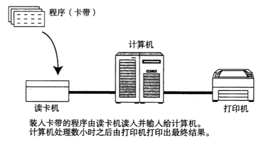

批处理技术的计算机特点：

* 操作复杂，通常需要专门的操作员
* 程序简单，通常一台计算机只支持特定的一种或几种程序，为了充分利用计算机，需要提前准备多个任务
* 没有交互，装入数据后只能被动等待输出结果

##### 分时系统

时间：20世纪60年代

分时系统，Time Sharing System，一台计算机与多个终端相连，采用 CPU 时间片轮转方案，轮流为每个终端用户服务。多个终端与主机形成面向终端的星形单机网状结构，这也是计算机网络结构的雏形。

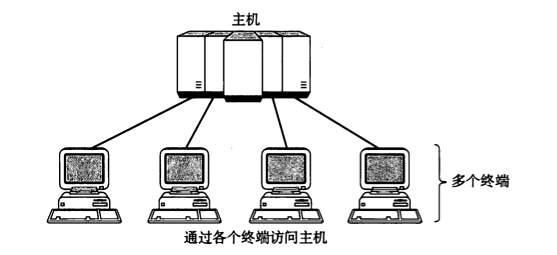

分时系统技术的计算机特点：

* 多路性：多个终端可以同时操作计算机
* 独占性：不同终端相互独立，不会发生冲突、破坏、混淆等现象
* 交互性：终端用户和计算机可以随时交互
* 及时性：采用时间片轮转，用户可以很快得到计算结果

#### 多机通信

出于计算机之间共享数据的需要，而普通物理存储介质传递，如磁带、软盘等，又存在不便利的问题，计算机直接通信的探索开始发展。多机通信的整个进程可以分为计算机-计算网络、开放式标准化网络以及互联网的高速发展三个阶段。

##### 计算机-计算机网络

时间：20世纪70年代

多机通信早期，主要是一些有实力的公司独立推出自己的计算机互连系统，例如 IBM 的 SNA、DEC 的 DNA，但是这些系统只能在相应公司自己的硬件设备上实现计算机通信。

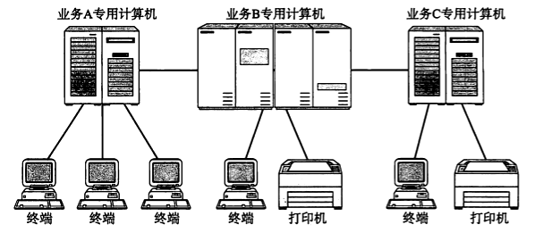

计算机-计算机网络的特点是：

* 没有统一的网络体系结构，难以实现真正意义上的互连

##### 开放式标准化网络

> ARPANET：Advanced Research Projects Agency Network，阿帕网
>
> ISO：International Organization for Standards，国际标准化组织
>
> OSI：Open System Interconnection，开放式系统互联通信
>
> OSI 参考模型，Open System Interconnection Reference Model，也称 OSI/RM、OSI 七层模型、OSI模型

时间：20世纪80年代

1983年，ARPANET 正式确定 TCP/IP 为通信协议；1984年，ISO 正式颁布 OSI 模型，并据此制定了 OSI 协议。从此，具有统一网络体系结构的计算机网络新时代开始到来。

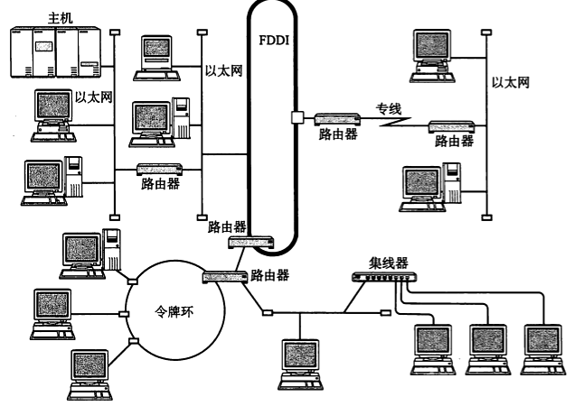

##### 互联网的高速发展

时间：20世纪90年代以后

随着互联网的普及，其应用的领域不断扩大，适用于新场景的标准协议被不断完善，这又极大的促进了互联网的发展。

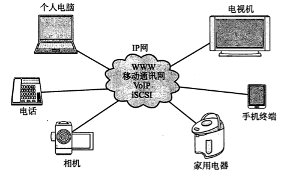

2000 年以后，我们开始进入以互联网技术为中心的时代，电话、电视、游戏机、家用电器以及其它电子设备均可以接入互联网。

与此同时，计算机病毒、信息泄露、网络欺诈等网络安全问题日益增多，人们对互联网的要求不再是单纯的建立连接，而是安全的建立连接...

#### 物联网

物联网，Internet of Things，缩写IoT，是基于互联网、传统电信网等信息承载体，让所有能行使独立功能的普通物体实现互联互通的网络。

如果说互联网的核心更多地强调人与人通过设备进行沟通，那么物联网则是人与人、人与物、物与物之间的交叉网状连接，最终实现万物互联。

### 网络分类

网络有多种分类方法：范围大小，有无连接、共享介质、数据交换、接收端数量。

#### 范围大小

基于范围大小，网络可以分为：局域网、城域网、广域网

##### 局域网

LAN，Local Area Network，局域网，某一区域内多台计算机互联形成的计算机网络

##### 城域网

> metropolitan /metrə'pɒlɪt(ə)n/ n. 大城市人、宗主国的公民 adj. 大都市的、宗主国的

MAN，Metropolitan Area Network，城域网，单个或多个城市内局域网互联形成的计算机网络，可以看作比较大的局域网

##### 广域网

WAN，Wide Area Network，广域网，又称外网、公网，不同地区局域网互联形成的计算机网络

#### 有无连接

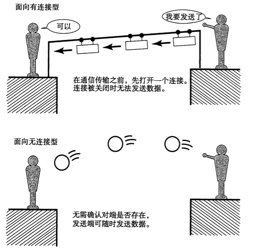

基于数据发送前是否需要建立通信线路，传输方式可分为：面向有连接型、面向无连接型。

##### 面向有连接型

发送数据前，需要在收发主机之间建立一条连接线路，否则无法传送数据。例如，电话网。

##### 面向无连接型

发送数据时无需建立连接，发送端可以在任何时候自由发送数据，甚至不用去管接收端是否存在；而接收端，只需要随时确认是否收到数据。

#### 共享介质

基于多个设备是否共用一个通信介质，传输方式可分为：共享介质型、非共享介质型。

##### 共享介质型

共享介质型网络指多个设备共享一个通信介质的网络，例如，以太网、FDDI。

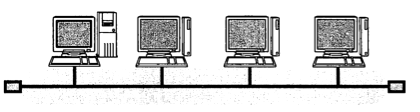

共享介质型网络由于共用同一个载波信道进行发送和接收，需要对介质进行访问控制，以使得同一时间只有一个设备使用载波信道。

##### 非共享介质型

非共享介质型网络指不共享介质，是对介质采用专用的一种传输控制方式。

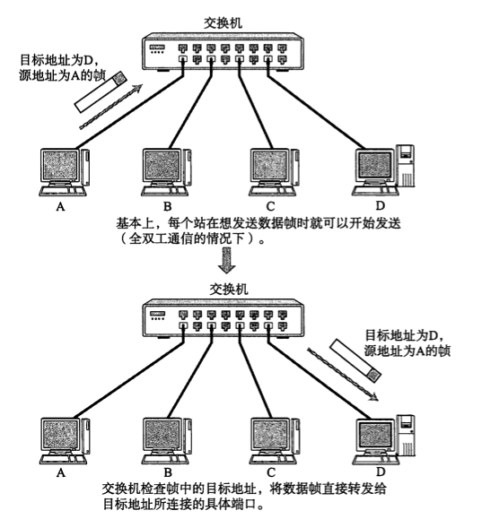

这种方式中，每个节点直连交换机，由交换机转发数据帧。存在的弱点是，一旦交换机故障，与之相连的所有计算机将无法通信。

#### 数据交换

数据通过网络从源主机到达目标主机，要经过网络核心进行数据交换，网络核心解决的基本问题就是数据交换。基于数据交换传输方式，传输方式可分为：电路交换、报文交换、分组交换。

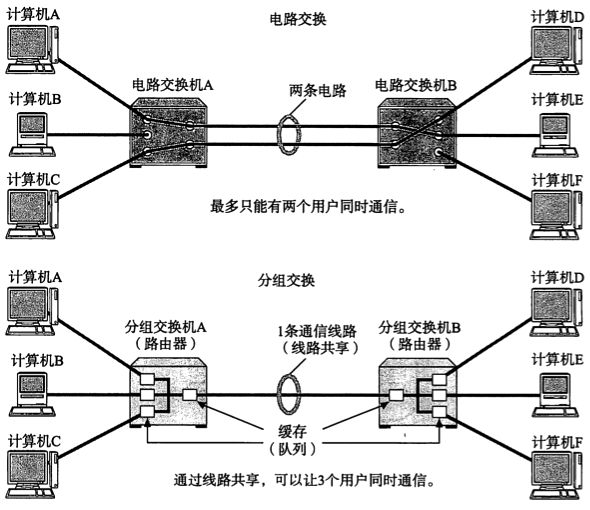

##### 电路交换

> circuit /'sɜːkɪt/ n. 电路、回路; v. 环行

电路交换，Circuit Switching，通信双方提前建立连接通道，通信过程中独占系统动态分配的资源（通道、带宽、时隙、码字等）直到通信结束的数据交换方式。所以，电路交换有三个明显的阶段：

1. 连接建立
2. 数据传输
3. 连接释放。

典型电路交换网络：电话网络。

电路交换的优点是：

* 通信时延小，通信线路专用，数据直达，传输数据的时延小
* 有序传输，通信时按发送顺序传送数据，不存在失序问题
* 没有冲突，不同的通信双方拥有不同的信道
* 适用范围广，既可用于传输模拟信号，又可用于传输数字信号
* 实时性强，连接一旦建立，双方可以随时通信
* 控制简单，电路交换的交换设备（交换机等）及控制均较简单

电路交换的缺点是：

* 建立连接时间长，平均建立连接时间相对于计算机通信来说太长
* 线路独占，使用效率低。连接建立后，物理通路被独占，即使通信线路空闲，也不能供其他用户使用
* 灵活性差，建立通路中的任何一点出了故障，就必须重新拨号建立连接
* 难以规格化，数据直达，不同类型、规格、速率终端很难互相通信，通信过程中也难以进行差错控制

##### 报文交换

报文交换，Message switching，携带有目的地址、源地址等信息的报文整个发送，一次一跳。

报文交换的优点是：

* 无需建立连接，无需预先建立专用的通信线路
* 动态分配线路，交换设备得到发送方报文时，先存储整个报文，然后选择一条合适的空闲线路，发送报文
* 提高线路可靠性，如果传输路径发生故障，可重新选择传输路径
* 提高线路利用率，通信双方不会独占通信线路，而是在不同的时间一段一段地部分占用这条物理通道
* 提高多目标服务，一个报文可以同时发送多个目的地址，这在电路交换中是很难实现的

报文交换的缺点是：

* 数据进入交换结点需经历存储再转发的过程，会引起转发时延（接受报文、检验正确性、排队、发送时间等）
* 报文交换将整个报文完整的发送出去，且对报文的大小没有限制，这就要求网络结点需要有较大的缓存空间

##### 分组交换

分组交换，也称为包交换，是指通信过程中将大数据分割成较小数据段进行传输的方法。每个数据段会附有一个包含源主机地址、目标主机地址、分组序号等控制信息的报文首部，带有首部的数据段称为分组或包 (Packet)。

当交换机收到分组之后，根据首部中的目标地址信息将分组转发到目的地。分组交换的本质就是存储转发，将接受的分组暂存下来，在目的方向路由上排队，当可以发送时，将信息发送到相应的路由上，完成转发。

报文首部应该写入哪些信息，如何处理这些信息，分组的发送方和接收方需要通过协议来保持一致的定义和解释。

分组交换的优点是：

* 无需建立连接，无需预先建立专用的通信线路
* 提高线路利用率，通信双方不会独占通信线路，而是在不同的时间一段一段地部分占用这条物理通道
* 简化了存储管理（相对于报文交换），分组的长度固定，相应的缓冲区的大小也固定，管理相对比较容易
* 加速传输，分组是逐个传输，可以使后一个分组的存储操作与前一个分组的转发操作并行，这种流水线方式减少了报文的传输时间。此外，传输一个分组所需的缓冲区比传输一次报文所需的缓冲区小得多，这样因缓冲区不足而等待发送的几率及时间也必然少得多
* 减少了出错几率和重发数据量，因为分组较短，其出错几率必然减少，所以每次重发的数据量也就大大减小，这样不仅提高了可靠性，也减少了传输时延。

分组交换的缺点是：

* 存在传输时延，尽管分组交换比报文交换的传输时延小，但相对于电路交换仍存在存储转发时延，而且其结点交换机必须具有更强的处理能力
* 需要传输额外的信息量。每个小数据块都要加上源/目的地址和分组编号等信息，从而构成分组，使传送的信息量大约增大5%~10%，一定程序上降低了通信效率，增加了处理的时间，使控制复杂，时延增加
* 当分组交换采用数据报服务时，可能出现失序，丢失或重复分组，分组到达目的结点时，要对分组按编号进行排序等工作，增加了复杂度。

#### 接收端数量

基于接收端的数量，传输方式可分为：单播、任播、多播、广播。

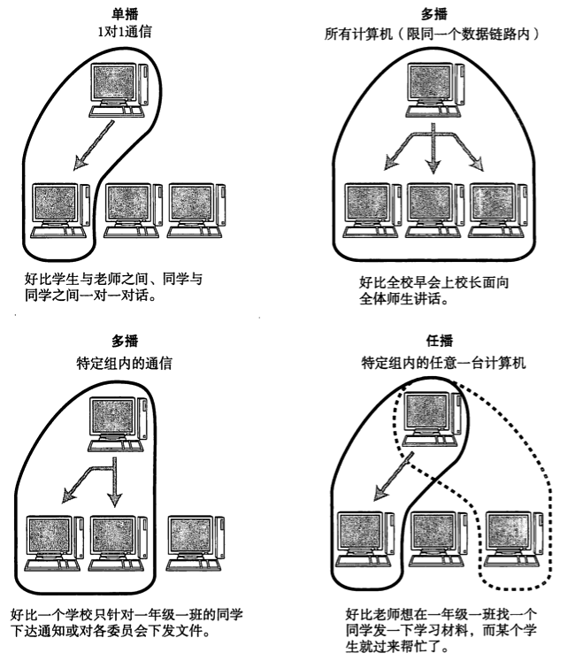

##### 单播

一对一通信，比如，固定电话通信。

##### 任播

一对特定范围内的一个通信，比如 DNS 根域名解析服务器。

##### 多播

一对数量**受限**的多个通信，比如电视会议。

##### 广播

一对数量**不受限**的多个通信，比如电视信号。

### 网络设备

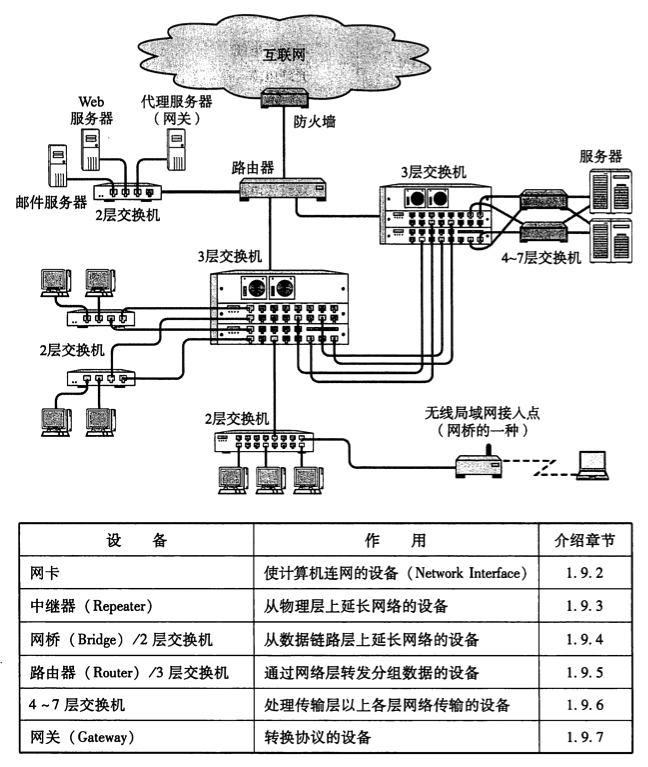

#### 网卡

> 数据链路，Datalink，指直接连接的设备之间进行通信所涉及的协议及其网络。

网络接口控制器，Network Interface Controller，NIC，又称网络适配器（network adapter）、网卡（network interface card），或局域网接收器（LAN adapter）。

网卡工作于数据链路层，是局域网中连接计算机和传输介质的接口，不仅能实现与局域网传输介质之间的物理连接和电信号匹配，还涉及帧的发送与接收、帧的封装与拆封、介质访问控制、数据的编码与解码以及数据缓存的功能等。

#### 电缆

> fiber /'faɪbɚ/ n. 光纤、纤维
>
> integrated /'ɪntɪɡretɪd/ adj. 综合的；完整的；互相协调的

电缆有很多种，包括双绞线电缆、光纤电缆、同轴电缆、串行电缆等。电缆类型的选用取决于数据链路的不同，不同的数据链路选用的通信媒介如下。

其中，需要注意的是：以太网、无线、ATM、FDDI、帧中继、ISDN都是计算机局域网技术，对应于 OSI 模型的数据链路层；尤其是以太网，尽管也会被用于泛指以太网技术实现的局域网，但其核心依旧是一种用于数据链路层的计算机局域网技术，与通过范围划分的广域网、局域网概念有本质的不同。

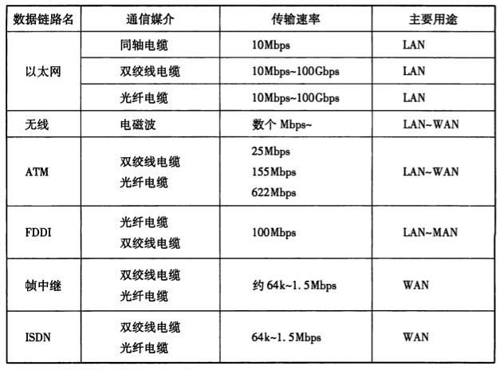

#### 中继器

中继器，Repeater，是工作在物理层的连接设备，适用于完全相同的两类网络的互连，主要功能是通过对数据信号再生还原后重新发送或转发，来扩大网络传输的距离。 

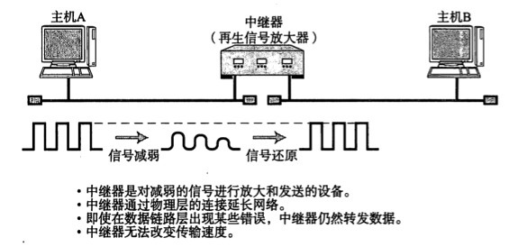

#### 网桥/2层交换机

网桥，也称桥接器，是早期工作于数据链路层的两端口二层网络设备，所以也叫二层交换机，用来连接不同网段。

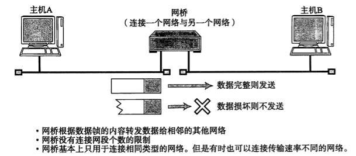

以太网等网络中使用的交换集线器，基本上也属于网桥的一种，其连接电缆的每个端口都提供类似网桥的功能。

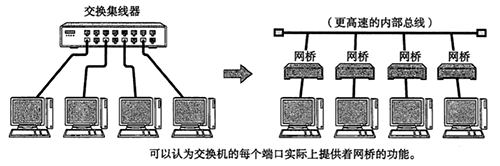

网桥的作用是：

* 转发数据帧，本身并不具备修改数据帧的能力，所以，只能连接相同或相似的网络（相同或相似结构的数据帧），如以太网与以太网、以太网与令牌环（token ring）；对不同类型的网络，数据帧结构不同，如以太网与 X.25 之间，网桥就无能为力了
* 通过地址自学机制和过滤功能控制网络流量。

网桥扩大了网络规模，提高了网络性能，给网络应用带来了方便。但网桥也存在问题：

* 广播风暴，网桥不阻挡网络中广播消息，当网络的规模较大时（几个网桥，多个以太网段），有可能引起广播风暴（broadcasting storm），导致整个网络全被广播信息充满，直至完全瘫痪
* 当与外部网络互连时，网桥会把内部和外部网络合二为一，成为一个网，双方都自动向对方完全开放自己的网络资源，这种互连方式在与外部网络互连时显然是难以接受的

问题的主要根源是网桥只是最大限度地沟通网络，不管传送的信息是什么。所以，网桥在早期使用较多，现在网桥被具有更多端口、同时也可隔离冲突域的交换机（Switch）所取代。

#### 路由器/3层交换机

路由器，是工作于 OSI 模型第 3 层网络层的设备，用于连接两个网络，并对分组报文进行转发的设备。网桥根据物理地址（MAC地址）进行处理，而路由器/3层交换机则根据 IP 地址进行处理。

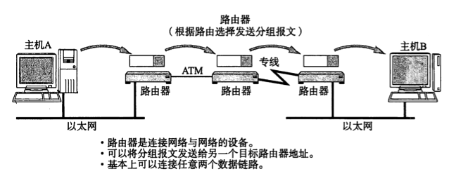

路由器只转发 IP 分组，把其余部分挡在网内（包括广播），以保持各个网络相对的独立性，这样可以组成具有许多子网互连的大型网络。

路由器的作用是：

* 由于工作于网络层，可以连接不同的数据链路，例如两个以太网，或者一个以太网一个 FDDI，只要网络层运行的是 IP 协议
* 分担网络负荷，甚至还具备一定的网络安全功能

#### 4~7层交换机

4~7层交换机负责处理 OSI 模型从传输层到应用层的数据。如果用 TCP/IP 分层模型来描述，4~7层交换机就是以 TCP 等协议的传输层及其以上的应用层为基础，分析收发数据，并对其进行特定的处理。

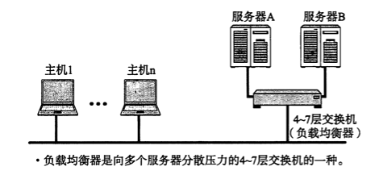

例如，在并发访问量非常大的 WEB 应用中，通常使用服务器集群的方式来分担负荷。不过，为了通过一个 URL 将访问分发到集群中不同的服务器，通常在入口处添加负载均衡器，这种负载均衡器就是 4~7 层交换机的一种。

#### 网关

网关是 OSI 模型中负责将从传输层到应用层的数据进行转发和转换的设备，与4~7层交换机一样，都是处理传输层以上的数据，但不同的是，网关不仅转发数据，还负责对数据进行转换。它通常使用一个表示层或应用层网关，在两个不能进行直接通信的协议之间进行翻译，最终实现两者之间的通信。

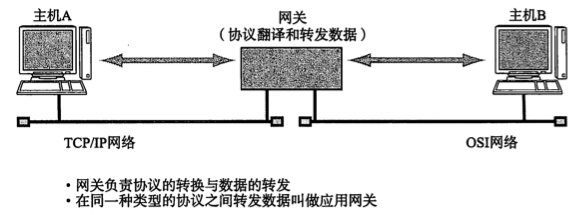

例如，互联网邮件和手机邮件，由于在表示层和应用层的“电子邮件协议”不同导致两者互不兼容，但是通过网关提供转换服务，使两者兼容互通。另外，防火墙也是一款通过网关通信，针对不同应用提高安全性的产品。

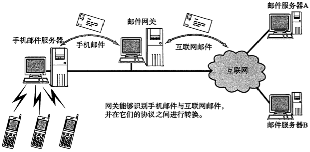

### 网络地址

网络通信中，每层协议使用的地址不尽相同，比如电子邮件地址、IP 地址、MAC 地址等。可以从地址的两个特性来描述它们：唯一性和层次性。

#### 唯一性

一个地址必须唯一表示一个对象，互不相同。

#### 层次性

当地址具有层次性时，可以提高地址的查询效率。其中：

- IP 地址，具有层次性，IP 地址由网路号和主机号两部分组成，网路号相同意味着处于同一网段
- MAC 地址，不具有层次性，MAC 地址由设备厂商基于国际规范赋予不同的设备唯一的 MAC 地址，但是设备可以应用在任何地方

### 网络构成

计算机网络主要由三部分构成：

* 核心网/骨干网：核心网络配置，常用设备有高速路由器、光纤等，专注于提高网络传输性能和生存性
* 边缘网络：常用设备多为 2 层交换机或 3 层交换机，专注于实际业务
* 接入层/汇聚层：连接核心网和边缘网络的部分

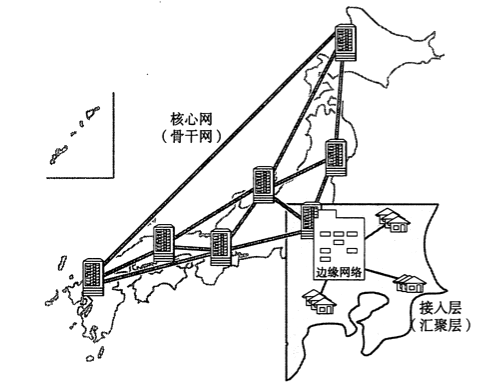

核心网相当于现实中的高速公路，边缘网络相当于省内、市级、乡村公路，接入层相当于高速路入口收费站。通常，接入层由 ISP（Internet Service Provider，互联网服务提供商）实现，个人用户通过 ISP 接入互联网。

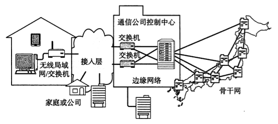

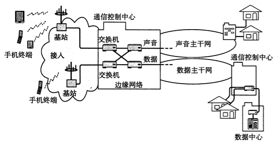

