## 网络协议

> engineering /endʒɪ'nɪərɪŋ/ n. 工程，工程学
>
> IETF：Internet Engineering Task Force，国际互联网工程任务组

主流的网络通信协议有 ISO 制定的 OSI 协议和 IETF 制定的实际中应用最广泛的 TCP/IP 协议。

### OSI协议

1984年，ISO 制定了通信系统标准化方案 OSI 参考模型，并以此为基础，制定了界定每层协议和各层之间接口标准的 OSI 协议。尽管 OSI 协议并未得到普及，但作为指导方针的 OSI 参考模型却常被用于其它协议的制定以及学习理解中，比如由 OSI 七层模型演化而来的 TCP/IP 五层模型。

#### 基本简介

OSI 参考模型将通信协议中必要的功能分为七层，每个分层接受其下一层提供的服务，并同时为自己的上一层提供服务。相邻两层交互时遵循的约定叫做”接口“，发送端和接收端的同层之间交互时遵循的约定叫做”协议“。

OSI 参考模型的分层过于理想化，其希望实现七层的所有模块，以组合起来实现网络通信。这种分层的优点是：

- 每个分层内聚性强，即使单个分层内部发生变化，也不会波及整个系统，可以构建一个扩展性和灵活性都非常强的系统
- 分层可以细化通信系统功能，每个分层的协议易于实现

缺点是：

- 过分模块化，使处理变得更加沉重
- 每个模块重复实现部分相似的处理逻辑

#### 七层模型

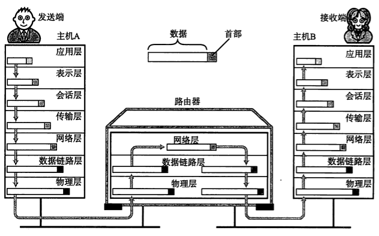

在 OSI 参考模型中，数据传输路线如上图，其中：

- 发送端从第7层到第1层，接收端从第1层到第7层
- 发送端的每个分层将接收的上一层的包作为自己的数据，并附加当前层协议所需首部信息，而接收端可以分离相应的首部信息
- 中间网络设备，如图中路由器，往往是在某一个特定的层上进行数据处理，同样需要将数据转换到特定的层格式，如图中先从物理层 → 数据链路层 → 网络层，然后从网络层 → 数据链路层 → 物理层

下面，通过一封邮件的发送学习  OSI 参考模型中每层的作用及处理细节。

##### 应用层

第7层，制定应用程序协议，即规定应用程序中通信相关的细节，包括电子邮件、文件传输、远程登录等协议。

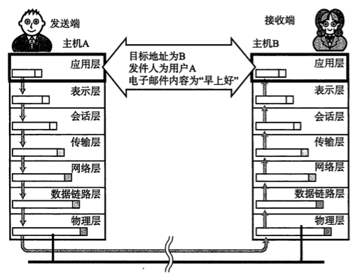

电子邮件软件在功能上可以分成两部分：

- 通信无关的部分
  - 发送端，支持用户编辑和发送邮件
  - 接收端，支持用户接收和阅读邮件
- 通信相关的部分
  - 发送端，发送时进入应用层协议处理，在传送数据前端附加包含邮件内容、接收人等内容的首部信息
  - 接收端，接收时进入应用层协议处理，分析数据首部得到数据正文

##### 表示层

第6层，数据格式的转换，如加密解密、转换翻译、压缩解压缩等，即将上一层应用处理的信息转换为与接收端系统格式兼容并适合网络传输的格式 ↓ ，或者将下一层的数据转换为上一层能够处理的格式 ↑ 。

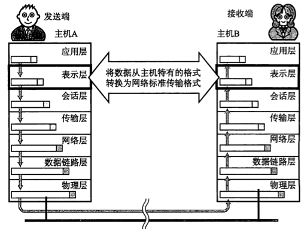

表示层关注数据的具体表现形式，发送端和接收端使用软件或操作系统的不同都可能导致数据在应用程序中的表现形式不同，即从应用层获取的数据编码格式不一致，例如，普通文字流就有 ISO、UTF-8、UTF-16等编码格式，需要将数据在主机特有的格式与网络标准传输格式之间进行转换。

表示层会附加数据编码格式等首部信息。

##### 会话层

第5层，负责建立、管理和维护会话（数据流动的逻辑通路）。

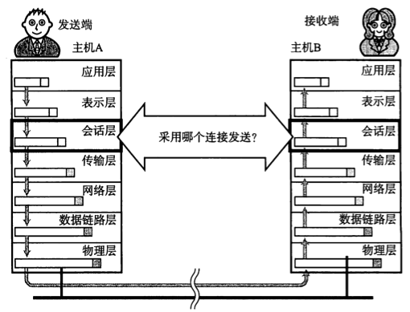

何时建立连接和发送数据，采用何种方式发送数据，例如多封邮件是一封邮件一个连接，还是多封邮件使用同一连接，均由会话层决定。

会话层会附加数据传送顺序等内容的首部信息。

##### 传输层

第4层，管理源节点和目标节点之间的数据传输，建立或断开连接，在必要时对数据进行分割，负责数据被可靠地（TCP）/不可靠（UDP）传输到目标地址。

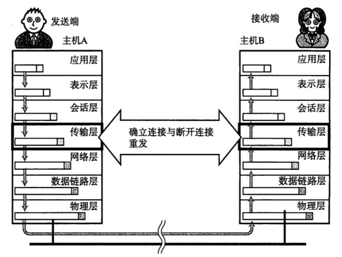

会话层只对何时以何种方式发送数据进行管理，会话层的处理往往是逻辑上的，真正建立起传输数据的连接是传输层的职责。

传输层使用 TCP 时，保证传输的可靠性是传输层的重要职责之一，比如，部分数据由于某种原因未能准确地被目标主机接受，发送端传输层在得到这一消息后，会将相应部分数据再次发送给目标主机。

传输层会附加用于辨识传输层数据的首部信息。

##### 网络层

第3层，网络寻址与路由选择，建立源地址和目标地址之间的完整传输通道。

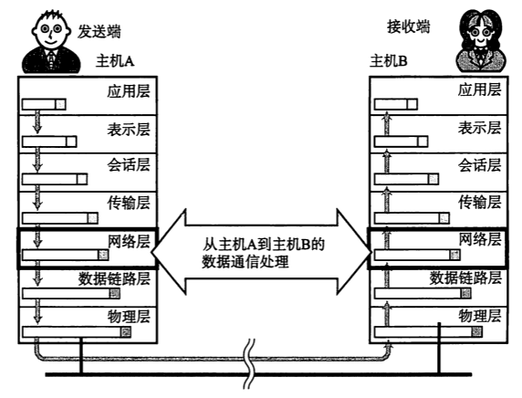

##### 数据链路层

> MAC 地址，Media Access Control Address，媒介访问控制地址，也叫物理地址或硬件地址，唯一确定网络设备位置的地址。

第2层，数据帧的生成与接收。即接受来自物理层的位流形式的数据，并封装成帧，传送到上一层；或者，将来自上一层的数据帧，拆装为位流形式的数据转发到物理层；并且还负责处理接受端发回的确认帧的信息，以便提供可靠的数据传输。

该层通常又被分为两个子层：

* 介质访问控制（Media Access Control，MAC）子层的主要任务是解决共享型网络中多用户对信道竞争的问题，完成网络介质的访问控制。
* 逻辑链路控制（Logical Link Control，LLC）子层的主要任务是建立和维护网络连接，执行差错校验、流量控制和链路控制。

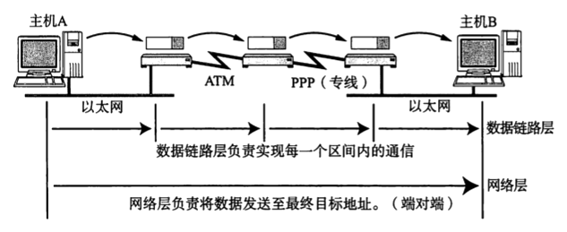

一个传输路线上，会有很多个中间设备，网络层负责将整个数据发送到最终的目标地址，而数据链路层需要在通过传输介质直连的两个设备之间处理数据。即网络层负责发送端至接收端的整个线路，而数据链路层负责单个区间。

就像似一场长途旅行，网络层类如一张从杭州 -> 南京 -> 济南 -> 北京 -> 西藏整个计划的完整行程表，而数据链路层就像杭州 -> 南京、南京 -> 济南、济南 -> 北京的高铁票，北京 -> 西藏的飞机票让你按计划完成整个行程。

数据链路层会附加 MAC 地址等内容的首部信息。

##### 物理层

> 透明传输：不管传的是什么，所采用设备只起一个通道作用，把要传输的内容完好的传到对方！

第1层，通过物理设备，如双绞线、光纤等，透明传输 0、1 比特流。

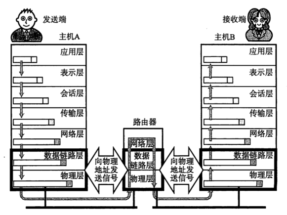

数据链路层封装的数据帧最终需要在传输介质中进行传输，物理层通过将数据 0、1 转换成电压的高低、光的闪灭、电波的强弱等信号在介质中传递。

### TCP/IP协议

TCP/IP，全称 TCP/IP 协议族 (TCP/IP Protocol Suite 或 TCP/IP Protocols) 或者 TCP/IP 协议栈 (TCP/IP Protocol Stack)，是网络多层模型中所有协议的集合，也是互联网的基础通信架构。之所以用 TCP、IP 两个协议来指代整个集合，是因为：

- TCP 和 IP 协议是两个最核心的协议
- TCP 和 IP 协议是两个最早通过的标准

#### 发展历程

> department n. 部、部门、系、科、局

TCP/IP 协议是伴随着互联网的发展壮大而一起发展起来的。

20世纪60年代，美国国防部（The Department of Defense，DoD）出于通信可靠性的目的，开始研究一种即使一处或多处连接遭到破坏，依然可以经过迂回线路实现最终通信的方式，分组交换技术因此应运而生。

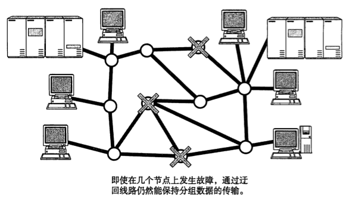

1969年，为验证分组交换技术，DoD 和美国西海岸的几所大学和研究所开始搭建一套相互连接的小型网络 - - ARPANET（Advanced Research Projects Agency Network，阿帕网），这也是全球互联网的鼻祖。随着整个网络的不断壮大，分组交换技术得到充分验证。与此同时，在互联计算机之间提供可靠传输的综合性通信协议的实验也获得成功。

20世纪70年代前半叶，ARPANET 中的一个研究机构发布了 TCP/IP。

1982年，TCP/IP 具体规范最终被确定下来。

1983年，ARPANET 正式确定 TCP/IP 为通信协议。

在此之后，不论是局域网还是广域网，都开始倾向于使用 TCP/IP。

所以，TCP/IP 协议能击败 OSI 协议成为主流互联网通信协议的原因在用：

- 实用性，TCP/IP 是随着互联网的发展逐渐成长的，普遍是先验证后确立，甚至一些协议已经在设备中运行了才确定具体规范，而 OSI 协议基本是先确立后实现
- 开放性，TCP/IP 由任何人都可以参与讨论的 IETF 制定，协议实施过程中出现问题可以快速反馈、讨论并修改协议，以应对技术的快速革新
- 主流操作系统的支持，尤其是早期普遍采用的 UNIX系统，以及后来的 Windows 和 MacOS

TCP/IP 协议标准化的过程，大致经历互联网草案 → 提议标准  → 草案标准  → 真正标准四个阶段。从提议标准阶段开始，协议就会被列入 RFC （Request For Comment，征求意见表）。

#### 完整图示

#### 五层模型

TCP/IP 协议本身只有协议，没有分层模型，其分层模型是从 OSI 模型借鉴而来，以方便协议本身的学习。

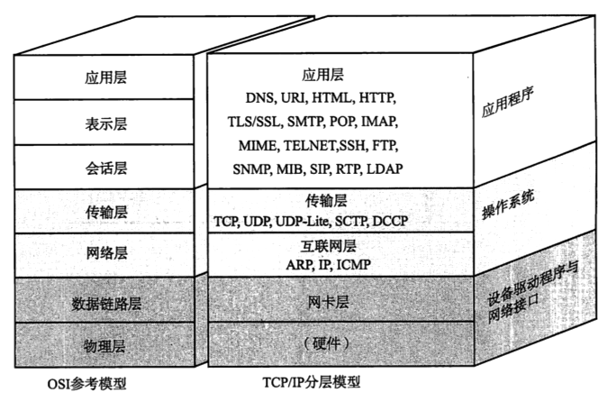

TCP/IP 模型与 OSI 模型的主要区别是：

* 分层级数、名称和细节上的差别
  * OSI 模型是七层，但是 TCP/IP 协议提出时网络设备之间已经实现了通信， 所以其只制定了应用层、传输层和网络层的协议规范，网络层以下的规范不在协议组中。也正是因为网络层以下分层的灵活性，TCP/IP 模型的分层有四层和五层两种说法：
    * 四层，由于数据链路的不同直接决定了物理通信介质的选用，而物理传输介质功能单一，可弱化甚至忽略，所以，将网络层以下功能视为一个层 - 网络接口层的话，是四层
    * 五层，严格按照 OSI 模型将网络层以下划分为数据链路层 + 物理层的话，是五层（个人学习按照五层结构）
  * 传输层以下的名称有差异，但是习惯上还是使用 OSI 参考模型的名称：网络层、数据链路层、物理层
* OSI 模型注重“通信协议必要的功能是什么”，TCP/IP 模型更强调“在计算机上实现协议应该开发哪种程序”
  * 应用层相当于 OSI 模型中的应用层 + 表示层 + 会话层，统一由应用程序实现
  * 传输层和网络层由操作系统实现
  * 数据链路层和物理层通过设备驱动程序和网络接口实现
* TCP/IP 模型作为舶来品，与其本来的协议体系可能并不完全契合
  * 比如，SSL/TLS 协议所属分层就比较难以界定，后文会详细学习

##### 应用层 

第5层，由应用程序集中实现 OSI 模型中的应用层 + 表示层 + 会话层的功能，这些功能可以由一个程序也可以由多个程序完成。

TCP/IP 协议中的应用程序普遍采用客户端/服务端架构。

常见应用程序：

- WWW
  - HTTP：客户端浏览器与服务器的通信协议，属于 OSI 模型中应用层协议
  - HTML：客户端浏览器与服务器数据传输的主要格式，属于 OSI 模型中表示层协议
- 电子邮件
  - SMTP：Simple Mail Transfer Protocol，简单邮件传输协议
- 文件传输
  - FTP：File Transfer Protocol，文件传输协议
- 远程登录
  - TELNET：远程终端协议
  - SSH：Secure Shell，安全外壳协议
- 网络管理
  - SNMP：Simple Network Management Protocol ，简单网络管理协议

##### 传输层

第4层，传输层最重要的功能就是让应用程序之间实现通信。计算机中，同一时间进行着多个不同程序的通信，通过端口号识别不同程序的通信。

传输层使用的协议：

- TCP，Transmission Control Protocol，传输控制协议
- UDP，User Datagram Protocol，用户数据包协议

##### 网络层

第3层，网络层使用 IP 协议，IP 协议基于 IP 地址转发分包数据，接入互联网的主机和路由器都必须实现 IP 功能。

IP 包生成后，参考路由控制表（参见《网络层 - 路由控制 - 路由表》）决定接受此 IP 包的路由或主机。随后，IP 包将被发送给连接这些路由器或主机网络接口的驱动程序，以实现真正地发送数据。不知道接收端 MAC 地址时，可使用 ARP 查找。只要知道了对端的 MAC 地址，就可以将 MAC 地址和 IP 地址交给以太网的驱动程序，实现数据传输。

网络层使用的协议：

- IP，Internet Protocol，网际协议
  - 使用 IP 地址作为主机标识，跨网传送数据包
  - 分组交换的一种协议，不具有重发机制，属于非可靠性协议
- ICMP，Internet Control Message Protocol，互联网控制消息协议
  - 当 IP 协议数据包无法正常到达目标地址时，使用 ICMP 通知发送端
- ARP，Address Resolution Protocol，地址解析协议
  - 从分组数据包的 IP 地址中解析出物理地址（MAC地址）的一种协议

##### 数据链路层

> 固件，一种嵌入在硬件设备中的软件。

第2层，数据包通过数据链路从一个设备的网络层传输到另外一个设备的网络层。这个过程能够在网卡的驱动程序中控制，也可以在固件或者专用芯片中控制。

驱动程序是软（操作系统）硬件之间的桥梁，外部硬件设备连接到计算机时，还需要相应的驱动程序才能正常的工作。

##### 物理层

第1层，负责数据传输的硬件，这种硬件相当于以太网或电话线路等物理层的设备。

#### 数据序列

在分层处理中，来自上一层的包作为本层的数据，在附加了本层的首部后传递给下一层。附加首部包含相应层的必要信息，如源地址、目标地址及协议相关信息等。

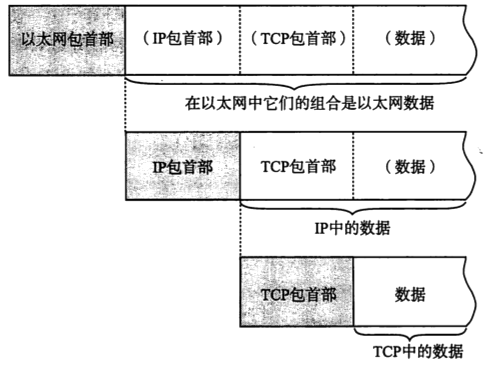

##### 数据结构

最终，经由物理层传输的数据具体结构如图（以以太网为例）。

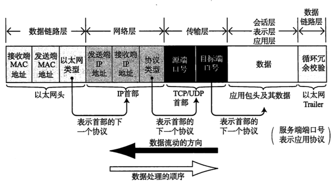

* 分层处理中，数据前部被先后顺次添加应用自己的包首部、TCP/UDP 首部、IP 包首部、以太网包首部；数据后部被添加以太网尾
* 每个包首部中至少包含两个信息：
  * 发送端和接收端地址，因为经过每个协议分层时，都必须有识别包发送端和接受端地址的信息：
    * 数据链路层，以太网用 MAC 地址
    * 网络层，IP 模块用 IP 地址
    * 传输层，TCP/UDP 模块用端口号
    * 应用层，即便在应用程序中，像电子邮件也有独一无二的邮件地址标识
  * 上一层的协议类型，每个分层包首部中还包含一个用以标识其上一层协议种类的识别位：
    * 数据链路层，以太网包首部中的以太网类型用以标识网络层协议
    * 网络层，IP 包首部中的协议类型用以标识传输层是 TCP 还是 UDP
    * 传输层，TCP/UDP 首部中的端口号用以标识使用端口号的应用程序
    * 应用层，应用首部中有时也会包含用于识别应用数据类型的标签

##### 处理过程

具体各分层对数据的处理过程如图（以发送邮件为例）。

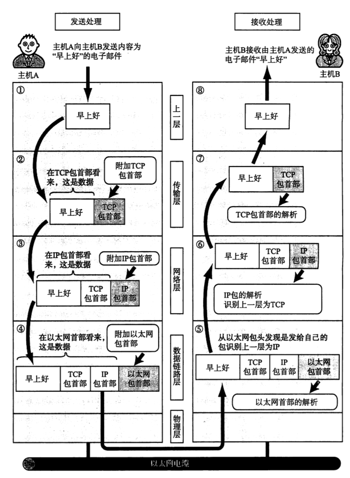

###### 发送端

1. 应用程序
   * 可能对数据内容（比如用户邮件内容）进行编码（如UTF-8）处理，相当于 OSI 表示层功能
   * {应用首部 + 应用数据} 被发送给 TCP 模块

2. TCP 模块
   * 将接收到来自应用程序的 {应用首部 + 应用数据} 作为自己的数据，附加一个 TCP 首部，其中包括源端口号和目标端口号（用以识别发送主机和接受主机使用相应端口的程序）、序号（识别数据包顺序）、校验和（Check Sum，判断数据是否被损坏的方法）
   * {TCP 首部 + 应用首部 + 应用数据} 发送给 IP 模块

3. IP 模块
   * 将接收到 {TCP 首部 + 应用首部 + 应用数据} 作为自己的数据，并附加 IP 首部，其中包括发送端 IP 地址、接收端 IP 地址、数据协议类型（其后部数据是 TCP 或者 UDP ）
   * 如果不知道接收端的 MAC 地址，可以利用 ARP 查找
   * {IP 首部 + TCP 首部 + 应用首部 + 应用数据} + MAC 地址发送给驱动程序

4. 网络接口（以以太网为例）

   * 将接收到 {IP 首部 + TCP 首部 + 应用首部 + 应用数据} 作为自己的数据，并附加以太网首部，其中包括发送端 MAC 地址、接收端 MAC 地址、以太网类型标识 (标识 IP 包还是 ARP 包)

   * 同时，以太网还会在包最后附加存放 FCS 的以太网 Trailer

     > FCS（Frame Check Sequence，帧检验序列。使用方法：
     >
     > 首先，发送网卡利用多项式计算，称循环冗余校验（CRC)，将计算结果写入 FCS 字段
     >
     > 然后，接收方收到这个帧，对其做相同的 CRC 计算；如果计算结果与接收的 FCS 字段值相同，则表示帧没有发生错误，如果不同，则视为帧发生错误，接收方丢弃这个帧

   * {以太网首部 + IP 首部 + TCP 首部 + 应用首部 + 应用数据 + 以太网 Trailer} 发送给物理硬件层进行传递

###### 接收端

5. 网络接口（以以太网为例）
   * 收到以太网包，比对以太网首部中的接收端 MAC 地址是否是自己的 MAC 地址，否，则丢弃
   * 是，则继续检查以太网首部中的以太网类型域，如果标识数据为 IP 包，则传递给处理 IP 的子程序；如果是 ARP 包，则传递给处理 ARP 的子程序；如果标识类型无法识别，丢弃

6. IP 模块
   * 比对 IP 首部中的接收端 IP 地址与自己的是否匹配，否，则丢弃
   * 是，则继续检查 IP 首部中的协议类型域，如果标识为 TCP 协议，传递给 TCP 模块；如果标识为 UDP 协议，传递给 UDP 模块
   * 对于中间路由器，接收端地址往往不是自己的地址，此时，需要借助路由控制表，转发数据到正确的主机或路由器

7. TCP 模块
   * 首先，获取 TCP/UDP 首部，计算校验和，判断数据是否被破坏；检查序号，判断数据次序；检查端口号，确定数据对应的正确应用程序
   * 然后，发送一个“确认回执”给发送端，如果发送端未接收到回执，则会认为接收端未接收到数据，并重复发送数据
   * 最后，数据被完整接收，传递给端口号对应的应用程序

8. 应用程序
   * 解析得到发送端发送的应用数据

