## 网络层

网络层的主要作用是实现终端节点之间的通信，即点对点（end-to-end）通信。

网络层通信是面向无连接的，由面向有连接的传输层 TCP 协议保证其可靠性，比如数据是否到达、是否正确等。

TCP/IP 的核心是网络层，该层的主要协议有：

* IP，Internet Protocol，网际协议，
* ICMP，Internet Control Message Protocol，互联网控制消息协议
* ARP，Address Resolution Protocol，地址解析协议

### 基本功能

IP 大致分为三大作用模块：IP 寻址、路由控制、分包与组包。

#### IP 寻址

在计算机点对点通信中，必须有一个地址标识符来识别通信对端，在 IP 协议中使用的标识符是 IP 地址。TCP/IP 协议中的所有主机或路由器都有自己的 IP 地址。

##### IPv4 地址

最初的 IP 地址就是 IPv4 地址。

###### 定义

IPv4 地址由 32 位二进制整数构成，每 8 位为一组，分为 4 组，以“.”分割。例如：

```
10101100.00010100.00000001.00000001   (2进制，计算机内部使用)
172     .20      .1       .1          (10进制，便于人类阅读)
```

###### 组成

IPv4 地址由网络标识和主机标识两部分唯一标识：

* 网络标识/地址

  用以标识若干主机集合所属的网段，每个网段拥有唯一的网络标识。IP 包转发途中的路由就是利用网络标识进行路由的。

  网络标识相同的主机必须位于同一个网段，相互之间不需要路由器连接就能直接通信。网络标识相同的主机组成的网络称为本地网络；网络标识不同，即不同网段主机之间通信必须通过路由器，网络标识不同的计算机称之为远程计算机。

* 主机标识/地址

  用以标识同一网段中的不同主机，所以，相同网段的不同主机拥有相同的网络标识和唯一的主机标识。

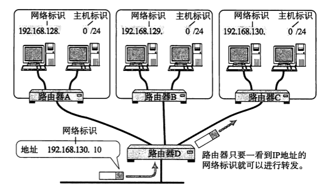

###### 分类

主要基于网络标识和主机标识两部分位数的不同，IPv4 地址被分为 5 类：

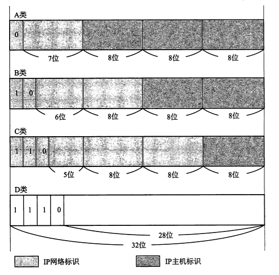

* A类：前 8 位为网络标识且以 0 开头，后 24 位为主机标识，可分配网址范围为：

  ```
  00000000.00000000.00000000.00000000 ~ 01111111.111111111.11111111.11111111
  0.0.0.0 ~ 127.255.255.255
  ```

  可以标识 128 个网段，每个网段最多拥有 256 \* 256 \* 256 - 2 = 16,777,214 个地址

* B类：前 16 位为网络标识且以 10 开头，后 16 位为主机标识，可分配网址范围为：

  ```
  # 2^7^ = 128
  10000000.00000000.00000000.00000000 ~ 10111111.111111111.11111111.11111111
  128.0.0.0 ~ 191.255.255.255
  ```

  可以标识 64 * 256 = 16,384 个网段，每个网段最多拥有 256 * 256 - 2 = 65,534 个地址

* C类：前 24 位为网络标识且以 110 开头，后 8 位为主机标识，可分配网址范围为：

  ```
  # 2^7^ + 2^6^ = 128 + 64 = 192
  11000000.00000000.00000000.00000000 ~ 11011111.111111111.11111111.11111111
  192.0.0.0 ~ 223.255.255.255
  ```

  可以标识 32 \* 256 \* 256 = 2,097,152 个网段，每个网段最多拥有 256 - 2 = 254 个地址

* D类：地址以 1110 开头，但网络标识和主机标识位数未定义，常用于多播，可分配网址范围为：

  ```
  # 2^7^ + 2^6^ + 2^5^ = 128 + 64 + 32 = 224
  11100000.00000000.00000000.00000000 ~ 11101111.111111111.11111111.11111111
  224.0.0.0 ~ 239.255.255.255
  ```

  可以标识 16 \* 256 \* 256 \* 256 = 268,435,456 个**IP 地址**

* E类：地址以 1111 开头，但网络标识和主机标识位数未定义，保留用于使用和开发，可分配网址范围为：

  ```
  # 2^7^ + 2^6^ + 2^5^ + 2^4^ = 128 + 64 + 32 + 16 = 240
  11110000.00000000.00000000.00000000 ~ 11111111.111111111.11111111.11111111
  240.0.0.0 ~ 255.255.255.255
  ```

其中，IP 地址的主机标识部分不能全部为 0 或全部为 1，这两个特殊值保留用于以下特殊用处，所以每类 IP 地址中每个网段可容纳的最多主机标识数均需减去2.

* 全部为 0：用以表示该网段的网络标识，或在 IP 地址不可获知时使用
* 全部为 1：通常用作广播地址

最后，可以发现 A类、B类、C类、D类、E类 IP 地址是五个连续且互不相交的地址区间，五个区间的并集即是 32位二进制可表示的整个范围。当遇到 IP 地址时，只要比对第一组（第一个点之前）数字便可确定其所属分类，即 IPv4 地址本身便隐含着自己所属的类别，例如：

* 172.0.0.1，128 < 172 < 192，B 类 IPv4 地址
* 220.0.0.8，192 < 220 < 224，C 类 IPv4 地址

网络标识相同的计算机必须属于同一链路，但在实际网络架构中，一个链路上连接的主机数量一般并不会达到容量上限，例如，一个 B 类网段链路可能并不会存在 65,534 台主机。所以，对网络标识（尤其是 A类和 B类）和单个分类可容纳主机数量都十分有限的 IP 地址而言，如何减少这种浪费，有效利用有限的 IP 地址数量容纳更多的主机呢？

发展思路大致经历以下四个阶段：基本子网、CIDR子网、私有地址和 IPv6 地址。

##### 基本子网

IPv4 地址起初是两层结构：网络 -> 主机。子网是将主机标识再次分割成子网标识 + 主机标识两部分，使原来的两层结构变成三层结构：网络 -> 子网 -> 主机。

原本只有两部分组成的 IPv4 地址，通过地址本身特征识别其分类后，可进而获取网络标识和主机标识。但存在三个部分时，虽然依旧可以通过地址本身特征识别其分类后得到网络标识， 但如何从剩余部分中获取子网标识和主机标识？通过子网掩码！

**子网标识相同的 IP 地址也必须位于同一链路吗？需查证。**

###### 掩码

> mask n. 面具、口罩、掩饰 v. 掩饰

掩码，Mask，是一串二进制数字，通过与目标数字的按位操作，达到屏蔽指定位的目的。

###### 子网掩码

子网掩码，是一种用来指明 IP 地址子网标识和主机标识的掩码。其规则是：

* 同 IPv4 地址相似，由 4 组 x 8 位 = 32 位的二进制数字组成
* 二进制 1 指示网络标识位和子网标识位
* 二进制 0 指示主机标识位

子网掩码的表示方法有两种：

* 地址表示法 - 与 IP 地址相似，用“.”分割的 4 组数字表示

  ```
  11111111.10000000.00000000.00000000 (2进制)
  255.126.0.0 (10进制)
  ```

* 后缀表示法 - 用“/二进制1位数”的后缀方式表示

  ```
  172.20.100.52/26 (前26位为网络标识+子网标识位)
  ```

对于 A类、B类和C类网络，因为不需子网标识位，则其默认的子网掩码为：

*  A类

  ```
  11111111.00000000.00000000.00000000
  255.0.0.0
  ```

*  B类

  ```
  11111111.11111111.00000000.00000000
  255.255.0.0
  ```

*  C类

  ```
  11111111.11111111.11111111.00000000
  255.255.255.0
  ```

例如，主机存在以下 IPv4 地址和子网掩码：

```
10011010.01000111.10010110.00101010
154.71.150.42

11111111.11111111.11111000.00000000
255.255.248.0
```

1. 网络标识

   IP 地址以 10 开始，为 B 类地址，所以前 16 位为网络标识，故其网段为：

   ```
   154.71.0.0
   ```

2. 子网标识

   子网掩码有 21 个二进制 1，网络标识占用 16 个，剩余 5 个，对应位的 IP 地址数字 10010（18） 即为子网标识 。获取子网地址的方式，将 IP 地址与子网掩码的二进制表示进行按位与（&）操作，得到的二进制表示对应的 IP 地址即为子网地址：

   ```
   10011010.01000111.10010110.00101010
   11111111.11111111.11111000.00000000
   
   10011010.01000111.10010000.00000000
   154.71.144.0  (子网地址)
   ```

   快速计算子网地址技巧：

   ```
   # 例如，存在 IP 地址
   154.71.150.42/19
   
   # 8 位二级制每位对应十进制
   10000000 - 128
   1000000 - 64
   100000 - 32
   10000 - 16
   1000 - 8
   100 - 4
   10 - 2
   1 - 1
   
   # 16 < 19 < 24，网络标识 + 子网标识截止位在第三组，故前两组不变
   154.71.0.0
   
   # 19 - 16 = 3，第三组前三位依旧是网络/子网标识
   第 17 位：150 > 128，该位为 1
   第 18 位：150 - 128 = 22 < 64，该位为 0
   第 19 位：22 < 32，该位为 0
   所以第三组网络标识为：10000000
   
   # 该 IP 地址的子网地址为：
   154.71.128.0
   ```

3. 主机标识

   IP 地址中剩余的 11 位即为主机标识

###### 子网规划

通过子网掩码来规划子网时，需要权衡两个指标：子网数量和子网内最大主机数量。

例如，一个 B 类 IP 地址，共有 16 位分配给子网和主机标识：

* 1 位子网标识，15 位主机标识 - - 可规划 2^1^ = 2 个子网，每个子网可容纳  2^15^ - 2 = 32,768 台主机
* 2 位子网标识，14 位主机标识 - - 可规划 2^2^ = 4 个子网，每个子网可容纳  2^14^ - 2 = 16,382 台主机
* ...
* 4 位子网标识，12 位主机标识 - - 可规划 2^4^ = 16 个子网，每个子网可容纳  2^12^ - 2 = 4,096 台主机
* ...

当规划一个 B 类网络时：

* 假设需要 10 个子网，每个子网最多 4000 台主机，可以使用 4 位子网标识和 12 位主机标识，子网掩码为：

  ```
  11111111.11111111.11110000.00000000
  255.255.240.0
  ```

* 假设需要 20 个子网，每个子网最多 3000 台主机，至少需要 5 位子网标识，但剩余 11 位主机标识最多容纳  2^11^ - 2 = 2048 台主机，故，此时需重新规划子网，比如设计第二个 B 类网络。

##### CIDR子网

CIDR表示法是目前广泛使用的 IP 地址分配方法，之前基本的分类和子网划分方法已经很少使用。

###### CIDR

CIDR，Classless Inter-Domain Routing，无类别域间路由，彻底抛弃基本 A~E 5种 IP 地址分类方法，使用 IP 地址前部不定位数作为网络标识的路由技术。无类别的 CIDR 网络在进行 IP 地址分配时也更加灵活。

CIDR 网络同样具有网络 -> 主机两层结构，所以，相应的 IPv4 地址同样由网络标识 + 主机标识构成。只是与基本网络不同的是，网络标识不再使用固定的 8/16/24/32 位子网掩码，而是使用可变长子网掩码 （VLSM，Variable Length Subnet Masking），此时子网掩码中为1的位次对应的 IP 地址位全部是网络标识。例如：

```
10000000.00001110.00100011.00000111/20
128.14.35.7/20
```

网段地址为：

```
10000000.00001110.00100000.0000
128.14.32.0
```

###### CIDR地址块

相同网络标识下的所有 IP 地址构成一个 CIDR 地址块。地址块内的 IP 地址可以直接分配给主机，也可以再细分为层级更多更小的子网。

CIDR 地址块构成超网，实现了路由聚合，对外屏蔽了内部结构，外部 IP 包只要路由至该地址块主路由即可，所以，外部路由并不需要记录CIDR 超网内的具体地址分配，一定程度上解决了路由表过大项目过多的问题。

所谓路由聚合，就是对 IP 地址网络标识初始部分相同的主机，将其纳入同一子网；而子网内部网络标识初始部分相同的主机同样可以纳入更小的子网，从而形成层级结构。每个子网对外呈现出同一网段，数据包只要路由到子网路由器，至于数据具体发送到哪台主机由子网内部自己搞定。这样外部主机或路由器不必保持子网内部主机或路由器的 IP 地址，从而达到缩小路由表的目的。路由表记录越少，管理它所需的内存和 CPU 也就越少，查询时间也就越少，最终达到提高路由转发 IP 数据包数量的目的。

###### CIDR子网

同基本子网的划分方式相似，CIDR 子网同样从主机标识中拿出一部分位次分配给子网标识，从而同样形成网络 -> 子网 -> 主机的三层网络结构。

需要注意的是：

* 主机标识全 0 或全 1 时的地址作为预留地址一般不直接适用的规定对 CIDR 子网依然适用

例如：ISP 机构拥有一个大的 CIDR 地址块 206.0.64.0/18，前 18 位位网络标识：

```
11001110.00000000.01 000000.00000000/18
```

该地址块拥有 IP 地址数为：

```
2^14^ = 16384
```

其分配给某高校一个子 CIDR 地址块：206.0.68.0/22：

```
11001110.00000000.010001 00.00000000/22
```

该子地址块拥有 IP 地址数为：

```
2^10^ = 1024
```

子网标识为第 19 ~ 22 位，四位子网标识最多可容纳 16 个子网（0000 ~ 1111），该高校获得第二个 0001.

该高校内部的分配方案如下：

* 一系：206.0.68.0/23

  网络标识位数增加一位，所以该高校又将其子地址块划分成了 2 个子网，一系获得第一个子网。

  一系内部又分为206.0.68.0/25、206.0.68.128/25、206.0.69.0/25和206.0.69.128/25四个子网

  ```
  11001110.00000000.0100010 0.00000000/23
  |-11001110.00000000.01000100.0 0000000/25
  |-11001110.00000000.01000100.1 0000000/25
  |-11001110.00000000.01000101.0 0000000/25
  |-11001110.00000000.01000101.1 0000000/25
  ```

  共拥有 IP 地址数为：

  ```
  4 * 2^7^ = 512
  ```

* 二系：206.0.70.0/24

  相较一系，二系网络标识位再增一位，所以第 2 个子网再次被该高校划分成了 2 个孙级子网，二系获得第一个孙级子网。

  二系内部又分为206.0.70.0/26、206.0.70.64/26、206.0.70.128/26和206.0.70.192/26四个子网

  ```
  11001110.00000000.01000110 .00000000/24
  |-11001110.00000000.01000110.00 000000/26
  |-11001110.00000000.01000110.01 000000/26
  |-11001110.00000000.01000110.10 000000/26
  |-11001110.00000000.01000110.11 000000/26
  ```

  共拥有 IP 地址数为：

  ```
  4 * 2^6^ = 256
  ```

* 三系：206.0.71.0/25

  相较二系，三系网络标识位增加一位，所以第二个孙级子网再被划分为2个子网，三系获得第一个，四系获得第二个。

  三系内部又分为206.0.71.0/26和206.0.71.64/26两个子网

  ```
  11001110.00000000.01000111.0 0000000/25
  |-11001110.00000000.01000111.00 000000/26
  |-11001110.00000000.01000111.01 000000/26
  ```

  共拥有 IP 地址数为：

  ```
  2 * 2^6^ = 128
  ```

* 四系：206.0.71.128/25，四系内部又分为206.0.71.128/26和206.0.71.192/26两个子网

  ```
  11001110.00000000.01000111.1 0000000/25
  |-11001110.00000000.01000111.10 000000/26
  |-11001110.00000000.01000111.11 000000/26
  ```

  共拥有 IP 地址数为：

  ```
  2 * 2^6^ = 128
  ```

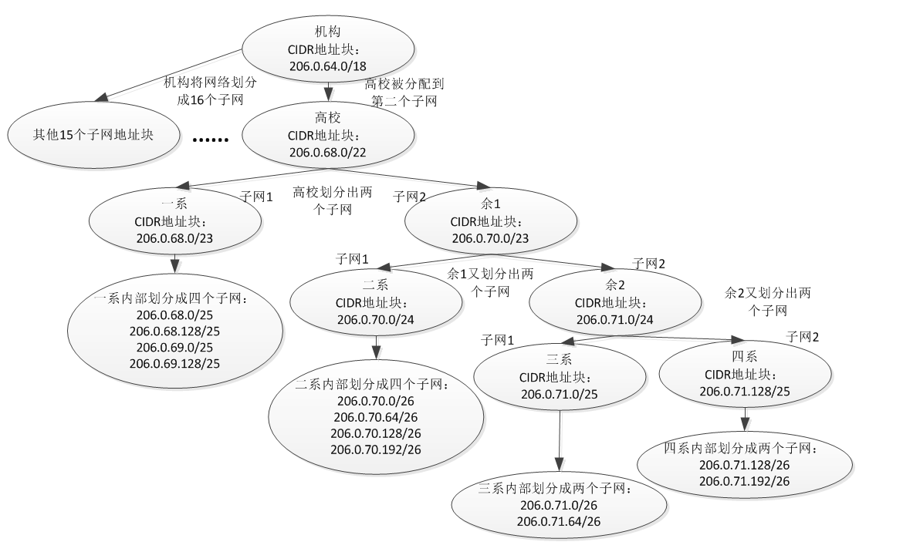

##### 私有地址

无论是基本子网，还是 CIDR 子网，都是为了更加充分的利用 IPv4 地址，但是每个主机获得的 IPv4 地址依旧是全网唯一的，所以，拥有 IPv4 地址的主机数量依旧无法突破 32 位 IPv4 地址位可容纳数量的上限。

是否有方法突破这个上限，以容纳更多数量的联网主机呢？

为了应对日益枯竭的 IPv4 地址，以及渐进的向 IPv6 过渡，通过 NAT 技术将一部分主机独立出去组成一个私有局域网。每台主机拥有一个私有 IP 地址，用于局路网内的相互通信。当局域网内的主机需要与外部主机进行通信时，通过 NAT 路由器动态获得一个全局地址进行通信。

为了避免，诸如误将私有局域网内的主机连接到互联网，等问题，私有地址拥有指定的范围：

* A类私有地址，10.0.0.0 ~ 10.255.255.255
* B类私有地址，172.16.0.0 ~ 172.31.255.255
* C类私有地址，192.168.0.0 ~ 192.168.255.255

在上面范围内的 IP 地址为私有 IP 地址，除此之外的 IP 地址为全局 IP 地址。在不同的私有局域网内，私有 IP 地址由于可以重复使用，从而使得有限的 IPv4 地址可以容纳超出其上限的主机数量。

全局地址由 ICANN，Internet Corporation for Assigned Names and Numbers，互联网名称与数字地址分配机构统一管理和分配。

##### IPv6

将 IPv4 升级为 IPv6 需要对所有主机和路由器的 IP 地址进行重置，目前这项工作正在进行中，但最终完成尚需时日。IPv4 依然是目前主流的 IP 地址，且部分 IPv6 技术也已经在 IPv4 中实现。

IPv6 地址的特点：

* IP 地址数量的扩大和路由控制表的聚合
  * IPv6 采用 8 组 16 字节共 128 位长度地址，可以分配 2^128^ ≈ 3.40 x 10^38^ 天文数字个 IP 地址
  * IPv6 采用分层结构和路由表聚合技术，防止路由表记录膨胀，保证传输效率
* 性能提升
  * 减小首部长度，降低路由器负荷
  * 采用路径 MTU 发现技术，路由器不再承担分片工作
* 支持即插即用
  * 即便没有 DHCP 服务器，也可实现自动分配 IP 地址
* 采用认证和加密功能
  * 应对伪造 IP 地址的网络安全功能
  * 防止线路窃听的功能
* 多播、Mobile IP 成为扩展功能
  * 多播和 Mobile IP 成为 IPv6 扩展功能

##### 问题

1. 判断 IP 地址是否合法？主机位全为 0 或 1 时，IP 地址非法。

   192.168.10.14/28（√）

   192.168.10.15/28（×）

   192.168.10.16/28（×）

   192.168.10.31/28（×）

2. 判断是否相同网段？网络标识不同则为不同网段

   192.168.10.14/28（相同）

   192.168.10.15/28（相同）

   192.168.10.16/28（不同）

3. 基本子网 172.168.34.56/20 划分成了多少子网？每个子网可容纳多少台主机？

   B 类 IP 地址：

   * 子网标识位数为 20 - 8 * 2 = 4，可划分为 2^4^ = 16 个子网
   * 主机标识位数为 32 - 20 = 12，可容纳 2^12^ - 2 = 4096 - 2 = 4094 台主机

4. 是否存在 IP 相同，网段不同的情况？比如，192.72.14.23/24 和 192.72.14.23/25 利用不同位数的网络标识理论上可以实现相同的 IP 地址，不同的子网掩码来标识两台主机。

   不存在这种情况，因为不论 CIDR 子网，还是早期的基础子网，机构/组织通常获得的是一个地址块内的所有 IP 地址，相同网络标识的 IP 地址必然位于同一网段，例如：

   ```
   11001110.00000000.01000110 .00000000/24
   206.0.70.0/24
   ```

   地址块必然拥有第四组八位的分配权，如果存在：

   ```
   11001110.00000000.01000110.0 0000000/25
   206.0.70.0/25
   ```

   将必然包含在 206.0.70.0/24 内。

   即 206.0.70.0/24 的 24 位网络标识同 206.0.70.0/25 的前 24 位完全相同，所以后者必然包含在前者内，不可能出现在不同的网段内，互联网 IP 地址始终是唯一的。

   但如果由于设置错误导致不同网段出现相同的 IP 地址时，会依据最长掩码优先原则将数据发送给子网掩码，即网络标识位最长的那个主机。

#### 路由控制

路由控制是将分组数据准备地发送到最终目标地址的功能。

##### 名词解释

###### 跳

> hop /hɑp/ v. 跳跃、跳过

数据帧从主机/路由器被传输到直接相连的路由器/主机，称为一跳（Hop）。

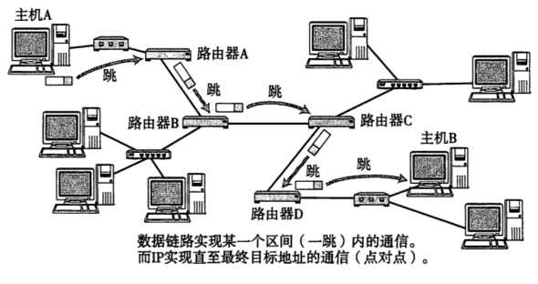

###### 路由

路由（Routing）就是通过互联网把信息从源地址传输到目的地址的活动。

###### 路由表

路由表，Routing table，又称路由控制表、路由择域信息库（Routing Information Base，RIB），是一个存储在路由器或联网计算机中的电子表格（文件）或类数据库，其中存储着指向特定网络地址的路径（有些情况下，还记录有路径的路由度量值）；同时，路由表中还含有网络周边的拓扑信息。

路由表的形成方式有两种：

* 静态路由控制，由管理员手动设置
* 动态路由控制，路由器之间通过路由协议相互交换路由控制信息时自动刷新

路由表建立的主要目标是为了实现路由协议和静态路由选择。

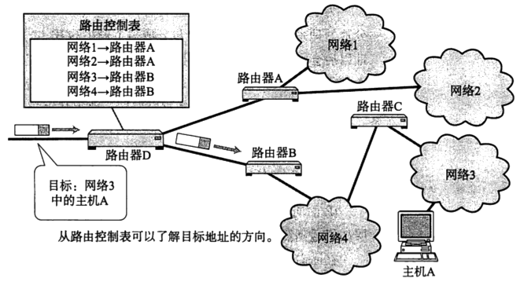

###### 多跳路由

多跳路由，是指数据帧需要经过多个连续的 Hop，最终到达目标地址的传输方式。

具体的实现方式是：IP 包到达某个路由器时，路由器需要首先查找其目标地址，然后通过路由表决定该数据包应该被发往的下个路由器；下一个路由器重复该过程，直至到达目标地址。

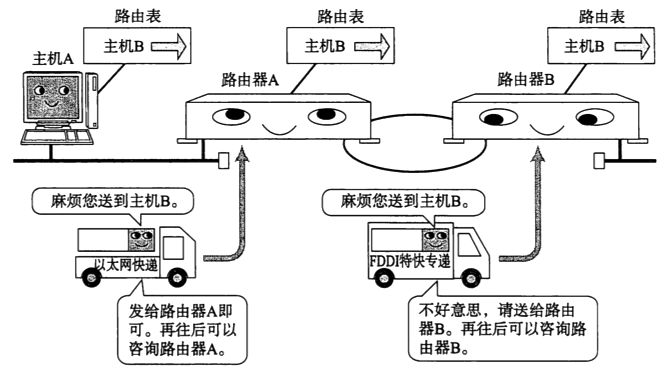

##### 工作机制

在知道数据目标 IP 地址的前提下，主机和路由器通过查询本身拥有的路由控制表，将数据多跳路由到目标主机。

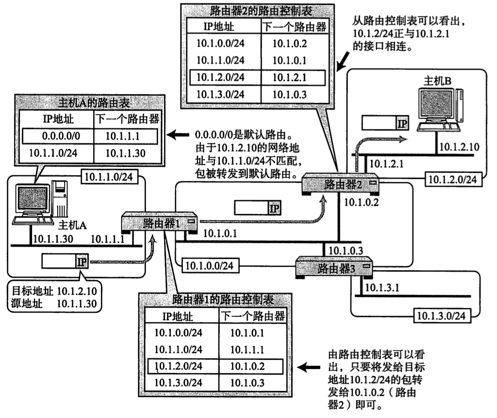

基本流程：

1. 主机 A 路由表中没有 IP 地址匹配目标地址10.1.2.10，发送数据给默认路由器1
2. 路由器1进行目标地址最接近匹配，最匹配地址是10.1.2.0/24，地址指向路由器2
3. 路由器2进行目标地址最接近匹配，发现完全匹配地址10.1.2.0/24，发送数据

#### 分包组包

> MTU，Maximum Transmission Unit，最大传输单元

采用分组交换技术的现代网络，考虑到数据的临时存储与排队，不同的数据链路存在最大传输单元，所以需要路由器在发送数据时对较大的数据进行分包。不过，为了减少路由器负担，避免降低传输效率，组包的操作只能由目标主机完成，即路由器只分包不组包。

##### 路径MTU发现

为了降低路由器负担，增加传输效率，现代网络技术将分包的功能前置到传输层 TCP/UDP 程序中处理。而为了避免传输过程中包容量超出部分数据链路 MTU 而激活路由器分包功能，TCP/UDP 程序需要将分组后的包容量控制为整个路由的 MTU。

发现路径 MTU 技术的基本原理：

1. 源主机发送特殊标志的分片
2. 若分片容量超出某个数据链路 MTU，相应的路由器直接丢弃包，并通过一个 ICMP 的不可到达信息将该数据链路上的 MTU 值发送给源主机
3. 源主机按获得最新 MTU 值重新分包，并再次重复过程 2，直到再也收不到 ICMP 为止
4. 最后的 MTU 值即为整个路径的 MTU

### 相关技术

#### NAT

NAT，Network Address Translation，网络地址转换，也称为网络掩蔽或者 IP 掩蔽，是一种在 IP 数据包通过路由器或防火墙时重写来源 IP 地址或目的 IP 地址的技术。

NAPT，Network Address and Ports Translation，网络地址和端口转换，在 NAT 技术的基础上还同时转换传输层 TCP/UDP 端口，是目前较为普遍使用的 NAT 技术。

NAT/NAPT 是为了日益枯竭的 IPv4 地址而研发的，不过，在 IPv6 中，为了提高网络安全，也会使用 NAT。通过 NAT 技术，多台主机可以在本地网络中使用私有地址，在连接互联网时使用相同的全局地址。

##### 工作机制

NAT 技术的工作机制（以主机 10.0.0.10 与主机 163.221.120.9 通信为例：）：

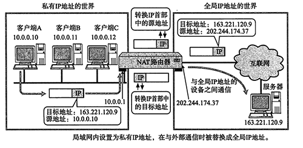

- NAT 路由器中维护一份私有地址 --> 全局地址的映射表，在主机 10.0.0.10  发送第一个数据包时，将其地址映射到 163.221.120.9
- 主机 10.0.0.10 发送数据经过 NAT 路由器时，NAT 路由器将数据首部中的源地址由 10.0.0.10 更改为 202.244.274.37 后再发送数据给目标地址主机
- 主机 163.221.120.9 发送数据经过 NAT 路由器时，NAT 路由器将数据首部中的目标地址由 202.244.274.37 更改为 10.0.0.10 后再发送数据给源地址主机

如果 NAT 技术的核心是实现私有 IP 地址到目标公有 IP 地址的映射，NAPT 技术的核心是实现私有 IP 地址 + 端口到目标公有 IP 地址 + 端口的映射，例如：

```
10.0.0.10:5566 -> 163.221.120.9:80
```

##### 主要分类

> cone /kon/ n.  圆锥体，圆锥形
>
> symmetric /sɪ'mɛtrɪk/ a.  对称的，匀称的

> 注：此节主要考虑比较普遍的 NAPT 技术分类。

NAPT 技术的主要分为锥型和对称型，其中，锥型又可分为全锥型、受限锥型和端口受限锥型。

这里假定：

```
公网 Server1 IP地址是1.1.1.1， 监听端口是1111
公网 Server2 IP地址是2.2.2.2， 监听端口是2222

NAT路由 IP地址是 8.8.8.8
NAT内部 Client是 192.168.0.3
```

如果 Client（192.168.0.3:100）请求 Server1（1.1.1.1:1111），请求报文到达 NAT 路由器，NAT 路由开辟新端口（假设为 800），建立起与 Client 的映射：

```
192.168.0.3:100 <-> 8.8.8.8:800 <-> 1.1.1.1:1111
```

至此，Client 和 Server1之间的报文就通过这个映射进行转发。

如果，此时，Client 又要和 Server2进行通信，基于是否复用旧的私有网络设备至 NAT 路由的映射：

* **锥型**，Cone，复用旧的私有网络设备至 NAT 路由的映射，即多个目标 Server 请求对应 NAT 路由的同一个端口，拓扑形状看起来就像锥子一样，例如这里的

  ```
  192.168.0.3:100 <-> 8.8.8.8:800 <-> 1.1.1.1:1111
  ```

* **对称型**，Symmetric，创建新的私有网络设备至 NAT 路由的映射，即一个目标 Server 请求对应一个 NAT 路由端口，例如，这里路由新开端口 801

  ```
  192.168.0.3:100 <-> 8.8.8.8:801 <-> 2.2.2.2:2222
  ```

  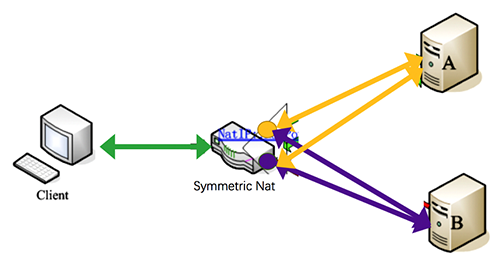

  所以，每一个私有网络主机端口到目标主机端口在 NAT 路由中均存在唯一映射：

  ```
  Client(IP:PORT) <-> NAT(IP:PORT) <-> Server(IP:PORT)
  ```

  无数个请求在 NAT 路由两端形成完全平行对称的结构。

基于旧有映射的锥型 NATP 技术，当收到其它 Server(2.2.2.2:2222)  发来的数据时：

* **全锥型**，Full Cone，无条件转发给私立网络设备（例如这里的 Client）。所以，基于该技术的 C/S 架构应用可以在任何一端发起连接，且私有网络设备可以与任何目标主机端口通信。

  如图中的 Client 与主机 A 的任意端口（ P1、P2... ），以及主机 B 任意端口（ P1...）都可以双向通信。

  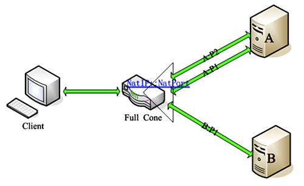

  

* **受限锥型**，Restricted Cone，如果 Client 之前给该 Server(2.2.2.2) 任何端口发送过数据，则转发。

  如图中的 Client 之前请求过主机 A 的 P1 端口，那么其可以与主机 A 的任意端口（ P1、P2… ）进行双向通信，但无法与其他主机（例如这里的主机 B）通信。

  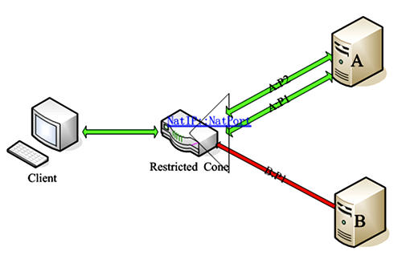

* **端口受限锥型**，Port Restricted Cone，如果 Client 之前给相应 Server (2.2.2.2:2222) 端口发送过数据，则转发。

  如图中的 Client 之前请求过主机 A 的 P1 端口，那么其只能与主机 A 的 P1 进行双向通信，无法与主机 A 的其他端口以及其他主机（例如这里的主机 B）的任意端口进行通信。

  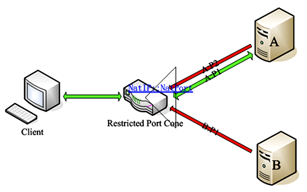

从上面描述可以看出，不同类型 NATP 技术的安全性系数：

```
对称型 > 端口受限锥型 > 受限锥型 > 全锥型
```

两个基于 NATP 技术的私有网络设备通信时，不同技术类型组合的穿透性：

| Client 端 NAPT 技术 | Server 端 端 NAPT 技术 | 可穿透 |
| ------------------- | ---------------------- | ------ |
| 全锥型              | 全锥型                 | ✔️      |
| 全锥型              | 受限锥型               | ✔️      |
| 全锥型              | 端口受限锥型           | ✔️      |
| 全锥型              | 对称型                 | ✔️      |
| 受限锥型            | 受限锥型               | ✔️      |
| 受限锥型            | 端口受限锥型           | ✔️      |
| 受限锥型            | 对称型                 | ✔️      |
| 端口受限锥型        | 端口受限锥型           | ✔️      |
| 端口受限锥型        | 对称型                 | ✘      |
| 对称型              | 对称型                 | ✘      |

##### 基本特点

NAT 技术的优点：

- 充分利用有限的 IPv4 地址
- 可以屏蔽外部连接请求，一定程度上提高私密性和安全性

NAT 技术的缺点：

- 有些协议无法通过 NAT，让位于 NAT 之后的主机之间通信变得复杂
- 对数据包进行编辑修改，导致通信效率的降低

##### 主要用途

NAT 技术的用途：

- 负载均衡：目的地址转换 NAT 可以重定向一些服务器的连接到其他随机选定的服务器
- 失效终结：如果一个系统有一台通过路由器访问的关键服务器，一旦路由器检测到该服务器宕机，它可以使用目的地址转换 NAT 透明的把连接转移到一个备份服务器上。
- 透明代理：NAT 可以把连接互联网的 HTTP 连接重定向到一个指定的 HTTP 代理服务器以缓存数据和过滤请求。

#### DNS

DNS，Domain Name System，域名系统，是域名和 IP 地址相互映射的分布式数据库，能够使人们通过域名而不是 IP 地址更方便地访问互联网。

DNS 的特点：

* 不仅适用于 IPv4，也适用于 IPv6
* 使用 TCP 和 UDP 端口53
* 每级域名长度限制是 63 个字符，域名总长度不超过 253 个字符

DNS系统中常见的资源记录类型有：

* A 记录，主机记录，将主机名映射到主机对应的IP地址上
* CNAME 记录，别名记录，将某个别名指向某个A记录
* AAAA 记录，IPv6主机记录，与A记录对应，将主机名映射到一个主机对应的 IPv6 地址

##### 工作机制

> 根域名服务器，root name server，是互联网域名解析系统（DNS）中最高级别的域名服务器，负责返回顶级域的权威域名服务器地址。

DNS 查询有两种方式：递归和迭代。DNS 客户端设置使用的 DNS 服务器一般都是递归服务器，它负责全权处理客户端的 DNS 查询请求，直到返回最终结果。而 DNS 服务器之间一般采用迭代查询方式。

以查询 zh.wikipedia.org 为例：

* 客户端发送查询报文"query zh.wikipedia.org"至 DNS 服务器，DNS 服务器首先检查自身缓存，如果存在记录则直接返回结果。
* 如果记录老化或不存在，则：
  1. DNS 服务器向根域名服务器发送查询报文"query zh.wikipedia.org"，根域名服务器返回顶级域 .org 的权威域名服务器地址
  2. DNS 服务器向 .org 域的权威域名服务器发送查询报文"query zh.wikipedia.org"，得到二级域 .wikipedia.org 的权威域名服务器地址
  3. DNS 服务器向 .wikipedia.org 域的权威域名服务器发送查询报文"query zh.wikipedia.org"，得到主机 zh 的 A 记录，存入自身缓存并返回给客户端

### 相关协议

#### ARP

> resolution n. 解决；决心

ARP，Address Resolution Protocol，地址解析协议，是通过解析 IP 地址来寻找 MAC 地址的网络传输协议。 

以太网协议中规定，同一局域网内的主机之间直接通信，必需目标主机的 MAC 地址。而在 TCP/IP 协议中，网络层和传输层只关心主机的 IP 地址。这就导致在 TCP/IP 的数据链路层使用以太网时，需要一种方法根据目标主机 IP 地址，获得其 MAC 地址，这就是 ARP 协议要做的事情。

IPv6 中使用邻居发现协议（NDP）用于代替 ARP。

##### 工作机制

在每台安装有 TCP/IP 协议的计算机或路由器里都有一个 ARP 缓存表，表里的 IP 地址与 MAC 地址是一对应的：

| 主机名称 | IP地址        | MAC地址           |
| -------- | ------------- | ----------------- |
| A        | 192.168.38.10 | 00-AA-00-62-D2-02 |
| B        | 192.168.38.11 | 00-BB-00-62-C2-02 |
| C        | 192.168.38.12 | 00-CC-00-62-C2-02 |
| D        | 192.168.38.13 | 00-DD-00-62-C2-02 |
| E        | 192.168.38.14 | 00-EE-00-62-C2-02 |
| ...      | ...           | ...               |

以主机 A（192.168.38.10）向主机 B（192.168.38.11）发送数据为例：

1. 发送数据时，主机 A 会在自己的 ARP 缓存表中寻找是否有目标 IP 地址。如果找到，直接把目标 MAC 地址写入数据帧发送就可

2. 如果主机 A 的 ARP 缓存表中没有相应 IP，则其会在网络上发送一个广播，目标 MAC 地址是

   ```
   FF.FF.FF.FF.FF.FF
   ```

   这表示向同一网段内的所有主机发出这样的询问：

   ```
   192.168.38.11（主机 B）的 MAC 地址是什么？
   ```

3. 非 ARP 询问的目标主机在接收到这个帧时不响应，只有主机 B 会向主机 A 做出这样的回应：

   ```
   192.168.38.11（我）的 MAC 地址是 00-BB-00-62-C2-02
   ```

   此回应以单播方式。主机 A 知道主机 B 的 MAC 地址后，就可以发送信息了，同时，它还更新自己的 ARP 高速缓存，下次再向主机B发送信息时，直接从 ARP 缓存表里查找就可。

ARP缓存表采用老化机制，在一段时间内如果表中的某一行没有使用，就会被删除，这样可降低缓存表的长度，加快查询速度。

#### ICMP

ICMP，Internet Control Message Protocol，互联网控制消息协议，用于 TCP/IP 网络中发送控制消息，包括网络是否通畅、主机是否可达、路由是否可用等网络相关问题的反馈；通过这些信息，使管理者可以对所发生的问题作出诊断，然后采取适当的措施。

ICMP 是一个"错误侦测与回报机制"，依赖 IP 完成任务，是 IP 的辅助组成部分。在 IP 通信中，当某个 IP 包未能准确到达目标主机时，具体的原因就由 ICMP 负责通知。例如，常用的 Ping 命令， Ping 的过程实际上就是 ICMP 协议工作的过程。

ICMP 主要通过不同的 Type 与 Code 让机器识别不同的连线状况，常用类别如下﹕

| Type | Code                    | 代表意思         |
| ---- | ----------------------- | ---------------- |
| 0    | Echo Reply              | 回送应答         |
| 3    | Destination Unreachable | 目标不可达       |
| 4    | Source Quench           | 原点抑制         |
| 5    | Redirect                | 重定向或改变路由 |
| 8    | Echo Request            | 回送请求         |
| 11   | Time Exceeded           | 超时             |

IPv4 中的 ICMP 被称作 ICMPv4，IPv6 中的ICMP则被称作ICMPv6。

##### 工作机制


例如：

1. 主机 A 向主机 B 发送数据包至 路由器 2
2. 路由器 2 多次发送 ARP 包以获取主机 B 的 MAC 地址时均失败
3. 路由器 2 返回一个 ICMP Destination Unreachable 包给主机 A
4. 主机 A 收到 ICMP 包后，通过解析其首部和数据域，获知具体发生问题的原因

ICMP 消息数据以明文的形式，像 TCP/UDP 一样通过 IP 发送。因此，从路由器 2 返回的 ICMP 包会像往常的路由控制经过路由器 1 到达主机 A。

#### DHCP

DHCP，Dynamic Host Configuration Protocol，动态主机设置协议，一个局域网内用于动态分配主机 IP 地址的网络协议。

通过 DHCP 统一管理 IP 地址分配，避免了手动设置繁琐、地址容易冲突等问题，尤其是局域网内主机数量、位置等存在频繁变动的场景。

DHCP 不仅适用于 IPv4，也适用于 IPv6

##### 工作机制

使用 DHCP 之前，首先需要架设单台或多台 DHCP 服务器，然后设置其可分配 IP 地址范围、子网掩码、路由控制信息以及 DNS 服务器地址。

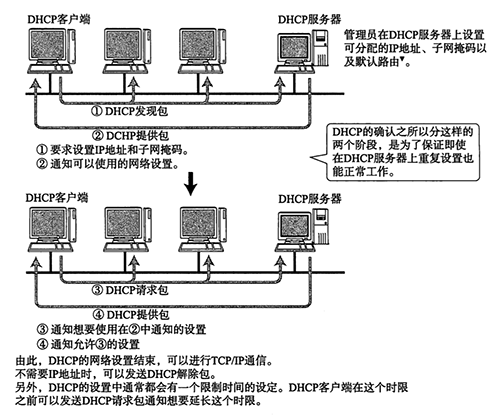

DHCP 协议的工作流程主要包含以下五个步骤：

1. DHCP 发现

   主机使用 255.255.255.255 地址广播寻找可用的 DHCP 服务器

2. DHCP 提供

   多个 DHCP 服务器可以响应同一个IP租约请求，但每一个客户网卡只能接受一个租约提供。

   收到客户端 IP 租约请求的 DHCP 服务器均会提供一个 IP 租约，并为客户端保留一个 IP 地址；随后，单播一个 DHCP OFFER（提供）消息给客户端，其中包含客户端 MAC 地址、服务器提供的 IP 地址、子网掩码、租期以及提供 IP 的 DHCP 服务器 IP

3. DHCP 请求

   客户端通常在收到第一个 IP 租约提供时，广播一个包含提供租约服务器 IP 的 DHCP REQUEST（请求）消息，告诉所有其他 DHCP 服务器它已经接受了一个租约提供。

   其他 DHCP 服务器收到了该消息后，收回已提供给客户的租约，把为该客户端保留的 IP 地址重新放回可用地址池中。

4. DHCP 确认

   DHCP 服务器收到来自客户的 REQUEST 消息后，会发送一个 DHC PACK 包给客户，其中包含租期和客户可能请求的其他所有配置信息。

   此时，配置过程完成。

5. DHCP 释放

   客户端向 DHCP 服务器发送一个请求以释放 DHCP 资源，并注销其 IP 地址。

#### STUN

> utilities /ju'tɪlətiz/ n. 实用程序、实用工具

STUN，Session Traversal Utilities for NAT，NAT 会话穿越应用程序，是一种网络协议，它允许位于 NAT（或多重 NAT）后的客户端找出自己的公网地址，查出自己位于哪种类型的 NAT 之后，以及 NAT 路由为客户端本地端口绑定的 Internet 端端口。

使用 STUN 获取的信息主要用来在两个同时处于 NAT 路由器之后的主机之间建立 UDP 通信，例如 webRTC 技术。

##### 工作机制

… TODO ...

##### 参考

* https://cloud.tencent.com/developer/article/1005974
* https://www.cnblogs.com/idignew/p/7439023.html


