## 传输层

TCP/IP 中两个具有主要的传输层协议：

* TCP，提供可靠传输
* UDP，提供不可靠传输，常用于广播和细节控制交给应用层的通信传输

### 套接

在网络层，IP 首部中有一个协议字段，用于标识来自传输层的数据是 TCP 的内容还是 UDP 的。同样，传输层的 TCP/UDP 需要使用端口号标识自己传输的数据来自/发给哪个应用？

#### 端口号

TCP/IP 传输层通过端口号识别同一台计算机中进行通信的不同应用程序。

值得思考的是：是不是每个应用程序（如浏览器）就只使用一个端口呢？个人认为不是，一个浏览器窗口可以打开多个 Tab，每个页面都会有若干个通信连接，这些连接如何区分？可行方案之一就是为每个连接新开一个独立端口加以区分。

需要强调的是：端口只是主机传输层识别应用程序连接的标识，考虑一个通信连接有源主机和目标主机两个角色，同时，除了传输层还有网络层等其它协议分层。因此，一个完整的通信连接需要源端口号、目标端口号、协议号（标识传输层是 TCP 还是 UDP）、源 IP 地址、目标 IP 地址五部分共同标识（注：Unix/Linux/Windows 可以使用 `netstat -n` 命令查看计算机通信连接信息）。

##### 特征

端口号的基本特征：

- 由使用的传输协议（TCP/UDP）决定
- 不同传输协议可以使用相同的端口号，例如，53 端口在 TCP 和 UDP 中均用于 DNS 服务
- 不同传输协议使用相同端口的目的可以相同也可以不同，系统会自动根据端口传输协议决定如何处理数据，比如相同的知名端口在 TCP 和 UDP 中用于不同的目的时

##### 分配

计算机进行通信时，分配端口号的方式有两种：

* 静态分配

  标准已经既定了部分端口号用于一些常用的应用程序，例如使用 TCP 传输协议的 HTTP、TELNET、FTP 等，这些端口号也称之为知名端口号，其范围一般是 0~1023。

  下表为 **TCP 传输协议**时的常用知名端口，TCP/UDP 协议知名端口号可查看[维基](https://zh.wikipedia.org/wiki/TCP/UDP%E7%AB%AF%E5%8F%A3%E5%88%97%E8%A1%A8)。

  | 端口 | 服务     | 内容                                        |
  | ---- | -------- | ------------------------------------------- |
  | 20   | FTP-data | FTP 协议数据传输端口                        |
  | 21   | FTP      | File Transfer Protocol，文件传输协议        |
  | 22   | SSH      | Secure Shell，安全外壳协议                  |
  | 23   | TELNET   | 远程终端协议                                |
  | 80   | HTTP     | HyperText Transfer Protocol，超文本传输协议 |
  | 443  | HTTPS    | HyperText Transfer Protocol over TSL/SSL    |
  | 990  | FTPS     | File Transfer Protocol over TSL/SSL         |

  除知名端口号外，范围 1024~49151 的端口也被正式注册，不过与知名端口不同的是，它们可用于任何通信用途

* 动态分配

  也称为时序分配，应用程序使用的端口号可以全权交由操作系统动态分配，例如浏览器打开网页时实时分配的端口，范围一般是 49152~65535

#### 套接字

> socket n. 插座

在 TCP/IP 协议的五层模型中，网络层和传输层主要是由操作系统来实现，基于不同应用程序的若干通信连接如何通过传输层来收发数据的目的，操作系统实现了称之为 Socket （套接字）的 API/类库。

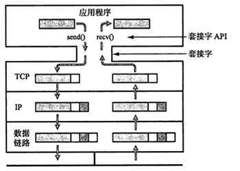

应用程序利用套接字 API 时，通常需要 3 个参数来标识一个通信连接：

* 使用的端口号
* 传输层协议（TCP/UDP）
* 目标 IP 地址

对于使用 B/S 架构的 Web 服务来说，需要一对套接字：

* ClientSocket，运行于客户端主机
* ServerSocket，运行于服务端主机

##### 分类

套接字有3种类型：

* 流式套接字 - - 使用 TCP 协议，提供可靠的、面向有连接的通信流，可用于 Telnet 远程连接、WWW 服务等
* 数据包套接字 - - 使用 UDP 协议，提供不可靠的、面向无连接的通信流，可用于广播、视频通话等
* 原始套接字 - - 允许对低层协议如 IP 或 ICMP 直接访问，主要用于新的网络协议实现的测试等

### TCP

> ACK，Acknowledgement，确认应答

TCP，Transmission Control Protocol，传输控制协议，是一种面向有连接的、可靠的、基于字节流的传输层通信协议。

TCP 的主要特征：

- 面向有连接的传输层协议
- 提供可靠传输，具有丰富的控制功能：
  - 连接管理 - 面向有连接的通信传输
  - 可靠性控制 - 通过序列号和确认应答（ACK）提高可靠性，并在数据破坏、丢包时重发
  - 顺序控制 - 通过序列号正确处理传输顺序混乱
  - 流量控制 - 有效利用带宽，防止网络拥堵，提高网络利用率
- 规范复杂，比如三次握手四次挥手，故不利于视频会议（音频、视频数据量既定）等场景使用

#### 连接控制

作为面向有连接的传输协议，TCP 在通信之前需要建立连接，并在传输完成时断开连接。

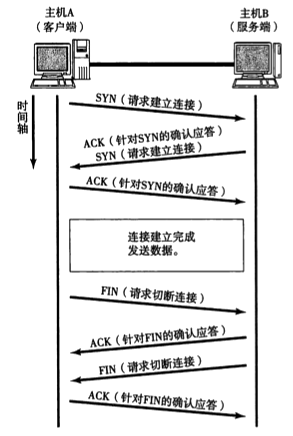

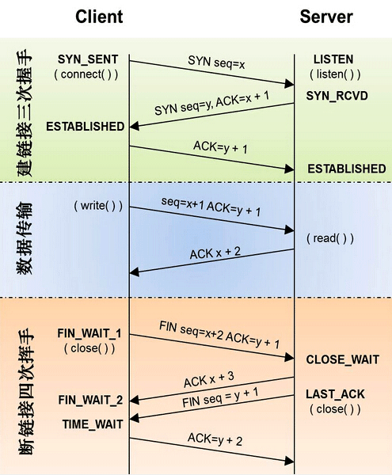

其中：

* SYN，Synchronize Sequence Number，同步序列号，用来建立连接
* FIN，Finish，用于断开连接

##### 三次握手

建立一个 TCP 连接需要发送 3 个包，这个过程称为“三次握手”。

三次握手的目的是同步连接双方的序列号 SYN 和确认号 ACK，并交换 TCP 窗口大小信息。

###### 过程

三次握手的过程：

1. 第一次握手，客户端发送请求连接报文
   * SYN = x，客户端请求连接 SYN

2. 第二次握手，服务端收到请求连接报文后发送 ACK + SYN 报文
   * ACK = x + 1，作为对客户端请求报文的确认应答
   * SYN = y，服务端自己的请求连接 SYN

3. 第三次握手，客户端收到服务端 ACK + SYN 报文后发送 ACK 报文
   * ACK = y + 1，作为对服务端请求报文的确认应答
   * 客户端认为连接建立成功
   * 服务端收到 ACK 后也认为连接建立成功

###### 原因

防止已失效的连接请求报文超时到达目标主机，因而产生错误。

例如，连接已断开时，客户端的连接请求报文超时到达，收到该请求的服务端，会误以为客户端再次发出了新的连接请求：

- 采用两次握手时，服务端发出 ACK 时，就会认为新的连接建立了。此时，客户端却不会理睬服务端的确认，也不会向服务端发送数据，导致服务端空等而浪费资源
- 采用三次握手时，服务端误以为客户端再次发出新的连接请求时，会向客户端发送 ACK + SYN 报文，客户端收到报文但不发出确认 ACK，服务端就不会建立连接

##### 四次挥手

断开一个 TCP 连接需要发送 4 个包，这个过程称为“四次挥手”。

###### 过程

四次挥手的过程：

1. 第一次挥手，客户端发送断开连接报文
   * FIN = x，客户端请求断开连接 FIN
2. 第二次挥手，服务端收到断开连接报文后发送 ACK 报文
   * ACK = x + 1，作为对客户端断开连接请求的确认应答
3. 第三次挥手，服务端发送断开连接报文
   * FIN = y，服务端请求断开连接 FIN
4. 第四次挥手，客户端收到断开连接报文后发送 ACK 报文
   * ACK = y + 1，作为对服务端断开连接请求的确认应答

###### 原因

TCP协议是一种面向连接的、可靠的、基于字节流的传输层通信协议，采用全双工模式，这就意味着：

* 主机 A 发出 FIN 报文时，只表示主机 A 没有数据发送了；但此时，主机 A 还是可以接受来自主机 B 的数据
* 主机 B 也发出FIN 报文时，表示主机 B 也没有数据要发送了，唯有此时，双方才能中断此次 TCP 连接

##### 参考

* https://www.cnblogs.com/xinde123/p/8379224.html

#### 可靠性控制

TCP 中，目标主机在每次收到数据时，都会返回一个已收到消息的通知，这个消息称为**确认应答**（ACK）。TCP 通过肯定的 ACK 实现可靠的数据传输。

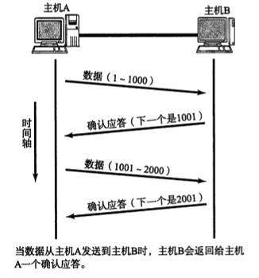

当出现以下状况导致在特定时间内未收到 ACK 时，源主机会重发相应数据：

* 数据在发送途中丢失

  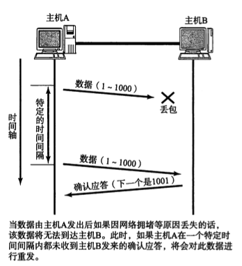

* ACK 在返回途中丢失或规定时间内未到达源主机（超时）

  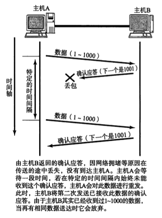

#### 顺序控制

TCP 中，顺序控制通过序列号实现：

* 待发送数据的每个字节都有顺次标记的序列号，目标主机每次接收到数据时，查询数据 TCP 首部中的序列号和数据长度，将计算出的下一步应接收的序列号作为 ACK 返回给源主机
* 目标主机接受到的序列号重复的数据（例如，ACK 返回超时导致数据重发）会被丢弃

#### 流量控制

##### 段

> segment /'segm(ə)nt/ n. 段、部分 v. 分割

源主机和目标主机在建立 TCP 连接，进行三次握手的同时，会交换彼此的最大消息长度（MSS，Maximum Segment Size），最终选择一个较小的值使用，以避免数据在 IP 中需要进行分片而导致传输性能下降，这个较小的值被称为段。

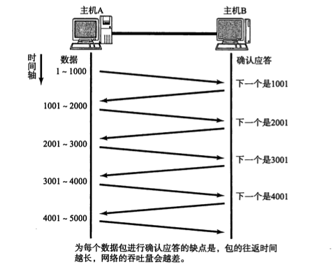

TCP 以 1 个段为单位，如图，每次发送的即为一个段，然后等待确认应答。但是，这种一段一应答方式的缺点是通信性能较低。

##### 窗口

窗口是指无需等待确认应答一次性可以发送最多的段组成的集合。

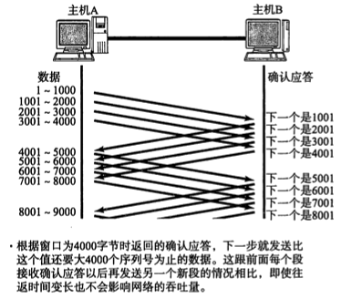

窗口大小是动态变化的，目标主机会根据自己的实时数据处理能力，在通信过程中，通过 TCP 首部中的窗口大小字段来实时提示源主机调整窗口大小。

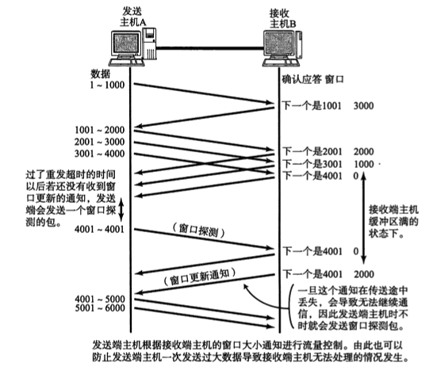

在实际的 TCP 通信过程中，采用窗口的方式发送数据。此时，目标主机收到数据，但是 ACK 未被源主机接收（丢失或超时等）的情况下，无需重发相应的数据，一定程度上提高了通信效率（**窗口的优点之一**）。

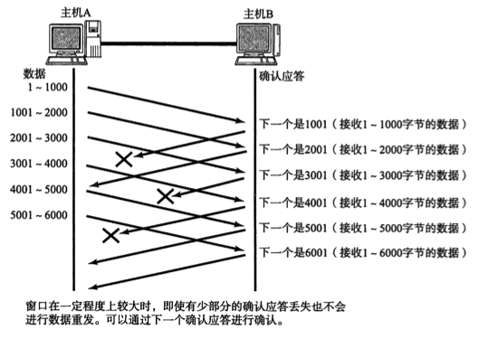

只有当未收到特定数据段时，目标主机才会通过多次重复同一序列号的 ACK 来提示源主机重发数据。源主机在连续收到 3 次同一序列号的确认应答时，就会重发对应数据。

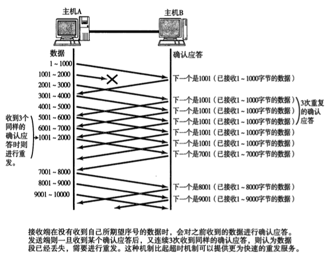

##### 拥塞窗口

为了防止一次性发送的窗口较大导致网络拥塞，甚至瘫痪，TCP 自我调谐中有一个慢启动的算法：即定义一个初始大小为 1 个数据段的“拥塞窗口”，之后每收到一次 ACK，拥塞窗口的值就加 1。发送数据时，取拥塞窗口和目标主机通知的窗口大小两者中的较小值，发送比较小值还要小的数据量。

### UDP

> datagram /'detə,græm/ n. 数据电报

UDP，User Datagram Protocol，用户数据包协议，一个简单的面向数据报的传输层协议。

UDP 的主要特征：

- 面向无连接的传输层协议
- 收到应用程序数据时，几乎立即按原样传递给网络层发送出去
- 提供不可靠传输，不提供复杂的控制机制，控制机制需要在应用程序中实现
  - 无顺序控制，即使数据到达目标时乱序
  - 无重发机制，即使传输途中出现丢包
  - 无流量控制机制，即使网络拥堵

正是由于 UDP 这些特点，使得其简单且高效，所以，经常用于以下几个方面：

* 广播通信（广播、多播）
* 音频、视频等多媒体即时通信
* 包总量较少的通信（DNS、SNMP等）
* 限定于 LAN 等特定网络中的应用通信

开发应用时，选择 TCP 还是 UDP，需要抉择的标准：

* 是否需要控制更多的通信细节
* 对可靠性要求较高，还是对时效性要求更高

