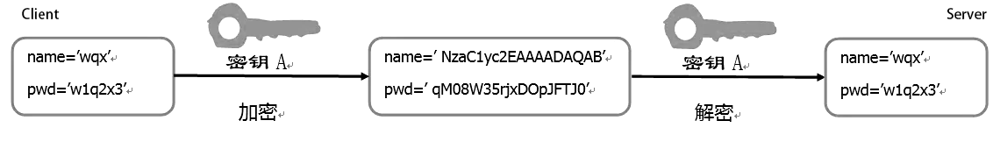
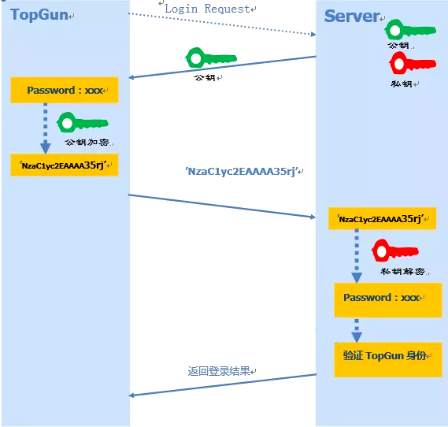
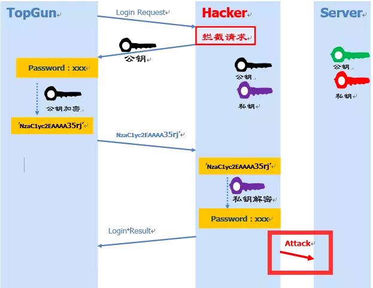
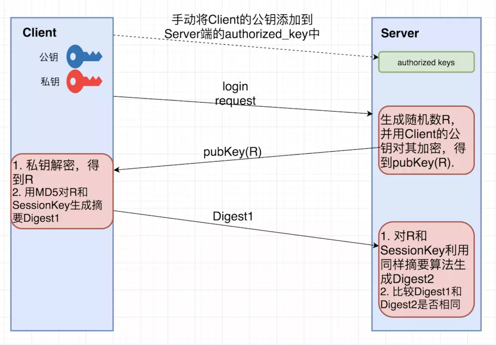
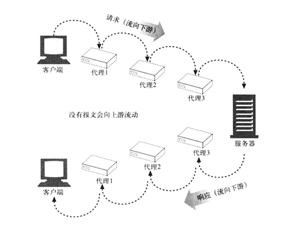
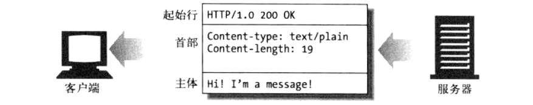
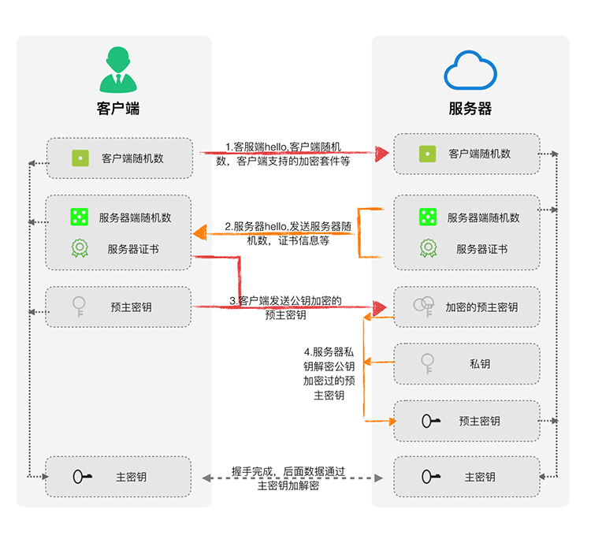
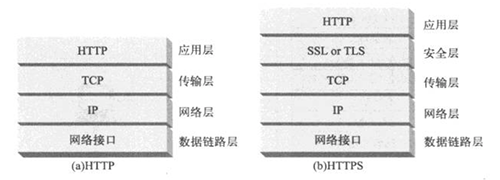
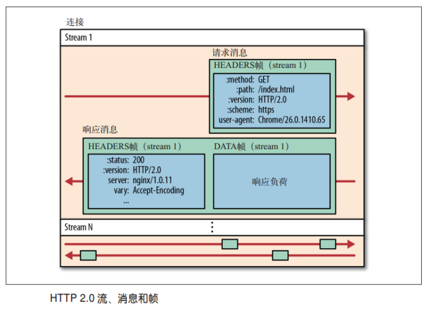
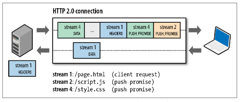

## 应用层

TCP 和 IP 等下层协议是应用程序的基础，因不受限于上传应用协议，所以拥有更广泛的适用性。而应用层协议往往有更具体的使用场景，由于应用场景较多，所以应用程序和相应的应用协议也较多。

### 远程登录

从本地计算机登录到网络中另一端计算机的过程叫远程登录。常用的远程登录协议有：TELNET 和 SSH。

#### TELNET

TELNET，远程终端协议，使用虚拟终端的形式，提供双向的、以文字字符串为主的命令行接口交互功能。

TELNET 会话传输的数据并未加密，账号和密码等敏感数据容易泄露，所以，更多时候使用更安全的 SSH。

##### 工作机制

TELNET 的工作机制：

1. 源主机运行 Telnet 程序，连线至目的服务器，通常在正确输入账号和密码后建立起一条 TCP 连接
2. 源主机 Telnet 程序输入文字命令
3. 目标主机的 telnetd 守护程序（通常监听在 23 端口）收到文字命令转发给 Shell
4. 目标主机的 Shell 接受并执行命令，最后将结果通过 telnetd 返回给源主机
5. 源主机 Telnet 程序显示结果

#### SSH

SSH，Secure Shell，安全外壳协议，是一种加密的网络传输协议，可在不安全的网络中为计算机的 Shell 提供安全的传输环境。

任何网络服务都可以通过 SSH 实现安全传输，不过，它最常见的用途还是远程登录系统，用作非安全 TELNET 的替代方式。

SSH 只是一种协议标准，具体实现有很多，既有使用最广泛的开源实现 OpenSSH，也有其它的商业实现方案。

##### 加密方式

相对于 TELNET，SSH 安全性的主要实现方式是对传输数据的加密，而加密的方式主要有两种：

* 对称加密，又名秘钥加密
* 非对称加密，又名公钥加密

###### 对称加密



对称加密，指数据的加密和解密使用同一套秘钥。

对称加密的问题是：存在数量极为庞大的客户端，每一个客户端/服务端配对都需要有独一无二的密钥，而服务端和客户端由于需要使用相同的密钥，这就涉及到密钥的保存或传输，如若如此，密钥就容易被窃取，对称加密的安全性就不复存在了。为了解决这个问题，非对称加密应运而生。

###### 非对称加密



非对称加密，指数据的加密和解密使用公钥和私钥密钥对。

密钥对的特性：

```
1. 公钥加密后的密文，只能通过对应的私钥进行解密
2. 通过公钥推理出私钥的可能性微乎其微
```

非对称加密方案的登录流程：

```
1. Client 端用户（例如，TopGun）向 Server 端发起登录请求
2. Server 端把自己的公钥发给用户（注意存在安全隐患）
3. Client 端使用 Server 端公钥将密码加密，并发送给 Server 端
4. Server 端用自己的私钥解密用户登录密码，在验证其合法性后返回登录结果
```



非对称加密的问题是：Client 端如何保证接收到的公钥一定是目标 Server 端的？如果：

* 攻击者中途拦截 Client 的登录请求，向其发送自己的公钥
* Client 端用攻击者公钥加密数据，并发送给攻击者
* 攻击者接收到加密信息后用自己的私钥进行解密

这就是**中间人攻击**（man-in-the-middle attack）。

解决中间人攻击的核心是如何对 Server 端的公钥进行认证？在 HTTPS 中可以通过 CA 来进行公证，可是 SSH 的publish key 和 private key 都是自己生成的，没法公证，只能通过 Client 端自己对公钥进行确认。所以，在上文非对称加密方案的登录流程步骤 2 中，需要增加公钥的认证过程。

公钥认证的常用策略有两种：

* 基于口令的认证

  以 github 为例，第一次登录时：

  ```
  ssh flyingsouthwind@github.com
  ```

  收到终端提示信息：

  ```
  The authenticity of host 'github.com (13.229.188.59)' can't be established.
  RSA key fingerprint is SHA256:nThbg6kXUpJWGl7E1IGOCspRomTxdCARLviKw6E5SY8.
  Are you sure you want to continue connecting (yes/no)? 
  ```

  上面的信息是说：无法确认主机 github.com (13.229.188.59) 的真实性，不过知道它的公钥指纹，是否继续连接？

  > 注意，之所以用 fingerprint（指纹）代替 key，主要是 key 过长（RSA 算法生成的公钥有 1024 位），很难直接比较，所以使用公钥进行 hash 生成一个较短的指纹进行比对更加方便。

  Client 端用户需要通过同目标主机进行比对确认该公钥指纹是否正确，如果正确，输入 yes 后：

  ```
  Warning: Permanently added 'github.com,13.229.188.59' (RSA) to the list of known hosts.
  Password: (enter password) 
  ```

  该 host 已被确认，远程主机的 host key 会被加入到 Client 端本地的 known_hosts 中。随后，输入密码，继续非对称加密的登录流程。

* 基于公钥认证

  上面登录流程中，每次登录都需要输入密码，很麻烦。SSH 提供了另外一种可以免去输入密码过程的登录方式：公钥登录。

  

  公钥认证的流程：

  ```
  1. Client 端将自己的公钥手动存放在 Server 端(追加在文件 authorized_keys 中)
  2. Server 端接收到 Client 端的连接请求后，会在 authorized_keys 中匹配 Client 的公钥 pubKey，并生成随机数 R，用 Client 端的公钥对该随机数进行加密得到 pubKey(R)，然后将加密后信息发送给 Client 端
  3. Client 端通过私钥进行解密得到随机数 R，然后对随机数 R 和本次会话的 SessionKey 利用 MD5 生成摘要Digest1，发送给Server端
  4. Server端也会对 R 和 SessionKey 利用同样摘要算法生成 Digest2，最后比较 Digest1 和 Digest2 是否相同，完成认证过程
  ```

##### 应用实践

###### SSH 远程登录

```
# 以用户名user，登录远程主机host
$ ssh user@host

# 本地用户和远程用户相同，则用户名可省去
$ ssh host

# SSH默认端口22，可以用参数p修改端口
$ ssh -p 2017 user@host
```

###### 生成 SSH KEY

生成 SSH KEY 密钥对命令：

```
ssh-keygen -t rsa -C “email@example.com” -P "" -f “~/.ssh/id_rsa”
```

其中：

* -t，指定生成密钥类型（rsa、dsa、ecdsa等）
* -C，指定电子邮件标签，可省略
* -P，指定passphrase，用于确保私钥的安全，可省略
* -f，指定存放密钥的文件（默认目录“~/.ssh/id_rsa”，公钥文件默认和私钥同目录），可省略

相关文件：

* id_rsa，保存私钥
* id_rsa.pub，保存公钥
* known_hosts，保存已认证的远程主机指纹，这个文件主要是通过 Client 和 Server 的双向认证以避免中间人攻击，每次 Client 向 Server 发起连接的时候，不仅仅 Server 要验证 Client 的合法性，Client 同样也需要验证 Server 的身份，SSH client 就是通过 known_hosts 中的 host key 来验证 Server 身份的
* authorized_keys，保存已授权客户端公钥，由于一台主机可能同时是 Client 和 Server，所以，可同时拥有 known_hosts 和 authorized_keys

##### 工作机制

为实现 SSH 的安全连接，服务器端与客户端要经历如下五个阶段：

1. 协议版本协商

   SSH 目前包括 SSH1 和 SSH2 两个版本， 双方通过版本协商确定使用的版本

2. 密钥和算法协商

   SSH 支持多种加密算法， 双方根据客户端和服务端支持的算法，协商出最终使用的算法

3. 认证阶段

   SSH 客户端向服务器端发起认证请求， 服务器端对客户端进行认证

4. 会话请求阶段

   认证通过后，客户端向服务器端发送会话请求

5. 交互会话阶段

   会话请求通过后，服务器端和客户端进行信息的交互

###### 协议版本协商

> Note： 版本号协商阶段报文都是采用明文方式传输的

协议版本号协商的基本流程：

```
1. 服务器打开端口 22
2. 客户端与服务器端建立 TCP 连接
3. 服务器向客户端发送第一个报文，包括版本标志字符串，格式为“SSH－<主协议版本号>.<次协议版本号>－<软件版本号>”，协议版本号由主版本号和次版本号组成，软件版本号主要为调试使用
4. 客户端收到报文后，如果服务端协议版本号比自己的低，且客户端能支持服务器端的低版本，就使用服务器端的低版本协议号，否则使用自己的协议版本号；随后，客户端回应服务器一个报文，其中包含了客户端决定使用的协议版本号
5. 服务端比较客户端发来的版本号，决定是否能同客户端一起工作；如果协商成功，则进入密钥和算法协商阶段，否则服务器端断开 TCP连接
```

###### 密钥和算法协商

密钥和算法协商的基本流程：

```
1. 服务端和客户端分别发送算法协商报文给对端，报文中包含自己支持的公钥算法列表、加密算法列表、MAC（Message Authentication Code，消息验证码）算法列表、压缩算法列表等
2. 服务器端和客户端根据对端和本端支持的算法列表得出最终使用的算法
3. 服务器端和客户端利用 DH交换（Diffie-Hellman Exchange）算法、主机密钥对等参数，生成会话密钥和会话 ID
```

通过以上步骤，服务器端和客户端就取得了相同的会话密钥和会话 ID:

* 对于后续传输的数据，两端都会使用会话密钥进行加密和解密，保证了数据传送的安全
* 在认证阶段，两端会使用会话 ID 用于认证过程

###### 认证阶段

认证阶段的基本流程：

```
1. 客户端向服务器端发送认证请求，认证请求中包含用户名、认证方法、与该认证方法相关的内容（如：password认证时，内容为密码）
2. 服务器端对客户端进行认证，如果认证失败，则向客户端发送认证失败消息，其中包含可以再次认证的方法列表
3. 客户端从认证方法列表中选取一种认证方法再次进行认证
4. 该过程反复进行，直到认证成功或者认证次数达到上限，服务器关闭连接为止
```

###### 会话请求阶段

会话请求阶段的基本流程：

```
1. 服务器等待客户端的请求
2. 认证通过后，客户端向服务器发送会话请求
3. 服务器处理客户端的请求。请求被成功处理后， 服务器会向客户端回应 SSH_SMSG_SUCCESS 包，SSH 进入交互会话阶段；否则回应 SSH_SMSG_FAILURE 包，表示服务器处理请求失败或者不能识别请求
```

###### 交互会话阶段

在这个模式下，数据被双向传送：

```
1. 客户端将要执行的命令加密后传给服务器
2. 服务器接收到报文，解密后执行该命令，将执行的结果加密发还给客户端
3. 客户端将接收到的结果解密后显示到终端上
```

##### 参考

* https://www.jianshu.com/p/33461b619d53
* https://www.jianshu.com/p/8e5b7aea52b5

### 文件传输

文件传输的常用协议是 FTP 和 FTPS。

#### FTP

FTP，File Transfer Protocol，文件传输协议，一个客户端和服务器之间进行文件传输的应用层协议。

##### 工作机制

FTP 会建立两条 TCP 连接：

* 一条用于控制，默认使用端口 21，用户要求断开前会一直保持连接，在 FTP 的控制部分使用，例如：
  * 登录用户名和密码的验证
  * 发送文件的名称
  * 发送方式的设置
* 一条用于数据传输，默认使用端口 20，会根据控制端口进行的操作（GET、PUT 或文件一览表 List）实时的创建 TCP 连接，数据传输结束时即会关闭连接

#### FTPS

FTPS，File Transfer Protocol over TLS/SSL，是一种对常用的文件传输协议（FTP）添加传输层安全（TLS）和安全套接层（SSL）加密协议支持的扩展协议。

FTPS 协议默认使用端口 990。

### 电子邮件

提供电子邮件的协议是 SMTP 和 POP。

早期的邮件发送从源主机直接到目标主机，因为那时的源主机和目标主机基本处于同时开机状态，SMTP 协议可以处理这整个过程。

但是，随着互联网的发展，邮件使用场景越加复杂，接收邮件的计算机不可能总是处于开机状态，所以原本的源主机 -> 目标主机的模式演变成源主机 -> 服务器 -> 目标主机的模式，此时：

* SMTP，演变成源主机 -> 服务器的处理协议
* POP，处理服务器 -> 目标主机阶段

#### SMTP

SMTP，Simple Mail Transfer Protocol，简单邮件传输协议。

SMTP 协议默认使用端口 25。

#### POP

POP，Post Office Protocol，邮局协议，支持使用客户端远程管理在服务器上的电子邮件以及离线邮件处理。

### WWW

WWW 定义了三个重要的概念：

* URI，Universal Resource Identifier，统一资源标识符，标识信息的位置
* HTML，HyperText Markup Language，超文本标记语言，信息的表现形式
* HTTP，HyperText Transfer Protocol，超文本传输协议，信息转发

#### URI

URI，统一资源标识符，一个用于标识资源的字符串，这个资源可以是存放在服务器的互联网资源，比如一个网页，也可以是非互联网资源，比如一本书。

URI 有两种具体的实现形式：

* URL，Universal Resource Locator，统一资源定位符，用地址定位一个资源
* URN，Universal Resource Name，统一资源名称，用名称定位一个资源


例如，定位一个具体的人（URI）：

* URL 方式类似于：

  ```
  x 省 x 市 x 区 x 小区 x 单元 x 室
  ```

* URN 方式类似于：

  ```
  身份证号 + 名字
  ```

##### URL

URL，统一资源定位符，用以标识一个存放在互联网上的资源，它是 URI 的一种实现方式，也是 URI 的子集。

URL 的标准格式：

```
协议类型:[//[访问资源需要的凭证信息@]服务器地址[:端口号]][/资源层级UNIX文件路径]文件名[?查询][#片段ID]
```

其中，常用协议类型有 http、https、ftp、mailto、telnet、file 等。

实例：

```
http://www.jianshu.com/u/1f0067e24ff8
ftp://www.example.com/resource.txt
```

##### URN

URN，统一资源名称，它命名资源但不指定如何定位资源，它也是 URI 的一种实现方式，也是 URI 的子集。

实例：

```
# 国际标准期刊编号
urn:issn:1535-3613

# 国际标准图书编号
urn:isbn:9787115318893

# 简单邮件传输协议
mailto:jijs@jianshu.com
```

#### HTTP

HTTP，HyperText Transfer Protocol，超文本传输协议，一种用于分布式、协作式和超媒体信息系统的应用层协议，默认使用 80 端口。

HTTP 协议最初设计的目的仅仅是为了提供一种发布和接收 HTML 文件的方法；但是，随着协议的不断发展，如今任何格式的内容都可以通过 HTTP 协议发送，比如图像、视频、二进制文件等，这些资源使用 URI 标识。

##### 协议发展

###### HTTP/0.9

1991年发布，协议特点：

* 版本极其简单，只支持 GET 命令，命令格式：

  ```
  GET /index.html
  ```

* 客户端请求时，建立一个 TCP 连接，服务器只回应 HTML 格式的字符串，即只有实体，没有后来的头信息：

  ```
  <html>
    <body>Hello World</body>
  </html>
  ```

* 服务器发送完毕，就关闭TCP连接

###### HTTP/1.0

1996年5月发布，协议特点：

* 任何格式的内容都可以发送，包括文字、图像、视频、二进制文件等

* 支持 GET、POST 和 HEAD 三种命令

* 请求和响应格式改进，除数据部分，每次通信都必须包括用来描述一些元数据的头信息（HTTP header）等附加信息，如状态码、多字符集支持、多部分发送、权限、缓存、内容编码等新增功能

  * 请求格式：首行是请求命令，尾部必须添加协议版本（HTTP/1.0）；后面是描述客户端情况的多行头信息

    ```
    GET / HTTP/1.0
    User-Agent: Mozilla/5.0 (Macintosh; Intel Mac OS X 10_10_5)
    Accept: */*
    ```

  * 响应格式：`头信息 + 一个空行（\r\n） + 数据` ，首行格式为 `协议版本 + 状态码 + 状态描述`

    ```
    HTTP/1.0 200 OK 
    Content-Type: text/plain
    Content-Length: 137582
    Expires: Thu, 05 Dec 1997 16:00:00 GMT
    Last-Modified: Wed, 5 August 1996 15:55:28 GMT
    Server: Apache 0.84
    
    <html>
      <body>Hello World</body>
    </html>
    ```

- **一个请求对应一个 TCP 连接，数据传输效率低（HTTP/1.0 存在问题）**，为解决该问题，部分浏览器非标准的添加下面的头信息，以实现 TCP 连接的多次复用：

  ```
  Connection: keep-alive
  ```

###### HTTP/1.1

1997年1月发布，协议特点：

* 新增命令

  支持命令 GET、POST、HEAD 以及 PUT、DELETE、TRACE、OPTIONS

* 新增头信息

  请求头信息增加指定服务器域名 Host 字段，以支持请求同一台服务器上的不同网站，为虚拟主机的兴起打下了基础

  ```
  Host: www.example.com
  ```

* 持久连接

  TCP 连接默认不关闭，可以被多个请求复用，但浏览器一般对单个域名有 6~8 个左右的数量限制

* 管道机制

  * 请求时，同一个 TCP 连接中的请求可同时发出，而 HTTP/1.0 中是顺序发送，即后一个请求必须等待至收到前一个请求响应时才发出
  * **响应时，服务器还是按顺序响应（HTTP/1.1 存在问题）**，但响应头信息中需要添加 Content-Length 字段，客户端通过该字段确定同一个 TCP 通道中的哪些数据属于哪个请求。与此同时，服务器的顺序响应机制导致响应慢的请求会阻塞后面排队的请求，造成"队头堵塞"（Head-of-line blocking）。为了避免该问题，前端优化通常会采用：
    * 减少请求，合并脚本和样式表、将图片嵌入 CSS 等
    * 增加域名，以突破浏览器单个域名持久请求数量限制

* 分块传输

  服务器响应方式可以有两种方式：

  * 缓存模式（buffer）：针对较小的资源，短时间可以完全读取以获得文件大小，使用 Content-Length 响应头信息转发给客户端

    ```
    Content-Length: 3495
    ```

  * 流模式（stream）：针对较大的资源或耗时的动态操作而言，完全获取整个文件后再转发，不仅耗时而且耗费硬件资源（缓存较大的数据）。此时，高效的方式是数据边获取边转发，对应的响应头信息中没有了 Content-Length 字段，而是使用 Transfer-Encoding 字段：

    ```
    Transfer-Encoding: chunked
    ```

    采用流模式时，每个非空的数据块之前，都有一个标识该块数据大小的 16 进制数字，最后是一个大小为 0 的块，就表示本次响应数据发送完毕

    ```
    HTTP/1.1 200 OK
    Content-Type: text/plain
    Transfer-Encoding: chunked
    
    25
    This is the data in the first chunk
    
    1C
    and this is the second one
    
    3
    con
    
    8
    sequence
    
    0
    ```

###### HTTP/2

2009年，谷歌公开自行研发的 SPDY 协议，主要解决 HTTP/1.1 效率不高的问题。

2015年，基于 SPDY 的 HTTP/2 发布，注意不是 HTTP/2.0，因为标准委员会不打算再发布子版本，下一个新版本将是 HTTP/3。

##### HTTP/1.1

> ASCII，American Standard Code for Information Interchange，美国信息交换标准代码，用于显示现代英语字母和常用符合的编码方案。例如，用 0100 0001(二进制)/65(十进制) 表示 A 



前后端交互时，信息的载体是 HTTP 报文：

* 请求报文，包含一条请求，流出客户端，流入服务端
* 响应报文，包含一条响应，流出服务端，流入客户端



HTTP 报文是简单的格式化数据块，无论请求报文还是响应报文，其主要组成部分：

* 起始行，ASCII 文本格式，对报文进行描述
* 首部块，ASCII 文本格式，包含附加信息
* 实体数据，可选，包含 HTTP 要传输的内容，格式可以是文本、二进制数据或者空

辅助组成部分：

* 空行，首部与实体之间必须有一个空行
* CRLF，Carriage-Return Line-Feed，回车换行，由一个回车符（ASCII 13）和一个换行符组成（ASCII 10），作为报文中每行的结束标志

###### 请求报文

请求报文的格式：

```
<method> <request-url> <version>	# 起始行
<headers>							# 首部

<entity-body>					# 实体
```

实例：

```
GET /img/bd_logo1.png?where=super HTTP/1.1
Host: www.baidu.com
Connection: keep-alive
User-Agent: Mozilla/5.0 (Macintosh; Intel Mac OS X 10_12_6) AppleWebKit/537.36 (KHTML, like Gecko) Chrome/72.0.3626.109 Safari/537.36
Accept: image/webp,image/apng,image/*,*/*;q=0.8
Referer: https://www.baidu.com/
Accept-Encoding: gzip, deflate, br
Accept-Language: zh-CN,zh;q=0.9,en;q=0.8,ja;q=0.7,zh-TW;q=0.6
Cookie: BAIDUID=57F30C044CA600984A86FCE3C1834D9E:FG=1; PSTM=1550559212;
```

其中：

* \<method>

  方法，客户端希望服务端执行的操作，包括：

  * GET，获取一份文档
  * HEAD，只读取文档首部
  * POST，发送需要处理的数据，比如表单数据
  * PUT，向服务器写入文档
  * DELETE，删除一份文档，但不保证成功，HTTP 规范允许服务端在不通知客户端的情况下撤销删除请求
  * TRACE，追踪报文，用于链路诊断，看看可能经过防火墙、代理、网关或其它一些应用程序后，最终会变成什么样子？目标服务器收到 TRACE 请求时会在响应中携带收到的原始报文，以使得客户端可以比对报文是否被中途修改或毁坏
  * OPTIONS，询问服务器其支持的各种功能，比如支持哪些方法、或对某些特殊资源支持哪些方法，便于客户端调整后续操作

  其中：

  * GET 和 HEAD 称为安全方法，即这两种方法的 HTTP 请求不会在服务端产生任何后果
  * 服务器可能并不会实现协议中的每种方法。此外，除以上方法，服务器还可以根据自己需要实现其它的方法，这些方法称之为扩展方法

* \<requese-url>

  请求资源的 URL

* \<version>

  报文使用的 HTTP 协议版本，基本格式为：`HTTP/<主要版本>.<次要版本>` 。请求和响应报文中都有版本，目的是为客户端和服务端提供一种方法，以了解对方对 HTTP 协议版本的支持，防止使用对方不支持的功能

* \<headers>

  零个或多个请求首部，首部基本格式为：`名称: 值` 。首部有以下五种分类，首部详细释义可参见[here](https://www.kancloud.cn/spirit-ling/http-study/645705)：

  * 通用首部

    既可出现在请求报文中，也可出现在响应报文中。

    一般通用首部：

    | 首部              | 描述                                                |
    | ----------------- | --------------------------------------------------- |
    | Connection        | 与请求/响应连接有关的选项，常用值 keep-alive、close |
    | Date              | 报文创建时间                                        |
    | MIME-Version      | 使用的 MIME 类型版本                                |
    | Transfer-Encoding | 报文采用的编码方案                                  |
    | Update            | 发送端希望升级协议版本或协议                        |
    | Via               | 报文经过的中间节点（代理、网关等）                  |
    | Trailer           | 说明在报文主体后追加记录了哪些首部字段              |

    缓存通用首部：

    | 首部          | 描述                           |
    | ------------- | ------------------------------ |
    | Cache-Control | 强缓存控制                     |
    | Pragma        | 要求中间服务器不返回缓存的资源 |

  * 请求首部

    只出现在请求报文中，提供更多有关请求的信息。

    一般请求首部：

    | 首部       | 描述                            |
    | ---------- | ------------------------------- |
    | Client-IP  | 客户端机器 IP                   |
    | From       | 客户端用户 E-mail 地址          |
    | Host       | 目标服务器主机名和端口          |
    | Referer    | 包含当前请求资源 URI 的文档 URL |
    | UA-Color   | 客户端显示器显示颜色相关的信息  |
    | UA-CPU     | 客户端机器 CPU 相关信息         |
    | UA-Disp    | 客户端显示器显示能力相关信息    |
    | UA-OS      | 客户端机器操作系统相关信息      |
    | UA-Pixels  | 客户端显示器的像素信息          |
    | User-Agent | 发起请求的应用程序名称          |

    Accept首部：

    | 首部            | 描述                     |
    | --------------- | ------------------------ |
    | Accept          | 客户端可接受媒体类型     |
    | Accept-Charset  | 客户端可接受字符集       |
    | Accept-Encoding | 客户端可接受编码方案     |
    | Accept-Language | 客户端可接受语言         |
    | TE              | 客户端可接受扩展传输编码 |

    条件请求首部：

    | 首部                | 描述                                                         |
    | ------------------- | ------------------------------------------------------------ |
    | Expect              | 客户端期望的服务端行为                                       |
    | If-Match            | 服务端文档 Etag 与客户端匹配时，使用客户端文档缓存           |
    | If-None-Match       | 服务端文档 Etag 与客户端不匹配时，重新获取文档               |
    | If-Modified-Since   | 在指定日期后文档修改过，重新获取文档，否则使用客户端文档缓存 |
    | If-Unmodified-Since | 在指定日期后文档未修改过，使用客户端文档缓存，否则重新获取文档 |
    | If-Range            | 文档 Etag 或更新时间与客户端一致时，发送缺失部分，否则发送整个实体 |
    | Range               | 指定请求资源其中的一部分                                     |

    安全请求首部：

    | 首部          | 描述                     |
    | ------------- | ------------------------ |
    | Authorization | 客户端认证数据           |
    | Cookie        | 客户端 Cookie            |
    | Cookie2       | 客户端支持的 Cookie 版本 |

    代理请求首部：

    | 首部                | 描述                                                         |
    | ------------------- | ------------------------------------------------------------ |
    | Max-Forward         | 传输途中，请求转发给代理或网关的最大次数，与 TRACE 方法一起使用 |
    | Proxy-Authorization | 与 Authorization 相同，但用于代理                            |
    | Proxy-Connection    | 与 Connection 相同，但用于代理                               |

  * 响应首部

    只出现在响应报文中，提供更多有关响应的信息。

    一般响应首部：

    | 首部        | 描述                                       |
    | ----------- | ------------------------------------------ |
    | Age         | 服务端在多久前创建了响应，单位为秒         |
    | Public      | 资源支持的请求方法列表                     |
    | Retry-after | 资源不可用时，何时或者多久之后再次发起请求 |
    | Server      | 服务器应用程序的名称和版本                 |
    | Title       | 文档标题                                   |
    | Warning     | 比起始行中原因短语更详细的警告报文         |

    协商响应首部：

    | 首部         | 描述                                     |
    | ------------ | ---------------------------------------- |
    | Accept-Range | 针对此资源，服务端可接受的范围类型       |
    | Vary         | 服务端以什么基准字段来区分、筛选缓存版本 |

    安全响应首部：

    | 首部               | 描述                                   |
    | ------------------ | -------------------------------------- |
    | Proxy-Authenticate | 发送代理服务器所要求的认证信息给客户端 |
    | Set-Cookie         | 在客户端设置 Cookie                    |
    | Set-Cookie2        | 与 Set-Cookie 类似                     |
    | WWW-Authenticate   | 访问请求 URI 对应资源的认证方案        |

  * 实体首部

    实体相关描述，比如实体长度、内容或自身等。

    一般实体首部：

    | 首部     | 描述                                     |
    | -------- | ---------------------------------------- |
    | Allow    | 对应实体可执行请求方法列表               |
    | Location | 告诉客户端实体当前实际位置，常用于重定向 |

    内容实体首部：

    | 首部             | 描述                                |
    | ---------------- | ----------------------------------- |
    | Content-Base     | 解析主体中相对 URL 时使用的基础 URL |
    | Content-Encoding | 对主体执行的编码方式                |
    | Content-Language | 解析实体最合适的自然语言            |
    | Content-Length   | 主体的尺寸或长度                    |
    | Content-Location | 资源实际所处位置                    |
    | Content-MD5      | 主体的 MD5 校验和                   |
    | Content-Range    | 实体在整个资源中所处的字节范围      |
    | Content-Type     | 主体的对象类型                      |

    缓存实体首部：

    | 首部          | 描述                     |
    | ------------- | ------------------------ |
    | Etag          | 实体标记                 |
    | Expires       | 超过此时间，重新获取资源 |
    | Last-Modified | 实体最后被修改的时间     |

  * 扩展首部

    规范中未定义，开发者自己扩展的首部。

* \<entity-body>

  请求实体，由任意数据组成的数据块。

###### 响应报文

响应报文的格式：

```
<version> <status-code> <reason-phrase>		# 起始行
<headers>									# 首部

<entity-body>							# 实体
```

实例：

```
HTTP/1.1 200 OK
Accept-Ranges: bytes
Cache-Control: max-age=315360000
Connection: Keep-Alive
Content-Length: 7877
Content-Type: image/png
Date: Thu, 21 Feb 2019 10:37:34 GMT
Etag: "1ec5-502264e2ae4c0"
Expires: Sun, 18 Feb 2029 10:37:34 GMT
Last-Modified: Wed, 03 Sep 2014 10:00:27 GMT
Server: Apache
```

其中：

* \<version>

  同请求报文。

* \<status-code>

  状态码，三位数字组成，与请求报文的 \<method> 对应，用于告诉客户端发生了什么事情。依据首位数字进行分类：

  | 分类 | 描述                                     |
  | ---- | ---------------------------------------- |
  | 1xx  | 指示信息，表示请求已接收，继续处理       |
  | 2xx  | 成功，表示请求已被成功接收、理解、接受   |
  | 3xx  | 重定向，要完成请求必须进行更进一步的操作 |
  | 4xx  | 客户端错误，请求有语法错误或请求无法实现 |
  | 5xx  | 服务器端错误，服务器未能实现合法的请求   |

  常用状态码：

  | 状态码 | 原因短语              | 描述                                                     |
  | ------ | --------------------- | -------------------------------------------------------- |
  | 100    | Continue              | 收到请求的初始部分，客户端可继续发送                     |
  | 101    | Switching Protocols   | 正在根据客户端指定，升级到 Update 指定的协议             |
  | 200    | OK                    | 成功，请求所有数据在响应实体中                           |
  | 301    | Moved Permanently     | 永久重定向，响应报文 Location 首部给出重定向 URL         |
  | 302    | Found                 | 临时重定向，响应报文 Location 首部给出重定向 URL         |
  | 304    | Not Modified          | 自从上次请求后，请求的网页未修改过，请客户端使用本地缓存 |
  | 400    | Bad Request           | 客户端请求有错（比如可以是安全模块拦截）                 |
  | 401    | Unauthorized          | 请求未经授权，需要输入用户名和密码                       |
  | 403    | Forbidden             | 禁止访问（比如可以是未登录时禁止）                       |
  | 404    | Not Found             | 对应资源未找到                                           |
  | 500    | Internal Server Error | 服务器内部错误                                           |
  | 503    | Service Unavailable   | 服务不可用                                               |

* \<reason-phrase>

  原因短语，和状态码一一对应，是状态码的可读描述，协议并未硬性规定特定状态码的原因短语，开发者可根据实际情况自行拟定。常见原因短语如上表。

* \<headers>

  零个或多个响应首部，首部基本格式为：`名称: 值 CRLF` ，常用首部见请求报文 \<headers>。

* \<entity-body>

  响应实体，由任意数据组成的数据块。

##### HTTPS

HTTPS，或称 HTTP over TLS/SSL，Hypertext Transfer Protocol Secure，超文本安全传输协议，是 HTTP 协议的安全版本，是一种透过计算器网络进行安全通信的传输协议。严格地讲，HTTPS 并不是一个单独的协议，而是对工作在一加密连接（TLS或SSL）上的常规 HTTP 协议的称呼。

HTTPS 开发的主要目的是提供对网站服务器的身份认证，保护交换数据的隐私与完整性。

HTTPS 与HTTP 协议的区别：

- HTTP 的 URL 由 “http://” 起始且默认使用端口 80，HTTPS 的 URL 由 “https://” 起始且默认使用端口 443
- 在进行 HTTPS 通信前，会建立 SSL 连接，以确保接下来的通信都是加密的
- 要使一网络服务器接受 HTTPS 连接，管理员必须创建一数字证书，并交由证书颁发机构签名以使浏览器接受。HTTPS 请求只能被添加了对应数字证书的应用层代理拦截，第三方攻击者就无计可施了

###### SSL/TLS

SSL，Secure Sockets Layer，安全套接层，Netscape 1994 年提出用于加密 HTTP 协议的一种安全协议。

TLS，Transport Layer Security，传输层安全协议，标准化组织 IETF 对 SSL 进行标准化后的协议名称，可以说是 SSL 协议的后续版本或者国际标准化版本，所以，通常用 SSL 统一指代 SSL 和 TLS。

SSL/TLS 协议可分为两层：

* 记录协议（Record Protocol）：为应用层协议提供数据封装、压缩、加密等基本功能，相当于表示层功能
* 握手协议（Handshake Protocol）：在数据传输开始前，进行认证通讯双方身份、协商加密算法、交换加密密钥等创建会话操作，相当于会话层功能

从 SSL/TLS 协议的两层划分看，其属于应用层协议，在[维基百科的协议分层](https://zh.wikipedia.org/wiki/%E5%82%B3%E8%BC%B8%E5%B1%A4%E5%AE%89%E5%85%A8%E6%80%A7%E5%8D%94%E5%AE%9A)中，也确实将其划分为应用层协议。但是，对应用程序而言，SSL/TLS 是透明的，传送的是应用程序数据，使用 SSL/TLS 的应用程序确实将其用作传输协议，所以，从这个角度看，其属于传输层协议。

总之，无法用 OSI 参考模型或者由此演变的 TCP/IP 五层模型来严格界定 SSL/TLS 协议到底属于哪一层，较为准确的表达方法是：SSL/TLS 协议作用于应用层和传输层之间。

SSL/TLS 协议有两种主要的握手类型：一种基于 RSA，一种基于DH（Diffie-Hellman），这两种握手类型的主要区别在于**主秘钥交换和认证**上。

| 握手 | 秘钥交换 | 身份验证 |
| ---- | -------- | -------- |
| RSA  | RSA      | RSA      |
| DH   | DH       | RSA/DSA  |

1. RSA 握手工作机制：

   

   ```
   1. 客户端，请求创建安全连接，请求报文包含客户端随机数、支持的密码套件(包括加密密码算法和加密哈希函数)
   2. 服务端，基于客户端信息决定加密和散列函数，响应报文包含服务端随机数、数字证书(包括服务器名称、受信任的证书颁发机构（CA）和服务器公钥)
   3. 客户端，确认服务端证书有效性，验证通过后，报文中包含服务端公钥加密的客户端随机生成的预主密钥
   4. 服务端，使用自己的私钥解密客户端报文得到预主密钥
   5. 客户端与服务器使用相同的算法根据{客户端随机数 + 服务器随机数 + 预主秘钥}生成主密钥，之后的通信均使用主密钥加密和解密
   ```

2. DH 握手工作机制：

   DH 握手是一种更加安全的握手机制，有时间可查看参考文章。

参考：

* http://www.nsoad.com/Article/Network-security/20161015/570.html
* https://razeen.me/post/ssl-handshake-detail.html
* http://www.ruanyifeng.com/blog/2014/09/illustration-ssl.html

###### 工作机制



HTTPS 经由 HTTP 进行通信，但是在 HTTP（应用层）与 TCP（传输层）之间增加了一个用于加密数据的 SSL/TLS 安全层，其向运行 HTTP 的进程提供一个类似于 TCP 的套接字：

- 从应用层获得未加密的请求报文，将报文加密（首部和主体均会加密）并注入传输层套接字
- 从传输层获得加密的响应报文，解密后交给对应的进程

具体工作机制同 SSL/TLS 握手机制。

**需要注意的是：**HTTPS开销要比HTTP要大，因为需要额外建立安全链接以及加密等，所以，HTTPS与HTTP/2配合的性能更好。

##### HTTP/2

HTTP/2是2015年发布的HTTP协议的第二个版本。在与 HTTP/1.1 完全语义兼容的基础上，进一步减少了网络延迟，大幅度的提升了web性能。在HTTP/2中，HTTP1.1中的优化方案，比如：减少请求数量的雪碧图、静态资源多域名等将不再需要。

相比于 HTTP 1.x，HTTP/2的主要新特性：

- 多路复用
- 二进制分帧
- 首部压缩
- 服务端推送
- 请求优先级

###### 多路复用

一个TCP/IP连接可以请求多个资源，而HTTP 1.1中一个资源对应一个TCP/IP请求，同一域名下的请求有一定数量限制，超过限制数目的请求会被阻塞。所以，在HTTP 1.1中，常采用多域名的方式提高并行下载数量。


因此，HTTP/2 可以很容易的实现多流并行而不用依赖建立多个 TCP/IP 连接，HTTP/2 把 HTTP 协议通信的基本单位从 HTTP/1.x 的报文缩小为一个一个的帧，这些帧对应着逻辑流中的消息，它们并行在同一个 TCP/IP 连接上。

###### 二进制分帧

在不改变HTTP/1.x的语义、方法、状态码、URI 以及首部字段等等的情况下，HTTP/2 主要通过在应用层(HTTP/2)和传输层(TCP or UDP)之间增加一个二进制分帧层，从而突破 HTTP 1.x 的性能限制，改进传输性能，实现低延迟和高吞吐量。


在二进制分帧层中， HTTP/2 会将所有传输的信息分割为更小的消息和帧（frame），并对它们采用二进制格式的编码。其中，HTTP1.x首部信息被封装到 HEADER frame，实体则封装到DATA frame中。

在过去， HTTP性能优化的关键并非高带宽，而是低延迟。TCP连接会随着时间进行自我调谐，起初会限制连接的最大速度，如果数据成功传输，会随着时间的推移提高传输的速度，这种调谐称为TCP慢启动。因此，原本就具有突发性和短时性的 HTTP 连接变的十分低效。

HTTP/2通信都在一个连接上完成，这个连接可以承载任意数量的双向数据流。HTTP/2 通过让所有数据流共用同一个连接，可以更有效地使用 TCP 连接，让高带宽也能真正的服务于 HTTP 的性能提升。

HTTP/2采用单TCP/IP连接方式，带来的性能提升主要体现在：

- 服务器端，单连接多资源的方式减少服务器连接压力，内存占用更少，连接吞吐量更大
- 网络传输，TCP/IP连接的减少改善了网络拥塞状况，同时慢启动时间的减少，使拥塞和丢包恢复速度更快



###### 首部压缩

HTTP/1.1并不支持 HTTP 首部压缩，HTTP/2 使用了专门为首部压缩设计的HPACK算法压缩首部。


###### 服务端推送

服务端推送，Server Push，是一种在客户端请求之前发送数据的机制。

在 HTTP/2 中，服务器可以对客户端的一个请求发送多个响应。Server Push 让 HTTP 1.x 时代使用内嵌资源的优化手段变得没有意义；如果一个请求是由你的主页发起的，服务器很可能会提前响应主页内容、logo 图片以及样式表等，因为它知道客户端会用到这些东西。这相当于在一个 HTML 文档内集合了所有的资源。

此外，服务器推送还有一个很大的优势：可以缓存！即一个页面请求的资源，比如 js、css 文件等，可以缓存然后提供给其他也使用这些资源的页面。



###### 请求优先级

多路复用带来一个新的问题是，在连接共享的基础之上有可能会导致关键请求被阻塞。HTTP/2 允许给每个请求设置优先级，这样重要的请求就会优先得到响应。比如，首页的html内容应该优先展示，之后才是静态资源，这样可以保证用户第一时间看到网页内容。

###### 参考

- https://www.zhihu.com/question/34074946
- https://zh.wikipedia.org/wiki/HTTP/2

##### SPDY

> SPDY = speedy /'spiːdɪ/ adj. 快的；迅速的；敏捷的

SPDY 并非首字母缩略字，而是 "speedy" 的缩写，一种 Google 开发的基于 TCP 的应用层协议。它是 HTTP/2 的前身，HTTP/2 的关键功能主要来自 SPDY。

SPDY 与 HTTP/2 的不同主要在首部压缩算法：

- SPDY 使用通用的 DEFLATE 算法 (请求报文首部 Accept-Encoding 中也有这种算法)
- HTTP/2 使用专门为首部压缩设计且更加安全的 HPACK 算法

2015年，HTTP/2 发布之后，Google 宣布停止支持 SPDY 协议。


