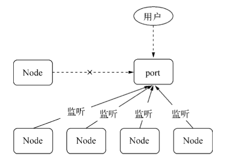
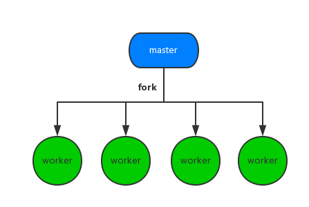

## 基本简介

Node.js 是可以在服务端跨平台运行 JS 的虚拟机，是浏览器在协议栈另一边的倒影，即，Node.js 在服务端之于 JS，就类似浏览器在客户端之于 JS。


Node.js 的出现使得主要运行在客户端的 JS 也开始大量运行于服务端，这带来的好处是：

* 前后端开发语言的一致性，使得开发者无需转换语言环境，即可同时完成前后端开发
* 数据格式，例如 JSON，以及第三方包，可以同时在前后端通用

### 项目起源

> Lua  /ˈluːə/，一个简洁、轻量、可扩展的脚本语言

> Haskell /ˈhæskəl/，一种标准化的，通用的纯函数编程语言

项目最初的目标是设计一个高性能服务器，提供 Apache 等服务器之外的选择，该服务器具备：

* 异步 I/O
* 事件驱动

项目最终选择 JS 的缘由是，在众多语言中：

* C/C++，开发门槛高
* Ruby，虚拟机性能不佳
* Lua，自身具有很多阻塞 I/O 库
* Haskell，作者本身不是太熟悉
* JavaScript，符合需求，开发门槛低，且有高性能 V8 引擎背书

### 基本特点

> 锁，并发编程中用于解决资源争用，防止多个进程/线程同时修改数据的机制。

Node.js 的基本特点：

* 异步 I/O

  底层标准 API，从文件读取到网络请求，多为异步 API。所谓异步 I/O，即程序 I/O 操作时代码立即返回，继续执行后续任务，I/O 完成时执行回调，不阻塞主线程，从而实现高并发

  ```
  fs.readFile('/path1', function (err, file) {
      console.log('读取文件1完成');
  });
  fs.readFile('/path2', function (err, file) {
      console.log('读取文件2完成');
  });
  ```

  异步 I/O 带来的好处：

  * 用户体验更好，主线程不会被阻塞，可及时响应用户交互
  * 计算机资源利用更充分，I/O 时，程序继续执行，CPU 不用闲置

* 事件驱动

  浏览器端通过监听事件响应界面用户交互，Node.js 将这种机制引入到服务端，在程序执行的特定时刻发出事件，开发者只需要监听事件并防止响应的回调函数即可

  ```
  let http = require('http');
  
  // 侦听服务器的request事件
  http.createServer(function (req, res) {
      let postData = '';
      
      req.setEncoding('utf8');
  
      // 侦听请求的data事件 
      req.on('data', function (trunk) {
          postData += trunk;
      });
  
      // 侦听请求的end事件
      req.on('end', function () {
          res.end(postData);
      });
  }).listen(8080);
  ```

  事件驱动存在的问题：

  * 不同事件处理相互独立，如何协同？
  * 回调函数的异步编程模式，导致代码的位置顺序与执行顺序不一致

* 单线程

  多线程的缺点：

  * 死锁
  * 状态同步
  * 创建线程和执行期线程上下文切换带来的性能损耗大

  单线程的缺点：

  * 无法利用多核 CPU，不适用于计算密集型应用
  * 应用健壮性欠缺，错误可能会引起整个应用退出

  单线程的缺点解决方案：

  * Node.js 本身的 child_process
  * JS 本身的 Web Works

* 跨平台

  通过在 Node.js 与系统之间增加一个 Libuv 中间层，实现跨平台。

  

### 使用场景

Node.js 的使用场景：

* I/O 密集型

  异步 I/O 的设计使得在单个线程上，并行执行多个 I/O 也不会阻塞主线程。**如果以出现 C10K 问题作为连接上限，那么单个线程理论上可以同时服务 10000 个请求**。

* 非 CPU 密集型

  Node.js 不适合 CPU 密集型并非是因为计算性能差，而是因为其只由一个主线程，尽量避免主线程用于密集计算，可以防止线程阻塞，提高应用性能。

  《深入浅出 Node.js》中，作者测试了不同语言脚本处理相同斐波那契数列计算场景时的表现，Node.js 的性能仅次于 C。

  

## 模块机制

### 模块分类

Node.js 中模块主要有两类：

* 核心模块，Node.js 本身提供的模块
* 文件模块，开发者编写的模块

### 加载步骤

Node.js 中模块加载的步骤：

* 内存直取

  对于核心模块，在 Node.js **源代码编译**时，会被同时编译成二进制文件。当应用启动时，其中部分核心模块会被直接加载进内存，所以，引入这部分核心模块时，可直接读取内存。所以它们的执行速度是最快的。

  对于文件模块，以及应用启动时未加载进内存的核心模块，为了提高性能，Node.js 会缓存模块编译和执行后的对象。所以，如果文件模块或核心模块存在缓存，则直接使用缓存，缓存也是内存。

* 文件定位

  模块标识符不同，路径分析也会有不同：

  * 核心模块，如 http、fs、path 等

    Node.js 源代码编译时，已经被编译成了二进制文件，所以加载会很快

  * 相对路径，以 "."、".." 或 "/"(相对于根目录) 开始的文件模块

    require() 方法会将路径转为真实路径，然后直接读取。在编译执行后，也会以真实路径为索引，将结果存放到缓存中，以使二次加载时更快。

    如果文件模块没有后缀，则按照 .js -> .json -> .node 顺序进行顺次匹配

  * 自定义模块，比如第三方包

    既非核心模块，又可转换为完整路径的相对路径，所以其路径分析是最耗时：

    * 首先，从当前文件目录开始递归上溯查询所有的 node_modules 目录，直至根目录
    * 其次，在任何一个 node_modules 目录下
      1. 查找并通过 JSON.parse() 解析 package.json 文件，获取其中的 main 属性，如果 main 属性文件没有后缀，则按照 .js -> .json -> .node 顺序进行顺次匹配
      2. 如果步骤 1. 不成功，比如，没有 package.json 文件 或者 main 属性，或者 main 属性错误等，则在当前目录下按照 index.js -> index.json -> index.node 顺序进行顺次匹配

* 编译执行

  不同的文件类型，其载入方法也不同：

  * .js文件

    通过 fs 模块同步读取文件后编译执行

    需要注意的是，在编译过程中，Node.js 会对获取的 JS 文件内容进行头尾包装：

    ```
    (function (exports, require, module, __filename, __dirname) {
        /* 文件模块内容 */
    });
    ```

    这样每个模块文件之间都进行了作用域隔离。

    包装之后的代码通过 vm 原生模块的 runInThisContext() 方法执行（类似eval，只是具有明确上下文，不污染全局），返回一个具体的 function 对象。

    最后，将当前模块对象的 exports 属性、require() 方法、module (模块对象自身)， 以及在文件定位中得到的完整文件路径和文件目录作为参数传递给这个 function() 执行。

    在执行之后，模块的 exports 属性被返回给了调用方。exports 属性上的任何方法和属性都可以被外部调用到，但是模块中的其余变量或属性则不可直接被调用。 

  * .json文件

    通过 fs 模块同步读取文件后，用 JSON.parse() 解析返回结果

    需要注意的是，Node.js 具有直接加载解析 JSON 文件的能力，所以，在编程中可以直接加载 .json文件。

  * .node文件

    这是用 C/C++ 编写的扩展文件，通过 process.dlopen() 方法加载最后编译生成的文件

  * 其余扩展名文件

    都被当做 .js 文件处理

  每一个编译成功的模块都会以文件路径为索引，缓存在 Module._cache 对象上，以提高二次引入的性能。

## 执行机制

Node.js 的异步执行机制比浏览器更复杂，因为可以跟内核对话，所以需要专门的库 Libuv 做这件事。这个库负责各种回调函数的执行时间，毕竟异步任务最后还是要回到主线程，一个个排队执行。


* V8 引擎解析 JavaScript 脚本
  * 同步代码顺序执行
  * 异步代码立即返回，任务通过调用 Node.js Bindings 移交给 Libuv 处理
* Libuv 库负责异步任务的执行，它将不同的任务分配给不同的线程，形成一个 Event Loop（**事件循环，见下文**），以异步的方式将任务的执行结果返回给 V8 引擎
* V8 引擎再将结果返回给用户

### 异步 API

根据 I/O 与否，Node.js 中的异步 API 主要分为两类：

* I/O 异步 API，产生 I/O callback

  * File System
  * Network 
  * ...

* 非 I/O 异步API，产生非 I/O callback

  * setTimeout，单次定时执行任务，同浏览器

  * setInterval，多次定时执行任务，同浏览器

  * process.nextTick，向 Tick Task 队列添加任务

    使用的原因：

    * 允许用户及时处理错误，清理任何不需要的资源，或在事件循环继续之前重试请求
    * 有时在调用堆栈已解除但在事件循环继续之前，必须允许回调运行

    存在的问题：

    * 自身嵌套调用将彻底阻塞 Event Loop

      ```
      process.nextTick( function foo() {
      		process.nextTick(foo);
      });
      ```

  * setImmediate，向 Macro Task 队列添加任务，不依赖定时器，其总在 poll 阶段后的 check 阶段执行。

    基于[官方文档](https://nodejs.org/zh-cn/docs/guides/event-loop-timers-and-nexttick/#process-nexttick)，setImmediate 的实际功能表现才符合 process.nextTick 名称，但更换修改名称将导致已有 npm 包的混乱，所以"错误"的名字得一保存。

    同时，多层嵌套的 process.nextTick 总是在同一个 Loop 中立即执行，而 setImmediate 在下一个 Loop 的 check 阶段触发，更加规律且易于推理。所以，官方建议：在所有场景下，使用 setImmediate 取代 process.nextTick

需要注意的是：

* setTimeout 和 setInterval 创建的定时器会被插入到定时器观察者内部的[红黑树](https://zh.wikipedia.org/wiki/%E7%BA%A2%E9%BB%91%E6%A0%91)（一种自平衡二叉查找树）中。每次 Tick 执行时，会从该红黑树中迭代取出定时器对象，检查是否超过定时时间，如果超过，就形成一个事件，它的回调函数将立即执行，操作时间复杂度为 **O(log(n))**。相对而言，setImmediate 和 process.nextTick 的事件复杂度为 **O(1)**，效率更高。
* Node.js 官方文档中，并没有提到 Micro Task 队列或者 Macro Task 队列。不过，基于 process.nextTick 和 Promise 的回调追加到本轮循环，setTimeout、setInterval 和 setImmediate 的回调追加到次轮循环的行为机制，同 Macro Task 和 Macro Task 的执行结果一致，所以，这里借用浏览器环境的概念进行描述。

### 事件循环

Node.js 启动后，Libuv 即会初始化事件轮询。脚本程序通常会调用异步 API 函数，比如 process.nextTick，产生异步任务事件，当同步任务执行完毕，事件循环就开始了。

参考《01-浏览器原理》，在 Node.js 中，依旧将 Task 分为：

* Micro Task
  * Tick Task
* Macro Task

它们的执行规则：

1. 主线程同步任务执行完成时，开始执行 Event Queue 中的任务

2. 优先完全执行 Micro Task，在 Micro Task 任务中，Tick Task 任务执行整体在前面；如果 Micro Task 任务执行中产生了新的 Micro Task，则添加新的 Micro Task 到 Micro Task 队列尾部，执行直至 Micro Task 队列为空

3. 当 Micro Task 队列执行完毕后，开始进入上图中的 Event Loop，执行 Macro Task 队列，Macro Task 队列执行的顺序如下

   

   * timers，检查 setTimeout 和 setInterval 定时器，主线程会检查当前时间是否满足定时器的要求，满足则执行回调函数

   * I/O callbacks，执行 I/O 异步 API 产生的任务，比如 TCP 错误，一般是除下列 API 以外产生的任务回调

     * setTimeout 和 setInterval 的回调函数
     * setImmediate 的回调函数
     * 用于关闭请求的回调函数，比如 socket.on('close', ...)

   * idle 和 prepare，只供 libuv 内部调用，可以忽略

   * poll，轮询，用于等待还未返回的 I/O 事件，比如服务器的响应等。轮询阶段有两个重要功能：

     * 计算应该阻塞和轮询 I/O 的时间
     * 处理轮询队列里的事件

     事件轮询同步执行 poll 队列里的回调，直到队列为空或执行回调达到系统上限（上限具体多少未详），接下来事件轮询会检查有无预设的 setImmediate，分两种情况：

     * 若有，事件轮询将结束 poll 阶段进入 check 阶段，并执行 check 阶段的任务队列

     * 没有，事件轮询将阻塞在该阶段等待

       注意，正是因为没有 setImmediate 时会导致事件轮询阻塞在 poll 阶段，这样之前设置还没执行的 timer 会得不到执行！所以，在 poll 阶段事件轮询有一个检查机制，即检查是否存在已达时间阈值的计时器，如果有，则重新进入到 timer 阶段，开始下一轮事件轮询

   * check，执行 setImmediate 的回调函数

   * close callbacks，该阶段执行关闭请求的回调函数，比如 socket.on('close', ...)

   需要注意的是：

   * 每个阶段都有一个 FIFO 的回调函数队列，只有一个阶段队列中的回调函数都执行了，事件循环才会进入下一个阶段
   * 在该步骤的不同阶段中，每执行一个宏任务，就需要执行一次步骤 2

### 应用实践

#### 示例1

```
const fs = require('fs');

const timeoutScheduled = Date.now();

// 异步任务一：100ms 后执行的定时器
setTimeout(() => {
    const delay = Date.now() - timeoutScheduled;
    console.log(`${delay}ms`);
}, 100);

// 异步任务二：文件读取后，有一个 200ms 的回调函数
fs.readFile('test.js', () => {
    const startCallback = Date.now();
    while (Date.now() - startCallback < 200) {
        // 什么也不做
    }
});
```

该示例来自 Node.js 官网。

**待验证**

Node.js 启动，主线程执行，注册最外层 setTimeout 和 fs.readFile，主线程执行完成，开始 Event Loop

第一轮 Loop

* timers 阶段，setTimeout 时间阈值未到
* I/O callbacks 阶段，fs.readFile 未完成，也没有可执行的 I/O 回调
* Poll 阶段，阻塞，等待内核返回 fs.readFile 读取结果。由于小文件读取一般不会超过 100ms，所以在定时器到期之前，Poll 阶段就会得到结果，因此就会继续往下执行。

第二轮 Loop

* timers 阶段，setTimeout 时间阈值依然未到
* I/O callbacks 阶段，已有可执行 I/O 回调，执行 fs.readFile 回调，该回调函数需要大约 200ms。也就是说，在它执行到一半的时候，100ms 的定时器就会到期。但是，必须等到这个回调函数执行完，才会离开这个阶段

第三轮 Loop

* timers 阶段，有到期定时器，执行 setTimeout，输出结果大概是 200 多毫秒

#### 示例2

```
setImmediate(function () {
    setImmediate(function A() {
        console.log(1);
        setImmediate(function B() {
            console.log(2);
        });
    });

    setTimeout(function timeout() {
        console.log('TIMEOUT FIRED');
    }, 0);
});
```

输出结果可以是 1-TIMEOUT FIRED-2 或者 TIMEOUT FIRED-1-2

Node.js 启动，主线程执行，注册最外层 setImmediate 回调，主线程执行完成，开始 Event Loop

第一轮 Loop，最外层 setImmediate 执行，注册函数 A 和 setTimeout 到下一轮 Loop 中各自的任务队列

第二轮 Loop，还是由于存在 **至少 1ms 的延时 (参见示例 3，setTimeout 最少是 1S，即便设置是 0)**，所以 timers 阶段时，setTimeout 可能就绪也可能未就绪，这依赖于环境性能

第三轮 Loop，check 阶段执行 函数 B

#### 示例3

> REPL，Read-Eval-Print Loop，读取-求值-输出循环

```
setTimeout(() => {
    console.log(2)
}, 2);

setTimeout(() => {
    console.log(1)
}, 1);

setTimeout(() => {
    console.log(0)
}, 0);
```

测试结果：

* Chrome 浏览器：102
* Node.js  REPl：102、120、210 都有可能

HTML 规范中规定 setTimeout 的最小延迟是 4ms，但是为了优化后台任务的加载损耗以及降低耗电量，[Firefox](https://developer.mozilla.org/zh-CN/docs/Web/API/Window/setTimeout) 和 Chrome 将这个最小延迟将为 1ms，所以，以下三种写法的延时时一样的：

```
setTimeout(() => {});
setTimeout(() => {}, 0);
setTimeout(() => {}, 1);
```

所以，示例代码中 1 和 0 的先后顺序是可以确定的

* 在 Firefox 和 Chrome 浏览器中，定时器延时设计相对精确，所以，2ms 延时的 2 总在 1 和 0 后输出
* Node.js 中，定时器设计相对不那么精确，输出依赖于当前环境性能，很可能 1、0 还未输出，2ms 的时间就已经到了，所以 2 的输出就很不确定了，可以在 \_1_0_ 前中后的任何位置输出

基于上面的分析，由于 setTimeout(fn, 0)  具有至少 1ms 的延时，无法保证事件轮询进入 timers 阶段时，定时器满足时间并能够立即执行处理程序。所以，下面代码输出的 1 和 2 顺序是不确定的：

```
setTimeout(() => console.log(1));
setImmediate(() => console.log(2));
```

但是，下面代码的 setImmediate 总是优先于 setTimeout 执行，输出的顺序总是21

```
const fs = require('fs');

fs.readFile('test.js', () => {
    setTimeout(() => console.log(1));
    setImmediate(() => console.log(2));
});
```

因为 poll 阶段执行完成后进入 check 阶段，timers 阶段处于下一个事件循环阶段了。

#### 示例4

这是一个终极示例。

```
// T1
// Loop 1 timers/1
setTimeout(function () {
    // T8
    // Loop 2 timers/1
    setTimeout(function () {
        console.log('8-setTimeout in setTimeout');
    }, 0);

    // I7
    // Loop 1 check/3
    setImmediate(function () {
        console.log('7-setImmediate in setTimeout');
    });

    // P3
    // Loop 1优先执行Tick Task
    process.nextTick(function () {
        console.log('3-nextTick in setTimeout');
    });
}, 0);

// I1
// Loop 1 check/1
setImmediate(function () {
    // T9
    // Loop 2 timers/2
    setTimeout(function () {
        console.log('9-setTimeout in setImmediate');
    }, 0);

    // I10
    // Loop 2 check/1
    setImmediate(function () {
        console.log('10-setImmediate in setImmediate');
    });

    // P5
    process.nextTick(function () {
        console.log('5-nextTick in setImmediate');
    });
});

// P1
process.nextTick(function () {
    // T4
    // Loop 1 timers/2，Loop 1 timers 阶段结束
    setTimeout(function () {
        console.log('4-setTimeout in nextTick');
    }, 0);

    // I6
    // Loop 1 check/2
    setImmediate(function () {
        console.log('6-setImmediate in nextTick');
    });

    // P2
    // 执行后进入事件循环
    process.nextTick(function () {
        console.log('2-nextTick in nextTick');
    });
});

// Main
// 主线程同步执行
console.log('1-main thread');
```

1. 主线程同步执行
   * T1 setTimeout 注册至第一轮 Loop 的 timers 阶段队列，位次1（Loop 1 timers/1）
   * I1 setImmediate 注册至第一轮 Loop 的 check 阶段队列，位次1（Loop 1 check/1）
   * P1 process.nextTick 添加一个 Tick Task，在主线程同步执行完后执行
   * Main 处主线程执行结束，输出 `1-main thread`
2. Micro Task （P1）执行
   * T4 setTimeout 注册至第一轮 Loop 的 timers 阶段队列，位次2（Loop 1 timers/2）
   * I6 setImmediate 注册至第一轮 Loop 的 check 阶段队列，位次2（Loop 1 check/2）
   * P2 process.nextTick 添加 Tick Task，在 P1 执行完后执行，输出 `2-nextTick in nextTick`
3. 第一轮 Loop （Loop 1）开始
   * timers 阶段
     * Loop 1 timers/1（T1 setTimeout）回调执行
       * T8 setTimeout 赶不上本轮 timers，故注册至第二轮 Loop 的 timers 阶段（Loop 2 timers/1）
       * I7 setImmediate 一轮 check 未开始，故注册至第一轮 Loop 的 check 阶段（Loop 1 check/3）
       * P3 process.nextTick 添加 Tick Task，在 T1 执行完后执行，输出 `3-nextTick in setTimeout`
     * Loop 1 timers/2（T4 setTimeout）回调执行，输出 `4-setTimeout in nextTick`
     * Loop 1 timers 执行完毕
   * check 阶段
     * Loop 1 check/1（I1 setImmediate）回调执行
       * T9 setTimeout 注册至第二轮 Loop 的 timers 阶段（Loop 2 timers/2）
       * I10 setImmediate 赶不上本轮 check，故注册至第二轮 Loop 的 check 阶段（Loop 2 check/1）
       * P5 process.nextTick 添加 Tick Task，在 I1 执行完后执行，输出 `5-nextTick in setImmediate`
     * Loop 1 check/2（I6 setImmediate）回调执行，输出 `6-setImmediate in nextTick`
     * Loop 1 check/3（I7 setImmediate）回调执行，输出 `7-setImmediate in setTimeout`
4. 第二轮 Loop （Loop 2）开始
   * timers 阶段
     * Loop 2 timers/1（T8 setTimeout）回调执行，输出 `8-setTimeout in setTimeout`
     * Loop 2 timers/2（T9 setTimeout）回调执行，输出 `9-setTimeout in setImmediate`
   * check 阶段
     * Loop 2 check/1（I10 setImmediate）回调执行，输出 `10-setImmediate in setImmediate`

需要注意的是：

* 测试时，可能最终的显示结果与上文描述有出入。因为这里未考虑 poll 阶段检查到有达到时间阈值的 timer 时，中断后续 check 阶段，直接返回 timers 阶段的情况。这里的 setTimeout 均是 1ms 延时，在 poll 阶段需要直接绕回处理已到时 setTimeout 的情况是存在的，通过调节代码性能可以检查到这种情况，比如：
  * 将代码中的回调函数改为箭头函数或者命名函数

### 参考

* https://nodejs.org/zh-cn/docs/guides/event-loop-timers-and-nexttick/#process-nexttick
* https://www.twblogs.net/a/5b96861e2b717750bda51dd9

## 异步编程

异步编程的主要方式：

* 回调函数
* 发布/订阅
* Promise
* Generator
* Async/Await

### 回调函数

回调函数是最简单的异步编程方式，也是 Node.js 异步 I/O 最核心的实现方式。

#### 基本特点

回调函数的优点：

- 足够简单，容易理解和部署

回调函数的缺点：

- 回调函数内的异常难以追踪和捕获，比较 示例1 和 示例2，示例2 中在回调中抛出错误时，其同步调用栈已不存在，故无法追踪完整的调用信息。一种常见的策略就是 Node.js 中使用的错误优先的回调，即将错误作为第一个参数传递给回调函数，这也是为什么 Node.js 约定回调函数作为第一个参数的原因。

  示例1：

  

  ```
  function a() {
      b();
  }
  
  function b() {
      c();
  }
  
  function c() {
      d();
  }
  
  function d() {
      throw new Error('出错啦');
  }
  
  a();
  ```

  示例2：

  

  ```
  function a() {
      b();
  }
  
  function b() {
      c(cb);
  }
  
  function c(callback) {
      setTimeout(callback, 0)
  }
  
  function cb() {
      throw new Error('出错啦');
  }
  
  a();
  ```

- 高度耦合，难以维护，比如回调地狱，多重异步操作相互依赖并需先后顺次执行

  ```
  step1(function (value1) {
      step2(function (value2) {
          step3(function (value3) {
              step4(function (value4) {
                  // Do something with value4
              });
          });
      });
  });
  ```

  可以通过将嵌套操作封装成独立函数的方式，解锁回调地狱

  ```
  function fun1(params) {
      // todo
      asyncFunction(fun2);
  }
  
  function fun2(params) {
      // todo
      asyncFunction(fun3)
  }
  
  function fun3(params) {
      // todo
      asyncFunction(fun4)
  }
  
  function fun4(params) {
      // todo
  }
  
  asyncFunction(fun1)
  ```

- 协同困难，比如

  - 需要同时获取多个异步 API 的结果后才能执行下一步，例如，需要获得多个接口数据后渲染页面
  - 需要获取多个异步 API 中最先完成的结果后执行下一步，例如，考虑足够的性能，同时从 Cache Storage 和网络获取同一个资源，哪个先拿到用哪个

#### 应用实践

浏览器中的回调函数：

```
asyncFunction(function(value){
		// todo
})
```

Node.js 中的回调函数：

```
fs.readFile('file.js', (err, data) => {
    if (err) {
        throw err;
    }

    // to do something with data
});
```

### 发布/订阅

发布/订阅模式，也称为观察者模式，它定义了一种对象之间一对多的依赖关系，当一个对象的状态发生改变时，所有依赖它的对象都将得到通知。它由两类对象组成：

* 发布者，负责发布事件，而无需关注哪些模块订阅了事件
* 订阅者，通过订阅事件来观察发布者

发布/订阅模式中，发布者和订阅者是完全解耦的，彼此不知道对方的存在，两者仅共享一个自定义事件的名称。

在 JS 中，一般使用事件模型替代传统的发布-订阅模式。因为在 JS 中，一切皆对象，无需像静态类型语言那样，必需创建合乎条件的对象，然后，往往还需要向上转型才能通过严苛的接口类型检测。总之，创建发布者或订阅者对象在 JS 中显得过于刻意了，事件模型足矣。

当然，一定要严格按照发布/订阅实现的话，可以参考 Vue.js 的 Watcher() 和 Dep() 的实现。

#### 基本特点

发布/订阅模式的优点：

* 发布者和订阅者的关系解耦，便于维护
* 侦听器作为回调函数可以随意的添加或删除，这样可以自由的添加业务逻辑，并将业务逻辑有效的分割到多个函数中更好地隔离和维护

发布/订阅模式的缺点：

* 事件机制的问题 - 事件触发必需在事件监听之后，可以保存已触发事件在订阅时即行触发来解决这个问题
* 模式本身的问题 - 过度使用会导致对象与对象之间的必要联系被深埋在背后，难以追踪

#### 事件监听

相应对象（订阅者）事先绑定事件，当事件发生时，程序内部（发布者）通知并触发相应事件。

浏览器中的事件监听：

```
document.body.addEventListener('click', function () {
    alert('Click');
}, false);
```

Node.js 中的事件监听：

```
let http = require('http');

http.createServer(function (req, res) {
    let postData = '';
    
    req.setEncoding('utf8');

    // 监听请求的data事件 
    req.on('data', function (trunk) {
        postData += trunk;
    });

    // 监听请求的end事件
    req.on('end', function () {
        res.end(postData);
    });
}).listen(8080);
```

#### 自定义事件

DOM 事件，或者 Node.js 中默认支持的事件无法满足所有的场景需求，所以，需要自定义事件系统。

浏览器中的自定义事件原型如下。当需要某个对象拥有事件能力时，可以将 Event 对象的属性 extend 到相应的对象，类似于 Backbone。

```
let Event = {
    clientList: {},
    listen(name, callback) {
        let self = this;

        if (!self.clientList[name]) {
            self.clientList[name] = [];
        }

        self.clientList[name].push(callback);
    },
    remove(name, callback) {
        let self = this;
        let items = self.clientList[name];

        if (!items || items.length <= 0) {  // 没有事件
            return false;
        }

        if (!callback) {                    // 清除某个事件的所有回调
            items = [];
        } else {                            // 清除某个事件的单个回调
            for (let i = items.length; --i;) {
                if (items[i] === callback) {
                    items.splice(i, 1);
                }
            }
        }
    },
    trigger(name) {
        let self = this;
        let args = [].slice.call(arguments, 1);
        let items = self.clientList[name];

        if (!items || items.length <= 0) {  // 没有事件
            return false;
        }

        items.forEach(function (fn) {
            fn.apply(self, args);
        });
    }
};
```

Node.js 中的自定义事件：

Nodejs 中通过 events 模块实现了原生的发布/订阅模式。

```
let Emitter = require('events');
let emitter = new Emitter();

emitter.on('someEvent', function (stream) {
    console.log(stream + 'from eventHandler1');
});

emitter.on('someEvent', function (stream) {
    console.log(stream + 'from eventHandler2');
});

emitter.emit('someEvent', 'I am a stream!');
```

### Promise

Promise 相当于异步操作的占位符，它不会订阅一个事件，也不会传递一个回调函数给目标函数，而是让函数返回一个异步操作的 Promise，例如

```
// readFile承诺在未来的某个时刻完成
let promise = readFile('file.js');
```

这样，程序不会阻塞，至于未来对这个对象的操作，完全取决于 Promise 的生命周期。

Promise 的生命周期很简单，只有三种状态：

- pending，Promise 进行中
- fulfilled，Promise 成功完成
- rejected，Promise 异步操作失败，可能是程序错误或其他的原因

Promise 的状态规则：

- 当前状态存储在内在属性 [[PromiseState]] 中，不能读取 
- 状态只能从 pending 转变为 fulfilled 或 rejected，且不能回退
- 状态改变后通过 then 或者 catch 添加的操作函数依旧会被触发

创建 Promise 的方法：

- Promise 构造函数，创建未完成的 Promise 对象
- Promise.resolve()，创建成功完成态的 Promise 对象
- Promise.reject()，创建失败完成态的 Promise 对象

响应多个 Promise 的方法：

- Promise.all(_Promise 对象数组_)，所有 Promise 都完成后执行后续 then/catch
- Promise.race(_Promise 对象数组_)，只要有一个 Promise 完成即执行后续 then/catch

Promise 的使用注意：

- 每次调用 then() 或者 catch() 方法，其实都会创建并返回一个新的 Promise 对象，所以 Promise 才可以链式调用。以下两种写法是等效的。

  ```
  // 写法1
  let p1 = new Promise(function (resolve, reject) {
      resolve(1);
  });
  
  p1.then(function (value) {
      console.log(value);
  }).then(function () {
      console.log('Finished');
  });
  
  // 写法2
  let p1 = new Promise(function (resolve, reject) {
      resolve(1);
  });
  
  let p2 = p1.then(function (value) {
      console.log(value);
  });
  
  p2.then(function () {
      console.log('Finished');
  });
  ```

- Promise.resolve() 和 Promise.reject() 方法的参数如果是一个 Promise 对象时，则直接返回参数 Promise 对象；如果参数是一个 Thenable 对象，则  Thenable 对象会被包装成一个 Promise 对象返回。

  > Thenable 对象：拥有接受 resolve 和 reject 两个参数函数的 then() 方法的普通对象

  ```
  let thenable = {
      then(resolve, reject) {
          resolve(42);
      }
  };
  
  let p1 = Promise.resolve(thenable);
  
  p1.then(value => {
      console.log(value);    // 42
  });
  ```

- Promise 链中抛出的错误具有“冒泡”性质，会一直向后传递，直至被最近的 catch 捕获

  ```
  let p1 = new Promise(function (resolve, reject) {
      throw new Error('Error A');
  });
  
  p1.catch((err) => {
      console.log(err.message);			// Error A
      throw new Error('Error B');
  }).catch((err) => {
      console.log(err.message);			// Error B
  });
  ```

- 在 Promise 链中可以通过 return 传递数据

  - return 为非 Promise 对象值时，返回值传递给下一个 then 函数

    ```
    let p1 = new Promise(function (resolve, reject) {
        resolve(1);
    });
    
    p1.then((value) => {
        console.log(value);		// 1
    
        return value + 1;
    }).then((value) => {
        console.log(value);		// 2
    });
    ```

  - return 为 Promise 对象时，返回一个新的相应状态的 Promise 对象

    ```
    // 写法1
    let p1 = new Promise(function (resolve, reject) {
        resolve(1);
    });
    
    let p2 = new Promise(function (resolve, reject) {
        resolve(2);
    });
    
    p1.then((value) => {
        console.log(value);		// 1
        return p2;
    }).then((value) => {
        console.log(value);		// 2
    });
    
    // 写法2
    let p1 = new Promise(function (resolve, reject) {
        resolve(1);
    });
    
    let p2 = new Promise(function (resolve, reject) {
        resolve(2);
    });
    
    let p3 = p1.then((value) => {
        console.log(value);		// 1
        return p2;
    });
    
    console.log(p2 === p3);		// false
    
    p3.then((value) => {
        console.log(value);		// 2
    });
    
    ```

#### 基本特点

Promise 并没有从根本上消除回调函数，只是拉平，或者说通过 then()/catch() 函数延迟了回调函数的绑定。

Promise 的优点：

- 链式调用更符合编程习惯
- 与回调函数存在协同问题不同，Promise.all() 和 Promise.race() 让对象协同更加方便
- 与 Generator 和 await 实现异步编程一定程度上阻塞了进程不同，Promise 不存在这样的问题

Promise 的缺点：

- 需要创建额外的 Promise 对象

- 不能够中止 promise 链，例如：

  ```
  let promise = new Promise((resolve) => {
      setTimeout(() => {
          resolve('hello');
      }, 1000);
  });
  
  promise.then((value) => {
      throw new Error('Error');
  }).then(value => {
      console.log(value);
  }, error => {
      console.log(error.message);
  }).then(function () {
      console.log('Continue');
  });
  
  // Error
  // Continue
  ```

- 如果不设置 catch 函数，Promise 内部的错误不会反映到外部。不过，最新的浏览器和 Node.js 已经意识到了这一点：

  - 它们都会在全局上下文提供 unhandledRejection 事件用于处理程序未主动 catch 的错误
  - Chrome 和 Firefox 浏览器的测试发现，如果为 catch 错误，浏览器会直接报错，并中断 JS 的执行

#### 原理实现

Promise 原理实现代码

```
class RealPromise {
    constructor() {
        this.isPromise = true;
        this.handleQueue = [];
    }

    then(resolve, reject) {
        let self = this;
        let handle = {};

        if (typeof resolve === 'function') {
            handle.resolve = resolve;
        }

        if (typeof reject === 'function') {
            handle.reject = reject;
        }

        self.handleQueue.push(handle);

        return self;
    }

    catch(reject) {
        let self = this;
        let handle = {};

        if (typeof reject === 'function') {
            handle.reject = reject;
        }

        self.handleQueue.push(handle);

        return self;
    }
}

class Deferred {
    constructor() {
        this.state = 'pending';
        this.promise = new RealPromise();
    }

    resolve(obj) {
        let handle;
        let handleQueue = this.promise.handleQueue;

        this.state = 'fufilled';

        while (handle = handleQueue.shift()) {

            if (handle.resolve) {
                let res = handle.resolve(obj);

                if (typeof res === 'object' && res.isPromise) {
                    res.handleQueue = handleQueue;
                    this.promise = res;
                }

                return;
            }
        }
    }

    reject(obj) {
        let handle;
        let handleQueue = this.promise.handleQueue;

        this.state = 'rejected';

        while (handle = handleQueue.shift()) {

            if (handle.reject) {
                let res = handle.reject(obj);

                if (typeof res === 'object' && res.isPromise) {
                    res.handleQueue = handleQueue;
                    this.promise = res;
                }

                return;
            }
        }
    }
}

class Promise {
    constructor(callback) {
        let defer = new Deferred();

        callback(defer.resolve.bind(defer), defer.reject.bind(defer));

        return defer.promise;
    }

    static resolved() {
    }

    static rejected() {
    }
}
```

#### 应用实践

node.js 中 api 的 promise 化

```
function promisify(fn) {
    return function () {
        let args = [].slice.call(arguments);

        return new Promise(function (resolve, reject) {
            fn.apply(null, args.push(function (err, ...args) {
                if (err) {
                    return reject(err);
                }

                resolve(args);
            }))
        });
    }
}
```

### Generator

#### 迭代器

> iterator /ɪtə'reɪtə/ n. 迭代器, 迭代程序

传统迭代必需初始化一个记录迭代位置的变量，同时，多层嵌套迭代时，维护位置变量复杂且易出错。所以，ES6 参考其他语言，增加了程序化的迭代方式 - 迭代器，来简化迭代操作，并减少循环中出错的几率。

迭代器，iterator，是一种特殊的对象，其具有专门为迭代过程设计的 API。迭代器对象有一个 next 方法，调用该方法返回一个对象，该对象具有两个属性：

* value，当前迭代位置的值
* done，布尔值，标识迭代是否完成

使用 ES5 的方式设计一个简单的生成迭代器的函数

```
// set 为集合类型
function createIterato(set) {
    let i = 0;
    
    return {
        next() {
            let done = i >= set.length;

            return {
                done: done,
                value: done ? undefined : set[i++]
            }
        }
    }
}
```

#### 生成器

为了创建迭代器更加方便，ES6 添加了生成器。

生成器是一种返回迭代器的特殊函数，通过在 function 关键字和函数名之间添加雪花号*来标识生成器。在这种函数中，使用 yield 关键字标识每次迭代的位置。

```
// 生成器
function *createIterator() {
    yield 1;
    yield 2;
    yield 3;
}

// 迭代器
let iterator = createIterator();

console.info(iterator.next());      // {value: 1, done: false}
console.info(iterator.next());      // {value: 2, done: false}
console.info(iterator.next());      // {value: 3, done: false}
console.info(iterator.next());      // {value: undefined, done: true}
```

生成器的使用注意：

- 不能用箭头函数创建，为啥？

- 可迭代对象 (String、Array、Set、Map、DOM 中的 NodeList 类型) 具有的 Symbol.iterator 属性本质上也是生成器，使用展开运算符或者 for..of 时，引擎内部就是调用的该属性。

  ```
  let divs = document.querySelectorAll('div');
  
  for (let div of divs) {
      console.log(div.id);
  }
  ```

  所以，可以通过添加 Symbol.iterator 生成器属性的方式使得一个普通对象成为可使用 for..of 方法的可迭代对象

  ```
  let colletion = {
      items: [1, 2, 3],
      * [Symbol.iterator]() {
          for (let item of this.items) {
              console.log(item);
          }
      }
  }
  
  for (let value of  colletion) {
      console.log(value);
  }
  ```

- 生成器创建的迭代器对象还有一个 throw 方法，用来主动抛出错误

  - 如果抛出的错误得不到捕捉， JS 引擎报错，进程结束
  - 如果抛出的错误得到捕捉，程序继续执行

  ```
  // 生成器
  function* createIterator() {
      yield 1;
  
      try {
          yield 2;
      } catch (e) {
          yield 3;
      }
  
      yield 4;
  }
  
  // 迭代器
  let iterator = createIterator();
  let error = new Error('Boom');
  
  console.info(iterator.next());          // {value: 1, done: false}
  console.info(iterator.next());          // {value: 2, done: false}
  console.info(iterator.throw(error));    // {value: 3, done: false}
  console.info(iterator.next());          // {value: 4, done: false}
  console.info(iterator.next());          // {value: undefined, done: true}
  ```

- 生成器可以使用 return 提前返回，不过 next() 方法会接受 return 返回的值，展开运算符和 for…of 不会

  ```
  // 生成器
  function* createIterator() {
      yield 1;
      return 2;
      yield 3;
  }
  
  // 迭代器
  let iterator = createIterator();
  
  console.info(iterator.next());      // {value: 1, done: false}
  console.info(iterator.next());      // {value: 2, done: true}
  console.info(iterator.next());      // {value: undefined, done: true}
  console.info(iterator.next());      // {value: undefined, done: true}
  
  console.info(...createIterator());  // 只输出 1
  
  for (let num of createIterator()) {
      console.log(num);               // 只输出 1
  }
  ```

- 生成器的执行可以委托给其他生成器执行，从而形成生成器的嵌套

  ```
  // 生成器
  function* createIteratorNum() {
      yield 1;		// 暂停位置1
      yield 2;		// 暂停位置1
      return 3;
  }
  
  function* createIterator() {
  		// 这里的yield后带有*，表示是委托生成器，程序不会在这里暂停
      let result = yield* createIteratorNum();
      yield result;		// 暂停位置3
  }
  
  // 迭代器
  let iterator = createIterator();
  
  console.info(iterator.next());      // {value: 1, done: false}
  console.info(iterator.next());      // {value: 2, done: false}
  console.info(iterator.next());      // {value: 3, done: false}
  console.info(iterator.next());      // {value: undefined, done: true}
  ```

  对于委托生成器，需要注意的是：

  * yield 关键字后跟*是委托生成器的标志，迭代不会在这里暂停，这是 yield 关键字的第二个用法
  * 被委托方 return 返回的值会作为委托方整个 yield 表达式的值

yield 关键字的使用注意：

- 只能在生成器函数中使用

- 可以 yield 任何类型值或表达式

- yield 表达式默认返回值为 undefined，如果需要返回特定值，使用 next() 方法的参数

  ```
  // 生成器
  function* createIterator() {
      let first = yield 1;
      let second = yield first + 2;
  
      yield second + 3;
  }
  
  // 迭代器
  let iterator = createIterator();
  
  console.info(iterator.next());      // {value: 1, done: false}
  console.info(iterator.next(2));     // {value: 4, done: false}
  console.info(iterator.next(3));     // {value: 6, done: false}
  console.info(iterator.next());      // {value: undefined, done: true}
  ```

#### 异步应用

生成器最重要的应用就是异步编程，基本原理是：

* 利用程序在 yield 关键字处暂停的机制，使用 yield 执行一个异步的 API，异步 API 执行期间，程序处于暂停状态
* 异步执行成功时，调用生成器的 next() 方法继续程序的执行，同时，通过 next() 方法的参数传递异步 API 执行的结果，从而实现函数体内外的数据交换
* 异步执行出错时，可以通过 throw() 方法抛出内部错误，这个错误可以被外部的 try..catch 捕获，从而解决在回调函数中内部异常难以追踪和捕获的问题

最终，以同步编码的方式实现异步的应用。

生成器异步应用的关键就是**设计一个驱动生成器自动运行的执行器**。

##### 基本特点

生成器实现异步应用的优点：

* 基本实现了同步编码下的异步编程，从根本上消除回调函数，其语法糖 Async/Await 更是如此
* 一定程度上解决了异步任务中的 Error 不能被外部捕获的问题

生成器实现异步应用的缺点：

* 半自动的半协程方式，需要自己实现执行器
* 利用 yield 暂停执行的特点，其实是阻塞了进程，影响了性能。尽管 CO 执行器中通过并行的方式一定程度上解决的阻塞的问题，但是需要组合不同的 Promise ，比较麻烦

##### 同步执行器

不考虑异步 API，执行器基本实现

```
// 生成器
function* createIterator() {
    let first = yield 1;
    console.log(first);

    let second = yield 2;
    console.log(second);

    let third = yield 3;
    console.log(third);
}

// 执行器
function run(gen) {
    let task = gen();
    let result = task.next();

    function step() {
        console.info(result);

        if (!result.done) {
            result = task.next(result.value);
            step();
        }
    }

    step();
}

run(createIterator);

// {value: 1, done: false}
// 1
// {value: 2, done: false}
// 2
// {value: 3, done: false}
// 3
// {value: undefined, done: true}
```

##### 异步执行器

考虑异步 API，通常的异步逻辑

```
function* createIterator(set) {
		// Node.js 常见的异步操作
    // let aync1 = yield function (cb) {
    //     fs.readfile('file.js', cb);
    // };
    
    let aync1 = yield function (cb) {
        setTimeout(function () {
            cb(null, 1);
        }, 500);
    };

    console.log(aync1);

    try {
        let aync2 = yield function (cb) {
            setTimeout(function () {
                cb(new Error('Boom'));
            }, 500);
        };
    } catch (e) {
        console.log('Error');
    }

    // ... do something ...
}
```

异步执行器的实现：

```
function run(gen) {
    let iterator = gen();
    let result = iterator.next();

    function step() {
        if (!result.done) {
        		// 当yield后为一个函数时，则执行之
            if (typeof result.value === 'function') {
                result.value(function (err, data) {
                		// 出错时，使用throw抛出错误
                    if (err) {
                        result = iterator.throw(err);
                        return;
                    }
                    
                    // 执行结束使用next参数传递执行结果
                    result = iterator.next(data);
                    step();
                });
            } else {
                result = iterator.next(result.value);
                step();
            }
        }
    }

    step();
}
```

使用执行器运行生成器

```
run(createIterator);
// 1
// Error
```

##### CO 执行器

Node.js 中使用 CO 模块的基本实现同上面的异步执行器，区别只是 CO 模块要求封装异步任务的函数返回的必需是 [thunk 函数](http://www.ruanyifeng.com/blog/2015/05/thunk.html)或者 promise

异步任务生成器：

```
function* createIterator(set) {
    let aync1 = yield function () {
        return new Promise(function (resolve, reject) {
            setTimeout(function () {
                resolve(1);
            }, 500);
        });
    };

    console.log(aync1);

    try {
        let aync2 = yield function () {
            return new Promise(function (resolve, reject) {
                setTimeout(function () {
                    reject(new Error('Boom'));
                }, 500);
            });
        };
    } catch (e) {
        console.log('Error');
    }

    // ... do something ...
}
```

CO 执行器原理代码：

```
function run(gen) {
    let iterator = gen();
    let result = iterator.next();

    return new Promise(function (resolve, reject) {
        function step() {
            result.value().then(function (data) {
                result = iterator.next(data);
                step();
            }).catch(function (err) {
                result = iterator.throw(err);
            });
        }

        step();
    });
}
```

从生成器实现异步编程的原理可以知道，异步 API 执行的时候，程序实际上是阻塞的，所以，为了提高性能，CO 模块提供了并行执行的方式：

```
// 为yield指定一个promise数组
co(function* () {
    let res = yield [
        Promise.resolve(1),
        Promise.resolve(2),
        Promise.resolve(3),
    ];
    console.log(res); // => [1, 2, 3] 
}).catch(onerror);

// 为yield指定一个类数组promise对象
co(function* () {
    let res = yield {
        1: Promise.resolve(1),
        2: Promise.resolve(2),
    };
    console.log(res); // => { 1: 1, 2: 2 } 
}).catch(onerror);
```

##### 参考

* https://github.com/tj/co/blob/master/index.js
* http://www.ruanyifeng.com/blog/2015/05/co.html

### Async/Await

async 函数就是 Generator 函数的语法糖。

例如，基于 Generator 的异步实现：

```
let fs = require('fs');

let readFile = function (fileName) {
    return new Promise(function (resolve, reject) {
        fs.readFile(fileName, function (error, data) {
            if (error) reject(error);
            resolve(data);
        });
    });
};

let gen = function* () {
    let f1 = yield readFile('/etc/fstab');
    let f2 = yield readFile('/etc/shells');
    console.log(f1.toString());
    console.log(f2.toString());
};
```

使用 async 实现：

```
let asyncReadFile = async function () {
    let f1 = await readFile('/etc/fstab');
    let f2 = await readFile('/etc/shells');
    console.log(f1.toString());
    console.log(f2.toString());
};
```

比较发现：async 函数就是将 Generator 函数的 * 换成 async，将 yield 换成 await，仅此而已。

await 关键字的使用规则：

* await 命令只能用在 async 函数中

async 函数的使用注意：

* async 函数内部 return 语句返回的值，会成为 then() 方法回调函数的参数

  ```
  async function f() {
      return 'hello world';
  }
  
  f().then(v => console.log(v));		// "hello world"
  ```

* async 函数内抛出错误，会导致返回的 Promise 对象变为 reject 状态，错误会被 catch 方法捕获

  ```
  async function f() {
      throw new Error('出错了');
  }
  
  f().then(
      v => console.log(v),
      e => console.log(e.message)     // 出错了
  );
  ```

* await 命令后是 Promise 对象或者 thenable 对象时，返回该对象的结果；否则，直接返回对应的值

  ```
  async function f() {
      // 等同于 return 123;
      return await 123;
  }
  
  f().then(v => console.log(v));      // 123
  ```

* async 函数可以保留运行堆栈

  ```
  const a = () => {
      b().then(() => c());
  };
  ```

  上面代码中，b() 等待执行完成的时候，函数 a() 继续向下执行，等 b() 运行结束，a() 早就运行结束了，b() 所在的上下文环境也会消失。如果 b() 或 c() 报错，错误堆栈将不包括 a()

  ```
  const a = async () => {
      await b();
      c();
  };
  ```

  使用 async 时，b() 在等待执行完成的时候，a() 只是暂停执行，上下文环境都保存着。如果 b() 或 c() 报错，错误堆栈将包括 a()。

#### 基本特点

async 函数被认为最完美的异步编程模式，相对于 Generator 函数的改进，主要体现在以下三点：

* 内置执行器

  Generator 函数需要类似 CO 模块的执行器，async 函数自带执行器

* 更好的语义

  async 和 await，相对于星号和 yield，语义更清楚

  * async 表示函数里有异步操作
  * await 表示紧跟在后面的表达式需要等待结果

* 更广的适用性

  * co 函数库约定，yield 命令后面只能是 Thunk 函数或 Promise 对象
  * async 函数的 await 命令后面，可以跟 Promise 对象和原始类型的值（数值、字符串和布尔值，但这时会自动转换成立即 resolved 的 Promise 对象）

* 返回值是 Promise

  async 函数返回的是 Promise 对象，比 Generator 函数返回 Iterator 对象更加方便，可以直接用 then() 方法指定下一步的操作

async 函数异步应用的优点：

* await 暂停执行后恢复，执行栈及上下文依然存在

async 函数异步应用的问题：

* 同 Generator 函数类似，采用阻塞的方式实现同步编码异步执行，比较影响性能。例如，如下代码，断点可以发现，代码会在每一个 await 处暂停，直至后面的异步操作函数执行完毕

  解决方案：如果函数内的多个 await 不需要先后执行，可以并行执行

  ```
  function async1() {
      return new Promise(function (resolve, reject) {
          setTimeout(() => {
              resolve(1);
          }, 1000);
      });
  }
  
  function async2() {
      return new Promise(function (resolve, reject) {
          setTimeout(() => {
              resolve(2);
          }, 1000);
      });
  }
  
  async function run() {
      let t1 = Date.now();
      let a1 = await async1();
      let t2 = Date.now();
      let a2 = await async2();
      let t3 = Date.now();
  
      console.info([t2 - t1, t3 - t2])  // [1003, 1001]
      return [a1, a2];
  }
  
  run().then(function (data) {
      console.info(data);								// [1, 2]
  });
  ```

  改进 run 函数：

  ```
  // 方式1，await之前提前创建所有需要并行的Promise对象
  async function run() {
      let t1 = Date.now();
      let p1 = async1();
      let p2 = async2();								// 提前创建p1、p2
  
      let a1 = await p1;
      let t2 = Date.now();
      let a2 = await p2;
      let t3 = Date.now();
  
      console.info([t2 - t1, t3 - t2])  // [1005, 0]
      return [a1, a2];
  }
  
  // 方式2，使用Promise.all并行
  async function run() {
      let t1 = Date.now();
      let a1 = await Promise.all([async1(), async2()]);
      let t2 = Date.now();
  
      console.info(t2 - t1);						// 1002
      return a1;
  }
  ```

#### 应用实践

async/await 的执行顺序，await 总是需要后面的 promise 完全执行完成，才会继续执行；所在，下面代码在浏览器和 Node.js 中返回的顺序都是 3，2，1

```
async function fnA() {
    await fnB();
    console.log(1);
}

async function fnB() {
    await fnC();
    console.log(2);
}

async function fnC() {
    console.log(3);
}

fnA().then();
// 3
// 2
// 1
```

同时，需要注意程序的执行流：先从 fnA → fnB → fnC ，然后再从 fnC → fnB → fnA 返回，从而形成环形的执行流。所以，仔细领略可以发现，await 可以让之前的代码先执行，之后的代码等待后面代码执行结束后再执行。

## 内存管理

JS 像 Java 一样，由垃圾回收机制自动进行内存管理，所以，不需要像 C/C++ 那样，开发者需要时刻关注内存的分配和释放。

特别是在客户端设备，页面仅服务于单个用户，除了极少类似循环递归的极端情况外，一般出现内存问题的可能性较低。即便出现问题，随着程序退出，内存也会得以释放。同时，在设备性能日新月异的今天，开发者往往很少在意 JS 的内存管理。

但是，随着 JS 基于 Node.js 运行于服务端，程序将同时服务于所有用户，尤其是在大流量场景下，较小的内容问题都可能导致整个服务不可用。

### 内存分类

Node.js 内存有堆内内存和堆外内存两种。

#### 堆内内存

堆内内存，简称堆内存，是 V8 引擎用于存储引用类型对象使用的内存。

```
let showMem = function () {
    let mem = process.memoryUsage();
    let format = function (bytes) {
        return (bytes / 1024 / 1024).toFixed(2) + ' MB';
    };
    let info = [
        `Process: heapTotal ${format(mem.heapTotal)}`,
        `heapUsed ${format(mem.heapUsed)}`,
        `rss ${format(mem.rss)}`
    ].join(', ');

    console.log(info);
};

let useMem = function () {
    let size = 20 * 1024 * 1024;
    let arr = new Array(size);

    for (let i = 0; i < size; i++) {
        arr[i] = 0;
    }

    return arr;
}

let total = [];

for (let j = 0; j < 15; j++) {
    showMem();
    total.push(useMem());
}

showMem();
```

CLI 执行结果：

```
Process: heapTotal 5.20 MB, heapUsed 2.63 MB, rss 24.60 MB
Process: heapTotal 167.21 MB, heapUsed 163.45 MB, rss 186.44 MB
Process: heapTotal 327.23 MB, heapUsed 323.46 MB, rss 346.50 MB
Process: heapTotal 487.24 MB, heapUsed 483.46 MB, rss 506.62 MB
Process: heapTotal 647.25 MB, heapUsed 643.46 MB, rss 666.67 MB
Process: heapTotal 807.26 MB, heapUsed 803.46 MB, rss 826.69 MB
Process: heapTotal 967.77 MB, heapUsed 962.56 MB, rss 986.82 MB
Process: heapTotal 1127.79 MB, heapUsed 1122.56 MB, rss 1146.84 MB
Process: heapTotal 1287.80 MB, heapUsed 1282.56 MB, rss 1306.85 MB

FATAL ERROR: CALL_AND_RETRY_LAST Allocation failed - JavaScript heap out of memory
```

每次调用 useMem 都导致了 3 个值的增长。在接近 1.4GB 的时候，无法继续分配内存，然后进程内存溢出了，连循环体都无法执行完成。   				 			 		

#### 堆外内存

堆外内存，Node.js 进程中不是通过 V8 分配的内存。

从上面堆内内存的 CLI 执行结果也可以看出，rss 总是大于堆内存，多出的部分就是堆外内存。

我们修改堆内存中的示例，使用 Buffer 取代 useMem() 函数中的数组

```
let showMem = function () {
    let mem = process.memoryUsage();
    let format = function (bytes) {
        return (bytes / 1024 / 1024).toFixed(2) + ' MB';
    };
    let info = [
        `Process: heapTotal ${format(mem.heapTotal)}`,
        `heapUsed ${format(mem.heapUsed)}`,
        `rss ${format(mem.rss)}`
    ].join(', ');

    console.log(info);
};

let useMem = function () {
    let size = 200 * 1024 * 1024;
    let buffer = new Buffer(size);

    for (let i = 0; i < size; i++) {
        buffer[i] = 0;
    }

    return buffer;
}

let total = [];

for (let j = 0; j < 15; j++) {
    showMem();
    total.push(useMem());
}

showMem();
```

CLI 执行结果：

```
Process: heapTotal 5.20 MB, heapUsed 2.63 MB, rss 24.39 MB
Process: heapTotal 7.20 MB, heapUsed 3.45 MB, rss 226.32 MB
Process: heapTotal 7.20 MB, heapUsed 3.46 MB, rss 426.48 MB
Process: heapTotal 7.70 MB, heapUsed 2.80 MB, rss 626.61 MB
Process: heapTotal 7.70 MB, heapUsed 2.80 MB, rss 826.61 MB
Process: heapTotal 7.70 MB, heapUsed 2.57 MB, rss 1026.64 MB
Process: heapTotal 9.70 MB, heapUsed 2.54 MB, rss 1226.81 MB
Process: heapTotal 9.70 MB, heapUsed 2.54 MB, rss 1426.81 MB
Process: heapTotal 9.70 MB, heapUsed 2.54 MB, rss 1626.81 MB
Process: heapTotal 6.70 MB, heapUsed 2.54 MB, rss 1826.36 MB
Process: heapTotal 6.70 MB, heapUsed 2.54 MB, rss 2026.36 MB
Process: heapTotal 6.70 MB, heapUsed 2.54 MB, rss 2226.36 MB
Process: heapTotal 6.70 MB, heapUsed 2.54 MB, rss 2425.39 MB
Process: heapTotal 6.70 MB, heapUsed 2.54 MB, rss 2625.39 MB
Process: heapTotal 6.70 MB, heapUsed 2.54 MB, rss 2825.39 MB
Process: heapTotal 6.70 MB, heapUsed 2.54 MB, rss 3025.39 MB
```

可以看到，15 次循环都完整执行，并且三个内存占用值与前一个示例完全不同：heapTotal 与 heapUsed 的变化极小，唯一变化的是 rss 的值，并且该值已经远远超过 V8 的限制值。这是因为 Buffer 对象不同于其他对象，它不经过 V8 的内存分配机制，所以也不会有堆内存的大小限制。  				 			 		

这意味着利用堆外内存可以突破内存限制的问题。				 			 		

为何 Buffer 对象并非通过 V8 分配？这在于 Node 并不同于浏览器的应用场景。在浏览器中， JS 直接处理字符串即可满足绝大多数的业务需求，而 Node 则需要处理网络流和文件 I/O 流， 操作字符串远远不能满足传输的性能需求。  				 			 		

### 垃圾回收

当 JS 引擎进行进行垃圾回收时，为了避免出现 JS 应用逻辑与垃圾回收器看到的不一致的情况，垃圾回收需要将应用逻辑暂停下来，待执行后再恢复执行，这种行为称为全停顿 (stop-the-world)。

#### 回收策略

基本的垃圾回收策略有两种：

- 标记清除
- 引用计数

##### 标记清除

变量的标记分为两种：

- 进入环境，当变量进入执行环境时，例如在函数中声明了的一个变量，变量会被标记为"进入环境"，这种变量逻辑上不能被删除
- 离开环境，当变量离开环境时，则标记为"离开环境"，这种变量逻辑上可以被清除。

当垃圾回收器运行的时候，不再需要的变量将会被清除。

目前浏览器大都采用标记清除，或者类似的策略。

##### 引用计数

引用计数是跟踪引用类型数据被引用的次数，每当引用类型被赋值给一个变量时，其引用次数就会 +1；反之，当引用某个引用类型的变量被赋予了其它的值/引用，则该引用类型的引用次数就会 -1；当某个引用类型数据的引用次数为 0 时，则表示没有变量引用，可以清除。

引用计数存在的问题是循环引用，即两个对象各有属性引用对方，导致两者即便不再被使用但引用次数依然不为 0，所以始终无法清除。

```
function problem() {
    let objA = new Object();
    let objB = new Object();

    objA.someProp = objB;
    objB.someProp = objA;
}
```

主要是早期的浏览器使用引用计数，例如：

- Netscape Navigator 3.0
- IE8 及 IE8-，因为使用 COM(Component Object Model，组件对象模型) 实现 BOM 和 DOM，而 COM 的垃圾回收策略就是引用计数策略

#### 回收日志

可以通过以下两种方式获取并分析垃圾回收日志：

* Node.js 程序启动时添加 \-\-trace_gc 参数，例如

  ```
  node --trace_gc -e "var a = [];for (var i = 0; i < 1000000; i++) a.push(new Array(100));" > gc.log
  ```

* Node.js 程序启动时使用 \-\-prof 参数，可以得到 V8 执行时的性能分析数据，其中包含了垃圾回收执行时占用的时间

#### V8 引擎

由于没有一种垃圾回收策略能够胜任所有场景，尤其在实际应用中，不同对象的生命周期长短不一，不同算法在不同情况下的表现也参差不齐，所以，实际中，浏览器引擎的回收机制也相对复杂。

V8 的垃圾回收策略主要基于分代式垃圾回收机制，即基于对象生命周期的长短不同，分别使用不同的算法。

V8 将内存分成两部分：

* 新生代，存储存活时间较短的对象
* 老生代，存储存活时间较长或常驻与内存中的对象

V8 堆内存的整体大小就是新生代内存空间 + 老生代内存空间。

##### 新生代回收

> scavenge /'skævɪn(d)ʒ/ v. 清除, 打扫

新生代对象采用 Scavenge 算法，一种通过复制方式实现的垃圾回收算法。


Scavenge 算法的基本规则：

* 堆内存一分为二，每个部分称为 semispace。其中一个使用一个闲置：
  * 用于内存分配的 semispace，称为 From空间
  * 闲置的 semispace，称为 To 空间
* 垃圾回收时，From 空间中的存活对象被复制到 To 空间中，然后清理释放 From 空间；完成复制后，From 空间和 To 空间的角色发生对换

Scavenge 算法的优点：

* 只复制存活对象，由于新生代生命周期短，存活对象少，所以其效率高

Scavenge 算法的缺点：

* 只能使用内存的一半，牺牲空间换时间，所以只适合新生代这种生命周期短，存活对象少的场景，无法应用于大规模内存对象的垃圾回收

##### 老生代回收

当满足以下两个条件时，新生代对象会被复杂到老生代，这个过程称为晋升：

* 对象已经经历过 Scavenge 回收，表示对象存活时间较长
* To 空间已经使用超过 25%，V8 限制 25% 是因为 Scavenge 回收后 To 空间转换成 From 空间，需要预留足够空间用于以后新的变量对象的内存空间分配

在老生代空间中存活周期较长的对象，再采用 Scavenge 算法会有两个问题：

* 存活对象较多，复制大量对象的效率低
* 浪费一半空间，限制了对象的存储内存

所以，老生代对象使用 Mark-Sweep & Mark-Compact 方式回收处理。

###### Mark-Sweep

Mark-Sweep，标记清除，它分为标记和清除两个阶段

* 标记，遍历堆中所有对象，标记活着的对象
* 清除，清除没有被标记的对象

Mark-Sweep 方式的优点：

* 老生代对象相对生命周期长，需清理对象少，采用清理失活对象的方式效率高

Mark-Sweep 方式的缺点：

* 速度相对不如 Scavenge
* 内存碎片化，清理掉失活对象后，内存空间变的不连续，而碎片化空间利用效率低，进而导致频繁的垃圾回收

###### Mark-Compact

> compact /kəm'pækt/ a. 紧凑的, 紧密的 v. 使紧密, 使简洁

Mark-Compact，标记整理，是为了解决内存碎片化的 Mark-Sweep 进化方法，它分为标记和整理两个阶段

* 标记，遍历堆中所有对象，标记活着的对象
* 整理，将活着的对象统一向内存空间的一端移动，然后清理掉剩下的边界外的所有空间

Mark-Compact 方式的优点：

* 解决了内存碎片化的问题

Mark-Compact 方式的缺点：

* 速度比 Mark-Sweep 慢，因为需要移动对象

所以，由于 Mark-Sweep & Mark-Compact 两种方式各有优劣，所以 V8 采用两种方法相结合的方式：

* Mark-Sweep，考虑速度的问题，优先使用
* Mark-Compact，当老生代空间不足以对新生代晋升对象进行分配时才使用

同时，为了避免过长的全停顿导致 V8 响应延迟，实际的 Mark-Sweep & Mark-Compact 方式并不是一次性连续执行的，其标记和清理/整理都是增量且并行的。

### 内存限制

一般的 JS 引擎都是有内存限制的，以防止浏览器耗尽系统内存导致系统崩溃。

对于 V8 引擎，以1.5GB 垃圾回收堆内存为例，V8 做一次小的垃圾回收需要 50ms 以上，做一 次非增量式的垃圾回收甚至要 1s 以上。这是垃圾回收中引起 JS 线程暂停执行的时间，在这样的时间花销下，应用的性能和响应能力都会直线下降。这样的情况不仅仅后端服务无法接受， 前端浏览器也无法接受。因此，在当时的考虑下直接限制堆内存是一个好的选择。

V8 内存限制为：

- 32 位系统，0.7G
- 64 位系统，1.4G

所以，基于 V8 引擎的 Node.js 中依然存在这个限制。

在 Node.js 中，可以使用以下方法查看当前内存使用情况：

- process.memoryUsage()，Node.js 进程使用情况

  ```
  Flying:node flying$ node
  > process.memoryUsage()
  {
  		rss: 29188096,
    	heapTotal: 7028736,
    	heapUsed: 3894232,
    	external: 8352
  }
  > 
  ```

  - rss，resident set size，即进程的常驻内存部分。进程的内存总共有几部分，一部分是 rss，其余部分在交换区(swap)或者文件系统(filesystem)中
  - heapTotal，当前申请的堆内存总量
  - heapUsed，当前已使用的堆内存总量

- os 模块，系统内存使用情况

  - totalmem()，系统总内存
  - freemem()，剩余内存

  ```
  Flying:node flying$ node
  > os.totalmem()
  17179869184		// 16GB
  > os.freemem()
  2201165824		// 2GB
  ```


 当然，这个限制也不是不能打开，V8依然提供了选项让我们使用更多的内存。Node在启动 时可以传递--max-old-space-size或--max-new-space-size来调整内存限制的大小，示例如下: 

node --max-old-space-size=1700 test.js // 单位为MB 

// 或者  

node --max-new-space-size=1024 test.js // 单位为KB

上述参数在V8初始化时生效，一旦生效就不能再动态改变。如果遇到Node无法分配足够内 存给JavaScript对象的情况，可以用这个办法来放宽V8默认的内存限制，避免在执行过程中稍微 多用了一些内存就轻易崩溃。  	

### 内存分析

Node.js 内存分析的主要工具：

* node-heapdump
* node-memwatch

它们允许对 V8 堆内存抓取快照，用于事后分析

### 内存优化

想要高性能的执行效率，需要让垃圾回收尽量少地高效率地进行。

#### 作用域

JS 中作用域可以分为两类：

* 局部作用域

  通过函数或者 with 语法创建，生命周期较短，其域内变量对象内存主要在新生代的 From 空间，一般会随着局部作用域的释放而自动被回收，无需优化。

* 全局作用域

  通过不使用 var/let/const 或者 global 属性创建，默认情况下常驻内存，内存分配在老生代，可以通过 delete 或者置空的方式释放。

  ```
  global.foo = "I am global object";
  console.log(global.foo);    // => "I am global object"
  delete global.foo;
  
  // 或者重新赋值
  global.foo = undefined;     // or null
  console.log(global.foo);    // undefined
  ```

#### 闭包

闭包会导致其引用的外层作用域变量长久驻存，得不到释放，例如

```
let foo = function () {
    let bar = function () {
        let local = "局部变量";		// 被内部闭包函数引用，无法及时释放

        return function () {
            return local;
        };
    };

    let baz = bar();
    console.log(baz());
};
```

合理使用闭包可以有效减少变量对象数量。

#### 缓存

我们通常使用缓存来优化性能，因为它的访问效率比 I/O 高很多。例如：

```
let cache = {};
let get = function (key) {
    if (cache[key]) {
        return cache[key];
    } else {
        // get from otherwise
    }
};
let set = function (key, value) {
    cache[key] = value;
};
```

对象缓存导致的问题：

* 缓存对象将常驻老生代，缓存越多，长期存活对象也越多，这将导致垃圾回收在扫描和整理时，对这些对象频繁做无用功
* 进程之间无法共用内存，为了利用多核 CPU，我们通常通过负载均衡同时开启多个 Node.js 进程，缓存对象会在这每个进程中都存在一份，这对物理内存的使用是一种浪费

对象缓存优化的方案：

* 对缓存对象设置容量或者时间限制，超过一定数量或者一定时间后清除早期的部分对象
* 进程外缓存，即将缓存移到进程外部，使多进程共享缓存。较好的缓存方案有：
  * node_redis：https://github.com/mranney/node_redis
  * node_memcached：https://github.com/3rd-Eden/node-memcached

## 网络编程

在 Web 服务端，大多数编程语言都需要专门的 Web 服务器或容器：

* ASP/ASP.NET，需要 IIS 作为服务器
* PHP，需要搭载 Apache （Web服务器，静态解析，如 PHP 和 HTML）或 Nginx 环境等
* JSP，需要 Tomcat （Java 应用服务器，动态解析，如 JSP）服务器等
* JS，需要 Node.js

Node.js 为 JS 提供的网络编程模块：

* net 模块 -> TCP
* dgram 模块 -> UDP
* http 模块 -> HTTP
* https 模块 -> HTTPS

### TCP 服务

Node.js 使用 net 核心模块实现 TCP 服务。

#### API

常用 API：

* net.connect()，net.createConnection() 别名，用于创建 net.Socket 的工厂函数，立即使用 socket.connect() 初始化链接，然后返回启动连接的 net.Socket

  连接建立后，在返回的 socket 上触发 'connect' 事件，末位参数 connectListener 会被添加为 'connect' 事件的一个监听器

  支持签名形式：

  * net.connect(options [, connectListener])
  * net.connect(path [, connectListener]) 
  * net.connect(port \[, host] [, connectListener]) 

* net.createServer(\[options] [, connectionlistener])，创建一个新的 TCP 或 IPC 服务器，返回 <net.Server>

  * options 选项对象
    * allowHalfOpen， boolean，表明是否允许半开的 TCP 连接，默认值 false
    * pauseOnConnect，boolean，表明是否应在传入连接上暂停套接字，默认值 false
  * connectionListener，Function，自动设置为 'connection' 事件的监听器

#### 事件

net.createServer() 创建的服务器是一个 EventEmitter 实例，自定义事件：

* listening，调用 server.listen() 绑定端口或者 Domain Socket 后触发，回调可通过 listen() 方法的第二个参数传入，即：

  ```
  server.listen(port, listeningListener);
  ```

* connection，客户端套接字连接到服务器端时触发，回调可通过 net.createServer() 的末位参数传递

* close，服务器关闭时触发，调用 server.close() 后，服务器停止新的套接字连接，但会保持当前存在的连接，等待所有连接都断开后，触发该事件

* error，服务器发生异常时触发，比如，侦听一个使用中的端口，如果不侦听error事件，服务器将会抛出异常

服务器可以同时与多个客户端保持连接，每个连接都是典型的可读写 Stream 对象。 Stream 对象可用于服务器和客户端之间的通信，既可以通过 data 事件从一端读取另一端发来的数据，也可以通过 write() 方法从一端向另一端发送数据。它具有如下自定义事件：

* data，当一端调用 write() 发送数据时，另一端会触发data事件，事件传递的数据即是 write()发送的数据
* end，当连接中的任意一端发送了 FIN 数据时，将会触发该事件
* connect，该事件用于客户端，当套接字与服务器端连接成功时会触发
* drain，当任意一端调用 write() 发送数据时，当前端触发该事件
* error，当异常发生时，触发该事件
* close，当套接字完全关闭时，触发该事件
* timeout，当一定时间后连接不再活跃时，该事件将会被触发，通知用户当前该连接被闲置

#### 实现

服务端实现：

```
let tcp = require('net');
let server = tcp.createServer(function (socket) {
    socket.on('data', function (data) {
        socket.write(data);
    });

    socket.on('error', function () {
        console.error(new Error('Error'));
    });

    socket.write('server connected\n');
});

server.listen(8124, function () {
    console.log('server started')
});
```

客户端实现：

```
let net = require('net');
let client = net.connect({port: 8124}, function () { //'connect' listener
    console.log('client connected');
    client.write('hello world!');
});

client.on('data', function (data) {
    console.log(data.toString());
    client.end();
});

client.on('end', function () {
    console.log('client disconnected');
});
```

客户端执行：

```
$ node client.js 
client connected
server connected

hello world!
client disconnected
$ 
```

### UDP 服务

Node.js 使用 dgram 核心模块实现 UDP 服务。

#### API

常用 API：

* dgram.createSocket()，创建一个 dgram.Socket 对象

  套接字一旦创建，调用 socket.bind() 指示套接字开始监听消息。若 address 和 port 没传给  socket.bind()， 那么，该方法绑定套接字到一个随机端口（这适用于 udp4 和 udp6 套接字）。可通过 socket.address() 方法返回对象的 address 和port 属性来获取绑定地址和端口

  支持签名形式：

  * dgram.createSocket(options [, callback])
    * options，Object，允许选项：
      * type，String，套接字类型，必须是 'udp4' 或 'udp6'，必需
      * reuseAddr，Boolean，若设置为 true，socket.bind() 会重用地址，即时另一个进程已经在其上面绑定了一个套接字，默认是 false
      * recvBufferSize，Number，设置 SO_RCVBUF 套接字值
      * sendBufferSize，Number，BUF 套接字值
      * lookup，Function，惯常的查询函数，默认是 dns.lookup()
    * callback，Function，为 'message' 事件绑定一个监听器
  * dgram.createSocket(type [, callback])
    * type，String，套接字类型，必须是 'udp4' 或 'udp6'，必需
    * callback，Function，为 'message' 事件绑定一个监听器

#### 事件

UDP 套接字相对 TCP 套接字使用起来更简单，它只是一个 EventEmitter 实例，而非 Stream 实例。它具有如下自定义事件：

* message，UDP 套接字侦听网卡端口，接收到消息时触发，触发携带的数据为消息 Buffer 对象和一个远程地址信息
* listening，UDP 套接字开始侦听时触发该事件
* close，调用 close() 方法时触发，并不再触发 message 事件。如需再次触发 message 事件，需重新绑定
* error，异常发生时触发，如果不侦听，异常将直接抛出，使进程退出

#### 实现

服务端实现：

```
let dgram = require("dgram");
let server = dgram.createSocket("udp4");

server.on("message", function (msg, rinfo) {
    console.log("server got: " + msg + " from " +
        rinfo.address + ":" + rinfo.port);
});

server.on("listening", function () {
    let address = server.address();
    console.log("server listening " + address.address + ":" + address.port);
});

server.bind(41234);
```

客户端实现：

```
let dgram = require('dgram');
let client = dgram.createSocket("udp4");
let message = Buffer.from("Hello");

client.send(message, 0, message.length, 41234, "localhost", function (err, bytes) {
    client.close();
});
```

服务端执行：

```
$ node index.js 
server listening 0.0.0.0:41234
server got: Hello from 127.0.0.1:52327
server got: Hello from 127.0.0.1:55459
```

### HTTP 服务

#### API

常用 API：

* http.createServer(\[options] [, requestlistener])，返回新建的 http.Server 实例

  * options，Object，选项对象
    * IncomingMessage，\<http.IncomingMessage>，指定要使用的 IncomingMessage 类，用于扩展原始的 IncomingMessage，默认值 IncomingMessage
    * ServerResponse，\<http.ServerResponse>，指定要使用的 ServerResponse 类，用于扩展原始的 ServerResponse，默认值 ServerResponse
  * requestListener，Function，自动添加到 'request' 事件的函数

* http.request()，发出 HTTP 请求，返回 http.ClientRequest 对象，支持签名形式：

  ```
  http.request(options[, callback])
  http.request(url [, options] [, callback])
  ```

  * url，\<String> | \<URL>
  * options，\<Object>
    * protocol，\<string>，使用协议，默认值 'http:'
    * host，\<string>，请求发送至的服务器的域名或 IP 地址，默认值 'localhost'
    * hostname，\<string>，host 别名，为支持 url.parse()，同时指定 host 和 hostname 时使用后者
    * family，\<number>，当解析 host 或 hostname 时使用的 IP 地址族，有效值 4/6，如果没有指定，则同时使用 IPv4 和 IPv6
    * port，\<number>，远程服务器的端口，默认值 80
    * localAddress，\<string>，网络连接绑定的本地接口
    * socketPath，\<string>，Unix 域套接字。如果指定了 host 或 port 之一（它们指定了 TCP 套接字），则不能使用此选项
    * method，\<string>，HTTP 请求的方法，默认值 'GET'
    * path，\<string>，请求路径，应包括查询字符串（如果有），例如 '/index.html?page=12'；当请求的路径包含非法的字符时，则抛出异常。目前只有空格被拒绝，但未来可能会有所变化，默认值: '/'
    * headers，\<Object>，请求头对象
    * auth，\<string>，基本的身份验证，即 'user:password'，用于计算授权请求头
    * agent，\<http.Agent> | \<boolean>，控制 Agent 的行为，可能值：
      * undefined (默认)，对此主机和端口使用 http.globalAgent (限制最大连接数为5)
      * Agent 对象，显式使用传入的 Agent，通过 http.Agent() 构造函数创建，可自定义最大连接数等
      * false，使用新建的具有默认值的 Agent
    * createConnection，\<Function>，当 agent 选项未被使用时，用来为请求生成套接字或流的函数。这可用于避免创建自定义的 Agent 类以覆盖默认的 createConnection 函数。详见 [agent.createConnection()](http://nodejs.cn/s/nH3X12)。任何双工流都是有效的返回值。
    * timeout，\<number>，指定套接字超时数值，单位 ms
    * setHost，\<boolean>，指定是否自动添加 Host 请求头，默认值 true
  * callback，\<Function>，一个被添加到 'response' 事件的监听器

#### 事件

HTTP 服务器也是一个 EventEmitter 实例，它具有如下自定义事件：

* connection，开始 HTTP 请求和响应前，客户端与服务端之间需要建立 TCP 连接，这个连接可能因为开启了 keep-alive，可以在多次请求响应之间使用；当这个连接建立时，服务器触发一次 connection 事件
* request，建立 TCP 连接后，http 模块底层将在数据流中抽象出 HTTP 请求和 HTTP 响应，当请求数据发送到服务端，在解析出 HTTP 请求头后，触发该事件；在 res.end() 后，TCP 连接可能将用于下一次请求响应
* close，与 TCP 服务器行为一致，调用 server.close() 方法停止接受新的连接，当已有的连接都断开时触发；可以给 server.close() 传递一个回调函数来快速注册该事件
* checkContinue，某些客户端在发送较大的数据时，并不会将数据直接发送，而是先发送一个头部带 Expect: 100-continue 的请求到服务器，服务器将会触发checkContinue 事件；如果没有为服务器监听这个事件，服务器将会自动响应客户端100 Continue的状态码，表示接受数据上传；如果不接受数据的较多时，响应客户端 400 Bad Request 拒绝客户端继续发送数据即可。需要注意的是，当该事件发生时不会触发 request 事件，两个事件之间互斥。当客户端收到 100 Continue 后重新发起请求时，才会触发 request 事件
* connect，当客户端发起 CONNECT 请求时触发，而发起 CONNECT 请求通常在 HTTP 代理时出现；如果不监听该事件，发起该请求的连接将会关闭
* upgrade，当客户端要求升级连接的协议时，需要和服务器端协商，客户端会在请求头中带上 Upgrade 字段，服务器端会在接收到这样的请求时触发该事件。如果不监听该事件，发起该请求的连接将会关闭
* clientError，连接的客户端触发 error 事件时，这个错误会传递到服务器端，此时触发该事件

HTTP 客户端也有相应的事件，其具有如下自定义事件：

* response，与服务端的 request 事件对应的客户端在请求发出后得到服务器端响应时， 触发该事件
* socket，当底层连接池中建立的连接分配给当前请求对象时，触发该事件
* connect，当客户端向服务器端发起 CONNECT 请求时，若服务器端响应 200 状态码，客户端触发该事件
* upgrade，客户端向服务端发起 Upgrade 请求时，如果服务器端响应了101 Switching Protocols 状态，客户端将触发该事件
* continue，客户端向服务器端发起 Expect: 100-continue 头信息，以试图发送较大数据量，如果服务器端响应 100 Continue 状态，客户端触发该事件

#### 实现

服务端实现：

```
let http = require('http');

http.createServer(function (req, res) {
    let buffers = [];

    req.on('data', function (trunk) {
        buffers.push(trunk);
    }).on('end', function () {
        let buffer = Buffer.concat(buffers);
        // do something
        res.end('Hello world');	// 相当于 res.write() + res.end()
    });
}).listen(1337);
```

客户端实现：

```
let http = require('http');

let options = {
    hostname: '127.0.0.1',
    port: 1337,
    path: '/',
    method: 'GET'
};

let req = http.request(options, function (res) {
    console.log('STATUS: ' + res.statusCode);
    console.log('HEADERS: ' + JSON.stringify(res.headers));

    res.setEncoding('utf8');
    res.on('data', function (chunk) {
        console.log(chunk);
    });
});

req.end();
```

客户端执行：

```
$ node client.js 
STATUS: 200
HEADERS: {"date":"Wed, 03 Apr 2019 07:23:53 GMT","connection":"close","content-length":"11"}
Hello world
```

### 技术框架

#### Koa 2

Koa 2 是 Express 和 Koa 1 的升级版本，它使用最新的技术，且更小、更健壮、更富有表现力：

* Express 基于回调函数
* Koa 1 基于 Generator
* Koa 2 基于 Async/Await

##### 源码解析

> 以 koa@2.7.0 源码为准

Koa 2 的源码只有 4 个文件：

* application.js，入口主文件，封装 Koa 2 主构造函数以及 context、request 和 response 对象
* context.js，导出一个包含众多访问器属性和方法的对象，用于处理 context 上下文
* request.js，导出一个包含众多访问器属性和方法的对象，用于处理 request 对象
* response.js，导出一个包含众多访问器属性和方法的对象，用于处理 response 对象

###### 中间件

中间件，最早指封装系统底层服务，为应用软件提供服务的计算机"中间"软件。如今，中间件借指封装底层细节，为上层提供更方便服务的程序，已不再限定在操作系统层面。

Koa 2 中间件函数源码逻辑：

```
const Emitter = require('events');

module.exports = class Application extends Emitter {
    
    constructor() {
        super();
        
        ...
        this.middleware = [];
        ...
    }
    use(fn) {
        ...
        this.middleware.push(fn);
        return this;
    }
    listen(...args) { 
        const server = http.createServer(this.callback());
        return server.listen(...args);
    }
    callback() {
        const fn = compose(this.middleware);

        ...
        const handleRequest = (req, res) => {
            const ctx = this.createContext(req, res);
            return this.handleRequest(ctx, fn);
        };

        return handleRequest;
    }
}
```

* 主构造函数中维持一个中间件数组 middleware，每次调用 use() 函数装载时，中间件函数就会被 push 到该数组中
* 当调用 listen() 开启端口监听时
  * Node.js 原生的 request 和 response 对象就会被封装，然后统一挂载到 context 对象上，context 对象会作为中间件函数的第一个参数
  * 同时，middleware 数组中的中间件函数会被封装为一个函数作为 Node.js 原生 http.createServer() 函数的回调函数，该回调函数会在 Node.js 程序接收到请求时执行

需要注意的是：

* 在 Koa 2 中间件函数中，next 是 middleware 数组中下一个中间件函数的引用，当接收到请求时，Koa 2 会启动第一个函数，通过每个中间件函数中的 `await next()` ，程序即会递归执行 middleware 数组中的所有中间件，也因此如果忘记了 `await next()` ，就会导致中间件函数中断执行。

  同时，由于 `await next()` 总要等到下一个函数完全执行完以后才会继续执行。故下面的测试总是在每次有请求时都返回：3，2，1

  ```
  const Koa = require('koa');
  const app = new Koa();
  
  app.use(async (ctx, next) => {
      await next();
      console.log(1);
  });
  
  app.use(async (ctx, next) => {
      await next();
      console.log(2);
  });
  
  app.use(async ctx => {
      ctx.body = 'Hello World';
      console.log(3);
  });
  
  app.listen(3000);
  ```

###### context

Koa 2 Context 将 Node.js 的 request 和 response 对象封装到单个对象中，同时，为编写 Web 应用程序和 API 提供了许多有用的方法。

Koa 2 Context 源码逻辑：

```
// application.js
const Emitter = require('events');
const context = require('./context');
const request = require('./request');
const response = require('./response');

module.exports = class Application extends Emitter {
    constructor() {
        super();

        ...
        this.context = Object.create(context);
        this.request = Object.create(request);
        this.response = Object.create(response);
        ...
    }
    
		...
		createContext(req, res) {
        const context = Object.create(this.context);
        
        // 挂载 request 和 response 到 context 的同名属性
        const request = context.request = Object.create(this.request);
        const response = context.response = Object.create(this.response);
        
        // 挂载应用实例到 context、request 和 response 的 app 属性
        context.app = request.app = response.app = this;
        
        // 挂载原生 request 对象到 context、request 和 response 的 req 属性
        context.req = request.req = response.req = req;
        
        // 挂载原生 request 对象到 context、request 和 response 的 res 属性
        context.res = request.res = response.res = res;
        
        // 挂载 context 上下文到 request 和 response 的 ctx 属性，形成交叉引用
        request.ctx = response.ctx = context;
        
        // 挂载 request 和 response 到对方的同名属性，形成交叉引用
        request.response = response;
        response.request = request;
        
        // 挂载 req.url 到 context 和 request 的 originalUrl 属性
        context.originalUrl = request.originalUrl = req.url;
        context.state = {};
        return context;
    }
    ...
}
```

* 为应用实例添加三个属性对象：
  * context，基于 context.js 文件导出的，包含众多用于处理 context 的访问器属性和方法的对象创建
  * request，基于 request.js 文件导出的，包含众多用于处理 request 的访问器属性和方法的对象创建
  * response，基于 response.js 文件导出的，包含众多用于处理 response 的访问器属性和方法的对象创建
* 进行对象挂载
  * request、response 对象之间交叉同名挂载
  * request、response 对象作为虚拟整体，与 context 对象交叉挂载（context 挂载属性名为 ctx）
  * request、response 和 context 对象作为虚拟整体
    * 与应用实例交叉挂载（应用实例挂载属性名为 app）
    * 挂载 Node.js 原生 request 和 response 对象，属性名为 req 和 res 
  * 挂载 req.url 到 context 和 request 的 originalUrl 属性

```
// context.js
const delegate = require('delegates');

const proto = module.exports = {
		...
		get cookies() { ... },
		set cookies() { ... }
		...
}

delegate(proto, 'request')
	.method('acceptsLanguages')
	...
	
delegate(proto, 'response')
	.method('attachment')
	...
```

* delegates 包的作用是将对象的属性和方法委托到另外一个对象上执行，注意属性和方法执行时依旧会 apply 到原对象上，即属性和方法仅仅是在委托对象上调用，实际上还是在原对象上执行。

  这里是将 request 和 response 对象的属性和方法委托到 context 对象上执行，即 context 对象可以直接调用这些方法，但实际上依旧是在 request 或者 response 对象上执行。

##### 错误处理

应用实例继承自 events 模块，因此，默认具有事件监听的能力。要执行自定义错误处理逻辑，如集中式日志记录，您可以添加一个 “error” 事件侦听器：

```
// 如果 req/res 期间出现错误，并且无法响应客户端，Context实例仍然被传递
app.on('error', (err, ctx) => {
		log.error('server error', err, ctx)
});
```

##### 对象属性

###### 应用实例

应用实例常用属性：

* app.env，默认是 NODE_ENV 或 "development"
* app.context，创建 ctx 的原型，可以通过编辑 app.context 为 ctx 添加其他属性
* app.silent，\<Boolean>，是否不处理错误

应用实例原型方法：

* app.listen(…)，启动程序监听到某个端口

  ```
  const Koa = require('koa');
  const app = new Koa();
  
  app.listen(3000);
  ```

  是以下代码的语法糖：

  ```
  const http = require('http');
  const Koa = require('koa');
  const app = new Koa();
  
  http.createServer(app.callback()).listen(3000);
  ```

* app.callback()，返回适用于 http.createServer() 方法的回调函数

* app.use(function)，将给定的中间件方法添加到应用程序

###### context

context 常用属性：

* app，应用实例引用

* req，Node.js 原生 request 对象

* res，Node.js 原生 response 对象，避免绕过 Koa 2 使用原生 Node.js API，比如：

  ```
  res.statusCode
  res.writeHead()
  res.write()
  res.end()
  ```

* request，koa 2 的 request 对象

* response，koa 2 的 response 对象

* state，推荐的命名空间，用于通过中间件传递信息和前端视图，例如：

  ```
  ctx.state.user = await User.find(id);
  ```

* respond，写入原始 res 对象而不让 Koa 处理你的 response，请使用此参数

context 常用方法：

* ctx.app.emit()，发出一个事件
* ctx.cookies.get(name, [options])，通过 options 获取 cookie name
* ctx.cookies.set(name, value, [options])，通过 options 设置 cookie name 的 value，支持选项：
  * maxAge，一个数字表示从 Date.now() 得到的毫秒数
  * signed，cookie 签名值
  * expires，cookie 过期的 Date
  * path，cookie 路径，默认是'/'
  * domain，cookie 域名
  * secure，安全 cookie
  * httpOnly，仅服务器可访问 cookie，默认是 true
  * overwrite，布尔值，表示是否覆盖以前设置的同名的 cookie，默认是 false
* ctx.throw([status], [msg], [properties])，抛出特定状态码的错误
* ctx.assert(value, [status], [msg], [properties])，与 Node.js assert 相似的断言

request 对象委托到 context 对象上执行的属性和方法：

* ctx.header
* ctx.headers
* ctx.method
* ctx.method=
* ctx.url
* ctx.url=
* ctx.originalUrl
* ctx.origin
* ctx.href
* ctx.path
* ctx.path=
* ctx.query
* ctx.query=
* ctx.querystring
* ctx.querystring=
* ctx.host
* ctx.hostname
* ctx.fresh
* ctx.stale
* ctx.socket
* ctx.protocol
* ctx.secure
* ctx.ip
* ctx.ips
* ctx.subdomains
* ctx.is()
* ctx.accepts()
* ctx.acceptsEncodings()
* ctx.acceptsCharsets()
* ctx.acceptsLanguages()
* ctx.get()

response 对象委托到 context 对象上执行的属性和方法：

* ctx.body
* ctx.body=
* ctx.status
* ctx.status=
* ctx.message
* ctx.message=
* ctx.length=
* ctx.length
* ctx.type=
* ctx.type
* ctx.headerSent
* ctx.redirect()
* ctx.attachment()
* ctx.set()
* ctx.append()
* ctx.remove()
* ctx.lastModified=
* ctx.etag=

###### request

request 常用属性及方法：

* request.header，请求首部对象

* request.header=，设置请求首部对象

* request.headers，等同于 request.header

* request.headers=，等同于 request.header=

* request.method，请求方法

* request.method=，设置请求方法，对于实现诸如 methodOverride() 的中间件是有用的

* request.length，以数字返回请求的 Content-Length，或 undefined

* request.url，获取请求 URL

* request.url=，设置请求 URL，对 url 重写有用

* request.originalUrl，获取请求原始URL

* request.origin，获取包括 protocol 和 host 的 URL

  ```
  ctx.request.origin
  // http://example.com
  ```

* request.href，获取包括 protocol、host 和 path 的 URL

  ```
  ctx.request.href;
  // http://example.com/foo/bar?q=1
  ```

* request.path，获取请求路径

* request.path=，设置请求路，并保留查询字符串

* request.querystring，根据 ? 获取原始查询字符串

* request.querystring=，设置原始查询字符串

* request.search，使用 ? 获取原始查询字符串。

* request.search=，设置原始查询字符串

* request.host，获取当前主机及端口，当 app.proxy 是 true 时支持 X-Forwarded-Host，否则使用 Host

* request.hostname，存在时获取主机名，当 app.proxy 是 true 时支持 X-Forwarded-Host，否则使用 Host

* request.URL，获取 WHATWG 解析的 URL 对象

* request.type，获取请求 Content-Type 不含参数 "charset"

  ```
  const ct = ctx.request.type;
  // "image/png"
  ```

* request.charset，在存在时获取请求字符集，或者 undefined

* request.query，获取解析的查询字符串，若无查询字符串，返回一个空对象；不支持嵌套解析

* request.query=，将查询字符串设置为给定对象，不支持嵌套对象

* request.fresh，检查协商缓存依旧有效，此方法用于 ETag 和  Last-Modified 之间的缓存协商

  ```
  // 新鲜度检查需要状态20x或304
  ctx.status = 200;
  ctx.set('ETag', '123');
  
  // 缓存是好的
  if (ctx.fresh) {
    ctx.status = 304;
    return;
  }
  
  // 缓存是陈旧的
  // 获取新数据
  ctx.body = await db.find('something');
  ```

* request.stale，与 request.fresh 相反

* request.protocol，返回请求协议 “https” 或 “http”，当 app.proxy 是 true 时支持 X-Forwarded-Proto

* request.secure，通过 ctx.protocol == "https" 来检查请求是否通过 TLS 发出

* request.ip，请求远程地址，当 app.proxy 是 true 时支持 X-Forwarded-Proto

* request.ips，当 X-Forwarded-For 存在且 app.proxy 启用时，这些 ips 的数组被返回，从上游 - >下游排序，禁用时返回一个空数组

* request.subdomains，将子域返回为数组

  子域是应用程序主域之前主机的点分隔部分。默认情况下，应用程序的域名假定为主机的最后两个部分。这可以通过设置 app.subdomainOffset 来更改

  例如，域名 “tobi.ferrets.example.com”：

  * 如果 app.subdomainOffset 未设置，ctx.subdomains 是 ["ferrets", "tobi"]，若 app.subdomainOffset 是 3，ctx.subdomains 是 ["tobi"]

* request.is(types...)，检查传入请求是否包含 Content-Type 头字段， 并且包含任意的 mime type

  * 没有请求主体，返回 null
  * 没有内容类型，或者匹配失败，返回 false
  * 有内容类型，返回匹配的 content-type

  ```
  // 使用 Content-Type: text/html; charset=utf-8
  ctx.is('html'); 								// 'html'
  ctx.is('text/html'); 						// 'text/html'
  ctx.is('text/*', 'text/html'); 	// 'text/html'
  
  // 当 Content-Type 是 application/json 时
  ctx.is('json', 'urlencoded');		// 'json'
  ctx.is('application/json'); 		// 'application/json'
  ctx.is('html', 'application/*');// 'application/json'
  ctx.is('html'); 								// false
  ```

* request.accepts(types)，内容协商方法，检查 type(s) 是否可接受，是则返回最佳匹配，否则返回 false，type 值可能是一个或多个 mime 类型的字符串，如 application/json，扩展名称如 json，或数组 ["json", "html", "text/plain"]

  ```
  // Accept: text/html
  ctx.accepts('html');							// "html"
  
  // Accept: text/*, application/json
  ctx.accepts('html');							// "html"
  ctx.accepts('text/html');					// "text/html"
  ctx.accepts('json', 'text');			// "json"
  ctx.accepts('application/json');	// "application/json"
  
  // Accept: text/*, application/json
  ctx.accepts('image/png');					// false
  ctx.accepts('png');								// false
  
  // Accept: text/*;q=.5, application/json
  ctx.accepts(['html', 'json']);		// "json"
  ctx.accepts('html', 'json');			// "json"
  
  // No Accept header
  ctx.accepts('html', 'json');			// "html"
  ctx.accepts('json', 'html');			// "json"
  ```

* request.acceptsEncodings(types)，内容协商方法，检查 encodings 是否可接受，是返回最佳匹配，否则返回 false。 注意：

  * 您应该将identity 作为编码之一！
  * 当没有给出参数时，所有接受的编码将作为数组返回

  ```
  // Accept-Encoding: gzip
  ctx.acceptsEncodings('gzip', 'deflate', 'identity');		// "gzip"
  ctx.acceptsEncodings(['gzip', 'deflate', 'identity']);	// "gzip"
  
  // Accept-Encoding: gzip, deflate
  ctx.acceptsEncodings();			// ["gzip", "deflate", "identity"]
  ```

* request.acceptsCharsets(charsets)，内容协商方法，检查 charsets 是否可接受，是返回最佳匹配，否则返回 false。注意：

  * 当没有参数时，返回所有接受字符集组成的数组

  ```
  // Accept-Charset: utf-8, iso-8859-1;q=0.2, utf-7;q=0.5
  ctx.acceptsCharsets('utf-8', 'utf-7');			// "utf-8"
  ctx.acceptsCharsets(['utf-7', 'utf-8']);		// "utf-8"
  
  // Accept-Charset: utf-8, iso-8859-1;q=0.2, utf-7;q=0.5
  ctx.acceptsCharsets();		// ["utf-8", "utf-7", "iso-8859-1"]
  ```

* request.acceptsLanguages(langs)，内容协商方法，检查 langs 是否可接受，是返回最佳匹配，否则返回 false。注意：

  - 当没有参数时，返回所有接受语言组成的数组

  ```
  // Accept-Language: en;q=0.8, es, pt
  ctx.acceptsLanguages('es', 'en');			// "es"
  ctx.acceptsLanguages(['en', 'es']);		// "es"
  
  // Accept-Language: en;q=0.8, es, pt
  ctx.acceptsLanguages();			// ["es", "pt", "en"]
  ```

* request.idempotent，检查请求是否是幂等的

* request.socket，返回请求套接字

* request.get(field)，返回请求首部

###### response

response 常用属性及方法：

* response.header，响应首部对象

* response.headers，等同于 response.header

* response.socket，请求套接字

* response.status，获取响应状态。默认设置为 404 而不是 Node.js res.statusCode 那样默认为 200

* response.status=，通过数字代码设置响应状态

* response.message，获取响应的状态消息，默认情况下, response.message 与 response.status 关联

* response.message=，设置响应的状态消息

* response.length，返回响应的 Content-Length 的数字值，或者从ctx.body推导出来，或者 undefined

* response.length=，设置响应的 Content-Length

* response.body，获取响应主体

* response.body=，设置相应主体，支持类型：

  * string 写入，Content-Type 默认为 text/html 或 text/plain，且默认字符集是 utf-8；Content-Length 字段也是如此
  * Buffer 写入，Content-Type 默认为 application/octet-stream，且 Content-Length 字段也是如此
  * Stream 管道，Content-Type 默认为 application/octet-stream
  * Object || Array JSON-字符串化，Content-Type 默认为 application/json. 这包括普通的对象 { foo: 'bar' } 和数组 ['foo', 'bar']
  * null 无内容响应

* response.get(field)，不区分大小写获取响应首部字段值 field

  ```
  const etag = ctx.response.get('ETag');
  ```

* response.set(field, value)，设置响应首部 field 到 value

  ```
  ctx.set('Cache-Control', 'no-cache');
  ```

* response.append(field, value)，用值 val 附加额外的首部 field

  ```
  ctx.append('Link', '<http://127.0.0.1/>');
  ```

* response.set(fields)，用一个对象设置多个响应首部fields，这将委托给原生 setHeader ，它通过指定的键设置或更新首部，并不重置整个首部

  ```
  ctx.set({
      'Etag': '1234',
      'Last-Modified': date
  });
  ```

* response.remove(field)，删除首部 field

* response.type，获取不含参数 "charset" 的响应 Content-Type

  ```
  const ct = ctx.type;		// "image/png"
  ```

* response.type=，通过 mime 字符串或文件扩展名设置响应 Content-Type

  ```
  ctx.type = 'text/plain; charset=utf-8';
  ctx.type = 'image/png';
  ctx.type = '.png';
  ctx.type = 'png';
  ```

* response.is(types…)，类似 ctx.request.is()，检查响应类型是否是所提供的类型之一。这对于创建操纵响应的中间件特别有用

  例如，一个中间件，可以削减除流之外的所有HTML响应：

  ```
  const minify = require('html-minifier');
  
  app.use(async (ctx, next) => {
      await next();
  
      if (!ctx.response.is('html')) return;
  
      let body = ctx.body;
      if (!body || body.pipe) return;
  
      if (Buffer.isBuffer(body)) body = body.toString();
      ctx.body = minify(body);
  });
  ```

* response.redirect(url, [alt])，执行 [302] 重定向到 url；字符串 “back” 是特别提供Referrer支持的，当Referrer不存在时，使用 alt 或“/”

  ```
  ctx.redirect('back');
  ctx.redirect('back', '/index.html');
  ctx.redirect('/login');
  ctx.redirect('http://google.com');
  ```

  注意，要更改 “302” 的默认状态，只需在该调用之前/后分配状态，要变更主体请在此调用之后

  ```
  ctx.status = 301;
  ctx.redirect('/cart');
  ctx.body = 'Redirecting to shopping cart';
  ```

* response.attachment([filename], [options])，将 Content-Disposition 设置为 “附件” 以指示客户端提示下载。(可选)指定下载的 filename 和部分参数

* response.headerSent，检查是否已经发送了一个响应首部，用于查看客户端是否可能会收到错误通知

* response.lastModified，将 Last-Modified 首部返回为 Date，如果存在

* response.lastModified=，设置 Last-Modified 首部为适当的 UTC 字符串。可将其设置为 Date 或日期字符串

  ```
  ctx.response.lastModified = new Date();
  ```

* response.etag=，设置 ETag， 注意没有相应的 response.etag getter

  ```
  ctx.response.etag = crypto.createHash('md5').update(ctx.body).digest('hex');
  ```

* response.vary(field)，在 field 上变化

* response.flushHeaders()，刷新任何设置的首部，并开始主体

### 应用实战

Node.js 经典的 Hello World 示例：

```
const http = require('http');

http.createServer((req, res) => {
    const type = {'Content-Type': 'text/plain'};

    res.writeHead(200, type);
    res.end('Hello World');
}).listen(8080);
```

Koa 2 实现：

```
const Koa = require('koa');
const app = new Koa();

app.use(async ctx => {
		// Koa中type的默认值就是 'text/plain; charset=utf-8'
    ctx.type = 'text/plain; charset=utf-8';
    ctx.body = 'Hello World';
});

app.listen(8081);
```

Node.js 封装好了底层的一切，开发者只需要合理地运用核心模块以完成自己的应用。

对于典型的 Web 应用，主要的工作就是处理 http.createServer() 的参数函数，即服务端接收到请求时的处理逻辑，Koa 框架最终就是将多个中间件函数封装为参数函数。而获取请求相关信息，以及返回处理结果，主要通过 http.createServer() 参数函数的参数对象 req(Request) 和 res(Response)。

对于 Request 和 Response 对象，我们按照报文结构的从上到下，学习每一个部分的处理。

请求报文的格式：

```
<method> <request-url> <version>	# 起始行
<headers>							# 首部

<entity-body>					# 实体
```

实例：

```
GET /img/bd_logo1.png?where=super HTTP/1.1
Host: www.baidu.com
Connection: keep-alive
User-Agent: Mozilla/5.0 (Macintosh; Intel Mac OS X 10_12_6) AppleWebKit/537.36 (KHTML, like Gecko) Chrome/72.0.3626.109 Safari/537.36
Accept: image/webp,image/apng,image/*,*/*;q=0.8
Referer: https://www.baidu.com/
Accept-Encoding: gzip, deflate, br
Accept-Language: zh-CN,zh;q=0.9,en;q=0.8,ja;q=0.7,zh-TW;q=0.6
Cookie: BAIDUID=57F30C044CA600984A86FCE3C1834D9E:FG=1; PSTM=1550559212;
```

响应报文的格式：

```
<version> <status-code> <reason-phrase>		# 起始行
<headers>							# 首部

<entity-body>					# 实体
```

实例：

```
HTTP/1.1 200 OK
Accept-Ranges: bytes
Cache-Control: max-age=315360000
Connection: Keep-Alive
Content-Length: 7877
Content-Type: image/png
Date: Thu, 21 Feb 2019 10:37:34 GMT
Etag: "1ec5-502264e2ae4c0"
Expires: Sun, 18 Feb 2029 10:37:34 GMT
Last-Modified: Wed, 03 Sep 2014 10:00:27 GMT
Server: Apache
```

#### 起始行

##### 请求方法

Node.js 原生获取请求方法：

```
http.createServer((req, res) => {
    const type = {'Content-Type': 'text/plain'};

    console.log(req.method);

    res.writeHead(200, type);
    res.end('Hello World');
}).listen(8080);
```

Koa 2 获取请求方法：

```
app.use(async ctx => {
    console.log(ctx.method);
    console.log(ctx.request.method);

    ctx.type = 'text/plain; charset=utf-8';
    ctx.body = 'Hello World';
});
```

由于 Koa 2 中 context、request 和 response 对象的交叉引用，以及 request 和 response 对象属性和方法被委托到 context 执行，所以可以在多个地方获取到请求方法。

##### 路径解析

Node.js 原生路径解析：

```
http.createServer((req, res) => {
    const type = {'Content-Type': 'text/plain'};
    const path = url.parse(req.url, true);

    console.info(path);

    res.writeHead(200, type);
    res.end('Hello World');
}).listen(8080);

// 控制台输出
{
    "protocol": null,
    "slashes": null,
    "auth": null,
    "host": null,
    "port": null,
    "hostname": null,
    "hash": null,
    "search": "?param=param&test=test",
    "query": {
        "param": "param",
        "test": "test"
    },
    "pathname": "/path/index/index",
    "path": "/path/index/index?param=param&test=test",
    "href": "/path/index/index?param=param&test=test"
}
```

默认情况下，Node.js 并不会解析 url 中的 host、port、path、search 等部分，需要使用 url 模块的 url.parse 方法解析 req.url。

Koa 2 路径解析：

```
app.use(async ctx => {
    console.log(ctx.path);
    console.log(ctx.search);
    console.log(ctx.request.path);
    console.log(ctx.request.search);

    ctx.type = 'text/plain; charset=utf-8';
    ctx.body = 'Hello World';
});
```

默认情况下，Koa 2 会解析 url，所以，直接取用即可。

#### 报文首部

Node.js 获取首部对象：

```
http.createServer((req, res) => {
    const type = {'Content-Type': 'text/plain'};

    console.info(req.headers);

    res.writeHead(200, type);
    res.end('Hello World');
}).listen(8080);
```

Koa 2 获取首部对象：

```
app.use(async ctx => {
    console.log(ctx.headers);
    console.log(ctx.request.headers);

    ctx.type = 'text/plain; charset=utf-8';
    ctx.body = 'Hello World';
});
```

默认情况下，Node.js 会将首部解析为首部对象，Koa 2 直接沿用，所以，可直接从 request 对象上获取。

##### Cookie

Cookie 的常用属性：

| 属性     | 描述                                                         |
| -------- | ------------------------------------------------------------ |
| maxAge   | 单位 ms，最大存活时间，相对于 expires 更精确                 |
| expires  | 过期 Date，若和 maxAge 均不设置，则离开页面 Cookie 即行清除  |
| path     | 路径                                                         |
| domain   | 域名                                                         |
| secure   | 仅在 HTTPS 协议下，才可传递给服务器                          |
| httpOnly | 仅传递给服务器，前端不可读写；Node.js 默认 false，Koa 2 默认 true |

###### 获取&设置

Node.js 中设置 Cookie：

```
const http = require('http');

const serialize = (name, val, opt) => {
    let pairs = [name + '=' + val];

    opt = opt || {};

    if (opt.maxAge) pairs.push('Max-Age=' + opt.maxAge);
    if (opt.expires) pairs.push('Expires=' + opt.expires.toUTCString());
    if (opt.domain) pairs.push('Domain=' + opt.domain);
    if (opt.path) pairs.push('Path=' + opt.path);
    if (opt.secure) pairs.push('Secure');
    if (opt.httpOnly) pairs.push('HttpOnly');

    return pairs.join('; ');
};

http.createServer((req, res) => {
    const headers = {'Content-Type': 'text/plain'};
    const cookies = req.headers.cookie;

    req.headers.cookie && req.headers.cookie.split(';').forEach(function (cookie) {
        const parts = cookie.split('=');

        cookies[parts[0].trim()] = (parts[1] || '').trim();
    });

    if (!cookies.isVisit) {
        headers['Set-Cookie'] = serialize('isVisit', '1');
    }

    res.writeHead(200, headers);
    res.end('Hello World');
}).listen(8080);
```

Koa 2 中设置 Cookie：

```
app.use(async ctx => {
    const isVisit = ctx.cookies.get('isVisit');

    if (!isVisit) {
        ctx.cookies.set('isVisit', 1, {});
    }

    ctx.type = 'text/plain; charset=utf-8';
    ctx.body = 'Hello World';
});
```

###### Session

Cookie 可以在前后端进行修改，数据极容易被篹改和伪造，所以为了安全，敏感信息通常会存在服务端 Session 中，而只在 Cookie 中保留一个 id 值（例如 Connect默认采用connect_uid，Tomcat会采用jsessionid等），作为用户到服务端 Session 数据的映射值。同时，Session 数据通常设有较短的存活时间，例如 20 分钟，过期后立即清除或更新。

Session 数据的存在形式：

* 可以是内存中的一个对象，通过 Cookie 中保留的 id 值作为键值，存储用户数据

  ```
  {
  		session_id_1: { ...用户数据1... },
  		session_id_2: { ...用户数据2... },
  		session_id_3: { ...用户数据3... },
  }
  ```

  这种方式的优点是比较简单，缺点是：

  *  V8 引擎对内存使用有硬性限制，保存大量数据可能频繁触发垃圾回收，拖慢性能，甚至导致内存溢出
  * 不同进程的内存不能共享，导致数据重复

* 共享缓存，可使用 node_redis 或者 node_memcached 实现共享高速缓存，以解决简单保存在内存中存在的内存限制和数据无法再进程间共享的问题

需要注意的是，为了保证客户端 Session 口令/id 值的安全，放置被盗取，需要在 HTTPS 协议下使用，或者使用 Node.js 的核心 crypto 模块进行加密。

##### 文件缓存

Node.js 实现：

```
const fs = require('fs');
const url = require('url');
const http = require('http');
const path = require('path');
const mime = require('mime');
const crypto = require('crypto');

const getHash = (str) => {
    let shasum = crypto.createHash('md5');
    return shasum.update(str).digest('base64');
};

http.createServer((req, res) => {
    const link = url.parse(req.url);
    const fileUrl = link.path;
    const extname = path.extname(fileUrl);

    switch (extname) {
        case '':
            fs.readFile(__dirname + '/index.html', function (err, file) {
                res.writeHead(200, {'Content-Type': mime.getType(extname)});
                res.end(file);
            });
            break;
        case '.jpg':
            fs.readFile(__dirname + '/images/00.jpg', function (err, file) {
                const hash = getHash(file);

                if (req.headers['if-none-match'] === hash) {
                    res.writeHead(304, 'Not Modified');
                    res.end();
                } else {
                    res.writeHead(200, {
                        'Etag': hash,
                        'Content-Type': 'image/jpg',
                        'Last-Modified': new Date().toUTCString(),
                        'Cache-Control': "max-age=" + 10 * 365 * 24 * 60 * 60 * 1000
                    });
                    res.end(file);
                }
            });
            break;
        default:
            res.writeHead(200);
            res.end();
    }
}).listen(8080);
```


#### 报文实体

仅仅通过报文起始行和报文首部，可以处理大多数的请求。不过，有时客户端需要提交一些数据，比如表单提交、文件提交、JSON 文件上传、XML 文件上传等。

上传数据格式类型 Content-Type：

* application/x-www-form-urlencoded，表单上传时默认类型，报文实体与 url 查询字符串相同，类如：

  ```
  foo=bar&baz=val
  ```

* application/xml，XML 文件上传格式

* application/json，JSON 文件上传格式

*  multipart/form-data，文件（例如表单中）上传类型

判断请求报文中是否携带实体的方法：

```
const hasBody = (req) => {
    return 'transfer-encoding' in req.headers || 'content-length' in req.headers;
};
```

需要注意的是，下面的实现皆是将上传内容暂存在内存中处理，对于小文件尚可，但对大文件可能很快吃光内存，可行的解决方案：

* 限制上传内容的大小，一旦超过限制，停止接收数据，并响应400状态码
* 通过流式解析，将数据流导向到磁盘中，内存中只保留文件路径等小数据

##### 表单上传

HTML：

```
<form action="http://127.0.0.1:8080" method="post">
    <label for="username">Username:</label>
    <input type="text" name="username" id="username"/>
    <input type="submit" name="submit" value="Submit"/>
</form>
```

Node.js 实现：

```
const http = require('http');
const querystring = require('querystring');

const hasBody = (req) => {
    return 'transfer-encoding' in req.headers || 'content-length' in req.headers;
};

const handle = (req, res) => {
    if (req.headers['content-type'] === 'application/x-www-form-urlencoded') {
        req.body = querystring.parse(req.rawBody);
    }

    // todo(req, res);
};

http.createServer((req, res) => {
    if (hasBody(req)) {
        let buffers = [];

        req.on('data', function (chunk) {
            buffers.push(chunk);
        });

        req.on('end', function () {
            req.rawBody = Buffer.concat(buffers).toString();
            handle(req, res);
        });
    } else {
        handle(req, res);
    }
}).listen(8080);
```

##### XML文件上传

Node.js 实现：

```
const http = require('http');
const xml2js = require('xml2js');

const mime = (req) => {
    const str = req.headers['content-type'] || '';
    return str.split(';')[0];
};

const hasBody = (req) => {
    return 'transfer-encoding' in req.headers || 'content-length' in req.headers;
};

const handle = (req, res) => {
    if (mime(req) === 'application/xml') {
        xml2js.parseString(req.rawBody, function (err, xml) {
            // 异常内容，响应Bad request
            if (err) {
                res.writeHead(400);
                res.end('Invalid XML');
                return;
            }

            req.body = xml;

            // todo(req, res);
        });
    }
};

http.createServer((req, res) => {
    if (hasBody(req)) {
        let buffers = [];

        req.on('data', function (chunk) {
            buffers.push(chunk);
        });

        req.on('end', function () {
            req.rawBody = Buffer.concat(buffers).toString();
            handle(req, res);
        });
    } else {
        handle(req, res);
    }
}).listen(8080);
```

##### JSON文件上传

Node.js 实现：

```
const http = require('http');
const xml2js = require('xml2js');

const mime = (req) => {
    const str = req.headers['content-type'] || '';
    return str.split(';')[0];
};

const hasBody = (req) => {
    return 'transfer-encoding' in req.headers || 'content-length' in req.headers;
};

const handle = (req, res) => {
    if (mime(req) === 'application/json') {
        try {
            req.body = JSON.parse(req.rawBody);
        } catch (e) {
            // 异常内容，响应Bad request
            res.writeHead(400);
            res.end('Invalid JSON');
            return;
        }
    }

    // todo(req, res);
};

http.createServer((req, res) => {
    if (hasBody(req)) {
        let buffers = [];

        req.on('data', function (chunk) {
            buffers.push(chunk);
        });

        req.on('end', function () {
            req.rawBody = Buffer.concat(buffers).toString();
            handle(req, res);
        });
    } else {
        handle(req, res);
    }
}).listen(8080);
```

##### 多种文件上传

Node.js 实现：

```
const http = require('http');
const xml2js = require('xml2js');
const formidable = require('formidable');

const mime = (req) => {
    const str = req.headers['content-type'] || '';
    return str.split(';')[0];
};

const hasBody = (req) => {
    return 'transfer-encoding' in req.headers || 'content-length' in req.headers;
};

const parseJSON = (req, res) => {
    xml2js.parseString(req.rawBody, function (err, xml) {
        // 异常内容，响应Bad request
        if (err) {
            res.writeHead(400);
            res.end('Invalid XML');
            return;
        }

        req.body = xml;

        // todo(req, res);
    });
};

const parseXML = (req, res) => {
    try {
        req.body = JSON.parse(req.rawBody);
    } catch (e) {
        // 异常内容，响应Bad request
        res.writeHead(400);
        res.end('Invalid JSON');
        return;
    }

    // todo(req, res);
};

const parseMultipart = (req, res) => {
    const form = new formidable.IncomingForm();

    form.parse(req, function (err, fields, files) {
        req.body = fields;
        req.files = files;
        handle(req, res);
    });
};

http.createServer((req, res) => {
    if (hasBody(req)) {
        if (mime(req) === 'application/json') {
            parseJSON(req, res);
        } else if (mime(req) === 'application/xml') {
            parseXML(req, res);
        } else if (mime(req) === 'multipart/form-data') {
            parseMultipart(req, res);
        }
    } else {
        handle(req, res);
    }
}).listen(8080);
```

### 参考

* 《深入浅出 Node.js》
* https://chenshenhai.github.io/koa2-note/

## 玩转进程

Node.js 异步 IO 底层使用线程池实现，运行起来会有多个线程，但执行 JS 的部分只有一个线程。这种单进程单线程的设计存在的主要问题是：

* CPU 利用率低，只依赖单核 CPU 运算，无法充分利用多核 CPU 的性能
* 应用健壮性差，无论是进程还是核心 JS 线程出现未捕获错误，都可能导致整个程序的崩溃


如果每个进程使用一个 CPU 核心，那么多开几个 API 服务器进程，就可以同时解决上面的两个问题。不过，此时需要解决多个进程监听到同一个端口的问题。

### 服务模型

首先，了解一下 Web 服务器的架构模型变迁，大致经历了以下几个阶段。

#### 同步进程

最早期的服务模型，一个进程，且同步执行 I/O，即一次只执行一个请求，其它请求都按次序等待。这意味着除了当前被处理的请求外，其余请求都处于耽误状态。

同步进程模型的缺点：

* CPU 利用率差
* 根本谈不上并发

#### 复制进程

为了增加并发，改进后的复制进程模型采用进程复制的方式，即一个请求一个复制进程；同时，为了防止请求等待且提高效率，进程往往是提前复制且复用的。

复制进程模型的缺点：

* 复制进程时需要同时复制内部状态，导致相同状态存在于多个进程中，浪费内存；且进程较重，请求的增加导致内存占用上升极快
* 复制进程因为涉及较多数据的复制，启动缓慢，该问题的改进策略是预复制并复用进程

#### 多线程

多线程模型，即一个请求一个线程，一定程度上减轻了复制进程存在的问题。相对于复制进程，多线程的改进：

* 线程开销更小，且可以共享数据
* 利用线程池也可以减低线程创建和销毁的开销

但是，多线程只是降低了复制进程模型存在的问题，并未从根本上解决多进程的问题。

多线程模型的缺点：

* 每个线程都拥有独立的堆栈空间，尽管可以共享数据，但是不同线程仍然拥有相同的数据，仍然存在内存浪费
* 多线程依然存在 CPU 上的上下文切换问题，线程越大，上下文切换造成的损耗就越大

#### 事件驱动

> C10K，Client 10000，即单机 1 万个并发连接问题：当服务器同时接收到的客户端连接数量超过 10000 时，即便硬件性能足够， 依然无法正常提供服务。产生 C10K 问题的原因：
>
> * 早期 Unix 系统 PID（Process Identifier，进程 ID）采用有符号 16 位整数设计，最多只能创建 2^(16-1)^ - 1 =  32767 个进程，除去系统自身使用进程，留给服务器程序的也就一万个上下。当然，今天的系统多是 64 位的，这个问题已经解决
> * 每创建一个独立进程或线程，就增加一份独立的堆栈空间、上下文切换等开销，当上万个进程/线程同时运行时，很容易突破服务器性能上限。该问题的解决思路：单进程/线程服务多个客户端请求，通过异步编程和事件触发机制替换轮训，IO 采用非阻塞的方式，减少不必要的性能损耗
>
> 参考文章地址 [medium](<https://medium.com/@chijianqiang/%E7%A8%8B%E5%BA%8F%E5%91%98%E6%80%8E%E4%B9%88%E4%BC%9A%E4%B8%8D%E7%9F%A5%E9%81%93-c10k-%E9%97%AE%E9%A2%98%E5%91%A2-d024cb7880f3>)

多进程和多线程模型都存在 C10K 问题，Apache 就是采用多进程/多线程模型，但是当单机并发增长到上万时，内存耗用的问题就会暴露出来。

单线程事件驱动异步 I/O 模型，避免了不必要的内存和上下文切换开销，一定程度上解决了 C10K 问题。所以目前 Nginx 和 Node.js 就采用这种模型。但是，事件驱动模型依旧存在并发上限，只是这个上限远大于 10K 而已。与此同时，事件驱动模型依旧还存在以下缺点：

- CPU 利用率低，只依赖单核 CPU 运算，无法充分利用多核 CPU 的性能
- 应用健壮性差，无论是进程还是核心 JS 线程出现未捕获错误，都可能导致整个程序的崩溃

所以，有效利用多核 CPU 并同时提高应用健壮性是本节的主题。

### 实现方案

Node.js 中，通过多服务器进程（每个进程一个 JS 主线程），理想状况下一个进程利用一个 CPU 核心，达到有效利用多核 CPU 并同时提高应用健壮性的目的，**这也是 Node.js 容灾的重要手段**，具体的实现方式有以下几种。

#### 子进程

在 Cluster 集群模块被加入 Node.js 之前，我们需要使用子进程，通过以下繁琐的过程实现稳定多进程。

##### API

###### 创建

> spawn /spɔːn/ v. 产卵, 大量生产

child_process 模块可以随意创建子进程。它提供 4 个用于创建子进程的方法：

* spawn(command\[, args][, options])：通过命令字符串启动子进程
  * command，\<String>，要运行的命令字符串
  * args，\<String[]>，字符串参数列表
  * options，\<Object>，可选参数对象
* exec(command\[, options][, callback])：通过命令字符串启动子进程，不过，有一个进程终止时的回调
  * command，\<String>，要运行的命令字符串，并带上以空格分隔的参数
  * options，\<Object>，可选参数对象
  * callback(err, stdout, stderr)，\<Function>，进程终止时的回调
    * error，\<Error>
    * stdout，\<String> | \<Buffer>
    * stderr，\<String> | \<Buffer>
* execFile(file\[, args]\[, options][, callback])：通过可执行文件启动子进程
  * file，\<String>，可执行文件的名称或路径
  * args，\<String[]>，字符串参数列表
  * options，\<Object>，可选参数对象
  * callback(err, stdout, stderr)，\<Function>，进程终止时的回调
    - error，\<Error>
    - stdout，\<String> | \<Buffer>
    - stderr，\<String> | \<Buffer>
* fork(modulePath\[, args][, options])：通过可执行 JS 文件启动子进程
  * modulePath，\<String>，可执行 JS 文件的名称或路径
  * args，\<String[]>，字符串参数列表
  * options，\<Object>，可选参数对象

需要注意的是：

* execFile() 和 fork() 方法都可以执行 JS 文件，不同的是，使用 execFile() 方法需要以首行注释的形式告诉执行文件需要的命令及命令所在的位置

  ```
  #!/usr/bin/env node
  ```

###### 事件

子进程常用事件：

* error，当子进程出现以下情况时触发
  * 无法被复制创建
  * 无法被杀死
  * 无法发送消息
* exit，子进程退出时触发
  * 如果正常退出，事件回调的第一个参数为退出码，否则为 null
  * 如果进程是通过 kill() 方法杀死的，会有第二个参数，它表示杀死进程时的信号
* close，在子进程的标准输入输出流中止时触发该事件，参数与 exit 相同
* disconnect，在父进程或子进程中调用 disconnect() 方法时触发，调用该方法时将关闭监听 IPC 通道

###### 方法

 子进程常用方法：

* send(message\[, sendHandle\[, options]][, callback])，通过 IPC 通道发送消息
  * message，\<Object>，消息对象
  * sendHandle，\<Handle>，句柄
  * options，\<Object>，可选对象
    * keepOpen，\<Boolean>，为 true 时，发送进程的 socket 会保持打开，默认值 false
  * callback，\<Function>，回调函数
* kill([signal])，向子进程发送信号
  * signal，\<String>，信号值，默认为 'SIGTERM' (终止进程)

##### 架构

多进程架构通常采用 Master-Worker 模式，即主进程-工作进程模式


- 主进程不负责具体业务处理，而是负责调度或管理工作进程，它是趋向于稳定的
- 工作进程负责具体业务处理，因为业务多种多样，甚至一项业务由多人开发，所以工作进程的稳定性值得开发者关注

工作进程 JS 执行文件：

```
// worker.js
const http = require('http');
const random = Math.round((1 + Math.random()) * 1000);

http.createServer(function (req, res) {
    res.writeHead(200, {'Content-Type': 'text/plain'});
    res.end('Hello World');
}).listen(random);
```

主进程 JS 执行文件：

```
// master.js
const fork = require('child_process').fork;
const cpus = require('os').cpus();

for (let i = 0; i < cpus.length; i++) {
    fork('./worker.js');
}
```

启动主进程即可同步启动和 CPU 核心数量一样的工作进程。

##### 通信

> 文件描述符，一个非负整数索引值，指向内核为每一个进程所维护的打开文件的从零开始的记录表。在 Linux 系统中，一切皆可以看成是文件，比如普通文件、目录、端口等

> 句柄，是资源的标识或引用，其内部包含指向对象的文件描述符。比如，可以用来标识一个服务端 socket 对象、一个客户端 socket 对象、一个 UDP 套接字、 一个管道等

主进程和工作进程间需要进行通信，以及时的同步信息。在 HTML5 Web Worker 中，线程间通过 postMessage() 方法和 message 事件发送和侦听信息；在 Node.js 中，进程间通过类似的 send() 方法和 message 事件来发送和侦听信息

```
// master.js
const cp = require('child_process');
const sub = cp.fork(__dirname + '/worker.js');

sub.on('message', function (m) {
    console.log('PARENT got message:', m);
});
sub.send({hello: 'world'});

// worker.js
process.on('message', function (m) {
    console.log('CHILD got message:', m);
});

process.send({foo: 'bar'});
```

Node.js 的进程间通信是通过 IPC (Inter-Process Communication) 通道实现的，具体的实现原理可查看《深入浅出 Node.js》P241 页。

通过 IPC 通道，进程间不仅可以发送简单的数据，还可以发送句柄。进程对象 send() 方法可发送的句柄类型：

* net.Socket，TCP 套接字
* net.Server，TCP 服务器，任意建立在 TCP 服务上的应用层服务都可以享受到它带来的好处
* net.Native，C++ 层面的 TCP 套接字或 IPC 管道
* dgram.Socket，UDP 套接字
* dgram.Native，C++ 层面的 UDP 套接字

本质上，通过 IPC 通道发送的句柄实际上还是对象序列化后的字符串，但是，进程可以通过解析字符串并最终获取文件描述符，并在解析完成时触发 message 事件。

##### 实现

由于主进程和子进程监听在不同端口，如果采用客户端连接主进程，主进程再连接到工作进程的代理方式，会用掉两个文件描述符，但是操作系统的文件描述符是有限的。

正是为了解决上面这个问题，Node.js 引入句柄功能，即通过发送句柄使得所有的工作进程最终监听到同一个 TCP Socket 套接字的文件描述符上。

```
// master.js
const cp = require('child_process');
const child1 = cp.fork('worker.js');
const child2 = cp.fork('worker.js');
const server = require('net').createServer();

server.listen(1337, function () {
    child1.send('server', server);
    child2.send('server', server);
    server.close();     // 关掉主进程 server
});

// worker.js
const http = require('http');
const server = http.createServer(function (req, res) {
    res.writeHead(200, {'Content-Type': 'text/plain'});
    res.end('handled by worker, pid is ' + process.pid + '\n');
});

process.on('message', function (m, tcp) {
    if (m === 'server') {
        tcp.on('connection', function (socket) {
            server.emit('connection', socket);
        });
    }
});
```

* 主进程创建 net.Server 对象，然后通过 IPC 通道将该对象 send() 给所有的子进程；然后，主进程关闭自己的 net.Server 对象

  

* 子进程解析对象序列化后的字符串，获取文件描述符，并在解析完成时触发 message 事件；然后，所有的子进程监听同一个文件描述符，从而形成多进程监听同一端口的效果

  

需要注意的是：

* 多个进程直接使用 listen() 方法监听同一端口是不允许的，这是因为 TCP Socket 套接字的文件描述符不同。但是，主进程通过 send() 方法将其 TCP Socket 套接字的文件描述符发送给工作进程，此时工作进程监听的文件描述符就是相同的，所以是允许的
* 多个进程通过相同的文件描述符监听到同一端口，但是文件描述符同一时间只能被一个进程使用，所以最终只有一个进程可以抢到连接，并作出回应。所以，这种主进程-工作进程模式的负载均衡是抢占式的

##### 稳定性

要保持单台服务器上多进程的稳定性，需要完善的错误监控机制，并在单个进程出现故障时及时被退出，并在此之前开启新的子进程。较为完善的多进程稳定性架构如下图。


进程故障时：

* 首先，向主进程发送自杀信号，主进程及时新建新的工作进程
* 然后，故障工作进程停止接收新的连接，并在旧的连接处理完毕后关闭进程

主进程实现：

```
// master.js
const fork = require('child_process').fork;
const cpus = require('os').cpus();
const server = require('net').createServer();
server.listen(1337);

const workers = {};
const createWorker = function () {
    const worker = fork(__dirname + '/worker.js');

    // 启动新的进程
    worker.on('message', function (message) {
        if (message.act === 'suicide') {
            createWorker();
        }
    });

    // 退出时重新启动新的进程
    worker.on('exit', function () {
        delete workers[worker.pid];
    });

    // 句柄转发
    worker.send('server', server);
    workers[worker.pid] = worker;
};

// 按CPU数量创建同等数量的工作进程
for (let i = 0; i < cpus.length; i++) {
    createWorker();
}

// 主进程自己退出时，让所有工作进程退出
process.on('exit', function () {
    for (let pid in workers) {
        workers[pid].kill();
    }
});
```

工作进程实现：

```
// worker.js
const http = require('http');
const server = http.createServer(function (req, res) {
    res.writeHead(200, {'Content-Type': 'text/plain'});
    res.end('handled by child, pid is ' + process.pid + '\n');
});

let worker;

process.on('message', function (m, tcp) {
    if (m === 'server') {
        worker = tcp;
        worker.on('connection', function (socket) {
            server.emit('connection', socket);
        });
    }
});

process.on('uncaughtException', function (err) {
    process.send({act: 'suicide'});

    // 停止接收新的连接
    worker.close(function () {
        // 所有已有连接断开后，退出进程
        process.exit(1);
    });

    // 长连接限时5秒，强制退出进程
    setTimeout(function () {
        process.exit(1);
    }, 5000);
});
```

##### 状态共享

Node.js 进程中不宜存放太多数据，因为它会加重垃圾回收的负担，进而影响性能。同时，Node.js 本身无法在不同进程间共享数据。但在实际业务中，往往需要共享数据，譬如配置数据。

解决数据共享最简单的方式就是通过第三方进行数据存储，比如数据库、磁盘文件、缓存服务 (如 Redis) 等，所有工作进程启动时将其读取进内存中。

不过，第三方存储数据存在问题是：

* 数据发生改变时，及时通知各个进程，使其内部状态及时更新

 实现状态同步的机制有两种：

* 定时轮询，子进程向第三方定时轮询，不过这种方式比较浪费
* 主动通知，当数据发生更新时，主动通知子进程，这种方式较好  

#### Cluster

> 操作系统的 fork 函数，可以创建一个与原来进程几乎完全相同的进程，也就是两个进程可以做完全相同的事，但如果初始参数或者传入的变量不同，两个进程也可以做不同的事。

Cluster 集群模块是 Node 官方提供的多进程解决方案，是对 child_process 模块的封装，通过启动  Node.js 多进程来处理负载，同时，多个子进程共享一个服务器端口。



* 首先，Cluster 创建一个 master 进程
* 然后，根据指定数量使用基于操作系统 fork 函数的  `cluster.fork()` 出多个工作进程，master 进程通过 IPC 通道与工作线程通信，同时使用内置的负载均衡来更好地处理线程之间的压力。

示例

```
const cluster = require('cluster');
const cpus = require('os').cpus();

cluster.setupMaster({
    exec: "worker.js"	// worker.js具体业务逻辑代码同上节
});

for (let i = 0; i < cpus.length; i++) {
    cluster.fork();
}
```

##### 事件

cluster 模块常用的事件：

* fork，复制一个工作进程后触发
* online，复制好的工作进程会主动发送一条online消息给主进程，主进程收到消息后触发
* disconnect，主进程和工作进程之间的 IPC 通道断开后会触发
* exit，有工作进程退出时触发
* setup，cluster.setupMaster() 执行后触发
* listening，工作进程调用 listen() 共享了服务端 Socket 后，会发送 listening 消息给主进程，主进程收到消息后，触发该事件

##### 方法

cluster 模块常用的方法：

* setupMaster([settings])，主进程设置，只能由主进程调用
  * settings，\<Object>，设置对象，支持选项
    * execArgv，\<Array>，传递给 Node.js 可执行文件的参数列表，默认值 process.execArgv
    * exec，\<String>，工作进程文件路径
    * args，\<Array>，传递给工作进程的参数
    * silent，\<Boolean>，是否需要发送输出值父进程的 stdio，默认值 false
    * stdio，\<Array>，配置 fork 进程的 stdio
    * uid，\<Number>，设置进程的 user 标识符
    * gid，\<Number>，设置进程的 group 标识符

##### 参考

* http://taobaofed.org/blog/2015/11/03/nodejs-cluster/
* http://taobaofed.org/blog/2015/11/10/nodejs-cluster-2/
* http://nodejs.cn/api/cluster.html

#### PM2

PM2，Process Manager 2，是具有内置负载均衡器的 Node.js 应用程序的生产运行时和进程管理器。 它永久保持应用程序活跃，无需停机即可重新加载它们。

相对于需要自己实作很多细节，比如，错误自动重启、负载平衡等等的 Node 官方 cluster 模组，PM2 可以让你一行代码都不用写就自动做好这些事情。

类似的进程管理库还有 supervisord，forever，但是都没有 PM2 功能完善，比如，forever 没有应用监控和日志。

##### 基本命令

###### 包管理

```
npm install pm2 -g							// 全局安装
pm2 update											// 包升级
pm2 startup											// 开机启动
```

###### 应用管理

启动应用

```
pm2 start app.js                // 启动app.js应用
pm2 start app.js --name demo    // 启动应用并设置name
pm2 start app.sh                // 脚本启动
pm2 start app.js -i max					// 使用集群模式
pm2 start app.js --watch				// 启动应用且监控文件变化时自动重启应用
pm2 start pm2.json							// 使用配置文件启动应用
pm2 start pm2.json --env dev		// 开发环境模式启动应用
pm2 start pm2.json --only app		// 仅启动单个应用
```

停止应用

```
pm2 stop all										// 停止所有应用
pm2 stop [AppName]							// 根据应用名停止指定应用
pm2 stop [ID]										// 根据应用ID停止指定应用
pm2 stop pm2.json								// 使用配置文件停止应用
pm2 stop pm2.json --only app		// 仅启动单个应用
```

重启应用

```
pm2 restart app.js							// 重启应用
pm2 restart pm2.json						// 使用配置文件重启应用
pm2 restart pm2.json --only app	// 仅重启当个应用
```

删除应用

```
pm2 delete all									// 关闭并删除所以应用
pm2 delete [AppName]						// 根据应用名关闭并删除应用
pm2 delete [ID]									// 根据应用ID关闭并删除应用
pm2 delete pm2.json							// 使用配置文件删除应用
pm2 delete pm2.json --only app	// 仅删除当个应用
```

查看应用

```
pm2 list												// 查看所有进程
pm2 describe [ID]								// 查看进程详情
```

保存应用

保存当前运行程序到 pm2 开机启动条目，结合 `pm2 startup` 命令在 pm2 开机启动后继续启动之前应用

```
pm2 save
```

##### 基本特性

###### 负载均衡

PM2 可以通过创建共享同一服务器端口的多个子进程来扩展应用程序，同时，因为有多个进程可以保证在一一重启进程时总能有运行的进程提供服务，所以，不用停机即可重启应用程序。

```
pm2 start app.js -i 4 				// 开启4个进程
pm2 start app.js -i max				// 根据机器CPU核数开启对应数目的进程 
```

###### 进程守护

pm2 有一个专门的后台守护进程，负责处理所有正在运行的 Node 进程，比如：

* 停止不稳定的进程（避免无限循环）
* 在服务因异常或其他原因被杀掉后进行自动重启

###### 日志管理

应用程序日志保存在服务器的硬盘中~/.pm2/logs/，比如：

* 某个 node 服务突然异常重启，可以通过查询日志分析错误原因

```
pm2 logs										// 显示所有应用日志
pm2 logs -h									// 显示日志管理命令
pm2 logs api								// 仅显示api应用日志
pm2 logs api --lines 1000		// 仅显示api应用1000行应用日志
pm2 logs --json							// 显示json格式的日志
pm2 flush										// 清空日志
```

###### 终端监控

可以在终端中监控应用程序运行状况，比如CPU使用率、使用内存、请求/分钟等。

```
pm2 monit
```

###### SSH 部署

自动部署，避免逐个在所有服务器中进行ssh。

###### 静态服务

支持静态服务器功能。

###### 多平台支持

适用于Linux（稳定）和macOS（稳定）和Windows（稳定）。

##### 配置文件

可以使用 JS 或者 JSON 文件更加方便地进行 PM2 配置。

```
module.exports = {
    apps: [
        {										// 第一个应用配置
            cwd: './',                          // 应用程序所在目录
            name: 'app',                        // 应用名称
            script: 'app.js',                   // 应用文件位置
            env: {
                PM2_SERVE_PATH: ".",            // 静态服务路径
                PM2_SERVE_PORT: 8080,           // 静态服务器访问端口
                NODE_ENV: 'development'         // 启动默认模式
            },
            env_production: {
                NODE_ENV: 'production'          // 使用production模式
            },
            watch: true,                        // 监听模式
            out_file: './out.log',							// 日志输出文件及位置
            error_file: './error.log',          // 错误输出文件及位置
            instances: "max",                   // 进程数目
            exec_mode: "cluster",               // 开启集群
            merge_logs: true,                   // 集群模式下，合并日志
            log_type: "json",                   // 日志类型
            log_date_format: "DD-MM-YYYY",      // 日志日期格式
            listen_timeout: 3000                // 启动超时
        },
        {										// 第二个应用配置
            name: 'worker',
            script: 'worker.js',
            ...
        },
        ...
    ],
    deploy: {									// ssh部署配置
        production: {
            user: 'node',                       // ssh 用户
            host: '212.83.163.1',               // ssh 地址
            ref: 'origin/master',               // GIT远程/分支
            repo: 'git@github.com:repo.git',    // git地址
            path: '/var/www/production',        // 服务器文件路径
            'post-deploy': 'npm install ...'		// 部署后的动作
        },
        dev: {
            user: 'node',
            host: '212.83.163.1',
            ref: 'origin/master',
            repo: 'git@github.com:repo.git',
            path: '/var/www/development',
            'post-deploy': 'npm install && pm2 reload ecosystem.config.js --env dev',
            env: {
                NODE_ENV: 'dev'
            }
        }
    }
};
```

###### 环境切换

实际项目中，可指定多种环境配置，比如开发环境、测试环境、生产环境等。

首先，在配置文件中通过 env_xx 来声明不同环境配置；然后，在启动应用时通过 --env 参数指定运行环境：

* env 为默认的环境配置（生产环境），env_dev、env_test则分别是开发、测试环境。
* 可以通过 `process.env[name]` 来读取配置中声明的变量
* 可以通过 `pm2 start app.js --env name` 启用不同环境 

例如：

```
{
    "env": {
        "NODE_ENV": "production",
        "REMOTE_ADDR": "http://www.example.com/"
    },
    "env_dev": {
        "NODE_ENV": "development",
        "REMOTE_ADDR": "http://wdev.example.com/"
    },
    "env_test": {
        "NODE_ENV": "test",
        "REMOTE_ADDR": "http://wtest.example.com/"
    }
}
```

##### 参考

* https://pm2.io/doc/zh/runtime/overview/
* https://larrylu.blog/nodejs-pm2-cluster-455ffbd7671

#### Nginx 代理

Nginx，早期同 Apache 一样，都是采用多线程的知名服务器。不过，受 Node.js 影响，现在的 Nginx 也开始采用单线程事件驱动的模式。

Node.js 具有与 Nginx 相同的特性，不同之处在于：

- Nginx 采用纯 C 写成，性能较高，但是它仅适合于做 Web 服务器，用于反向代理或负载均衡等服务，在处理具体业务方面较为欠缺
- Node.js 则是一套高性能的平台，可以用于构建与 Nginx 相同的功能，也可以处理各种具体业务，而且与背后的网络保持异步畅通。与 Nginx 相比，Node.js 在 Web 服务器方面没有那么专业，但其场景更大，自身性能也不错

##### 多进程实现

根据 CPU 核心数量在多个端口分别启动一个 Node.js 应用，然后用 nginx 逆向代理分发请求到每一个端口。

通过 Nginx 和 PM2/Cluster 技术集成，可是构建更加大型的多台服务器集群：

* Nginx 服务器作为总入口，分发请求到多台服务器特定端口
* 各个服务器内部使用 PM2/Cluster 实现单机多进程

### 效能检测

通过实现多进程，可以有效提高 Node 应用的可靠性，并充分利用多核 CPU。但利用了 CPU 多核心，是否就意味着可以显著改善 Node 应用的效能呢？

####  I/O 密集型

从 I/O 密集型方面考虑，可以使用loadtest、webbench等工具对单/多进程 Node 应用进行并发检测，可以发现：

* 低流量时，单/多进程效能相近，多进程优势不明显
* 大流量时，多进程效能可以达到单进程的 1.5~2.0 倍，但继续增加进程数，多进程效能可能不会继续提高

因为，Node 本身就是 I/O 密集型的设计， 但是，I/O 操作基本上受硬件（网络、磁盘、PCI桥、DMA控制器等）限制。所以，多进程并行 I/O 相对于单进程 I/O ，优势可能并不是无限的。

####计算密集型

> 使用时间片轮转的 CPU不停的循环进行着取指令、指令译码、执行指令、访存取数和结果写回的过程，每一次循环可以视作一个 CPU 指令周期。

从计算密集型方面考虑，多进程可以显著提高 CPU 指令周期使用数目，所以不断增加进程数，多进程效能或许会不断提高。但是，作为动态语言，计算密集型不是 JS/Node 的强项，所以，本身将 Node 应用于计算密集型应用或许并没有太大的现实意义，此时，C/C++、Golang 或许是更好的选择。

#### 参考

* https://software.intel.com/zh-cn/articles/book-Processor-Architecture_CPU_work_process
* https://stackoverflow.com/questions/26781371/node-js-cluster-doesnt-significantly-improve-performance/28737438#28737438

## 模块学习

### Buffer

Buffer 是 Node.js 中为 Object 添加一种子类型，用于处理二进制数据。

Buffer 对象类型被创建的原因：因为 Node.js 用于服务端，存在众多操作文件的场景。如果使用传统的字符串，则需要将二进制的文件数据转换成字符串，操作完成后再从字符串转回二进制，转换会导致性能低下，无法满足具体的使用要求。所以，需要一种直接操作二进制数据的方式。

Buffer 对象与 ES 标准对象类型不同的是：它是一个"外挂"对象类型，通过 Buffer 模块实现，在 Node.js 程序启动时，自动加载模块并将 Buffer 对象挂载在全局上下文 global 上。

#### 内存分配

Buffer 对象的内存分配不是在 v8 的堆内存中，而是在 Node.js 的 C++ 层面实现内存的申请的。因为处理大量字节数据时，内存采用需要一点就向系统申请一点的方式，可能造成大量内存申请的系统调用，对操作系统有一定压力。因此，针对 Buffer 对象内存，Node.js 采用在 C++ 层面申请内存，在 js 中分配内存的策略。

需要特别注意的是，也正是因为 Buffer 对象是 JS 层面的，在 js 中分配内存，所以这些内存是能够被 V8 的垃圾回收机制标记回收的。

为了高效地使用申请来的内存，Node.js 采用了 slab 分配机制。该机制以 4KB 为界，将 Buffer 对象分为小对象和大对象：

- 小对象，≤ 4KB，Node.js 会预分配 4KB 内存，称为 slab 单元，然后小对象顺次相连写入该 slab 单元，若剩余内存不足以写入整个小对象时，则将相应的小对象写入下一个申请的 slab 单元中。只有同一个 slab 单元中的所有小对象在作用域释放并都可以回收时，整个 slab 单元才可被垃圾回收机制释放
- 大对象，＞4KB，Node.js 会预直接分配相应尺寸的内存用于写入大对象

slab 分配机制的优点：

- 放置过多小对象造成大量内存申请的系统调用
- 避免垃圾回收机制因创建太多独立的 Buffer 而过度使用

slab 分配机制的缺点：

- 对于存放小对象的 slab 单元，无法完全写满，造成内存浪费

#### 性能优化

Buffer 相关的性能优化，主要体现在两个方面：

1. Node.js 服务端直接返回二进制 Buffer 数据性能要比返回字符串高得多，例如：

   ```
   let http = require('http');
   let helloworld = "";
   
   for (let i = 0; i < 1024 * 10; i++) {
       helloworld += "a";
   }
   
   // helloworld = Buffer.from(helloworld);
   
   http.createServer(function (req, res) {
       res.writeHead(200);
       res.end(helloworld);
   }).listen(8001);
   ```

   当使用 Linux 的 ab 命令进行性能测试时，使用 Buffer 对象类型 helloworld 的传输效率要比使用字符串的效率高一倍。所以，在有文件读取时，直接使用二进制，或者将字符串转换成二进制数据以后再发送至前端，会有更好的性能

2. 在通过 fs.createReadStream() 进行文件读取时，当文件内容较多导致 Buffer 对象较大时，highWaterMark 参数设置的越大，系统调用次数越少，性能越高

#### 对象创建

Buffer 对象是一种类数组，其元素为 16 进制的两位数，即数值范围为 0 到 255

Buffer 对象的创建可以通过 Buffer 的静态方法实现：

* Buffer.alloc(size[, fill[, encoding]])，创建会初始化（即不设置 fill 时元素会默认初始化为 0）的 Buffer

  * size，必需，integer，Buffer 所需长度，单位字节
  * fill，可选，String | Buffer | integer， 用于预填充新 Buffer 的值，默认值为 0
  * encoding，可选，String，如果 fill 是一个字符串，则这是它的字符编码，默认值为 'utf8'

  ```
  const buf = Buffer.alloc(5);
  console.log(buf);
  
  // <Buffer 00 00 00 00 00>
  ```

  ```
  const buf = Buffer.alloc(5, 'a');
  console.log(buf);
  
  // <Buffer 61 61 61 61 61>
  ```

* Buffer.allocUnsafe(size)，创建未初始化的 Buffer，当分配空间＜ 4KB 时，会直接从之前预分配的 Buffer 里切割空间，因此速度比 allocUnsafeSlow 要快，当≥ 4KB 时二者速度无差异

  * size，必需，integer，Buffer 所需长度，单位字节

  ```
  const buf = Buffer.allocUnsafe(10);
  console.log(buf);
  // <Buffer a0 8b 28 3f 01 00 00 00 50 32>
  // (因为未初始化，输出的内容是内存原有数据，每次都不同)
  
  buf.fill(0);
  console.log(buf);
  // <Buffer 00 00 00 00 00 00 00 00 00 00>
  ```

* Buffer.allocUnsafeSlow(size)，创建未初始化的 Buffer

  * size，必需，integer，Buffer 所需长度，单位字节

* Buffer.from()，支持多种参数组合

  * Buffer.from(array)，使用八位字节数组 array 分配一个新的 Buffer

    * array，整型数组

    ```
    // 创建一个包含字符串 'buffer' 的 UTF-8 字节的新 Buffer。
    const buf = Buffer.from([0x62, 0x75, 0x66, 0x66, 0x65, 0x72]);
    ```

  * Buffer.from(arrayBuffer[, byteOffset[, length]])，创建 ArrayBuffer 的视图，但不会拷贝底层内存。 例如，当传入 TypedArray 的 .buffer 属性的引用时，新建的 Buffer 会与 TypedArray 共享同一内存

    * arrayBuffer ArrayBuffer 或 SharedArrayBuffer 或 TypedArray 的 .buffer 属性
    * byteOffset，开始拷贝的索引，默认值为 0
    * length，拷贝的字节数。默认值为 arrayBuffer.length - byteOffset

    ```
    const arr = new Uint16Array(2);
    
    arr[0] = 5000;
    arr[1] = 4000;
    
    // 与 `arr` 共享内存。
    const buf = Buffer.from(arr.buffer);
    
    console.log(buf);
    // 打印: <Buffer 88 13 a0 0f>
    
    // 改变原先的 Uint16Array 也会改变 Buffer。
    arr[1] = 6000;
    
    console.log(buf);
    // 打印: <Buffer 88 13 70 17>
    ```

  * Buffer.from(buffer)，拷贝 buffer 的数据到新建的 Buffer

    * buffer，要拷贝数据的 Buffer 或 Uint8Array

    ```
    const buf1 = Buffer.from('buffer');
    const buf2 = Buffer.from(buf1);
    
    buf1[0] = 0x61;
    
    console.log(buf1.toString());
    // 打印: auffer
    console.log(buf2.toString());
    // 打印: buffer
    ```

  * Buffer.from(string[, encoding])，创建一个包含 string 的新 Buffer

    * string，要编码的字符串
    * encoding，字符编码，默认值为 'utf8'

    ```
    const buf1 = Buffer.from('this is a tést');
    const buf2 = Buffer.from('7468697320697320612074c3a97374', 'hex');
    
    console.log(buf1.toString());
    // 打印: this is a tést
    console.log(buf2.toString());
    // 打印: this is a tést
    console.log(buf1.toString('ascii'));
    // 打印: this is a tC)st
    ```

#### 元素操作

由于 Buffer 对象是一种类数组，所有，可以像操作数据元素那样操作 Buffer 对象元素

```
let buf = Buffer.alloc(100);
console.log(buf.length);    // 100
console.log(typeof buf);    // object

buf[20] = -100;
console.log(buf[20]);       // 156

buf[21] = 300;
console.log(buf[21]);       // 44

buf[22] = 3.1415;
console.log(buf[22]);       // 3
```

需要注意的是：

* Buffer 对象元素是十六进制的，值在 0~255 之间
  * 如果值小于 0，则对数值进行连续累加 256 操作，直至值位于 0~255 之间
  * 如果值大于 255，则对数值进行连续累减 256 操作，直至值位于 0~255 之间
  * 如果值为小数，则直接省略小数部分

#### 类型转换

Buffer 对象可以与字符串之间相互转换。目前支持的字符串编码类型有：ASCII、UTF-8、UTF-16LE/UCS-2、Base64、Binary、Hex

可以通过下面的方法判断 Buffer 对象是否支持转换成相应编码的字符串：

* Buffer.isEncoding(encoding)，如果 encoding 是支持的字符编码，返回 true，否则返回 false
  * encoding，要检查的字符编码名称

对于不支持的编码类型，可以使用 iconv 或者 iconv-lite npm 包。

字符串转 Buffer：

* Buffer.from(string[, encoding])
* buf.write(string\[, offset\[, length]][, encoding])，根据 encoding 指定的字符编码将 string 写入到 buf 中的 offset 位置； 如果 buf 没有足够的空间保存整个字符串，则只会写入 string 的一部分；返回值为已写入的字节数
  * string，要写入 buf 的字符串
  * offset，开始写入位置的偏移量，默认为 0
  * length，要写入的字节数，默认值为 buf.length - offset
  * encoding，的字符编码，默认值为 'utf8'

Buffer 转字符串：

* buf.toString([encoding[, start[, end]]])，根据 encoding 指定的字符编码将 buf 解码成字符串中英对照提交修改
  * encoding，使用的字符编码，默认值为 'utf8'
  * start，开始解码的字节偏移量，默认值为 0
  * end，结束解码的字节偏移量（不包含），默认值为 buf.length

#### 合并拼接

Buffer 对象在进行 + 操作时，会按照 JS 的隐形类型转换习惯，通过 toString() 方法转换为字符串后进行加操作。

```
let buf1 = Buffer.from('a');
let buf2 = Buffer.from('b');

// 等同于let buf3 = buf1.toString() + buf2.toString();
let buf3 = buf1 + buf2;

console.log(buf3);					// ab
console.log(typeof buf3);		// string
```

需要注意的是，在 Buffer 对象的拼接中，容易出现**大对象中多字节字符分割后再拼接乱码**的问题。例如：

index.md 的内容：

```
床前明月光，疑是地上霜，举头望明月，低头是故乡。
```

创建阅读流：

```
let fs = require('fs');
let rs = fs.createReadStream('index.md', {
    highWaterMark: 11   // 流中数据段大小限定为11字节
});
let data = '';

rs.on("data", function (chunk) {
    console.log(chunk); // 这里的chunk为Buffer类型[object Uint8Array]
    data += chunk;      // 等同于 data += chunk.toString;
});

rs.on("end", function () {
    console.log(data);
});
```

控制台输出：

```
<Buffer e5 ba 8a e5 89 8d e6 98 8e e6 9c>
<Buffer 88 e5 85 89 ef bc 8c e7 96 91 e4>
<Buffer bc bc e5 9c b0 e4 b8 8a e9 9c 9c>
<Buffer ef bc 8c e4 b8 be e5 a4 b4 e6 9c>
<Buffer 9b e6 98 8e e6 9c 88 ef bc 8c e4>
<Buffer bd 8e e5 a4 b4 e6 98 af e6 95 85>
<Buffer e4 b9 a1 e3 80 82>
床前明��光，疑���地上霜，举头��明月，���头是故乡。
```

乱码产生的原因是：UTF-8 编码时每个汉字占 3 个字节，当一个汉字编码的 3 个字节被分割到两个 Buffer 流块中后，拼接时分别 toString() 导致。例如这里的阅读流按 11 个字节，即 3 个汉字 * 3 个字节 + 2 个字节 的方式分割时，前一个块的最后 2 个字节和后一个块的第 1 个字节 toString() 时无法有效解码

乱码解决的方案：

* fs.createReadStream() 中设置编码

  ```
  let fs = require('fs');
  let rs = fs.createReadStream('index.md', {
      encoding: 'utf8',   // 设置utf8编码
      highWaterMark: 11   // 流中数据段大小限定为11字节
  });
  let data = '';
  
  rs.on("data", function (chunk) {
      console.log(chunk); // 这里的chunk为String类型
      data += chunk;
  });
  
  rs.on("end", function () {
      console.log(data);
  });
  ```

  控制台输出：

  ```
  床前明
  月光，疑
  似地上霜
  ，举头
  望明月，
  低头是故
  乡。
  床前明月光，疑似地上霜，举头望明月，低头是故乡。
  ```

  乱码解决的原因：如果设置了编码，阅读流中传递就是String类型了，可读流对象内置的 decoder 对象会在二进制文件内容读取后传递前进行 Buffer -> String 的解码，而该对象能正确识别 3 字节的汉字编码，当设置数据段大小限制导致最后的个别字节无法完整解码时，该对象会将这些字节放在下一数据段中以求正确解码。例如，这里的第一个数据段只有 9 个字节，剩下的 2 个字节别放到了第 2 个数据段中

  需要注意的是，这个方案的限制是：decoder 对象目前只能处理 UTF-8、Base64和 UCS-2/UTF-16LE 3 种编码  				 			 		

* 等到 Buffer 数据段完全接收以后再进行拼接

  ```
  let fs = require('fs');
  
  let rs = fs.createReadStream('index.md', {
      highWaterMark: 11   // 流中数据段大小限定为11字节
  });
  let size = 0;
  let chunks = [];
  
  rs.on("data", function (chunk) {
      chunks.push(chunk);	// 这里的chunk为Buffer类型[object Uint8Array]
      size += chunk.length;
  });
  
  rs.on("end", function () {
      let buf = Buffer.concat(chunks, size);
      console.log(buf.toString('utf8'));
  });
  ```

  当然，如果需要 toString() 方法不支持的编码，可以使用 iconv 或者 iconv-lite npm 包进行转码。

#### ArrayBuffer

ArrayBuffer对象、TypedArray视图和DataView视图是 ES 标准操作二进制数据的接口，其中：

* ArrayBuffer 对象：代表内存中的一段二进制数据，可以通过“视图”进行操作
* TypedArray 视图：用来读写简单类型的二进制数据，共包括 9 种类型的视图，比如Uint8Array（无符号 8 位整数）数组视图、Int16Array（16 位整数）数组视图、Float32Array（32 位浮点数）数组视图等
* DataView 视图：用来读写复杂类型的二进制数据，比如第一个字节是 Uint8（无符号 8 位整数）、第二、三个字节是 Int16（16 位整数）、第四个字节开始是 Float32（32 位浮点数）等，此外还可以自定义字节序

ArrayBuffer 与 Buffer 的区别：

* Buffer 是 Node.js 中二进制处理的非官方 API，早于 ES 官方的 ArrayBuffer API
* Buffer 对象不像 ArrayBuffer 还分为对象和视图，需要二者配合完成二进制数据操作。Buffer 对象相当于 ArrayBuffer 对象 + Uint8Array TypedArray视图

#### 进一步学习

* https://www.jianshu.com/p/6a0bb73f2d64
* https://semlinker.com/node-buffer/#%E9%A2%84%E5%A4%87%E7%9F%A5%E8%AF%86
* http://taobaofed.org/blog/2017/08/31/nodejs-stream/

### Stream

Stream 并不是一种数据类型，而是一种数据封装及处理形式。

#### 源起

Stream 源起于大容量数据的处理，一次性处理较大容量的数据不仅对程序本身，对内存也同样是一个考验。

例如，使用 Node.js 读取一个 400M 的 txt 文件

```
var fs = require('fs')
fs.readFile('example/ua.txt', function (err, body) {
    console.log(body)
    console.log(body.toString())
})
```

程序输出：

```
⌘ node example/readFile.js
<Buffer 64 74 09 75 61 09 63 6f 75 6e 74 0a 0a 64 74 09 75 61 09 63 6f 75 6e 74 0a 32 30 31 35 31 32 30 38 09 4d 6f 7a 69 6c 6c 61 2f 35 2e 30 20 28 63 6f 6d ... >
buffer.js:382
    throw new Error('toString failed');
    ^

Error: toString failed
    at Buffer.toString (buffer.js:382:11)
    at /Users/zoubin/usr/src/zoub.in/stream-handbook/example/readFile.js:4:20
    at FSReqWrap.readFileAfterClose [as oncomplete] (fs.js:380:3)
```

因为 Node.js 无法一次性读取大容量的数据并正确处理，尝试一次性处理大容量数据，要么内存溢出，要么数据丢失。所以，大容量数据必须使用流式处理。

#### 定义

Stream（流）是 Node.js 中处理流式数据的抽象接口，它的基本特征：

* 作为抽像接口，一般不直接使用，需要通过实现内部的抽象方法（例如 \_read、\_write、\_transform）来定义数据的格式，以及数据如何产生、如何消耗
* 作为 EventEmitter 子类，Stream 的内部数据传递依然是通过事件（data）来实现

任意一个流都是由一个可写端和一个可读端以及流内部的逻辑组成的

* 可读端：可以从流的可读端分步地拿到数据
* 可写端：可以通过可写端分步地往流内部写数据
* 内部逻辑：处理可写端写入的数据和负责往可读端输出数据


有两个流，一个可读一个可写，把可读流的可读端输出后再输入到可写流的可写端，就形成了最基本的**管道**（pipeline）。同时，可读流的可读端数据写到可写流的可写端的操作叫做 **pipe**。


管道也可以由多个流串联而成


这样的模型很容易让我们联想到中间件设计模式：

- 每个流负责一件独立的工作
- 每个流的输入和输出都符合约定的接口规范
- 每次这个 pipeline 的可写端写入数据，可读端便可获取到这份数据在整个 pipeline 中处理后的结果

#### 分类

在 Node.js 中，基于流的三个组成部分，对应产生了以下类型的流：

##### Readable

Readable 流也称只读流， 使用 Readable 类可以实现自定义可读流

* 自定义 `_read` 方法来实现流的读取过程
* 调用 `push` 方法来实际触发一次流数据读取，触发 data 事件
* 使用 `push(null)` 来表示流读取完毕，触发 finish 事件

```
const { Readable } = require('stream');

class StringReader extends Readable {
    constructor(str) {
        super();
        this._content = str;
    }

    _read() {
        for (let i = 0; i < this._content.length; i++) {
            this.push(this._content[i]);
        }

        this.push(null);
    }
}

const sr = new StringReader('qwert');

sr.on('data', (data) => {
    console.log('read:', data.toString());
});

sr.on('end', () => {
    console.log('end');
});

// 执行结果
read: q
read: w
read: e
read: r
read: t
end
```

##### Writable

通过继承 Writable 类可以实现自定义可写流。

* 自定义 `_write(data, enc, next)` 方法来实现流的写过程，在 `_write` 函数中必须调用 `next` 函数来通知流写入下一个数据
* 调用 `end` 方法来结束流的写入，此时也可以传入 data 参数，表示最后一次传入可写流的数据。调用 `end` 会触发可写流的 finish 事件。

```
const { Writable } = require('stream');

class StringWriter extends Writable {
    constructor() {
        super();
        this.content = '';
    }

    _write(data, enc, next) {
        if (data) {
            console.log('write:', data.toString());
            this.content += data.toString();
        }

        next();
    }
}

const sr = new StringWriter();

sr.on('finish', () => {
    console.log('finish:', sr.content);
});

sr.write('q');
sr.write('w');
sr.write('e');
sr.write('r');
sr.end('t');

// 执行结果
write: q
write: w
write: e
write: r
write: t
finish: qwert
```

##### Duplex

> /ˈduːpleks/ n. [通信]双工 adj. 双重的；复式的

Duplex 继承了 Readable 和 Writable 的所有特性，因此既可写也可读。

```
const { Duplex } = require('stream');

class MyDuplex extends Duplex {
    constructor(str) {
        super();
        this.readContent = str;
        this.writeContent = '';
    }

    _read() {
        for (let i = 0; i < this.readContent.length; i++) {
            this.push(this.readContent[i]);
        }

        this.push(null);
    }

    _write(data, enc, next) {
        if (data) {
            console.log('write:', data.toString());
            this.writeContent += data.toString();
        }

        next();
    }
}

const md = new MyDuplex('qwert');

md.on('data', (data) => {
    console.log('read:', data.toString());
});

md.on('end', () => {
    console.log('end');
});

md.on('finish', () => {
    console.log('finish:', md.writeContent);
});

md.write('q');
md.write('w');
md.write('e');
md.write('r');
md.end('t');

// 执行结果
write: q					// 同步执行
write: w
write: e
write: r
write: t
read: q						// 异步队列
read: w
read: e
read: r
read: t
finish: qwert
end
```

##### Transform 

Transform 又继承于 Duplex 的，**Duplex 流的可读端和可写端是相互独立的，但 Transform 流会自动把可写端写入的内容经过一些处理输出到可读端**。定义一个 Transform 流的步骤：

- 自定义 `_transform(buf, enc, next)` 方法来定义可读端输入结果的处理过程
- 在 `_transform` 方法中调用 `push` 方法来将处理结果输出到可读端
- 在 `_transform` 方法中调用 `next` 进行下一个处理。

```
const { Transform } = require('stream');

class MyTransform extends Transform {
    constructor() {
        super();
        this.content = '';
    }

    _transform(data, enc, next) {
        if (data) {
            console.log('write:', data.toString());
            const res = data.toString().toUpperCase();
            this.push(res);
            this.content += res;
        }
        next();
    }
}

const mt = new MyTransform();

mt.on('data', (data) => {
    console.log('read:', data.toString());
});

mt.on('end', () => {
    console.log('read end.');
});

mt.on('finish', () => {
    console.log('write finish.', mt.content);
});

mt.write('q');
mt.write('w');
mt.write('e');
mt.write('r');
mt.end('t');

// 执行结果
write: q
read: Q
write: w
read: W
write: e
read: E
write: r
read: R
write: t
read: T
write finish. QWERT
read end.
```

#### 应用

##### gulp

gulp 的核心设计模式即是基于流的中间件设计模式。

gulp 的使用方法：

```
const gulp = require('./gulp');									// gulp
const toUpperCase = require('./toUpperCase');		// 插件

gulp.src(['./a.txt', './b.txt'])
    .pipe(toUpperCase)
    .dest('./dest');
```

`gulp.src()` 和 `pipe()` 返回的都是可读可写流，可以接受输入并输出数据， 并具有 `pipe()` 和 `dest()` 方法。可以将这个返回的可读可写流抽象出来，实现如下：

```
// File.js
const fs = require('fs');
const path = require('path');
const { Transform } = require('stream');

class File extends Transform {
    constructor(props) {
        super({
            objectMode: true,
            ...props
        });
    }

    _transform(data, enc, next) {
        if (data) {
            // 流把自己处理的结果输出到可读端
            this.push(this.handler(data));
        }

        next();
    }

    // 流的处理过程，默认不做任何处理
    handler(a) { return a; }

    dest(dir) {
        // 若使用 dest 接口，则把流的处理结果写到目标文件夹中
        this.on('data', ({ filePath, content }) => {
            fs.writeFileSync(path.join(dir, filePath), content);
        });
    }
}

module.exports = File;
```

然后，基于该 File 对象实现 gulp 和插件 toUpperCase

```
// gulp.js
const fs = require('fs');
const File = require('./File');
const path = require('filePath');

module.exports = {
    src(filePaths) {
        // 创建一个流
        const stream = new File();

        for (let i = 0; i < filePaths.length; i++) {
            const filePath = filePaths[i];

            // 把文件的内容写入到流的可写端
            stream.write({
                filePath,
                content: fs.readFileSync(path.join(__dirname, filePath)).toString()
            });
        }

        return stream;
    }
};
```

```
// toUpperCase.js
const File = require('../File');
const toUpperCase = new File();

toUpperCase.handler = function (data) {
    if (data) {
        const { path, content } = data;

        return {
            path,
            content: content.toUpperCase()
        };
    }
};

module.exports = toUpperCase;
```

#### 参考

* https://juejin.im/entry/5b73da0fe51d4566390ccd23


## 附加知识

### Yarn

Yarn 是由 Facebook、Google、Exponent 和 Tilde 联合推出的新的 JS 包管理工具 ，它弥补 npm 的一些缺陷。

相比于 Npm，Yarn 的改善：

* 速度快
  * 并行安装，并行执行包安装
  * 离线缓存，缓存所有下载过的包
* 安全性
  * 每个安装包被执行前校验其完整性
* 版本统一
  * 通过格式详尽而又简洁的 lockfile文件和确定性算法保证安装过程在不同系统时一致的

基于 Yarn 的压力，Npm 从 5.0 版本也开始提升速度以及通过 package-lock.json 文件控制不同系统包安装的一致性。


