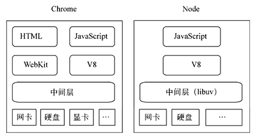
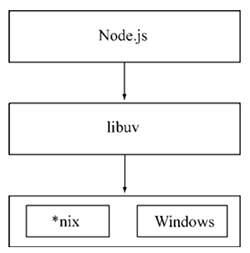
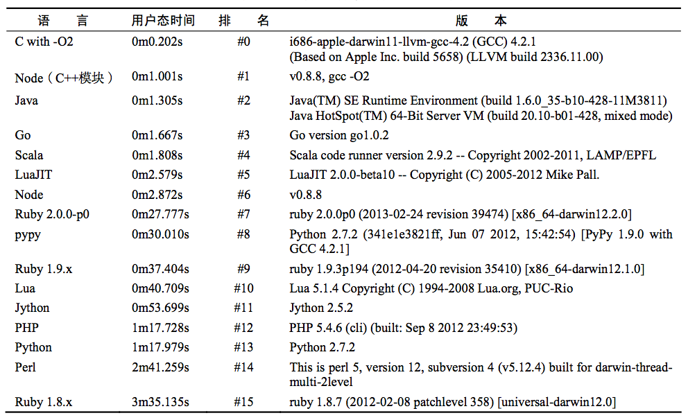

## 基本简介

Node.js 是可以在服务端跨平台运行 JS 的虚拟机，是浏览器在协议栈另一边的倒影，即，Node.js 在服务端之于 JS，就类似浏览器在客户端之于 JS。



Node.js 的出现使得主要运行在客户端的 JS 也开始大量运行于服务端，这带来的好处是：

* 前后端开发语言的一致性，使得开发者无需转换语言环境，即可同时完成前后端开发
* 数据格式，例如 JSON，以及第三方包，可以同时在前后端通用

### 项目起源

> Lua  /ˈluːə/，一个简洁、轻量、可扩展的脚本语言

> Haskell /ˈhæskəl/，一种标准化的，通用的纯函数编程语言

项目最初的目标是设计一个高性能服务器，提供 Apache 等服务器之外的选择，该服务器具备：

* 异步 I/O
* 事件驱动

项目最终选择 JS 的缘由是，在众多语言中：

* C/C++，开发门槛高
* Ruby，虚拟机性能不佳
* Lua，自身具有很多阻塞 I/O 库
* Haskell，作者本身不是太熟悉
* JavaScript，符合需求，开发门槛低，且有高性能 V8 引擎背书

### 基本特点

> 锁，并发编程中用于解决资源争用，防止多个进程/线程同时修改数据的机制。

Node.js 的基本特点：

* 异步 I/O

  底层标准 API，从文件读取到网络请求，多为异步 API。所谓异步 I/O，即程序 I/O 操作时代码立即返回，继续执行后续任务，I/O 完成时执行回调，不阻塞主线程，从而实现高并发

  ```
  fs.readFile('/path1', function (err, file) {
      console.log('读取文件1完成');
  });
  fs.readFile('/path2', function (err, file) {
      console.log('读取文件2完成');
  });
  ```

  异步 I/O 带来的好处：

  * 用户体验更好，主线程不会被阻塞，可及时响应用户交互
  * 计算机资源利用更充分，I/O 时，程序继续执行，CPU 不用闲置

* 事件驱动

  浏览器端通过监听事件响应界面用户交互，Node.js 将这种机制引入到服务端，在程序执行的特定时刻发出事件，开发者只需要监听事件并防止响应的回调函数即可

  ```
  let http = require('http');
  
  // 侦听服务器的request事件
  http.createServer(function (req, res) {
      let postData = '';
      
      req.setEncoding('utf8');
  
      // 侦听请求的data事件 
      req.on('data', function (trunk) {
          postData += trunk;
      });
  
      // 侦听请求的end事件
      req.on('end', function () {
          res.end(postData);
      });
  }).listen(8080);
  ```

  事件驱动存在的问题：

  * 不同事件处理相互独立，如何协同？
  * 回调函数的异步编程模式，导致代码的位置顺序与执行顺序不一致

* 单线程

  多线程的缺点：

  * 死锁
  * 状态同步
  * 创建线程和执行期线程上下文切换带来的性能损耗大

  单线程的缺点：

  * 无法利用多核 CPU，不适用于计算密集型应用
  * 应用健壮性欠缺，错误可能会引起整个应用退出

  单线程的缺点解决方案：

  * Node.js 本身的 child_process
  * JS 本身的 Web Works

* 跨平台

  通过在 Node.js 与系统之间增加一个 Libuv 中间层，实现跨平台。

  

### 使用场景

Node.js 的使用场景：

* I/O 密集型

  异步 I/O 的设计使得在单个线程上，并行执行多个 I/O 也不会阻塞主线程。**如果以出现 C10K 问题作为连接上限，那么单个线程理论上可以同时服务 10000 个请求**。

* 非 CPU 密集型

  Node.js 不适合 CPU 密集型并非是因为计算性能差，而是因为其只由一个主线程，尽量避免主线程用于密集计算，可以防止线程阻塞，提高应用性能。

  《深入浅出 Node.js》中，作者测试了不同语言脚本处理相同斐波那契数列计算场景时的表现，Node.js 的性能仅次于 C。

  


