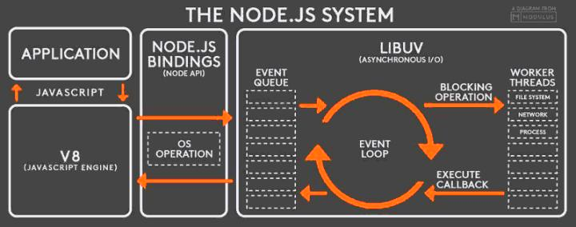
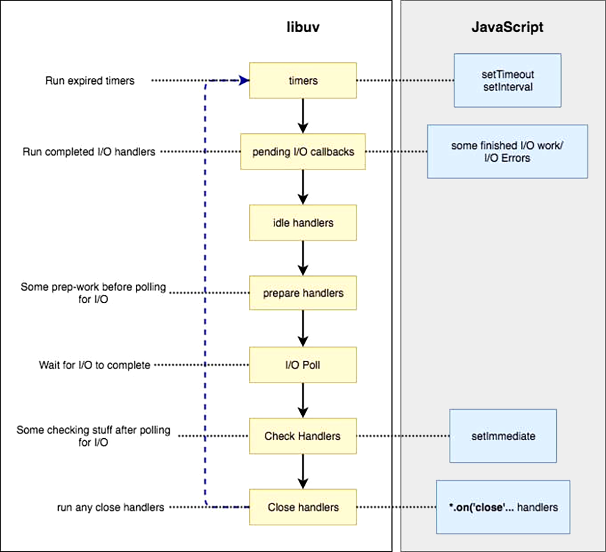

## 执行机制

Node.js 的异步执行机制比浏览器更复杂，因为可以跟内核对话，所以需要专门的库 Libuv 做这件事。这个库负责各种回调函数的执行时间，毕竟异步任务最后还是要回到主线程，一个个排队执行。



* V8 引擎解析 JavaScript 脚本
  * 同步代码顺序执行
  * 异步代码立即返回，任务通过调用 Node.js Bindings 移交给 Libuv 处理
* Libuv 库负责异步任务的执行，它将不同的任务分配给不同的线程，形成一个 Event Loop（**事件循环，见下文**），以异步的方式将任务的执行结果返回给 V8 引擎
* V8 引擎再将结果返回给用户

### 异步 API

根据 I/O 与否，Node.js 中的异步 API 主要分为两类：

* I/O 异步 API，产生 I/O callback

  * File System
  * Network 
  * ...

* 非 I/O 异步API，产生非 I/O callback

  * setTimeout，单次定时执行任务，同浏览器

  * setInterval，多次定时执行任务，同浏览器

  * process.nextTick，向 Tick Task 队列添加任务

    使用的原因：

    * 允许用户及时处理错误，清理任何不需要的资源，或在事件循环继续之前重试请求
    * 有时在调用堆栈已解除但在事件循环继续之前，必须允许回调运行

    存在的问题：

    * 自身嵌套调用将彻底阻塞 Event Loop

      ```
      process.nextTick( function foo() {
      		process.nextTick(foo);
      });
      ```

  * setImmediate，向 Macro Task 队列添加任务，不依赖定时器，其总在 poll 阶段后的 check 阶段执行。

    基于[官方文档](https://nodejs.org/zh-cn/docs/guides/event-loop-timers-and-nexttick/#process-nexttick)，setImmediate 的实际功能表现才符合 process.nextTick 名称，但更换修改名称将导致已有 npm 包的混乱，所以"错误"的名字得一保存。

    同时，多层嵌套的 process.nextTick 总是在同一个 Loop 中立即执行，而 setImmediate 在下一个 Loop 的 check 阶段触发，更加规律且易于推理。所以，官方建议：在所有场景下，使用 setImmediate 取代 process.nextTick

需要注意的是：

* setTimeout 和 setInterval 创建的定时器会被插入到定时器观察者内部的[红黑树](https://zh.wikipedia.org/wiki/%E7%BA%A2%E9%BB%91%E6%A0%91)（一种自平衡二叉查找树）中。每次 Tick 执行时，会从该红黑树中迭代取出定时器对象，检查是否超过定时时间，如果超过，就形成一个事件，它的回调函数将立即执行，操作时间复杂度为 **O(log(n))**。相对而言，setImmediate 和 process.nextTick 的事件复杂度为 **O(1)**，效率更高。
* Node.js 官方文档中，并没有提到 Micro Task 队列或者 Macro Task 队列。不过，基于 process.nextTick 和 Promise 的回调追加到本轮循环，setTimeout、setInterval 和 setImmediate 的回调追加到次轮循环的行为机制，同 Macro Task 和 Macro Task 的执行结果一致，所以，这里借用浏览器环境的概念进行描述。

### 事件循环

Node.js 启动后，Libuv 即会初始化事件轮询。脚本程序通常会调用异步 API 函数，比如 process.nextTick，产生异步任务事件，当同步任务执行完毕，事件循环就开始了。

参考《01-浏览器原理》，在 Node.js 中，依旧将 Task 分为：

* Micro Task
  * Tick Task
* Macro Task

它们的执行规则：

1. 主线程同步任务执行完成时，开始执行 Event Queue 中的任务

2. 优先完全执行 Micro Task，在 Micro Task 任务中，Tick Task 任务执行整体在前面；如果 Micro Task 任务执行中产生了新的 Micro Task，则添加新的 Micro Task 到 Micro Task 队列尾部，执行直至 Micro Task 队列为空

3. 当 Micro Task 队列执行完毕后，开始进入上图中的 Event Loop，执行 Macro Task 队列，Macro Task 队列执行的顺序如下

   

   * timers，检查 setTimeout 和 setInterval 定时器，主线程会检查当前时间是否满足定时器的要求，满足则执行回调函数

   * I/O callbacks，执行 I/O 异步 API 产生的任务，比如 TCP 错误，一般是除下列 API 以外产生的任务回调

     * setTimeout 和 setInterval 的回调函数
     * setImmediate 的回调函数
     * 用于关闭请求的回调函数，比如 socket.on('close', ...)

   * idle 和 prepare，只供 libuv 内部调用，可以忽略

   * poll，轮询，用于等待还未返回的 I/O 事件，比如服务器的响应等。轮询阶段有两个重要功能：

     * 计算应该阻塞和轮询 I/O 的时间
     * 处理轮询队列里的事件

     事件轮询同步执行 poll 队列里的回调，直到队列为空或执行回调达到系统上限（上限具体多少未详），接下来事件轮询会检查有无预设的 setImmediate，分两种情况：

     * 若有，事件轮询将结束 poll 阶段进入 check 阶段，并执行 check 阶段的任务队列

     * 没有，事件轮询将阻塞在该阶段等待

       注意，正是因为没有 setImmediate 时会导致事件轮询阻塞在 poll 阶段，这样之前设置还没执行的 timer 会得不到执行！所以，在 poll 阶段事件轮询有一个检查机制，即检查是否存在已达时间阈值的计时器，如果有，则重新进入到 timer 阶段，开始下一轮事件轮询

   * check，执行 setImmediate 的回调函数

   * close callbacks，该阶段执行关闭请求的回调函数，比如 socket.on('close', ...)

   需要注意的是：

   * 每个阶段都有一个 FIFO 的回调函数队列，只有一个阶段队列中的回调函数都执行了，事件循环才会进入下一个阶段
   * 在该步骤的不同阶段中，每执行一个宏任务，就需要执行一次步骤 2

### 应用实践

#### 示例1

```
const fs = require('fs');

const timeoutScheduled = Date.now();

// 异步任务一：100ms 后执行的定时器
setTimeout(() => {
    const delay = Date.now() - timeoutScheduled;
    console.log(`${delay}ms`);
}, 100);

// 异步任务二：文件读取后，有一个 200ms 的回调函数
fs.readFile('test.js', () => {
    const startCallback = Date.now();
    while (Date.now() - startCallback < 200) {
        // 什么也不做
    }
});
```

该示例来自 Node.js 官网。

**待验证**

Node.js 启动，主线程执行，注册最外层 setTimeout 和 fs.readFile，主线程执行完成，开始 Event Loop

第一轮 Loop

* timers 阶段，setTimeout 时间阈值未到
* I/O callbacks 阶段，fs.readFile 未完成，也没有可执行的 I/O 回调
* Poll 阶段，阻塞，等待内核返回 fs.readFile 读取结果。由于小文件读取一般不会超过 100ms，所以在定时器到期之前，Poll 阶段就会得到结果，因此就会继续往下执行。

第二轮 Loop

* timers 阶段，setTimeout 时间阈值依然未到
* I/O callbacks 阶段，已有可执行 I/O 回调，执行 fs.readFile 回调，该回调函数需要大约 200ms。也就是说，在它执行到一半的时候，100ms 的定时器就会到期。但是，必须等到这个回调函数执行完，才会离开这个阶段

第三轮 Loop

* timers 阶段，有到期定时器，执行 setTimeout，输出结果大概是 200 多毫秒

#### 示例2

```
setImmediate(function () {
    setImmediate(function A() {
        console.log(1);
        setImmediate(function B() {
            console.log(2);
        });
    });

    setTimeout(function timeout() {
        console.log('TIMEOUT FIRED');
    }, 0);
});
```

输出结果可以是 1-TIMEOUT FIRED-2 或者 TIMEOUT FIRED-1-2

Node.js 启动，主线程执行，注册最外层 setImmediate 回调，主线程执行完成，开始 Event Loop

第一轮 Loop，最外层 setImmediate 执行，注册函数 A 和 setTimeout 到下一轮 Loop 中各自的任务队列

第二轮 Loop，还是由于存在 **至少 1ms 的延时 (参见示例 3，setTimeout 最少是 1S，即便设置是 0)**，所以 timers 阶段时，setTimeout 可能就绪也可能未就绪，这依赖于环境性能

第三轮 Loop，check 阶段执行 函数 B

#### 示例3

> REPL，Read-Eval-Print Loop，读取-求值-输出循环

```
setTimeout(() => {
    console.log(2)
}, 2);

setTimeout(() => {
    console.log(1)
}, 1);

setTimeout(() => {
    console.log(0)
}, 0);
```

测试结果：

* Chrome 浏览器：102
* Node.js  REPl：102、120、210 都有可能

HTML 规范中规定 setTimeout 的最小延迟是 4ms，但是为了优化后台任务的加载损耗以及降低耗电量，[Firefox](https://developer.mozilla.org/zh-CN/docs/Web/API/Window/setTimeout) 和 Chrome 将这个最小延迟将为 1ms，所以，以下三种写法的延时时一样的：

```
setTimeout(() => {});
setTimeout(() => {}, 0);
setTimeout(() => {}, 1);
```

所以，示例代码中 1 和 0 的先后顺序是可以确定的

* 在 Firefox 和 Chrome 浏览器中，定时器延时设计相对精确，所以，2ms 延时的 2 总在 1 和 0 后输出
* Node.js 中，定时器设计相对不那么精确，输出依赖于当前环境性能，很可能 1、0 还未输出，2ms 的时间就已经到了，所以 2 的输出就很不确定了，可以在 \_1_0_ 前中后的任何位置输出

基于上面的分析，由于 setTimeout(fn, 0)  具有至少 1ms 的延时，无法保证事件轮询进入 timers 阶段时，定时器满足时间并能够立即执行处理程序。所以，下面代码输出的 1 和 2 顺序是不确定的：

```
setTimeout(() => console.log(1));
setImmediate(() => console.log(2));
```

但是，下面代码的 setImmediate 总是优先于 setTimeout 执行，输出的顺序总是21

```
const fs = require('fs');

fs.readFile('test.js', () => {
    setTimeout(() => console.log(1));
    setImmediate(() => console.log(2));
});
```

因为 poll 阶段执行完成后进入 check 阶段，timers 阶段处于下一个事件循环阶段了。

#### 示例4

这是一个终极示例。

```
// T1
// Loop 1 timers/1
setTimeout(function () {
    // T8
    // Loop 2 timers/1
    setTimeout(function () {
        console.log('8-setTimeout in setTimeout');
    }, 0);

    // I7
    // Loop 1 check/3
    setImmediate(function () {
        console.log('7-setImmediate in setTimeout');
    });

    // P3
    // Loop 1优先执行Tick Task
    process.nextTick(function () {
        console.log('3-nextTick in setTimeout');
    });
}, 0);

// I1
// Loop 1 check/1
setImmediate(function () {
    // T9
    // Loop 2 timers/2
    setTimeout(function () {
        console.log('9-setTimeout in setImmediate');
    }, 0);

    // I10
    // Loop 2 check/1
    setImmediate(function () {
        console.log('10-setImmediate in setImmediate');
    });

    // P5
    process.nextTick(function () {
        console.log('5-nextTick in setImmediate');
    });
});

// P1
process.nextTick(function () {
    // T4
    // Loop 1 timers/2，Loop 1 timers 阶段结束
    setTimeout(function () {
        console.log('4-setTimeout in nextTick');
    }, 0);

    // I6
    // Loop 1 check/2
    setImmediate(function () {
        console.log('6-setImmediate in nextTick');
    });

    // P2
    // 执行后进入事件循环
    process.nextTick(function () {
        console.log('2-nextTick in nextTick');
    });
});

// Main
// 主线程同步执行
console.log('1-main thread');
```

1. 主线程同步执行
   * T1 setTimeout 注册至第一轮 Loop 的 timers 阶段队列，位次1（Loop 1 timers/1）
   * I1 setImmediate 注册至第一轮 Loop 的 check 阶段队列，位次1（Loop 1 check/1）
   * P1 process.nextTick 添加一个 Tick Task，在主线程同步执行完后执行
   * Main 处主线程执行结束，输出 `1-main thread`
2. Micro Task （P1）执行
   * T4 setTimeout 注册至第一轮 Loop 的 timers 阶段队列，位次2（Loop 1 timers/2）
   * I6 setImmediate 注册至第一轮 Loop 的 check 阶段队列，位次2（Loop 1 check/2）
   * P2 process.nextTick 添加 Tick Task，在 P1 执行完后执行，输出 `2-nextTick in nextTick`
3. 第一轮 Loop （Loop 1）开始
   * timers 阶段
     * Loop 1 timers/1（T1 setTimeout）回调执行
       * T8 setTimeout 赶不上本轮 timers，故注册至第二轮 Loop 的 timers 阶段（Loop 2 timers/1）
       * I7 setImmediate 一轮 check 未开始，故注册至第一轮 Loop 的 check 阶段（Loop 1 check/3）
       * P3 process.nextTick 添加 Tick Task，在 T1 执行完后执行，输出 `3-nextTick in setTimeout`
     * Loop 1 timers/2（T4 setTimeout）回调执行，输出 `4-setTimeout in nextTick`
     * Loop 1 timers 执行完毕
   * check 阶段
     * Loop 1 check/1（I1 setImmediate）回调执行
       * T9 setTimeout 注册至第二轮 Loop 的 timers 阶段（Loop 2 timers/2）
       * I10 setImmediate 赶不上本轮 check，故注册至第二轮 Loop 的 check 阶段（Loop 2 check/1）
       * P5 process.nextTick 添加 Tick Task，在 I1 执行完后执行，输出 `5-nextTick in setImmediate`
     * Loop 1 check/2（I6 setImmediate）回调执行，输出 `6-setImmediate in nextTick`
     * Loop 1 check/3（I7 setImmediate）回调执行，输出 `7-setImmediate in setTimeout`
4. 第二轮 Loop （Loop 2）开始
   * timers 阶段
     * Loop 2 timers/1（T8 setTimeout）回调执行，输出 `8-setTimeout in setTimeout`
     * Loop 2 timers/2（T9 setTimeout）回调执行，输出 `9-setTimeout in setImmediate`
   * check 阶段
     * Loop 2 check/1（I10 setImmediate）回调执行，输出 `10-setImmediate in setImmediate`

需要注意的是：

* 测试时，可能最终的显示结果与上文描述有出入。因为这里未考虑 poll 阶段检查到有达到时间阈值的 timer 时，中断后续 check 阶段，直接返回 timers 阶段的情况。这里的 setTimeout 均是 1ms 延时，在 poll 阶段需要直接绕回处理已到时 setTimeout 的情况是存在的，通过调节代码性能可以检查到这种情况，比如：
  * 将代码中的回调函数改为箭头函数或者命名函数

### 参考

* https://nodejs.org/zh-cn/docs/guides/event-loop-timers-and-nexttick/#process-nexttick
* https://www.twblogs.net/a/5b96861e2b717750bda51dd9


