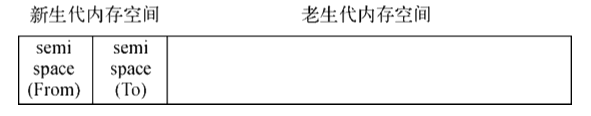

## 内存管理

JS 像 Java 一样，由垃圾回收机制自动进行内存管理，所以，不需要像 C/C++ 那样，开发者需要时刻关注内存的分配和释放。

特别是在客户端设备，页面仅服务于单个用户，除了极少类似循环递归的极端情况外，一般出现内存问题的可能性较低。即便出现问题，随着程序退出，内存也会得以释放。同时，在设备性能日新月异的今天，开发者往往很少在意 JS 的内存管理。

但是，随着 JS 基于 Node.js 运行于服务端，程序将同时服务于所有用户，尤其是在大流量场景下，较小的内容问题都可能导致整个服务不可用。

### 内存分类

Node.js 内存有堆内内存和堆外内存两种。

#### 堆内内存

堆内内存，简称堆内存，是 V8 引擎用于存储引用类型对象使用的内存。

```
let showMem = function () {
    let mem = process.memoryUsage();
    let format = function (bytes) {
        return (bytes / 1024 / 1024).toFixed(2) + ' MB';
    };
    let info = [
        `Process: heapTotal ${format(mem.heapTotal)}`,
        `heapUsed ${format(mem.heapUsed)}`,
        `rss ${format(mem.rss)}`
    ].join(', ');

    console.log(info);
};

let useMem = function () {
    let size = 20 * 1024 * 1024;
    let arr = new Array(size);

    for (let i = 0; i < size; i++) {
        arr[i] = 0;
    }

    return arr;
}

let total = [];

for (let j = 0; j < 15; j++) {
    showMem();
    total.push(useMem());
}

showMem();
```

CLI 执行结果：

```
Process: heapTotal 5.20 MB, heapUsed 2.63 MB, rss 24.60 MB
Process: heapTotal 167.21 MB, heapUsed 163.45 MB, rss 186.44 MB
Process: heapTotal 327.23 MB, heapUsed 323.46 MB, rss 346.50 MB
Process: heapTotal 487.24 MB, heapUsed 483.46 MB, rss 506.62 MB
Process: heapTotal 647.25 MB, heapUsed 643.46 MB, rss 666.67 MB
Process: heapTotal 807.26 MB, heapUsed 803.46 MB, rss 826.69 MB
Process: heapTotal 967.77 MB, heapUsed 962.56 MB, rss 986.82 MB
Process: heapTotal 1127.79 MB, heapUsed 1122.56 MB, rss 1146.84 MB
Process: heapTotal 1287.80 MB, heapUsed 1282.56 MB, rss 1306.85 MB

FATAL ERROR: CALL_AND_RETRY_LAST Allocation failed - JavaScript heap out of memory
```

每次调用 useMem 都导致了 3 个值的增长。在接近 1.4GB 的时候，无法继续分配内存，然后进程内存溢出了，连循环体都无法执行完成。   				 			 		

#### 堆外内存

堆外内存，Node.js 进程中不是通过 V8 分配的内存。

从上面堆内内存的 CLI 执行结果也可以看出，rss 总是大于堆内存，多出的部分就是堆外内存。

我们修改堆内存中的示例，使用 Buffer 取代 useMem() 函数中的数组

```
let showMem = function () {
    let mem = process.memoryUsage();
    let format = function (bytes) {
        return (bytes / 1024 / 1024).toFixed(2) + ' MB';
    };
    let info = [
        `Process: heapTotal ${format(mem.heapTotal)}`,
        `heapUsed ${format(mem.heapUsed)}`,
        `rss ${format(mem.rss)}`
    ].join(', ');

    console.log(info);
};

let useMem = function () {
    let size = 200 * 1024 * 1024;
    let buffer = new Buffer(size);

    for (let i = 0; i < size; i++) {
        buffer[i] = 0;
    }

    return buffer;
}

let total = [];

for (let j = 0; j < 15; j++) {
    showMem();
    total.push(useMem());
}

showMem();
```

CLI 执行结果：

```
Process: heapTotal 5.20 MB, heapUsed 2.63 MB, rss 24.39 MB
Process: heapTotal 7.20 MB, heapUsed 3.45 MB, rss 226.32 MB
Process: heapTotal 7.20 MB, heapUsed 3.46 MB, rss 426.48 MB
Process: heapTotal 7.70 MB, heapUsed 2.80 MB, rss 626.61 MB
Process: heapTotal 7.70 MB, heapUsed 2.80 MB, rss 826.61 MB
Process: heapTotal 7.70 MB, heapUsed 2.57 MB, rss 1026.64 MB
Process: heapTotal 9.70 MB, heapUsed 2.54 MB, rss 1226.81 MB
Process: heapTotal 9.70 MB, heapUsed 2.54 MB, rss 1426.81 MB
Process: heapTotal 9.70 MB, heapUsed 2.54 MB, rss 1626.81 MB
Process: heapTotal 6.70 MB, heapUsed 2.54 MB, rss 1826.36 MB
Process: heapTotal 6.70 MB, heapUsed 2.54 MB, rss 2026.36 MB
Process: heapTotal 6.70 MB, heapUsed 2.54 MB, rss 2226.36 MB
Process: heapTotal 6.70 MB, heapUsed 2.54 MB, rss 2425.39 MB
Process: heapTotal 6.70 MB, heapUsed 2.54 MB, rss 2625.39 MB
Process: heapTotal 6.70 MB, heapUsed 2.54 MB, rss 2825.39 MB
Process: heapTotal 6.70 MB, heapUsed 2.54 MB, rss 3025.39 MB
```

可以看到，15 次循环都完整执行，并且三个内存占用值与前一个示例完全不同：heapTotal 与 heapUsed 的变化极小，唯一变化的是 rss 的值，并且该值已经远远超过 V8 的限制值。这是因为 Buffer 对象不同于其他对象，它不经过 V8 的内存分配机制，所以也不会有堆内存的大小限制。  				 			 		

这意味着利用堆外内存可以突破内存限制的问题。				 			 		

为何 Buffer 对象并非通过 V8 分配？这在于 Node 并不同于浏览器的应用场景。在浏览器中， JS 直接处理字符串即可满足绝大多数的业务需求，而 Node 则需要处理网络流和文件 I/O 流， 操作字符串远远不能满足传输的性能需求。  				 			 		

### 垃圾回收

当 JS 引擎进行进行垃圾回收时，为了避免出现 JS 应用逻辑与垃圾回收器看到的不一致的情况，垃圾回收需要将应用逻辑暂停下来，待执行后再恢复执行，这种行为称为全停顿 (stop-the-world)。

#### 回收策略

基本的垃圾回收策略有两种：

- 标记清除
- 引用计数

##### 标记清除

变量的标记分为两种：

- 进入环境，当变量进入执行环境时，例如在函数中声明了的一个变量，变量会被标记为"进入环境"，这种变量逻辑上不能被删除
- 离开环境，当变量离开环境时，则标记为"离开环境"，这种变量逻辑上可以被清除。

当垃圾回收器运行的时候，不再需要的变量将会被清除。

目前浏览器大都采用标记清除，或者类似的策略。

##### 引用计数

引用计数是跟踪引用类型数据被引用的次数，每当引用类型被赋值给一个变量时，其引用次数就会 +1；反之，当引用某个引用类型的变量被赋予了其它的值/引用，则该引用类型的引用次数就会 -1；当某个引用类型数据的引用次数为 0 时，则表示没有变量引用，可以清除。

引用计数存在的问题是循环引用，即两个对象各有属性引用对方，导致两者即便不再被使用但引用次数依然不为 0，所以始终无法清除。

```
function problem() {
    let objA = new Object();
    let objB = new Object();

    objA.someProp = objB;
    objB.someProp = objA;
}
```

主要是早期的浏览器使用引用计数，例如：

- Netscape Navigator 3.0
- IE8 及 IE8-，因为使用 COM(Component Object Model，组件对象模型) 实现 BOM 和 DOM，而 COM 的垃圾回收策略就是引用计数策略

#### 回收日志

可以通过以下两种方式获取并分析垃圾回收日志：

* Node.js 程序启动时添加 \-\-trace_gc 参数，例如

  ```
  node --trace_gc -e "var a = [];for (var i = 0; i < 1000000; i++) a.push(new Array(100));" > gc.log
  ```

* Node.js 程序启动时使用 \-\-prof 参数，可以得到 V8 执行时的性能分析数据，其中包含了垃圾回收执行时占用的时间

#### V8 引擎

由于没有一种垃圾回收策略能够胜任所有场景，尤其在实际应用中，不同对象的生命周期长短不一，不同算法在不同情况下的表现也参差不齐，所以，实际中，浏览器引擎的回收机制也相对复杂。

V8 的垃圾回收策略主要基于分代式垃圾回收机制，即基于对象生命周期的长短不同，分别使用不同的算法。

V8 将内存分成两部分：

* 新生代，存储存活时间较短的对象
* 老生代，存储存活时间较长或常驻与内存中的对象

V8 堆内存的整体大小就是新生代内存空间 + 老生代内存空间。

##### 新生代回收

> scavenge /'skævɪn(d)ʒ/ v. 清除, 打扫

新生代对象采用 Scavenge 算法，一种通过复制方式实现的垃圾回收算法。



Scavenge 算法的基本规则：

* 堆内存一分为二，每个部分称为 semispace。其中一个使用一个闲置：
  * 用于内存分配的 semispace，称为 From空间
  * 闲置的 semispace，称为 To 空间
* 垃圾回收时，From 空间中的存活对象被复制到 To 空间中，然后清理释放 From 空间；完成复制后，From 空间和 To 空间的角色发生对换

Scavenge 算法的优点：

* 只复制存活对象，由于新生代生命周期短，存活对象少，所以其效率高

Scavenge 算法的缺点：

* 只能使用内存的一半，牺牲空间换时间，所以只适合新生代这种生命周期短，存活对象少的场景，无法应用于大规模内存对象的垃圾回收

##### 老生代回收

当满足以下两个条件时，新生代对象会被复杂到老生代，这个过程称为晋升：

* 对象已经经历过 Scavenge 回收，表示对象存活时间较长
* To 空间已经使用超过 25%，V8 限制 25% 是因为 Scavenge 回收后 To 空间转换成 From 空间，需要预留足够空间用于以后新的变量对象的内存空间分配

在老生代空间中存活周期较长的对象，再采用 Scavenge 算法会有两个问题：

* 存活对象较多，复制大量对象的效率低
* 浪费一半空间，限制了对象的存储内存

所以，老生代对象使用 Mark-Sweep & Mark-Compact 方式回收处理。

###### Mark-Sweep

Mark-Sweep，标记清除，它分为标记和清除两个阶段

* 标记，遍历堆中所有对象，标记活着的对象
* 清除，清除没有被标记的对象

Mark-Sweep 方式的优点：

* 老生代对象相对生命周期长，需清理对象少，采用清理失活对象的方式效率高

Mark-Sweep 方式的缺点：

* 速度相对不如 Scavenge
* 内存碎片化，清理掉失活对象后，内存空间变的不连续，而碎片化空间利用效率低，进而导致频繁的垃圾回收

###### Mark-Compact

> compact /kəm'pækt/ a. 紧凑的, 紧密的 v. 使紧密, 使简洁

Mark-Compact，标记整理，是为了解决内存碎片化的 Mark-Sweep 进化方法，它分为标记和整理两个阶段

* 标记，遍历堆中所有对象，标记活着的对象
* 整理，将活着的对象统一向内存空间的一端移动，然后清理掉剩下的边界外的所有空间

Mark-Compact 方式的优点：

* 解决了内存碎片化的问题

Mark-Compact 方式的缺点：

* 速度比 Mark-Sweep 慢，因为需要移动对象

所以，由于 Mark-Sweep & Mark-Compact 两种方式各有优劣，所以 V8 采用两种方法相结合的方式：

* Mark-Sweep，考虑速度的问题，优先使用
* Mark-Compact，当老生代空间不足以对新生代晋升对象进行分配时才使用

同时，为了避免过长的全停顿导致 V8 响应延迟，实际的 Mark-Sweep & Mark-Compact 方式并不是一次性连续执行的，其标记和清理/整理都是增量且并行的。

### 内存限制

一般的 JS 引擎都是有内存限制的，以防止浏览器耗尽系统内存导致系统崩溃。

对于 V8 引擎，以1.5GB 垃圾回收堆内存为例，V8 做一次小的垃圾回收需要 50ms 以上，做一 次非增量式的垃圾回收甚至要 1s 以上。这是垃圾回收中引起 JS 线程暂停执行的时间，在这样的时间花销下，应用的性能和响应能力都会直线下降。这样的情况不仅仅后端服务无法接受， 前端浏览器也无法接受。因此，在当时的考虑下直接限制堆内存是一个好的选择。

V8 内存限制为：

- 32 位系统，0.7G
- 64 位系统，1.4G

所以，基于 V8 引擎的 Node.js 中依然存在这个限制。

在 Node.js 中，可以使用以下方法查看当前内存使用情况：

- process.memoryUsage()，Node.js 进程使用情况

  ```
  Flying:node flying$ node
  > process.memoryUsage()
  {
  		rss: 29188096,
    	heapTotal: 7028736,
    	heapUsed: 3894232,
    	external: 8352
  }
  > 
  ```

  - rss，resident set size，即进程的常驻内存部分。进程的内存总共有几部分，一部分是 rss，其余部分在交换区(swap)或者文件系统(filesystem)中
  - heapTotal，当前申请的堆内存总量
  - heapUsed，当前已使用的堆内存总量

- os 模块，系统内存使用情况

  - totalmem()，系统总内存
  - freemem()，剩余内存

  ```
  Flying:node flying$ node
  > os.totalmem()
  17179869184		// 16GB
  > os.freemem()
  2201165824		// 2GB
  ```


 当然，这个限制也不是不能打开，V8依然提供了选项让我们使用更多的内存。Node在启动 时可以传递--max-old-space-size或--max-new-space-size来调整内存限制的大小，示例如下: 

node --max-old-space-size=1700 test.js // 单位为MB 

// 或者  

node --max-new-space-size=1024 test.js // 单位为KB

上述参数在V8初始化时生效，一旦生效就不能再动态改变。如果遇到Node无法分配足够内 存给JavaScript对象的情况，可以用这个办法来放宽V8默认的内存限制，避免在执行过程中稍微 多用了一些内存就轻易崩溃。  	

### 内存分析

Node.js 内存分析的主要工具：

* node-heapdump
* node-memwatch

它们允许对 V8 堆内存抓取快照，用于事后分析

### 内存优化

想要高性能的执行效率，需要让垃圾回收尽量少地高效率地进行。

#### 作用域

JS 中作用域可以分为两类：

* 局部作用域

  通过函数或者 with 语法创建，生命周期较短，其域内变量对象内存主要在新生代的 From 空间，一般会随着局部作用域的释放而自动被回收，无需优化。

* 全局作用域

  通过不使用 var/let/const 或者 global 属性创建，默认情况下常驻内存，内存分配在老生代，可以通过 delete 或者置空的方式释放。

  ```
  global.foo = "I am global object";
  console.log(global.foo);    // => "I am global object"
  delete global.foo;
  
  // 或者重新赋值
  global.foo = undefined;     // or null
  console.log(global.foo);    // undefined
  ```

#### 闭包

闭包会导致其引用的外层作用域变量长久驻存，得不到释放，例如

```
let foo = function () {
    let bar = function () {
        let local = "局部变量";		// 被内部闭包函数引用，无法及时释放

        return function () {
            return local;
        };
    };

    let baz = bar();
    console.log(baz());
};
```

合理使用闭包可以有效减少变量对象数量。

#### 缓存

我们通常使用缓存来优化性能，因为它的访问效率比 I/O 高很多。例如：

```
let cache = {};
let get = function (key) {
    if (cache[key]) {
        return cache[key];
    } else {
        // get from otherwise
    }
};
let set = function (key, value) {
    cache[key] = value;
};
```

对象缓存导致的问题：

* 缓存对象将常驻老生代，缓存越多，长期存活对象也越多，这将导致垃圾回收在扫描和整理时，对这些对象频繁做无用功
* 进程之间无法共用内存，为了利用多核 CPU，我们通常通过负载均衡同时开启多个 Node.js 进程，缓存对象会在这每个进程中都存在一份，这对物理内存的使用是一种浪费

对象缓存优化的方案：

* 对缓存对象设置容量或者时间限制，超过一定数量或者一定时间后清除早期的部分对象
* 进程外缓存，即将缓存移到进程外部，使多进程共享缓存。较好的缓存方案有：
  * node_redis：https://github.com/mranney/node_redis
  * node_memcached：https://github.com/3rd-Eden/node-memcached


