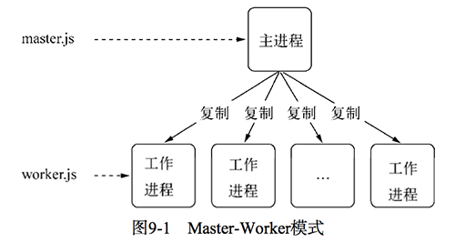
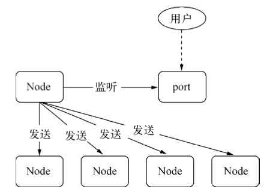
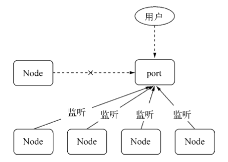
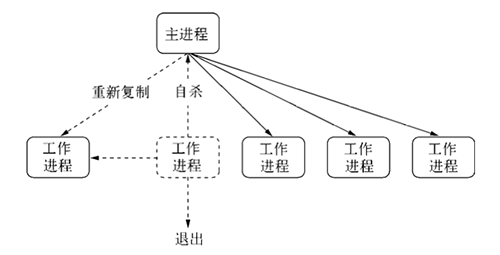

## 玩转进程

Node.js 异步 IO 底层使用线程池实现，运行起来会有多个线程，但执行 JS 的部分只有一个线程。这种单进程单线程的设计存在的主要问题是：

* CPU 利用率低，只依赖单核 CPU 运算，无法充分利用多核 CPU 的性能
* 应用健壮性差，无论是进程还是核心 JS 线程出现未捕获错误，都可能导致整个程序的崩溃


如果每个进程使用一个 CPU 核心，那么多开几个 API 服务器进程，就可以同时解决上面的两个问题。不过，此时需要解决多个进程监听到同一个端口的问题。

### 服务模型

首先，了解一下 Web 服务器的架构模型变迁，大致经历了以下几个阶段。

#### 同步进程

最早期的服务模型，一个进程，且同步执行 I/O，即一次只执行一个请求，其它请求都按次序等待。这意味着除了当前被处理的请求外，其余请求都处于耽误状态。

同步进程模型的缺点：

* CPU 利用率差
* 根本谈不上并发

#### 复制进程

为了增加并发，改进后的复制进程模型采用进程复制的方式，即一个请求一个复制进程；同时，为了防止请求等待且提高效率，进程往往是提前复制且复用的。

复制进程模型的缺点：

* 复制进程时需要同时复制内部状态，导致相同状态存在于多个进程中，浪费内存；且进程较重，请求的增加导致内存占用上升极快
* 复制进程因为涉及较多数据的复制，启动缓慢，该问题的改进策略是预复制并复用进程

#### 多线程

多线程模型，即一个请求一个线程，一定程度上减轻了复制进程存在的问题。相对于复制进程，多线程的改进：

* 线程开销更小，且可以共享数据
* 利用线程池也可以减低线程创建和销毁的开销

但是，多线程只是降低了复制进程模型存在的问题，并未从根本上解决多进程的问题。

多线程模型的缺点：

* 每个线程都拥有独立的堆栈空间，尽管可以共享数据，但是不同线程仍然拥有相同的数据，仍然存在内存浪费
* 多线程依然存在 CPU 上的上下文切换问题，线程越大，上下文切换造成的损耗就越大

#### 事件驱动

> C10K，Client 10000，即单机 1 万个并发连接问题：当服务器同时接收到的客户端连接数量超过 10000 时，即便硬件性能足够， 依然无法正常提供服务。产生 C10K 问题的原因：
>
> * 早期 Unix 系统 PID（Process Identifier，进程 ID）采用有符号 16 位整数设计，最多只能创建 2^(16-1)^ - 1 =  32767 个进程，除去系统自身使用进程，留给服务器程序的也就一万个上下。当然，今天的系统多是 64 位的，这个问题已经解决
> * 每创建一个独立进程或线程，就增加一份独立的堆栈空间、上下文切换等开销，当上万个进程/线程同时运行时，很容易突破服务器性能上限。该问题的解决思路：单进程/线程服务多个客户端请求，通过异步编程和事件触发机制替换轮训，IO 采用非阻塞的方式，减少不必要的性能损耗
>
> 参考文章地址 [medium](<https://medium.com/@chijianqiang/%E7%A8%8B%E5%BA%8F%E5%91%98%E6%80%8E%E4%B9%88%E4%BC%9A%E4%B8%8D%E7%9F%A5%E9%81%93-c10k-%E9%97%AE%E9%A2%98%E5%91%A2-d024cb7880f3>)

多进程和多线程模型都存在 C10K 问题，Apache 就是采用多进程/多线程模型，但是当单机并发增长到上万时，内存耗用的问题就会暴露出来。

单线程事件驱动异步 I/O 模型，避免了不必要的内存和上下文切换开销，一定程度上解决了 C10K 问题。所以目前 Nginx 和 Node.js 就采用这种模型。但是，事件驱动模型依旧存在并发上限，只是这个上限远大于 10K 而已。与此同时，事件驱动模型依旧还存在以下缺点：

- CPU 利用率低，只依赖单核 CPU 运算，无法充分利用多核 CPU 的性能
- 应用健壮性差，无论是进程还是核心 JS 线程出现未捕获错误，都可能导致整个程序的崩溃

所以，有效利用多核 CPU 并同时提高应用健壮性是本节的主题。

### 实现方案

Node.js 中，通过多服务器进程（每个进程一个 JS 主线程），理想状况下一个进程利用一个 CPU 核心，达到有效利用多核 CPU 并同时提高应用健壮性的目的，**这也是 Node.js 容灾的重要手段**，具体的实现方式有以下几种。

#### 子进程

在 Cluster 集群模块被加入 Node.js 之前，我们需要使用子进程，通过以下繁琐的过程实现稳定多进程。

##### API

###### 创建

> spawn /spɔːn/ v. 产卵, 大量生产

child_process 模块可以随意创建子进程。它提供 4 个用于创建子进程的方法：

* spawn(command\[, args][, options])：通过命令字符串启动子进程
  * command，\<String>，要运行的命令字符串
  * args，\<String[]>，字符串参数列表
  * options，\<Object>，可选参数对象
* exec(command\[, options][, callback])：通过命令字符串启动子进程，不过，有一个进程终止时的回调
  * command，\<String>，要运行的命令字符串，并带上以空格分隔的参数
  * options，\<Object>，可选参数对象
  * callback(err, stdout, stderr)，\<Function>，进程终止时的回调
    * error，\<Error>
    * stdout，\<String> | \<Buffer>
    * stderr，\<String> | \<Buffer>
* execFile(file\[, args]\[, options][, callback])：通过可执行文件启动子进程
  * file，\<String>，可执行文件的名称或路径
  * args，\<String[]>，字符串参数列表
  * options，\<Object>，可选参数对象
  * callback(err, stdout, stderr)，\<Function>，进程终止时的回调
    - error，\<Error>
    - stdout，\<String> | \<Buffer>
    - stderr，\<String> | \<Buffer>
* fork(modulePath\[, args][, options])：通过可执行 JS 文件启动子进程
  * modulePath，\<String>，可执行 JS 文件的名称或路径
  * args，\<String[]>，字符串参数列表
  * options，\<Object>，可选参数对象

需要注意的是：

* execFile() 和 fork() 方法都可以执行 JS 文件，不同的是，使用 execFile() 方法需要以首行注释的形式告诉执行文件需要的命令及命令所在的位置

  ```
  #!/usr/bin/env node
  ```

###### 事件

子进程常用事件：

* error，当子进程出现以下情况时触发
  * 无法被复制创建
  * 无法被杀死
  * 无法发送消息
* exit，子进程退出时触发
  * 如果正常退出，事件回调的第一个参数为退出码，否则为 null
  * 如果进程是通过 kill() 方法杀死的，会有第二个参数，它表示杀死进程时的信号
* close，在子进程的标准输入输出流中止时触发该事件，参数与 exit 相同
* disconnect，在父进程或子进程中调用 disconnect() 方法时触发，调用该方法时将关闭监听 IPC 通道

###### 方法

 子进程常用方法：

* send(message\[, sendHandle\[, options]][, callback])，通过 IPC 通道发送消息
  * message，\<Object>，消息对象
  * sendHandle，\<Handle>，句柄
  * options，\<Object>，可选对象
    * keepOpen，\<Boolean>，为 true 时，发送进程的 socket 会保持打开，默认值 false
  * callback，\<Function>，回调函数
* kill([signal])，向子进程发送信号
  * signal，\<String>，信号值，默认为 'SIGTERM' (终止进程)

##### 架构

多进程架构通常采用 Master-Worker 模式，即主进程-工作进程模式



- 主进程不负责具体业务处理，而是负责调度或管理工作进程，它是趋向于稳定的
- 工作进程负责具体业务处理，因为业务多种多样，甚至一项业务由多人开发，所以工作进程的稳定性值得开发者关注

工作进程 JS 执行文件：

```
// worker.js
const http = require('http');
const random = Math.round((1 + Math.random()) * 1000);

http.createServer(function (req, res) {
    res.writeHead(200, {'Content-Type': 'text/plain'});
    res.end('Hello World');
}).listen(random);
```

主进程 JS 执行文件：

```
// master.js
const fork = require('child_process').fork;
const cpus = require('os').cpus();

for (let i = 0; i < cpus.length; i++) {
    fork('./worker.js');
}
```

启动主进程即可同步启动和 CPU 核心数量一样的工作进程。

##### 通信

> 文件描述符，一个非负整数索引值，指向内核为每一个进程所维护的打开文件的从零开始的记录表。在 Linux 系统中，一切皆可以看成是文件，比如普通文件、目录、端口等

> 句柄，是资源的标识或引用，其内部包含指向对象的文件描述符。比如，可以用来标识一个服务端 socket 对象、一个客户端 socket 对象、一个 UDP 套接字、 一个管道等

主进程和工作进程间需要进行通信，以及时的同步信息。在 HTML5 Web Worker 中，线程间通过 postMessage() 方法和 message 事件发送和侦听信息；在 Node.js 中，进程间通过类似的 send() 方法和 message 事件来发送和侦听信息

```
// master.js
const cp = require('child_process');
const sub = cp.fork(__dirname + '/worker.js');

sub.on('message', function (m) {
    console.log('PARENT got message:', m);
});
sub.send({hello: 'world'});

// worker.js
process.on('message', function (m) {
    console.log('CHILD got message:', m);
});

process.send({foo: 'bar'});
```

Node.js 的进程间通信是通过 IPC (Inter-Process Communication) 通道实现的，具体的实现原理可查看《深入浅出 Node.js》P241 页。

通过 IPC 通道，进程间不仅可以发送简单的数据，还可以发送句柄。进程对象 send() 方法可发送的句柄类型：

* net.Socket，TCP 套接字
* net.Server，TCP 服务器，任意建立在 TCP 服务上的应用层服务都可以享受到它带来的好处
* net.Native，C++ 层面的 TCP 套接字或 IPC 管道
* dgram.Socket，UDP 套接字
* dgram.Native，C++ 层面的 UDP 套接字

本质上，通过 IPC 通道发送的句柄实际上还是对象序列化后的字符串，但是，进程可以通过解析字符串并最终获取文件描述符，并在解析完成时触发 message 事件。

##### 实现

由于主进程和子进程监听在不同端口，如果采用客户端连接主进程，主进程再连接到工作进程的代理方式，会用掉两个文件描述符，但是操作系统的文件描述符是有限的。

正是为了解决上面这个问题，Node.js 引入句柄功能，即通过发送句柄使得所有的工作进程最终监听到同一个 TCP Socket 套接字的文件描述符上。

```
// master.js
const cp = require('child_process');
const child1 = cp.fork('worker.js');
const child2 = cp.fork('worker.js');
const server = require('net').createServer();

server.listen(1337, function () {
    child1.send('server', server);
    child2.send('server', server);
    server.close();     // 关掉主进程 server
});

// worker.js
const http = require('http');
const server = http.createServer(function (req, res) {
    res.writeHead(200, {'Content-Type': 'text/plain'});
    res.end('handled by worker, pid is ' + process.pid + '\n');
});

process.on('message', function (m, tcp) {
    if (m === 'server') {
        tcp.on('connection', function (socket) {
            server.emit('connection', socket);
        });
    }
});
```

* 主进程创建 net.Server 对象，然后通过 IPC 通道将该对象 send() 给所有的子进程；然后，主进程关闭自己的 net.Server 对象

  

* 子进程解析对象序列化后的字符串，获取文件描述符，并在解析完成时触发 message 事件；然后，所有的子进程监听同一个文件描述符，从而形成多进程监听同一端口的效果

  

需要注意的是：

* 多个进程直接使用 listen() 方法监听同一端口是不允许的，这是因为 TCP Socket 套接字的文件描述符不同。但是，主进程通过 send() 方法将其 TCP Socket 套接字的文件描述符发送给工作进程，此时工作进程监听的文件描述符就是相同的，所以是允许的
* 多个进程通过相同的文件描述符监听到同一端口，但是文件描述符同一时间只能被一个进程使用，所以最终只有一个进程可以抢到连接，并作出回应。所以，这种主进程-工作进程模式的负载均衡是抢占式的

##### 稳定性

要保持单台服务器上多进程的稳定性，需要完善的错误监控机制，并在单个进程出现故障时及时被退出，并在此之前开启新的子进程。较为完善的多进程稳定性架构如下图。



进程故障时：

* 首先，向主进程发送自杀信号，主进程及时新建新的工作进程
* 然后，故障工作进程停止接收新的连接，并在旧的连接处理完毕后关闭进程

主进程实现：

```
// master.js
const fork = require('child_process').fork;
const cpus = require('os').cpus();
const server = require('net').createServer();
server.listen(1337);

const workers = {};
const createWorker = function () {
    const worker = fork(__dirname + '/worker.js');

    // 启动新的进程
    worker.on('message', function (message) {
        if (message.act === 'suicide') {
            createWorker();
        }
    });

    // 退出时重新启动新的进程
    worker.on('exit', function () {
        delete workers[worker.pid];
    });

    // 句柄转发
    worker.send('server', server);
    workers[worker.pid] = worker;
};

// 按CPU数量创建同等数量的工作进程
for (let i = 0; i < cpus.length; i++) {
    createWorker();
}

// 主进程自己退出时，让所有工作进程退出
process.on('exit', function () {
    for (let pid in workers) {
        workers[pid].kill();
    }
});
```

工作进程实现：

```
// worker.js
const http = require('http');
const server = http.createServer(function (req, res) {
    res.writeHead(200, {'Content-Type': 'text/plain'});
    res.end('handled by child, pid is ' + process.pid + '\n');
});

let worker;

process.on('message', function (m, tcp) {
    if (m === 'server') {
        worker = tcp;
        worker.on('connection', function (socket) {
            server.emit('connection', socket);
        });
    }
});

process.on('uncaughtException', function (err) {
    process.send({act: 'suicide'});

    // 停止接收新的连接
    worker.close(function () {
        // 所有已有连接断开后，退出进程
        process.exit(1);
    });

    // 长连接限时5秒，强制退出进程
    setTimeout(function () {
        process.exit(1);
    }, 5000);
});
```

##### 状态共享

Node.js 进程中不宜存放太多数据，因为它会加重垃圾回收的负担，进而影响性能。同时，Node.js 本身无法在不同进程间共享数据。但在实际业务中，往往需要共享数据，譬如配置数据。

解决数据共享最简单的方式就是通过第三方进行数据存储，比如数据库、磁盘文件、缓存服务 (如 Redis) 等，所有工作进程启动时将其读取进内存中。

不过，第三方存储数据存在问题是：

* 数据发生改变时，及时通知各个进程，使其内部状态及时更新

 实现状态同步的机制有两种：

* 定时轮询，子进程向第三方定时轮询，不过这种方式比较浪费
* 主动通知，当数据发生更新时，主动通知子进程，这种方式较好  

#### Cluster

> 操作系统的 fork 函数，可以创建一个与原来进程几乎完全相同的进程，也就是两个进程可以做完全相同的事，但如果初始参数或者传入的变量不同，两个进程也可以做不同的事。

Cluster 集群模块是 Node 官方提供的多进程解决方案，是对 child_process 模块的封装，通过启动  Node.js 多进程来处理负载，同时，多个子进程共享一个服务器端口。


* 首先，Cluster 创建一个 master 进程
* 然后，根据指定数量使用基于操作系统 fork 函数的  `cluster.fork()` 出多个工作进程，master 进程通过 IPC 通道与工作线程通信，同时使用内置的负载均衡来更好地处理线程之间的压力。

示例

```
const cluster = require('cluster');
const cpus = require('os').cpus();

cluster.setupMaster({
    exec: "worker.js"	// worker.js具体业务逻辑代码同上节
});

for (let i = 0; i < cpus.length; i++) {
    cluster.fork();
}
```

##### 事件

cluster 模块常用的事件：

* fork，复制一个工作进程后触发
* online，复制好的工作进程会主动发送一条online消息给主进程，主进程收到消息后触发
* disconnect，主进程和工作进程之间的 IPC 通道断开后会触发
* exit，有工作进程退出时触发
* setup，cluster.setupMaster() 执行后触发
* listening，工作进程调用 listen() 共享了服务端 Socket 后，会发送 listening 消息给主进程，主进程收到消息后，触发该事件

##### 方法

cluster 模块常用的方法：

* setupMaster([settings])，主进程设置，只能由主进程调用
  * settings，\<Object>，设置对象，支持选项
    * execArgv，\<Array>，传递给 Node.js 可执行文件的参数列表，默认值 process.execArgv
    * exec，\<String>，工作进程文件路径
    * args，\<Array>，传递给工作进程的参数
    * silent，\<Boolean>，是否需要发送输出值父进程的 stdio，默认值 false
    * stdio，\<Array>，配置 fork 进程的 stdio
    * uid，\<Number>，设置进程的 user 标识符
    * gid，\<Number>，设置进程的 group 标识符

##### 参考

* http://taobaofed.org/blog/2015/11/03/nodejs-cluster/
* http://taobaofed.org/blog/2015/11/10/nodejs-cluster-2/
* http://nodejs.cn/api/cluster.html

#### PM2

PM2，Process Manager 2，是具有内置负载均衡器的 Node.js 应用程序的生产运行时和进程管理器。 它永久保持应用程序活跃，无需停机即可重新加载它们。

相对于需要自己实作很多细节，比如，错误自动重启、负载平衡等等的 Node 官方 cluster 模组，PM2 可以让你一行代码都不用写就自动做好这些事情。

类似的进程管理库还有 supervisord，forever，但是都没有 PM2 功能完善，比如，forever 没有应用监控和日志。

##### 基本命令

###### 包管理

```
npm install pm2 -g							// 全局安装
pm2 update											// 包升级
pm2 startup											// 开机启动
```

###### 应用管理

启动应用

```
pm2 start app.js                // 启动app.js应用
pm2 start app.js --name demo    // 启动应用并设置name
pm2 start app.sh                // 脚本启动
pm2 start app.js -i max					// 使用集群模式
pm2 start app.js --watch				// 启动应用且监控文件变化时自动重启应用
pm2 start pm2.json							// 使用配置文件启动应用
pm2 start pm2.json --env dev		// 开发环境模式启动应用
pm2 start pm2.json --only app		// 仅启动单个应用
```

停止应用

```
pm2 stop all										// 停止所有应用
pm2 stop [AppName]							// 根据应用名停止指定应用
pm2 stop [ID]										// 根据应用ID停止指定应用
pm2 stop pm2.json								// 使用配置文件停止应用
pm2 stop pm2.json --only app		// 仅启动单个应用
```

重启应用

```
pm2 restart app.js							// 重启应用
pm2 restart pm2.json						// 使用配置文件重启应用
pm2 restart pm2.json --only app	// 仅重启当个应用
```

删除应用

```
pm2 delete all									// 关闭并删除所以应用
pm2 delete [AppName]						// 根据应用名关闭并删除应用
pm2 delete [ID]									// 根据应用ID关闭并删除应用
pm2 delete pm2.json							// 使用配置文件删除应用
pm2 delete pm2.json --only app	// 仅删除当个应用
```

查看应用

```
pm2 list												// 查看所有进程
pm2 describe [ID]								// 查看进程详情
```

保存应用

保存当前运行程序到 pm2 开机启动条目，结合 `pm2 startup` 命令在 pm2 开机启动后继续启动之前应用

```
pm2 save
```

##### 基本特性

###### 负载均衡

PM2 可以通过创建共享同一服务器端口的多个子进程来扩展应用程序，同时，因为有多个进程可以保证在一一重启进程时总能有运行的进程提供服务，所以，不用停机即可重启应用程序。

```
pm2 start app.js -i 4 				// 开启4个进程
pm2 start app.js -i max				// 根据机器CPU核数开启对应数目的进程 
```

###### 进程守护

pm2 有一个专门的后台守护进程，负责处理所有正在运行的 Node 进程，比如：

* 停止不稳定的进程（避免无限循环）
* 在服务因异常或其他原因被杀掉后进行自动重启

###### 日志管理

应用程序日志保存在服务器的硬盘中~/.pm2/logs/，比如：

* 某个 node 服务突然异常重启，可以通过查询日志分析错误原因

```
pm2 logs										// 显示所有应用日志
pm2 logs -h									// 显示日志管理命令
pm2 logs api								// 仅显示api应用日志
pm2 logs api --lines 1000		// 仅显示api应用1000行应用日志
pm2 logs --json							// 显示json格式的日志
pm2 flush										// 清空日志
```

###### 终端监控

可以在终端中监控应用程序运行状况，比如CPU使用率、使用内存、请求/分钟等。

```
pm2 monit
```

###### SSH 部署

自动部署，避免逐个在所有服务器中进行ssh。

###### 静态服务

支持静态服务器功能。

###### 多平台支持

适用于Linux（稳定）和macOS（稳定）和Windows（稳定）。

##### 配置文件

可以使用 JS 或者 JSON 文件更加方便地进行 PM2 配置。

```
module.exports = {
    apps: [
        {										// 第一个应用配置
            cwd: './',                          // 应用程序所在目录
            name: 'app',                        // 应用名称
            script: 'app.js',                   // 应用文件位置
            env: {
                PM2_SERVE_PATH: ".",            // 静态服务路径
                PM2_SERVE_PORT: 8080,           // 静态服务器访问端口
                NODE_ENV: 'development'         // 启动默认模式
            },
            env_production: {
                NODE_ENV: 'production'          // 使用production模式
            },
            watch: true,                        // 监听模式
            out_file: './out.log',							// 日志输出文件及位置
            error_file: './error.log',          // 错误输出文件及位置
            instances: "max",                   // 进程数目
            exec_mode: "cluster",               // 开启集群
            merge_logs: true,                   // 集群模式下，合并日志
            log_type: "json",                   // 日志类型
            log_date_format: "DD-MM-YYYY",      // 日志日期格式
            listen_timeout: 3000                // 启动超时
        },
        {										// 第二个应用配置
            name: 'worker',
            script: 'worker.js',
            ...
        },
        ...
    ],
    deploy: {									// ssh部署配置
        production: {
            user: 'node',                       // ssh 用户
            host: '212.83.163.1',               // ssh 地址
            ref: 'origin/master',               // GIT远程/分支
            repo: 'git@github.com:repo.git',    // git地址
            path: '/var/www/production',        // 服务器文件路径
            'post-deploy': 'npm install ...'		// 部署后的动作
        },
        dev: {
            user: 'node',
            host: '212.83.163.1',
            ref: 'origin/master',
            repo: 'git@github.com:repo.git',
            path: '/var/www/development',
            'post-deploy': 'npm install && pm2 reload ecosystem.config.js --env dev',
            env: {
                NODE_ENV: 'dev'
            }
        }
    }
};
```

###### 环境切换

实际项目中，可指定多种环境配置，比如开发环境、测试环境、生产环境等。

首先，在配置文件中通过 env_xx 来声明不同环境配置；然后，在启动应用时通过 --env 参数指定运行环境：

* env 为默认的环境配置（生产环境），env_dev、env_test则分别是开发、测试环境。
* 可以通过 `process.env[name]` 来读取配置中声明的变量
* 可以通过 `pm2 start app.js --env name` 启用不同环境 

例如：

```
{
    "env": {
        "NODE_ENV": "production",
        "REMOTE_ADDR": "http://www.example.com/"
    },
    "env_dev": {
        "NODE_ENV": "development",
        "REMOTE_ADDR": "http://wdev.example.com/"
    },
    "env_test": {
        "NODE_ENV": "test",
        "REMOTE_ADDR": "http://wtest.example.com/"
    }
}
```

##### 参考

* https://pm2.io/doc/zh/runtime/overview/
* https://larrylu.blog/nodejs-pm2-cluster-455ffbd7671

#### Nginx 代理

Nginx，早期同 Apache 一样，都是采用多线程的知名服务器。不过，受 Node.js 影响，现在的 Nginx 也开始采用单线程事件驱动的模式。

Node.js 具有与 Nginx 相同的特性，不同之处在于：

- Nginx 采用纯 C 写成，性能较高，但是它仅适合于做 Web 服务器，用于反向代理或负载均衡等服务，在处理具体业务方面较为欠缺
- Node.js 则是一套高性能的平台，可以用于构建与 Nginx 相同的功能，也可以处理各种具体业务，而且与背后的网络保持异步畅通。与 Nginx 相比，Node.js 在 Web 服务器方面没有那么专业，但其场景更大，自身性能也不错

##### 多进程实现

根据 CPU 核心数量在多个端口分别启动一个 Node.js 应用，然后用 nginx 逆向代理分发请求到每一个端口。

通过 Nginx 和 PM2/Cluster 技术集成，可是构建更加大型的多台服务器集群：

* Nginx 服务器作为总入口，分发请求到多台服务器特定端口
* 各个服务器内部使用 PM2/Cluster 实现单机多进程

### 效能检测

通过实现多进程，可以有效提高 Node 应用的可靠性，并充分利用多核 CPU。但利用了 CPU 多核心，是否就意味着可以显著改善 Node 应用的效能呢？

####  I/O 密集型

从 I/O 密集型方面考虑，可以使用loadtest、webbench等工具对单/多进程 Node 应用进行并发检测，可以发现：

* 低流量时，单/多进程效能相近，多进程优势不明显
* 大流量时，多进程效能可以达到单进程的 1.5~2.0 倍，但继续增加进程数，多进程效能可能不会继续提高

因为，Node 本身就是 I/O 密集型的设计， 但是，I/O 操作基本上受硬件（网络、磁盘、PCI桥、DMA控制器等）限制。所以，多进程并行 I/O 相对于单进程 I/O ，优势可能并不是无限的。

####计算密集型

> 使用时间片轮转的 CPU不停的循环进行着取指令、指令译码、执行指令、访存取数和结果写回的过程，每一次循环可以视作一个 CPU 指令周期。

从计算密集型方面考虑，多进程可以显著提高 CPU 指令周期使用数目，所以不断增加进程数，多进程效能或许会不断提高。但是，作为动态语言，计算密集型不是 JS/Node 的强项，所以，本身将 Node 应用于计算密集型应用或许并没有太大的现实意义，此时，C/C++、Golang 或许是更好的选择。

#### 参考

* https://software.intel.com/zh-cn/articles/book-Processor-Architecture_CPU_work_process
* https://stackoverflow.com/questions/26781371/node-js-cluster-doesnt-significantly-improve-performance/28737438#28737438


