## HTML5

HTML5 是 HTML 标准的最新版本，有两个不同的语义：

* 狭义的 HTML5：一个新版本的 HTML 语言，具有新的元素、属性和行为
* 广义的 HTML5：更大的技术集，包含狭义的 HTML5 和相关的 Web 新特性，允许更多样化和强大的网站和应用程序。这个集合有时称为 HTML5 和朋友，通常缩写为 HTML5

对于广义的 HTML5，根据功能可以分为：

* 语义：更恰当地描述 HTML 内容
* 通信：客户端和服务器之间新的通信方式
* 离线 & 存储：客户端本地存储数据以及具备离线运行的能力
* 多媒体：video、audio 和 track
* 2D/3D 绘图 & 效果：SVG、Canvas、WebGL等 2D/3D 绘图技术
* 性能 & 集成：提供了非常显著的性能优化和更有效的计算机硬件使用
* 设备访问：Device Access，能够处理各种输入和输出设备
* 样式设计：新的 CSS 3 甚至 CSS 4 技术，包括：
  * 新样式特性 box-shadow、 border-image 等
  * CSS Transitions、CSS Animations
  * 新布局方式 flex、grid

### 语义

HTML5 语义部分的主要内容包括两个部分：

* 增加新的元素标签
* 对已有元素进行改进

相较于 HTML4，在丰富 Web 文档细节的同时，实现更加精确的大纲算法以及更加细致的文档结构描述。

#### 新增元素

##### 区块元素

HTML5 中新的区块和段落元素：

* \<article>
* \<nav>
* \<header>
* \<footer>
* \<section>
* \<aside>
* \<hgroup>

###### &lt;article>

\<article> 元素表示文档或应用中一个相对独立的部分，其意在成为可分配或可复用的独立结构，比如，一篇文章/博客/论坛帖子、用户提交的评论、交互式组件，或者其他独立的内容项目。

使用说明：

* 当 \<article> 元素嵌套使用时，则该元素代表与外层元素有关的文章。例如，代表博客评论的 \<article> 元素可嵌套在代表博客文章的 \<article> 元素中
* \<article> 元素的作者信息可通过 \<address> 元素提供，但是不适用于嵌套的 \<article> 元素
* \<article> 元素的发布日期和时间可通过 \<time> 元素的 pubdate 属性表示

```
<article class="film_review">
    <header>
        <h2>Jurassic Park</h2>
    </header>
    <section class="user_reviews">
        <article class="user_review">
            <p>Way too scary for me.</p>
            <footer>
                <p>
                    Posted on
                    <time datetime="2015-05-16 19:00">May 16</time>
                    by Lisa.
                </p>
            </footer>
        </article>
    </section>
    <footer>
        <p>
            Posted on
            <time datetime="2015-05-15 19:00">May 15</time>
            by Staff.
        </p>
    </footer>
</article>
```

###### &lt;nav>

\<nav> 描绘一个含有多个超链接的区域，这个区域包含转到其他页面，或者页面内部其他部分的链接列表。

使用说明:

* 并不是所有的链接都必须使用 \<nav> 元素，它只用来将一些热门的链接放入导航栏，例如 \<footer> 元素就常用来在页面底部包含一个不常用到，没必要加入 \<nav> 的链接列表
* 一个网页也可能含有多个 \<nav> 元素，例如一个是网站内的导航列表，另一个是本页面内的导航列表
* 对于屏幕阅读障碍的人，可以使用这个元素来确定是否忽略初始内容

```
<nav>
    <ul>
        <li><a href="#">Home</a></li>
        <li><a href="#">About</a></li>
        <li><a href="#">Contact</a></li>
    </ul>
</nav>
```

###### &lt;header>

\<header> 元素用于展示介绍性内容，通常包含一组介绍性的或是辅助导航的实用元素。它可能包含一些标题元素，但也可能包含其他元素，比如 Logo、搜索框、作者名称，等等。

使用说明：

\<header> 元素不是分节内容，因此不会往大纲中引入新的段落。也就是说，\<header> 元素通常用于包含周围部分的标题（h1 至 h6 元素），但这不是必需的。

```
<header>
    <h1>主页标题</h1>
    
</header>
```

###### &lt;footer>

\<footer> 元素表示最近一个章节内容或者根节点元素的页脚。一个页脚通常包含该章节作者、版权数据或者与文档相关的链接等信息。

使用说明：

* \<footer> 元素内的作者信息应包含在 \<address> 元素中
* \<footer> 元素不是章节内容，因此在大纲中不会生成新的章节

```
<footer>
	Some copyright info or perhaps some author info for an &lt;article&gt;?
</footer>
```

###### &lt;section>

\<section> 元素表示文档中的一个章节，比如，内容中的一个专题组，一般来说会有一个标题。一般通过是否包含一个标题被考虑是否作为子章节来辨识每一个 \<section>。

使用说明：

* 如果元素内容可以分为几个部分的话，应该使用 \<article> 而不是 \<section>
* 不要把 \<section> 元素作为一个普通的容器来使用，这本应该是 \<div> 的用法，特别是当 HTML 片段仅仅是为了美化样式的时候。 一般来说，一个 \<section> 应该出现在文档大纲中。

```
<section>
    <h1>Heading</h1>
    <p>Bunch of awesome content</p>
</section>
```

###### &lt;aside>

\<aside> 元素表示一个和页面主要内容几乎无关的部分，被认为是独立于该内容的一部分并且可以被单独的拆分出来而不会使整体受影响。其通常表现为侧边栏或者嵌入内容，例如相关的广告、笔者的传记、web 应用程序、个人资料信息，或在博客上的相关链接等。

使用说明：

* 不要使用 \<aside> 元素去标记括号内的文本，因为这种类型的文本被认为是文档流的一部分。

```
<article>
    <p>
        迪斯尼电影 <em>海的女儿</em> 于1989年首次搬上银屏
    </p>
    <aside>
        这个电影在首次发行期间就赚得了8千7百万美元.
    </aside>
    <p>
        该电影更多信息...
    </p>
</article>
```

###### &lt;hgroup>

**注意：** \<hgroup> 元素已经从 HTML5（W3C）规范中删除。

##### 音频视频

HTML5 新增的音视频元素是 \<audio> 和 \<video>。

###### &lt;audio>

\<audio> 元素用于在文档中表示音频内容，它可以包含多个音频资源，资源使用 src 属性或 \<source> 元素来描述，浏览器将选择最合适的一个来使用。

支持的常用属性：

* autoplay："true"/"false"(默认)，是否自动播放，设置为true时不会等待数据加载完成
* controls：用户控制属性，具有该属性时浏览器需提供包括音量、进度和暂停等操作的用户控制面板
* loop：true/false(默认)，是否循环播放
* muted：true/false(默认)，初始时是否静音，用户可手动取消
* preload：音频资源预加载，支持属性值：
  * auto/空字符串：预加载音频
  * none：不预加载
  * metadata：预加载音频元数据，比如音频时长
* src：加载音频的URL，也可以使用 \<source> 元素替代该属性
* volume：音频播放的音量。值从0.0 (无声) 到 1.0 (最大声)

```
<audio controls src="./audio/huakaibanxia.mp3">
    你的浏览器不支持音频元素
</audio>
```

###### &lt;video>

\<video> 元素用于在 HTML 文档中嵌入视频内容，它可以包含多个视频资源，资源使用 src 属性或 \<source> 元素来描述，浏览器将选择最合适的一个来使用。

支持的常用属性：

* autoplay："true"/"false"(默认)，是否自动播放，设置为“true”时不会等待数据加载完成
* controls：用户控制属性，具有该属性时浏览器需提供包括音量、进度和暂停等操作的用户控制面板
* loop：true/false(默认)，是否循环播放
* muted：true/false(默认)，初始时是否静音，用户可手动取消

- preload：视频资源预加载，支持属性值：
  - auto/空字符串：预加载视频
  - none：不预加载
  - metadata：预加载音频元数据，比如音频时长
- poster：视频初始未播放时封面
- src：加载视频的 URL，也可以使用 \<source> 元素替代该属性
- width：单位 CSS 像素，视频显示区域的宽度
- height：单位 CSS 像素，视频展示区域的高度

```
<video controls src="./video/chinese.mp4">
    你的浏览器不支持视频元素
</video>
```

###### &lt;source>

\<source> 元素为 \<picture>、\<audio> 或者 \<video> 元素指定多个媒体资源，它是一个空元素（在浏览器中不会显示的元素），通常**用于以不同浏览器支持的多种格式提供相同的媒体内容**。

支持的常用属性：

* src：\<audio> 或 \<video> 元素的资源路径，用在 \<picture> 元素上会被忽略
* type：指定资源的 MIME 类型

```
<video controls>
    <source src="foo.webm" type="video/webm">
    <source src="foo.ogg" type="video/ogg">
    <source src="foo.mov" type="video/quicktime">
    I'm sorry; your browser doesn't support HTML5 video.
</video>
```

##### 其它元素

###### &lt;data>

\<data> 元素将页面内容和用于机器读取的内容关联起来。

支持属性：

* value：机器读取的数据

```
<p>新产品</p>
<ul>
    <li><data value="3967381398">迷你番茄酱</data></li>
    <li><data value="3967381399">巨无霸番茄酱</data></li>
    <li><data value="3967381400">超级巨无霸番茄酱</data></li>
</ul>
```

###### &lt;figure>

\<figure> 元素代表一段独立的引用单元，常和 \<figcaption> 配合使用。经常用在主文中引用的图片、插图、表格、代码段等，当这部分转移到附录或其他页面时不影响主体。

使用说明：

* \<figure> 是一个分节根元素，其内容纲要排除在主大纲之外
* 可以在内部插入一个 \<figcaption> 来关联一个标题(作为它的第一个或者最后一个子元素)

```
<!-- Just a figure -->
<figure>
    
</figure>

<!-- Figure with figcaption -->
<figure>
    
    <figcaption>Fig1. MDN Logo</figcaption>
</figure>
```

###### &lt;figcaption>

\<figcaption> 元素用于 \<figure> 的第一个或最后一个子元素，用于描述 \<figure> 内的其它数据，表示图片关联的说明或标题。

使用说明：

* 必须在 \<figure> 元素内，且必须是第一个或最后一个子元素

###### &lt;main>

\<main> 元素呈现文档 \<body> 或应用的主体部分。

使用说明：

* 主体部分由与文档直接相关，或者扩展于文档的中心主题、应用的主要功能部分的内容组成
* 内容在文档中应当是独一无二的，不包含任何在一系列文档中重复的内容，比如侧边栏，导航栏链接，版权信息，网站 logo，搜索框（除非搜索框作为文档的主要功能）。

```
<!-- other content -->

<main>
    <h1>Apples</h1>
    <p>The apple is the pomaceous fruit of the apple tree.</p>

    <article>
        <h2>Red Delicious</h2>
        <p>These bright red apples are the most common found in many
            supermarkets.</p>
        <p>... </p>
        <p>... </p>
    </article>

    <article>
        <h2>Granny Smith</h2>
        <p>These juicy, green apples make a great filling for
            apple pies.</p>
        <p>... </p>
        <p>... </p>
    </article>

</main>

<!-- other content -->
```

###### &lt;mark>

\<mark> 元素代表需要突出显示的文字，例如，搜索结果中的搜索关键字

使用说明：

* 在主要文本中，突出显示的文本可能和用户当前活动具有关联性，比如搜索结果
* 不要用于语法高亮，应该用 \<strong> 元素来实现这个目的，两者的区别：
  * \<mark> 元素是用来表示文本与上下文的关联性
  * \<strong> 元素用来表示文本在上下文的重要性

```
<section>
    <h2>"唧唧复唧唧"的搜索结果</h2>
    <ul>
        <li><p>...<mark>唧唧复唧唧</mark>，木兰当户织...</p></li>
        <li><p>...<mark>唧唧复唧唧</mark>，木兰生小鸡...</p></li>
    </ul>
</section>
```

###### &lt;meter>

> meter /ˈmi:tə(r)/ n. 仪表

\<meter> 元素用来显示已知范围的度量，与 \<progress> 元素有些相似。

使用说明：

* 如果值域不是默认的[0, 1]，需要指定 min 和 max 属性

支持属性：

* min：值域最小值，默认为0
* max：值域最大值，默认为1
* value：当前值，值域必须为 [min, max]
* low：显示最小值，即如果 value 小于 low 值，显示为 low 值效果
* high：显示最大值，即如果 value 大于 high 值，显示为 high 值效果
* form：与 \<meter> 元素关联的 form 表单，如果在其关联的 form 表单内，则可以省略
* optimum：指示最优/最佳取值

```
<p>Heat the oven to <meter min="0" max="500" value="250">350 degrees</meter>.</p>
```

上面 HMTL 片段的显示结果为：

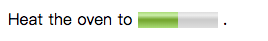

###### &lt;output>

\<output> 元素表示对应表单计算的结果。

支持属性：

* for：其它影响计算结果标签的 ID，可以多个
* form：当前标签从属的 form，该属性的值必须是当前文档内的表单元素的 ID。如果未指明该属性，output 标签必须是一个 form 的后代标签。该属性的用处在于可以让 output 标签脱离 form 标签，存在于一个网页文档的任意位置。
* name：name 属性

```
<form oninput="result.value=parseInt(a.value)+parseInt(b.value)">
    <input type="range" name="b" value="50" /> +
    <input type="number" name="a" value="10" /> =
    <output name="result"></output>
</form>
```

###### &lt;progress>

\<progress> 元素用来显示任务完成进度，规范未规定该元素具体如何显示，由浏览器自己决定，通常会显示为一个进度条形式

支持属性：

* max：任务总工作量
* value：已完成的工作量

```
<progress value="70" max="100">70 %</progress>
```

###### &lt;time>

\<time> 元素表示机器可读的日期或者 24 小时制时间，表示日期时可以包含时区和时间

使用说明：

* 用于机器可读时间的标识，如果是机器不可读时间，比如不正常日期，请勿使用该标签

支持属性：

* datetime：time 元素上机器可读的时间， 如果此值不能被解析为日期，元素不会有一个关联的时间戳
* pubdate：该属性仍在被 WHATWG 和 W3C组织设计和讨论中

```
<p>The concert starts at <time>20:00</time>.</p>
<p>The concert took place on <time datetime="2001-05-15 19:00">May 15</time>.</p>
```

##### MathML

MathML 是数学标记语言，基于 XML 标准，用来在互联网上书写数学符号和公式的置标语言。具体支持的元素和属性请参考 [MDN](https://developer.mozilla.org/zh-CN/docs/Web/MathML) 。

```
<math xmlns="http://www.w3.org/1998/Math/MathML">
    <mrow>
        <msup>
            <mi>a</mi>
            <mn>2</mn>
        </msup>
        <mo>+</mo>

        <msup>
            <mi>b</mi>
            <mn>2</mn>
        </msup>
        <mo>=</mo>

        <msup>
            <mi>c</mi>
            <mn>2</mn>
        </msup>
    </mrow>
</math>
```

上面的 HTML 片段在 Safari/Firefox 中的显示效果（Chrome 70还不支持）：

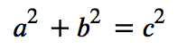

#### 改进元素

HTML5 主要对表单和 iframe 进行了改进。

##### 表单

 HTML5 中对 web 表单的改进：

* 新的元素
* 新的属性
* 新的属性值
* 强制校验API

###### 新的元素

* \<output>，具体参见《HTML5 - 语义 - 新增元素 - 其它元素 - \<output>》

* \<datalist>，定义 input 可能的值，与 input 元素配合使用，默认不会显示，当 input 获得焦点时显示

  ```
  <form action="demo_form.asp">
      Webpage: <input type="url" list="url_list" name="link"/>
      <datalist id="url_list">
          <option label="W3Schools" value="http://www.w3schools.com"/>
          <option label="Google" value="http://www.google.com"/>
          <option label="Microsoft" value="http://www.microsoft.com"/>
      </datalist>
      <input type="submit"/>
  </form>
  ```

  上面的 HTML 片段实现的效果如图（Chrome 70）：

  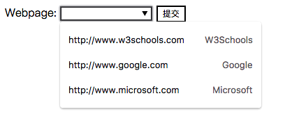

###### 新的属性

* \<form> 

  * 新增属性：
    * autocomplete：on(默认)|off， 是否启用自动完成功能，开启时浏览器基于之前键入的值，显示出在字段中之前填写过的选项。**注意：** autocomplete 属性适用于 \<form>，以及 type 为 text、search、url、telephone、email、password、datepickers、range 以及 color 时的 \<input>
    * novalidate：当提交表单时不对其进行验证
  * 已有属性：
    * name：表单名称，提供一种脚本引用表单的方法
    * method：get|post，发送表单数据的方式
    * action：接受表单数据的 URL 地址
    * target：action 属性指定页面打开的方式：\_self（默认，当前框架打开）、\_blank（新窗口打开）、 \_parent（父框架打开）、\_top（顶级窗口打开）、framename（指定框架打开）
    * accept-charset：指示服务器用哪种字符集处理表单数据，常用值：UTF-8（Unicode 字符编码）、ISO-8859-1（拉丁字母表的字符编码）、gb2312（简体中文字符编码）
    * enctype：发送到服务器之前对表单数据进行何种编码，支持编码格式参见《表单相关 - 数据编码》

* \<input>

  * 新增属性：

    * autocomplete：on(默认)|off， 是否启用自动完成功能

    * autofocus：是否自动获得焦点

    * form：当前控件所属的一个或多个表单，当 \<input> 位于表单外时使用

    * formaction：覆盖 form 元素的 action 属性，type="submit" 或 type="image" 时使用

    * formenctype：覆盖 form 元素的 enctype 属性，type="submit" 或 type="image" 时使用

    * formmethod：覆盖 form 元素的 method 属性，type="submit" 或 type="image" 时使用

    * formtarget：覆盖 form 元素的 target 属性，type="submit" 或 type="image" 时使用

    * formnovalidate：覆盖 form 元素的 novalidate 属性，提交表单时不会执行验证过程，该属性适用于 \<form> 和以下 \<input> 类型：

      ```
      text|search|url|telephone|email|password|date pickers|range|color
      ```

    * width：px|%，字段宽度，type="image" 时使用

    * height：px|%，字段高度，type="image" 时使用

    * list：指定与当前 input 配合的 \<datalist> 元素的 id 值

    * max：numbe|date，允许最大值，适用于以下 \<input> 类型：

      ```
      number|range|date|datetime|datetime-local|month|time|week
      ```

    * min：numbe|date，允许最小值，使用类型同 max 相同

    * multiple：输入字段可选择多个值，`type="email"` 或 `type="file"` 时使用

    * pattern： 用于验证输入字段的正则，适用于以下 \<input> 类型：

      ```
      text|search|url|telephone|email|password
      ```

    * placeholder：提示信息，适用于以下 \<input> 类型：

      ```
      text|search|url|telephone|email|password
      ```

    * required：提交之前必须填写字段，适用于以下 \<input> 类型：

      ```
      text|search|url|telephone|email|password|number|checkbox|radio|file|date pickers
      ```

    * step：数字间隔，与 max 以及 min 属性配合，适用于以下 \<input> 类型：

      ```
      number|range|date pickers
      ```

  * 已有属性：

    * alt：` type="image"` 时配合，同 \ 类似，指定图片替代文本
    * name： input 元素名称，对提交表单数据进行标识，或通过 JS 引用表单数据。**注意：**只有设置了 name 属性的表单元素才能在提交表单时传递它们的值
    * checked：是否默认选中，`type="checkbox"` 或 `type="radio"` 时使用
    * disabled：禁用当前元素
    * maxlength：字段最大长度，以字符个数计，`type="text"` 或 `type="password"` 时使用
    * readonly：input 为只读，`type="text"` 或 `type="password"` 时使用
    * src：提交按钮图像 URL，必须与 `type="image"` 配合
    * type：input 元素类型
    * value：input 元素的值

* \<select>

  * 新增属性：
    * autofocus：是否自动获得焦点
    * form：当前控件所属的一个或多个表单，当 \<select> 位于表单外时使用
    * required：提交之前必须填写字段
  * 已有属性：
    * name：select 元素名称，对提交表单数据进行标识，或通过 JS 引用表单数据。**注意：**只有设置了 name 属性的表单元素才能在提交表单时传递它们的值
    * disabled：禁用当前元素
    * multiple：可同时选择多个选项
    * size：下拉列表可见选项的数目

* \<textarea>

  * 新增属性：
    * autofocus：是否自动获得焦点
    * form：当前控件所属的一个或多个表单，当 \<textarea> 位于表单外时使用
    * maxlength：文本区域最大长度（以字符计）
    * placeholder：提示信息
    * required：提交之前必须填写字段
    * wrap：hard|soft，在表单中提交时，textarea 中的文本如何换行
  * 已有属性：
    * cols：可见宽度
    * rows：可见高度
    * disabled：禁用当前元素
    * name：textarea 元素名称，对提交表单数据进行标识，或通过 JS 引用表单数据。**注意：**只有设置了 name 属性的表单元素才能在提交表单时传递它们的值
    * readonly：文本区只读

###### 新的属性值

已有属性定义新的属性值的表单元素主要是 \<input> 元素的 type 属性，其新增属性：

* [color](http://www.w3school.com.cn/jsref/dom_obj_color.asp)：用于颜色域，显示为颜色块，可通过拾色器选取颜色
* date pickers：选取日期和时间，可供选择的输入类型：
  * [date](http://www.w3school.com.cn/jsref/dom_obj_date.asp) - 选取年、月、日
  * [month](http://www.w3school.com.cn/jsref/dom_obj_month.asp) - 选取年、月
  * [week](http://www.w3school.com.cn/jsref/dom_obj_week.asp) - 选取年、周
  * [time](http://www.w3school.com.cn/jsref/dom_obj_input_time.asp) - 选取时间（小时和分钟）
  * [datetime](http://www.w3school.com.cn/jsref/dom_obj_datetime.asp) - 选取年、月、日、时间（UTC 时间）
  * [datetime-local](http://www.w3school.com.cn/jsref/dom_obj_datetime-local.asp) - 选取年、月、日、时间（本地时间）
* [email](http://www.w3school.com.cn/jsref/dom_obj_email.asp)：e-mail 地址的输入域，提交表单时会自动验证值
* [number](http://www.w3school.com.cn/jsref/dom_obj_number.asp)：数值的输入域，可以配合 min|max|step|value 属性设置
* [range](http://www.w3school.com.cn/jsref/dom_obj_range.asp)：包含一定范围内数字的滑动条，可以配合 min|max|step|value 属性设置
* [search](http://www.w3school.com.cn/jsref/dom_obj_search.asp)：用于搜索域，显示为常规的文本域，比如站点搜索或 Google 搜索
* tel：电话号码文本字段
* [url](http://www.w3school.com.cn/jsref/dom_obj_url.asp)：url 地址的输入域，提交表单时会自动验证值

已有属性：

* [button](http://www.w3school.com.cn/jsref/dom_obj_button.asp)：没有默认行为的按钮
* [checkbox](http://www.w3school.com.cn/jsref/dom_obj_checkbox.asp)：复选框
* [file](http://www.w3school.com.cn/jsref/dom_obj_fileupload.asp)：文件输入域
* [hidden](http://www.w3school.com.cn/jsref/dom_obj_hidden.asp)：隐藏域
* [image](http://www.w3school.com.cn/jsref/dom_obj_input_image.asp)：图片式 submit 域
* [password](http://www.w3school.com.cn/jsref/dom_obj_password.asp)：密码域
* [radio](http://www.w3school.com.cn/jsref/dom_obj_radio.asp)：单选框
* [reset](http://www.w3school.com.cn/jsref/dom_obj_reset.asp)：重置按钮，点击时所在表单内的所有输入元素均会被重置为默认值（value或defaultValue指定）
* [submit](http://www.w3school.com.cn/jsref/dom_obj_submit.asp)：提交按钮
* [text](http://www.w3school.com.cn/jsref/dom_obj_text.asp)：文本输入域

###### 强制校验

表单校验的方式：

* 客户端校验，相较于服务端校验，用户体验更好，因为能实时的反馈用户的输入校验结果
  * HTML5 内置校验，不需 JS ，性能更好，但是不能自定义校验过程
  * JavaScript 校验，可以完全自定义的实现方式
* 服务端校验，发生在浏览器提交数据并被服务端程序接收之后，数据库写入之前，如果未通过校验，可以返回错误给客户端以提示用户；相较于客户端校验，延时较长，体验较差，但这是保证数据正确性必不可以的最后一次校验。 

表单校验的过程：

```
HTML5 内置校验 -> JavaScript 校验 -> 服务端校验
```

其中，HTML5 内置校验主要是由表单输入域的属性控制的校验，这种校验是**强制性的**，由浏览器自行实现，发生在 JS 校验之前：

* 当一个元素通过校验时：
  * 该元素将可以通过 CSS 伪类 :valid 进行特殊的样式化
  * 如果用户尝试提交表单，且所有输入域通过HTML5 内置校验时，则自动进入 JS 校验阶段

* 如果一个元素未通过校验：
  * 该元素将可以通过 CSS 伪类 :invalid 进行特殊的样式化
  * 如果用户尝试提交表单，浏览器会提示错误消息，并停止之后的 JS 校验，当然数据也不会被提交

HTML5 内置校验主要是通过表单输入域的以下属性实现的：

* required：必需输入属性，为空时浏览器给予提示并停止后续进程
* type：输入值必须匹配相应 type，例如 email，当输入不匹配时浏览器给予提示并停止后续进程
* pattern：正则匹配属性，当输入值不匹配时浏览器给予提示并停止后续进程，常和 type 搭配使用
* min/max： `type="number"` 时，min/max 属性可以强制验证长度
* minlength/maxlength：所有文本框 (\<input> 或 \<textarea>) 可以强制使用 minlength/maxlength 属性，当输入值不匹配时浏览器给予提示并停止后续进程

需要注意的是：

* 没有 required 属性，且输入为空时，其它强制验证设置不起作用
* \<textarea> 元素不支持 pattern 属性
* 校验不通过时，错误提示信息、样式以及方式均是浏览器实现的，可以通过 [HTML5 校验约束API](https://developer.mozilla.org/zh-CN/docs/Learn/HTML/Forms/Data_form_validation) 设置提示信息，不过，如果想要自定义提示样式和用户提示体验，又或者要实现良好的跨平台的兼容性，就需要自己实现具体的验证了，可参见 [MDN](https://developer.mozilla.org/zh-CN/docs/Learn/HTML/Forms/Data_form_validation)。

##### iframe

> HTML内联框架元素 \<iframe> 表示嵌套的浏览上下文，每个浏览上下文都有自己的会话历史记录和活动文档。包含嵌入内容的浏览上下文称为父浏览上下文。顶级浏览上下文（没有父级）通常是浏览器窗口。

HTML5 使用 sandbox， seamless， 和 srcdoc 属性，可以精确控制 \<iframe> 的安全级别及期望的渲染。

######新的属性 

* sandbox

  如果指定了空字符串，该属性对呈现在 iframe 框架中的内容启用一些额外的限制条件。属性值可以是用空格分隔的一系列指定的字符串。有效的值有：

  * allow-forms：允许提交表单。如果该关键字未使用，该操作将不可用
  * allow-modals：允许打开模态窗口
  * allow-orientation-lock：允许禁用屏幕朝向锁定
  * allow-pointer-lock：允许使用 Pointer Lock API
  * allow-popups：允许弹窗 (类似window.open, target="_blank", showModalDialog)。如果没有该属性，相应功能将静默失效
  * allow-popups-to-escape-sandbox： 允许沙箱文档打开新窗口，并且不强制要求新窗口设置沙箱标记。例如，这将允许一个第三方的沙箱环境运行广告开启一个登陆页面，新页面不强制受到沙箱相关限制。
    allow-presentation：允许嵌入者控制是否iframe启用一个展示会话
  * allow-same-origin：允许将内容作为普通来源对待。如果未使用该关键字，嵌入的内容将被视为一个独立的源
  * allow-scripts：允许嵌入的浏览上下文运行脚本（但不能window创建弹窗）。如果该关键字未使用，这项操作不可用
  * allow-top-navigation：嵌入的页面的上下文可以导航（加载）内容到顶级的浏览上下文环境（browsing context）。如果未使用该关键字，这个操作将不可用

  需要注意的是：

  * 当被嵌入的文档与主页面同源时，强烈建议不要同时使用 allow-scripts 和 allow-same-origin ，否则的话将允许嵌入的文档通过代码删除 sandbox 属性。虽然你可以这么做，但是这样的话其安全性还不如不用sandbox
  * 如果攻击者可以将潜在的恶意内容往用户的已沙箱化的iframe中显示，那么沙箱操作的安全性将不再可靠。推荐把这种内容放置到独立的专用域中，减小可能的损失
  * 沙箱属性(sandbox)在Internet Explorer 9及更早的版本上不被支持

* seamless

  该布尔属性指示浏览器将iframe渲染成容器页面文档的一部分。例如，通过打被包含的文档的链接，在iframe页面的样式被渲染之前，父页面的CSS样式就可以应用在iframe中（除非被其他设置阻止）

* srcdoc

  该属性值可以是HTML代码，这些代码会被渲染到iframe中，如果同时指定了src属性，srcdoc会覆盖src所指向的页面。该属性最好能与sandbox和seamless属性一起使用

###### 已有属性

部分在 HTML5 环境中依然有作用：

* name：名称，可用作 \<a> 和 \<form> 的 target 属性值，或 \<input> 和 \<button> 的 formtarget 属性值
* width：以像素或百分比指定 iframe 的宽度
* height：以像素或百分比指定 iframe 的高度
* src：嵌套页面的 URL 地址

部分只在 HTML4 环境中起作用：

* frameborder：值为1时（默认值），在当前 iframe 与其它 iframe 之间绘制边框，为0时无需绘制
* marginwidth：框架内容到框架的左右边距
* marginheight：框架内容到框架的上下边距
* scrolling：何时显示滚动条
  * auto：当需要时
  * yes：总是显示
  * no：总是不显示

### 通信

HTML5 完善了完整的端到端的通信解决方案：

* 单向通信
  * 客户端 -> 服务端：HTTP、Ajax
  * 服务端 -> 客户端：Server-send events
* 双向通信
  * 客户端  ⇆ 客户端：WebRTC
  * 客户端  ⇆ 服务端：WebSocket

其中，HTML5 新增通信解决方案：

* WebSocket
* Server-sent events
* WebRTC

####WebSocket 

WebSocket 和 HTTP  都是基于 TCP/IP 的应用层协议，WebSocket 的出现弥补了 HTTP 协议单向通信的不足。

HTTP 1.0 协议中，一个 HTTP 请求默认发起一个 TCP 连接；HTTP 1.1 协议中，多个 HTTP 请求可以通过长连接共用一个 TCP 连接。但是，一个 HTTP 请求总是对应一个响应，而且，HTTP 请求必须由客户端发起。HTTP 协议的这种机制使得必须通过轮询的方式才能获取被动响应的服务端发生的改变，典型的应用场景是聊天室，但轮询的效率较低，且比较浪费资源（因为必须不停连接，或者 HTTP 连接始终打开）。


##### 特点

WebSocket 的主要特点：

* 建立在 TCP 连接之上双向通讯协议，允许服务端主动向客户端推送数据

* 与 HTTP 协议有着良好的兼容性：默认端口也是 80(ws)/443(wss)，握手阶段采用 HTTP 协议，因此握手不容易被屏蔽，能通过各种 HTTP 代理服务器

* 数据格式比较轻量，性能开销小，通信高效

* 可以发送文本，也可以发送二进制数据

* 没有同源限制，客户端可以与任意服务器通信

* 协议标识符是 ws，加密协议为 wss（建立在 TLS 之上的 Websocket），服务器网址就是 URL

  ```
  ws://example.com:80/path
  ```

##### 建连

WebSocket 的连接过程：

* 通过一次 HTTP 握手完成协议升级
* 客户端/服务端建立 ws 连接
* 客户端/服务端中的某一方主动关闭连接

当 HTTP 握手时，典型的客户端请求报文：

```
GET / HTTP/1.1
Connection: Upgrade
Upgrade: websocket
Host: example.com
Origin: http://example.com:63342
Sec-WebSocket-Extensions: permessage-deflate; client_max_window_bits
Sec-WebSocket-Key: uaFkLesi99W2cNIB0MpNEg==
Sec-WebSocket-Version: 13
```

其中：

* Connection，值必须为 Upgrade，表示客户端希望协议升级
* Upgrade，值必须为 Websocket，表示客户端希望升级到 Websocket 协议
* Sec-WebSocket-Extensions，客户端希望的协议扩展，多个值用分号分割
* Sec-WebSocket-Key，随机生成的 Base64 编码字符串，用于验证服务器连接的正确性，尽量避免普通 HTTP 请求被误认为 Websocket 协议；服务端得到该字符串后会依次进行如下操作：
  1. 将字符串与 “258EAFA5-E914-47DA-95CA-C5AB0DC85B11” 拼接
  2. 对拼接结果字符串进行 SHA-1 安全散列算法计算
  3. 对计算结果再进行 Base64 编码
  4. 将结果作为 Sec-WebSocket-Accept 响应头的值返回给客户端
* Sec-WebSocket-Version，表示支持的 Websocket 版本。RFC6455 要求使用的版本是 13，之前草案的版本均应当弃用
* Origin，可选的，表示发起连接页面源，对于无同源限制的 ws 连接，服务端可以通过 Origin 字段判断是否允许客户端建立连接
* 其他一些定义在 HTTP 协议中的字段，如 Cookie 等，也可以在 Websocket 中使用

典型的服务端响应报文：

```
HTTP/1.1 101 Switching Protocols
Connection: Upgrade
Upgrade: websocket
Sec-WebSocket-Accept: fFBooB7FAkLlXgRSz0BT3v4hq5s=
Sec-WebSocket-Extensions: permessage-deflate
```

其中：

* **101，状态码，表示协议切换**
* Connection，值为 Upgrade，服务端支持请求的 ws 协议版本时返回
* Upgrade，值为 Websocket，服务端支持请求的 ws 协议版本时返回
* Sec-WebSocket-Accept，请求中 Sec-WebSocket-Key 值计算得到摘要的 Base64 编码值
* Sec-WebSocket-Extensions，服务端支持的请求扩展

随后，通讯协议由 HTTP 升级为 WebSocket，客户端和服务端均可以主动向对方推送数据，直到某一方主动关闭连接。

##### 实现

###### 客户端

客户端通过全局上下文的 WebSocket 对象发起 ws 请求：

```
let Socket = new WebSocket(url, [protocol] );
```

其中：

* url，指定 ws 连接的 URL
* protocol，可选的，指定可接受的子协议

常用 WebSocket 对象属性：

| 属性       | 描述                                                         |
| ---------- | ------------------------------------------------------------ |
| readyState | 只读属性 readyState 表示连接状态，可以是以下值：0（连接尚未建立）、1（连接已建立，可以进行通信）、2（连接正在进行关闭）、3（连接已经关闭或者连接不能打开） |

常用的 WebSocket 对象事件：

| 事件    | 事件处理程序     | 描述                   |
| ------- | ---------------- | ---------------------- |
| open    | Socket.onopen    | 连接建立时触发         |
| message | Socket.onmessage | 接收到服务端数据时触发 |
| error   | Socket.onerror   | 通信发生错误时触发     |
| close   | Socket.onclose   | 连接关闭时触发         |

常用的 WebSocket 对象方法：

| 方法    | 描述                                                      |
| ------- | --------------------------------------------------------- |
| send()  | 使用连接发送数据，数据格式可以是String、ArrayBuffer和Blob |
| close() | 关闭连接                                                  |

示例：

```
if ("WebSocket" in window) {
    alert("您的浏览器支持 WebSocket!");

    // 打开一个 WebSocket 连接
    let ws = new WebSocket("ws://localhost:9998/echo");

    // 连接建立时，发送数据
    ws.addEventListener('open', function (event) {
        ws.send('Hello Server!');
    });

    // 接收数据时，处理数据
    ws.addEventListener("message", function (event) {
        var data = event.data;

        if (typeof data === String) {
            console.log("Received data string");
        }

        if (data instanceof ArrayBuffer) {
            console.log("Received arraybuffer");
        }
    });

    // 发生错误时，处理错误
    ws.addEventListener("error", function (event) {
        // handle error event
    });

    // 关闭连接
    ws.addEventListener("close", function (event) {
        var code = event.code;
        var reason = event.reason;
        var wasClean = event.wasClean;

        // handle close event
    });
} else {
    alert("您的浏览器不支持 WebSocket!");
}
```

###### 服务端

WebSocket 服务器的实现，可以查看维基百科的[列表](https://en.wikipedia.org/wiki/Comparison_of_WebSocket_implementations)。

常用的 Node 实现有以下三种。

- [µWebSockets](https://github.com/uWebSockets/uWebSockets)
- [Socket.IO](http://socket.io/)
- [WebSocket-Node](https://github.com/theturtle32/WebSocket-Node)

##### 应用

###### 文件上传

WebSocket 的 send 方法可用于发送 String、ArrayBuffer 和 Blob 格式的数据，所以发送二进制文件完全不在话下。

客户端实现：

```
// html
<input type="file" id="file"/>

// js
const ws = new WebSocket('ws://127.0.0.1:10103/');      // 连接服务器
const fileSelect = document.getElementById('file');
const size = 1024 * 128;                                // 分段发送的文件大小(字节)
let curSize, total, file, fileReader;

fileSelect.onchange = function () {
    file = this.files[0];                               // 待上传文件
    curSize = 0;                                        // 当前已发送的文件大小
    total = file.size;                                  // 文件大小
    ws.send(file.name);                                 // 先发送待上传文件的名称
    fileReader = new FileReader();                      // 准备读取文件
    fileReader.onload = loadAndSend;
    readFragment();                                     // 读取文件片段
};

function loadAndSend() {
    if (ws.bufferedAmount > size * 5) {                 // 若发送队列中的数据太多,先等一等
        return setTimeout(loadAndSend, 4);
    }

    ws.send(fileReader.result);                         // 发送本次读取的片段内容
    curSize += size;                                    // 更新已发送文件大小
    curSize < total ?
        readFragment() :
        console.log('upload successed!');               // 下一步操作
}

function readFragment() {
    const blob = file.slice(curSize, curSize + size);   // 获取文件指定片段
    fileReader.readAsArrayBuffer(blob);                 // 读取文件为ArrayBuffer对象
}
```

服务端实现（以 Node.js 为例）：

```
let WebSocketServer = require('ws').Server,
    server = new WebSocketServer({port: 10103}),    // 启动服务器
    fs = require('fs');

server.on('connection', function (wsServer) {
	// 变量定义不可放在全局,因每个连接都不一样,这里才是私有作用域
    let fileName, i = 0;

    // 监听客户端消息
    server.on('message', function (data, flags) {
        // 判断是否二进制数据
        if (flags.binary) {
            let method = i++ ? 'appendFileSync' : 'writeFileSync';

            // 当前目录下写入或者追加写入文件(建议加上try语句捕获可能的错误)
            fs[method]('./' + fileName, data, 'utf-8');

            // 非二进制数据则认为是文件名称
        } else {
            fileName = data;
        }
    });

    wsServer.send('server ready!');// 告知客户端服务器已就绪
});
```

###### browser-sync

browser-sync 组件主要完成两件事：

1. 本地文件改变时，服务器实时推送更新信息至客户端，信息流向：服务端 -> 客户端
2. 用户操作网页，滚动、输入或点击等，操作信息实时发送给服务器，然后再由服务器将操作同步给其他已打开的网页。信息流向：浏览器 -> 服务器 -> 浏览器

所以，browser-sync 需要典型的双向通信机制 WebSocket 。

##### 参考

* http://www.runoob.com/html/html5-websocket.html
* http://www.ruanyifeng.com/blog/2017/05/websocket.html
* https://developer.mozilla.org/zh-CN/docs/Web/API/WebSockets_API
* https://www.cnblogs.com/chyingp/p/websocket-deep-in.html
* https://blog.csdn.net/chenqiuge1984/article/details/80129106

#### Server-sent events

Server-sent events，简称 SSE，是一种服务器端通过 HTTP 连接主动推送信息给客户端的技术。

##### 特点

SSE 的主要特点：

* 受同源策略的安全限制
* 与普通 HTTP 请求以及 WebSocket 技术的不同是：
  * WebSocket 实现客户端和服务端的双向通信，技术上更加复杂
  * 普通的 HTTP 请求实现客户端到服务端的单向通信
  * SSE 实现服务端到客户端的单向通信，基于 HTTP 长连接实现，支持代理服务器与认证技术，实现比较简单。如果需要双向通信，或者从服务端发送大量二进制数据到客户端，WebSocket是更好的选择

##### 事件流

在 SSE 中，服务器每次推送给客户端的是一个简单的 “text/event-stream” 格式的文本数据流，这个数据流也称为事件流。

每个事件流包含一条或多条信息，每条消息后面必须有一个空行作为分隔符；其中，以冒号开头的行为注释行，会被忽略（注释行可以用来防止连接超时，服务器可以定期发送一条消息注释行，以保持长连接不被中断）。

每条消息又由多个字段组成的，每个字段的格式是：

```
name: value		// name 为字段名，value 为字段值
```

其中，可取的字段有：

* event，事件类型，会在客户端的 EventSource 对象上触发一个名称为该字段值的事件；如果不指定 event 字段，则触发默认的 message 事件
* data，数据字段，如果一条消息包含多个 data 字段，则客户端会用换行符把它们连接成一个字符串来作为字段值
* id，事件ID，会成为 EventSource 对象的内部属性"最后一个事件ID"的属性值
* retry，当前http连接失败后，重新连接的时间(单位为毫秒)，如果该字段值不是整数，会被忽略

######命令事件

指定  event 字段，例如：

```
event: userconnect
data: {"username": "bobby", "time": "02:33:48"}

event: usermessage
data: {"username": "bobby", "time": "02:34:11", "text": "Hi everyone."}

event: userdisconnect
data: {"username": "bobby", "time": "02:34:23"}

event: usermessage
data: {"username": "sean", "time": "02:34:36", "text": "Bye, bobby."}
```

该事件流发送4条命令事件消息，每条消息的 data 字段采用 JSON 数据格式

###### 未命名事件

不指定 event 字段，例如：

```
: this is a test stream

data: some text

data: another message
data: with two lines
```

该事件流发送3条未命名事件消息：

* 第一条仅仅是个注释，因为它以冒号开头，会被客户端忽略
* 第二条消息只包含了一个 data 字段，值为"some text"
* 第三条消息包含的两个 data 字段会被解析成为一个字段，值为"another message\nwith two lines"

###### 混合事件

在同一个事件流中可以混合使用命名事件和未命名事件，例如：

```
event: userconnect
data: {"username": "bobby", "time": "02:33:48"}

data: Here's a system message of some kind that will get used
data: to accomplish some task.

event: usermessage
data: {"username": "bobby", "time": "02:34:11", "text": "Hi everyone."}
```

##### 实现

###### 客户端

在客户端，通过 EventSource 接口接收服务器发送的事件，它通过HTTP连接到一个服务器，以 text/event-stream 格式接收事件，不关闭连接：

```
let ES = new EventSource(url, configuration);
```

其中：

* url：远程资源的位置
* configuration：可选连接选项对象，对象属性可以是：
  * withCredentials - 默认为 false，指示 CORS 是否应包含凭据( credentials )。

常用 EventSource 对象属性：

| 属性       | 描述                                                         |
| ---------- | ------------------------------------------------------------ |
| readyState | 只读属性，连接状态，可以是以下值：CONNECTING（0，连接中）、OPEN（1，连接已建立，可以进行通信）、CLOSED（2，连接关闭） |
| url        | 只读属性，远程资源的位置                                     |

常用 EventSource 对象事件：

| 事件    | 事件处理程序 | 描述                   |
| ------- | ------------ | ---------------------- |
| open    | ES.onopen    | 连接建立时触发         |
| message | ES.onmessage | 接收到服务端数据时触发 |
| error   | ES.onerror   | 通信发生错误时触发     |
| close   | ES.onclose   | 连接关闭时触发         |

常用 EventSource 对象方法：

| 方法    | 描述     |
| ------- | -------- |
| close() | 关闭连接 |

**需要注意的是：**IE 原生不支持 SSE，但可以通过 EventSource.js 来实现兼容。

示例：

```
// HTML
<div id="sse"></div>

// JavaScript
let es = new EventSource("http://127.0.0.1:1234");
let $e = document.getElementById("sse");

es.addEventListener("message", function (e) {
    $e.innerHTML += e.data + "<br/>";
}, false);
```

###### 服务端

SSE 基于普通的 HTTP 请求，服务器端只需返回 text/event-stream 格式事件流即可，以 Node.js 为例：

```
let http = require('http');

http.createServer(function (request, response) {
    response.writeHead(200, {
        'Content-Type': 'text/event-stream',	// MIME类型
        'Access-Control-Allow-Origin': '*',		// 防止跨域
        'Cache-Control': 'no-cache',			// 防止缓存
		'Connection': 'keep-alive'
    });

    setInterval(function () {
        let content = 'data:' + new Date().toUTCString() + '\n\n';

        response.write(content);
    }, 1000);
}).listen(1234);
```

##### 应用

###### webpack-hot-middleware

Webpack 本地开发时的热更新组件，当本地代码改变时需要告知客户端，典型的服务端至客户端的单向通信。

##### 参考

* https://developer.mozilla.org/zh-CN/docs/Server-sent_events/Using_server-sent_events
* https://blog.csdn.net/chenqiuge1984/article/details/80129106

#### WebRTC

WebRTC，Web Real Time Communication，Web 实时通信，是一种在浏览器客户端之间直接进行语音/视频交流和数据分享的技术；同时，作为一项标准，使得浏览器无需安装插件或第三方软件，就可以点对点地分享应用数据和进行电话会议。

##### 技术特点

WebRTC 技术的优点：

* 作为技术标准，具有跨平台、跨终端的技术一致性
* 免安装，不需要安装任何插件或第三方软件，方便接入

WebRTC 技术的缺点：

* 可用性依然不高，由于防火墙以及 NAT 技术的限制，即便拥有多种穿透技术，但成功率并不是很高
* 采用纯点对点方案解决多方会话时，依然存在带宽限制，以及视频质量降低等问题，依然需要借助服务端方案来解决这些问题，这一定程度上又导致了技术实现复杂

##### 拓扑结构

WebRTC 的网络拓扑结构随着其使用场景的不同而不同。

###### 点对点

一个浏览器与另外一个浏览器或终端之间的会话称为点对点会话。点对点会话场景下的拓扑结构：

* 三角形

  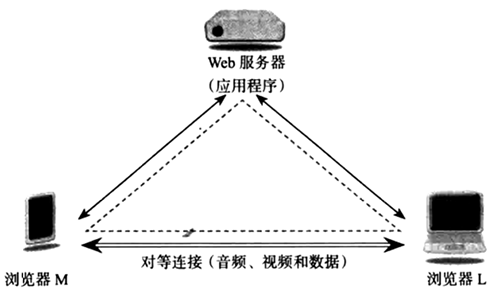

  两个浏览器运行来自同一个 Web 服务器上的同一个 WebRTC Web 应用程序。

* 梯形

  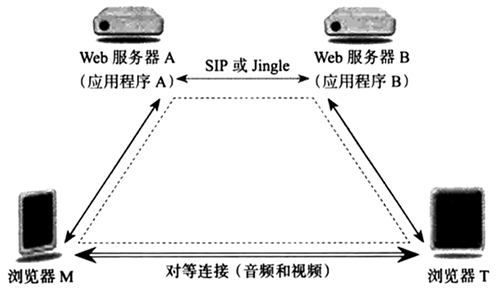

  两个浏览器运行的 WebRTC Web 应用程序来自不同的 Web 服务器，两台 Web 服务器之间采用信令协议进行通信，例如这里的 SIP、Jingle。

  在梯形这种相对复杂的情况下，媒体数据不一定在两个浏览器之间直接传输，可以通过媒体中继或其他元素进行传输。

###### 多方会话

多方会话是多个浏览器参与的会话。多方会话场景下的拓扑结构：

* 分布式

  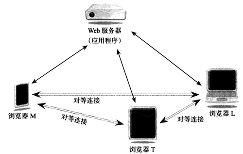

  每个浏览器与其他浏览器之间都建立起一对一的对等连接。当有新的浏览器加入时，需要建立新的对等连接来发送和接受媒体流。

  分布式多方会话无需建立媒体服务，架设简单。但是，浏览器需要分发相同的媒体数据给其他每一个浏览器，这导致带宽需求的上升，当加入浏览器较多时，传输质量会下降，所以不适合大型的多方会话。

* 集中式

  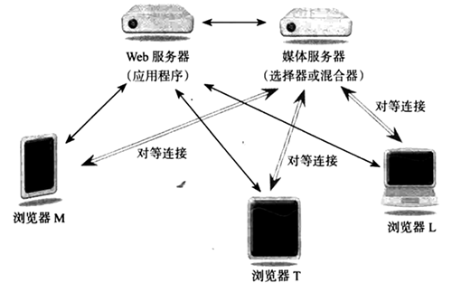

  每个浏览器只与媒体服务器之间建立起单个对等连接。集中式的模式下，需要构建专门的媒体服务进行中继，每个浏览器都将媒体数据发送给媒体服务器，然后由媒体服务器进行分发给其他浏览器。当有新的浏览器加入时，只需要建立起新浏览器与服务器之间的对等连接即可。

  集中式多方会话虽然结构较为复杂，但是可以扩展非常大的会话。

##### 工作机制

以点对点会话的三角形模式为例，其基本的工作机制如图。

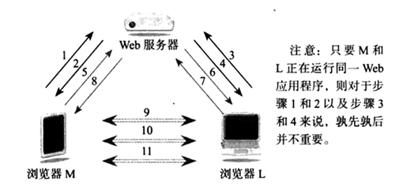

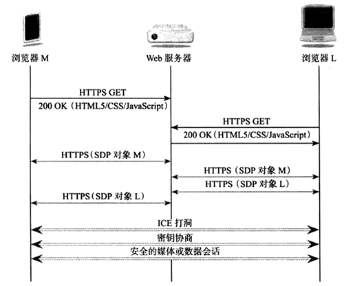

> 基于 NAT 技术的私有网络中，私有网络主机在访问公网 IP 时，NAT 路由通过新建端口建立起自己的「公网 IP : 端口」到「私有主机 IP : 端口」的映射，这个映射可以看做一个洞。由于不同类型的 NAT 技术对外部访问私有主机的限制不一，要访问私有网络主机浏览器，就需要解决 NAT 路由对私有主机访问的限制，基于 ICE 协议打通公网对私有主机访问的过程，称为 ICE 打洞。

流程描述：

1. 浏览器 M 向 Web 服务器请求 HMTL 页面
2.  Web 服务器向浏览器 M 发送带有 WebRTC JS 的网页
3. 浏览器 L 向 Web 服务器请求 HMTL 页面
4. Web 服务器向浏览器 L 发送带有 WebRTC JS 的网页
5. 浏览器 M 决定与 L 通信，并通过 JS 将会话描述对象 (offer，提议) 发送至 Web 服务器
6. Web 服务器将 M 的会话描述对象发送给 L 的  JS
7. 浏览器 L 的 JS 将自己的会话描述对象 (answer，应答) 发送给 Web 服务器
8. Web 服务器将 L 的会话描述对象发送给 M 的  JS
9. 浏览器 M 和 L 开始进行 ICE 打洞
10. 完成打洞后，浏览器 M 和 L 进行密钥协商以用于安全的媒体通信
11. 浏览器 M 和 L 进行音频、视频或数据的交换

在 WebRTC 基本的工作流程中，需要服务器提供的服务主要有三个：

* Web 服务

  提供基本的 Web 文件服务。

  以上流程中的 1~4 步属于 Web 服务。

* 信令服务

  当两个用户需要通信时，需要在双方的浏览器中进行媒体协商（会话双方就彼此支持的媒体类型及功能达成一致的过程），此过程称为提议/应答交换。提议/应答交换通过两个浏览器之间建立的信令通道进行，由服务端的信令服务总体控制。

  以上流程中的 5~8 步属于信令服务，当然后面的步骤中也会用到信令服务。

* ICE 服务

  由于防火墙或者基于 NAT 技术的私有网络的存在，在两个浏览器之间建立起直连是十分困难的，ICE 即为该困难所生。ICE 服务也需要服务端提供。

  以上流程中的第 9 步属于 ICE 服务。

###### 信令服务

信令就是协调通讯的过程，为了建立一个webRTC的通讯过程，客户端需要交换如下信息：

* 会话控制信息，用来开始和结束通话，即开始视频、结束视频这些操作指令
* 处理错误的消息
* 元数据，如各自的音视频解码方式、带宽
* 网络数据，对方的公网IP、端口、内网IP及端口

信令服务可以通过 HTTP 或 WebSocket 协议实现，可以由提供 HTML 的 Web 服务器提供，也可以由专门的信令服务器提供。

##### 建立会话

对于 WebRTC 技术开发者，建立 WebRTC 会话的主要步骤：

1. 获取本地媒体

   获取本地麦克风或摄像头的访问权限，捕获媒体，通过 getUserMedia API 实现。

2. 建立信令通道

3. 建立对等连接

   建立起两个浏览器之间的直接连接，通过 RTCPeerConnection API 实现。

4. 交换媒体或数据

5. 关闭会话

   通过 RTCPeerConnection API 的 close() 方法可以关闭会话。

##### 相关 API

WebRTC 组件是通过 JavaScript APIs 获得的。目前正在开发中的APIs包括：

- getUserMedia，获取摄像头和麦克风使用权限，并且捕获媒体，获取音频和视频流。示例代码：

  ```
  navigator.getUserMedia = navigator.getUserMedia
      || navigator.webkitGetUserMedia
      || navigator.mozGetUserMedia;
  
  let video = document.querySelector("video");
  let constraints = {audio: false, video: true};
  
  function successCallback(stream) {
      // Note: make the returned stream available to console for inspection
      window.stream = stream;
  
      if (window.URL) {
          video.srcObject = stream;   // Chrome浏览器
      } else {
          video.src = stream;         // Firefox和Opera: 可以直接把视频源设置为stream
      }
  
      video.play();
  }
  
  function errorCallback(error) {
      console.log("navigator.getUserMedia error: ", error);
  }
  
  navigator.getUserMedia(constraints, successCallback, errorCallback);
  ```

- RTCPeerConnection，负责管理点对点连接，用于构建点对点之间稳定、高效的流传输的组件

- RTCDataChannel，允许浏览器分享任意数据，用于浏览器之间建立高吞吐低延时的信道

##### 相关协议

###### NAT

NAT，Network Address Translation，网络地址转换协议，用来将私网设备映射到一个公网 IP 地址的协议。

通常，路由器 WAN 口有一个公网IP，连接路由器 LAN 口的设备会分配一个私有网段 IP 地址。此时，私网设备的 IP 被映射成路由器公网 IP + 唯一的端口。通过这种方式，每个私网设备无需被分配不同的公网 IP，却依然能与外网设备通信。

由于 NAT 技术存在对称型、全锥型、受限锥型、端口受限锥型四种类型，且每种类型 NAT 技术对私有设备通信的限制程度不同，所以要直接穿透目前普遍使用 NAT 技术实现的私有网络，以使两个 NAT 路由之后的客户主机实现直接通信，就变得比较困难。

一些路由器严格地限定了部分私网设备的对外连接。这种情况下，即使 STUN 服务器识别了该私网设备的公网IP和端口的映射，依然无法和这个私网设备建立连接。这种情况下就需要转向 TURN 协议。

###### ICE
ICE，Interactive Connectivity Establishment ，交互式连接建立，一种综合性的 NAT 穿越技术。

ICE 是 IETF 开发的一种 framework，可集成各种 NAT 穿透技术，如STUN、TURN、RSIP等，该 framework 可以让 SIP 的客户端利用各种 NAT 穿透方式打穿远程的防火墙。

###### STUN
STUN，Session Traversal Utilities for NAT，NAT会话穿越功能，是一个允许位于 NAT 后的客户端找出自己的公网地址，判断出路由器阻止直连的限制方法的协议。


客户端通过给公网的 STUN 服务器发送请求获得自己的公网地址信息，以及是否能够被（穿过路由器）访问。

###### TURN

TURN，Traversal Using Relays around NAT，NAT 中继穿越方式，通过 TURN 服务器中继所有数据的方式来绕过对称型 NAT。


需要在 TURN 服务器上创建一个连接，然后告诉所有对端设备发包到服务器上，TURN 服务器再把包转发给你。很显然这种方式是开销很大的，所以只有在没得选择的情况下采用。

###### SDP

SDP，Session Description Protocol，会话描述协议，是一个描述多媒体连接内容的协议，例如分辨率、格式、编码、加密算法等。

所以在数据传输时两端都能够理解彼此的数据。本质上，这些描述内容的元数据并不是媒体流本身。

##### 参考

* https://blog.csdn.net/leytton/article/details/76696372
* https://segmentfault.com/a/1190000011403597
* https://blog.csdn.net/tangxinmantou10503/article/details/85723562

### 离线 & 存储

离线 & 存储的主要内容包括三个方面：

* 离线状态和页面可见性的判断
  * 在线和离线 API，判断离线状态
  * 页面可见性 API，判断页面可见性

* 离线数据存储
  * Storage，少量字符串类型数据存储
  * Web SQL，大量数据客户端 SQL 数据库解决方案，标准已废弃
  * IndexedDB，大量数据客户端 noSQL 数据库解决方案
* 离线文件存储
  * Application Cache，应用缓存，标准已废弃
  * CacheStorage，主推标准

#### 在线和离线 API

判断客户端当前是否处于离线状态。

##### 属性

navigator.online 属性

* 所有浏览器皆支持 online 属性，并会随着离线与否实时更新该属性

##### 事件

online 和 offline 事件会在客户端离线状态改变时触发，需要注意的是：

* **只由 Firefox 支持 online 和 offline 事件，其他浏览器皆不支持，不建议使用**

* 在 Firefox 中，事件触发自 body 元素，并会冒泡至 document 直至 window

  ```
  window.addEventListener('load', function () {
      let status = document.getElementById("status");
  
      function updateOnlineStatus(event) {
          let condition = navigator.onLine ? "online" : "offline";
  
          status.className = condition;
          status.innerHTML = condition.toUpperCase();
      }
  
      window.addEventListener('online', updateOnlineStatus);
      window.addEventListener('offline', updateOnlineStatus);
  });
  ```

#### 页面可见性 API

目前浏览器普遍是 Tab 选项卡式，页面可见性 API 可以判断当前页面 Tab 是否显示？开发者可以在页面不可见时避免执行不必要的任务，以节省资源和提高性能。

页面可见性 API 的使用场景：

* Tab 显示时开发播放视频或音频，像 YouTube；隐藏时暂停播放
* 网站有图片轮播效果，Tab 隐藏时暂停播放，显示时继续播放

##### 属性

document.hidden 和 document.visibilityState 属性用于判断页面可见性，其中：

* document.hidden 页面是否隐藏，true(隐藏)/false(可见)
* document.visibilityState 返回字符串格式属性值，当属性值改变时，会同时递交 visibilitychange 事件给 document。可用属性值为：
  * 'visible'，页面内容至少部分可见，即页面在前景标签页中，且窗口没有最小化
  * 'hidden'，页面不可见，即文档处于背景标签页或窗口处于最小化状态，或操作系统正处于锁屏状态
  * 'prerender'，页面此时正在渲染中，内容还不可见，**此可用值浏览器可选择性支持**
  * 'unloaded'，页面从内存中卸载清除，**此可用值浏览器可选择性支持**

##### 事件

visibilitychange 事件会在浏览器标签页显示状态改变时触发。

```
document.addEventListener("visibilitychange", function () {
    console.log(document.visibilityState);
});
```

##### 示例

```
// 设置隐藏属性和改变可见属性的事件的名称
let hidden, visibilityChange;

if (typeof document.hidden !== "undefined") {
    hidden = "hidden";
    visibilityChange = "visibilitychange";
} else if (typeof document.msHidden !== "undefined") {
    hidden = "msHidden";
    visibilityChange = "msvisibilitychange";
} else if (typeof document.webkitHidden !== "undefined") {
    hidden = "webkitHidden";
    visibilityChange = "webkitvisibilitychange";
}

let videoElement = document.getElementById("videoElement");

// 如果页面是隐藏状态，则暂停视频
// 如果页面是展示状态，则播放视频
function handleVisibilityChange() {
    if (document[hidden]) {
        videoElement.pause();
    } else {
        videoElement.play();
    }
}

// 如果浏览器不支持 addEventListener 或 Page Visibility API 给出警告
if (typeof document.addEventListener === "undefined" ||
		typeof document[hidden] === "undefined") {
    console.log("当前浏览器不支持页面可见性 API");
} else {
    // 处理页面可见属性的改变
    document.addEventListener(visibilityChange, handleVisibilityChange, false);

    // 当视频暂停，设置title
    videoElement.addEventListener("pause", function () {
        document.title = 'Paused';
    }, false);

    // 当视频播放，设置title
    videoElement.addEventListener("play", function () {
        document.title = 'Playing';
    }, false);
}
```

##### 参考

* https://developer.mozilla.org/zh-CN/docs/Web/API/Page_Visibility_API

#### 会话和持久化存储

会话和持久化存储，又名 DOM 存储，即常用的 Storage，其中：

* sessionStorage 为会话存储 API
* localStorage 为持久化存储

##### 特点

Storage 存储的特点：

* 只能存储字符串类型的键/值对

* 有空间限制，超过最大限制就会读取报错。常用浏览器容量限制：

  | 浏览器         | 最大容量 |
  | -------------- | -------- |
  | IE（>=8）      | 5M       |
  | FF（>=8）      | 5.24M    |
  | Opera          | 2M       |
  | Chrome、Safari | 2.6M     |

##### API

基本 API：

* Storage.getItem(key)
* Storage.setItem(key, value)
* Storage.removeItem(key)
* Storage.clear()

#### Web SQL

具体使用参见《02-WEB性能》

#### IndexedDB

具体使用参见《02-WEB性能》

#### Application Cache

Application Cache，应用缓存，技术标准已废弃，了解即可。

具体使用参见《02-WEB性能》

#### CacheStorage

具体使用参见《02-WEB性能》

### 多媒体

多媒体的主要内容包括：

* 音频 audio
* 视频 video
* 字幕 track

#### audio

HTML5 规定了在网页上嵌入音频元素的标准，即使用 \<audio> 元素。

IE9+ 及所有的主流浏览器都支持 \<audio> 元素。

##### 音频

\<audio> 元素支持的音频格式：

* mp3，mime 类型为 "audio/mpeg"
* wav，mime 类型为 "audio/wav"
* ogg，mime 类型为 "audio/ogg"

三种音频格式的浏览器支持：

| 浏览器       | mp3  | wav  | ogg  |
| ------------ | ---- | ---- | ---- |
| IE9+         | ✔️    | ✘    | ✘    |
| Chrome 6+    | ✔️    | ✔️    | ✔️    |
| Firefox 3.6+ | ✔️    | ✔️    | ✔️    |
| Safari 5+    | ✔️    | ✔️    | ✘    |
| Opera 10+    | ✔️    | ✔️    | ✔️    |

##### 属性

> muted /'mjuːtɪd/ a. 柔和的, 无言的

\<audio> 元素支持的特有属性：

* src，音频 URL，也可以使用 \<source> 标签指定单个或多个音频资源
* loop，值为"loop"，音频循环结束
* autoplay，值为"autoplay"，音频就绪后自动播放，**不过，浏览器可能禁止自动播放**
* controls，值为"controls"，显示播放控件，例如播放按钮
* preload，值为"preload"，预加载音频，如果设置了 autoplay 则忽略该属性
* muted，值为"muted"，默认静音，用户可通过播放控件关闭静音

##### 事件

\<audio> 元素支持的常用事件：

* pause，播放暂停时触发
* play，音频由停止转变为播放状态瞬间触发
* ended，播放结束时触发
* error，发生错误时触发
* loadstart，资源开始加载时触发
* progress，资源下载过程中周期性触发

注：完整的媒体事件可参见 [MDN](https://developer.mozilla.org/zh-CN/docs/Web/Guide/Events/Media_events)

##### 示例

```
# HTML
<audio controls autoplay id="audio">
    <source src="./audio/00.mp3" type="audio/mpeg">
    <span>你的浏览器不支持音频播放</span>
</audio>

# JS
let audio = document.getElementById('audio');

audio.addEventListener('play', function () {
    console.log('Play');
});

audio.addEventListener('pause', function () {
    console.log('Pause');
});
```

#### video

HTML5 规定了在网页上嵌入视频元素的标准，即使用 \<video> 元素。

IE9+ 及所有的主流浏览器都支持 \<video> 元素。

##### 属性

\<video> 元素支持的特有属性：

- src，视频 URL，也可以使用 \<source> 标签指定单个或多个视频资源
- loop，值为"loop"，视频循环结束
- autoplay，值为"autoplay"，视频就绪后自动播放，**不过，浏览器可能禁止自动播放**
- controls，值为"controls"，显示播放控件，例如播放按钮
- poster，视频封面图片
- preload，值为"preload"，预加载，如果设置了 autoplay 则忽略该属性，支持的值：
  - none，不预加载
  - metadata，规范建议默认值，预加载元数据
  - auto，预加载视频内容
  - 空字串，同 auto
- muted，值为"muted"，默认静音，用户可通过播放控件关闭静音
- width，播放器像素宽度
- height，播放器像素高度

##### 事件

\<video> 元素支持的事件同 \<audio> 元素。

##### 示例

```
<video width="320" height="240" controls>
    <source src="movie.mp4" type="video/mp4">
    <source src="movie.ogg" type="video/ogg">
    <source src="movie.webm" type="video/webm">
    您的浏览器不支持 video 标签
</video>
```

##### 实践

1. 腾讯环境视频结束被追加视频推荐

   解决方案：开启 X5 同层播放功能可一定程度上缓解该问题

2. X5 同层播放导致的视频有声音无图像

   问题原因：视频元素存在定位（position 不为 static）或偏移（translate 等），且位于复杂层叠上下文中

   解决方案：JS 提取 video 元素直接 append 到 body 元素下

#### track

> track /træk/ n. 轨道, 足迹
>
> caption /'kæpʃən/ n. 标题, 字幕, 说明
>
> subtitle /'sʌb'taɪt/ n. 副标题, 说明或对白的字幕

HTML5 规定了在音视频媒体中嵌入外部文本轨道（外挂字幕或其它文本文件）的标准，即使用 \<track> 元素。

IE10+ 及所有主流浏览器的较新版本都支持 \<track> 元素。

##### 属性

\<track> 元素支持的特有属性：

* src，轨道文件 URL
* srclang，轨道文件语言，kind 属性值是 "subtitles" 时，该属性必需
* label，轨道的标签或标题
* default，值为 "default"，该轨道是默认的
* kind，轨道文本用途，支持的属性值：
  * subtitles，默认值，字幕提供可能看不懂的内容翻译，比如英文电影里非英文文字；或者额外的附加信息，比如故事发生的时间地点
  * chapters，章节标题，用于用户浏览媒体资源时
  * captions，重要的非言语信息，比如音乐提示或音效，用于耳聋用户或调成静音时
  * descriptions，视频内容的文本描述，用于失明用户或视频不可见的场景
  * metadata，脚本使用，用户不可见

##### 示例

```
<video controls>
    <source src="sample.ogv" type="video/ogv">
    <track kind="captions" src="sampleCaptions.srt" srclang="en">
    <track kind="metadata" src="keyStage1.srt" srclang="en" label="Key Stage 1">
    <track kind="metadata" src="keyStage2.srt" srclang="en" label="Key Stage 2">
    <track kind="metadata" src="keyStage3.srt" srclang="en" label="Key Stage 3">
</video>
```

##### WebVTT

WebVTT，Web Video Text Tracks，Web 视频文本轨道，是 W3C 制定的一种 UTF-8 格式编码的文字档案，主要设计目是为 \<video> 元素通过 \<track> 显示外挂字幕。

WebVTT 的 MIME 类型为 "text/vtt"，文件后缀为 .vtt

WebVTT 使用示例：

```
<video id="video">
    <source src="example.mp4" type="video/mp4">
    <track src="example.vtt" default>
</video>
```

WebVTT 文件内容简单示例：

```
WEBVTT

00:00:00.001 --> 00:00:01.000
请把你的锅

00:00:01.001 --> 00:00:03.500
带回你的虾

00:00:03.501 --> 00:00:07.000
请把你的微笑留下……

00:00:07.501 --> 00:00:10.000
请把你的锅

00:00:10.001 --> 00:00:12.000
带回你的虾

00:00:12.001 --> 00:00:15.000
请把你的微笑留下
```

WebVTT 文件的格式规范可参考：

* https://w3c.github.io/webvtt/
* https://developer.mozilla.org/zh-TW/docs/Web/API/Web_Video_Text_Tracks_Format
* https://www.zhangxinxu.com/wordpress/2018/03/html5-video-webvtt-subtitle/
* https://dev.opera.com/articles/zh-cn/an-introduction-to-webvtt-and-track/

### 2D/3D 绘图

2D/3D 绘图的主要内容包括：

* Canvas
* WebGL
* SVG

#### Canvas

\<canvas> 是一个可以使用脚本（通常为JavaScript）来绘制图形的 HTML 元素，它创建一个固定大小的画布。

IE9+ 及主流浏览器的较新版本皆支持 Canvas。

##### 特征

\<canvas> 元素的基本特征：

* 默认大小为 300 px × 150 px；推荐使用两个仅有的可选属性 width 和 height 自定义其尺寸；也可以使用 CSS 自定义其尺寸，不过，如果 CSS 尺寸与初始画布比例不一致，图片会扭曲

* 作为一个替代元素，建议设置替代内容，可在不支持 Canvas 的老式浏览器中显示

  ```
  <canvas id="clock" width="150" height="150">
      
  </canvas>
  ```

* 结束标签 \</canvas> 是必须的，否则，文档的其余部分会被认为是替代内容，将不会显示出来

* 为了绘制图形，需要一个 JS 上下文对象。目前，支持 Canvas的浏览器均支持 2D 上下文，但对作为 3D 上下文的 WebGL 支持度不是很好

##### 示例

```
let canvas = document.getElementById("canvas");

// 检查浏览器支持
if (canvas.getContext) {
    let ctx = canvas.getContext("2d");

    ctx.fillStyle = "rgb(200,0,0)";
    ctx.fillRect(10, 10, 55, 50);

    ctx.fillStyle = "rgba(0, 0, 200, 0.5)";
    ctx.fillRect(30, 30, 55, 50);
}
```

#### WebGL

WebGL 是一个基于 Canvas 的 3D 上下文对象。

IE11+ 及主流浏览器的较新版本皆支持 WebGL。

Three.js 是当前流行的 WebGL 库。

##### 特征

WebGL 的基本特征：

* 对 OpenGL ES 2.0 的 API 进行封装，使得通过  JS 可以调用底层的绘图 API，即执行链路

  ```
  JavaScript -> WebGL -> OpenGL -> ... -> 显卡
  ```

* 在图形处理单元（GPU，Graphics Processing Unit）中执行着色代码，所以性能非常突出

##### 示例

```
const canvas = document.querySelector("#glcanvas");
const gl = canvas.getContext("webgl");

// Only continue if WebGL is available and working
if (!gl) {
    alert("Unable to initialize WebGL. Your browser or machine may not support it.");
} else {
    // Set clear color to black, fully opaque
    gl.clearColor(0.0, 0.0, 0.0, 1.0);
    // Clear the color buffer with specified clear color
    gl.clear(gl.COLOR_BUFFER_BIT);
}
```

#### SVG

SVG，Scalable Vector Graphics，可缩放矢量图形，是一种用于描述二维矢量图形，基于 XML 的标记语言。本质上，SVG 相对于图像，就好比 HTML 相对于文本。

### 性能 & 集成

性能 & 集成的主要内容：

* Web Workers
* requestAnimationFrame
* XMLHttpRequest Level 2
* contentEditable
* 焦点管理
* 原生拖拽 API
* 指针锁定 API
* History API
* 全屏 API

#### Web Workers

> dedicated /'dedɪkeɪtɪd/ a. 专用的, 专注的, 献身的

Web Workers 允许在主线程之外运行独立的操作系统级别的 JS 后台线程，通常承担一些比较耗时的程序，比如密集计算或者高延迟异步操作，从而使主线程不被阻塞，以此提高 JS 执行性能。

Web Workers 的基本特征：

* 同源策略
  * Worker 构造函数执行的 JS 文件受同源策略限制

* 独立线程
  * 拥有独立的全局上下文 self ，故不能访问主线程全局上下文 window，以及不能直接操作 DOM
  * 拥有独立的执行上下文，所以不受创建它的 document（或者父级worker）的内容安全策略限制
* 继承机制
  * 主线程 window 对象和 Worker 全局上下文继承自共同的祖先对象，所以大多数 window 对象的属性和方法在 Worker 上下文也是存在的
  * 不同种类 Worker 全局上下文也继承自共同的父类，因此拥有很多共同的父类属性和方法，例如
    - [WorkerGlobalScope](https://developer.mozilla.org/zh-CN/docs/Web/API/WorkerGlobalScope)，Worker 上下文对象
    - [EventTarget](https://developer.mozilla.org/zh-CN/docs/Web/API/EventTarget)，可以接收事件的对象实现的接口，并且可以为它们创建侦听器
* 消息机制
  * 主线程和 Worker 线程通过 postMessage 和 message 事件发送和监听信息
  * 信息数据的交互是通过传递 copy 副本，而不是直接共享数据
* 嵌套机制
  * 一个 Worker 可以生成另外新的 Worker，这些 Worker 的宿主和它们父页面的宿主相同
* 耗费资源
  * 不应过度使用，一旦使用完毕应该立即关闭

Web Workers 目前使用主要有三种：

* Dedicated Worker，创建专有工作线程
* Shared Worker，创建共享工作线程，可被拥有同一主域的不同窗体的多个脚本运行，例如 iframe 等
* Service Worker，创建服务工作现程，Web 应用程序或浏览器与网络之间的代理服务

#####Dedicated Worker

IE10+ 及主流浏览器的较新版本均支持。

###### 特征

Dedicated Worker 的基本特征：

* 构造函数为 Worker()，详细用法参见 [MDN](https://developer.mozilla.org/zh-CN/docs/Web/API/Worker/Worker)
* 全局上下文对象为 DedicatedWorkerGlobalScope
* 只能被首次生成它的脚本使用

###### 属性

Dedicated Worker 对象支持的属性：

* onerror
* onmessage

DedicatedWorkerGlobalScope 支持的属性：

* self，继承自 WorkerGlobalScope，引用 DedicatedWorkerGlobalScope 本身
* console，继承自 WorkerGlobalScope
* location，继承自 WorkerGlobalScope
* navigator，继承自 WorkerGlobalScope
* performance，继承自 WorkerGlobalScope

###### 事件

Dedicated Worker 对象支持的事件：

* message
* error

DedicatedWorkerGlobalScope 支持的事件：

* message
* error

###### 方法

Dedicated Worker 对象支持的方法：

* postMessage
* terminate，关闭 Worker 线程

DedicatedWorkerGlobalScope 支持的方法：

* postMessage
* close，关闭 Worker 线程，继承自 WorkerGlobalScope
* dump，向控制台写入一条消息，继承自 WorkerGlobalScope
* importScripts，导入脚本到当前 Worker 作用于，继承自 WorkerGlobalScope
* atob，解码经过 base64 编码后的字符串数据
* btoa，将二进制数据用 base64 编码为 ASCII 字符串
* setTimeout
* clearTimeout
* setInterval
* clearInterval

###### 示例

1. HTML 文件

   ```
   <h1>Web<br>Workers<br>basic<br>example</h1>
   <div class="controls" tabindex="0">
       <form>
           <div>
               <label for="number1">Multiply number 1: </label>
               <input type="text" id="number1" value="0">
           </div>
           <div>
               <label for="number2">Multiply number 2: </label>
               <input type="text" id="number2" value="0">
           </div>
       </form>
       <p class="result">Result: 0</p>
   </div>
   
   <!-- 引入主线程js -->
   <script src="main.js"></script>
   ```

   main.js 文件

   ```
   const first = document.querySelector('#number1');
   const second = document.querySelector('#number2');
   const result = document.querySelector('.result');
   
   // 检查浏览器支持
   if (window.Worker) {
       const myWorker = new Worker("worker.js");
   
       first.onchange = function () {
           // 发送消息给worker
           myWorker.postMessage([first.value, second.value]);
       }
   
       second.onchange = function () {
           // 发送消息给worker
           myWorker.postMessage([first.value, second.value]);
       }
   
       // 监听来自worker的消息
       myWorker.onmessage = function (e) {
           result.textContent = e.data;
       }
   } else {
       console.log('Your browser doesn\'t support web workers.')
   }
   ```

   worker.js 文件

   ```
   // 监听主线程消息
   self.addEventListener('message', function (e) {
       console.log('Worker: Message received from main script');
   
       let result = e.data[0] * e.data[1];
   
       // 发送消息给主线程
       if (isNaN(result)) {
           self.postMessage('Please write two numbers');
       } else {
           self.postMessage('Result: ' + result);
       }
   });
   ```

##### Shared Worker

目前，只有 Chrome 和 Firefox 的较新版本支持。

###### 特征

Shared Worker 的基本特征：

* 构造函数为 SharedWorker()，详细用法参见 [MDN](https://developer.mozilla.org/zh-CN/docs/Web/API/SharedWorker/SharedWorker)
* 全局上下文对象为 SharedWorkerGlobalScope
* 可以同时被多个脚本使用

与 Dedicated Worker 的不同就是：

* Shared Worker 通信必须通过 port 对象 - 一个确切的打开的端口供脚本与 Worker 通信，而在 Dedicated Worker 中这一部分是隐式进行的，即，在 Dedicated Worker 中由 Worker 对象直接完成的通信，在 Shared Worker 中需要 Worker.port 完成，所以相应的消息属性和方法也就存在于 Worker.port 对象上，而不是 Shared Worker 对象。

* 在传递消息之前，port 连接必须被显式的打开，打开方式有两种：

  * 使用 onmessage 事件处理函数
  * start() 方法，比如使用 addEventListener 监听 message 时

  同时，在使用 start() 方法打开 port 连接时，如果父级线程和 Worker 线程需要双向通信，那么它们都需要调用 start() 方法

  ```
  // 父级线程中的调用
  myWorker.port.start();
  
  // worker线程中的调用, 假设port变量代表一个端口
  port.start();
  ```

###### 属性

Shared Worker 对象支持的属性：

- onerror，错误处理
- port，通过端口对象建立父线程和 Worker 线程的连接
  - port 支持的属性：
    - onmessage
  - port 支持的方法：
    - postMessage
    - start，开启端口消息连接
    - close，关闭端口消息连接

SharedWorkerGlobalScope 支持的属性：

- name，调用构造函数 SharedWorker() 时传入的 name
- self，继承自 WorkerGlobalScope，引用 SharedWorkerGlobalScope 本身
- console，继承自 WorkerGlobalScope
- location，继承自 WorkerGlobalScope
- navigator，继承自 WorkerGlobalScope
- performance，继承自 WorkerGlobalScope

###### 事件

SharedWorkerGlobalScope 支持的事件：

- connect，处理父线程和 Worker 线程通过端口建立的连接

###### 方法

SharedWorkerGlobalScope 支持的方法：

- postMessage
- close，关闭线程，继承自 WorkerGlobalScope
- dump，向控制台写入一条消息，继承自 WorkerGlobalScope
- importScripts，导入脚本到当前 Worker 作用于，继承自 WorkerGlobalScope
- atob，解码经过 base64 编码后的字符串数据
- btoa，将二进制数据用 base64 编码为 ASCII 字符串
- setTimeout
- clearTimeout
- setInterval
- clearInterval

###### 示例

1. Shared Worker 同时被多个页面共享

   页面1：

   ```
   # HTML
   <h1>Shared<br>Workers<br>basic<br>example</h1>
   <div class="controls" tabindex="0">
       <form>
           <div>
               <label for="number1">Multiply number 1: </label>
               <input type="text" id="number1" value="0">
           </div>
           <div>
               <label for="number2">Multiply number 2: </label>
               <input type="text" id="number2" value="0">
           </div>
       </form>
       <p class="result1">Result: 0</p>
       <p><a href="index2.html" target="_blank">Go to second worker page</a></p>
   </div>
   <script src="multiply.js"></script>
   <script src="nosubmit.js"></script>
   
   # multiply.js
   let first = document.querySelector('#number1');
   let second = document.querySelector('#number2');
   let result1 = document.querySelector('.result1');
   
   if (!!window.SharedWorker) {
       let myWorker = new SharedWorker("worker.js");
   
       // 通过端口发送消息给 Worker
       first.onchange = function () {
           myWorker.port.postMessage([first.value, second.value]);
       }
   
       second.onchange = function () {
           myWorker.port.postMessage([first.value, second.value]);
       }
   
       // 通过端口监听 Worker 消息，使用 onmessage 时不用显式调用 start()
       myWorker.port.onmessage = function (e) {
           result1.textContent = e.data;
       }
   }
   
   # nosubmit.js
   let form = document.querySelector('form');
   
   form.onsubmit = function (e) {
       e.preventDefault();
   };
   ```

   页面2：

   ```
   # HTML
   <h1>Shared<br>Workers<br>basic<br>example</h1>
   <div class="controls" tabindex="0">
       <form>
           <div>
               <label for="number3">Square number: </label>
               <input type="text" id="number3" value="0">
           </div>
       </form>
       <p class="result2">Result: 0</p>
   </div>
   <script src="square.js"></script>
   <script src="nosubmit.js"></script>
   
   # square.js
   let squareNumber = document.querySelector('#number3');
   let result2 = document.querySelector('.result2');
   
   if (!!window.SharedWorker) {
       let myWorker = new SharedWorker("worker.js");
   
       // 通过端口发送消息给 Worker
       squareNumber.onchange = function () {
           myWorker.port.postMessage([squareNumber.value, squareNumber.value]);
       }
   
       // 通过端口监听 Worker 消息，使用 onmessage 时不用显式调用 start()
       myWorker.port.onmessage = function (e) {
           result2.textContent = e.data;
       }
   }
   
   # nosubmit.js
   let form = document.querySelector('form');
   
   form.onsubmit = function (e) {
       e.preventDefault();
   };
   ```

   worker.js

   ```
   // 使用 connect 处理父线程和 Worker 线程通过端口建立的连接
   self.onconnect = function (e) {
       // 获取相应 port，因为 Shared Worker 可被多处共享，所以 port 会有多个
       let port = e.ports[0];
   
       // 通过端口监听父线程 Worker 消息
       port.onmessage = function (e) {
           let workerResult = 'Result: ' + (e.data[0] * e.data[1]);
   
           // 通过端口发送消息给相应父线程 Worker
           port.postMessage(workerResult);
       }
   }
   ```

##### Service Worker

Service Worker 旨在创建有效的离线体验，拦截网络请求，以及根据网络是否可用采取合适的行动，更新驻留在服务器上的资源。

IE 全系不支持，Edge 及 其它主流浏览器的较新版本支持。

Service Worker 具体使用可参见 《02-WEB性能》

##### 参考

* https://developer.mozilla.org/zh-CN/docs/Web/API/Web_Workers_API/Using_web_workers

#### requestAnimationFrame

requestAnimationFrame 执行一个动画，并且要求浏览器在下次重绘之前调用指定的回调函数更新动画。

requestAnimationFrame，通过浏览器底层的优化，相对于 setTimeout 或 setInterval，保证了更高的 UI 刷新精度，即相对严格的重绘频率 1000/60 ms/次，以保证更流畅的动画效果。

##### 语法

requestAnimationFrame 的语法：

```
window.requestAnimationFrame(callback);
```

参数

* callback，回调函数，在下一次重绘之前执行

返回值

* 一个整数，可用于 window.cancelAnimationFrame() 参数以取消回调函数的唯一标识

#### XMLHttpRequest

作为一个浏览器 API，XMLHttpRequest 使得 JS 进行 HTTP(S) 通信更加容易。

##### Level 1

XMLHttpRequest 最早在 IE 5 中被引入，随后，其它的浏览器也模仿实现了。W3C 把当时已有的 XHR 实现细节描述出来，定义为 XMLHttpRequest Level 1。

###### 属性

XMLHttpRequest Level 1 支持的属性：

* onreadystatechange，readyState 改变时执行的回调

* readyState，一个 XHR  代理当前所处的状态，支持的状态

  | 值   | 状态     | 描述                                       |
  | ---- | -------- | ------------------------------------------ |
  | 0    | 未初始化 | 尚未调用 open() 方法                       |
  | 1    | 启动     | 已经调用 open() 方法，尚未调用 send() 方法 |
  | 2    | 发送     | 已经调用 send() 方法                       |
  | 3    | 接收     | 已经接收到部分响应数据                     |
  | 4    | 完成     | 已经接收到全部响应数据                     |

* responseText，作为响应主体被返回的文本，请求完成之前不完整/准确

* responseXML，响应内容类型为 "text/xml" 或 "application/xml" 时，包含响应数据的 XML DOM 文档

* status，响应的 HTTP 状态码

* statusText，响应的 HTTP 状态说明

###### 方法

XMLHttpRequest Level 1 支持的方法：

* open，初始化 HTTP 请求，语法：

  ```
  xhr.open(method, url, async, user, password);
  ```

  * method，使用的 HTTP 方法，GET、POST、PUT、DELETE 等
  * url，请求的 URL
  * async，默认 true，是否异步执行操作；false 值不常用，因为会阻塞进程
  * user，默认 null，可选的用于认证用途的用户名
  * password，默认 null，可选的用于认证用途的密码

* send，发送 HTTP 请求，语法：

  ```
  xhr.send(data);
  ```

  * data，可选的参数数据，Level 1 仅支持文本，Level 2 增加 FormData、ArrayBuffer 等

* abort，终止 HTTP 请求

* getResponseHeader，获取指定首部

* setResponseHeader，设置特定首部

###### 示例

```
const xhr = new XMLHttpRequest();
const formData = new FormData();

formData.append('name', 'Jing');
...

xhr.onreadystatechange = function () {
    let status = xhr.status;

    if (xhr.readyState == 4) {
        if (status >= 200 && status < 300 || status == 304) {
            console.log(xhr.responseText);
        } else {
            console.log("请求失败");
        }
    }
}

xhr.open('post', 'https://www.flying.com/port', true);
xhr.setRequestHeader('Content-Type', 'application/x-www-form-urlencoded');
xhr.send(formData);
```

##### Level 2

XMLHttpRequest Level 2 扩展并完善了 XMLHttpRequest，以支持更加复杂的使用场景。

XMLHttpRequest Level 2 扩展的功能：

  * 超时设定
  * 跨越共享
  * FormData
  * Progress
  * overrideMimeType

######超时设定

新增 timeout 属性和 timeout 事件用于超时设定。

```
// 设置超时事件
xhr.timeout = 3000;

// 超时处理回调
xhr.ontimeout = function(event){
		alert('请求超时！');
}
```

###### 跨越共享

XMLHttpRequest Level 1 只支持同源请求，随着 W3C 制定了 CORS  规范，XMLHttpRequest Level 2 支持跨域资源共享策略允许的非同源请求。

###### Progress

XMLHttpRequest Level 2 新增以下事件，用于监控数据上传和下载进度：

* progress，上传进度作用于 XMLHttpRequest.upload 对象，下载进度作用于 XMLHttpRequest 对象

  ```
  // 上传进度
  ...
  xhr.upload && xhr.upload.addEventListener('progress', function (e) {
      if (e.lengthComputable) {
          var percent = Math.round(e.loaded * 100 / e.total) + '%';
          ...
      }
  }, false);
  ...
  ```

* load，传输成功完成

* abort，传输被用户取消

* error，传输中出现错误

* loadstart，传输开始

* loadEnd，传输结束，但不论成功还是失败

###### FormData

XMLHttpRequest Level 2 新增 FormData 对象，以支持表单以及二级制文件数据的上传。

```
var form = document.getElementById('myform');
var formData = new FormData(form);

formData.append('secret', '123456'); // 添加一个表单项

...
xhr.open('POST', form.action);
xhr.send(formData);
...
```

###### overrideMimeType

XMLHttpRequest Level 2 新增 overrideMimeType() 函数，用于重写 XHR 相应的 MIME 类型。

```
const xhr = new XMLHttpRequest();

xhr.open('post', 'url', true);
xhr.overrideMimeType('text/xml');
xhr.send(formData);
```

##### 参考

* http://www.ruanyifeng.com/blog/2012/09/xmlhttprequest_level_2.html

#### contenteditable

在 HTML 中，任何元素都可以编辑。为了使元素可编辑，可设置"contenteditable"属性，它几乎支持所有的HTML 元素。

```
<div contenteditable="true">
		This text can be edited by the user.
</div>
```

当 HTML 元素的 contenteditable 属性为true时，通过 `document.execCommand()` 方法便可运行相关 commands  来操作可编辑区域的内容。

document.execCommand() 方法的使用及支持的命令请查阅 [MDN](https://developer.mozilla.org/zh-CN/docs/Web/API/Document/execCommand)

#### 焦点管理

HTML5 的焦点管理主要通过 document.activeElement 和 document.hasFocus() 实现，通过焦点管理可以使页面和用户更好的交互。

##### document.activeElement

document.activeElement 属性返回文档中当前获得焦点的元素，该属性时只读的。

目前，所有主流浏览器的所有版本皆支持该属性。

需要注意的是：

- 在 Mac 上，无法输入文字的元素无法获得焦点

##### document.hasFocus()

document.hasFocus() 方法返回一个 Boolean 值，表明当前文档或者当前文档内的节点是否获得了焦点。

该方法可以用来判断当前文档中的活动元素是否获得了焦点，不过，当前文档中获得焦点的元素一定是当前文档的活动元素，但一个文档中的活动元素不一定获得了焦点

#### 原生拖拽 API

HTML5 原生拖拽，通过创建拖动元素和目标放置元素，使用原生的 drag 和 drop 事件，更加简单地实现以前需要复杂代码才能够实现的拖放效果。

目前浏览器对 HTML5 原生拖拽的支持度还不是很好：

* PC 端
  * IE 基本不支持，Edge 18+ 支持
  * 其它浏览器较新版本支持
* 移动端
  * IOS Safari 11+ 支持
  * 其它浏览器基本不支持

##### 拖动元素

HTML 元素并非默认可拖动，需要拖动一个元素时，必需在元素上设置属性 `draggable="true"` 

```
<p draggable="true">This element is draggable.</p>
```

成为拖动元素后，可以监听事件

| 事件      | 描述                               |
| --------- | ---------------------------------- |
| dragstart | 元素或选中的文本开始拖动时触发     |
| drag      | 元素或选中的文本拖动过程中持续触发 |
| dragend   | 元素或选中的文本拖动结束时触发     |

##### 目标元素

HTML 元素并非默认可放置拖动元素，需要将拖动元素放置在某个元素中时，必需监听目标元素的 dragover 和 drop 事件。

目标元素可以监听的事件

| 事件      | 描述                                         |
| --------- | -------------------------------------------- |
| dragenter | 元素或选中的文本进入目标元素区域时触发       |
| dragover  | 元素或选中的文本在目标元素区域移动时持续触发 |
| dragleave | 元素或选中的文本离开目标元素区域时触发       |
| drop      | 元素或选中的文本在目标元素区域释放时触发     |

##### 事件对象

仅仅创建拖动元素和目标元素，只能实现原生的拖动操作。要控制拖动操作的细节，以及在拖动元素和目标元素间传递数据，都要通过事件函数的事件对象。

事件对象重要的属性：

* e.dataTransfer，Object 类型，用于控制拖拽元素和目标元素可接收的操作以及在两者间传递数据

  * 重要的子属性：

    * effectAllowed，允许拖动元素执行的 dropEffect，相当于 dropEffect 的开关，即符合 effectAllowed  设置的 dropEffect 值才有效，主要用于拖动元素的 dragstart 事件

      | 值            | 描述                           |
      | ------------- | ------------------------------ |
      | copy          | 允许复制到新的位置             |
      | move          | 允许移动到新的位置             |
      | link          | 允许建立源位置到目标位置的链接 |
      | none          | 禁止所有操作                   |
      | copyLink      | 允许 copy 和 link 操作         |
      | copyMove      | 允许 copy 和 move 操作         |
      | linkMove      | 允许 link 和 move 操作         |
      | all           | 允许所有操作                   |
      | uninitialized | 默认值，相当于 all             |

    * dropEffect，设置拖动元素在目标元素的放置效果，主要用于目标元素的 dragenter 事件，可用值：

      | 值   | 描述                       |
      | ---- | -------------------------- |
      | copy | 复制到新的位置             |
      | move | 移动到新的位置             |
      | link | 建立源位置到目标位置的链接 |
      | none | 禁止放置                   |

  * 重要的方法：

    * getData()：获取由 setData() 方法保存的值

      ```
      e.dataTransfer.getData('text/uri-list');
      ```

    * setData()：设置特定 MIME 类型的数据

      ```
      e.dataTransfer.setData('text/uri-list', 'http://www.a.com/');
      ```

事件对象重要的方法：

* e.preventDefault()，阻止事件默认的行为，如触点事件或指针事件

##### 示例

```
# HTML
<p id="drag" draggable="true">This element is draggable.</p>
<div id="drop" class="drop"></div>

# JS
let drag = document.querySelector('#drag');
let drop = document.querySelector('#drop');

drop.addEventListener('dragover', function (e) {
    e.preventDefault();
}, false);

drop.addEventListener('drop', function (e) {
    e.preventDefault();
    e.dataTransfer.dropEffect = 'move';

    drop.append(drag.cloneNode(true));
}, false);
```

##### 参考

* https://developer.mozilla.org/zh-CN/docs/Web/API/HTML_Drag_and_Drop_API

#### 指针锁定 API

指针锁定 API 将鼠标指针锁定到特定元素上，同时将指针光标从视图中移除，并获取原始的指针位移，这样就能不受元素边界的约束而无限移动，且不会移出元素。

指针锁定 API 目前只有 PC 端非 IE 浏览器的较新版本支持。

具体内容可参见 [MDN](https://developer.mozilla.org/zh-CN/docs/API/Pointer_Lock_API)

#### History API

从 HTML5 开始，允许对 history 栈中内容的操作。

##### 旧有特性

history 旧有属性：

- length，当前窗口访问过的历史页面数量

history 旧有方法：

- back，移动到上一个网址，等同于点击浏览器的后退键

- forward，移动到下一个网址，等同于点击浏览器的前进键

- go：移动到指定历史位置网址，只会从缓存中读取页面，不会重新请求服务器。语法：

  ```
  history.go(num);
  ```

  - num，整数值，历史页面的位置
    - 0，默认值，当前页面，相当于刷新当前页面
    - 1，前进一个页面，相当于 history.forward()
    - -1，后退一个页面，相当于 history.back()
    - 如果参数超过实际存在的网址范围，该方法无效果

##### 新增特性

HTML5 中，history 新增了两个操作 history 栈中内容的方法，但这两个方法只是修改栈中内容，除了地址栏 URL 发生变化外，不带来任何用户可感知的变化，比如页面刷新、前进或后退：

- pushState，在历史中添加一条记录，语法：

  ```
  window.history.pushState(state, title, url);
  ```

  - state，Object 类型，与添加记录相关联的状态对象，该对象主要用于传递给 popstate 事件的回调函数。如果不需要这个对象，可以设为 null
  - title，新页面的标题。但是，现在所有浏览器都忽视这个参数，所以这里可以填空字符串
  - url，新的 URL，必须与当前页面处在同一个域，浏览器的地址栏将显示这个网址

- replaceState，修改 History 对象的当前记录，语法和相关用法和 pushState 完全一样

同时，history 新增了一个事件：

- popstate，处于激活状态的历史记录条目发生变化，导致文档加载时触发，导致的原因
  - 用户点击浏览器倒退或前进按钮
  -  JS 中调用 history.back()、history.forward()、history.go() 方法
  - history.pushState() 和 history.replaceState() 不会触发该事件，因为它们只修改记录，不导致页面加载

需要注意的是：

* 与 Safari、Firefox 浏览器测试结果不同的是，在 Chrome 中，直接通过 pushState 方法自动添加的历史记录并不会在浏览器“前进”和“后退”操作中起作用；只有在点击事件中，通过 pushState 方法添加的历史记录才起作用。例如：

  ```
  history.pushState('', 'title 1', "?page=1");
  history.pushState('', 'title 2', "?page=2");
  history.pushState('', 'title 3', "?page=3");
  
  window.addEventListener("popstate", function (e) {
  		console.log(location.href)
  });
  ```

  点击 Chrome 后退按钮，会直接退出当前页面，popstate 事件也不会被触发。

  ```
  // HTML
  <a id="btn" href="javascript:;">手动点击</a>
  
  // JS
  let num = 1;
  
  document.getElementById('btn').addEventListener('click', () => {
      history.pushState(``, `title${num}`, `?page=${num}`)
      num++;
  })
  
  window.addEventListener("popstate", function (e) {
  		console.log(location.href)
  });
  ```

  而在 click 事件中手动添加的历史记录是起作用的，每点击一次 a 标签，就会增加一条历史记录，在点击后退按钮时，会触发 popstate 事件。

#### 全屏 API

全屏 API 使一个元素与其子元素占据整个屏幕，同时，隐藏所有的浏览器用户界面及其他应用。

全屏 API 的浏览器支持还不是很好，只由 PC 端 Chrome 和 Firefox 的最新版本支持。

##### 方法

全屏 API 相关的方法：

* document.exitFullscreen()，退出到当前元素进入全屏模式时的状态
* element.requestFullscreen()，发出异步请求使元素进入全屏模式，但不保证元素一定进入全屏模式

##### 事件

全屏 API 相关的事件：

* fullscreenchange，当前文档或元素进入或退出全屏时触发
* fullscreenerror，当前文档或元素不能进入全屏模式时触发

### 设备访问

设备访问的主要内容：

* Camera API
* 位置 API
* 触控事件
* 设备方向检查

#### Camera API

调用设备 Camera 拍摄照片主要是通过 input 元素来实现的，其中该元素的 type 属性必须为 "file"，且 accept 属性要允许图片格式

```
<input type="file" accept="image/*">
```

用户点击激活 input 元素时，浏览器弹出的操作面板会增加拍照和图片选择选项，如下图：

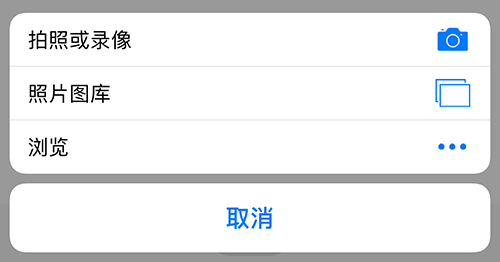

需要注意的是：

* 该方式主要运用于移动端，PC 端浏览器很难调用摄像头
* IOS 中测试，即便没有 accept 属性，type="file" 的 input 元素激活时的操作面板也同上图一致 

##### 示例

代码1：

```
# HTML
<input type="file" id="take-picture">


# JS
let takePicture = document.querySelector("#take-picture");
let showPicture = document.querySelector("#show-picture");

takePicture.onchange = function (e) {
    let files = e.target.files,
        file;

    if (!files || !files.length) {
        return;
    }

    file = files[0];

		// 创建 FileReader 对象
    let fileReader = new FileReader();

    fileReader.onload = function (e) {
        showPicture.src = e.target.result;
    };

    fileReader.readAsDataURL(file);
};
```

代码2：

```
# HTML
<input type="file" id="take-picture">


# JS
let takePicture = document.querySelector("#take-picture");
let showPicture = document.querySelector("#show-picture");

takePicture.onchange = function (e) {
    let files = e.target.files,
        file;

    if (!files || !files.length) {
        return;
    }

    file = files[0];
    
    // 创建对象 URL 字符串
    let URL = window.URL || window.webkitURL;
    let imgURL = URL.createObjectURL(file);

		// 释放 URL 对象以提高性能，注意必需在加载后释放，否则还没加载就释放会报错
    showPicture.onload = function () {
        URL.revokeObjectURL(imgURL);
    }

    showPicture.src = imgURL;
};
```

#### 位置 API

地理位置 API 通过 navigator.geolocation 对象提供。

IE9+ 及主流浏览器皆支持 navigator.geolocation 对象。

##### 方法

navigator.geolocation 对象的常用方法：

* getCurrentPosition()，获取设备当前位置，语法：

  ```
  navigator.geolocation.getCurrentPosition(success, error, options)
  ```

  * success，成功回调函数
  * error，失败回调函数
  * options 可选，一个可选的对象，可选属性：
    * enableHighAccuracy，布尔值，是否使用最高精度结果，注意，获得高精度结果比较耗时耗电
    * timeout，单位毫秒，获取超时设置，默认值是 Infinity
    * maximumAge，可以返回多长时间内可获取的缓存位置，单位毫秒

* watchPosition()，注册监听器，设备地理位置改变时自动调用，返回值为用于取消监听的 ID，语法：

  ```
  let id = navigator.geolocation.watchPosition(success[, error[, options]])
  ```

  - success，成功回调函数
  - error，失败回调函数
  - options 可选，一个可选的对象，可选属性同 getCurrentPosition()

* clearWatch()，取消 watchPosition() 方法注册监听器，语法：

  ```
  navigator.geolocation.clearWatch(id);
  ```

  * id，watchPosition() 方法返回的 ID

##### 使用

1. 获取定位

   ```
   navigator.geolocation.getCurrentPosition(function(position) {
   		do_something(position.coords.latitude, position.coords.longitude);
   });
   ```

2. 监视定位

   ```
   var watchID = navigator.geolocation.watchPosition(function(position) {
   		do_something(position.coords.latitude, position.coords.longitude);
   });
   ```

3. 取消监视

   ```
   navigator.geolocation.clearWatch(watchID);
   ```

##### 参考

* https://developer.mozilla.org/zh-CN/docs/Web/API/Geolocation/Using_geolocation

#### 触控事件

随着微软放弃 Windows Mobile，触控事件的使用规则也再次统一。

##### 事件类型

###### touchstart

触摸平面上接收到一个触点时触发，触点位置上的元素就是触摸目标元素。

###### touchmove

触点在触摸平面上移动时触发，触摸目标元素和对应的 touchstart 事件目标元素相同，即使 touchmove 事件触发时，触点已经移出该元素。

需要注意的是：

* 触点半径、旋转角度以及压力大小发生变化时，都会触发此事件
* 不同浏览器 touchmove 事件的触发频率不同，同时，触发频率还和硬件设备的性能有关。因此，程序运行不可依赖触发频率

###### touchend

触点从目标元素或者触摸平面（屏幕边缘）移除时触发，触摸目标元素和对应的 touchstart 事件目标元素相同，即使 touchend 事件触发时，触点已经移出该元素。

需要注意的是：

* 已经从触摸平面移除的触点，可以在 changedTouches 属性定义的 TouchList 中找到

###### touchcancel

触点由于某种原因被中断时触发，可能的原因：

* 触摸被某个事件中断，例如，触摸过程被一个弹出框打断
* 触点离开文档窗口，进入浏览器的界面元素、插件或者其他外部内容区域
* 触点个数超过设备支持的个数，导致 TouchList 中最早的 Touch 对象被取消

##### 事件对象

触控事件对象的常用属性：

* touches，当前屏幕上所有触点的集合
* targetTouches，绑定事件元素上的触点集合
* changedTouches，触发事件时改变的触点集合

举例来说

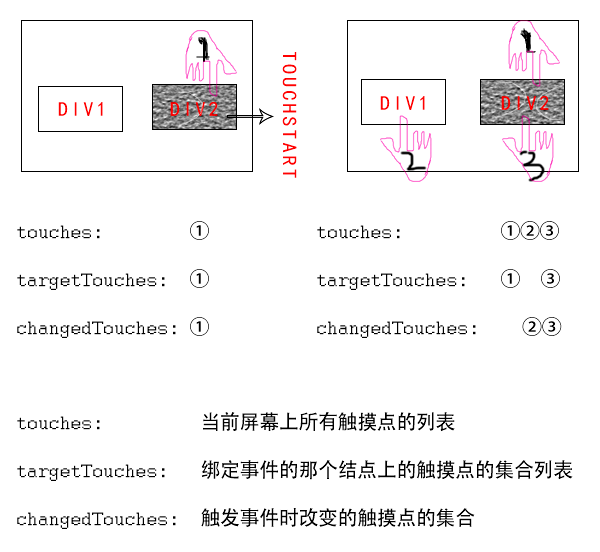

页面有两个元素 div1 和 div2，其中，div2 绑定了 touchstart 事件

* 开始，放一个手指 1 在 div2 上，触发 touchstart 事件，此时，三个属性集合内容一样
* 然后，在 div1 和 div2 上各放一个手指 2 和 3，再次触发 div 2 的 touchstart 事件，此时
  * touches 包含屏幕上所有触点 1、2、3
  * targetTouches 包含 div2 上的触点 1、3
  * changedTouches 包含发生变化的触点 2、3

##### 应用实践

###### Click延时

> 双击缩放起源于 IOS，因为早期的页面普遍为 PC 端设计，在移动端显示会明显缩小，所以需要一种手动缩放页面的机制。

Click 事件延时 300ms 的原因：

* 在移动端，双击事件通常用于内容或图片的缩放，此外，在早期 IOS 系统页面顶部和底部的双击还可以滚动页面。Click 事件延迟是设备区分单击和双击事件的一种机制，300ms 内屏幕未接收到第二次单击，则视为 Click 事件，否则，视为 double tap 事件

Click 事件延时 300ms 的后果：

* 单击延时，反应慢
* 动画不流畅，事件和视觉不匹配，例如，Phaser.js 实现的接水果，单击后视觉效果没能立即显示

Click 事件延时 300ms 的解决方案：

* touchend 事件替代

  使用 touchend，甚至更激进的 touchstart 事件代替 click 事件，但是会导致点击穿透问题

* 理想视口（ 谷歌解决方案）

  理想视口表明页面为移动端开发，缩放需求不强烈；同时，必要时禁用用户缩放用于增强告诉浏览器完全不需要缩放。该方案主要在 Android 中为 Google Chrome 推荐，IOS 中可能并不起作用

  ```
  <meta name="viewport" content="width=device-width, user-scalable=no">
  ```

* 指针事件（ 微软解决方案）

  指针事件，Pointer Events，是微软提议的无平台差别的统一事件解决方案，比如，开发者不再需要同时监听 touchstart 和 mousedown 事件以兼容不同的平台，直接使用 pointerdown 事件代替。该提案中有一个禁用用户代理默认行为的属性 touch-action。

  当元素具有该属性时，点击该元素时，用户代理不再考虑诸如双击缩放等浏览器默认的一些行为，直接相应。

  ```
  a[href], button {
      -ms-touch-action: none; /* IE10 */
      touch-action: none;     /* IE11 */
  }
  ```

  但目前只有微软系列浏览器支持较好，尤其在微软放弃移动端 Windows Mobile 后，也为该方案带来了不确定性。

* fastclick.js

  fastclick.js 是真正的跨平台方案出来之前一种很好的变通方案。

  fastclick.js 的基本原理：在检测到 touchend 事件时，通过 DOM 自定义事件立即触发一个模拟 click 事件，并把浏览器在 300 毫秒之后真正触发的 click 事件阻止掉。

  fastclick.js 的使用方法：

  ```
  document.addEventListener('DOMContentLoaded', function() {
  		FastClick.attach(document.body);
  }, false);
  ```

  虽然，可在更具体的元素上调用 attach() 方法，但直接绑定到 \<body> 可以确保整个页面都受益。

  需要注意的是：

  * 当 FastClick 检测到当前页面使用了基于 \<meta> 标签或者 touch-action 属性的解决方案时，会静默退出

  fastclick.js 的具体使用细节可参考 [Github](https://github.com/ftlabs/fastclick)

参考：

* https://thx.github.io/mobile/300ms-click-delay

###### 点击穿透

点击穿透的现象主要出现在浮层元素使用 touchend/tap 事件触发窗口关闭，而浮层下方的元素正好是一个 a 链接，或者一个绑定了 click 事件的元素，因为移动端 click 事件的延迟执行导致 click 事件的触发时机更长，浮层在关闭后，触摸依旧可以激发底部元素的 click 事件。

点击穿透的解决方案：

* 遮挡

  动画延迟浮层关闭，或者临时在浮动元素和和底部元素之间增加遮罩层

* 统一事件

  页面所有元素统一使用 click 或者 touchend/tap 事件触发单击事件

* fastclick.js

  fastclick.js 可以避免点击穿透，原理是统一点击事件为 touchend

* pointer-events

  使用 CSS 3 新属性 pointer-events 为 none，临时禁用底部元素点击事件

  ```
  $('#closePopup').on('tap', function(e){
      $('#popupLayer').hide();
      $('#bgMask').hide();
  
      $('#underLayer').css('pointer-events', 'none');
  
      setTimeout(function(){
          $('#underLayer').css('pointer-events', 'auto');
      }, 400);
  });
  ```

###### 复杂手势

目前，移动端设备仅支持基本的触摸事件 touchstart、touchmove、touchend、touchcancel，对于有复杂手势需求的场景，比如双指缩放、长按拖拽等，使用基础事件就显得比较麻烦。

Hammer.js 是一个开源的手势库，可以识别触摸、鼠标和指针事件所做的各种手势。默认支持：

* tap

  单击

* doubletap

  双击

* press

  长按

* pan

  拖移，分解事件：

  * panstart、panmove、panend、pancancel
  * panleft、panright、panup、pandown

  默认只开启水平方向，因为垂直方向是默认滚动页面的，开启垂直方向或所有方向

  ```
  hammertime.get('pan').set({ direction: Hammer.DIRECTION_VERTICAL });
  hammertime.get('pan').set({ direction: Hammer.DIRECTION_ALL });
  ```

* swipe

  快速滑动，分解事件：

  * swipeleft、swiperight、swipeup、swipedown

  默认只开启水平方向，因为垂直方向是默认滚动页面的，开启垂直方向或所有方向

  ```
  hammertime.get('swipe').set({ direction: Hammer.DIRECTION_VERTICAL });
  hammertime.get('swipe').set({ direction: Hammer.DIRECTION_ALL });
  ```

* pinch

  捏合，分解事件：

  * pinchstart、pinchmove、pinchend、pinchcancel
  * pinchin、pinchout

  默认禁止，开启方法

  ```
  hammertime.get('pinch').set({ enable: true });
  ```

* rotate

  旋转，分解事件：

  * rotatestart、rotatemove、rotateend、rotatecancel

  默认禁止，开启方法

  ```
  hammertime.get('rotate').set({ enable: true });
  ```

Hammer.js 的基本使用方法：

```
var hammertime = new Hammer(myElement, myOptions);

hammertime.on('pan', function(ev) {
    console.log(ev);
});
```

在同一个元素上有多个手势事件时，可以使用识别器集合，以增加手势识别的灵敏度

```
var mc = new Hammer.Manager(myElement, myOptions);

mc.add( new Hammer.Pan({ direction: Hammer.DIRECTION_ALL, threshold: 0 }) );
mc.add( new Hammer.Tap({ event: 'quadrupletap', taps: 4 }) );

mc.on("pan", handlePan);
mc.on("quadrupletap", handleTaps);
```

如果需要同时或分开执行多个事件，可以使用 recognizeWith 和 dropRecognizeWith 方法

```
var pinch = new Hammer.Pinch();
var rotate = new Hammer.Rotate();
pinch.recognizeWith(rotate);
```

参考：

* http://hammerjs.github.io/getting-started/
* https://www.cnblogs.com/strick/p/5173576.html

#### 设备方向检查

设备方向检查通过两个事件 deviceorientation 和 devicemotion 来实现。

使用示例：

```
window.addEventListener('deviceorientation', function(event) {
    console.log(event.alpha + ' : ' + event.beta + ' : ' + event.gamma);
});

window.addEventListener('devicemotion', function(event) {
    console.log(event.acceleration.x + ' m/s2');
});
```

具体使用细节可参考 MDN：

* https://developer.mozilla.org/zh-CN/docs/Web/API/Detecting_device_orientation
* https://developer.mozilla.org/zh-CN/docs/Web/API/DeviceOrientationEvent
* https://developer.mozilla.org/zh-CN/docs/Web/API/DeviceMotionEvent

### 样式

样式相关即是指 CSS 3 甚至 CSS 4 新增内容，例如：

* 新的布局，Flex 等
* 文字排版，text-overflow 等
* 背景样式，box-shadow 等
* 边框样式，border-image 等
* 过渡和动画

