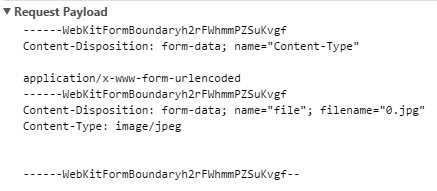

## 表单相关

#### 数据编码

表单数据在发送到服务器时，使用何种编码由 \<form> 元素的 enctype 属性指定，通常支持的三种方式是：

* application/x-www-form-urlencoded，默认值
* multipart/form-data
* text/plain

##### application/x-www-form-urlencoded

以键值对形式（&符连接，name1=value1&name2=value2…）编码数据，这种编码方式优点是：

* 简单

缺点是：

* 不适合复杂数据的传输，比如上传文件 `<input type="file" /> `
* 传输效率低，不适合大数据量的传输

##### multipart/form-data

这种编码方式支持复杂数据和大数据量的传输，以二进制数据格式进行传输，当表单使用了文件上传控件时必须使用这种方式。它告诉服务器传输的数据要用到多媒体传输协议，由于多媒体传输的都是大量的数据，所以规定上传文件必须是post方法。

这种编码方式下，浏览器会把整个表单以控件为单位进行分割，并为每个部分加上以下内容：

* Content-Disposition: form-data|file;
* name=<控件name>;
* Content-Type: 内容类型，默认是text/plain
* 分割符

 其中，每一段 `------WebKitFormBoundaryh2rFWhmmPZSuKvgf--` 对应一部分消息

##### text/plain

这种编码方式下，窗体数据以纯文本形式进行编码，其中不含任何控件或格式字符。

