## @规则

@规则是 CSS 中被整体应用到某一特定事物的属性或属性集合。一个@规则就是一个 CSS 语句，以@符号开头，后跟一个标识符，并包括直到下一个分号或 CSS 块的所有内容。

常用@规则：

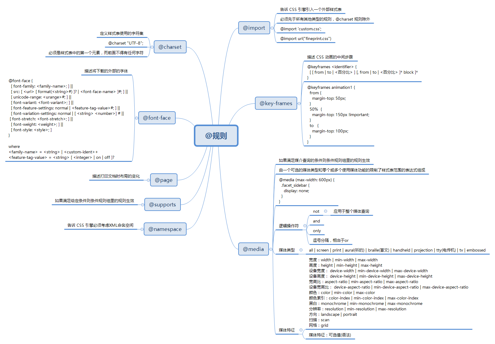

- @charset，指定样式表使用的字符编码
- @import，告诉 CSS 引擎引入一个外部样式表
- @namespace，告诉 CSS 引擎必须考虑 XML 命名空间
- 嵌套@规则，是嵌套语句的子集，不仅可以作为样式表里的一个语句，也可以用在条件规则组里：
  - @media，基于媒介查询结果，选择性的应用一个规则集合
  - @page，描述打印文档时布局的变化
  - @font-face，描述将下载的外部字体
  - @keyframes，描述 CSS 动画的中间步骤
  - @supports，如果环境支持给定条件，则应用规则组里的规则
  - @document，如果文档样式表满足给定条件，则应用规则组里的规则 (推延至 CSS Level 4 规范)

在@规则中，每条@规则都有不同的语法。不过，其中有一些拥有相同的语法，即在特定条件为 true 时，执行一个属性集合，而且它们还可以嵌套，这类@规则就是**条件规则组**。条件规则组由 CSS Level 3 定义，包括：

- @media
- @supports
- @document（推迟至 CSS Level 4 规范）

### @charset

@charset 规则，指定样式表使用的字符编码。

#### 特征

@charset 规则的基本特征：

- 必须是样式表第一个元素，前面不得有任何字符
- 不是嵌套语句，不能在@规则条件组中使用
- 如果有多个 @charset 声明，使用第一个
- 不能在 HTML 元素或 HTML 页面的 \<style> 元素内的使用

#### 语法

@charset 规则的语法格式：

```
@charset "<charset>";
```

示例：

```
@charset "UTF-8";
@charset "utf-8";		/* 注意，大小写不敏感 */ 
```

### @import

@import 规则，告诉 CSS 引擎引入一个外部样式表。

#### 特征

@import 规则的基本特征：

- 必须在 @charset 规则之后，所有其他类型规则之前

#### 语法

@import 规则的语法格式：

```
@import url list-of-media-queries;
```

其中：

- url，必需，引入资源，可以是相对路径或绝对路径
- **list-of-media-queries，可选，逗号分隔的媒体查询条件列表。注意：如果不支持列表中任何一条媒体查询条件，浏览器就不会引入 url 指明的 CSS 文件**

示例：

```
@import './common.css';
```

更多示例请查看 [MDN](https://developer.mozilla.org/zh-CN/docs/Web/CSS/@import)

### @media

@media 规则，基于媒介查询结果，选择性的应用一个规则集合。

#### 特征

@media 规则的基本特征：

- 在 HTML 中，可以作为标签 \<link> 的属性使用
- 在样式表中，可以独立使用，也可以在其它@规则条件组中嵌套使用

#### 语法

@media 规则由一个或多个媒体查询组成，每个媒体查询包含一个可选的媒体类型和若干媒体特性。多个查询可通过使用逻辑运算符以多种方式组合起来，且对大小写敏感。

常用媒介类型：

- all，所有设备
- print，打印设备
- screen，电脑屏幕

示例：

```
/* Media query */
@media screen and (min-width: 900px) {
    article {
    	padding: 1rem 3rem;
    }
}

/* Nested media query */
@supports (display: flex) {
    @media screen and (min-width: 900px) {
        article {
        	display: flex;
        }
    }
}

/* 作为 link 标签属性使用 */
<link rel="stylesheet" media="screen and (min-width: 900px)" href="./a.css" />
```

### @font-face

@font-face 规则，描述将下载的外部字体。

#### 特征

@font-face 规则的基本特征：

- 可以放在在CSS的最顶层，也可以在其它@规则条件组中嵌套使用

#### 语法

@font-face 规则的语法格式：

```
@font-face {
  [ font-family: <family-name>; ] ||
  [ src: <src>; ] ||
  [ unicode-range: <unicode-range>; ] ||
  [ font-variant: <font-variant>; ] ||
  [ font-feature-settings: <font-feature-settings>; ] ||
  [ font-variation-settings: <font-variation-settings>; ] ||
  [ font-stretch: <font-stretch>; ] ||
  [ font-weight: <font-weight>; ] ||
  [ font-style: <font-style>; ]
}
```

其中：

- font-family，字体名称

- src，字体文件位置，语法格式：

  ```
  [ <url> [format("<string>")]? | local("<family-name>") ]
  ```

  - format("\<string>")，辅助函数，描述 url 资源类型，常用类型有 truetype、opentype、truetype-aat、embedded-opentype、svg 等
  - local("\<family-name>")，指定本地已安装字体

- 其它属性参见 [MDN](https://developer.mozilla.org/zh-CN/docs/Web/CSS/@font-face)

示例：

```
@font-face {
    font-family: "myico";
    src: url("/fonts/4/myico.eot");	/* IE9 兼容 */
    src: url("/fonts/4/myico.eot#iefix") format("embedded-opentype"),	/* IE6-IE8 */
         url("/fonts/4/myico.ttf") format("truetype"),	/* Webkit, Android, iOS */
         url("/fonts/4/myico.woff") format("woff");	/* 现代浏览器 */
}

.icon-home:before {
    font-size: 64px;
    font-family: myico;
    content: "家";
}
```

需要注意的是，一般 @font-face 规则会有两个 src 属性，主要是因为 IE9 无法正确解析多 url 的 src 属性

#### 应用

##### WebFont

通过 @font-face 规则加载的远程字体称为 WebFont。

WebFont 技术在西文网站中较为流行，例如英文，因为西文字母数量有限，字体文件不会很大，顶多几十 KB 而已。

相对而言，中文文字数量较多，字体文件动辄几 MB，影响网页性能和体验。不过，通过剔除不使用文字以及文件压缩，也可以控制中文字体文件在几十 KB 之内，可参见腾讯 ISUX 开发的中文字体压缩器 - [字蛛FontSpider](http://font-spider.org/) 。

##### IconFont

通过 @font-face 规则加载自定义字体实现的图标称之为 IconFont。

###### 特点

IconFont 的优点是：

- 矢量图形，可自由缩放，且不会模糊
- 容量比图片小，加载快
- 可以任意改变颜色

IconFont 的缺点是：

- 只能被渲染成单色或 CSS3 的渐变色
- 创作自已的字体图标很费时间，修改时成本较高

###### 原理

客户端软件在显示文字时，首先获取文字的字体，然后查询字体库，字体库可以是本地安装的，也可以是 @font-face 规则要求浏览器远程加载的。

字体库其实就是一个文字到图形的映射文件，比如，需要显示文字“家”时，客户端软件会查询字体库文件中“家”对应的图形，然后在屏幕上显示对应的图形。正是因为不同字体库中同一文字对应图形不同，客户端才可以显示出同一文字的不同字体。在 Web 中，我们通常使用 font-family 指定字体。

在 IconFont 中：

1. 通过 @font-face 规则加载远程字体文件，假如字体文件如图（注：& - 表示转移，#x - 表示十六进制）

   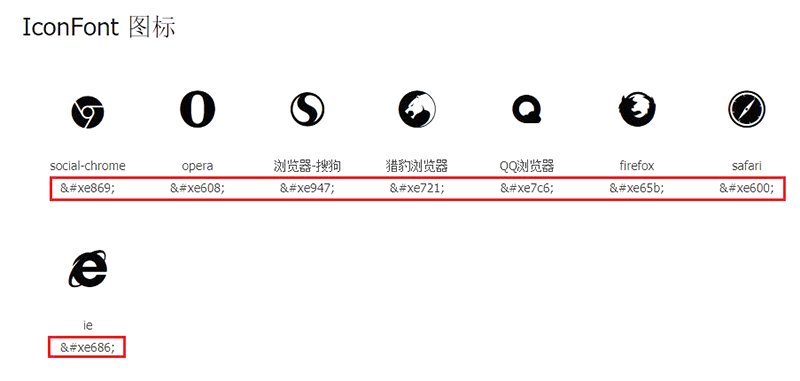

2. 通常，使用伪元素显示字体图标

   ```
   # HTML
   <i class="icon icon-chrome"></i>
   
   # CSS
   .icon-chrome:before {
   	content: "\e869";	/* \表示十六进制 */
   }
   ```

3. 浏览器查询 IconFont 图标字体库，找到“&#xe869”对应的字体字形，然后显示

### @keyframes

@keyframes 规则，通过在动画序列中定义关键帧（或waypoints）的样式来控制 CSS 动画序列中的中间步骤。

#### 特征

@keyframes 规则的基本特征：

- JS 可通过 CSS 对象模型接口 [CSSKeyframesRule](https://developer.mozilla.org/zh-CN/docs/Web/API/CSSKeyframesRule) 来访问 @keyframes 

- 可以按任意顺序列出关键帧百分比，引擎会按照其应该发生的顺序来处理

- 关键帧中出现的 !important 关键词将会被忽略

- 如果关键帧使用了不能用作动画的属性样式，这些属性会被忽略，不过，支持的属性仍然是有效的

- 如果关键帧没有指定开始或结束状态（0%/from 和100%/to），引擎将使用元素的初始样式作为起始/结束状态（这个特征可用来设计从初始状态开始，最终回到初始状态的动画）

- 如果多个关键帧使用同一个名称，以最后一次定义的为准

- 如果一个关键帧中特定百分比被重复定义，以最后一次定义为准

- 如果一个关键帧中没有出现其他关键帧中的属性，这个属性将使用插值；如果该属性不能使用插值，则其会被忽略掉，例如：

  ```
  @keyframes identifier {
      0% { top: 0; left: 0; }
      30% { top: 50px; }
      68%, 72% { left: 50px; }
      100% { top: 100px; left: 100%; }
  }
  ```

#### 语法

@keyframes 规则的语法格式：

```
@keyframes <keyframes-name> {
		<keyframe-block-list>
}
```

其中：

- \<keyframes-name>，帧名称，必须符合 CSS 语法中对标识符的定义
- \<keyframe-block-list>，帧百分比列表，可以是无序的，可以用 from/to 代替 0%/100%

示例：

```
@keyframes slidein {
    from {
        margin-left: 100%;
        width: 300%;
    }

    to {
        margin-left: 0%;
        width: 100%;
    }
}

p {
    animation-duration: 3s;
    animation-name: slidein;
}
```

### @supports

@supports 规则，如果环境支持给定条件，则应用规则组里的规则

#### 特征

@supports 规则的基本特征：

- 可以放在在CSS的最顶层，也可以在其它@规则条件组中嵌套使用

#### 语法

@supports 规则的语法格式：

```
@supports <supports_condition> {
	/* specific rules */
}
```

其中：

- <supports_condition>，单个或者由逻辑运算符连接的条件，可以使用小括号调整条件优先级。常用的逻辑运算符：

  - not，不支持指定条件，例如

    ```
    not( transform-origin: 10em 10em 10em )
    not( not( transform-origin: 2px ) )
    (display: flexbox) and ( not (display: inline-grid) )
    ```

  - and，同时支持，例如：

    ```
    (display: table-cell) and (display: list-item)
    ```

  - or，多个中支持一个，例如：

    ```
    ( transform-style: preserve ) or ( -moz-transform-style: preserve )
    ```

示例：

1. 检测是否支持指定的 CSS 属性

   ```
   @supports (animation-name: test) {
       …
       @keyframes {
         …
       }
   }
   ```

2. 检测是否支持指定 CSS 属性或者其带前缀版本

   ```
   @supports ( (perspective: 10px) or (-moz-perspective: 10px) or (-webkit-perspective: 10px) or (-ms-perspective: 10px) or (-o-perspective: 10px) ) {
       …
   }
   ```

3. 检测是否不支持指定的CSS属性

   ```
   @supports ( not ((text-align-last:justify) or (-moz-text-align-last:justify) ){
       …
   }
   ```

## 盒模型

CSS 基础框盒模型，CSS basic box model， 简称 CSS 盒模型，即将文档中的每个元素表示为一个个矩形的盒子，CSS 决定这些盒子的大小、位置以及属性（例如颜色、背景、边框尺寸…）。

### 组成部分


CSS 盒模型是浏览器渲染引擎对文档进行布局（lay out）时，所依据的标准之一。每个盒子从内到外依次由四个部分组成：内容区域、内边距区域、边框区域、外边距区域。

#### 内容区域

内容区域，content area，由内容边界限制，容纳元素的真实内容，文本、图像，或一个视频播放器等，它的尺寸为 content-box 宽度和 content-box 高度。

可以控制内容区域内容的 CSS 属性是 content

可以控制内容区域尺寸的 CSS 属性是 width、min-width、max-width 和 height、min-height、max-height

##### content

content 属性可以控制内容区域具体内容，尽管通常只是在 :before/:after 中使用，事实上，**可替换元素普遍也支持通过 content 属性设置/改变区域内容**。

```
# CSS
img {
	content: attr(alt);
}

# HTML

```

###### 应用

1. 辅助元素生成实现如图底边对齐，水平空间平均分配的布局（没弄明白？）

   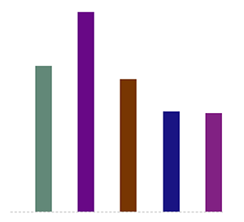

   ```
   # CSS
   .box {
       width: 256px;
       height: 256px;
       border-bottom: 1px dashed #ccc;
       text-align: justify;
   }
   
   .box:before {
       content: "";
       display: inline-block;
       height: 100%;
   }
   
   .box:after {
       content: "";
       display: inline-block;
       width: 100%;
   }
   
   .bar {
       display: inline-block;
       width: 20px;
       height: 0;
   }
   
   # HTML
   <div id="box" class="box">
       <i class="bar" style="height: 176px; background-color: rgb(98, 136, 120);"></i>
       <i class="bar" style="height: 241px; background-color: rgb(104, 8, 134);"></i>
       <i class="bar" style="height: 160px; background-color: rgb(120, 54, 2);"></i>
       <i class="bar" style="height: 121px; background-color: rgb(25, 20, 131);"></i>
       <i class="bar" style="height: 119px; background-color: rgb(129, 33, 130);"></i>
   </div>
   ```

2. 简单动态加载中

   ```
   # CSS
   dot {
       height: 1em;
       line-height: 1;
       text-align: left;
       vertical-align: -.25em;
       display: inline-block;
       overflow: hidden;
   }
   
   dot::before {
       display: block;
       content: '...\A..\A.';	/* 16进制A是ASCII换行 */
       white-space: pre-wrap;
       animation: dot 3s infinite step-start both;
   }
   
   @keyframes dot {
       33% {
           transform: translateY(-2em);
       }
       66% {
           transform: translateY(-1em);
       }
   }
   
   # HTML
   正在加载中<dot>...</dot>
   ```

3. content 开启闭合符合生成

   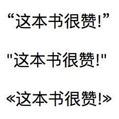

   ```
   # CSS
   :lang(ch) {
       quotes: '“' '”';
   }
   
   :lang(en) {
       quotes: '"' '"';
   }
   
   :lang(no) {
       quotes: '«' '»';
   }
   
   /* 在 q 标签的前后插入引号 */
   p:before {
       content: open-quote;
   }
   
   p:after {
       content: close-quote;
   }
   
   # HTML
   <p lang="ch">这本书很赞!</p>
   <p lang="en">这本书很赞!</p>
   <p lang="no">这本书很赞!</p>
   ```

4. content 图片生成

   ```
   div:before {
   	content: url(./images/girl.jpg);
   }
   ```

5. content 属性值内容生成

   ```
   # CSS
   img::after {
   	content: attr(alt);
   }
   
   # HTML
   
   ```

6. content 计数器

   仅提示，使用时查询资料或《CSS世界》P65

7. content 内容混合，即以上 content 使用方式可以混合一起使用

   ```
    a:after {
    	content: "(" attr(href) ")";
    }
    
    q:before {
    	content: open-quote url(1.jpg);
    }
    
    .counter:before {
    	content: counters(wangxiaoer, '-') '. ';
    }
   ```

##### width

行内框，除可替换元素（例如 img）外，一般无法设置宽高，所以此节主要指块框和行内块状框元素的宽度设置。

###### auto

auto 是 width 属性的默认值，其常见表现主要分为两类：

1. 扩展到最大，其主要特点：

   * 元素尺寸由外部尺寸（父元素的尺寸）决定，表现为元素占满整行

   * 元素具备完整的流体特性，即布局引擎会实时自动计算元素宽度为：

     ```
     父元素width - 元素marin - 元素border - 元素padding
     ```

     以使得元素的整个盒模型宽度刚好为外部尺寸宽度；当元素margin、border 和 padding 发生变化时，元素 width 也会实时变化。

     这种完整的流体特性会在元素被明确设定了固定值的 width 时消失。

2. 收缩到最小，其主要特点：

   * 元素尺寸此时由内部尺寸（元素内部的内容）决定

   * 浮动、绝对定位、display 值为 inline-block/table 时，宽度通常表现为刚好容纳所包含的内容

   * 剩余空间不足以容纳内容时：

     * 内容会被尽可能的折断（中文默认可任意折断，英文单词往往不行，除非 word-break: break-all），如图。

       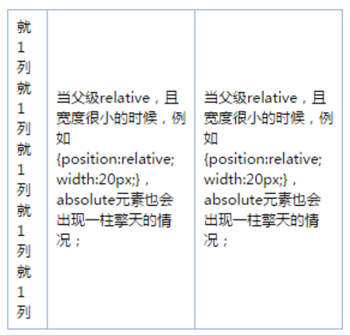

     * 超出容器限制，当以上方式依旧无法容纳内容时。例如：

       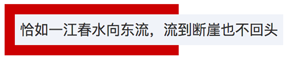

       ```
       # HTML
       <div class="father">
           <span class="child">恰如一江春水向东流，流到断崖也不回头</span>
       </div>
       
       # CSS
       .father {
           width: 150px;
           padding: 10px;
           background-color: #cd0000;
           white-space: nowrap;
       }
       
       .child {
           display: inline-block;
           padding: 5px;
           background-color: #f0f3f9;
       }
       ```

###### 固定值

相对于 auto，设定固定数字值 width 后，带来的最大破坏就是流动性丢失，从而导致不必要的 width、padding 以及 border 宽度的加减运算。

在 width 设置了固定大小值时，要保持元素尺寸的流动性，可选策略有两种：

- 宽度分离，增加一层标签元素，将 width 值设置在父元素上，而子元素将保留流动性
- box-sizing，设置元素 box-sizing 值为 border-box，迫使元素恢复一定的流动性，且不用增加外层标签

###### 百分比

设置为百分比的 width 值同样会导致流动性的丢失。

需要注意的是：盒模型的宽高使用百分比值时，元素是否绝对定位，依据父元素尺寸稍有差异

- 元素绝对定位时，相应的父元素尺寸取自 padding-box
- 元素非绝对定位时，相应的父元素尺寸取自 content-box

例如，如下代码的测试结果：


```
# HTML
<div class="box">
	<div class="child">高度100px</div>
</div>
<div class="box rel">
	<div class="child">高度160px</div>
</div>

# CSS
.box {
    height: 160px;
    padding: 30px;
    box-sizing: border-box;
    background-color: #beceeb;
}
.child {
    height: 100%;
    background: #cd0000;
}
.rel {
    position: relative;
}
.rel > .child {
    width: 100%;
    position: absolute;
}
```

###### 应用

1. 固定宽度区域内，文字较少时居中显示，较多时居左显示，不使用 JS

   ```
   # HTML
   <div class="box">
   	<p id="conMore" class="content">文字内容</p>
   </div>
   
   # CSS
   .box {
       width: 100px;
       background: #cd0000;
       text-align: center;
   }
   .content {
   		color: #fff;
       display: inline-block;		/* 利用收缩到最小 */
       text-align: left;
   }
   ```

2. 单层 HTML 标签实现下图的凹凸效果（Why?）

   

   ```
   # HTML
   <span class="ao"></span>
   <span class="tu"></span>
   
   # CSS
   .ao,
   .tu {
       width: 0;
       display: inline-block;
       font-size: 14px;
       line-height: 18px;
       margin: 35px;
   }
   
   .ao:before,
   .tu:before {
       outline: 2px solid #cd0000;
   }
   
   .ao:before {
       content: "love你love";
   }
   
   .tu {
       direction: rtl;
   }
   
   .tu:before {
       content: "我love你";
   }
   ```

##### height

行内元素，除可替换元素（例如 img）外，一般无法设置宽高，所以此节主要指块级元素的高度设置。

###### auto

height 的 auto 表现远比 width 的要简单的多，主要是因为页面的横向空间是有限的，垂直空间却是无限的。

在 height 值为默认值 auto 时，通常表现为内部尺寸特性，即元素高度随内容的增加而增大。当然，在特殊情况下，高度也会表现出外部尺寸特性，例如格式化高度

###### 百分比

对于 width，即便父元素的 width 为 auto，子元素的 width 百分比也是支持的，因为当包含块的宽度取决于子元素尺寸，而子元素宽度又设置为百分比时在 CSS 2.1 中是未定义的，测试发现浏览器目前统一的处理方式是：

1. 将子元素为百分比的 width 值改为 auto 进行计算，得到父元素宽度
2. 再用父元素宽度值乘以相应百分比作为子元素宽度

对于 height，CSS 2.1 中明确指定如果元素高度未显式指定，且又非绝对定位时，计算值按 auto 处理。所以，如果子元素高度设置了百分比，则 `auto × 百分比 = NaN` 。也因此，要想子元素值为百分比的 height 值有效，其父元素必需具有确定的最终高度计算值。

关于 height 百分比，最经典的问题就是网页高度占满整个屏幕的问题，类似的代码：

```
# CSS
.wrap {
	height: 100%;
}

# HTML
<body>
    <div class="wrap"></div>
</body>
```

wrap 元素的高度最终为 0，因为 html 和 body 元素的高度默认值皆为 auto，表现出内部尺寸特性。使 wrap 元素高度 auto 属性值生效的具体方法：

1. 将 html 和 body 元素的高度显式设置为 100%。此时，html 元素的高度计算值为视口高度的 100%，body 元素的高度为 html 元素高度的 100%，最终使得 wrap 元素的父元素 body 具有明确的最终计算值。

   ```
   html, body {
       height: 100%;
   }
   ```

2. 使用绝对定位，即，使 wrap 元素相对于具有明确高度的视口进行定位

   ```
   .wrap {
   	height: 100%;
   	position: absolute;  /* 或fixed */
   }
   ```

##### min/max-*

为响应式而生的 min-width、min-height、max-width 和 max-height，往往出现在自适应布局或流式布局中，例如，相应式网页宽度：

```
body {
    min-width: 1200px;
    max-width: 1400px;
}
```

- 浏览器界面宽度 ≤ 1200px 时，body 宽度为 1200px
- 浏览器界面宽度 > 1200px 且 ＜ 1400px 时，body 宽度为浏览器界面宽度
- 浏览器界面宽度 ≥ 1400px 时，body 宽度为 1400px

###### 默认值

min-width 和 min-height 的默认值是 auto

max-width 和 max-height 的默认值是 none

###### 优先级

min/max-* 系列的层叠优先级：

```
min-* > max-* > !important
```

- min-* > max-*，例如：

  ```
  div {
      min-width: 500px;
      max-width: 200px;
  }
  ```

  div 元素的最终宽度为 500px

- max-* > !important，例如：

  ```
  # HTML
  
  
  # CSS
  img {
      max-width: 200px;
  }
  ```

  img 元素的最终宽度为 200px；

需要注意的是：尽管 CSS 的层叠优先级中，!important 属性样式具有最高的优先级，但是 min/max-* 系列的优先级还要在其之上。

####内边距区域

内边距区域，padding area，由内边距边界限制，扩展自内容区域，负责延伸内容区域的背景，填充元素内容与边框的间距，它的尺寸是 padding-box 宽度和 padding-box 高度；

可以控制内边距区域尺寸的 CSS 属性：

* padding
* padding-top、padding-right、padding-bottom、padding-left

##### padding

相对而言，除了行内框垂直方向的表现比较复杂外，padding 的使用通常比较简单。

需要特别注意的地方：

* padding 的百分比值，无论水平还是垂直方向，都是依据元素宽度计算的

* 很多元素默认内置特定的 padding 值

  * ol/ul 元素内置固定 px 的 padding-left，比如 Chrome 为 40px

  * 大部分的表单元素，比如

    * 所有浏览器下的 input/textarea、button、radio/checkbox；其中在 Firefox 下，必需通过以下 CSS 才可将 button 内边距置为 0：

      ```
      button::-moz-focus-inner {
          padding: 0;
      }
      ```

    * 部分浏览器下的 select 下拉菜单

* 当元素内部存在区域滚动时，IE/Firefox 会忽略 padding 的值。因为：

  * IE/Firefox 浏览器是子元素尺寸超过父元素 padding box 尺寸时触发父元素滚动条显示
  * 其它浏览器是子元素尺寸超过父元素 content box 尺寸时触发父元素滚动条显示

  测试代码：

  ```
  <div style="height:100px; padding:50px 0;">
      
  </div>
  ```

  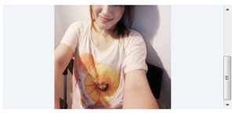

  IE/Firefox 浏览器的表现如上图，div 元素 50px 的 padding 未显示。所以，为了避免这种兼容性问题，最好使用 margin 属性实现滚动区域四周留白。

#### 边框区域

边框区域，border area，由边框边界限制，扩展自内边距区域，是容纳边框的区域，其尺寸为 border-box  宽度 和 border-box 高度；

可以控制边框区域尺寸的 CSS 属性：

* border
* border-width

##### border

需要注意的是：

* 在没有显式设置 border-color 时，同 outline、box-shadow、text-shadow 相似，取 color 值

#### 外边距区域

外边距区域，margin area ，由外边距边界限制，用空白区域扩展边框区域，以分开相邻的元素。它的尺寸为 margin-box 宽度和 margin-box 高度；

可以控制外边距区域尺寸的 CSS 属性：

* margin
* margin-top、margin-right、margin-bottom、margin-left

##### margin

###### auto

margin 默认值是 0，当值为 auto 时，会表现出一定的弹性，即会自动分配父元素相应尺寸的剩余空间。

测试代码：


```
# CSS
.father {
    width: 300px;
    background: #f0f3f9;
}
.son {
    width: 200px;
    height: 120px;
    margin-right: auto;
    background: #cd0000;
}

# HTML
<div class="father">
    <div class="son"></div>
</div>
```

###### 百分比

同 padding 一样，margin 的百分比值，无论水平还是垂直方向，都是依据元素宽度计算的

###### 负值

负值的 margin 最重要的特点就是：当 width 为 auto，元素表现出完整的流体特性时，负值的 margin 可以增加元素的 width；**不过无法增加 height，除非使用 writing-mode 改变流向为垂直流**。

测试代码：

```
# CSS
.wrap {
    width: 100px;
}
.wrap p {
    margin-left: -100px;
}

# HTML
<div class="wrap">
    <p></p>						// p的宽度为200px
</div>
```

###### 合并

margin 合并的必要条件：

* 块级元素，行内元素不存在 margin 合并
* 正常流，浮动和绝对定位时不存在 margin 合并
* 垂直方向

margin 合并的三种场景：

* 相邻兄弟元素

  ```
  # CSS
  p {
      margin: 10px 0;
  }
  
  # HTML
  <p>第一行</p>
  <p>第二行</p>
  ```

* 父元素和第一个子元素的 margin-top 或者和最后一个子元素的 margin-bottom

  ```
  <!-- 以下三种布局一样 -->
  <div class="father">
      <div class="son" style="margin-top:80px;"></div>
  </div>
  <div class="father" style="margin-top:80px;">
      <div class="son"></div>
  </div>
  <div class="father" style="margin-top:80px;">
      <div class="son" style="margin-top:80px;"></div>
  </div>
  ```

  禁止父子元素 margin 合并的方法：

  * 父元素设置 BFC，因为 BFC 元素不与子元素发生 margin 合并
  * 阻隔父子元素的 margin 接触
    * 父元素设置 border 或 padding
    * 父子元素之间添加行内元素

* 空元素 margin 合并

  **注意**：空元素 margin 最终是在父元素身上合并，例如以下代码，son 元素 margin-top 和 margin-bottom 还是 10px，但是 father 元素的高度因为 margin 合并只有 10px

  ```
  # CSS
  .father {
      overflow: hidden;
  }
  .son {
      margin: 10px 0;
  }
  
  # HTML
  <div class="father">
      <div class="son"></div>
  </div>
  ```

margin 合并的基本规则：

* 正正取最大值
* 正负值则相加
* 负负取最负值

###### 应用

1. 定宽容器实现三列等宽的子容器，子容器之间有固定间距

   ```
   # CSS
   .wrap {
       width: 340px;
   }
   ul, li {
       margin: 0;
       padding: 0;
   }
   ul {
       overflow: hidden;
       margin-right: -20px;
   }
   li {
       float: left;
       width: 100px;
       height: 20px;
       margin-right: 20px;
       background: red;
       list-style: none;
   }
   
   # HTML
   <div class="wrap">
       <ul>
           <li></li>
           <li></li>
           <li></li>
       </ul>
   </div>
   ```

2. 两栏（有背景色）弹性等高布局

   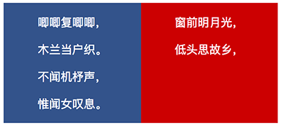

   HTML：

   ```
   <div class="wrap">
       <div class="column-left">
           <p>唧唧复唧唧，</p>
           <p>木兰当户织。</p>
           <p>不闻机杼声，</p>
           <p>惟闻女叹息。</p>
       </div>
       <div class="column-right">
           <p>窗前明月光，</p>
           <p>低头思故乡，</p>
       </div>
   </div>
   ```

   **CSS 实现1**

   实现原理：通过表格

   ```
   .wrap {
       color: #fff;
       width: 100%;
       display: table;
       text-align: center;
   }
   
   .column-left,
   .column-right {
       width: 50%;
       display: table-cell;
   }
   
   .column-left {
       background: #34538b;
   }
   
   .column-right {
       background: #cd0000;
   }
   ```

   **CSS 实现2**

   实现原理：

   通过 `padding-bottom: 9999px;` 将栏目的高度增加 9999px，实现两个高度非常高的有背景色的 column；同时，使用 `margin-bottom: -9999px;` 通过向下负偏移抵消掉 padding-bottom 增加的元素高度，防止元素产生区域滚动。当栏目内容增加时，高度增加，向下偏移导致被隐藏的背景色逐渐露出。

   不过，通过查看两个栏目的盒模型尺寸发现，其实这两个栏目的实际高度并不相等，只是因为背景一致带来的视觉错觉。

   另外，这里的 padding-bottom 换成 border-bottom 也是可以的

   ```
   .wrap {
       color: #fff;
       overflow: hidden;
       text-align: center;
   }
   
   .column-left,
   .column-right {
       width: 50%;
       margin-bottom: -9999px;
       padding-bottom: 9999px;
   }
   
   .column-left {
       float: left;
       background: #34538b;
   }
   
   .column-right {
       float: right;
       background: #cd0000;
   }
   ```

### 表现模式

CSS 盒模型有两种表现模式：

* 标准模式，盒子尺寸由组成部分中的四个部分相加：

  ```
  size = content + padding + border + margin
  ```

* 怪异模式，主要出现在未正确设置 DTD 或 DOCTYPE 的早期 IE 中(≤ 8)，IE 在这种模式下不支持设置 padding 和 border 属性， content 的尺寸等同于标准模式下的 content + padding + border；此时，盒子尺寸也就只由 content-box 和 margin-box 两部分组成：

  ```
  size = content + margin
  ```

  不过，随着早期 IE 甚至整个 IE 浏览器被抛弃，这种模式也已经成为历史，了解即可。
  
  **注意：**这种行为与 `box-sizing: border-box;` 的直接效果是一样的

### 两层盒子

> 该部分内容来自《CSS 世界》

元素盒子通常有两种类型：块级元素和内联元素，块级元素主要负责文档结构，内联元素主要负责文档内容排布。但是，这两种盒子类型并不能 hold 所有场景，比如 display 的 inline-block、inline-table、list-item 等场景。

《CSS 世界》认为 CSS 元素均具有内外两层盒子：

* 外在盒子，负责盒子与其他元素盒子的关系，是换行显示还是一行显示
* 内在盒子，也称容器盒子，负责盒子自身的尺寸，盒子内部的内容呈现

因此，盒模型的 width、padding、border、margin 此时作用于内在盒子。

基于双层盒模式，display 的值可以拆解为：

* block，等同于 block-block，内外盒子均为 block
* inline，等同于 inline-inline，内外盒子均为 inline
* inline-block，外在盒子 inline，内在盒子为 block
* inline-table，外在盒子 inline，内在盒子为 table

同时，由于尺寸属性通常设置于块级元素，所以对于两层盒子模式，width/height 属性也就作用于内在盒子上。

此外，对于 display 的 list-item 属性，由于需要显示项目符号，需要一个额外的附加盒子（或称标记盒子）来单独放置项目符号。

### 盒子类型

盒子，box，也译作框。常见盒子类型有三种：

* 块框，或称块盒、块级盒子
* 行内框，或称行内盒子、行内级盒
* 行内块状框，或称行内块状盒子

使用以下代码测试三种盒子类型表现：

```
# CSS
p {
    padding: 1em;
    border: 1px solid black;
}
span {
    padding: 0.5em;
    border: 1px solid green;

    /* That makes the box visible, regardless of its type */
    background-color: yellow;
}
.inline {
    display: inline;
}
.block {
    display: block;
}
.inline-block {
    display: inline-block;
}

# HTML
<p>
    唧唧复唧唧，木兰当户织。
    <span class="block">不闻机杼声，惟闻女叹息。</span>
    问女何所思，问女何所忆。
</p>
<p>
    唧唧复唧唧，木兰当户织。
    <span class="inline">不闻机杼声，惟闻女叹息。</span>
    问女何所思，问女何所忆。
</p>
<p>
    唧唧复唧唧，木兰当户织。
    <span class="inline-block">不闻机杼声，惟闻女叹息。</span>
    问女何所思，问女何所忆。
</p>
```

随着屏幕可用宽度逐渐减小的表现如下：

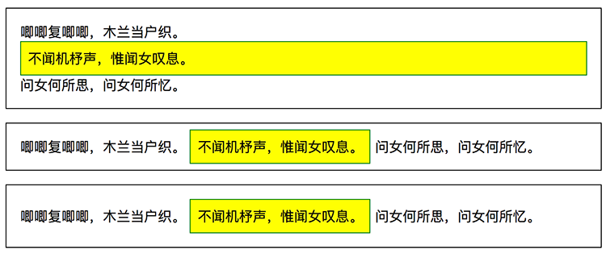

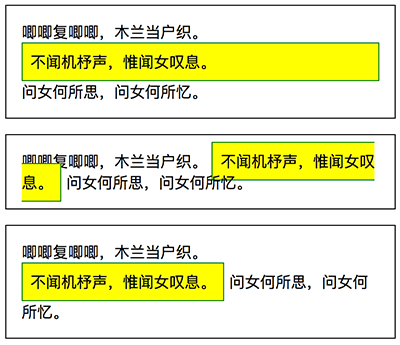

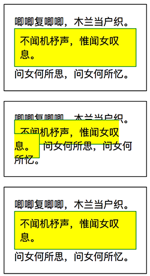

#### 块框

块框，block box，块级元素生成的框。

##### 特征

块框的基本特征：

* 独立占用父元素横向空间，前后皆会换行，独成一行；当空间不足时，内部内容换行
* 可以设置 width/height、padding、border、margin
* 可生成块框 display 值： block 

#### 行内框

行内框，inline box，行内元素生成的框。

##### 特征

行内框的基本特征：

* 随内部内容流动，和其它行内元素同行排列；当空间不足时：
  * 一般情况下，**行内框随内容被分割/折断，注意不是换行**，因为 margin、padding 和 border 在折断处没有视觉效果
  * 如果因如下情况不能分割，行内框会溢出行框
    * 行内框只包含单个字符
    * 语言特殊的断字规则不允许在行内框里换行
    * 受到属性值为 pre 或 nowrap 的 white-space 特性的影响
* 除可替换元素外，不可以设置 width/height，但可以设置 padding、border 和 margin；水平方向会更新周围元素位置，但垂直方向不会
  * 不可替换元素的行内框高度等于  line-height 值
  * 可替换元素的行内框高度等于内容区高度
* 可生成行内框 display 值： inline 

需要特别强调的是：

* 行内框垂直方向的 padding（padding-top/padding-bottom）、border（border-top/border-bottom）依旧是起作用的，扩大了的背景色区域证明了这一点；只不过，在垂直方向上，它们只影响行内框自身，不会影响框外的元素布局，即垂直方向上的 padding、border 和 margin 对元素布局没有影响

* 行内框因空间不足被折断时，折断处后部的内容表现的像换行效果，实际上垂直方向上的 padding、border 和 margin 都不会起作用，行内框只是按内容区高度进行“换行”，所以可能会导致行内框与其他行内框或者折断后的自身重叠，如果有背景色且区域较大时，重叠导致遮挡，会出现“莫名其妙”的效果，例如：

  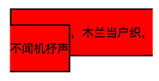

  ```
  # CSS
  .wrap span {
      border: 2px solid #000;
      padding: 20px 0;
      background: red;
  }
  
  # HTML
  <div class="wrap">
      <span>唧唧复唧唧，木兰当户织，不闻机杼声</span>
  </div>
  ```

* 尽管垂直方向上 padding、border 不影响布局，但如果父元素具有超出滚动属性，过大的 padding、border 尺寸导致的大尺寸的行内框区域依然会触发父元素的区域滚动，可测试如下代码：

  ```
  # CSS
  .wrap {
      width: 200px;
      height: 40px;
      overflow: auto;
  }
  
  .wrap span {
      margin: 100px 0 0;
      padding: 200px 0;
      border: 2px solid #000;
  }
  
  # HTML
  <div class="wrap">
      <span>唧唧复唧唧</span>
  </div>
  ```

##### 结构

解剖其中的一个行内框：

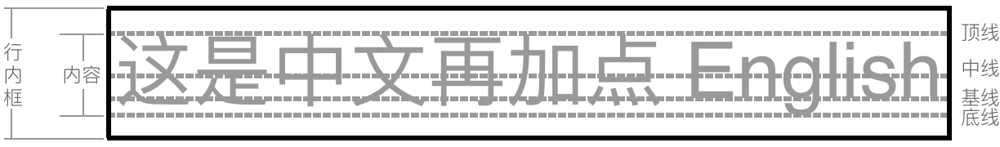

相关概念：

- 顶线：文字顶部所在水平线
- 中线：顶线和底线的中心水平线
- 基线：英文字母“x”底部所在水平线
- 底线：文字底部所在水平线
- 行高：两行文字基线之间的距离
- 行距：上一行内联元素的底线，与下一行内联元素的顶线之间的垂直距离
- 内容区：行内框顶线和底线之间的区域为内容区，其高度为 font-size

#### 行内块状框

行内块状框，行内块级元素生成的框。

##### 特征

行内块状框的基本特征：

* 整个框和前后元素并排排列，宽度不足时，整个框换行；当空间继续缩小时，内部内容换行
* 可以设置 width/height、padding、border、margin
* 可生成行内块状框 display 值： inline-block

通过对比可以发现，行内块状框的表现基本同块框一致，表现上的唯一区别是：行内块状框作为一个整体会尽可能同前后的元素并排排列。

### 相关属性

#### box-sizing

box-sizing，盒尺寸，用于修改基本盒模型，即修改盒尺寸 width/height 的作用细节。支持的属性值：

* content-box，默认值，width/height 为 content-box 的宽高
* border-box，width/height 为 border-box 的宽高

## 优先级

CSS 样式的优先级/特殊性需要从三个角度去划分：

* 选择器
* 属性本身
* 创建来源

### 选择器

基于选择器，样式的优先级被分为四级 `0，0，0，0` ，其优先级顺序：

1. `1，0，0，0` 行内样式，即 style 属性指定的样式
2. `0，1，0，0` id 选择器指定的样式
3. `0，0，1，0` 类选择器、属性选择器和伪类指定的样式
4. `0，0，0，1` 元素标签选择器和伪元素指定的样式
5. 结合符和通配符对优先级没有贡献

### 属性本身

基于属性本身，其优先级顺序：

1. min-width/min-height > max-width/max-heigth
2. !important
3. 普通样式声明

### 创建来源

样式的创建来源主要有：读者、开发者、用户代理 (浏览器等)。其优先级顺序：

1. 读者的重要声明
2. 开发者的重要声明
3. 开发者的普通声明
4. 读者的普通声明
5. 用户代理声明

## 格式化

在 CSS 中，有多个格式化概念，其中常见的有：

* 格式化上下文
* 格式化宽度高度
* 基本视觉格式化

### 格式化上下文

格式化上下文，Formatting Context，简称 FC，是页面中一个不影响区域之外其他元素的相对独立的渲染区域，有一套渲染规则，决定了其子元素如何布局，以及和其他元素之间的关系和作用

常见的格式化上下文包括：

- BFC，Block Formatting Context
- IFC，Inline Formatting Context
- GFC（CSS 3中定义）
- FFC（CSS 3中定义）

#### BFC

BFC，Block Formatting Context，块级格式化上下文，只有块级盒子参与，它规定其内部的块级盒子如何布局。

**需要注意的是：**IE 不支持 BFC 标准，但 IE 有 Layout 属性，Layout 和 BFC 基本是等价的。为了兼容 IE，需要触发 BFC 时，还需要使用 zoom: 1 来触发 IE 浏览器的 Layout。

##### 创建

当元素具备下列条件之一时，会创建块级格式化上下文：

- 根元素或包含根元素的元素，即 html 或 body 元素默认自动创建BFC
- 浮动元素（float 不为 none ）
- 绝对定位元素（position 为 absolute/fixed）
- overflow 不为 visible 的块元素
- 行内块元素（display 为 inline-block）
- 弹性元素（display为 flex 或 inline-flex元素的直接子元素）
- 网格元素（display为 grid 或 inline-grid 元素的直接子元素）
- 表格类元素
  - 表格单元格（display为 table-cell，HTML表格单元格默认为该值）
  - 表格标题（display 为 table-caption，HTML表格标题默认为该值）
  - 匿名表格单元格元素（元素的 display为 table、table-row、 table-row-group、table-header-group、table-footer-group（分别是HTML table、row、tbody、thead、tfoot的默认属性）或 inline-table）
- ...

##### 特征

BFC 具有以下特征：

1. BFC 元素本身
   1. BFC 元素的 margin-box 的左边， 与包含块 border-box 的左边相接触 (对于从左往右的格式化，否则相反)。即使存在浮动也是如此
   2. BFC元素创建一个隔离的独立容器，容器里面的子元素不会影响到外面的元素
2. BFC 子元素
   1. 内部的 Box（盒子）会在垂直方向上一个接一个地放置
   2. 内部的相邻 Box 垂直方向上的 margin 会发生合并
   3. BFC 元素不与子元素的 margin 发生合并
3. 与 float box 的关系
   1. BFC 区域不与 float box 重叠
   2. BFC 元素能够识别并包含浮动子元素，计算 BFC 的高度时，浮动元素也参与计算

##### 应用

###### 清除浮动

```
# CSS
.wrap {
    border: 1px solid #000;
}
.item {
    width: 100px;
    height: 100px;
    float: left;
    background: #eee;
}

# HTML
<div class="wrap">
    <div class="item"></div>
</div>
```

由于 wrap 容器内元素浮动，**脱离了文档流**，所以容器只剩下 2px 的边距高度。

基于 BFC 特征 3-2，触发 wrap 容器的 BFC，比如，为 wrap 容器添加 `overflow: hidden` 属性，可使得 wrap 容器包裹浮动元素。

###### 外边距合并

基于 BFC 特征 2-2，同一个 BFC 内相邻元素垂直方向上的 margin 会发生合并。

```
# CSS
div {
    width: 100px;
    height: 100px;
    background: lightblue;
    margin: 100px;
}

# HTML
<div></div>
<div></div>
```

两个 div 元素的垂直间距为 100px，而不是 200px，因为发生了合并。如果不希望合并，可以将元素置于不同的BFC 下：

```
# CSS
.container {
    overflow: hidden;
}
p {
    width: 100px;
    height: 100px;
    background: lightblue;
    margin: 100px;
}

# HTML
<div class="container">
    <p></p>
</div>
<div class="container">
    <p></p>
</div>
```

由于 p 元素处于不同的 BFC 内，所以垂直间距是 200px，不是合并后的 100px。

###### 浮动元素覆盖

```
# CSS
.left {
    height: 100px;
    width: 100px;
    float: left;
    background: lightblue;
}
.back {
    width: 200px;
    height: 200px;
    background: #eee;
}

# HTML
<div class="left">我是一个左浮动的元素</div>
<div class="back">
	我是一个没有设置浮动,也没有触发 BFC 元素, width: 200px; height:200px; background: #eee;
</div>
```


基于 BFC 特征 1-1，left 元素左侧与其父元素左边缘对其；同时，left 元素脱离普通流，导致按正常流布局的 back 元素左侧也与父元素左边缘对其。所以，left 元素和 back 元素重叠。

但是，因为浮动元素具有默认的文字环绕属性，back 元素的文字需要从浮动元素 left 的右侧开始排布。可以通过给 back 添加 `margin-left: 10px;` 来检测这种行为，效果如图：


所以，当需要 left 元素右侧和 back 元素有一定间距时，最好是在 left 上设置 margin-right，而不是在 back 上设置 margin-left。

如果不想 left 元素和 back 元素重叠 ，可以基于 BFC 特征 3-1，触发 back 的 BFC。比如，back 添加 `overflow: hidden;` ，如图：


###### 多列布局BFC

如果多列布局需占满了整个容器的宽度，在某些浏览器中最后一列有时候会被挤到下一行。可能的原因是：浏览器舍入（取整）了列的宽度使得宽度总和超过了容器的宽度。要解决这个问题，可以在列的布局中建立了一个新的BFC，它会在前一列填充完之后占据剩余空间。

```
# CSS
.column {
    width: 31.33%;
    background-color: green;
    float: left;
    margin: 0 1%;
}
.column:last-child {
    float: none;
    overflow: hidden;
}

# HTML
<div class="container">
    <div class="column">column 1</div>
    <div class="column">column 2</div>
    <div class="column">column 3</div>
</div>
```

##### 参考

- https://developer.mozilla.org/zh-CN/docs/Web/Guide/CSS/Block_formatting_context
- https://zhuanlan.zhihu.com/p/25321647
- https://juejin.im/post/5909db2fda2f60005d2093db
- https://www.w3cplus.com/css/understanding-block-formatting-contexts-in-css.html
- https://www.jianshu.com/p/66632298e355

#### IFC

IFC，Inline Formatting Context，行内格式化上下文，只有行内框参与的格式化上下文，它规定了其内部的行内框如何布局。

##### 概念

```
<p style="background-color:silver; font-size:30px;">
    TEXT1
    <span style="border:3px solid blue;">text in span</span>
    great1
    <em style="border:3px solid red;">thx a lot</em>
    bee
    <strong style="border:3px solid green;">give me 5!</strong>
    Aloha!
</p>
```

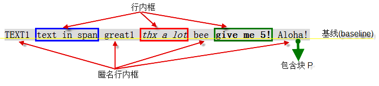

###### 行框

包含其内部所有行内框的最高点和最低点的最小的框，即：

* 行框上边界位于最高行内框的上边界
* 行框下边界位于最低行内框的下边界

##### 创建

当块容器盒不包括任何块级盒子时，就会创建一个行内格式化上下文（IFC）。

##### 特征

IFC 具有以下特征：

- 水平方向上

  - 多个行内框不能共存于一个行框时，会被分到两个或多个垂直堆叠的行框里

  - 行框的宽度由包含块和浮动情况决定，当存在浮动框时，浮动框会处于包含块边界与行框边界之间，行框的宽度会随之减小

    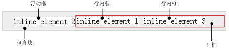

  - 行内框一个接一个的在水平方向摆放，当容器宽度不够时会换行

  - 行内框之间的水平 margin、border 和 padding 都有效

  - 行内框的总宽度小于匿名行盒的宽度时，那么水平方向排版由 text-align 属性来决定

- 垂直方向上

  - 行内框的对齐方式由 vertical-align 控制，默认对齐为 baseline
  - 行内框的高度计算
    - 可替换元素、inline-block 和 inline-table 元素，取其 margin box 的高度
    - 行内盒子，取其 line-height
  - 行盒的高度由内部子元素中实际高度最高的盒子计算出来

需要注意的是：

* IFC 的环境中不能存在块级元素，否则，IFC 会被破坏掉并变成 BFC，而块级元素前后的元素或文本将会各自自动产生一个匿名块盒其包围

##### 参考

* http://layout.imweb.io/article/formatting-context.html
* http://www.ayqy.net/doc/css2-1/visuren.html#inline-formatting
* https://blog.csdn.net/ruoyiqing/article/details/39009973

### 格式化宽度高度


格式化宽度/高度仅出现在“绝对定位模型”中，即 position 属性值为 absolute 或 fixed 的元素中。

默认情况下，绝对定位的元素尺寸表现为“收缩到最小”，宽高/高度由内部尺寸决定。但是，对于不可替换元素，当 left/right 或 top/bottom 对立方位属性值同时存在时，元素的宽度/高度表现为“格式化宽度/高度”，其宽度/高度大小相对最近具有定位特性（position 不为 static）的祖先元素计算。

```
div {
    left: 20px;
    right: 20px;
    position: absolute;
}
```

“格式化宽度/高度”具有完全的流体特性，也就是 margin、border、 padding 和 content 内容区域同样会自动分配水平(和垂直)空间。

#### 应用

1. 元素垂直居中

   当 margin 为 auto 时，块级元素水平居中是因为正常流中的盒模型在水平方向上具有自动填充特性，即流体特性；但在垂直方向上没有！垂直居中的方式之一就是触发元素垂直方向上的自动填充特性。

   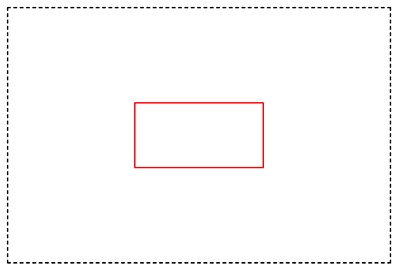

   ```
   # CSS
   .father {
       width: 300px;
       height: 200px;
       position: relative;
       border: 1px dashed black;
   }
   .son {
       top: 0;
       left: 0;
       right: 0;
       bottom: 0;
       position: absolute;
       margin: auto;
       width: 100px;
       height: 50px;
       border: 1px solid red;
   }
   
   # HTML
   <div class="father">
       <div class="son"></div>
   </div>
   ```


### 基本视觉格式化

> 内容来自《CSS权威指南》

CSS 基本视觉格式化是一套完整的 CSS 基本元素视觉显示规则，它的基本知识结构框架如图：

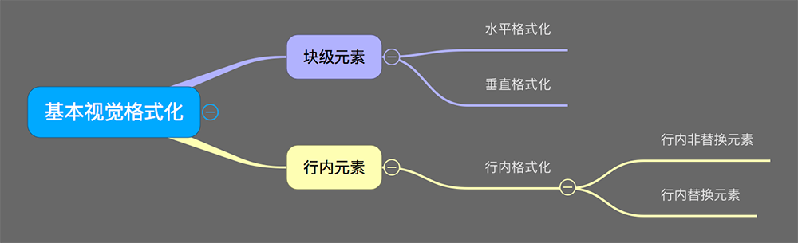

从格式化的对象上，基本视觉格式化可以分为两类：

* 块级元素，块级元素又有两方面的格式化：
  * 水平格式化
  * 垂直格式化
* 行内元素，行内元素需要进行行内格式化，行内格式化同样可以根据格式化对象的不同分为：
  * 行内可替换元素格式化
  * 行内不可替换元素格式化

#### 块级元素

##### 水平格式化

在水平格式化中，父元素 width 往往是确定的，通过计算可以得到内部子元素水平方向上的尺寸，即尺寸的确定是由外而内的，外部的尺寸决定内部的布局。

所以，掌握下面的公式可解决大部分内部元素尺寸问题：

```
width of ParaentElement = 
margin-left + border-left + padding-left +
width + 
padding-right + border-right + margin-right
```

* 使用 auto

  在 width、padding、border、margin 属性中，值一般为默认数值或设置的特定数值，只有 width、margin-left、margin-right 能够被设置为 auto，且三者的优先级为：

  ```
  width > (margin-left = margin-right)
  ```

  优先级高的属性将优先占据父元素 width 中尚未被占用的宽度，具体规则如下：

  * 如果三个值均不为 auto， 在 ltr 语言中，用户代理会强制将 margin-right 置为 auto
  * 如果有一个值为 auto，被设置为 auto 的属性会基于上面的公式自行确定长度
  * 如果有两个值为 auto
    * 如果 margin-left 和 margin-right 为 auto，该元素水平居中
    * 如果两个 auto 中包含 width，被设置为 auto 的 margin 值将会等于 0
  * 如果三个值均为 auto，则 margin-left 和 margin-right 都会等于 0

* 负边距

  一般的问题可以通过公式来解决

  * 示例1

    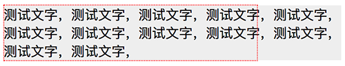

    ```
    # CSS
    .box {
        width: 300px;
        margin: auto;
        outline: 1px dotted red;
    }
    .box > p {
        margin: 0 -100px 0 0;
        background: #eeeeee;
    }
    
    # HMTL
    <div class="box">
        <p>测试文字，测试文字，测试文字，测试文字，测试文字，测试文字，测试文字，测试文字，测试文字，测试文字，测试文字，测试文字，</p>
    </div>
    ```

    其中，p 元素宽度计算：

    ```
    300 = width + (-100) => width = 400
    ```

    p 元素宽度为 400px，超出父元素 box 元素。

  * 示例2

    ```
    # CSS
    .box {
        width: 300px;
        margin: auto;
        outline: 1px dotted red;
    }
    .box > p {
        width: 400px;
        background: #eeeeee;
    }
    ```

    CSS 更改为如上时，得到的效果与示例1相同，此时未设置的 margin-right 值其实是 -100px。

* 百分数

  * width 的百分数值均以父元素宽度作为参考
    * 元素绝对定位时，相应的父元素尺寸取自 padding-box
    * 元素非绝对定位时，相应的父元素尺寸取自 content-box
  * margin、padding 的百分数值均以元素自身宽度作为参考

##### 垂直格式化

一定意义上，垂直方向的高度同样存在水平格式化类似的计算公式：

```
height of ParaentElement = 
margin-top + border-top + padding-top +
height + 
padding-bottom + border-bottom + margin-bottom
```

不过，在垂直格式化中，除非父元素被设置了特定 height，否则，父元素 height 通常都是 auto 的。此时，内部元素尺寸由于自身内容的增加而变高，父元素高度也被动的实时变化，即尺寸的确定是由内而外的，内部的尺寸决定外部的高度。

* 使用 auto

  如果块级正常流元素高度设置为 auto，并且只有块级子元素：

  * 默认高度是从最高块级子元素的**上边框边界**到最低块级子元素的**下边框边界**
  * 若块级元素本身有 padding 或者是 border 时，其高度为从最高子元素**上外边距边界**到最低子元素**下外边距边界**，加上块级元素本身的 padding-top、padding-bottom、border-top 和 border-bottom

  测试如下代码：

  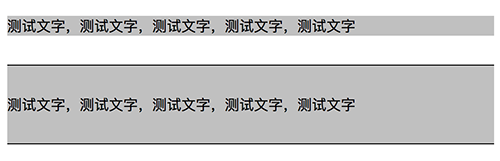

  ```
  # CSS
  .box {
      background: silver;
  }
  p {
      margin: 2em 0;
  }
  
  # HTML
  <div class="box">
      <p>测试文字，测试文字，测试文字，测试文字，测试文字</p>
  </div>
  <div class="box" style="border-top: 1px solid; border-bottom: 1px solid;">
      <p>测试文字，测试文字，测试文字，测试文字，测试文字</p>
  </div>
  ```

* 外边距合并

  同一个 BFC 中的相邻子元素 margin 会合并，但是，BFC 元素本身不再与子元素发生 margin 合并

#### 行内元素

行内元素的基本布局：

```
{ 行框 { 行内框 { 内容区 } } }
```

其中：

* 行框

  包含该行中出现的行内框的最高点和最低点的最小框，每一个行框内会包含若干行内框

* 行内框

  对于不可替换元素：

  * 元素行内框高度等于 line-height
  * 外边距不会对行内框的高度产社任何影响，但会影响到行内框的宽度

  对于可替换元素：

  * 元素框高度等于内容区高度

* 内容区

  对于不可替换元素，内容区是各个字符的 em 框串在一起的框

  对于可替换元素，内容区是元素固有高度+可能有的内外边距和边框。

##### 行内不可替换元素

基本规则：

* 内容区高度由 font-size 值确定

* 行内框高度由 line-height 值确定。当 line-height 值小于 font-size 时，行间距会取得负值

  ```
  行间距 = line-height - font-size
  ```

  当行间距为负值时，元素行内框的顶端在内容区内部。

##### 行内可替换元素
基本规则：

* 内边距会在具体内容外插入空间
* 设置负外边距会减少行内框的大小
* 默认情况下，行内可替换元素位于基线上

#### 参考

* https://spades-s.github.io/2018-03-05-css%E6%9D%83%E5%A8%81%E6%8C%87%E5%8D%97-%E8%A7%86%E8%A7%89%E6%A0%BC%E5%BC%8F%E5%8C%96/

## 元素分类

HTML 元素有 2 种分类方式：

* 可替换性：可替换元素、不可替换元素
* 视觉显示：块级元素、内联元素、空元素

### 可替换性

#### 可替换元素

可替换元素就是浏览器根据元素的标签和属性，来决定元素的具体显示内容，当查看 html 代码时，往往看不到实际内容。例如：

* \ 标签：根据 src 属性的值来读取图片信息并显示出来
* \<input> 标签：根据 type 属性来决定是显示输入框，还是单选按钮等

还有 \<textarea>、\<select>、\<object> 等，这些元素往往没有实际的内容，即是一个空元素。

##### 特征

可替换元素的主要特点：

* 尺寸完全由内部元素决定，即便 display 为 block 亦是如此，可以测试 `display: block` 时的 textarea 元素
* 内容的外观不受页面上的 CSS 的影响，例如单复选框等，不能使用类如 `input[type='checkbox']{}` 的代码改变样式，只能通过浏览器提供的特定属性修改，例如高版本 IE 提供的 `::-ms-check{}`
* 一般具有内在尺寸和宽高比（auto时起作用），所以具有 width 和 height，可以设定。例如：
  * 在不指定 img 的 width 和 height 时，就按其内在尺寸显示，也就是图片被保存的时候的宽度和高度
  * 对于表单元素，浏览器也有默认的样式，包括宽度和高度
* 部分 CSS 属性样式拥有和普通不可替换元素不同的表现规则。例如，vertical-align 属性默认值为 baseline，但替换元素往往不可能含有字符 “x”，此时的基线以元素（比如图片）下边缘为准

##### 尺寸

> 来自《CSS世界》

可替换元素的尺寸有三类：

* 固有尺寸，元素内容作为独立文件存在时拥有的尺寸，比如图片或视频源文件尺寸；或者，元素不加任何样式限制时的默认尺寸，比如 \<input> 元素不加任何手动 CSS 限制独立存在页面上时的尺寸

* HTML 尺寸，通过 HTML 标签属性设置的尺寸，例如

  ```
  
  <input type="file" size="30">
  <textarea cols="20" rows="5></textarea>
  ```

* CSS 尺寸，通过 CSS ，比如 width/height/min-width/min-height 等，设置的尺寸

这三类尺寸的优先级：

```
CSS 尺寸 > HTML 尺寸 > 固有尺寸
```

未设置 HTML 尺寸和 CSS 尺寸时：

* 如果元素拥有固有尺寸，则使用固有尺寸，比如：
  * \ 使用图片的固有大小
  * \<video> 使用视频的固有大小
* 如果元素没有固有尺寸，或者 \、\<video> 没有设置 src
  * 则使用  300 × 150 像素，比如 \<video>、\<canvas>和 \<iframe> 皆是如此
  * 例外的是没有 src 属性的 img 元素 `` ，各个浏览器下 的尺寸表现各不相同：
    * IE，28 × 30，因为 IE 会自作主张插入一个默认图片
    * Chrome 0 × 0
    * Firefox 0 × 22，因为 Firefox 认为没有 src 属性的 img 元素就是个普通内联元素，与 span 无异，所以按照拥有幽灵空白节点空内联标签布局

#### 不可替换元素

大多数元素是不可替换元素，即其内容直接表现给用户。例如：

```
<p>段落的内容</p>
```

\<p> 是一个不可替换元素，文字“段落的内容”全被显示。

### 视觉显示

#### 块级元素

块级元素，block-level element，水平方向充满其父元素的内容区域（块级元素的流体特性），其元素框之前和之后生成“换行”，即默认独占一行，左右没有其他元素。

块级元素的主要功能是负责文档结构。

##### 范围

典型的块级元素有（基于 display 属性）：

* block：\<div>、\<p>、\<h1>到\<h6>
* table：\<table>
* list-item：\<li>

##### 应用

###### 清除浮动

基于块级元素的换行特性（独占一行，两侧无法容纳其它元素，后面元素必须换行开始），理论上块级元素都可以配合 clear 属性实现浮动清除。

```
<!-- HTML -->
<div class="box clear">
    
</div>

<!-- CSS -->
.box {
    padding: 10px;
    background-color: #cd0000;
}

.box > img {
    float: left;
}

.clear:after {
    content: "";
    display: table;
    clear: both;
}
```

#### 内联元素

内联元素不形成新内容块，且其元素框之前和之后不生成“换行”，即在其左右可以有其他元素，通常作为块级元素的后代，例如：\<a>、\<span>、\<strong> 等，都是典型的行内级元素。 此外，几乎所有的可替换元素都是内联元素，例如\、\<input>等。

内联元素的主要功能是负责文档内容。

##### 范围

典型的内联元素有（基于 display 属性）：

* inline：\<a>、\<span>、\<strong>、\、\<input>
* inline-block：\<button>
* inline-table
* inline-flex
* inline-grid

#### 空元素

没有内容的 HTML 元素，br、meta、hr、link ...

### 参考

* https://segmentfault.com/a/1190000006835284

## CSS Reset

HTML 标签在不同浏览器中不同的默认样式会带来兼容性问题，影响开发效率，目前，较为流行的解决方式是页面刚打开时就全部重置浏览器默认样式，这就是 css reset。

常见的 css reset 部分代码：

```
/* 是否重置盒模型有待斟酌 */
* {
    -webkit-box-sizing: border-box;
       -moz-box-sizing: border-box;
    				box-sizing: border-box;
}

*:before,
*:after {
    -webkit-box-sizing: border-box;
       -moz-box-sizing: border-box;
    				box-sizing: border-box;
}

body, div, dl, dt, dd, ul, ol, li, h1, h2, h3, h4, h5, h6, pre, code, form, fieldset, legend, input, button, textarea, p, blockquote, th, td {
    margin: 0;
    padding: 0;
}

body {
    background: #fff;
    color: #555;
    font-size: 14px;
    font-family: "Arial", "Microsoft YaHei", "黑体", "宋体", sans-serif;
}

td, th, caption {
    font-size: 14px;
}

h1, h2, h3, h4, h5, h6 {
    font-weight: normal;
    font-size: 100%;
}

address, caption, cite, code, dfn, em, strong, th, var {
    font-style: normal;
    font-weight: normal;
}

a {
    color: #555;
    text-decoration: none;
}

a:hover {
    text-decoration: underline;
}

img {
    border: none;
    vertical-align: middle;
}

ol, ul, li {
    list-style: none;
}

input, textarea, select, button {
    font: 14px "Arial", "Microsoft YaHei", "黑体", "宋体", sans-serif;
}

table {
    border-collapse: collapse;
}

html {
    overflow-y: scroll;
}

.clearfix:before,
.clearfix:after {
    content: " ";
    display: inline-block;
    height: 0;
    clear: both;
    visibility: hidden;
}

.clearfix {
    *zoom: 1;
}

...
```

css reset 的优点：

* 使 HTML 标签在不同浏览器中的样式趋于一致化

css reset 的缺点：

* 浪费性能，不论标签是否使用，几乎统一重置所有标签，文件笨重
* 缺乏弹性，使用到的 HTML 标签样式往往需要重新设定
* 由于样式继承，开发调试时出现大量的 css reset 样式，影响调试

### CSS Normalize

相对于 CSS reset，CSS Normalize 是为 HTML5 准备的优质替代方案，其最大特点就是保留 HTML 标签预设样式，仅针对不同浏览器与各版本间不相容的标签进行些微调整。

CSS Normalize 的优点：

* 保留有用的浏览器默认设置，而不是将其删除
* 为广泛的 HTML 元素提供了一般化的样式，且不会因为样式继承导致调试时样式杂乱
* 模块化，项目被拆分为多个相关却又独立的部分，可根据自己需要选择，文件很小
* 修正浏览器 Bug 与不一致，例如，IE９中 SVG 的溢出
* 有详细的文档来解释代码

CSS Normalize 的 [Github 地址](https://github.com/necolas/normalize.css) ，v8.0.1 中文注释版本：

```
/*! normalize.css v8.0.1 | MIT License | github.com/necolas/normalize.css */

/* Document
   ========================================================================== */

/**
 * 1. 更正所有浏览器中的行高
 * 2. 防止 iOS 横屏时字号放大
 */
html {
    line-height: 1.15; /* 1 */
    -webkit-text-size-adjust: 100%; /* 2 */
}

/* Sections/章节
   ========================================================================== */

/* 删除 body 默认 margin */
body {
    margin: 0;
}

/**
 * 在 IE 中一致地渲染`main`元素。
 */
main {
    display: block;
}

/* 更正 Chrome/Firefox/Safari 中 `section`/`article` 上下文中 `h1` 字体大小和边距 */
h1 {
    font-size: 2em;
    margin: 0.67em 0;
}

/* Grouping content/分组内容
   ========================================================================== */

/**
 * 1. 在 Firefox 中添加正确的盒尺寸
 * 2. 在 Edge 和 IE 中 overflow 时显示
 */
hr {
    box-sizing: content-box;    /* 1 */
    height: 0;                  /* 1 */
    overflow: visible;          /* 2 */
}

/**
 * 1. 更正所有浏览器中字体大小的继承和缩放
 * 2. 纠正所有浏览器中奇怪的`em`字体大小
 */
pre {
    font-family: monospace, monospace;  /* 1 */
    font-size: 1em;                     /* 2 */
}

/* Text-level semantics/文本级语义
   ========================================================================== */

/**
 * 删除 IE 10 中链接激活时的灰色背景
 */
a {
    background-color: transparent;
}

/**
 * 1. 移除Chrome 57-中的底部边框
 * 2. 在 Chrome，Edge，IE，Opera 和 Safari 中添加正确的文本修饰
 */
abbr[title] {
    border-bottom: none;                /* 1 */
    text-decoration: underline;         /* 2 */
    text-decoration: underline dotted;  /* 2 */
}

/* 在Chrome，Edge和Safari中添加正确的字体粗细 */
b,
strong {
    font-weight: bolder;
}

/**
 * 1. 更正所有浏览器中字体大小的继承和缩放
 * 2. 纠正所有浏览器中奇怪的`em`字体大小
 */
code,
kbd,
samp {
    font-family: monospace, monospace;  /* 1 */
    font-size: 1em;                     /* 2 */
}

/**
 * 在所有浏览器中添加正确的 font-size
 */
small {
    font-size: 80%;
}

/* 在所有浏览器中，阻止`sub`和`sup`元素影响行高 */
sub,
sup {
    font-size: 75%;
    line-height: 0;
    position: relative;
    vertical-align: baseline;
}

sub {
    bottom: -0.25em;
}

sup {
    top: -0.5em;
}

/* Embedded content/可替换内容
   ========================================================================== */

/* 删除 IE 10 中链接内图像的 border */
img {
    border-style: none;
}

/* Forms/表单
   ========================================================================== */

/**
 * 1. 更改所有浏览器中的字体样式
 * 2. 删除 Firefox 和 Safari 中的 margin
 */
button,
input,
optgroup,
select,
textarea {
    font-family: inherit;   /* 1 */
    font-size: 100%;        /* 1 */
    line-height: 1.15;      /* 1 */
    margin: 0;              /* 2 */
}

/* 在 IE 和 Edge 中显示 overflow */
button,
input { /* 1 */
    overflow: visible;
}

/* 删除 Edge，Firefox 和 IE 中的 text-transform 继承 */
button,
select { /* 1 */
    text-transform: none;
}

/* 纠正无法在 iOS 和 Safari 中设置可点击类型的样式 */
button,
[type="button"],
[type="reset"],
[type="submit"] {
    -webkit-appearance: button;
}

/* 在 Firefox 中删除 border 和 padding */
button::-moz-focus-inner,
[type="button"]::-moz-focus-inner,
[type="reset"]::-moz-focus-inner,
[type="submit"]::-moz-focus-inner {
    border-style: none;
    padding: 0;
}

/* 恢复上一个规则未设置的焦点样式 */
button:-moz-focusring,
[type="button"]:-moz-focusring,
[type="reset"]:-moz-focusring,
[type="submit"]:-moz-focusring {
    outline: 1px dotted ButtonText;
}

/* 纠正 Firefox 中的 padding */
fieldset {
    padding: 0.35em 0.75em 0.625em;
}

/**
 * 1. 更正 Edg e和 IE 中的文本换行
 * 2. 更正 IE 中 fieldset 元素的 color 值为 inherit
 * 3. 删除填充，以便开发人员在所有浏览器中清除`fieldset`元素时不会被捕获。
 */
legend {
    box-sizing: border-box; /* 1 */
    color: inherit; /* 2 */
    display: table; /* 1 */
    max-width: 100%; /* 1 */
    padding: 0; /* 3 */
    white-space: normal; /* 1 */
}

/* 在 Chrome，Firefox 和 Opera 中添加正确的 vertical-align 方式 */
progress {
    vertical-align: baseline;
}

/* 删除 IE 10+ 中默认垂直滚动条 */
textarea {
    overflow: auto;
}

/**
 * 1. 在 IE 10 中使用正确的盒尺寸
 * 2. 移除 IE 10 中的 padding
 */
[type="checkbox"],
[type="radio"] {
    box-sizing: border-box; /* 1 */
    padding: 0; /* 2 */
}

/* 更正 Chrome 中增量和减量按钮的光标样式 */
[type="number"]::-webkit-inner-spin-button,
[type="number"]::-webkit-outer-spin-button {
    height: auto;
}

/**
 * 1. 纠正 Chrome 和 Safari 中的奇怪外观
 * 2. 纠正 Safari 中的 outline 样式
 */
[type="search"] {
    -webkit-appearance: textfield; /* 1 */
    outline-offset: -2px; /* 2 */
}

/* 在 macOS 上删除 Chrome 和 Safari 中的内部 padding */

[type="search"]::-webkit-search-decoration {
    -webkit-appearance: none;
}

/**
 * 1. 纠正无法在 iOS 和 Safari 中设置可点击类型的样式
 * 2. 在 Safari 中将字体属性更改为“inherit”
 */
::-webkit-file-upload-button {
    -webkit-appearance: button; /* 1 */
    font: inherit; /* 2 */
}

/* Interactive/互动
   ========================================================================== */

/* 确保在 Edge, IE 10+, Firefox 中正确显示 */

details {
    display: block;
}

/* 确保所有浏览器中元素正确显示 */
summary {
    display: list-item;
}

/* Misc/杂项
   ========================================================================== */

/* 确保 IE 10+ 中元素正确显示 */
template {
    display: none;
}

/* 确保 IE 10+ 中元素正确显示 */
[hidden] {
    display: none;
}
```

## 层叠上下文

格式化上下文是页面中一个独立的**渲染区域**，而层叠上下文是页面中一个独立的**渲染层级**，即相对于该上下文之外的元素，层叠上下文在 Z 轴方向上，作为一个整体，表现为同一层级。

### 创建条件

当元素具备下列条件之一时，会创建层叠上下文：

* 根元素（html 元素）
* opacity 属性值小于 1 的元素
* position 属性值不是默认 static 的元素
  * 非固定定位（fixed ）需要同时满足 z-index 值不为默认值 auto
* CSS 3 新属性
  * z-index 属性值不为 auto 的 flex 项目 (flex item)，即 display 为 flex/inline-flex 的元素的子元素
  * transform 属性值不为 none 的元素
  * mix-blend-mode 属性值不为 normal 的元素
  * filter 属性值不为 none 的元素
  * perspective 属性值不为 none 的元素
  * isolation 属性被设置为 isolate 的元素
  * 在 will-change 中指定了任意 CSS 属性，即便你没有直接指定这些属性的值（参考[这篇文章](https://dev.opera.com/articles/css-will-change-property/)）
  * -webkit-overflow-scrolling 属性被设置 touch 的元素

个人认为，创建层叠上下文的元素往往具有同文档元素明显的视觉差异或动态的视觉变化，需要独立渲染。

### 层叠顺序

HTML 元素的层叠顺序的计算规则：

* **同一层叠上下文所有元素作为一个整体，以层叠上下文创建元素为准，参与父层叠上下文元素的层叠排序。**层叠排序规则：

  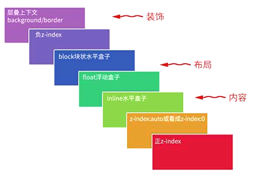

  * 第一层，父层叠上下文元素的 background 和 border
  * 第二层，z-index 为负数的定位元素
  * 第三层，块级盒子，display 为 block 的元素
  * 第四层，浮动盒子，具有 float 属性的元素
  * 第五层，行内盒子或行内块级盒子，display 为 inline/inline-block/inline-table 的元素
  * 第六层，z-index 为 0/auto 的定位元素
  * 第七层，z-index 为正数的定位元素

* 子层叠上下文内扩展新的子层，同样按照上图计算层叠顺序，如此递归，直至最内层子元素

同时，需要注意的是：

* 同一层叠上下文作为一个整体，对外表现为同一层级，故不同父层叠上下文内的元素比较层叠顺序没有意义
* 如果两个元素具有相同的层叠顺序，位置在后面的元素覆盖在前面的元素之上
* 层叠上下文可以阻断元素的混合模式 **?**

### 最佳实践

基于层叠规则，定位元素即便不设置 z-index，也拥有相对较高的层叠水平，避免多余不必要的 z-index 带来不断增加的 z-index 值！

### 应用举例

1. 实例

   ```
   <!-- 美女在上 -->
   <div style="position:relative; z-index:auto;">
       <!-- 美女 -->
       
   </div>
   <div style="position:relative; z-index:auto;">
       <!-- 美景 -->
       
   </div>
   ```

   **美女在上**：因为外层 div 元素不创建层叠上下文，所以两个内层 img 元素属于同一父层叠上下文元素，进行层叠计算，z-index 值为 2 的美女图片在上

   ```
   <!-- 美景在上 -->
   <div style="position:relative; z-index:0;">
       <!-- 美女 -->
       
   </div>
   <div style="position:relative; z-index:auto;">
       <!-- 美景 -->
       
   </div>
   ```

   **美景在上**：第一个 div 元素创建层叠上下文，第二个 div 元素不创建，所以，第一个 div 元素和第二个 div 内的 img 元素属于同一父层叠上下文元素，进行层叠计算，z-index 值为 1 的美景图片在上

   ```
   <!-- 美女在上 -->
   <div style="position:relative; z-index:2;">
       <!-- 美女 -->
       
   </div>
   <div style="position:relative; z-index:auto;">
       <!-- 美景 -->
       
   </div>
   ```

   **美女在上**：第一个 div 元素创建层叠上下文，第二个 div 元素不创建，所以，第一个 div 元素和第二个 div 内的 img 元素属于同一父层叠上下文元素，进行层叠计算，z-index 值为 2 的第一个 div 层叠上下文整体在上

   ```
   <!-- 美景在上 -->
   <div style="position:relative; z-index:0;">
       <!-- 美女 -->
       
   </div>
   <div style="position:relative; z-index:0;">
       <!-- 美景 -->
       
   </div>
   ```

   **美景在上**：第一个 div 元素和第二个 div 元素均创建层叠上下文，同在一个父层叠上下文内，进行层叠计算，两者层叠优先级相同，故位于后面的 div 元素层级较高

   ```
   <!-- 美女在上 -->
   <div style="position:relative; z-index:1;">
       <!-- 美女 -->
       
   </div>
   <div style="position:relative; z-index:0;">
       <!-- 美景 -->
       
   </div>
   ```

   **美女在上**：还说啥呢？

2. 实例

   

   ```
   # CSS
   div {
       width: 200px;
       background: #ccc;
       /* filter: blur(5px); */
       /* opacity: 0.5; */
       /* transform: scale(1); */
       /* mix-blend-mode: darken; */
   }
   img {
       width: 100%;
       right: -100px;
       position: relative;
       z-index: -1;
       vertical-align: top;	/* 放置图片底部 5px */
   }
   
   # HTML
   <div>
       
   </div>
   ```

   div 元素与其内部创建层叠上下文的 img 元素同属一个父层叠上下文，进行并列层叠计算，display 为 block 的 div 元素层叠顺序较高，所以覆盖遮挡了 z-index 为负数的 img 元素

   

   修改 div 元素样式，比如增加 transform 属性，使 div 元素也创建层叠上下文，依据层叠顺序计算规则，创建层叠上下文元素的 background 和 border 层级最低，所以 div 元素背景将不再遮挡图片

### 参考

* https://www.zhangxinxu.com/wordpress/2016/01/understand-css-stacking-context-order-z-index/

## 伪类和伪元素

CSS 引入伪类和伪元素的概念是为了格式化文档树以外的信息。也就是说，伪类和伪元素是用来修饰不在文档树中的部分，比如，一句话中的第一个字母，或者是列表中的第一个元素（注：**不明白？**）。

### 伪类

伪类用于当元素处于某种状态或结构位置时，为其添加对应的样式。

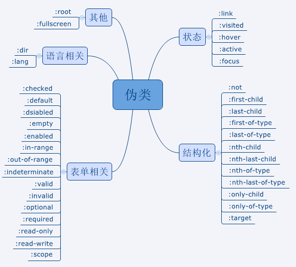

其可以分为五类：

* 状态伪类
* 结构化伪类
* 表单相关
* 语言相关
* 其它

### 伪元素

伪元素用于创建一些不在文档树中的元素，并为其添加样式。

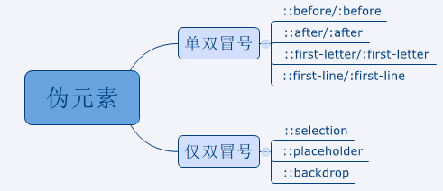

### 参考

* https://segmentfault.com/a/1190000013737796

## Pre/Post处理

预处理，定义了一种新的语言，为 CSS 增加一些编程特性，将 CSS 作为目标生成文件，例如，Sass（SCSS）、LESS、Stylus ...

后处理，直接对 CSS 进行处理，并最终生成 CSS 的处理器，属于广义上的 CSS 预处理器。 最典型的例子是 CSS 压缩工具 clean-css、Autoprefixer ...

### PostCss

PostCSS 本身是一个功能单一的工具，只是提供了一种用 JS 处理 CSS 的方式。PostCSS 真正的强大之处在于其不断发展的插件体系。

PostCSS 不能简单的被归类为 CSS 预处理器或者后处理器，其本身能执行的任务非常多，通过强大的插件体系，它可以同时覆盖传统意义上的预处理和后处理功能，只不过，主流的使用方式是将其作为 Css 的 Babel 使用，即用更贴近未来 Css 标准的方式来写 Css。

PostCSS 的工作流程是：

* 把 CSS 代码解析成 JS 可操作的抽象语法树（AST）结构
* 把 AST 交由插件来进行处理，插件能进行的操作是多种多样的，比如：
  * 可以支持变量和混入（mixin）
  * 增加浏览器相关的声明前缀
  * 将使用将来 CSS 规范的样式规则转译成当前的 CSS 规范支持的格式，从这个角度出发，PostCSS 至于 Css，类似于 Babel 至于 JS
* 由 AST 生成最终供各种浏览器使用的 Css

#### 使用

PostCSS 一般不能单独使用，需要与构建工具（例如Webpack、Grunt、Gulp等）集成以完成任务，其基本使用流程为（以Webpack为例）：

1. 安装插件

   ```
   npm install --save-dev postcss-loader postcss-preset-env
   ```

2. 配置 postcss.config.js

   ```
   const postcssPresetEnv = require('postcss-preset-env');
   
   module.exports = {
       plugins: [
           postcssPresetEnv({
               stage: 3,
               features: {
                   'nesting-rules': true
               },
               autoprefixer: {
                   browsers: [
                       'IE >= 8',
                       'Android >= 4.0'
                   ]
               }
           })
       ]
   };
   ```

3. webpack.config.js 中配置 postcss-loader

   ```
   module.exports = {
       ...
       module: {
           rules: [
               ...
               {
                   test: /\.css$|\.pcss$/,
                   use: ExtractTextPlugin.extract({
                       use: ['css-loader?minimize', 'postcss-loader'],
                       fallback: "vue-style-loader"
                   })
               }
           ]
       },
       ...
   };
   ```

#### 参考

* [PostCss配置指南](https://github.com/ecmadao/Coding-Guide/blob/master/Notes/CSS/PostCSS%E9%85%8D%E7%BD%AE%E6%8C%87%E5%8C%97.md)
* https://github.com/anjia/blog/issues/1
* https://www.ibm.com/developerworks/cn/web/1604-postcss-css/index.html
* https://www.w3cplus.com/blog/tags/516.html
* https://blog.csdn.net/yushuangyushuang/article/details/79209752


## 属性学习


### B

#### background-attachment

background-attachment 属性设置背景图像是否固定或者随着页面的其余部分滚动。支持的属性值：

* scroll，默认值，背景图像会随着页面其余部分的滚动而移动
* fixed，当页面的其余部分滚动时，背景图像不会移动。

#### background-clip

background-clip 属性规定背景的绘制区域。支持属性值：

* border-box，背景被裁剪到边框盒
* padding-box，背景被裁剪到内边距框
* content-box，背景被裁剪到内容框

##### 应用

1. CSS 实现如图菜单标识 - 三道横杠

   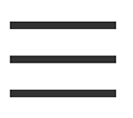

   ```
   # HTML
   <i class="icon-menu"></i>
   
   # CSS
   .icon-menu {
       display: inline-block;
       width: 140px;
       height: 10px;
       padding: 35px 0;
       border-top: 10px solid;
       border-bottom: 10px solid;
       background-color: currentColor;
       background-clip: content-box;
   }
   ```

2. CSS 实现如图实心圆环

   

   ```
   # HTML
   <i class="icon-dot"></i>
   
   # CSS
   .icon-dot {
       display: inline-block;
       width: 100px;
       height: 100px;
       padding: 10px;
       border: 10px solid;    
       border-radius: 50%;
       background-color: currentColor;
       background-clip: content-box;
   }
   ```


#### border-image

border-image 属性允许在元素的边框上绘制图像。它是一个符合属性，支持 5 个分属性。语法：

```
border-image: <border-image-source> 
							|| <border-image-slice> 
							[ / <border-image-width> | / <border-image-width>? / <border-image-outset> ]? 
							|| <border-image-repeat>
```

需要注意的是：

* border-image-source 的值为 none 或者图片不能显示，则将应用 border-style
* 可参考 https://aotu.io/notes/2016/11/02/border-image/index.html

##### border-image-source

border-image-source 属性声明元素的边框图片。语法：

```
border-image: none | <image>
```

##### border-image-slice

border-image-slice 属性声明图片的分割方式，即通过 top、right、bottom、left 顺序的四条线将边框图片分割成 9 块，然后分别应用到边框对应的区域。语法：

```
bordre-image-slice [<number> | <percentage>]{1,4} && fill?
```

需要注意的是：

* top、right、bottom、left 值分别是到对应边的距离，单位像素，设置不带单位的数值或百分比
* fill 用于指定使用图片最中间的分割块作为元素的背景

##### border-image-width

border-image-width 属性声明图像边框宽度。语法：

```
border-image-width: [ <length> | <percentage> | <number> | auto ]{1,4}
```

* length，带单位的尺寸值
* percentage，百分比
* number，不带单位的数字，它表示 border-width 的倍数
* auto，使用 border-image-slice 的值

需要注意的是：

* border-image-width 大于 border-width 时，边框图片将向内部 (padding/content) 扩展

##### border-image-outset

border-image-outset 属性声明边框图像可超出边框盒的大小，通过该值可以将边框图片区域延伸到 border-box 之外。语法：

```
border-image-outset: [ <length> | <number> ]{1,4}
```

##### border-image-repeat

border-image-repeat 属性声明 slice 后的图片如何填充边框。语法：

```
border-image-repeat: [ stretch | repeat | round | space ]{1,2}
```

* stretch，拉伸图片以填充边框，默认值
* repeat，平铺图片以填充边框
* round，平铺图像，当不能整数次平铺时，根据情况放大或缩小图像
* space，平铺图像 ，当不能整数次平铺时，会用空白间隙填充在图像周围，不会放大或缩小图像


### P

#### pointer-events


### T

#### table-layout

table-layout 属性用来设置 table 布局（单元格、行、列）算法规则。支持的属性值：

* automatic，默认，列的宽度由列单元格中没有折行的最宽的内容决定

  注意，此算法效率较低，因为它需要获取表格所有内容后才能决定布局

* fixed，固定，列宽仅由列宽度、表格宽度、表格边框宽度、单元格间距决定，与单元格的内容无关

  相对于 automatic，用户代理在接收到第一行后就可以对表格进行布局，进而显示表格

* inherit，继承，从父元素继承该属性值

  注意，所有 IE 浏览器均不支持该属性值

### W

#### will-change

will-change 属性告知浏览器元素发生变化的地方，这样浏览器可以在元素属性真正发生变化之前，将部分复杂计算工作提前准备好，以提高性能。支持的属性值：

* auto，不指定变化属性，浏览器需要自己去猜，然后使用浏览器经常使用的一些常规方法优化
* contents，元素内容会发生改变或产生动画
* scroll-position，元素滚动位置会发生变化，即会发生滚动
* \<custom-ident>，开发者希望在不久后改变指定的属性名或者使之产生动画。如果属性名是简写，则代表所有与之对应的简写或者全写的属性。

注意事项：

* 提前告知，如果需要使用 will-change，需要提前一点时间设置，浏览器需要准备
* 不要过分使用，如果元素本身不存在性能问题，不要使用；逼不得已使用时，不要一开始就设置该属性，且使用完成时及时清除。因为 will-change 比较占用资源，过分使用反而适得其反。

正确使用：

1. 在伪类中使用，比如 :hover 时设置，这样鼠标移除时可及时清除

   ```
   .will-change-parent:hover .will-change {
   	will-change: transform;
   }
   
   .will-change {
   	transition: transform 0.3s;
   }
   
   .will-change:hover {
   	transform: scale(1.5);
   }
   ```

2. 使用 JS 添加 will-change，事件或动画完毕，及时清除

   ```
   dom.onmousedown = function() {
       target.style.willChange = 'transform';
   };
   
   dom.onclick = function() {
       // target动画哔哩哔哩...
   };
   
   target.onanimationend = function() {
       // 动画结束回调，移除will-change
       this.style.willChange = 'auto';
   };
   ```

#### word-break

word-break 属性指定怎样在单词内断行。支持的属性值：

* normal

  使用默认的断行规则。

* break-all

  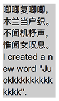

  对于non-CJK (CJK 指中文/日文/韩文) 文本，可在任意字符间断行

* keep-all

  CJK 文本不断行。 Non-CJK 文本表现同 normal

#### word-wrap

word-wrap 属性设置长单词或 URL 地址换行规则。由于与 word-break 过于接近，CSS 3 中改名为 overflow-wrap（浏览器支持度还不够），支持的属性值：

* normal

  只在允许的断字点换行（浏览器保持默认处理）

* break-word

  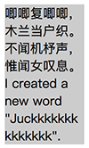

  在长单词或 URL 地址内部进行换行。与 `word-break: break-all` 的区别：

  * word-break: break-all，断开一切，不论单词长短，相对行宽控制较一致，较为美观
  * word-wrap: break-word，更温柔一些，主要截断相对较长的单词，行宽控制不是很一致，美观度较差

#### white-space

white-space 属性设置如何处理元素中的空白。

```
# HTML
<div class="test">
    唧唧复唧唧，木兰当户织。
    不闻机杼声，惟闻女叹息。<br/>问女何所思，问女何所忆。女亦无所思，女亦无所忆。
</div>

# CSS
.test {
    width: 100px;
    background: #ccc;
    white-space: normal;
}
```

支持的属性值：

* normal

  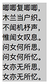

  合并换行符、空格、制表符，文字作必要换行

* nowrap

  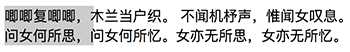

  合并换行符、空格、制表符，文字不作必要换行

* pre

  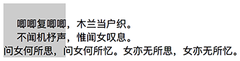

  不合并换行符、空格、制表符，文字不作必要换行

* pre-wrap

  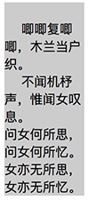

  不合并换行符、空格、制表符，文字作必要换行

* pre-line

  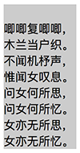

  不合并换行符，但合并空格、制表符，文字作必要换行

|          | 换行符 | 空格和制表符 | 文字换行 |
| -------- | ------ | ------------ | -------- |
| normal   | 合并   | 合并         | 换行     |
| nowrap   | 合并   | 合并         | 不换行   |
| pre      | 保留   | 保留         | 不换行   |
| pre-wrap | 保留   | 保留         | 换行     |
| pre-line | 保留   | 合并         | 换行     |

##### 应用

1. 内联元素连续不换行，例如区域滚动

   ```
   # HTML
   <div class="wrap">
       <ul>
           <li></li>
           <li></li>
           <li></li>
           <li></li>
           <li></li>
       </ul>
   </div>
   
   # CSS
   .wrap {
       width: 300px;
       height: 200px;
       overflow-x: scroll;
       overflow-y: hidden;
   }
   
   .wrap ul {
       width: auto;
       display: inline-block;
       white-space: nowrap;
   }
   
   .wrap li {
       display: inline-block;
   }
   
   .wrap li img {
       height: 200px;
       vertical-align: top;
   }
   ```

#### writing-mode

writing-mode 属性定义了文本在水平或垂直方向上如何排布。支持的属性值：

| 属性值        | 说明                                                 |
| ------------- | ---------------------------------------------------- |
| horizontal-tb | 水平方向自上而下的书写方式，即 left-right-top-bottom |
| vertical-lr   | 垂直方向自左而右的书写方式，即 top-bottom-left-right |
| vertical-rl   | 垂直方向自右而左的书写方式，即 top-bottom-right-left |


