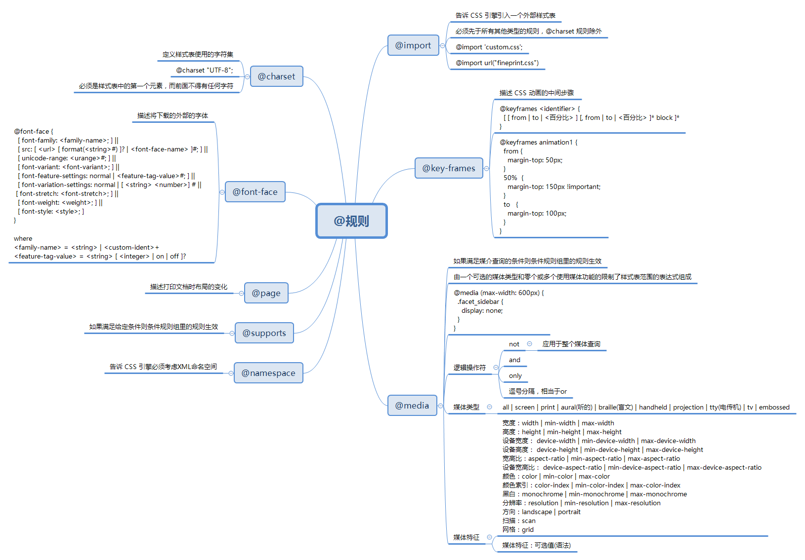
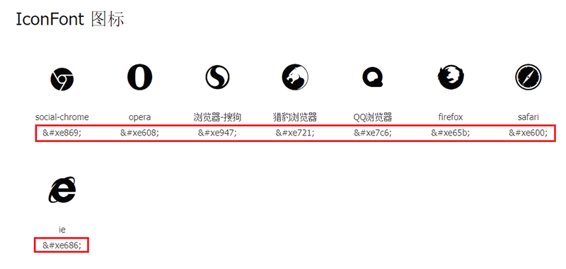

## @规则

@规则是 CSS 中被整体应用到某一特定事物的属性或属性集合。一个@规则就是一个 CSS 语句，以@符号开头，后跟一个标识符，并包括直到下一个分号或 CSS 块的所有内容。

常用@规则：



- @charset，指定样式表使用的字符编码
- @import，告诉 CSS 引擎引入一个外部样式表
- @namespace，告诉 CSS 引擎必须考虑 XML 命名空间
- 嵌套@规则，是嵌套语句的子集，不仅可以作为样式表里的一个语句，也可以用在条件规则组里：
  - @media，基于媒介查询结果，选择性的应用一个规则集合
  - @page，描述打印文档时布局的变化
  - @font-face，描述将下载的外部字体
  - @keyframes，描述 CSS 动画的中间步骤
  - @supports，如果环境支持给定条件，则应用规则组里的规则
  - @document，如果文档样式表满足给定条件，则应用规则组里的规则 (推延至 CSS Level 4 规范)

在@规则中，每条@规则都有不同的语法。不过，其中有一些拥有相同的语法，即在特定条件为 true 时，执行一个属性集合，而且它们还可以嵌套，这类@规则就是**条件规则组**。条件规则组由 CSS Level 3 定义，包括：

- @media
- @supports
- @document（推迟至 CSS Level 4 规范）

### @charset

@charset 规则，指定样式表使用的字符编码。

#### 特征

@charset 规则的基本特征：

- 必须是样式表第一个元素，前面不得有任何字符
- 不是嵌套语句，不能在@规则条件组中使用
- 如果有多个 @charset 声明，使用第一个
- 不能在 HTML 元素或 HTML 页面的 \<style> 元素内的使用

#### 语法

@charset 规则的语法格式：

```
@charset "<charset>";
```

示例：

```
@charset "UTF-8";
@charset "utf-8";		/* 注意，大小写不敏感 */ 
```

### @import

@import 规则，告诉 CSS 引擎引入一个外部样式表。

#### 特征

@import 规则的基本特征：

- 必须在 @charset 规则之后，所有其他类型规则之前

#### 语法

@import 规则的语法格式：

```
@import url list-of-media-queries;
```

其中：

- url，必需，引入资源，可以是相对路径或绝对路径
- **list-of-media-queries，可选，逗号分隔的媒体查询条件列表。注意：如果不支持列表中任何一条媒体查询条件，浏览器就不会引入 url 指明的 CSS 文件**

示例：

```
@import './common.css';
```

更多示例请查看 [MDN](https://developer.mozilla.org/zh-CN/docs/Web/CSS/@import)

### @media

@media 规则，基于媒介查询结果，选择性的应用一个规则集合。

#### 特征

@media 规则的基本特征：

- 在 HTML 中，可以作为标签 \<link> 的属性使用
- 在样式表中，可以独立使用，也可以在其它@规则条件组中嵌套使用

#### 语法

@media 规则由一个或多个媒体查询组成，每个媒体查询包含一个可选的媒体类型和若干媒体特性。多个查询可通过使用逻辑运算符以多种方式组合起来，且对大小写敏感。

常用媒介类型：

- all，所有设备
- print，打印设备
- screen，电脑屏幕

示例：

```
/* Media query */
@media screen and (min-width: 900px) {
    article {
    	padding: 1rem 3rem;
    }
}

/* Nested media query */
@supports (display: flex) {
    @media screen and (min-width: 900px) {
        article {
        	display: flex;
        }
    }
}

/* 作为 link 标签属性使用 */
<link rel="stylesheet" media="screen and (min-width: 900px)" href="./a.css" />
```

### @font-face

@font-face 规则，描述将下载的外部字体。

#### 特征

@font-face 规则的基本特征：

- 可以放在在CSS的最顶层，也可以在其它@规则条件组中嵌套使用

#### 语法

@font-face 规则的语法格式：

```
@font-face {
  [ font-family: <family-name>; ] ||
  [ src: <src>; ] ||
  [ unicode-range: <unicode-range>; ] ||
  [ font-variant: <font-variant>; ] ||
  [ font-feature-settings: <font-feature-settings>; ] ||
  [ font-variation-settings: <font-variation-settings>; ] ||
  [ font-stretch: <font-stretch>; ] ||
  [ font-weight: <font-weight>; ] ||
  [ font-style: <font-style>; ]
}
```

其中：

- font-family，字体名称

- src，字体文件位置，语法格式：

  ```
  [ <url> [format("<string>")]? | local("<family-name>") ]
  ```

  - format("\<string>")，辅助函数，描述 url 资源类型，常用类型有 truetype、opentype、truetype-aat、embedded-opentype、svg 等
  - local("\<family-name>")，指定本地已安装字体

- 其它属性参见 [MDN](https://developer.mozilla.org/zh-CN/docs/Web/CSS/@font-face)

示例：

```
@font-face {
    font-family: "myico";
    src: url("/fonts/4/myico.eot");	/* IE9 兼容 */
    src: url("/fonts/4/myico.eot#iefix") format("embedded-opentype"),	/* IE6-IE8 */
         url("/fonts/4/myico.ttf") format("truetype"),	/* Webkit, Android, iOS */
         url("/fonts/4/myico.woff") format("woff");	/* 现代浏览器 */
}

.icon-home:before {
    font-size: 64px;
    font-family: myico;
    content: "家";
}
```

需要注意的是，一般 @font-face 规则会有两个 src 属性，主要是因为 IE9 无法正确解析多 url 的 src 属性

#### 应用

##### WebFont

通过 @font-face 规则加载的远程字体称为 WebFont。

WebFont 技术在西文网站中较为流行，例如英文，因为西文字母数量有限，字体文件不会很大，顶多几十 KB 而已。

相对而言，中文文字数量较多，字体文件动辄几 MB，影响网页性能和体验。不过，通过剔除不使用文字以及文件压缩，也可以控制中文字体文件在几十 KB 之内，可参见腾讯 ISUX 开发的中文字体压缩器 - [字蛛FontSpider](http://font-spider.org/) 。

##### IconFont

通过 @font-face 规则加载自定义字体实现的图标称之为 IconFont。

###### 特点

IconFont 的优点是：

- 矢量图形，可自由缩放，且不会模糊
- 容量比图片小，加载快
- 可以任意改变颜色

IconFont 的缺点是：

- 只能被渲染成单色或 CSS3 的渐变色
- 创作自已的字体图标很费时间，修改时成本较高

###### 原理

客户端软件在显示文字时，首先获取文字的字体，然后查询字体库，字体库可以是本地安装的，也可以是 @font-face 规则要求浏览器远程加载的。

字体库其实就是一个文字到图形的映射文件，比如，需要显示文字“家”时，客户端软件会查询字体库文件中“家”对应的图形，然后在屏幕上显示对应的图形。正是因为不同字体库中同一文字对应图形不同，客户端才可以显示出同一文字的不同字体。在 Web 中，我们通常使用 font-family 指定字体。

在 IconFont 中：

1. 通过 @font-face 规则加载远程字体文件，假如字体文件如图（注：& - 表示转移，#x - 表示十六进制）

   

2. 通常，使用伪元素显示字体图标

   ```
   # HTML
   <i class="icon icon-chrome"></i>
   
   # CSS
   .icon-chrome:before {
   	content: "\e869";	/* \表示十六进制 */
   }
   ```

3. 浏览器查询 IconFont 图标字体库，找到“&#xe869”对应的字体字形，然后显示

### @keyframes

@keyframes 规则，通过在动画序列中定义关键帧（或waypoints）的样式来控制 CSS 动画序列中的中间步骤。

#### 特征

@keyframes 规则的基本特征：

- JS 可通过 CSS 对象模型接口 [CSSKeyframesRule](https://developer.mozilla.org/zh-CN/docs/Web/API/CSSKeyframesRule) 来访问 @keyframes 

- 可以按任意顺序列出关键帧百分比，引擎会按照其应该发生的顺序来处理

- 关键帧中出现的 !important 关键词将会被忽略

- 如果关键帧使用了不能用作动画的属性样式，这些属性会被忽略，不过，支持的属性仍然是有效的

- 如果关键帧没有指定开始或结束状态（0%/from 和100%/to），引擎将使用元素的初始样式作为起始/结束状态（这个特征可用来设计从初始状态开始，最终回到初始状态的动画）

- 如果多个关键帧使用同一个名称，以最后一次定义的为准

- 如果一个关键帧中特定百分比被重复定义，以最后一次定义为准

- 如果一个关键帧中没有出现其他关键帧中的属性，这个属性将使用插值；如果该属性不能使用插值，则其会被忽略掉，例如：

  ```
  @keyframes identifier {
      0% { top: 0; left: 0; }
      30% { top: 50px; }
      68%, 72% { left: 50px; }
      100% { top: 100px; left: 100%; }
  }
  ```

#### 语法

@keyframes 规则的语法格式：

```
@keyframes <keyframes-name> {
		<keyframe-block-list>
}
```

其中：

- \<keyframes-name>，帧名称，必须符合 CSS 语法中对标识符的定义
- \<keyframe-block-list>，帧百分比列表，可以是无序的，可以用 from/to 代替 0%/100%

示例：

```
@keyframes slidein {
    from {
        margin-left: 100%;
        width: 300%;
    }

    to {
        margin-left: 0%;
        width: 100%;
    }
}

p {
    animation-duration: 3s;
    animation-name: slidein;
}
```

### @supports

@supports 规则，如果环境支持给定条件，则应用规则组里的规则

#### 特征

@supports 规则的基本特征：

- 可以放在在CSS的最顶层，也可以在其它@规则条件组中嵌套使用

#### 语法

@supports 规则的语法格式：

```
@supports <supports_condition> {
	/* specific rules */
}
```

其中：

- <supports_condition>，单个或者由逻辑运算符连接的条件，可以使用小括号调整条件优先级。常用的逻辑运算符：

  - not，不支持指定条件，例如

    ```
    not( transform-origin: 10em 10em 10em )
    not( not( transform-origin: 2px ) )
    (display: flexbox) and ( not (display: inline-grid) )
    ```

  - and，同时支持，例如：

    ```
    (display: table-cell) and (display: list-item)
    ```

  - or，多个中支持一个，例如：

    ```
    ( transform-style: preserve ) or ( -moz-transform-style: preserve )
    ```

示例：

1. 检测是否支持指定的 CSS 属性

   ```
   @supports (animation-name: test) {
       …
       @keyframes {
         …
       }
   }
   ```

2. 检测是否支持指定 CSS 属性或者其带前缀版本

   ```
   @supports ( (perspective: 10px) or (-moz-perspective: 10px) or (-webkit-perspective: 10px) or (-ms-perspective: 10px) or (-o-perspective: 10px) ) {
       …
   }
   ```

3. 检测是否不支持指定的CSS属性

   ```
   @supports ( not ((text-align-last:justify) or (-moz-text-align-last:justify) ){
       …
   }
   ```


