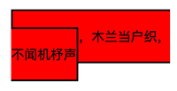

## 盒模型

CSS 基础框盒模型，CSS basic box model， 简称 CSS 盒模型，即将文档中的每个元素表示为一个个矩形的盒子，CSS 决定这些盒子的大小、位置以及属性（例如颜色、背景、边框尺寸…）。

### 组成部分


CSS 盒模型是浏览器渲染引擎对文档进行布局（lay out）时，所依据的标准之一。每个盒子从内到外依次由四个部分组成：内容区域、内边距区域、边框区域、外边距区域。

#### 内容区域

内容区域，content area，由内容边界限制，容纳元素的真实内容，文本、图像，或一个视频播放器等，它的尺寸为 content-box 宽度和 content-box 高度。

可以控制内容区域内容的 CSS 属性是 content

可以控制内容区域尺寸的 CSS 属性是 width、min-width、max-width 和 height、min-height、max-height

##### content

content 属性可以控制内容区域具体内容，尽管通常只是在 :before/:after 中使用，事实上，**可替换元素普遍也支持通过 content 属性设置/改变区域内容**。

```
# CSS
img {
	content: attr(alt);
}

# HTML

```

###### 应用

1. 辅助元素生成实现如图底边对齐，水平空间平均分配的布局（没弄明白？）

   

   ```
   # CSS
   .box {
       width: 256px;
       height: 256px;
       border-bottom: 1px dashed #ccc;
       text-align: justify;
   }
   
   .box:before {
       content: "";
       display: inline-block;
       height: 100%;
   }
   
   .box:after {
       content: "";
       display: inline-block;
       width: 100%;
   }
   
   .bar {
       display: inline-block;
       width: 20px;
       height: 0;
   }
   
   # HTML
   <div id="box" class="box">
       <i class="bar" style="height: 176px; background-color: rgb(98, 136, 120);"></i>
       <i class="bar" style="height: 241px; background-color: rgb(104, 8, 134);"></i>
       <i class="bar" style="height: 160px; background-color: rgb(120, 54, 2);"></i>
       <i class="bar" style="height: 121px; background-color: rgb(25, 20, 131);"></i>
       <i class="bar" style="height: 119px; background-color: rgb(129, 33, 130);"></i>
   </div>
   ```

2. 简单动态加载中

   ```
   # CSS
   dot {
       height: 1em;
       line-height: 1;
       text-align: left;
       vertical-align: -.25em;
       display: inline-block;
       overflow: hidden;
   }
   
   dot::before {
       display: block;
       content: '...\A..\A.';	/* 16进制A是ASCII换行 */
       white-space: pre-wrap;
       animation: dot 3s infinite step-start both;
   }
   
   @keyframes dot {
       33% {
           transform: translateY(-2em);
       }
       66% {
           transform: translateY(-1em);
       }
   }
   
   # HTML
   正在加载中<dot>...</dot>
   ```

3. content 开启闭合符合生成

   

   ```
   # CSS
   :lang(ch) {
       quotes: '“' '”';
   }
   
   :lang(en) {
       quotes: '"' '"';
   }
   
   :lang(no) {
       quotes: '«' '»';
   }
   
   /* 在 q 标签的前后插入引号 */
   p:before {
       content: open-quote;
   }
   
   p:after {
       content: close-quote;
   }
   
   # HTML
   <p lang="ch">这本书很赞!</p>
   <p lang="en">这本书很赞!</p>
   <p lang="no">这本书很赞!</p>
   ```

4. content 图片生成

   ```
   div:before {
   	content: url(./images/girl.jpg);
   }
   ```

5. content 属性值内容生成

   ```
   # CSS
   img::after {
   	content: attr(alt);
   }
   
   # HTML
   
   ```

6. content 计数器

   仅提示，使用时查询资料或《CSS世界》P65

7. content 内容混合，即以上 content 使用方式可以混合一起使用

   ```
    a:after {
    	content: "(" attr(href) ")";
    }
    
    q:before {
    	content: open-quote url(1.jpg);
    }
    
    .counter:before {
    	content: counters(wangxiaoer, '-') '. ';
    }
   ```

##### width

行内框，除可替换元素（例如 img）外，一般无法设置宽高，所以此节主要指块框和行内块状框元素的宽度设置。

###### auto

auto 是 width 属性的默认值，其常见表现主要分为两类：

1. 扩展到最大，其主要特点：

   * 元素尺寸由外部尺寸（父元素的尺寸）决定，表现为元素占满整行

   * 元素具备完整的流体特性，即布局引擎会实时自动计算元素宽度为：

     ```
     父元素width - 元素marin - 元素border - 元素padding
     ```

     以使得元素的整个盒模型宽度刚好为外部尺寸宽度；当元素margin、border 和 padding 发生变化时，元素 width 也会实时变化。

     这种完整的流体特性会在元素被明确设定了固定值的 width 时消失。

2. 收缩到最小，其主要特点：

   * 元素尺寸此时由内部尺寸（元素内部的内容）决定

   * 浮动、绝对定位、display 值为 inline-block/table 时，宽度通常表现为刚好容纳所包含的内容

   * 剩余空间不足以容纳内容时：

     * 内容会被尽可能的折断（中文默认可任意折断，英文单词往往不行，除非 word-break: break-all），如图。

       

     * 超出容器限制，当以上方式依旧无法容纳内容时。例如：

       

       ```
       # HTML
       <div class="father">
           <span class="child">恰如一江春水向东流，流到断崖也不回头</span>
       </div>
       
       # CSS
       .father {
           width: 150px;
           padding: 10px;
           background-color: #cd0000;
           white-space: nowrap;
       }
       
       .child {
           display: inline-block;
           padding: 5px;
           background-color: #f0f3f9;
       }
       ```

###### 固定值

相对于 auto，设定固定数字值 width 后，带来的最大破坏就是流动性丢失，从而导致不必要的 width、padding 以及 border 宽度的加减运算。

在 width 设置了固定大小值时，要保持元素尺寸的流动性，可选策略有两种：

- 宽度分离，增加一层标签元素，将 width 值设置在父元素上，而子元素将保留流动性
- box-sizing，设置元素 box-sizing 值为 border-box，迫使元素恢复一定的流动性，且不用增加外层标签

###### 百分比

设置为百分比的 width 值同样会导致流动性的丢失。

需要注意的是：盒模型的宽高使用百分比值时，元素是否绝对定位，依据父元素尺寸稍有差异

- 元素绝对定位时，相应的父元素尺寸取自 padding-box
- 元素非绝对定位时，相应的父元素尺寸取自 content-box

例如，如下代码的测试结果：


```
# HTML
<div class="box">
	<div class="child">高度100px</div>
</div>
<div class="box rel">
	<div class="child">高度160px</div>
</div>

# CSS
.box {
    height: 160px;
    padding: 30px;
    box-sizing: border-box;
    background-color: #beceeb;
}
.child {
    height: 100%;
    background: #cd0000;
}
.rel {
    position: relative;
}
.rel > .child {
    width: 100%;
    position: absolute;
}
```

###### 应用

1. 固定宽度区域内，文字较少时居中显示，较多时居左显示，不使用 JS

   ```
   # HTML
   <div class="box">
   	<p id="conMore" class="content">文字内容</p>
   </div>
   
   # CSS
   .box {
       width: 100px;
       background: #cd0000;
       text-align: center;
   }
   .content {
   		color: #fff;
       display: inline-block;		/* 利用收缩到最小 */
       text-align: left;
   }
   ```

2. 单层 HTML 标签实现下图的凹凸效果（Why?）

   

   ```
   # HTML
   <span class="ao"></span>
   <span class="tu"></span>
   
   # CSS
   .ao,
   .tu {
       width: 0;
       display: inline-block;
       font-size: 14px;
       line-height: 18px;
       margin: 35px;
   }
   
   .ao:before,
   .tu:before {
       outline: 2px solid #cd0000;
   }
   
   .ao:before {
       content: "love你love";
   }
   
   .tu {
       direction: rtl;
   }
   
   .tu:before {
       content: "我love你";
   }
   ```

##### height

行内元素，除可替换元素（例如 img）外，一般无法设置宽高，所以此节主要指块级元素的高度设置。

###### auto

height 的 auto 表现远比 width 的要简单的多，主要是因为页面的横向空间是有限的，垂直空间却是无限的。

在 height 值为默认值 auto 时，通常表现为内部尺寸特性，即元素高度随内容的增加而增大。当然，在特殊情况下，高度也会表现出外部尺寸特性，例如格式化高度

###### 百分比

对于 width，即便父元素的 width 为 auto，子元素的 width 百分比也是支持的，因为当包含块的宽度取决于子元素尺寸，而子元素宽度又设置为百分比时在 CSS 2.1 中是未定义的，测试发现浏览器目前统一的处理方式是：

1. 将子元素为百分比的 width 值改为 auto 进行计算，得到父元素宽度
2. 再用父元素宽度值乘以相应百分比作为子元素宽度

对于 height，CSS 2.1 中明确指定如果元素高度未显式指定，且又非绝对定位时，计算值按 auto 处理。所以，如果子元素高度设置了百分比，则 `auto × 百分比 = NaN` 。也因此，要想子元素值为百分比的 height 值有效，其父元素必需具有确定的最终高度计算值。

关于 height 百分比，最经典的问题就是网页高度占满整个屏幕的问题，类似的代码：

```
# CSS
.wrap {
	height: 100%;
}

# HTML
<body>
    <div class="wrap"></div>
</body>
```

wrap 元素的高度最终为 0，因为 html 和 body 元素的高度默认值皆为 auto，表现出内部尺寸特性。使 wrap 元素高度 auto 属性值生效的具体方法：

1. 将 html 和 body 元素的高度显式设置为 100%。此时，html 元素的高度计算值为视口高度的 100%，body 元素的高度为 html 元素高度的 100%，最终使得 wrap 元素的父元素 body 具有明确的最终计算值。

   ```
   html, body {
       height: 100%;
   }
   ```

2. 使用绝对定位，即，使 wrap 元素相对于具有明确高度的视口进行定位

   ```
   .wrap {
   	height: 100%;
   	position: absolute;  /* 或fixed */
   }
   ```

##### min/max-*

为响应式而生的 min-width、min-height、max-width 和 max-height，往往出现在自适应布局或流式布局中，例如，相应式网页宽度：

```
body {
    min-width: 1200px;
    max-width: 1400px;
}
```

- 浏览器界面宽度 ≤ 1200px 时，body 宽度为 1200px
- 浏览器界面宽度 > 1200px 且 ＜ 1400px 时，body 宽度为浏览器界面宽度
- 浏览器界面宽度 ≥ 1400px 时，body 宽度为 1400px

###### 默认值

min-width 和 min-height 的默认值是 auto

max-width 和 max-height 的默认值是 none

###### 优先级

min/max-* 系列的层叠优先级：

```
min-* > max-* > !important
```

- min-* > max-*，例如：

  ```
  div {
      min-width: 500px;
      max-width: 200px;
  }
  ```

  div 元素的最终宽度为 500px

- max-* > !important，例如：

  ```
  # HTML
  
  
  # CSS
  img {
      max-width: 200px;
  }
  ```

  img 元素的最终宽度为 200px；

需要注意的是：尽管 CSS 的层叠优先级中，!important 属性样式具有最高的优先级，但是 min/max-* 系列的优先级还要在其之上。

####内边距区域

内边距区域，padding area，由内边距边界限制，扩展自内容区域，负责延伸内容区域的背景，填充元素内容与边框的间距，它的尺寸是 padding-box 宽度和 padding-box 高度；

可以控制内边距区域尺寸的 CSS 属性：

* padding
* padding-top、padding-right、padding-bottom、padding-left

##### padding

相对而言，除了行内框垂直方向的表现比较复杂外，padding 的使用通常比较简单。

需要特别注意的地方：

* padding 的百分比值，无论水平还是垂直方向，都是依据元素宽度计算的

* 很多元素默认内置特定的 padding 值

  * ol/ul 元素内置固定 px 的 padding-left，比如 Chrome 为 40px

  * 大部分的表单元素，比如

    * 所有浏览器下的 input/textarea、button、radio/checkbox；其中在 Firefox 下，必需通过以下 CSS 才可将 button 内边距置为 0：

      ```
      button::-moz-focus-inner {
          padding: 0;
      }
      ```

    * 部分浏览器下的 select 下拉菜单

* 当元素内部存在区域滚动时，IE/Firefox 会忽略 padding 的值。因为：

  * IE/Firefox 浏览器是子元素尺寸超过父元素 padding box 尺寸时触发父元素滚动条显示
  * 其它浏览器是子元素尺寸超过父元素 content box 尺寸时触发父元素滚动条显示

  测试代码：

  ```
  <div style="height:100px; padding:50px 0;">
      
  </div>
  ```

  

  IE/Firefox 浏览器的表现如上图，div 元素 50px 的 padding 未显示。所以，为了避免这种兼容性问题，最好使用 margin 属性实现滚动区域四周留白。

#### 边框区域

边框区域，border area，由边框边界限制，扩展自内边距区域，是容纳边框的区域，其尺寸为 border-box  宽度 和 border-box 高度；

可以控制边框区域尺寸的 CSS 属性：

* border
* border-width

##### border

需要注意的是：

* 在没有显式设置 border-color 时，同 outline、box-shadow、text-shadow 相似，取 color 值

#### 外边距区域

外边距区域，margin area ，由外边距边界限制，用空白区域扩展边框区域，以分开相邻的元素。它的尺寸为 margin-box 宽度和 margin-box 高度；

可以控制外边距区域尺寸的 CSS 属性：

* margin
* margin-top、margin-right、margin-bottom、margin-left

##### margin

###### auto

margin 默认值是 0，当值为 auto 时，会表现出一定的弹性，即会自动分配父元素相应尺寸的剩余空间。

测试代码：


```
# CSS
.father {
    width: 300px;
    background: #f0f3f9;
}
.son {
    width: 200px;
    height: 120px;
    margin-right: auto;
    background: #cd0000;
}

# HTML
<div class="father">
    <div class="son"></div>
</div>
```

###### 百分比

同 padding 一样，margin 的百分比值，无论水平还是垂直方向，都是依据元素宽度计算的

###### 负值

负值的 margin 最重要的特点就是：当 width 为 auto，元素表现出完整的流体特性时，负值的 margin 可以增加元素的 width；**不过无法增加 height，除非使用 writing-mode 改变流向为垂直流**。

测试代码：

```
# CSS
.wrap {
    width: 100px;
}
.wrap p {
    margin-left: -100px;
}

# HTML
<div class="wrap">
    <p></p>						// p的宽度为200px
</div>
```

###### 合并

margin 合并的必要条件：

* 块级元素，行内元素不存在 margin 合并
* 正常流，浮动和绝对定位时不存在 margin 合并
* 垂直方向

margin 合并的三种场景：

* 相邻兄弟元素

  ```
  # CSS
  p {
      margin: 10px 0;
  }
  
  # HTML
  <p>第一行</p>
  <p>第二行</p>
  ```

* 父元素和第一个子元素的 margin-top 或者和最后一个子元素的 margin-bottom

  ```
  <!-- 以下三种布局一样 -->
  <div class="father">
      <div class="son" style="margin-top:80px;"></div>
  </div>
  <div class="father" style="margin-top:80px;">
      <div class="son"></div>
  </div>
  <div class="father" style="margin-top:80px;">
      <div class="son" style="margin-top:80px;"></div>
  </div>
  ```

  禁止父子元素 margin 合并的方法：

  * 父元素设置 BFC，因为 BFC 元素不与子元素发生 margin 合并
  * 阻隔父子元素的 margin 接触
    * 父元素设置 border 或 padding
    * 父子元素之间添加行内元素

* 空元素 margin 合并

  **注意**：空元素 margin 最终是在父元素身上合并，例如以下代码，son 元素 margin-top 和 margin-bottom 还是 10px，但是 father 元素的高度因为 margin 合并只有 10px

  ```
  # CSS
  .father {
      overflow: hidden;
  }
  .son {
      margin: 10px 0;
  }
  
  # HTML
  <div class="father">
      <div class="son"></div>
  </div>
  ```

margin 合并的基本规则：

* 正正取最大值
* 正负值则相加
* 负负取最负值

###### 应用

1. 定宽容器实现三列等宽的子容器，子容器之间有固定间距

   ```
   # CSS
   .wrap {
       width: 340px;
   }
   ul, li {
       margin: 0;
       padding: 0;
   }
   ul {
       overflow: hidden;
       margin-right: -20px;
   }
   li {
       float: left;
       width: 100px;
       height: 20px;
       margin-right: 20px;
       background: red;
       list-style: none;
   }
   
   # HTML
   <div class="wrap">
       <ul>
           <li></li>
           <li></li>
           <li></li>
       </ul>
   </div>
   ```

2. 两栏（有背景色）弹性等高布局

   

   HTML：

   ```
   <div class="wrap">
       <div class="column-left">
           <p>唧唧复唧唧，</p>
           <p>木兰当户织。</p>
           <p>不闻机杼声，</p>
           <p>惟闻女叹息。</p>
       </div>
       <div class="column-right">
           <p>窗前明月光，</p>
           <p>低头思故乡，</p>
       </div>
   </div>
   ```

   **CSS 实现1**

   实现原理：通过表格

   ```
   .wrap {
       color: #fff;
       width: 100%;
       display: table;
       text-align: center;
   }
   
   .column-left,
   .column-right {
       width: 50%;
       display: table-cell;
   }
   
   .column-left {
       background: #34538b;
   }
   
   .column-right {
       background: #cd0000;
   }
   ```

   **CSS 实现2**

   实现原理：

   通过 `padding-bottom: 9999px;` 将栏目的高度增加 9999px，实现两个高度非常高的有背景色的 column；同时，使用 `margin-bottom: -9999px;` 通过向下负偏移抵消掉 padding-bottom 增加的元素高度，防止元素产生区域滚动。当栏目内容增加时，高度增加，向下偏移导致被隐藏的背景色逐渐露出。

   不过，通过查看两个栏目的盒模型尺寸发现，其实这两个栏目的实际高度并不相等，只是因为背景一致带来的视觉错觉。

   另外，这里的 padding-bottom 换成 border-bottom 也是可以的

   ```
   .wrap {
       color: #fff;
       overflow: hidden;
       text-align: center;
   }
   
   .column-left,
   .column-right {
       width: 50%;
       margin-bottom: -9999px;
       padding-bottom: 9999px;
   }
   
   .column-left {
       float: left;
       background: #34538b;
   }
   
   .column-right {
       float: right;
       background: #cd0000;
   }
   ```

### 表现模式

CSS 盒模型有两种表现模式：

* 标准模式，盒子尺寸由组成部分中的四个部分相加：

  ```
  size = content + padding + border + margin
  ```

* 怪异模式，主要出现在未正确设置 DTD 或 DOCTYPE 的早期 IE 中(≤ 8)，IE 在这种模式下不支持设置 padding 和 border 属性， content 的尺寸等同于标准模式下的 content + padding + border；此时，盒子尺寸也就只由 content-box 和 margin-box 两部分组成：

  ```
  size = content + margin
  ```

  不过，随着早期 IE 甚至整个 IE 浏览器被抛弃，这种模式也已经成为历史，了解即可。
  
  **注意：**这种行为与 `box-sizing: border-box;` 的直接效果是一样的

### 两层盒子

> 该部分内容来自《CSS 世界》

元素盒子通常有两种类型：块级元素和内联元素，块级元素主要负责文档结构，内联元素主要负责文档内容排布。但是，这两种盒子类型并不能 hold 所有场景，比如 display 的 inline-block、inline-table、list-item 等场景。

《CSS 世界》认为 CSS 元素均具有内外两层盒子：

* 外在盒子，负责盒子与其他元素盒子的关系，是换行显示还是一行显示
* 内在盒子，也称容器盒子，负责盒子自身的尺寸，盒子内部的内容呈现

因此，盒模型的 width、padding、border、margin 此时作用于内在盒子。

基于双层盒模式，display 的值可以拆解为：

* block，等同于 block-block，内外盒子均为 block
* inline，等同于 inline-inline，内外盒子均为 inline
* inline-block，外在盒子 inline，内在盒子为 block
* inline-table，外在盒子 inline，内在盒子为 table

同时，由于尺寸属性通常设置于块级元素，所以对于两层盒子模式，width/height 属性也就作用于内在盒子上。

此外，对于 display 的 list-item 属性，由于需要显示项目符号，需要一个额外的附加盒子（或称标记盒子）来单独放置项目符号。

### 盒子类型

盒子，box，也译作框。常见盒子类型有三种：

* 块框，或称块盒、块级盒子
* 行内框，或称行内盒子、行内级盒
* 行内块状框，或称行内块状盒子

使用以下代码测试三种盒子类型表现：

```
# CSS
p {
    padding: 1em;
    border: 1px solid black;
}
span {
    padding: 0.5em;
    border: 1px solid green;

    /* That makes the box visible, regardless of its type */
    background-color: yellow;
}
.inline {
    display: inline;
}
.block {
    display: block;
}
.inline-block {
    display: inline-block;
}

# HTML
<p>
    唧唧复唧唧，木兰当户织。
    <span class="block">不闻机杼声，惟闻女叹息。</span>
    问女何所思，问女何所忆。
</p>
<p>
    唧唧复唧唧，木兰当户织。
    <span class="inline">不闻机杼声，惟闻女叹息。</span>
    问女何所思，问女何所忆。
</p>
<p>
    唧唧复唧唧，木兰当户织。
    <span class="inline-block">不闻机杼声，惟闻女叹息。</span>
    问女何所思，问女何所忆。
</p>
```

随着屏幕可用宽度逐渐减小的表现如下：


#### 块框

块框，block box，块级元素生成的框。

##### 特征

块框的基本特征：

* 独立占用父元素横向空间，前后皆会换行，独成一行；当空间不足时，内部内容换行
* 可以设置 width/height、padding、border、margin
* 可生成块框 display 值： block 

#### 行内框

行内框，inline box，行内元素生成的框。

##### 特征

行内框的基本特征：

* 随内部内容流动，和其它行内元素同行排列；当空间不足时：
  * 一般情况下，**行内框随内容被分割/折断，注意不是换行**，因为 margin、padding 和 border 在折断处没有视觉效果
  * 如果因如下情况不能分割，行内框会溢出行框
    * 行内框只包含单个字符
    * 语言特殊的断字规则不允许在行内框里换行
    * 受到属性值为 pre 或 nowrap 的 white-space 特性的影响
* 除可替换元素外，不可以设置 width/height，但可以设置 padding、border 和 margin；水平方向会更新周围元素位置，但垂直方向不会
  * 不可替换元素的行内框高度等于  line-height 值
  * 可替换元素的行内框高度等于内容区高度
* 可生成行内框 display 值： inline 

需要特别强调的是：

* 行内框垂直方向的 padding（padding-top/padding-bottom）、border（border-top/border-bottom）依旧是起作用的，扩大了的背景色区域证明了这一点；只不过，在垂直方向上，它们只影响行内框自身，不会影响框外的元素布局，即垂直方向上的 padding、border 和 margin 对元素布局没有影响

* 行内框因空间不足被折断时，折断处后部的内容表现的像换行效果，实际上垂直方向上的 padding、border 和 margin 都不会起作用，行内框只是按内容区高度进行“换行”，所以可能会导致行内框与其他行内框或者折断后的自身重叠，如果有背景色且区域较大时，重叠导致遮挡，会出现“莫名其妙”的效果，例如：

  

  ```
  # CSS
  .wrap span {
      border: 2px solid #000;
      padding: 20px 0;
      background: red;
  }
  
  # HTML
  <div class="wrap">
      <span>唧唧复唧唧，木兰当户织，不闻机杼声</span>
  </div>
  ```

* 尽管垂直方向上 padding、border 不影响布局，但如果父元素具有超出滚动属性，过大的 padding、border 尺寸导致的大尺寸的行内框区域依然会触发父元素的区域滚动，可测试如下代码：

  ```
  # CSS
  .wrap {
      width: 200px;
      height: 40px;
      overflow: auto;
  }
  
  .wrap span {
      margin: 100px 0 0;
      padding: 200px 0;
      border: 2px solid #000;
  }
  
  # HTML
  <div class="wrap">
      <span>唧唧复唧唧</span>
  </div>
  ```

##### 结构

解剖其中的一个行内框：


相关概念：

- 顶线：文字顶部所在水平线
- 中线：顶线和底线的中心水平线
- 基线：英文字母“x”底部所在水平线
- 底线：文字底部所在水平线
- 行高：两行文字基线之间的距离
- 行距：上一行内联元素的底线，与下一行内联元素的顶线之间的垂直距离
- 内容区：行内框顶线和底线之间的区域为内容区，其高度为 font-size

#### 行内块状框

行内块状框，行内块级元素生成的框。

##### 特征

行内块状框的基本特征：

* 整个框和前后元素并排排列，宽度不足时，整个框换行；当空间继续缩小时，内部内容换行
* 可以设置 width/height、padding、border、margin
* 可生成行内块状框 display 值： inline-block

通过对比可以发现，行内块状框的表现基本同块框一致，表现上的唯一区别是：行内块状框作为一个整体会尽可能同前后的元素并排排列。

### 相关属性

#### box-sizing

box-sizing，盒尺寸，用于修改基本盒模型，即修改盒尺寸 width/height 的作用细节。支持的属性值：

* content-box，默认值，width/height 为 content-box 的宽高
* border-box，width/height 为 border-box 的宽高


