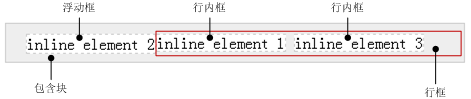

## 格式化

在 CSS 中，有多个格式化概念，其中常见的有：

* 格式化上下文
* 格式化宽度高度
* 基本视觉格式化

### 格式化上下文

格式化上下文，Formatting Context，简称 FC，是页面中一个不影响区域之外其他元素的相对独立的渲染区域，有一套渲染规则，决定了其子元素如何布局，以及和其他元素之间的关系和作用

常见的格式化上下文包括：

- BFC，Block Formatting Context
- IFC，Inline Formatting Context
- GFC（CSS 3中定义）
- FFC（CSS 3中定义）

#### BFC

BFC，Block Formatting Context，块级格式化上下文，只有块级盒子参与，它规定其内部的块级盒子如何布局。

**需要注意的是：**IE 不支持 BFC 标准，但 IE 有 Layout 属性，Layout 和 BFC 基本是等价的。为了兼容 IE，需要触发 BFC 时，还需要使用 zoom: 1 来触发 IE 浏览器的 Layout。

##### 创建

当元素具备下列条件之一时，会创建块级格式化上下文：

- 根元素或包含根元素的元素，即 html 或 body 元素默认自动创建BFC
- 浮动元素（float 不为 none ）
- 绝对定位元素（position 为 absolute/fixed）
- overflow 不为 visible 的块元素
- 行内块元素（display 为 inline-block）
- 弹性元素（display为 flex 或 inline-flex元素的直接子元素）
- 网格元素（display为 grid 或 inline-grid 元素的直接子元素）
- 表格类元素
  - 表格单元格（display为 table-cell，HTML表格单元格默认为该值）
  - 表格标题（display 为 table-caption，HTML表格标题默认为该值）
  - 匿名表格单元格元素（元素的 display为 table、table-row、 table-row-group、table-header-group、table-footer-group（分别是HTML table、row、tbody、thead、tfoot的默认属性）或 inline-table）
- ...

##### 特征

BFC 具有以下特征：

1. BFC 元素本身
   1. BFC 元素的 margin-box 的左边， 与包含块 border-box 的左边相接触 (对于从左往右的格式化，否则相反)。即使存在浮动也是如此
   2. BFC元素创建一个隔离的独立容器，容器里面的子元素不会影响到外面的元素
2. BFC 子元素
   1. 内部的 Box（盒子）会在垂直方向上一个接一个地放置
   2. 内部的相邻 Box 垂直方向上的 margin 会发生合并
   3. BFC 元素不与子元素的 margin 发生合并
3. 与 float box 的关系
   1. BFC 区域不与 float box 重叠
   2. BFC 元素能够识别并包含浮动子元素，计算 BFC 的高度时，浮动元素也参与计算

##### 应用

###### 清除浮动

```
# CSS
.wrap {
    border: 1px solid #000;
}
.item {
    width: 100px;
    height: 100px;
    float: left;
    background: #eee;
}

# HTML
<div class="wrap">
    <div class="item"></div>
</div>
```

由于 wrap 容器内元素浮动，**脱离了文档流**，所以容器只剩下 2px 的边距高度。

基于 BFC 特征 3-2，触发 wrap 容器的 BFC，比如，为 wrap 容器添加 `overflow: hidden` 属性，可使得 wrap 容器包裹浮动元素。

###### 外边距合并

基于 BFC 特征 2-2，同一个 BFC 内相邻元素垂直方向上的 margin 会发生合并。

```
# CSS
div {
    width: 100px;
    height: 100px;
    background: lightblue;
    margin: 100px;
}

# HTML
<div></div>
<div></div>
```

两个 div 元素的垂直间距为 100px，而不是 200px，因为发生了合并。如果不希望合并，可以将元素置于不同的BFC 下：

```
# CSS
.container {
    overflow: hidden;
}
p {
    width: 100px;
    height: 100px;
    background: lightblue;
    margin: 100px;
}

# HTML
<div class="container">
    <p></p>
</div>
<div class="container">
    <p></p>
</div>
```

由于 p 元素处于不同的 BFC 内，所以垂直间距是 200px，不是合并后的 100px。

###### 浮动元素覆盖

```
# CSS
.left {
    height: 100px;
    width: 100px;
    float: left;
    background: lightblue;
}
.back {
    width: 200px;
    height: 200px;
    background: #eee;
}

# HTML
<div class="left">我是一个左浮动的元素</div>
<div class="back">
	我是一个没有设置浮动,也没有触发 BFC 元素, width: 200px; height:200px; background: #eee;
</div>
```


基于 BFC 特征 1-1，left 元素左侧与其父元素左边缘对其；同时，left 元素脱离普通流，导致按正常流布局的 back 元素左侧也与父元素左边缘对其。所以，left 元素和 back 元素重叠。

但是，因为浮动元素具有默认的文字环绕属性，back 元素的文字需要从浮动元素 left 的右侧开始排布。可以通过给 back 添加 `margin-left: 10px;` 来检测这种行为，效果如图：


所以，当需要 left 元素右侧和 back 元素有一定间距时，最好是在 left 上设置 margin-right，而不是在 back 上设置 margin-left。

如果不想 left 元素和 back 元素重叠 ，可以基于 BFC 特征 3-1，触发 back 的 BFC。比如，back 添加 `overflow: hidden;` ，如图：


###### 多列布局BFC

如果多列布局需占满了整个容器的宽度，在某些浏览器中最后一列有时候会被挤到下一行。可能的原因是：浏览器舍入（取整）了列的宽度使得宽度总和超过了容器的宽度。要解决这个问题，可以在列的布局中建立了一个新的BFC，它会在前一列填充完之后占据剩余空间。

```
# CSS
.column {
    width: 31.33%;
    background-color: green;
    float: left;
    margin: 0 1%;
}
.column:last-child {
    float: none;
    overflow: hidden;
}

# HTML
<div class="container">
    <div class="column">column 1</div>
    <div class="column">column 2</div>
    <div class="column">column 3</div>
</div>
```

##### 参考

- https://developer.mozilla.org/zh-CN/docs/Web/Guide/CSS/Block_formatting_context
- https://zhuanlan.zhihu.com/p/25321647
- https://juejin.im/post/5909db2fda2f60005d2093db
- https://www.w3cplus.com/css/understanding-block-formatting-contexts-in-css.html
- https://www.jianshu.com/p/66632298e355

#### IFC

IFC，Inline Formatting Context，行内格式化上下文，只有行内框参与的格式化上下文，它规定了其内部的行内框如何布局。

##### 概念

```
<p style="background-color:silver; font-size:30px;">
    TEXT1
    <span style="border:3px solid blue;">text in span</span>
    great1
    <em style="border:3px solid red;">thx a lot</em>
    bee
    <strong style="border:3px solid green;">give me 5!</strong>
    Aloha!
</p>
```


###### 行框

包含其内部所有行内框的最高点和最低点的最小的框，即：

* 行框上边界位于最高行内框的上边界
* 行框下边界位于最低行内框的下边界

##### 创建

当块容器盒不包括任何块级盒子时，就会创建一个行内格式化上下文（IFC）。

##### 特征

IFC 具有以下特征：

- 水平方向上

  - 多个行内框不能共存于一个行框时，会被分到两个或多个垂直堆叠的行框里

  - 行框的宽度由包含块和浮动情况决定，当存在浮动框时，浮动框会处于包含块边界与行框边界之间，行框的宽度会随之减小

    

  - 行内框一个接一个的在水平方向摆放，当容器宽度不够时会换行

  - 行内框之间的水平 margin、border 和 padding 都有效

  - 行内框的总宽度小于匿名行盒的宽度时，那么水平方向排版由 text-align 属性来决定

- 垂直方向上

  - 行内框的对齐方式由 vertical-align 控制，默认对齐为 baseline
  - 行内框的高度计算
    - 可替换元素、inline-block 和 inline-table 元素，取其 margin box 的高度
    - 行内盒子，取其 line-height
  - 行盒的高度由内部子元素中实际高度最高的盒子计算出来

需要注意的是：

* IFC 的环境中不能存在块级元素，否则，IFC 会被破坏掉并变成 BFC，而块级元素前后的元素或文本将会各自自动产生一个匿名块盒其包围

##### 参考

* http://layout.imweb.io/article/formatting-context.html
* http://www.ayqy.net/doc/css2-1/visuren.html#inline-formatting
* https://blog.csdn.net/ruoyiqing/article/details/39009973

### 格式化宽度高度


格式化宽度/高度仅出现在“绝对定位模型”中，即 position 属性值为 absolute 或 fixed 的元素中。

默认情况下，绝对定位的元素尺寸表现为“收缩到最小”，宽高/高度由内部尺寸决定。但是，对于不可替换元素，当 left/right 或 top/bottom 对立方位属性值同时存在时，元素的宽度/高度表现为“格式化宽度/高度”，其宽度/高度大小相对最近具有定位特性（position 不为 static）的祖先元素计算。

```
div {
    left: 20px;
    right: 20px;
    position: absolute;
}
```

“格式化宽度/高度”具有完全的流体特性，也就是 margin、border、 padding 和 content 内容区域同样会自动分配水平(和垂直)空间。

#### 应用

1. 元素垂直居中

   当 margin 为 auto 时，块级元素水平居中是因为正常流中的盒模型在水平方向上具有自动填充特性，即流体特性；但在垂直方向上没有！垂直居中的方式之一就是触发元素垂直方向上的自动填充特性。

   

   ```
   # CSS
   .father {
       width: 300px;
       height: 200px;
       position: relative;
       border: 1px dashed black;
   }
   .son {
       top: 0;
       left: 0;
       right: 0;
       bottom: 0;
       position: absolute;
       margin: auto;
       width: 100px;
       height: 50px;
       border: 1px solid red;
   }
   
   # HTML
   <div class="father">
       <div class="son"></div>
   </div>
   ```


### 基本视觉格式化

> 内容来自《CSS权威指南》

CSS 基本视觉格式化是一套完整的 CSS 基本元素视觉显示规则，它的基本知识结构框架如图：


从格式化的对象上，基本视觉格式化可以分为两类：

* 块级元素，块级元素又有两方面的格式化：
  * 水平格式化
  * 垂直格式化
* 行内元素，行内元素需要进行行内格式化，行内格式化同样可以根据格式化对象的不同分为：
  * 行内可替换元素格式化
  * 行内不可替换元素格式化

#### 块级元素

##### 水平格式化

在水平格式化中，父元素 width 往往是确定的，通过计算可以得到内部子元素水平方向上的尺寸，即尺寸的确定是由外而内的，外部的尺寸决定内部的布局。

所以，掌握下面的公式可解决大部分内部元素尺寸问题：

```
width of ParaentElement = 
margin-left + border-left + padding-left +
width + 
padding-right + border-right + margin-right
```

* 使用 auto

  在 width、padding、border、margin 属性中，值一般为默认数值或设置的特定数值，只有 width、margin-left、margin-right 能够被设置为 auto，且三者的优先级为：

  ```
  width > (margin-left = margin-right)
  ```

  优先级高的属性将优先占据父元素 width 中尚未被占用的宽度，具体规则如下：

  * 如果三个值均不为 auto， 在 ltr 语言中，用户代理会强制将 margin-right 置为 auto
  * 如果有一个值为 auto，被设置为 auto 的属性会基于上面的公式自行确定长度
  * 如果有两个值为 auto
    * 如果 margin-left 和 margin-right 为 auto，该元素水平居中
    * 如果两个 auto 中包含 width，被设置为 auto 的 margin 值将会等于 0
  * 如果三个值均为 auto，则 margin-left 和 margin-right 都会等于 0

* 负边距

  一般的问题可以通过公式来解决

  * 示例1

    

    ```
    # CSS
    .box {
        width: 300px;
        margin: auto;
        outline: 1px dotted red;
    }
    .box > p {
        margin: 0 -100px 0 0;
        background: #eeeeee;
    }
    
    # HMTL
    <div class="box">
        <p>测试文字，测试文字，测试文字，测试文字，测试文字，测试文字，测试文字，测试文字，测试文字，测试文字，测试文字，测试文字，</p>
    </div>
    ```

    其中，p 元素宽度计算：

    ```
    300 = width + (-100) => width = 400
    ```

    p 元素宽度为 400px，超出父元素 box 元素。

  * 示例2

    ```
    # CSS
    .box {
        width: 300px;
        margin: auto;
        outline: 1px dotted red;
    }
    .box > p {
        width: 400px;
        background: #eeeeee;
    }
    ```

    CSS 更改为如上时，得到的效果与示例1相同，此时未设置的 margin-right 值其实是 -100px。

* 百分数

  * width 的百分数值均以父元素宽度作为参考
    * 元素绝对定位时，相应的父元素尺寸取自 padding-box
    * 元素非绝对定位时，相应的父元素尺寸取自 content-box
  * margin、padding 的百分数值均以元素自身宽度作为参考

##### 垂直格式化

一定意义上，垂直方向的高度同样存在水平格式化类似的计算公式：

```
height of ParaentElement = 
margin-top + border-top + padding-top +
height + 
padding-bottom + border-bottom + margin-bottom
```

不过，在垂直格式化中，除非父元素被设置了特定 height，否则，父元素 height 通常都是 auto 的。此时，内部元素尺寸由于自身内容的增加而变高，父元素高度也被动的实时变化，即尺寸的确定是由内而外的，内部的尺寸决定外部的高度。

* 使用 auto

  如果块级正常流元素高度设置为 auto，并且只有块级子元素：

  * 默认高度是从最高块级子元素的**上边框边界**到最低块级子元素的**下边框边界**
  * 若块级元素本身有 padding 或者是 border 时，其高度为从最高子元素**上外边距边界**到最低子元素**下外边距边界**，加上块级元素本身的 padding-top、padding-bottom、border-top 和 border-bottom

  测试如下代码：

  

  ```
  # CSS
  .box {
      background: silver;
  }
  p {
      margin: 2em 0;
  }
  
  # HTML
  <div class="box">
      <p>测试文字，测试文字，测试文字，测试文字，测试文字</p>
  </div>
  <div class="box" style="border-top: 1px solid; border-bottom: 1px solid;">
      <p>测试文字，测试文字，测试文字，测试文字，测试文字</p>
  </div>
  ```

* 外边距合并

  同一个 BFC 中的相邻子元素 margin 会合并，但是，BFC 元素本身不再与子元素发生 margin 合并

#### 行内元素

行内元素的基本布局：

```
{ 行框 { 行内框 { 内容区 } } }
```

其中：

* 行框

  包含该行中出现的行内框的最高点和最低点的最小框，每一个行框内会包含若干行内框

* 行内框

  对于不可替换元素：

  * 元素行内框高度等于 line-height
  * 外边距不会对行内框的高度产社任何影响，但会影响到行内框的宽度

  对于可替换元素：

  * 元素框高度等于内容区高度

* 内容区

  对于不可替换元素，内容区是各个字符的 em 框串在一起的框

  对于可替换元素，内容区是元素固有高度+可能有的内外边距和边框。

##### 行内不可替换元素

基本规则：

* 内容区高度由 font-size 值确定

* 行内框高度由 line-height 值确定。当 line-height 值小于 font-size 时，行间距会取得负值

  ```
  行间距 = line-height - font-size
  ```

  当行间距为负值时，元素行内框的顶端在内容区内部。

##### 行内可替换元素
基本规则：

* 内边距会在具体内容外插入空间
* 设置负外边距会减少行内框的大小
* 默认情况下，行内可替换元素位于基线上

#### 参考

* https://spades-s.github.io/2018-03-05-css%E6%9D%83%E5%A8%81%E6%8C%87%E5%8D%97-%E8%A7%86%E8%A7%89%E6%A0%BC%E5%BC%8F%E5%8C%96/


