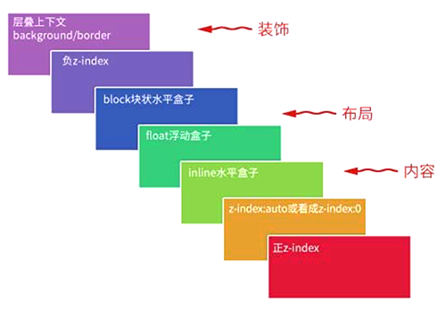

## 层叠上下文

格式化上下文是页面中一个独立的**渲染区域**，而层叠上下文是页面中一个独立的**渲染层级**，即相对于该上下文之外的元素，层叠上下文在 Z 轴方向上，作为一个整体，表现为同一层级。

### 创建条件

当元素具备下列条件之一时，会创建层叠上下文：

* 根元素（html 元素）
* opacity 属性值小于 1 的元素
* position 属性值不是默认 static 的元素
  * 非固定定位（fixed ）需要同时满足 z-index 值不为默认值 auto
* CSS 3 新属性
  * z-index 属性值不为 auto 的 flex 项目 (flex item)，即 display 为 flex/inline-flex 的元素的子元素
  * transform 属性值不为 none 的元素
  * mix-blend-mode 属性值不为 normal 的元素
  * filter 属性值不为 none 的元素
  * perspective 属性值不为 none 的元素
  * isolation 属性被设置为 isolate 的元素
  * 在 will-change 中指定了任意 CSS 属性，即便你没有直接指定这些属性的值（参考[这篇文章](https://dev.opera.com/articles/css-will-change-property/)）
  * -webkit-overflow-scrolling 属性被设置 touch 的元素

个人认为，创建层叠上下文的元素往往具有同文档元素明显的视觉差异或动态的视觉变化，需要独立渲染。

### 层叠顺序

HTML 元素的层叠顺序的计算规则：

* **同一层叠上下文所有元素作为一个整体，以层叠上下文创建元素为准，参与父层叠上下文元素的层叠排序。**层叠排序规则：

  

  * 第一层，父层叠上下文元素的 background 和 border
  * 第二层，z-index 为负数的定位元素
  * 第三层，块级盒子，display 为 block 的元素
  * 第四层，浮动盒子，具有 float 属性的元素
  * 第五层，行内盒子或行内块级盒子，display 为 inline/inline-block/inline-table 的元素
  * 第六层，z-index 为 0/auto 的定位元素
  * 第七层，z-index 为正数的定位元素

* 子层叠上下文内扩展新的子层，同样按照上图计算层叠顺序，如此递归，直至最内层子元素

同时，需要注意的是：

* 同一层叠上下文作为一个整体，对外表现为同一层级，故不同父层叠上下文内的元素比较层叠顺序没有意义
* 如果两个元素具有相同的层叠顺序，位置在后面的元素覆盖在前面的元素之上
* 层叠上下文可以阻断元素的混合模式 **?**

### 最佳实践

基于层叠规则，定位元素即便不设置 z-index，也拥有相对较高的层叠水平，避免多余不必要的 z-index 带来不断增加的 z-index 值！

### 应用举例

1. 实例

   ```
   <!-- 美女在上 -->
   <div style="position:relative; z-index:auto;">
       <!-- 美女 -->
       
   </div>
   <div style="position:relative; z-index:auto;">
       <!-- 美景 -->
       
   </div>
   ```

   **美女在上**：因为外层 div 元素不创建层叠上下文，所以两个内层 img 元素属于同一父层叠上下文元素，进行层叠计算，z-index 值为 2 的美女图片在上

   ```
   <!-- 美景在上 -->
   <div style="position:relative; z-index:0;">
       <!-- 美女 -->
       
   </div>
   <div style="position:relative; z-index:auto;">
       <!-- 美景 -->
       
   </div>
   ```

   **美景在上**：第一个 div 元素创建层叠上下文，第二个 div 元素不创建，所以，第一个 div 元素和第二个 div 内的 img 元素属于同一父层叠上下文元素，进行层叠计算，z-index 值为 1 的美景图片在上

   ```
   <!-- 美女在上 -->
   <div style="position:relative; z-index:2;">
       <!-- 美女 -->
       
   </div>
   <div style="position:relative; z-index:auto;">
       <!-- 美景 -->
       
   </div>
   ```

   **美女在上**：第一个 div 元素创建层叠上下文，第二个 div 元素不创建，所以，第一个 div 元素和第二个 div 内的 img 元素属于同一父层叠上下文元素，进行层叠计算，z-index 值为 2 的第一个 div 层叠上下文整体在上

   ```
   <!-- 美景在上 -->
   <div style="position:relative; z-index:0;">
       <!-- 美女 -->
       
   </div>
   <div style="position:relative; z-index:0;">
       <!-- 美景 -->
       
   </div>
   ```

   **美景在上**：第一个 div 元素和第二个 div 元素均创建层叠上下文，同在一个父层叠上下文内，进行层叠计算，两者层叠优先级相同，故位于后面的 div 元素层级较高

   ```
   <!-- 美女在上 -->
   <div style="position:relative; z-index:1;">
       <!-- 美女 -->
       
   </div>
   <div style="position:relative; z-index:0;">
       <!-- 美景 -->
       
   </div>
   ```

   **美女在上**：还说啥呢？

2. 实例

   

   ```
   # CSS
   div {
       width: 200px;
       background: #ccc;
       /* filter: blur(5px); */
       /* opacity: 0.5; */
       /* transform: scale(1); */
       /* mix-blend-mode: darken; */
   }
   img {
       width: 100%;
       right: -100px;
       position: relative;
       z-index: -1;
       vertical-align: top;	/* 放置图片底部 5px */
   }
   
   # HTML
   <div>
       
   </div>
   ```

   div 元素与其内部创建层叠上下文的 img 元素同属一个父层叠上下文，进行并列层叠计算，display 为 block 的 div 元素层叠顺序较高，所以覆盖遮挡了 z-index 为负数的 img 元素

   

   修改 div 元素样式，比如增加 transform 属性，使 div 元素也创建层叠上下文，依据层叠顺序计算规则，创建层叠上下文元素的 background 和 border 层级最低，所以 div 元素背景将不再遮挡图片

### 参考

* https://www.zhangxinxu.com/wordpress/2016/01/understand-css-stacking-context-order-z-index/


