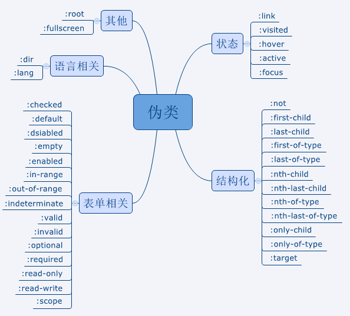
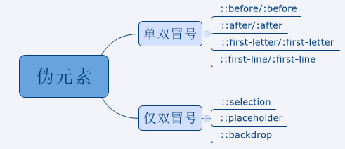

## 伪类和伪元素

CSS 引入伪类和伪元素的概念是为了格式化文档树以外的信息。也就是说，伪类和伪元素是用来修饰不在文档树中的部分，比如，一句话中的第一个字母，或者是列表中的第一个元素（注：**不明白？**）。

### 伪类

伪类用于当元素处于某种状态或结构位置时，为其添加对应的样式。

其可以分为五类：

* 状态伪类
* 结构化伪类
* 表单相关
* 语言相关
* 其它

### 伪元素

伪元素用于创建一些不在文档树中的元素，并为其添加样式。

### 参考

* https://segmentfault.com/a/1190000013737796

