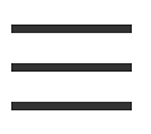
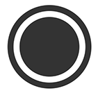
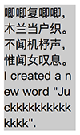
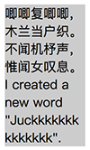
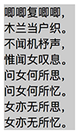
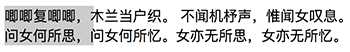
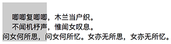
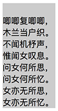

## 属性学习


### B

#### background-attachment

background-attachment 属性设置背景图像是否固定或者随着页面的其余部分滚动。支持的属性值：

* scroll，默认值，背景图像会随着页面其余部分的滚动而移动
* fixed，当页面的其余部分滚动时，背景图像不会移动。

#### background-clip

background-clip 属性规定背景的绘制区域。支持属性值：

* border-box，背景被裁剪到边框盒
* padding-box，背景被裁剪到内边距框
* content-box，背景被裁剪到内容框

##### 应用

1. CSS 实现如图菜单标识 - 三道横杠

   

   ```
   # HTML
   <i class="icon-menu"></i>
   
   # CSS
   .icon-menu {
       display: inline-block;
       width: 140px;
       height: 10px;
       padding: 35px 0;
       border-top: 10px solid;
       border-bottom: 10px solid;
       background-color: currentColor;
       background-clip: content-box;
   }
   ```

2. CSS 实现如图实心圆环

   

   ```
   # HTML
   <i class="icon-dot"></i>
   
   # CSS
   .icon-dot {
       display: inline-block;
       width: 100px;
       height: 100px;
       padding: 10px;
       border: 10px solid;    
       border-radius: 50%;
       background-color: currentColor;
       background-clip: content-box;
   }
   ```

#### background-image


##### 对比 \

两者的区别：

* 语义化

  \ 是 HTML 标签，语义明确；background-image 是语义无关的。

* 是否占位

  \ 是内容块级元素（HTML 中占位）；background-image 是装饰性元素（HTML 中不占位）

* 加载顺序

  **\ 作为 DOM 结构的一部分，会优先解析并加载；尽管 CSS 文件通常会被放在 \<head> 标签中优先加载，但 HTML 中元素的 background-image 属性依然会在 DOM 元素都解析加载完成后才会加载，所以首屏图片采用 \ 标签会有更好的性能。**

* 加载性能

  参考文章 2 中比对了使用 \ 标签和 background-image 加载图片的速度和动画性能， \ 标签要优于   background-image，尤其是动画性能方面，有时更加明显。**所以，主要图片和动画图片应优先选用  \ 标签。 **

* SEO 优化

  带有 alt 属性的 \ 标签，更有利于辅助阅读和 SEO。

###### 参考

* https://www.cnblogs.com/ivy-xu/p/6638459.html
* https://www.yudouyudou.com/jiaochengheji/Html_css/531.html
* https://juejin.im/post/5ade866051882567370604a2


#### border-image

border-image 属性允许在元素的边框上绘制图像。它是一个符合属性，支持 5 个分属性。语法：

```
border-image: <border-image-source> 
							|| <border-image-slice> 
							[ / <border-image-width> | / <border-image-width>? / <border-image-outset> ]? 
							|| <border-image-repeat>
```

需要注意的是：

* border-image-source 的值为 none 或者图片不能显示，则将应用 border-style
* 可参考 https://aotu.io/notes/2016/11/02/border-image/index.html

##### border-image-source

border-image-source 属性声明元素的边框图片。语法：

```
border-image: none | <image>
```

##### border-image-slice

border-image-slice 属性声明图片的分割方式，即通过 top、right、bottom、left 顺序的四条线将边框图片分割成 9 块，然后分别应用到边框对应的区域。语法：

```
bordre-image-slice [<number> | <percentage>]{1,4} && fill?
```

需要注意的是：

* top、right、bottom、left 值分别是到对应边的距离，单位像素，设置不带单位的数值或百分比
* fill 用于指定使用图片最中间的分割块作为元素的背景

##### border-image-width

border-image-width 属性声明图像边框宽度。语法：

```
border-image-width: [ <length> | <percentage> | <number> | auto ]{1,4}
```

* length，带单位的尺寸值
* percentage，百分比
* number，不带单位的数字，它表示 border-width 的倍数
* auto，使用 border-image-slice 的值

需要注意的是：

* border-image-width 大于 border-width 时，边框图片将向内部 (padding/content) 扩展

##### border-image-outset

border-image-outset 属性声明边框图像可超出边框盒的大小，通过该值可以将边框图片区域延伸到 border-box 之外。语法：

```
border-image-outset: [ <length> | <number> ]{1,4}
```

##### border-image-repeat

border-image-repeat 属性声明 slice 后的图片如何填充边框。语法：

```
border-image-repeat: [ stretch | repeat | round | space ]{1,2}
```

* stretch，拉伸图片以填充边框，默认值
* repeat，平铺图片以填充边框
* round，平铺图像，当不能整数次平铺时，根据情况放大或缩小图像
* space，平铺图像 ，当不能整数次平铺时，会用空白间隙填充在图像周围，不会放大或缩小图像


### M


#### mask

mask 属性用于设置一张半透明的遮罩图片，以部分显示下方被遮罩的内容。

其语法与 background 是相仿的，与 background 对应的 6 个属性在 webkit/blink 内核都能完全支持，且语法与 background 相通：

| mask            | background            |
| :-------------- | :-------------------- |
| mask-clip       | background-clip       |
| *mask-composite | -                     |
| mask-image      | background-image      |
| *mask-mode      | -                     |
| mask-origin     | background-origin     |
| mask-position   | background-position   |
| mask-repeat     | background-repeat     |
| mask-size       | background-size       |
| -               | background-attachment |
| -               | background-color      |

mask 属性的常用简化写法：

```
mask: [mask-image] [mask-repeat] [mask-position] / [ mask-size];

// 部分安卓机 background 简写不支持 background-size，需单独写 background-size
// 同理，这部分安卓机也需要单独写 mask-size，所以 mask 的简写应该是：
mask: [mask-image] [mask-repeat] [mask-position];
mask-size: [mask-size];
```


##### 参考

* https://aotu.io/notes/2016/10/19/css3-mask/index.html


#### mask-clip

mask-clip 确定受遮罩影响的区域。支持的属性值：

* content-box：绘制边界为 content-box
* padding-box：绘制边界为 padding-box
* border-box：绘制边界为 border-box
* margin-box：绘制边界为 margin-box

用于 svg 的属性值：

* fill-box：绘制边界为 object 边界框
* stroke-box：绘制边界为 stroke 边界框
* view-box：绘制边界为 view 边界框


#### mask-image

mask-image 用于设置 mask 遮罩层的图片。支持的属性值类似于 background-image：

* none：此关键字被解释为透明的黑色图像层
* \<mask-source>：对 \<mask> 或 CSS 图像的 \<url> 引用
* \<image>：用作遮罩图像层的图像值

```
/* Keyword value */
mask-image: none;

/* <mask-source> value */
mask-image: url(masks.svg#mask1);

/* <image> values */
mask-image: linear-gradient(rgba(0, 0, 0, 1.0), transparent);
mask-image: image(url(mask.png), skyblue);

/* Multiple values */
mask-image: image(url(mask.png), skyblue), linear-gradient(rgba(0, 0, 0, 1.0), transparent);

/* Global values */
mask-image: inherit;
mask-image: initial;
mask-image: unset;
```


#### mask-position

mask-position 为 mask 图像设置相对于 mask-origin 的初始位置。支持的属性值类似于 background-position：

* \<position>：1-4 个代表有关元素框边缘的 2D 位置值。

```
/* Keyword values */
mask-position: top;
mask-position: bottom;
mask-position: left;
mask-position: right;
mask-position: center;

/* <position> values */
mask-position: 25% 75%;
mask-position: 0px 0px;
mask-position: 10% 8em;

/* Multiple values */
mask-position: top right;
mask-position: 1rem 1rem, center;

/* Global values */
mask-position: inherit;
mask-position: initial;
mask-position: unset;
```


#### mask-repeat

mask-repeat  设置蒙版图片的重复方式。遮罩图片可以沿水平和垂直两个轴重复，也可以完全不重复。支持的属性值类似于 background-repeat：

* \<repeat-style>
  * repeat：图片无间距重复以覆盖整个蒙版绘画区域，边缘重复图片可能会被剪裁
  * space：图片尽可能多地重复以覆盖整个蒙版绘画区域，图片可能有间距但边缘重复图片不会被剪裁
  * round：图片无间距重复以覆盖整个蒙版绘画区域，图片不会被剪裁但会被缩放
  * no-repeat：图片不重复

单值设置与完整双值的对应关系：

| 单值      | 双值                |
| --------- | ------------------- |
| repeat-x  | repeat no-repeat    |
| repeat-y  | no-repeat repeat    |
| repeat    | repeat repeat       |
| spac      | space space         |
| round     | round roun          |
| no-repeat | no-repeat no-repeat |


#### mask-size

mask-size 指定蒙版图片的大小。支持的属性值类似于 background-size：

* \<length>：将图片按比例缩放到指定长度。
* \<percentage>：将蒙版图片缩放到蒙版定位区域的指定百分比，该百分比由 mask-origin 的值确定
* auto：在相应方向上缩放蒙版图片以保持其固有比例
* contain：尽可能缩放图片并保持图片宽高比，图片不被裁剪
* cover：尽可能缩放图片并保持图片长宽比，图片有可能被裁剪


### P

#### pointer-events
pointer-events 属性用于控制 HTML 元素的指针事件。支持的属性值：

* auto：启用指针事件

* none：禁用指针事件

  注意事项：

  * 当禁用指针的的元素有子/父元素时，在时间冒泡/捕获阶段，事件将依然会在其子/父元素触发
  * 当禁用指针的的元素的下方有元素时，鼠标事件会“穿透”该元素而触发其下面元素的事件
  * 禁用指针事件可以提高元素的滚动性能，因为不禁用时引擎会检查元素事件是否应该被执行

  应用场景：

  * 在一些特殊时刻，比如 tab 标签已经选中，或者点击会触发 ajax 请求，但上一次触发的请求还未完成时
  * 通过遮罩元素实现特殊效果，但又不想影响被遮罩元素的事件

还有专用于 \<svg> 元素的事件：

* visiblepainted
* visiblefill
* visiblestroke
* visible
* painted
* fill
* stroke
* all

##### 参考

* https://developer.mozilla.org/zh-CN/docs/Web/CSS/pointer-events
* https://juejin.im/post/59bb2ec16fb9a00a5a31deab


### T

#### table-layout

table-layout 属性用来设置 table 布局（单元格、行、列）算法规则。支持的属性值：

* automatic，默认，列的宽度由列单元格中没有折行的最宽的内容决定

  注意，此算法效率较低，因为它需要获取表格所有内容后才能决定布局

* fixed，固定，列宽仅由列宽度、表格宽度、表格边框宽度、单元格间距决定，与单元格的内容无关

  相对于 automatic，用户代理在接收到第一行后就可以对表格进行布局，进而显示表格

* inherit，继承，从父元素继承该属性值

  注意，所有 IE 浏览器均不支持该属性值

### W

#### will-change

will-change 属性告知浏览器元素发生变化的地方，这样浏览器可以在元素属性真正发生变化之前，将部分复杂计算工作提前准备好，以提高性能。支持的属性值：

* auto，不指定变化属性，浏览器需要自己去猜，然后使用浏览器经常使用的一些常规方法优化
* contents，元素内容会发生改变或产生动画
* scroll-position，元素滚动位置会发生变化，即会发生滚动
* \<custom-ident>，开发者希望在不久后改变指定的属性名或者使之产生动画。如果属性名是简写，则代表所有与之对应的简写或者全写的属性。

注意事项：

* 提前告知，如果需要使用 will-change，需要提前一点时间设置，浏览器需要准备
* 不要过分使用，如果元素本身不存在性能问题，不要使用；逼不得已使用时，不要一开始就设置该属性，且使用完成时及时清除。因为 will-change 比较占用资源，过分使用反而适得其反。

正确使用：

1. 在伪类中使用，比如 :hover 时设置，这样鼠标移除时可及时清除

   ```
   .will-change-parent:hover .will-change {
   	will-change: transform;
   }
   
   .will-change {
   	transition: transform 0.3s;
   }
   
   .will-change:hover {
   	transform: scale(1.5);
   }
   ```

2. 使用 JS 添加 will-change，事件或动画完毕，及时清除

   ```
   dom.onmousedown = function() {
       target.style.willChange = 'transform';
   };
   
   dom.onclick = function() {
       // target动画哔哩哔哩...
   };
   
   target.onanimationend = function() {
       // 动画结束回调，移除will-change
       this.style.willChange = 'auto';
   };
   ```

#### word-break

word-break 属性指定怎样在单词内断行。支持的属性值：

* normal

  使用默认的断行规则。

* break-all

  

  对于non-CJK (CJK 指中文/日文/韩文) 文本，可在任意字符间断行

* keep-all

  CJK 文本不断行。 Non-CJK 文本表现同 normal

#### word-wrap

word-wrap 属性设置长单词或 URL 地址换行规则。由于与 word-break 过于接近，CSS 3 中改名为 overflow-wrap（浏览器支持度还不够），支持的属性值：

* normal

  只在允许的断字点换行（浏览器保持默认处理）

* break-word

  

  在长单词或 URL 地址内部进行换行。与 `word-break: break-all` 的区别：

  * word-break: break-all，断开一切，不论单词长短，相对行宽控制较一致，较为美观
  * word-wrap: break-word，更温柔一些，主要截断相对较长的单词，行宽控制不是很一致，美观度较差

#### white-space

white-space 属性设置如何处理元素中的空白。

```
# HTML
<div class="test">
    唧唧复唧唧，木兰当户织。
    不闻机杼声，惟闻女叹息。<br/>问女何所思，问女何所忆。女亦无所思，女亦无所忆。
</div>

# CSS
.test {
    width: 100px;
    background: #ccc;
    white-space: normal;
}
```

支持的属性值：

* normal

  

  合并换行符、空格、制表符，文字作必要换行

* nowrap

  

  合并换行符、空格、制表符，文字不作必要换行

* pre

  

  不合并换行符、空格、制表符，文字不作必要换行

* pre-wrap

  

  不合并换行符、空格、制表符，文字作必要换行

* pre-line

  

  不合并换行符，但合并空格、制表符，文字作必要换行

|          | 换行符 | 空格和制表符 | 文字换行 |
| -------- | ------ | ------------ | -------- |
| normal   | 合并   | 合并         | 换行     |
| nowrap   | 合并   | 合并         | 不换行   |
| pre      | 保留   | 保留         | 不换行   |
| pre-wrap | 保留   | 保留         | 换行     |
| pre-line | 保留   | 合并         | 换行     |

##### 应用

1. 内联元素连续不换行，例如区域滚动

   ```
   # HTML
   <div class="wrap">
       <ul>
           <li></li>
           <li></li>
           <li></li>
           <li></li>
           <li></li>
       </ul>
   </div>
   
   # CSS
   .wrap {
       width: 300px;
       height: 200px;
       overflow-x: scroll;
       overflow-y: hidden;
   }
   
   .wrap ul {
       width: auto;
       display: inline-block;
       white-space: nowrap;
   }
   
   .wrap li {
       display: inline-block;
   }
   
   .wrap li img {
       height: 200px;
       vertical-align: top;
   }
   ```

#### writing-mode

writing-mode 属性定义了文本在水平或垂直方向上如何排布。支持的属性值：

| 属性值        | 说明                                                 |
| ------------- | ---------------------------------------------------- |
| horizontal-tb | 水平方向自上而下的书写方式，即 left-right-top-bottom |
| vertical-lr   | 垂直方向自左而右的书写方式，即 top-bottom-left-right |
| vertical-rl   | 垂直方向自右而左的书写方式，即 top-bottom-right-left |


