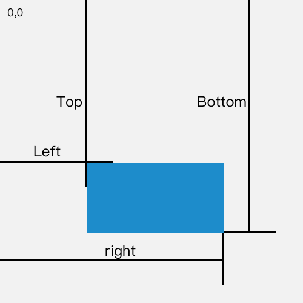

## 各种尺寸

### 屏幕尺寸

通过 BOM 的 screen 对象可以获取屏幕相关的属性，包括屏幕尺寸。但是，使用屏幕尺寸的场景极少，这里仅做了解。屏幕尺寸属性及浏览器支持如下。

| 属性        | 说明                         | IE   | Firefox | Chrome/Safari | Opera |
| ----------- | ---------------------------- | ---- | ------- | ------------- | ----- |
| width       | 屏幕宽度                     | √    | √       | √             | √     |
| height      | 屏幕高度                     | √    | √       | √             | √     |
| availWidth  | **屏幕高度减去系统部件宽度** | √    | √       | √             | √     |
| availHeight | **屏幕宽度减去系统部件高度** | √    | √       | √             | √     |
| availTop    | 未被系统占用最顶部的值       |      | √       | √             |       |
| availLeft   | 未被系统占用最左部的值       |      | √       | √             |       |

Chrome 测试结果：


### 窗口尺寸


窗口尺寸的获取可以通过 window 的属性获取，属性名和浏览器支持如下：

| 属性        | 说明                         | IE9+ | Firefox | Chrome/Safari | Opera |
| ----------- | ---------------------------- | ---- | ------- | ------------- | ----- |
| innerWidth  | 浏览器用于显示页面的区域宽度 | √    | √       | √             | √     |
| innerHeight | 浏览器用于显示页面的区域高度 | √    | √       | √             | √     |
| outerWidth  | 整个浏览器软件界面占用的宽度 | √    | √       | √             | √     |
| outerHeight | 整个浏览器软件界面占用的高度 | √    | √       | √             | √     |

其中：

* 红框表示整个浏览器软件界面区域，蓝框表示浏览器用于显示页面的区域
* IE8- 浏览器的怪异模式中无法使用以上属性获取窗口尺寸
* 当浏览器软件最大化或者缩放时，以上尺寸会随之变化

例如：

```
console.log(`innerWidth × innerHeight -- ${window.innerWidth} × ${window.innerHeight}`);
console.log(`outerWidth × outerHeight -- ${window.outerWidth} × ${window.outerHeight}`);
```

Chrome 控制台输出：

```
innerWidth × innerHeight -- 398 × 626
outerWidth × outerHeight -- 1200 × 737
```

### 元素尺寸

#### 偏移尺寸

偏移尺寸，获取元素在屏幕上占据的可见空间以及相对其最近定位（position 不为 static）祖先元素的位置尺寸。


常用属性：

| 属性         | 说明                                          |
| ------------ | --------------------------------------------- |
| offsetTop    | 元素上边界相对其最近定位祖先元素上边界的距离  |
| offsetLeft   | 元素左边界相对其最近定位祖先元素左边界的距离  |
| offsetWidth  | 元素宽度，包括 padding、border 以及滚动条宽度 |
| offsetHeight | 元素高度，包括 padding、border 以及滚动条高度 |
| offsetParent | 元素距离最近的定位祖先元素                    |

需要注意的是：

* offsetTop 和 offsetLeft 值是相对其最近定位祖先元素的，如果元素所有祖先元素均非定位元素，则最终值是相对视口的定位值
* offsetWidth 和 offsetHeight 获取的是元素在屏幕上占据的可见空间的尺寸，所以，即便是内联元素也能获取宽高

测试代码：


```
# CSS
div {
    margin: 0;
    border: 0;
    padding: 0;
}

.wrap {
    width: 100px;
    height: 100px;
    margin: 100px 0 0 100px;
    padding: 50px;
    outline: 1px dashed #000;
    position: relative;
}

.child {
    width: 50px;
    height: 50px;
    padding: 25px;
    background: red;
    position: absolute;
    top: 50px;
    left: 50px;
}

# HTML
<div id="wrap" class="wrap">
    <div id="child" class="child"></div>
</div>

# JS
let $child = document.getElementById('child');

console.log($child.offsetWidth);	// 100
console.log($child.offsetHeight);	// 100
console.log($child.offsetTop);		// 50
console.log($child.offsetLeft);		// 50
```

 ##### 应用

1. 获取元素在文档页面上的偏移量

   思路：累加元素、定位祖先元素 … 直至最高定位祖先元素的 offsetTop/offsetLeft 值

   ```
   function getElementTop(dom) {
       let offsetTop = dom.offsetTop;
       let parentDom = dom.offsetParent;
   
       while (parentDom !== null) {
           offsetTop += parentDom.offsetTop;
           parentDom = parentDom.offsetParent;
       }
   
       return offsetTop;
   }
   
   function getElementLeft(dom) {
       let offsetLeft = dom.offsetLeft;
       let parentDom = dom.offsetParent;
   
       while (parentDom !== null) {
           offsetLeft += parentDom.offsetLeft;
           parentDom = parentDom.offsetParent;
       }
   
       return offsetLeft;
   }
   ```

#### 客户区尺寸

客户区尺寸，内边距（padding）外边界以内显示区域的尺寸，即不包括边框（border）和滚动条区域。


常用属性：

| 属性         | 说明                                  |
| ------------ | ------------------------------------- |
| clientTop    | border-top                            |
| clientLeft   | border-left                           |
| clientWidth  | padding-left + width + padding-right  |
| clientHeight | padding-top + height + padding-bottom |

需要注意的是：

* 由于没有 widht 和 height，所以行内元素的 clientWidth 和 clientHeight 永远为 0

* 如果存在区域滚动

  * 滚动隐藏的部分不包括在客户区尺寸之内
  * 滚动条的位置在 border 之内，所以，客户区尺寸是减去了滚动条区域后的尺寸
  
  

测试代码：

```
# CSS
.box {
    width: 100px;
    height: 100px;
    border: 25px solid #eee;
    padding: 25px;
}

# HTML
<div id="box" class="box"></div>

# JS
let $box = document.getElementById('box');

console.log($box.clientTop);	// 25
console.log($box.clientLeft);	// 25
console.log(`${$box.clientWidth} × ${$box.clientHeight}`);	// 150×150
console.log(`${$box.offsetWidth} × ${$box.offsetHeight}`);	// 200×200
```

##### 应用

1. 获取浏览器视口大小

   ```
   function getViewSize() {
       let $root = document.documentElement;
       let $body = document.body;	// 早期IE需要使用body获取
   
       return {
           viewW: Math.max($root.clientWidth, $body.clientWidth),
           viewH: Math.max($root.clientHeight, $body.clientHeight)
       }
   }
   ```

#### 滚动尺寸

滚动尺寸，获取包含滚动内容元素的尺寸。


常用属性：

| 属性         | 说明                     |
| ------------ | ------------------------ |
| scrollTop    | 内容区左侧被隐藏的尺寸   |
| scrollLeft   | 内容区顶部被隐藏的尺寸   |
| scrollWidth  | 没有滚动条时，元素总宽度 |
| scrollHeight | 没有滚动条时，元素总高度 |

需要注意的是：

* 由于没有 widht 和 height，所以行内元素的 scrollWidth 和 scrollHeight 永远为 0
* 滚动尺寸主要用于有滚动隐藏内容元素的尺寸，比如文档有滚动时获取完整尺寸宽度/高度
* 当文档/元素不存在滚动时，clientWidth/clientHeight 和 scrollWidth/scrollHeight 的关系在不同浏览器中表现各异

测试代码：

```
# HTML
<span id="span">唧唧复唧唧，木兰生小鸡</span>

# JS
let $span = document.getElementById('span');

console.log($span.offsetWidth);		// 176
console.log($span.offsetHeight);	// 22
console.log($span.clientWidth);		// 0
console.log($span.clientHeight);	// 0
console.log($span.scrollWidth);		// 0
console.log($span.scrollHeight);	// 0
```

```
# CSS
* {
    margin: 0;
    border: 0;
    padding: 0;
}

.wrap {
    height: 1500px;
}

# HTML
<body>
	<div id="wrap" class="wrap"></div>
</body>

# JS
let $doc = document.documentElement;

console.log($doc.clientHeight);		// 689
console.log($doc.scrollHeight);		// 1500
```

##### 应用

1. 获取文档的总高度

   基于上面的讨论，获取文档 clientWidth/scrollWidth、clientHeight/scrollHeight 中的较大值兼容不同场景最好的方式

   ```
   function getDocumentSize() {
       let $doc = document.documentElement;
   
       return {
           width: Math.max($doc.clientWidth, $doc.scrollWidth),
           height: Math.max($doc.clientHeight, $doc.scrollHeight)
       }
   }
   ```

2. 滚动元素到顶部

   注意，即便区域滚动的元素同样可以通过设置 scrollTop 属性的方式滚动元素

   ```
   function scrollToTop(dom) {
       if (dom.scrollTop !== 0) {
           dom.scrollTop = 0;
       }
   }
   ```

#### 其它方式

除了通过元素属性的方法外，还可以通过 JS 提供的 API 获取元素的尺寸。

##### window.getComputedStyle()

window.getComputedStyle() 方法返回包含元素所有计算样式的对象。

示例：

```
let $wrap = document.getElementById('wrap');

console.log(window.getComputedStyle($wrap).width);
```

##### Element.getBoundingClientRect()

Element.getBoundingClientRect() 方法返回元素的大小及其相对于视口的位置。



返回值为一个对象，对象属性：

| 属性   | 说明                             |
| ------ | -------------------------------- |
| width  | 元素宽度                         |
| height | 元素高度                         |
| top    | 元素上边界相对视口原点的垂直距离 |
| left   | 元素左边界相对视口原点的水平距离 |
| right  | 元素右边界相对视口原点的水平距离 |
| bottom | 元素下边界相对视口原点的垂直距离 |


